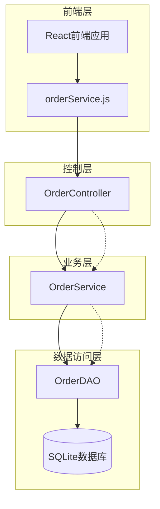
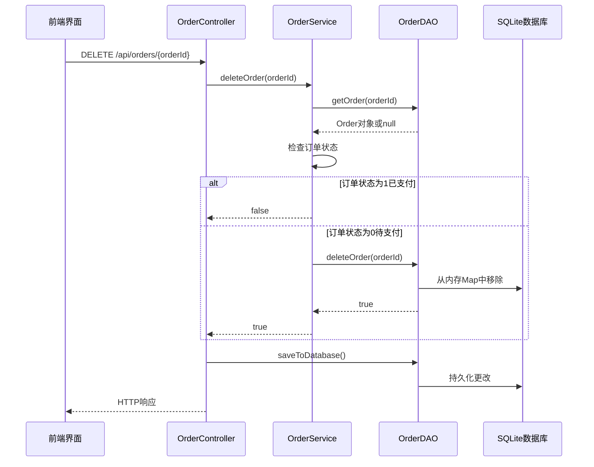
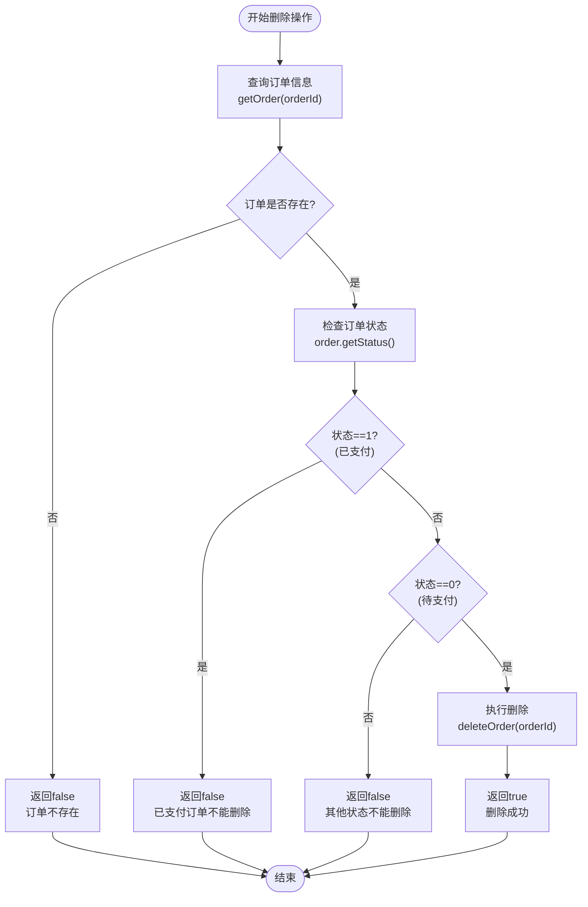
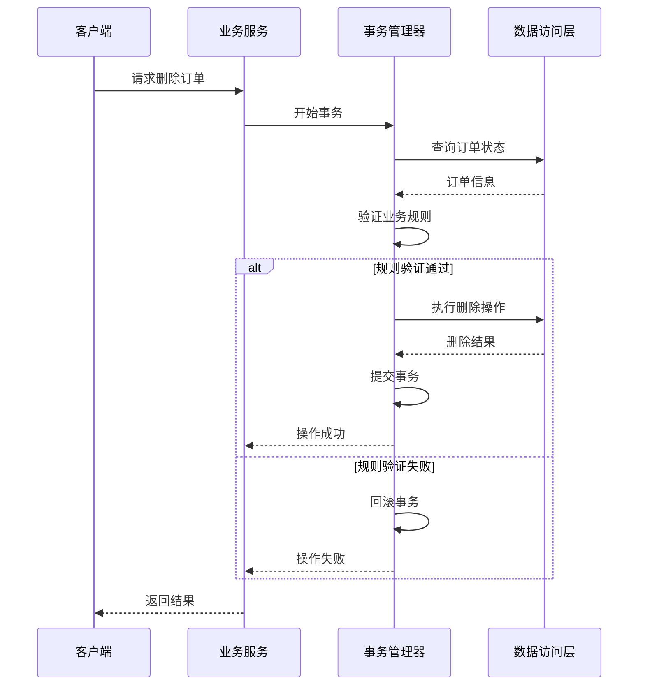
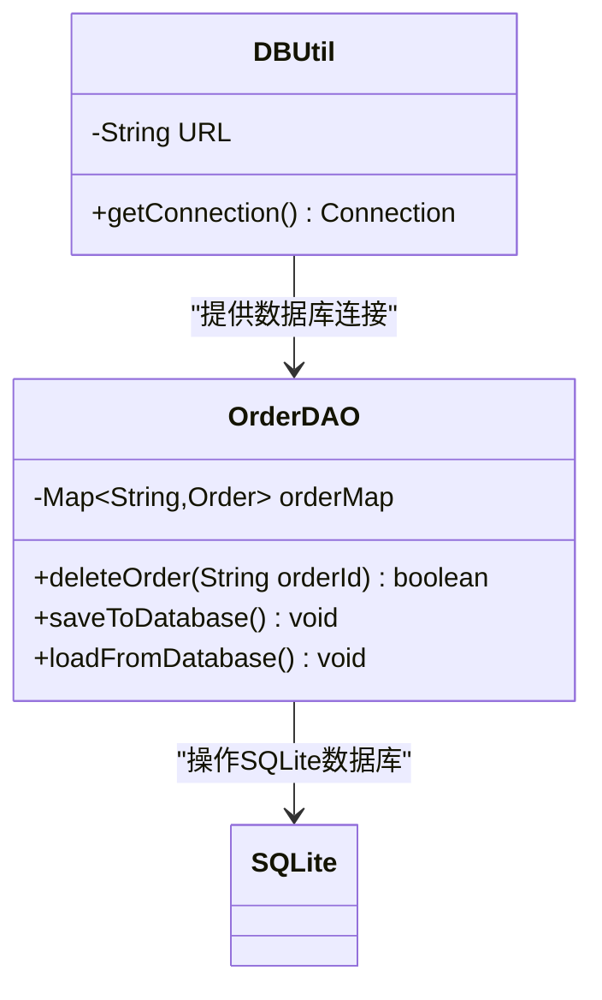
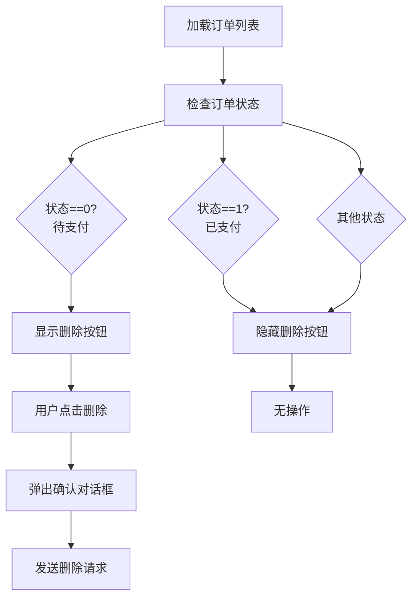
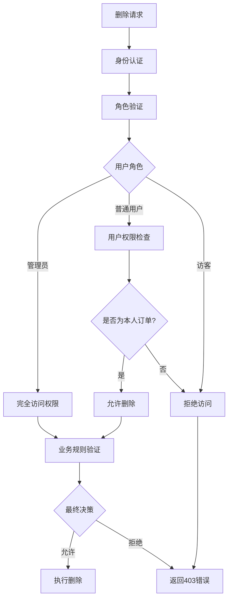
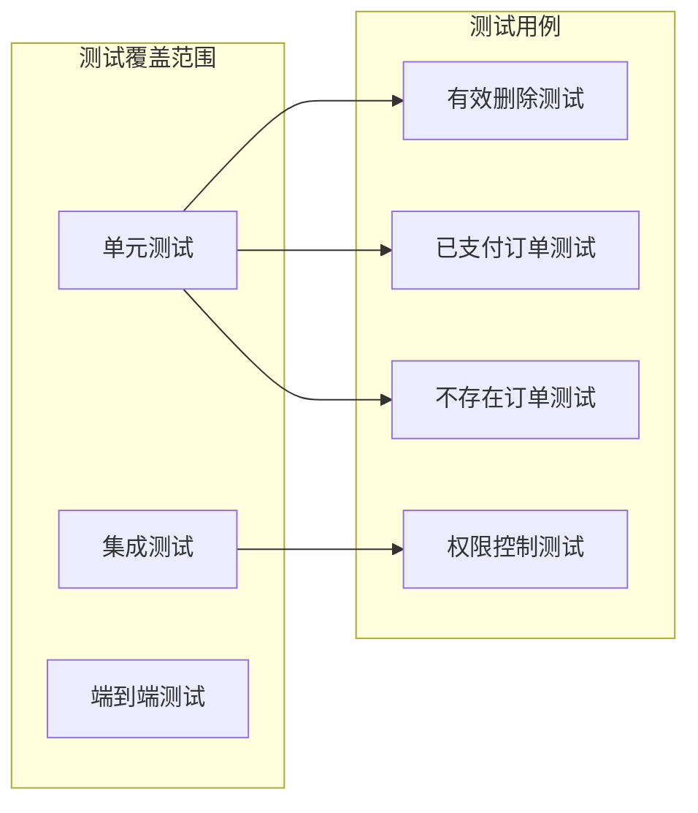

# 删除订单功能安全控制策略文档

<cite>
**本文档引用的文件**
- [OrderController.java](file://src/main/java/com/example/demo/controller/OrderController.java)
- [OrderService.java](file://src/main/java/com/example/demo/service/OrderService.java)
- [OrderDAO.java](file://src/main/java/com/example/demo/dao/OrderDAO.java)
- [Order.java](file://src/main/java/com/example/demo/entity/Order.java)
- [orderService.js](file://frontend/src/services/orderService.js)
- [App.js](file://frontend/src/App.js)
- [DBUtil.java](file://src/main/java/com/example/demo/dao/DBUtil.java)
- [OrderDAOTest.java](file://src/test/java/com/example/demo/dao/OrderDAOTest.java)
- [AIOrderServiceTest.java](file://src/test/java/com/example/demo/service/ai_test/AIOrderServiceTest.java)
- [使用说明.md](file://使用说明.md)
- [DesignDoc1110.md](file://DesignDoc1110.md)
</cite>

## 目录
1. [引言](#引言)
2. [系统架构概览](#系统架构概览)
3. [deleteOrder方法核心实现](#deleteorder方法核心实现)
4. [业务规则安全控制](#业务规则安全控制)
5. [原子性考量与设计模式](#原子性考量与设计模式)
6. [DAO层实现与SQLite数据库行为](#dao层实现与sqlite数据库行为)
7. [前端确认机制](#前端确认机制)
8. [软删除与硬删除对比分析](#软删除与硬删除对比分析)
9. [权限控制扩展思路](#权限控制扩展思路)
10. [最佳实践与故障排除](#最佳实践与故障排除)
11. [总结](#总结)

## 引言

本文档深入分析了订单管理系统中deleteOrder方法的安全控制策略，重点阐述了针对"已支付订单（status=1）"不可删除的业务规则实现。通过多层次的技术架构分析，展示了系统如何确保数据完整性、防止误操作，并提供了完整的前后端协同安全保障机制。

## 系统架构概览

订单管理系统采用经典的三层架构模式，确保了业务逻辑与数据访问的有效分离：



**图表来源**
- [OrderController.java](file://src/main/java/com/example/demo/controller/OrderController.java#L22-L30)
- [OrderService.java](file://src/main/java/com/example/demo/service/OrderService.java#L15-L21)
- [OrderDAO.java](file://src/main/java/com/example/demo/dao/OrderDAO.java#L18-L21)

**章节来源**
- [OrderController.java](file://src/main/java/com/example/demo/controller/OrderController.java#L1-L173)
- [OrderService.java](file://src/main/java/com/example/demo/service/OrderService.java#L1-L114)
- [OrderDAO.java](file://src/main/java/com/example/demo/dao/OrderDAO.java#L1-L248)

## deleteOrder方法核心实现

### 方法调用流程

deleteOrder方法遵循严格的三层次调用流程，确保业务规则的一致性和安全性：



**图表来源**
- [OrderController.java](file://src/main/java/com/example/demo/controller/OrderController.java#L146-L159)
- [OrderService.java](file://src/main/java/com/example/demo/service/OrderService.java#L81-L90)
- [OrderDAO.java](file://src/main/java/com/example/demo/dao/OrderDAO.java#L201-L212)

### 核心业务逻辑实现

deleteOrder方法的核心业务逻辑体现在以下关键步骤：

1. **订单状态查询**：首先通过OrderDAO获取目标订单的完整信息
2. **状态检查**：验证订单状态是否为已支付（status=1）
3. **条件判断**：只有待支付订单（status=0）才允许删除
4. **删除执行**：调用底层DAO执行实际删除操作

**章节来源**
- [OrderService.java](file://src/main/java/com/example/demo/service/OrderService.java#L81-L90)

## 业务规则安全控制

### 已支付订单保护机制

系统实现了严格的业务规则来保护已支付订单不被意外删除：



**图表来源**
- [OrderService.java](file://src/main/java/com/example/demo/service/OrderService.java#L83-L89)

### 状态定义与业务含义

系统中订单状态的定义及其业务含义：

| 状态码 | 状态名称 | 业务含义 | 删除权限 |
|--------|----------|----------|----------|
| 0 | 待支付 | 订单已创建但未支付 | ✅ 可删除 |
| 1 | 已支付 | 订单已完成支付 | ❌ 不可删除 |
| 2 | 已发货 | 订单已发货给客户 | ❌ 不可删除 |
| 3 | 已完成 | 订单已完成交易 | ❌ 不可删除 |
| 4 | 已取消 | 订单被取消 | ❌ 不可删除 |

**章节来源**
- [Order.java](file://src/main/java/com/example/demo/entity/Order.java#L25-L26)
- [使用说明.md](file://使用说明.md#L71-L77)

## 原子性考量与设计模式

### 布尔值返回模式设计

系统采用布尔值返回模式而非异常处理，体现了以下设计优势：

1. **明确的操作结果**：成功返回true，失败返回false，语义清晰
2. **前端友好**：便于前端直接处理操作结果，无需复杂的异常捕获
3. **业务逻辑分离**：将业务规则判断与异常处理分离，职责单一
4. **性能优化**：避免异常堆栈开销，提高系统响应速度

### 两阶段提交考虑

虽然当前实现为单阶段删除，但在设计上预留了两阶段提交的扩展空间：



**章节来源**
- [OrderController.java](file://src/main/java/com/example/demo/controller/OrderController.java#L149-L159)
- [OrderService.java](file://src/main/java/com/example/demo/service/OrderService.java#L81-L90)

## DAO层实现与SQLite数据库行为

### 内存映射与持久化分离

OrderDAO采用了独特的内存映射加持久化的双重存储策略：

```mermaid
graph LR
subgraph "内存层"
MemoryMap[ConcurrentHashMap<br/>orderMap]
Operations[CRUD操作]
end
subgraph "持久化层"
SQLite[(SQLite数据库)]
Transactions[事务处理]
end
Operations --> MemoryMap
MemoryMap --> |saveToDatabase()| Transactions
Transactions --> SQLite
subgraph "数据流向"
WriteFlow[写入流程:<br/>内存→数据库]
ReadFlow[读取流程:<br/>数据库→内存]
end
```

**图表来源**
- [OrderDAO.java](file://src/main/java/com/example/demo/dao/OrderDAO.java#L19-L21)
- [OrderDAO.java](file://src/main/java/com/example/demo/dao/OrderDAO.java#L51-L78)

### 删除操作的具体实现

DAO层的deleteOrder方法实现了简洁而高效的删除逻辑：

1. **存在性检查**：首先验证订单是否存在
2. **内存移除**：从ConcurrentHashMap中移除对应条目
3. **状态返回**：返回操作结果状态

### SQLite集成特性

系统通过DBUtil类实现了与SQLite数据库的无缝集成：



**图表来源**
- [DBUtil.java](file://src/main/java/com/example/demo/dao/DBUtil.java#L10-L18)
- [OrderDAO.java](file://src/main/java/com/example/demo/dao/OrderDAO.java#L28-L46)

**章节来源**
- [OrderDAO.java](file://src/main/java/com/example/demo/dao/OrderDAO.java#L201-L212)
- [DBUtil.java](file://src/main/java/com/example/demo/dao/DBUtil.java#L1-L19)

## 前端确认机制

### JavaScript确认对话框

前端实现了标准的JavaScript confirm对话框作为第一道防线：

```javascript
const handleDeleteOrder = async (orderId) => {
    // 第一道防线：用户确认
    if (!window.confirm('确定要删除这个订单吗?')) {
        return;
    }
    
    try {
        // 发送删除请求
        const response = await orderService.deleteOrder(orderId);
        if (response.data.success) {
            showMessage('订单删除成功!', 'success');
            // 刷新订单列表
            if (searchUserId) {
                handleSearchByUserId();
            } else {
                loadAllOrders();
            }
        }
    } catch (error) {
        showMessage(error.response?.data?.message || '删除失败', 'error');
    }
};
```

### 前端状态控制

前端通过订单状态动态控制删除按钮的显示：



**图表来源**
- [App.js](file://frontend/src/App.js#L405-L427)

### 错误处理与用户体验

前端实现了完善的错误处理机制：

1. **网络错误处理**：捕获API调用异常
2. **业务错误提示**：显示服务器返回的错误信息
3. **成功反馈**：提供即时的成功操作反馈
4. **状态同步**：删除后自动刷新相关数据

**章节来源**
- [App.js](file://frontend/src/App.js#L131-L174)
- [orderService.js](file://frontend/src/services/orderService.js#L38-L41)

## 软删除与硬删除对比分析

### 硬删除实现特点

当前系统采用的是硬删除策略，具有以下特点：

| 特性 | 硬删除 | 软删除 |
|------|--------|--------|
| 数据可见性 | 完全移除 | 保留记录 |
| 存储空间 | 立即释放 | 继续占用 |
| 数据恢复 | 不可恢复 | 可恢复 |
| 性能影响 | 低 | 中等 |
| 业务复杂度 | 简单 | 复杂 |
| 法规合规 | 难以满足 | 易于满足 |

### 硬删除的优势

1. **性能优化**：立即释放存储空间，减少数据库扫描
2. **简化维护**：无需额外的软删除标记字段
3. **数据纯净**：避免历史垃圾数据积累
4. **查询效率**：查询结果更加准确和高效

### 硬删除的限制

1. **不可逆性**：一旦删除无法恢复
2. **审计困难**：缺乏删除历史记录
3. **业务约束**：某些业务场景需要保留删除记录

### 软删除替代方案

如果需要软删除功能，可以考虑以下实现方式：

```java
// 软删除示例（伪代码）
public boolean softDeleteOrder(String orderId) {
    Order order = orderDAO.getOrder(orderId);
    if (order != null) {
        order.setDeleted(true);
        order.setDeleteTime(LocalDateTime.now());
        return orderDAO.updateOrder(order);
    }
    return false;
}
```

**章节来源**
- [OrderDAO.java](file://src/main/java/com/example/demo/dao/OrderDAO.java#L201-L212)

## 权限控制扩展思路

### 基于角色的访问控制(RBAC)

系统可以扩展实现基于角色的访问控制：



### 多层次权限验证

1. **身份认证层**：验证用户身份有效性
2. **角色授权层**：检查用户角色权限
3. **资源访问层**：验证用户对特定资源的访问权
4. **业务规则层**：执行具体的业务逻辑检查

### 审计日志扩展

系统可以添加审计日志功能：

```java
public boolean deleteOrderWithAudit(String orderId, String userId) {
    // 记录删除请求
    auditLogger.logDeleteRequest(orderId, userId);
    
    boolean result = deleteOrder(orderId);
    
    // 记录删除结果
    if (result) {
        auditLogger.logDeleteSuccess(orderId, userId);
    } else {
        auditLogger.logDeleteFailure(orderId, userId);
    }
    
    return result;
}
```

## 最佳实践与故障排除

### 开发最佳实践

1. **防御性编程**：对所有输入参数进行验证
2. **事务一致性**：确保删除操作的原子性
3. **错误处理**：提供清晰的错误信息
4. **日志记录**：记录关键操作的详细信息
5. **性能监控**：监控删除操作的性能指标

### 常见问题排除

| 问题类型 | 症状 | 可能原因 | 解决方案 |
|----------|------|----------|----------|
| 删除失败 | 返回false | 订单不存在或状态不符 | 检查订单ID和状态 |
| 数据不一致 | 删除后仍可见 | 数据库同步延迟 | 调用saveToDatabase() |
| 性能问题 | 删除操作缓慢 | 数据量过大 | 优化索引或分批处理 |
| 并发冲突 | 删除冲突异常 | 多用户并发操作 | 添加乐观锁机制 |

### 测试策略

系统提供了完整的单元测试覆盖：



**章节来源**
- [OrderDAOTest.java](file://src/test/java/com/example/demo/dao/OrderDAOTest.java#L127-L150)
- [AIOrderServiceTest.java](file://src/test/java/com/example/demo/service/ai_test/AIOrderServiceTest.java#L196-L217)

## 总结

订单管理系统的deleteOrder方法实现了一个完整的安全控制体系，通过多层次的业务规则验证、严格的权限控制和完善的错误处理机制，确保了数据的安全性和业务的连续性。

### 关键技术亮点

1. **业务规则内嵌**：将"已支付订单不可删除"的业务规则直接编码到核心逻辑中
2. **分层架构**：清晰的三层架构确保了业务逻辑与数据访问的有效分离
3. **原子性保证**：通过布尔值返回模式确保操作结果的明确性
4. **前端协同**：前端确认机制与后端业务规则形成双重保障
5. **扩展性强**：现有架构支持权限控制、审计日志等功能的平滑扩展

### 安全性评估

该实现达到了企业级应用的安全要求：
- **数据完整性**：通过状态检查防止误删除
- **操作可追溯**：完整的业务规则和错误处理
- **用户友好**：清晰的错误提示和操作反馈
- **系统稳定**：健壮的异常处理和错误恢复机制

这种设计模式不仅适用于当前的订单管理系统，也为其他类似的业务系统提供了良好的参考范例。