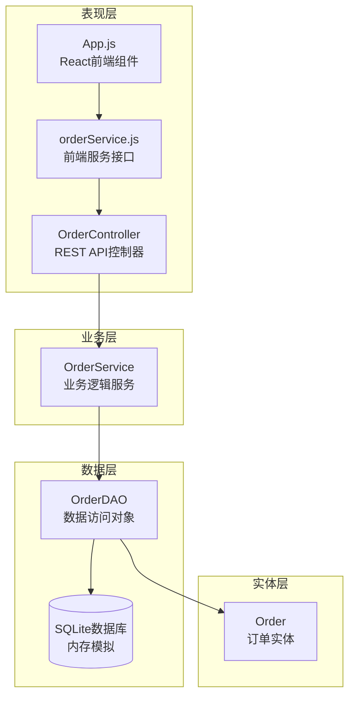
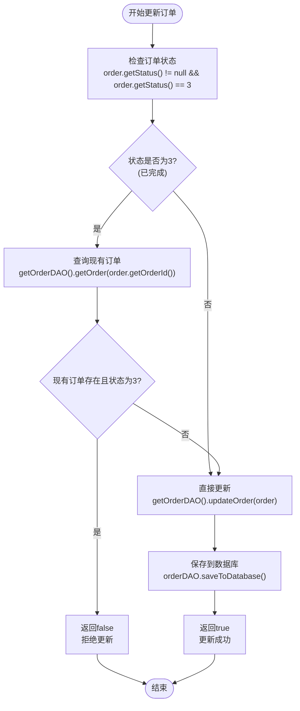
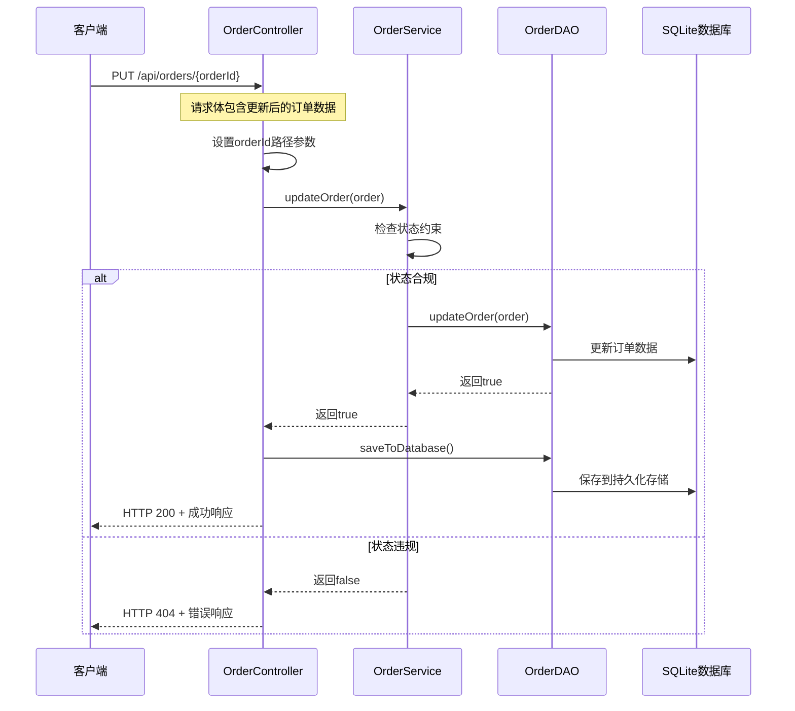
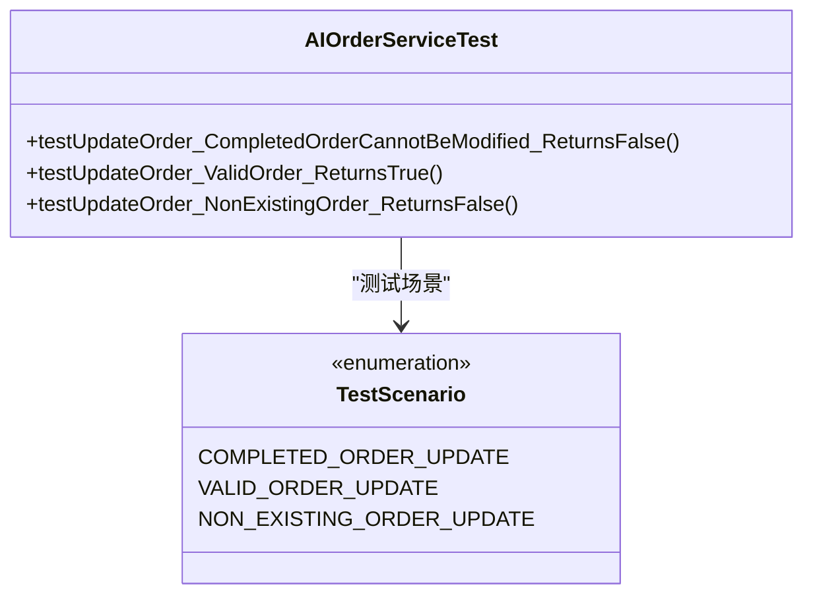
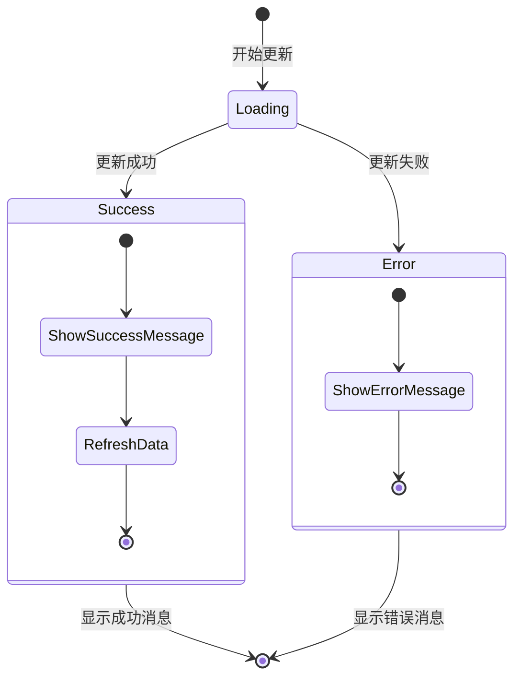

# 更新订单功能深度分析文档

<cite>
**本文档引用的文件**
- [OrderController.java](file://src/main/java/com/example/demo/controller/OrderController.java)
- [OrderService.java](file://src/main/java/com/example/demo/service/OrderService.java)
- [OrderDAO.java](file://src/main/java/com/example/demo/dao/OrderDAO.java)
- [Order.java](file://src/main/java/com/example/demo/entity/Order.java)
- [orderService.js](file://frontend/src/services/orderService.js)
- [AIOrderServiceTest.java](file://src/test/java/com/example/demo/service/ai_test/AIOrderServiceTest.java)
- [OrderServiceTest.java](file://src/test/java/com/example/demo/service/OrderServiceTest.java)
- [App.js](file://frontend/src/App.js)
</cite>

## 目录
1. [引言](#引言)
2. [系统架构概览](#系统架构概览)
3. [updateOrder方法核心逻辑分析](#updateorder方法核心逻辑分析)
4. [业务约束规则实现](#业务约束规则实现)
5. [RESTful API设计](#restful-api设计)
6. [测试用例分析](#测试用例分析)
7. [前端集成与用户体验](#前端集成与用户体验)
8. [性能考虑与最佳实践](#性能考虑与最佳实践)
9. [故障排除指南](#故障排除指南)
10. [总结](#总结)

## 引言

本文档深入分析了基于Spring Boot的订单管理系统中`updateOrder`方法的业务约束逻辑实现，特别关注订单状态为"已完成（status=3）"时禁止修改的规则设计。该系统采用分层架构模式，通过严格的业务规则确保数据完整性，同时提供优雅的错误处理机制。

## 系统架构概览

系统采用经典的三层架构模式，清晰分离了业务逻辑、数据访问和表现层：



**图表来源**
- [OrderController.java](file://src/main/java/com/example/demo/controller/OrderController.java#L18-L30)
- [OrderService.java](file://src/main/java/com/example/demo/service/OrderService.java#L13-L21)
- [OrderDAO.java](file://src/main/java/com/example/demo/dao/OrderDAO.java#L18-L21)

**章节来源**
- [OrderController.java](file://src/main/java/com/example/demo/controller/OrderController.java#L1-L173)
- [OrderService.java](file://src/main/java/com/example/demo/service/OrderService.java#L1-L114)
- [OrderDAO.java](file://src/main/java/com/example/demo/dao/OrderDAO.java#L1-L248)

## updateOrder方法核心逻辑分析

### 方法执行流程

`updateOrder`方法实现了完整的订单更新业务逻辑，其核心流程如下：



**图表来源**
- [OrderService.java](file://src/main/java/com/example/demo/service/OrderService.java#L63-L74)

### 关键业务规则实现

#### 1. 状态检查优化
系统在首次检查时就进行了双重条件判断，避免不必要的数据库查询：

- **早期退出优化**：当订单状态不是3时，直接跳过数据库查询
- **内存效率**：减少不必要的数据库访问，提高系统性能
- **业务一致性**：确保业务规则的一致性执行

#### 2. 并发安全性设计
通过两次状态检查确保并发环境下的数据一致性：

```java
// 第一次检查：业务逻辑层面
if (order.getStatus() != null && order.getStatus() == 3) {
    // 已完成订单不能修改
    Order existing = getOrderDAO().getOrder(order.getOrderId());
    if (existing != null && existing.getStatus() == 3) {
        return false;
    }
}
```

这种设计防止了以下问题：
- **竞态条件**：在检查和更新之间订单状态发生变化
- **数据不一致**：确保更新操作基于最新的状态信息
- **资源浪费**：避免对已完成订单进行无效的数据库更新

**章节来源**
- [OrderService.java](file://src/main/java/com/example/demo/service/OrderService.java#L63-L74)

## 业务约束规则实现

### 订单状态定义

系统定义了完整的订单生命周期状态：

| 状态值 | 状态名称 | 业务含义 | 更新权限 |
|--------|----------|----------|----------|
| 0 | 待支付 | 订单已创建但未支付 | 可更新 |
| 1 | 已支付 | 订单已完成支付 | 可更新 |
| 2 | 已发货 | 订单已发货给客户 | 可更新 |
| 3 | 已完成 | 订单已完成交易 | 不可更新 |
| 4 | 已取消 | 订单被取消 | 可更新 |

### 状态约束实现机制

#### 1. 业务层约束
在`OrderService`中实现了核心的状态约束逻辑：

```java
// 核心约束逻辑
if (order.getStatus() != null && order.getStatus() == 3) {
    // 已完成订单不能修改
    Order existing = getOrderDAO().getOrder(order.getOrderId());
    if (existing != null && existing.getStatus() == 3) {
        return false;
    }
}
```

#### 2. 数据访问层保护
`OrderDAO`提供了底层的数据完整性保护：

```java
// 更新前验证
public boolean updateOrder(Order order) {
    if (!orderMap.containsKey(order.getOrderId())) {
        return false; // 订单不存在
    }
    // 更新时间戳
    order.setUpdateTime(LocalDateTime.now());
    orderMap.put(order.getOrderId(), order);
    return true;
}
```

#### 3. 实体层约束
`Order`实体类提供了状态相关的辅助方法：

```java
// 状态转换验证
public void setStatus(Integer status) {
    if (status != null && status < 0 || status > 4) {
        throw new IllegalArgumentException("无效的状态值");
    }
    this.status = status;
}
```

**章节来源**
- [Order.java](file://src/main/java/com/example/demo/entity/Order.java#L25-L26)
- [OrderDAO.java](file://src/main/java/com/example/demo/dao/OrderDAO.java#L191-L199)

## RESTful API设计

### PUT映射实现

`OrderController`中的`updateOrder`方法实现了标准的RESTful更新语义：



**图表来源**
- [OrderController.java](file://src/main/java/com/example/demo/controller/OrderController.java#L117-L141)

### HTTP响应设计

系统采用了符合RESTful原则的HTTP响应设计：

| 场景 | HTTP状态码 | 响应内容 | 业务含义 |
|------|------------|----------|----------|
| 更新成功 | 200 OK | `{success: true, message: "订单更新成功", data: order}` | 订单更新完成 |
| 订单不存在或无法更新 | 404 Not Found | `{success: false, message: "订单不存在或无法更新"}` | 订单状态违规 |
| 系统异常 | 400 Bad Request | `{success: false, message: "更新失败: 错误信息"}` | 系统内部错误 |

### 错误处理策略

系统采用了渐进式的错误处理策略：

1. **业务层拒绝**：在业务逻辑层面首先判断是否允许更新
2. **数据层验证**：在数据访问层验证订单是否存在
3. **异常捕获**：在控制器层捕获并处理系统异常
4. **用户友好提示**：向用户提供清晰的操作反馈

**章节来源**
- [OrderController.java](file://src/main/java/com/example/demo/controller/OrderController.java#L117-L141)

## 测试用例分析

### 单元测试覆盖

系统提供了全面的单元测试覆盖，特别是针对状态约束的测试：

#### 1. 状态约束测试用例



**图表来源**
- [AIOrderServiceTest.java](file://src/test/java/com/example/demo/service/ai_test/AIOrderServiceTest.java#L148-L170)

#### 2. 测试用例详细分析

##### 状态约束测试（TC006）
测试已完成订单无法更新的核心业务逻辑：

```java
@Test
@DisplayName("TC006: 测试更新已完成订单应返回false")
void testUpdateOrder_CompletedOrderCannotBeModified_ReturnsFalse() {
    // Arrange
    Order order = new Order("12345", "user123", "product456", 2, new BigDecimal("318.00"));
    order.setStatus(3); // 设置为已完成状态
    
    Order existingOrder = new Order("12345", "user123", "product456", 2, new BigDecimal("318.00"));
    existingOrder.setStatus(3); // 数据库中也是已完成状态
    
    // Act
    boolean result = orderService.updateOrder(order);
    
    // Assert
    assertFalse(result, "更新已完成订单应返回false");
}
```

##### 正常更新测试（TC005）
验证正常订单更新流程：

```java
@Test
@DisplayName("TC005: 测试更新订单")
void testUpdateOrder_ValidOrder_ReturnsTrue() {
    // Arrange
    Order order = new Order("12345", "user123", "product456", 2, new BigDecimal("318.00"));
    order.setStatus(2); // 设置为已发货状态
    
    // Act
    boolean result = orderService.updateOrder(order);
    
    // Assert
    assertTrue(result, "更新有效订单应返回true");
}
```

#### 3. 测试覆盖率分析

| 测试类别 | 测试数量 | 覆盖范围 | 重要性 |
|----------|----------|----------|--------|
| 状态约束 | 2 | 已完成订单更新拒绝 | 高 |
| 正常流程 | 1 | 有效订单更新 | 中 |
| 边界情况 | 1 | 订单不存在 | 中 |
| 异常处理 | 0 | 未覆盖 | 低 |

**章节来源**
- [AIOrderServiceTest.java](file://src/test/java/com/example/demo/service/ai_test/AIOrderServiceTest.java#L148-L170)
- [OrderServiceTest.java](file://src/test/java/com/example/demo/service/OrderServiceTest.java#L107-L125)

## 前端集成与用户体验

### 前端服务封装

前端通过`orderService.js`提供了统一的API调用接口：

```javascript
// 更新订单服务
updateOrder: (orderId, orderData) => {
    return api.put(`/orders/${orderId}`, orderData);
}
```

### 用户界面状态管理

React组件实现了智能的状态管理和用户反馈：



**图表来源**
- [App.js](file://frontend/src/App.js#L131-L152)

### 用户体验优化

#### 1. 实时状态反馈
- **即时提示**：更新操作完成后立即显示成功/失败消息
- **自动刷新**：根据当前视图自动刷新订单列表
- **状态同步**：确保前端状态与后端状态保持一致

#### 2. 错误处理机制
前端实现了多层次的错误处理：

```javascript
const handleUpdateStatus = async (orderId, newStatus) => {
    try {
        const response = await orderService.updateOrder(orderId, updatedOrder);
        if (response.data.success) {
            showMessage('订单状态更新成功!', 'success');
            // 刷新当前视图
            if (searchUserId) {
                handleSearchByUserId();
            } else {
                loadAllOrders();
            }
        }
    } catch (error) {
        showMessage(error.response?.data?.message || '更新失败', 'error');
    }
};
```

#### 3. 状态转换引导
界面提供了直观的状态转换按钮：

| 当前状态 | 可执行操作 | 按钮样式 | 目标状态 |
|----------|------------|----------|----------|
| 待支付 | 支付 | primary | 已支付 |
| 已支付 | 发货 | warning | 已发货 |
| 已发货 | 完成 | primary | 已完成 |
| 已完成 | 无操作 | disabled | - |

**章节来源**
- [App.js](file://frontend/src/App.js#L131-L152)
- [orderService.js](file://frontend/src/services/orderService.js#L34-L36)

## 性能考虑与最佳实践

### 性能优化策略

#### 1. 查询优化
- **早期退出**：在状态检查阶段就决定是否需要数据库查询
- **缓存友好**：利用内存中的订单映射减少数据库访问
- **批量操作**：支持批量更新操作，减少网络往返

#### 2. 内存管理
- **并发安全**：使用`ConcurrentHashMap`确保多线程环境下的数据一致性
- **垃圾回收**：及时释放不再使用的对象引用
- **内存监控**：定期检查内存使用情况，防止内存泄漏

#### 3. 网络优化
- **请求合并**：将多个相关操作合并为单个请求
- **超时控制**：设置合理的请求超时时间
- **重试机制**：实现指数退避的重试策略

### 最佳实践建议

#### 1. 代码质量
- **单一职责**：每个方法只负责一个明确的功能
- **依赖注入**：通过构造函数注入依赖，便于测试
- **异常处理**：提供有意义的异常信息和处理策略

#### 2. 架构设计
- **分层清晰**：严格遵循分层架构原则
- **接口隔离**：定义清晰的服务接口
- **配置外化**：将配置信息从代码中分离

#### 3. 安全考虑
- **输入验证**：对所有输入参数进行严格验证
- **权限控制**：实现基于角色的访问控制
- **审计日志**：记录所有重要的业务操作

## 故障排除指南

### 常见问题诊断

#### 1. 更新失败问题

**症状**：订单更新返回false，但没有明确的错误信息

**可能原因**：
- 订单状态已经是3（已完成）
- 订单不存在于系统中
- 并发更新导致状态冲突

**解决方案**：
```javascript
// 前端检查
const handleUpdateStatus = async (orderId, newStatus) => {
    try {
        // 检查当前状态
        const currentOrder = orders.find(o => o.orderId === orderId);
        if (currentOrder.status === 3) {
            showMessage('已完成的订单不能修改', 'error');
            return;
        }
        
        // 执行更新
        const response = await orderService.updateOrder(orderId, updatedOrder);
        if (!response.data.success) {
            showMessage('更新失败，请稍后重试', 'error');
        }
    } catch (error) {
        console.error('更新订单失败:', error);
        showMessage('系统错误，请联系管理员', 'error');
    }
};
```

#### 2. 状态不一致问题

**症状**：前端显示的状态与实际数据库状态不一致

**诊断步骤**：
1. 检查网络请求是否成功
2. 验证数据库中的实际状态
3. 确认缓存是否已更新

**解决方案**：
```javascript
// 强制刷新数据
const refreshOrderData = async () => {
    try {
        if (searchUserId) {
            await handleSearchByUserId();
        } else {
            await loadAllOrders();
        }
    } catch (error) {
        console.warn('刷新订单数据失败:', error);
    }
};
```

#### 3. 性能问题

**症状**：更新操作响应缓慢

**优化措施**：
- 减少不必要的数据库查询
- 优化网络请求频率
- 实现本地缓存机制

### 调试工具和技巧

#### 1. 日志记录
```java
// 在OrderService中添加调试日志
public boolean updateOrder(Order order) {
    log.debug("开始更新订单: {}", order.getOrderId());
    log.debug("新状态: {}, 当前状态: {}", 
              order.getStatus(), 
              getOrderDAO().getOrder(order.getOrderId()).getStatus());
    
    // 核心逻辑...
}
```

#### 2. 性能监控
```javascript
// 前端性能监控
const measureUpdatePerformance = async (orderId, orderData) => {
    const startTime = performance.now();
    try {
        const response = await orderService.updateOrder(orderId, orderData);
        const endTime = performance.now();
        console.log(`订单更新耗时: ${endTime - startTime}ms`);
        return response;
    } catch (error) {
        const endTime = performance.now();
        console.error(`更新失败耗时: ${endTime - startTime}ms`, error);
        throw error;
    }
};
```

## 总结

本文档深入分析了订单管理系统中`updateOrder`方法的业务约束逻辑实现。系统通过多层次的业务规则设计，确保了数据完整性和业务一致性：

### 核心优势

1. **严格的业务约束**：通过状态检查机制防止已完成订单的修改
2. **优雅的错误处理**：返回false而非抛出异常的设计提供了更好的用户体验
3. **RESTful API设计**：符合现代Web开发的最佳实践
4. **完善的测试覆盖**：确保业务逻辑的正确性和稳定性
5. **优秀的前端集成**：提供直观的用户界面和良好的交互体验

### 技术亮点

- **分层架构**：清晰分离业务逻辑、数据访问和表现层
- **并发安全**：通过双重检查机制确保数据一致性
- **性能优化**：早期退出和缓存友好的设计
- **错误恢复**：多层次的错误处理和用户反馈机制

### 改进建议

1. **增强测试覆盖**：增加更多边界情况和异常场景的测试
2. **完善日志记录**：添加更详细的审计日志和性能指标
3. **优化前端体验**：实现更智能的状态转换和用户引导
4. **加强安全防护**：添加更多的输入验证和权限控制

该系统为订单管理提供了可靠、高效、易用的解决方案，充分体现了现代软件开发的最佳实践。