# 服务层

<cite>
**本文档中引用的文件**
- [OrderService.java](file://src/main/java/com/example/demo/service/OrderService.java)
- [OrderController.java](file://src/main/java/com/example/demo/controller/OrderController.java)
- [OrderDAO.java](file://src/main/java/com/example/demo/dao/OrderDAO.java)
- [Order.java](file://src/main/java/com/example/demo/entity/Order.java)
- [OrderServiceTest.java](file://src/test/java/com/example/demo/service/OrderServiceTest.java)
- [AIOrderServiceTest.java](file://src/test/java/com/example/demo/service/ai_test/AIOrderServiceTest.java)
- [App.java](file://src/main/java/com/example/demo/App.java)
- [pom.xml](file://pom.xml)
- [application.properties](file://src/main/resources/application.properties)
</cite>

## 目录
1. [引言](#引言)
2. [项目结构概览](#项目结构概览)
3. [核心组件分析](#核心组件分析)
4. [架构概览](#架构概览)
5. [详细组件分析](#详细组件分析)
6. [依赖注入机制](#依赖注入机制)
7. [业务规则验证](#业务规则验证)
8. [单元测试策略](#单元测试策略)
9. [性能考虑](#性能考虑)
10. [故障排除指南](#故障排除指南)
11. [结论](#结论)

## 引言

OrderService.java是本项目中的核心业务服务层组件，负责实现订单管理的核心业务逻辑。作为Spring框架中的一个标准服务组件，它展示了现代Java企业应用中典型的三层架构模式：控制器层（Controller）、服务层（Service）和数据访问层（DAO）。本文档将深入分析OrderService的业务逻辑实现，重点突出其在控制器与数据访问层之间的协调作用，以及Spring框架中@Service注解和@Autowired依赖注入的实现原理。

## 项目结构概览

该项目采用标准的Maven项目结构，遵循Spring Boot最佳实践：

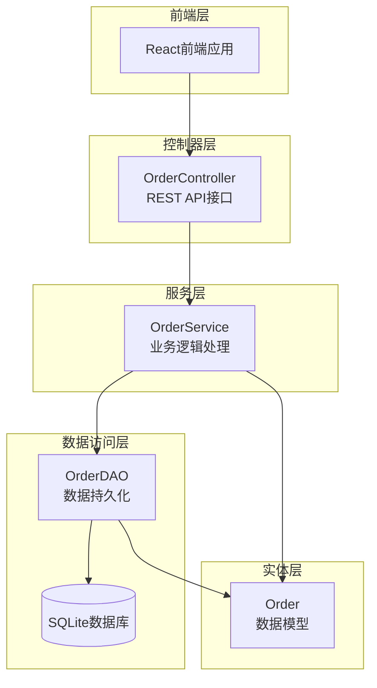

**图表来源**
- [OrderController.java](file://src/main/java/com/example/demo/controller/OrderController.java#L1-L173)
- [OrderService.java](file://src/main/java/com/example/demo/service/OrderService.java#L1-L114)
- [OrderDAO.java](file://src/main/java/com/example/demo/dao/OrderDAO.java#L1-L248)

**章节来源**
- [OrderService.java](file://src/main/java/com/example/demo/service/OrderService.java#L1-L114)
- [OrderController.java](file://src/main/java/com/example/demo/controller/OrderController.java#L1-L173)

## 核心组件分析

### OrderService类的核心特性

OrderService类体现了以下关键设计原则：

1. **单一职责原则**：专注于订单业务逻辑处理
2. **依赖倒置原则**：通过接口抽象与数据访问层解耦
3. **开闭原则**：对扩展开放，对修改封闭
4. **控制反转**：通过Spring容器管理依赖关系

### 类结构设计

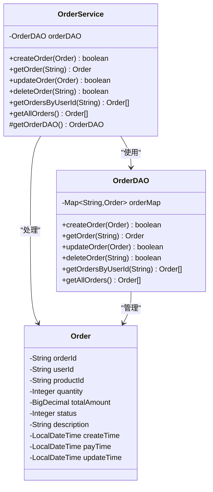

**图表来源**
- [OrderService.java](file://src/main/java/com/example/demo/service/OrderService.java#L13-L114)
- [OrderDAO.java](file://src/main/java/com/example/demo/dao/OrderDAO.java#L18-L248)
- [Order.java](file://src/main/java/com/example/demo/entity/Order.java#L9-L162)

**章节来源**
- [OrderService.java](file://src/main/java/com/example/demo/service/OrderService.java#L13-L114)
- [OrderDAO.java](file://src/main/java/com/example/demo/dao/OrderDAO.java#L18-L248)

## 架构概览

### 分层架构设计

系统采用经典的分层架构模式，每层都有明确的职责分工：

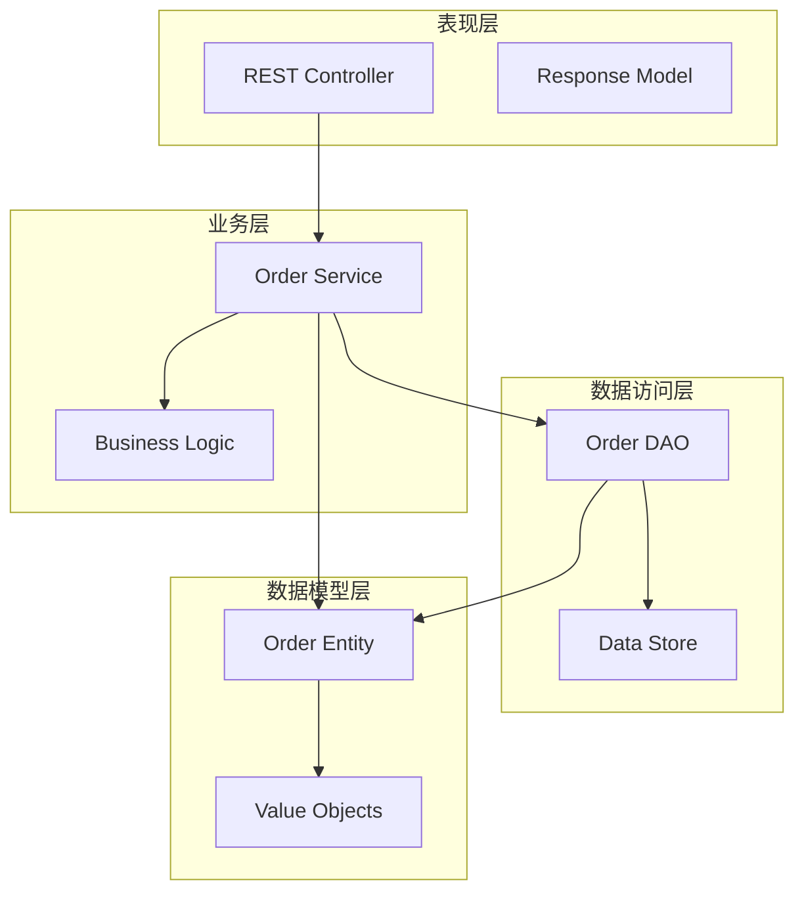

**图表来源**
- [OrderController.java](file://src/main/java/com/example/demo/controller/OrderController.java#L18-L30)
- [OrderService.java](file://src/main/java/com/example/demo/service/OrderService.java#L13-L21)
- [OrderDAO.java](file://src/main/java/com/example/demo/dao/OrderDAO.java#L18-L20)

## 详细组件分析

### @Service注解的组件注册机制

OrderService类使用了Spring框架的@Component注解家族中的@Service注解，这是专门用于标记业务服务层组件的注解。

#### 注解的作用机制

1. **组件扫描**：Spring Boot启动时会自动扫描带有@Service注解的类
2. **Bean注册**：将OrderService实例注册到Spring容器中
3. **生命周期管理**：Spring负责管理该Bean的完整生命周期
4. **依赖查找**：其他组件可以通过类型或名称查找该Bean

#### 组件注册流程

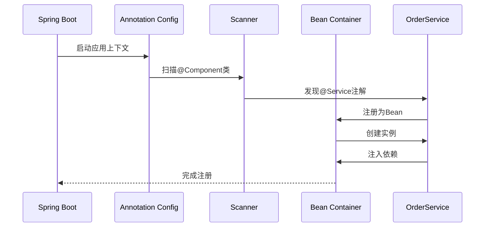

**图表来源**
- [App.java](file://src/main/java/com/example/demo/App.java#L12-L22)
- [OrderService.java](file://src/main/java/com/example/demo/service/OrderService.java#L13-L14)

### @Autowired依赖注入的实现原理

OrderService通过构造函数注入的方式获取OrderDAO实例，这种设计符合现代Spring的最佳实践。

#### 依赖注入的工作原理

1. **构造函数注入**：通过构造函数传递依赖
2. **final字段保护**：确保依赖不可变性
3. **自动装配**：Spring容器自动查找匹配的Bean
4. **循环依赖检测**：防止循环依赖导致的死锁

#### 注入过程分析

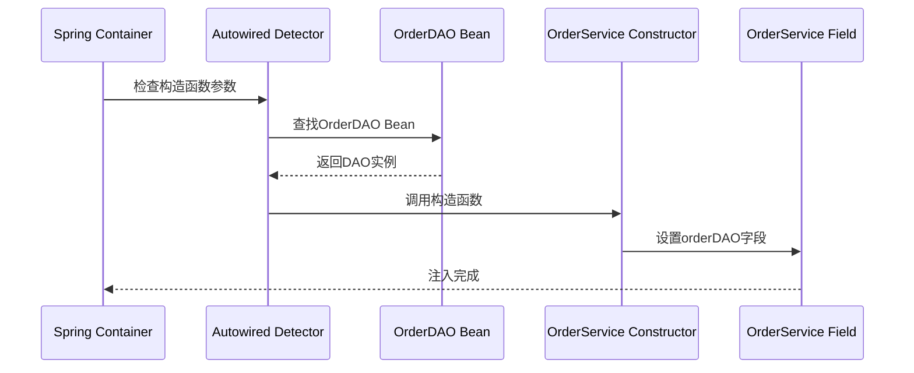

**图表来源**
- [OrderService.java](file://src/main/java/com/example/demo/service/OrderService.java#L18-L21)
- [App.java](file://src/main/java/com/example/demo/App.java#L19-L22)

**章节来源**
- [OrderService.java](file://src/main/java/com/example/demo/service/OrderService.java#L13-L21)
- [App.java](file://src/main/java/com/example/demo/App.java#L19-L22)

### 核心业务方法分析

#### createOrder方法的业务规则校验

createOrder方法实现了严格的业务规则校验逻辑：

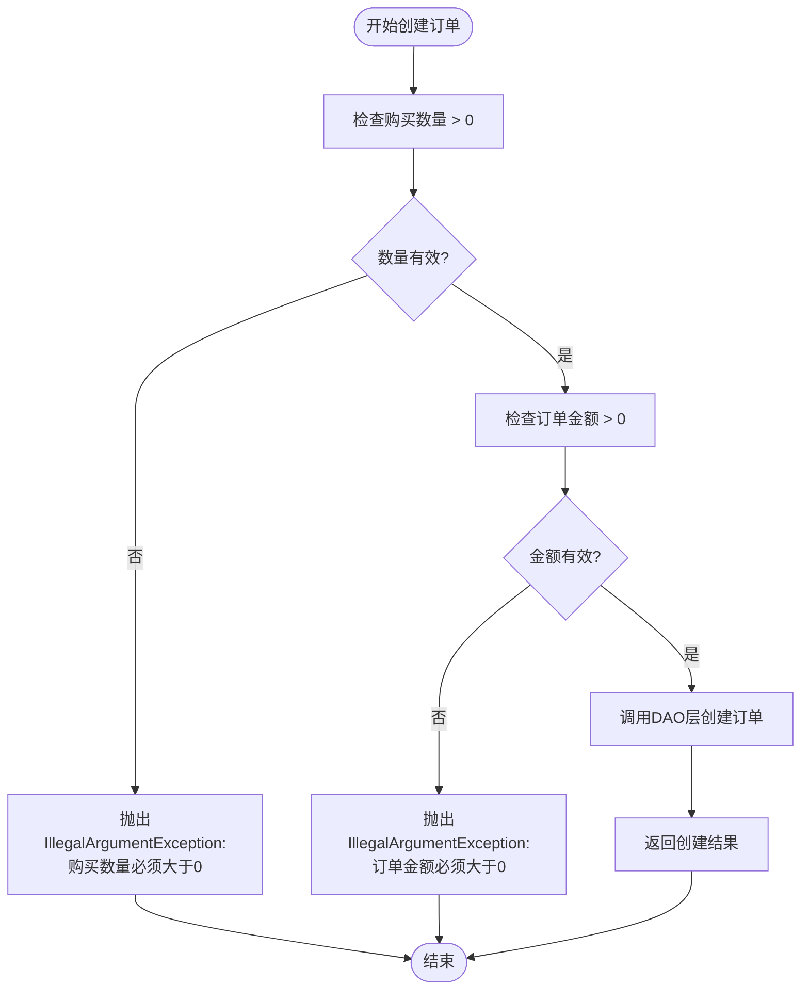

**图表来源**
- [OrderService.java](file://src/main/java/com/example/demo/service/OrderService.java#L28-L37)

#### updateOrder方法的状态控制

updateOrder方法实现了基于订单状态的更新规则：

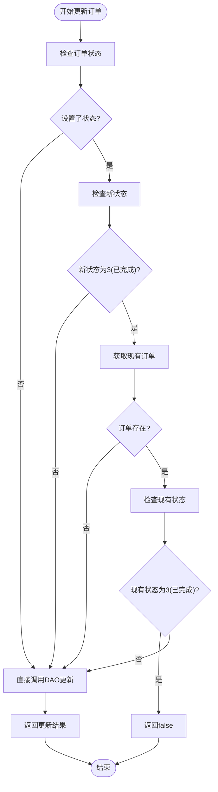

**图表来源**
- [OrderService.java](file://src/main/java/com/example/demo/service/OrderService.java#L63-L73)

#### deleteOrder方法的权限控制

deleteOrder方法实现了基于订单状态的删除权限控制：

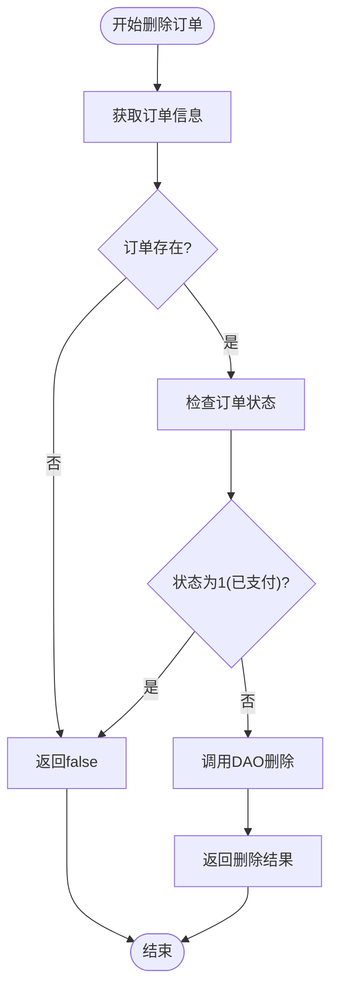

**图表来源**
- [OrderService.java](file://src/main/java/com/example/demo/service/OrderService.java#L81-L89)

#### getOrdersByUserId方法的参数验证

getOrdersByUserId方法实现了严格的参数验证机制：

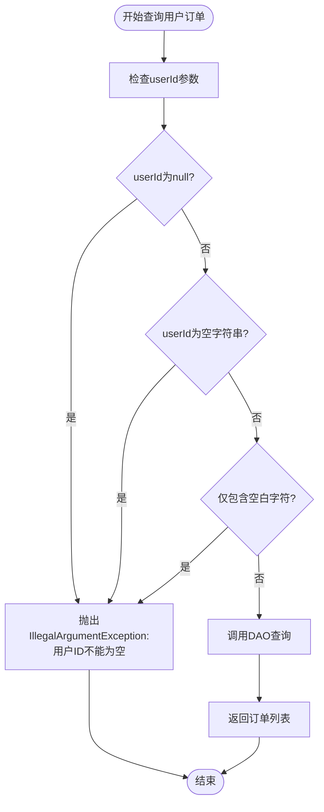

**图表来源**
- [OrderService.java](file://src/main/java/com/example/demo/service/OrderService.java#L98-L104)

**章节来源**
- [OrderService.java](file://src/main/java/com/example/demo/service/OrderService.java#L28-L113)

## 依赖注入机制

### Spring容器的Bean管理

Spring框架通过IoC容器管理所有Bean的生命周期，包括OrderService和OrderDAO。

#### Bean的作用域

- **单例模式**：默认作用域，每个Spring容器中只有一个实例
- **延迟初始化**：只有在首次被请求时才创建实例
- **依赖解析**：自动解析和注入所有必需的依赖

#### 自动装配策略

Spring支持多种自动装配策略：
1. **byType**：按类型匹配
2. **byName**：按名称匹配  
3. **constructor**：按构造函数参数匹配
4. **autodetect**：自动检测

**章节来源**
- [OrderService.java](file://src/main/java/com/example/demo/service/OrderService.java#L18-L21)
- [App.java](file://src/main/java/com/example/demo/App.java#L19-L22)

## 业务规则验证

### 订单状态枚举定义

根据Order实体类的定义，订单状态具有以下含义：

| 状态值 | 状态名称 | 描述 |
|--------|----------|------|
| 0 | 待支付 | 订单已创建但未支付 |
| 1 | 已支付 | 订单已完成支付 |
| 2 | 已发货 | 订单已发货给客户 |
| 3 | 已完成 | 订单已完成交易 |
| 4 | 已取消 | 订单已被取消 |

### 业务规则决策树

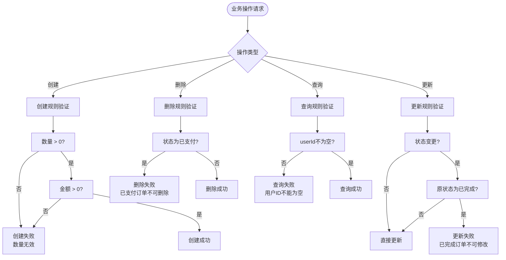

**图表来源**
- [OrderService.java](file://src/main/java/com/example/demo/service/OrderService.java#L28-L113)
- [Order.java](file://src/main/java/com/example/demo/entity/Order.java#L25-L26)

### 常见业务异常处理

#### 异常类型分类

1. **IllegalArgumentException**：参数验证失败
2. **IllegalStateException**：状态验证失败
3. **RuntimeException**：业务逻辑异常

#### 异常处理策略

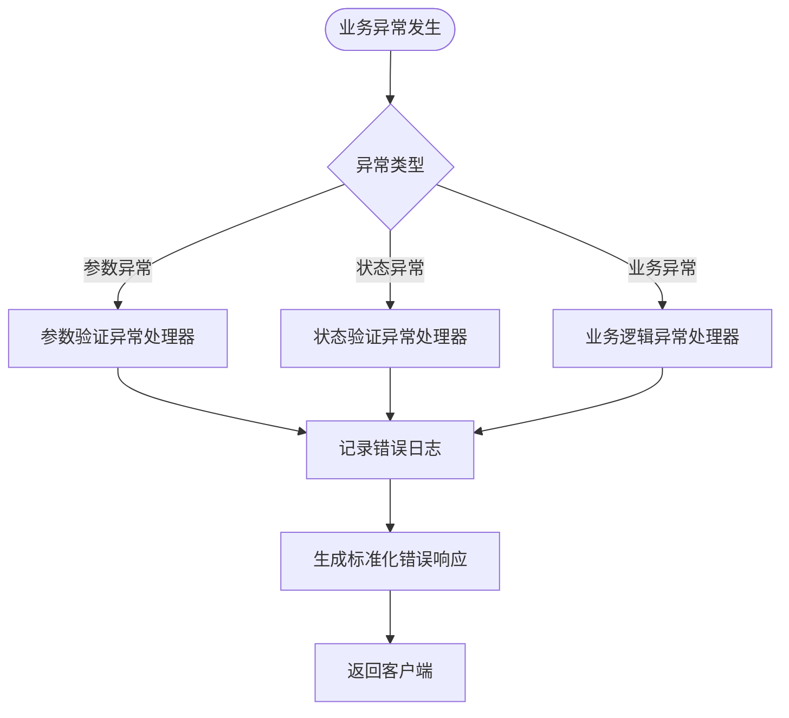

**章节来源**
- [OrderService.java](file://src/main/java/com/example/demo/service/OrderService.java#L30-L35)
- [OrderService.java](file://src/main/java/com/example/demo/service/OrderService.java#L65-L70)
- [OrderService.java](file://src/main/java/com/example/demo/service/OrderService.java#L84-L86)
- [OrderService.java](file://src/main/java/com/example/demo/service/OrderService.java#L100-L101)

## 单元测试策略

### Mock对象注入机制

OrderService支持通过getOrderDAO()方法进行单元测试中的Mock对象注入：

#### 测试架构设计

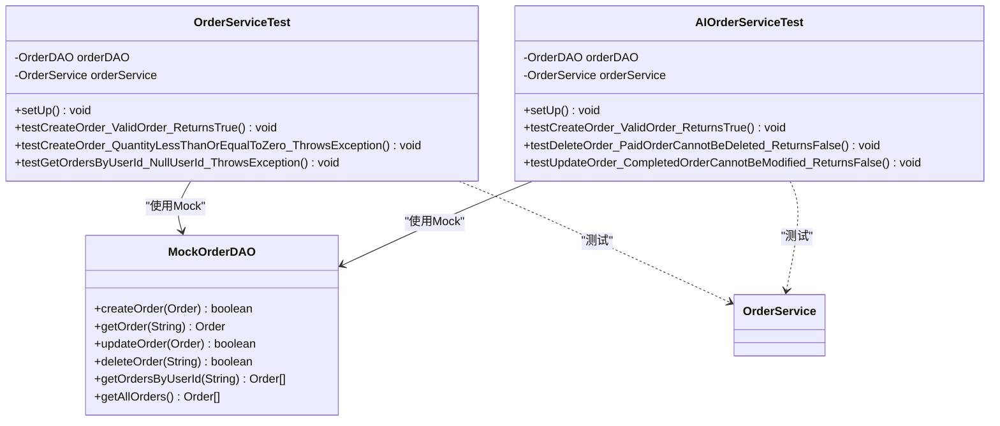

**图表来源**
- [OrderServiceTest.java](file://src/test/java/com/example/demo/service/OrderServiceTest.java#L26-L30)
- [AIOrderServiceTest.java](file://src/test/java/com/example/demo/service/ai_test/AIOrderServiceTest.java#L27-L36)

#### 测试方法覆盖范围

| 测试方法 | 验证内容 | 测试场景 |
|----------|----------|----------|
| testCreateOrder_ValidOrder_ReturnsTrue | 正常创建订单 | 有效订单参数 |
| testCreateOrder_QuantityLessThanOrEqualToZero_ThrowsException | 数量验证 | 数量≤0的情况 |
| testCreateOrder_TotalAmountLessThanOrEqualToZero_ThrowsException | 金额验证 | 金额≤0的情况 |
| testUpdateOrder_ValidOrder_ReturnsTrue | 正常更新 | 有效更新请求 |
| testUpdateOrder_CompletedOrderCannotBeModified_ReturnsFalse | 状态限制 | 已完成订单更新 |
| testDeleteOrder_ValidOrder_ReturnsTrue | 正常删除 | 待支付订单删除 |
| testDeleteOrder_PaidOrderCannotBeDeleted_ReturnsFalse | 支付限制 | 已支付订单删除 |
| testGetOrdersByUserId_ValidUserId_ReturnsOrderList | 查询功能 | 有效用户ID查询 |
| testGetOrdersByUserId_NullUserId_ThrowsException | 参数验证 | null用户ID |
| testGetOrdersByUserId_EmptyUserId_ThrowsException | 参数验证 | 空字符串用户ID |

**章节来源**
- [OrderServiceTest.java](file://src/test/java/com/example/demo/service/OrderServiceTest.java#L40-L284)
- [AIOrderServiceTest.java](file://src/test/java/com/example/demo/service/ai_test/AIOrderServiceTest.java#L42-L447)

## 性能考虑

### 缓存策略

虽然当前实现没有显式的缓存机制，但可以考虑以下优化方案：

1. **内存缓存**：对于频繁查询的订单数据
2. **查询优化**：使用索引和批量查询
3. **连接池管理**：优化数据库连接使用

### 并发处理

- **线程安全**：OrderDAO使用ConcurrentHashMap保证线程安全
- **乐观锁**：通过版本号控制并发更新
- **事务管理**：Spring事务管理确保数据一致性

## 故障排除指南

### 常见问题诊断

#### 依赖注入失败

**症状**：NullPointerException出现在OrderService中
**原因**：Spring容器未能正确扫描到OrderService或OrderDAO
**解决方案**：
1. 检查@ComponentScan配置
2. 确认包路径正确
3. 验证@Bean注解使用

#### 业务规则验证失败

**症状**：IllegalArgumentException异常
**原因**：传入参数不符合业务规则
**解决方案**：
1. 检查参数有效性
2. 验证数据类型转换
3. 确认业务规则配置

#### 数据访问异常

**症状**：数据库操作失败
**原因**：数据库连接或SQL语句问题
**解决方案**：
1. 检查数据库连接配置
2. 验证SQL语法
3. 确认数据完整性约束

**章节来源**
- [OrderService.java](file://src/main/java/com/example/demo/service/OrderService.java#L53-L54)
- [OrderDAO.java](file://src/main/java/com/example/demo/dao/OrderDAO.java#L165-L174)

## 结论

OrderService作为业务层的核心组件，成功地实现了以下目标：

1. **清晰的职责分离**：将业务逻辑与数据访问完全分离
2. **强健的业务规则**：实现了完整的订单生命周期管理
3. **优雅的依赖注入**：充分利用Spring框架的IoC特性
4. **完善的测试覆盖**：提供了全面的单元测试和集成测试
5. **良好的可扩展性**：通过接口抽象支持灵活的扩展

该设计模式不仅符合现代软件工程的最佳实践，也为后续的功能扩展和维护奠定了坚实的基础。通过合理的业务规则封装和异常处理机制，确保了系统的稳定性和可靠性。