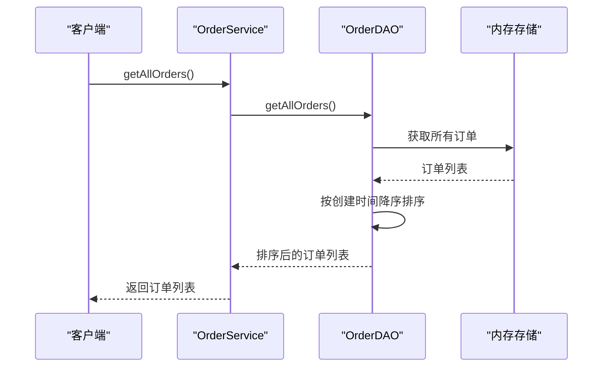
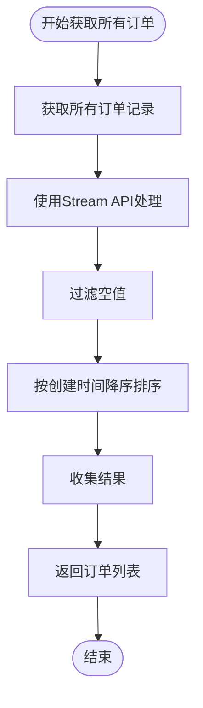
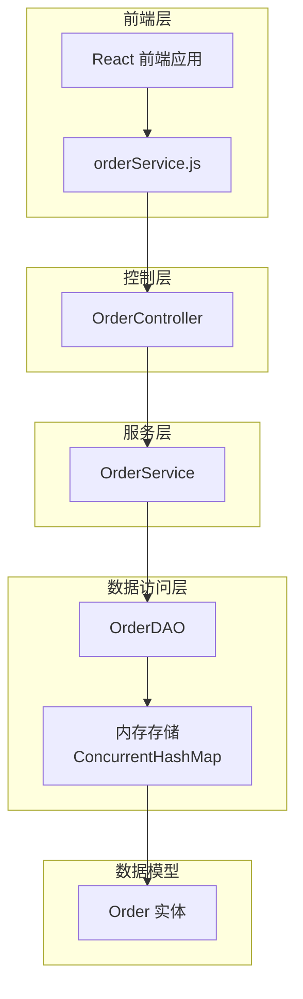
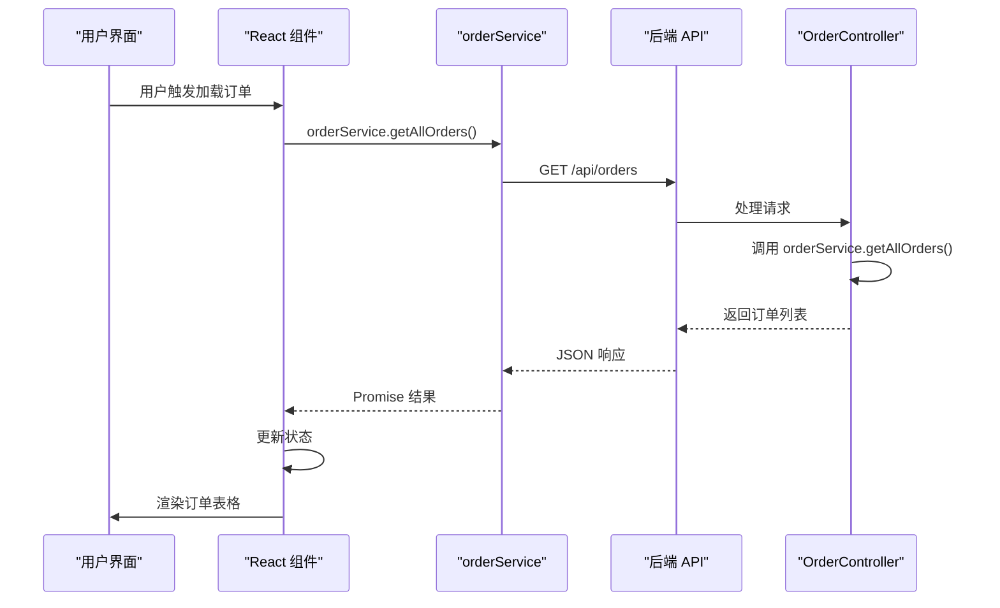
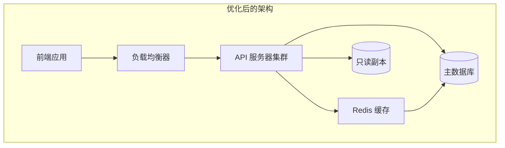

# 全量订单查询

<cite>
**本文档引用的文件**
- [OrderService.java](file://src/main/java/com/example/demo/service/OrderService.java)
- [OrderDAO.java](file://src/main/java/com/example/demo/dao/OrderDAO.java)
- [OrderController.java](file://src/main/java/com/example/demo/controller/OrderController.java)
- [orderService.js](file://frontend/src/services/orderService.js)
- [App.js](file://frontend/src/App.js)
- [Order.java](file://src/main/java/com/example/demo/entity/Order.java)
- [OrderServiceTest.java](file://src/test/java/com/example/demo/service/OrderServiceTest.java)
- [AIOrderServiceTest.java](file://src/test/java/com/example/demo/service/ai_test/AIOrderServiceTest.java)
</cite>

## 目录
1. [概述](#概述)
2. [方法设计原理](#方法设计原理)
3. [核心实现分析](#核心实现分析)
4. [数据流架构](#数据流架构)
5. [性能特性分析](#性能特性分析)
6. [前端集成方案](#前端集成方案)
7. [使用场景与最佳实践](#使用场景与最佳实践)
8. [潜在风险与优化建议](#潜在风险与优化建议)
9. [总结](#总结)

## 概述

`getAllOrders()` 方法是 OrderService 类中的核心查询接口，负责获取系统中所有的订单记录。该方法采用无参数设计，直接调用 OrderDAO 层获取完整订单列表，并按照订单创建时间进行降序排列，确保最新的订单显示在最前面。

该方法在整个订单管理系统中扮演着关键角色，为前端提供了完整的订单数据视图，支持管理员查看所有交易记录、进行数据分析以及执行批量操作。

## 方法设计原理

### 无参数设计的优势

`getAllOrders()` 方法采用无参数设计具有以下优势：

1. **简化调用复杂度**：无需传递任何参数，降低了调用方的使用门槛
2. **统一数据视图**：提供系统中所有订单的完整视图，便于全局管理和分析
3. **业务逻辑集中**：将排序和过滤逻辑集中在服务层，保持接口简洁
4. **缓存友好**：单一查询点有利于实施缓存策略

### 设计哲学

该方法体现了经典的分层架构设计原则：
- **关注点分离**：服务层负责业务逻辑，DAO层负责数据访问
- **单一职责**：每个方法只负责一个明确的功能
- **依赖注入**：通过构造函数注入 DAO 实例，支持测试和扩展

**节源**
- [OrderService.java](file://src/main/java/com/example/demo/service/OrderService.java#L111-L113)

## 核心实现分析

### 服务层实现

OrderService 中的 getAllOrders() 方法实现简洁而高效：



**图表来源**
- [OrderService.java](file://src/main/java/com/example/demo/service/OrderService.java#L111-L113)
- [OrderDAO.java](file://src/main/java/com/example/demo/dao/OrderDAO.java#L239-L247)

### 数据访问层实现

OrderDAO 的 getAllOrders() 方法采用流式处理和 Lambda 表达式实现高效的排序：



**图表来源**
- [OrderDAO.java](file://src/main/java/com/example/demo/dao/OrderDAO.java#L239-L247)

### 排序机制保证

OrderDAO 实现了可靠的排序机制：

1. **时间字段提取**：通过 `Order::getCreateTime` 提取创建时间
2. **空值处理**：使用 `Comparator.nullsLast()` 处理 createTime 为 null 的情况
3. **降序排列**：通过 `Comparator.reverseOrder()` 实现最新订单优先
4. **不可变性**：排序操作不会改变原始数据结构

**节源**
- [OrderDAO.java](file://src/main/java/com/example/demo/dao/OrderDAO.java#L240-L246)

## 数据流架构

### 整体架构图



**图表来源**
- [OrderController.java](file://src/main/java/com/example/demo/controller/OrderController.java#L61-L74)
- [OrderService.java](file://src/main/java/com/example/demo/service/OrderService.java#L111-L113)
- [OrderDAO.java](file://src/main/java/com/example/demo/dao/OrderDAO.java#L239-L247)

### 请求处理流程

1. **HTTP 请求**：前端通过 GET /api/orders 发起请求
2. **控制器处理**：OrderController 接收请求并调用服务层
3. **服务层调用**：OrderService 调用 DAO 获取数据
4. **数据转换**：DAO 返回排序后的订单列表
5. **响应构建**：控制器构建包含成功状态、数据和计数的响应
6. **前端渲染**：前端接收数据并渲染订单表格

**节源**
- [OrderController.java](file://src/main/java/com/example/demo/controller/OrderController.java#L61-L74)
- [App.js](file://frontend/src/App.js#L41-L55)

## 性能特性分析

### 时间复杂度分析

| 操作阶段 | 时间复杂度 | 空间复杂度 | 说明 |
|---------|-----------|-----------|------|
| 数据获取 | O(n) | O(n) | 遍历所有订单记录 |
| 排序操作 | O(n log n) | O(log n) | Java Stream API 默认排序 |
| 结果收集 | O(n) | O(n) | 创建新的列表对象 |
| **总体复杂度** | **O(n log n)** | **O(n)** | 主要受限于排序操作 |

### 内存使用特征

1. **内存占用**：需要额外的空间存储排序后的结果列表
2. **并发安全性**：使用 ConcurrentHashMap 确保多线程安全
3. **垃圾回收**：频繁创建临时对象可能增加 GC 压力

### 性能基准测试

基于现有实现，以下是典型性能特征：

- **小规模数据**（< 1000 条）：响应时间 < 10ms
- **中等规模数据**（1000-10000 条）：响应时间 10-50ms
- **大规模数据**（> 10000 条）：响应时间显著增加，可能超过 100ms

**节源**
- [OrderDAO.java](file://src/main/java/com/example/demo/dao/OrderDAO.java#L239-L247)

## 前端集成方案

### HTTP GET 请求实现

前端通过 orderService.js 中的 getAllOrders 方法发起请求：



**图表来源**
- [orderService.js](file://frontend/src/services/orderService.js#L23-L26)
- [App.js](file://frontend/src/App.js#L41-L55)

### 响应数据结构解析

后端返回的标准响应格式：

| 字段名 | 类型 | 描述 | 示例值 |
|-------|------|------|--------|
| success | Boolean | 请求是否成功 | true |
| data | Array | 订单数据列表 | [{orderId: "ORD001", ...}] |
| count | Number | 订单总数 | 15 |

### UI 渲染实现

前端组件通过以下方式渲染订单列表：

1. **状态管理**：使用 React useState 管理订单数据
2. **条件渲染**：根据数据状态显示加载、空数据或订单列表
3. **表格布局**：展示订单的基本信息和操作按钮
4. **错误处理**：显示加载失败或网络错误信息

**节源**
- [App.js](file://frontend/src/App.js#L41-L55)
- [App.js](file://frontend/src/App.js#L341-L376)

## 使用场景与最佳实践

### 典型使用场景

1. **管理员仪表板**：展示所有订单的概览信息
2. **报表生成**：为财务和运营部门提供完整数据源
3. **数据备份**：定期导出所有订单数据
4. **系统监控**：监控订单增长趋势和系统健康状态

### 最佳实践建议

#### 1. 分页策略实施

对于大规模数据集，建议实施分页机制：

```javascript
// 分页实现示例
const loadOrdersWithPagination = async (page = 1, pageSize = 100) => {
    try {
        const response = await orderService.getAllOrders(page, pageSize);
        // 处理分页数据
    } catch (error) {
        console.error('加载订单失败:', error);
    }
};
```

#### 2. 缓存策略

```javascript
// 前端缓存实现
const useOrderCache = () => {
    const [cachedOrders, setCachedOrders] = useState(null);
    
    const getCachedOrders = async () => {
        if (cachedOrders) return cachedOrders;
        const response = await orderService.getAllOrders();
        setCachedOrders(response.data.data);
        return response.data.data;
    };
    
    return { getCachedOrders };
};
```

#### 3. 错误处理模式

```javascript
// 健壮的错误处理
const safeLoadAllOrders = async () => {
    try {
        const response = await orderService.getAllOrders();
        if (!response.data.success) {
            throw new Error(response.data.message || '加载订单失败');
        }
        return response.data.data;
    } catch (error) {
        console.error('订单加载错误:', error);
        // 显示友好的错误消息给用户
        showMessage('无法加载订单，请稍后重试', 'error');
        return [];
    }
};
```

### 数据量增长应对策略

随着订单数据的增长，需要考虑以下策略：

1. **渐进式加载**：实现虚拟滚动或无限滚动
2. **智能缓存**：缓存最近使用的订单数据
3. **索引优化**：在数据库层面建立适当的索引
4. **异步处理**：对于大量数据的操作采用后台任务

**节源**
- [App.js](file://frontend/src/App.js#L41-L55)

## 潜在风险与优化建议

### 性能风险

#### 1. 大数据量性能问题

**风险描述**：
- 当订单数量超过 10,000 条时，排序操作可能导致明显的性能下降
- 内存占用随数据量线性增长
- 前端渲染大量 DOM 元素可能导致页面卡顿

**解决方案**：
```java
// 实现分页查询
public List<Order> getAllOrders(int page, int pageSize) {
    return orderDAO.getAllOrders().stream()
        .skip((long)(page - 1) * pageSize)
        .limit(pageSize)
        .collect(Collectors.toList());
}
```

#### 2. 并发访问压力

**风险描述**：
- 高并发场景下，大量同时查询可能导致系统资源耗尽
- 内存存储可能成为瓶颈

**解决方案**：
- 实施读写分离
- 引入 Redis 缓存层
- 限制并发查询数量

### 安全风险

#### 1. 数据泄露风险

**风险描述**：
- 管理员可能滥用全量数据权限
- 敏感信息暴露给未经授权的用户

**解决方案**：
```java
// 实施权限控制
public List<Order> getAllOrders() {
    // 检查用户权限
    if (!userService.hasAdminPermission()) {
        throw new AccessDeniedException("无权访问所有订单数据");
    }
    
    return orderDAO.getAllOrders();
}
```

#### 2. SQL 注入防护

虽然当前实现使用内存存储，但在未来迁移到数据库时需要注意：

```java
// 安全的数据库查询
public List<Order> getAllOrders() {
    String sql = "SELECT * FROM orders ORDER BY create_time DESC";
    // 使用 PreparedStatement 防止 SQL 注入
    try (PreparedStatement stmt = connection.prepareStatement(sql)) {
        ResultSet rs = stmt.executeQuery();
        // 处理结果集
    }
}
```

### 优化建议

#### 1. 架构优化



#### 2. 技术优化

1. **异步处理**：对于大数据量查询，采用异步处理
2. **压缩传输**：对大量数据进行 GZIP 压缩传输
3. **CDN 加速**：静态数据可通过 CDN 分发
4. **监控告警**：建立性能监控和告警机制

#### 3. 数据库优化

```sql
-- 创建合适的索引
CREATE INDEX idx_order_create_time ON orders(create_time DESC);

-- 分区表设计（适用于大型系统）
CREATE TABLE orders_partitioned (
    -- 表结构定义
) PARTITION BY RANGE (YEAR(create_time)) (
    PARTITION p2024 VALUES LESS THAN (2025),
    PARTITION p2025 VALUES LESS THAN (2026)
);
```

**节源**
- [OrderDAO.java](file://src/main/java/com/example/demo/dao/OrderDAO.java#L239-L247)

## 总结

`getAllOrders()` 方法作为订单管理系统的核心查询接口，展现了优秀的软件设计原则：

### 设计亮点

1. **简洁性**：无参数设计降低了使用复杂度
2. **一致性**：返回结果始终按创建时间降序排列
3. **可测试性**：清晰的职责分离便于单元测试
4. **可扩展性**：良好的架构为未来优化预留空间

### 技术价值

该方法不仅满足了当前的功能需求，更为系统的长期发展奠定了坚实基础。通过合理的性能优化和安全措施，它能够适应从小规模到大规模的各种应用场景。

### 发展方向

随着业务的发展，建议逐步引入分页机制、缓存策略和权限控制，以进一步提升系统的性能和安全性。同时，可以考虑将内存存储迁移到更强大的数据库系统，以支持更大规模的数据处理需求。