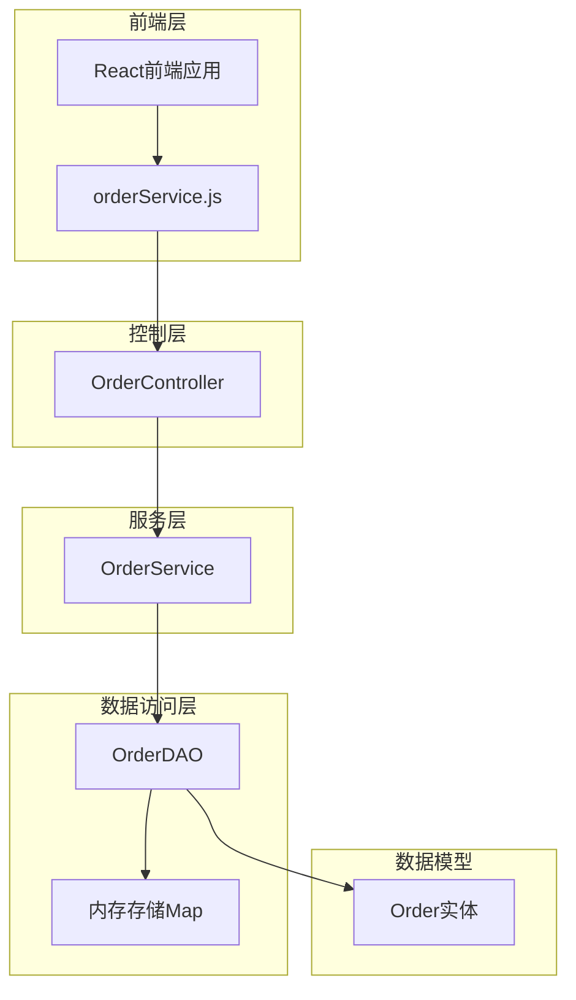
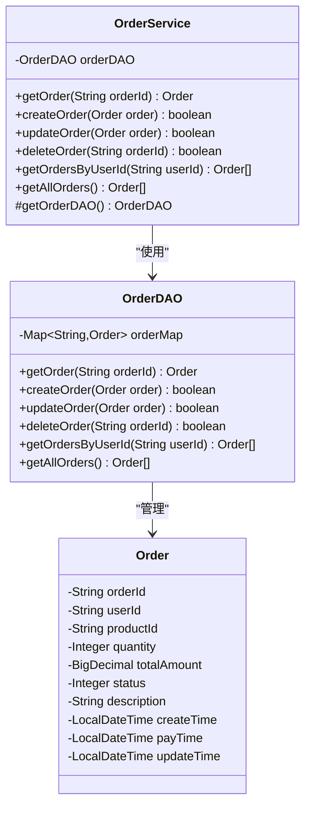
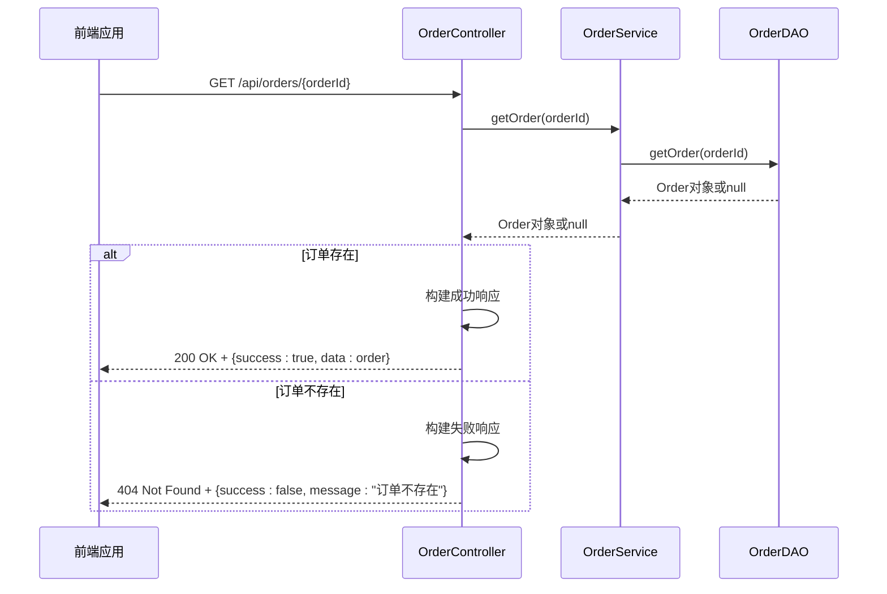
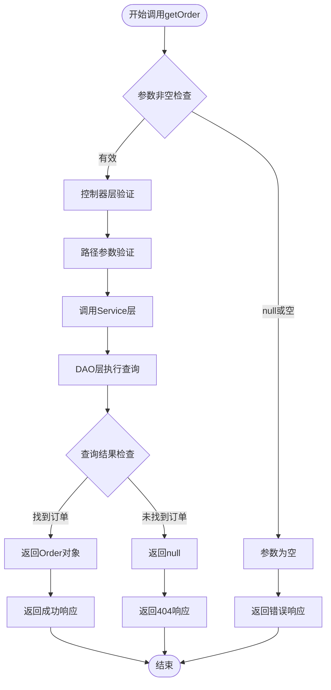
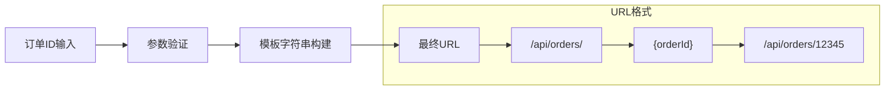
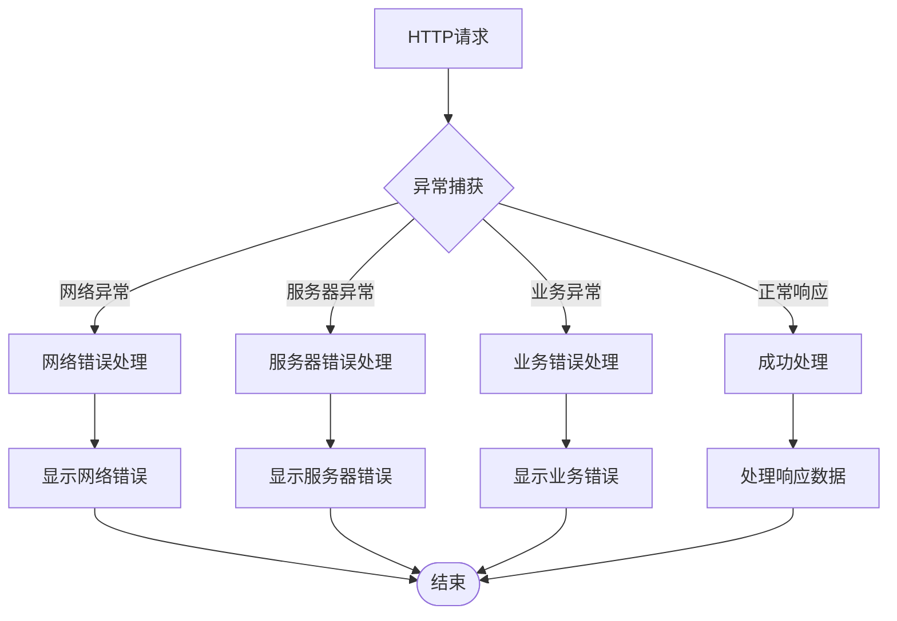

# 单订单查询

<cite>
**本文档中引用的文件**
- [OrderService.java](file://src/main/java/com/example/demo/service/OrderService.java)
- [orderService.js](file://frontend/src/services/orderService.js)
- [OrderController.java](file://src/main/java/com/example/demo/controller/OrderController.java)
- [OrderDAO.java](file://src/main/java/com/example/demo/dao/OrderDAO.java)
- [Order.java](file://src/main/java/com/example/demo/entity/Order.java)
- [OrderServiceTest.java](file://src/test/java/com/example/demo/service/OrderServiceTest.java)
- [OrderControllerIT.java](file://src/test/java/com/example/demo/controller/OrderControllerIT.java)
- [App.js](file://frontend/src/App.js)
</cite>

## 目录
1. [概述](#概述)
2. [系统架构](#系统架构)
3. [核心组件分析](#核心组件分析)
4. [getOrder方法实现机制](#getorder方法实现机制)
5. [前端集成与HTTP请求处理](#前端集成与http请求处理)
6. [错误处理与异常情况](#错误处理与异常情况)
7. [实际使用示例](#实际使用示例)
8. [最佳实践与安全考虑](#最佳实践与安全考虑)
9. [总结](#总结)

## 概述

OrderService中的`getOrder(String orderId)`方法是订单管理系统的核心查询接口之一，负责根据订单ID检索单个订单的详细信息。该方法采用经典的分层架构设计，实现了业务逻辑与数据访问的清晰分离，提供了优雅的空值处理机制，并通过RESTful API为前端组件提供统一的数据访问接口。

## 系统架构



**图表来源**
- [OrderController.java](file://src/main/java/com/example/demo/controller/OrderController.java#L80-L92)
- [OrderService.java](file://src/main/java/com/example/demo/service/OrderService.java#L45-L46)
- [OrderDAO.java](file://src/main/java/com/example/demo/dao/OrderDAO.java#L182-L184)

## 核心组件分析

### OrderService - 业务服务层

OrderService作为业务逻辑的核心组件，负责协调订单相关的业务操作。其`getOrder`方法体现了简洁而强大的设计理念：



**图表来源**
- [OrderService.java](file://src/main/java/com/example/demo/service/OrderService.java#L15-L114)
- [OrderDAO.java](file://src/main/java/com/example/demo/dao/OrderDAO.java#L18-L248)
- [Order.java](file://src/main/java/com/example/demo/entity/Order.java#L1-L162)

**章节来源**
- [OrderService.java](file://src/main/java/com/example/demo/service/OrderService.java#L15-L114)
- [OrderDAO.java](file://src/main/java/com/example/demo/dao/OrderDAO.java#L18-L248)

### OrderController - REST API层

OrderController提供了标准的RESTful API接口，将业务层的服务方法暴露给前端应用：



**图表来源**
- [OrderController.java](file://src/main/java/com/example/demo/controller/OrderController.java#L80-L92)
- [OrderService.java](file://src/main/java/com/example/demo/service/OrderService.java#L45-L46)
- [OrderDAO.java](file://src/main/java/com/example/demo/dao/OrderDAO.java#L182-L184)

**章节来源**
- [OrderController.java](file://src/main/java/com/example/demo/controller/OrderController.java#L80-L92)

## getOrder方法实现机制

### 方法签名与职责

`getOrder(String orderId)`方法的设计遵循单一职责原则，专注于根据订单ID获取订单信息：

```java
// OrderService中的实现
public Order getOrder(String orderId) {
    return getOrderDAO().getOrder(orderId);
}
```

该方法具有以下特点：
- **简洁性**：仅一行代码，直接委托给数据访问层
- **透明性**：不进行任何额外的业务逻辑处理
- **可测试性**：便于单元测试和模拟

### 参数校验流程

虽然`getOrder`方法本身不进行复杂的参数校验，但整个调用链路包含了多层验证机制：



**图表来源**
- [OrderController.java](file://src/main/java/com/example/demo/controller/OrderController.java#L80-L92)
- [OrderService.java](file://src/main/java/com/example/demo/service/OrderService.java#L45-L46)
- [OrderDAO.java](file://src/main/java/com/example/demo/dao/OrderDAO.java#L182-L184)

### 调用OrderDAO获取数据的过程

OrderDAO的`getOrder`方法实现了基于内存Map的快速查找：

```java
// OrderDAO中的实现
public Order getOrder(String orderId) {
    return orderMap.get(orderId);
}
```

该实现的特点：
- **高性能**：O(1)时间复杂度的查找性能
- **线程安全**：使用ConcurrentHashMap保证并发安全
- **简单可靠**：直接基于订单ID的键值查找

### 返回null表示订单不存在的设计选择

返回null而非抛出异常的设计体现了以下优势：

1. **语义清晰**：null明确表示"资源不存在"
2. **调用方友好**：避免异常处理的开销
3. **性能优化**：减少异常创建和传播的性能损失
4. **约定优于配置**：建立明确的API契约

**章节来源**
- [OrderService.java](file://src/main/java/com/example/demo/service/OrderService.java#L45-L46)
- [OrderDAO.java](file://src/main/java/com/example/demo/dao/OrderDAO.java#L182-L184)

## 前端集成与HTTP请求处理

### HTTP GET请求的构建方式

前端通过orderService.js提供的API构建HTTP GET请求：

```javascript
// orderService.js中的实现
getOrder: (orderId) => {
    return api.get(`/orders/${orderId}`);
}
```

该实现的特点：
- **RESTful风格**：符合REST API设计规范
- **路径参数**：使用模板字符串动态构建URL
- **类型安全**：JavaScript类型系统支持

### 路径参数传递规则

路径参数的传递遵循以下规则：



**图表来源**
- [orderService.js](file://frontend/src/services/orderService.js#L19-L20)

### 响应处理模式

前端采用统一的响应处理模式：

```javascript
// 前端响应处理示例
const handleGetOrder = async (orderId) => {
    try {
        const response = await orderService.getOrder(orderId);
        if (response.data.success) {
            // 处理成功响应
            displayOrderDetails(response.data.data);
        } else {
            // 处理订单不存在的情况
            showErrorMessage("订单不存在");
        }
    } catch (error) {
        // 处理网络错误或其他异常
        showErrorMessage("获取订单失败");
    }
};
```

**章节来源**
- [orderService.js](file://frontend/src/services/orderService.js#L19-L20)
- [App.js](file://frontend/src/App.js#L105-L129)

## 错误处理与异常情况

### 异常情况的行为分析

系统在不同异常情况下表现出明确的行为特征：

| 异常情况 | 后端行为 | 前端响应 | 用户体验 |
|---------|---------|---------|---------|
| 无效订单ID | 返回null | 404 Not Found | 显示"订单不存在" |
| 网络中断 | HTTP连接错误 | 网络错误提示 | 显示网络错误 |
| 服务器内部错误 | 500 Internal Server Error | 服务器错误提示 | 显示服务器错误 |
| 订单ID格式错误 | 参数验证失败 | 400 Bad Request | 显示格式错误 |

### 异常处理策略



**图表来源**
- [OrderController.java](file://src/main/java/com/example/demo/controller/OrderController.java#L80-L92)
- [App.js](file://frontend/src/App.js#L105-L129)

### 错误处理建议

1. **前端层面**：
   - 实现统一的错误拦截器
   - 提供友好的错误提示
   - 支持错误重试机制

2. **后端层面**：
   - 统一的异常处理器
   - 详细的错误日志记录
   - 适当的HTTP状态码返回

**章节来源**
- [OrderController.java](file://src/main/java/com/example/demo/controller/OrderController.java#L80-L92)
- [App.js](file://frontend/src/App.js#L105-L129)

## 实际使用示例

### 前端组件中的安全处理

在React组件中安全地处理getOrder方法的返回值：

```javascript
// 安全的订单查询组件示例
const OrderDetailComponent = ({ orderId }) => {
    const [order, setOrder] = useState(null);
    const [loading, setLoading] = useState(true);
    const [error, setError] = useState(null);

    useEffect(() => {
        const fetchOrder = async () => {
            try {
                setLoading(true);
                const response = await orderService.getOrder(orderId);
                
                if (response.data.success) {
                    setOrder(response.data.data);
                    setError(null);
                } else {
                    // 处理订单不存在的情况
                    setOrder(null);
                    setError("订单不存在");
                }
            } catch (err) {
                // 处理网络或服务器错误
                setError(err.message || "获取订单失败");
                setOrder(null);
            } finally {
                setLoading(false);
            }
        };

        if (orderId) {
            fetchOrder();
        }
    }, [orderId]);

    if (loading) return <div>加载中...</div>;
    if (error) return <div className="error">{error}</div>;
    if (!order) return <div>未找到订单</div>;

    return (
        <div className="order-detail">
            <h2>订单详情</h2>
            <p>订单ID: {order.orderId}</p>
            <p>用户ID: {order.userId}</p>
            <p>总金额: ¥{order.totalAmount}</p>
            <p>状态: {getStatusText(order.status)}</p>
        </div>
    );
};
```

### 后端服务中的集成示例

在OrderController中集成getOrder方法：

```java
@GetMapping("/{orderId}")
public ResponseEntity<Map<String, Object>> getOrder(@PathVariable String orderId) {
    Map<String, Object> response = new HashMap<>();
    Order order = orderService.getOrder(orderId);
    
    if (order != null) {
        response.put("success", true);
        response.put("data", order);
        return ResponseEntity.ok(response);
    } else {
        response.put("success", false);
        response.put("message", "订单不存在");
        return ResponseEntity.status(HttpStatus.NOT_FOUND).body(response);
    }
}
```

**章节来源**
- [App.js](file://frontend/src/App.js#L105-L129)
- [OrderController.java](file://src/main/java/com/example/demo/controller/OrderController.java#L80-L92)

## 最佳实践与安全考虑

### 参数验证最佳实践

1. **前端验证**：
   - 验证订单ID格式
   - 防止空值传递
   - 提供即时反馈

2. **后端验证**：
   - 严格的参数校验
   - SQL注入防护
   - 访问权限控制

### 性能优化建议

1. **缓存策略**：
   - 对频繁查询的订单进行缓存
   - 实现LRU缓存机制
   - 设置合理的缓存过期时间

2. **并发控制**：
   - 使用线程安全的数据结构
   - 实现乐观锁机制
   - 控制并发查询数量

### 安全考虑

1. **数据保护**：
   - 敏感信息脱敏
   - 日志记录最小化
   - 数据传输加密

2. **访问控制**：
   - 实现基于角色的访问控制
   - 记录访问日志
   - 防止未授权访问

**章节来源**
- [OrderService.java](file://src/main/java/com/example/demo/service/OrderService.java#L45-L46)
- [OrderDAO.java](file://src/main/java/com/example/demo/dao/OrderDAO.java#L182-L184)

## 总结

OrderService中的`getOrder(String orderId)`方法展现了优秀的软件设计原则：

1. **简洁性**：通过最少的代码实现最大化的功能
2. **清晰性**：明确的职责分工和清晰的调用链路
3. **可靠性**：完善的错误处理和异常情况处理
4. **可扩展性**：良好的架构设计支持未来的功能扩展

该方法的成功实现不仅体现在技术层面，更体现在对用户体验的深刻理解和对系统稳定性的严格把控。通过前后端的紧密配合，为用户提供了流畅、可靠的订单查询体验。