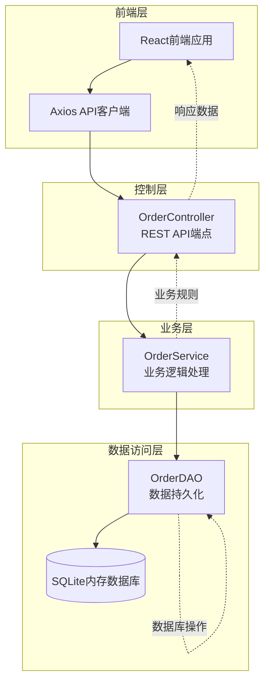
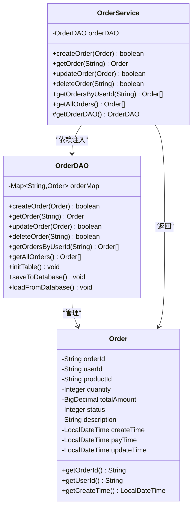
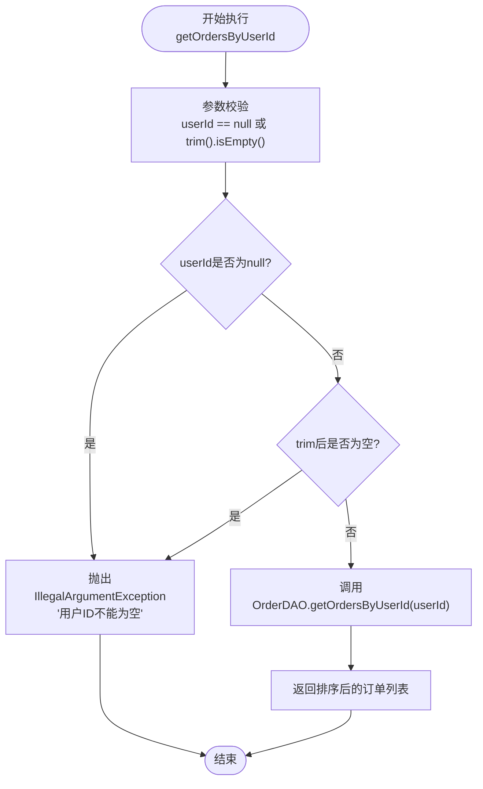
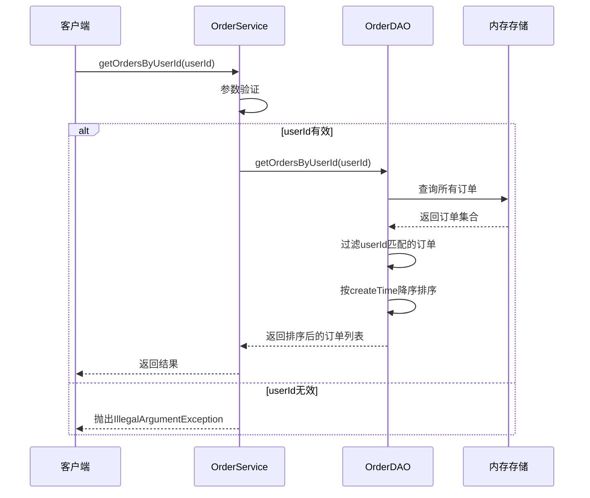
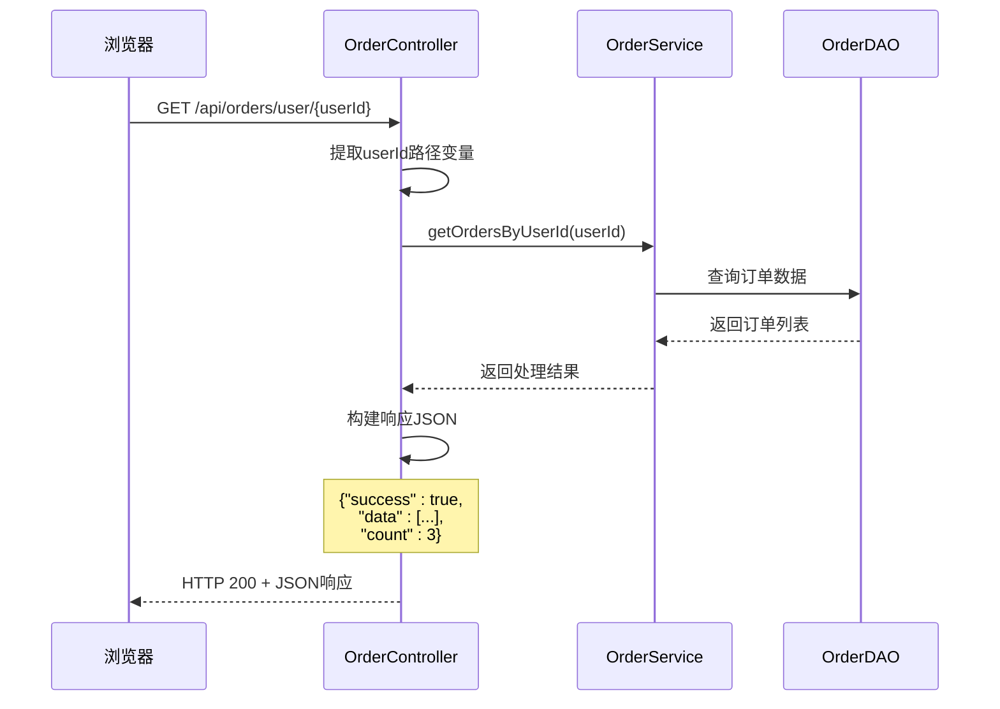
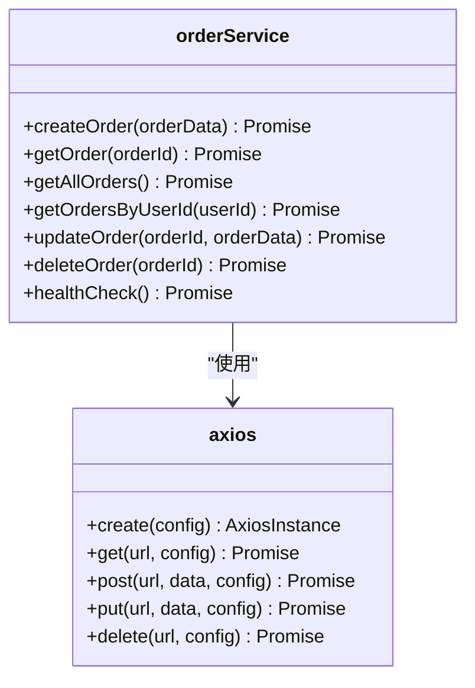
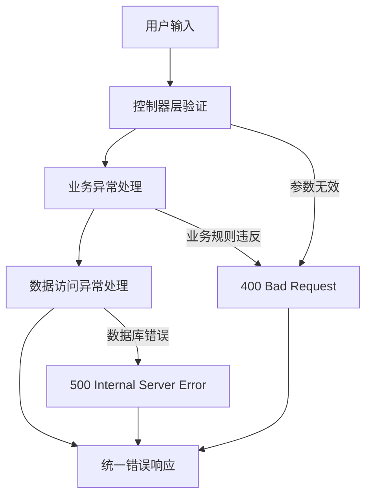
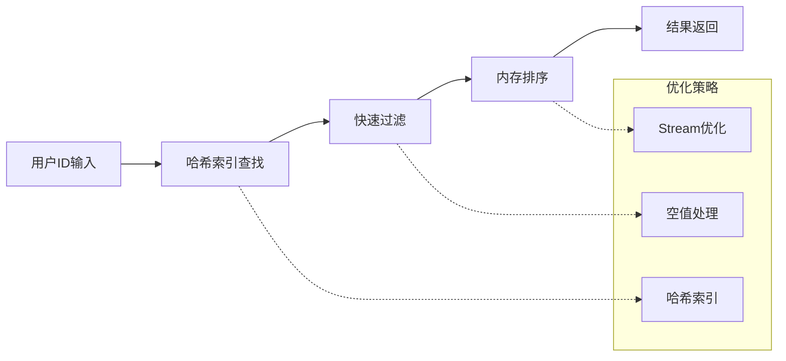
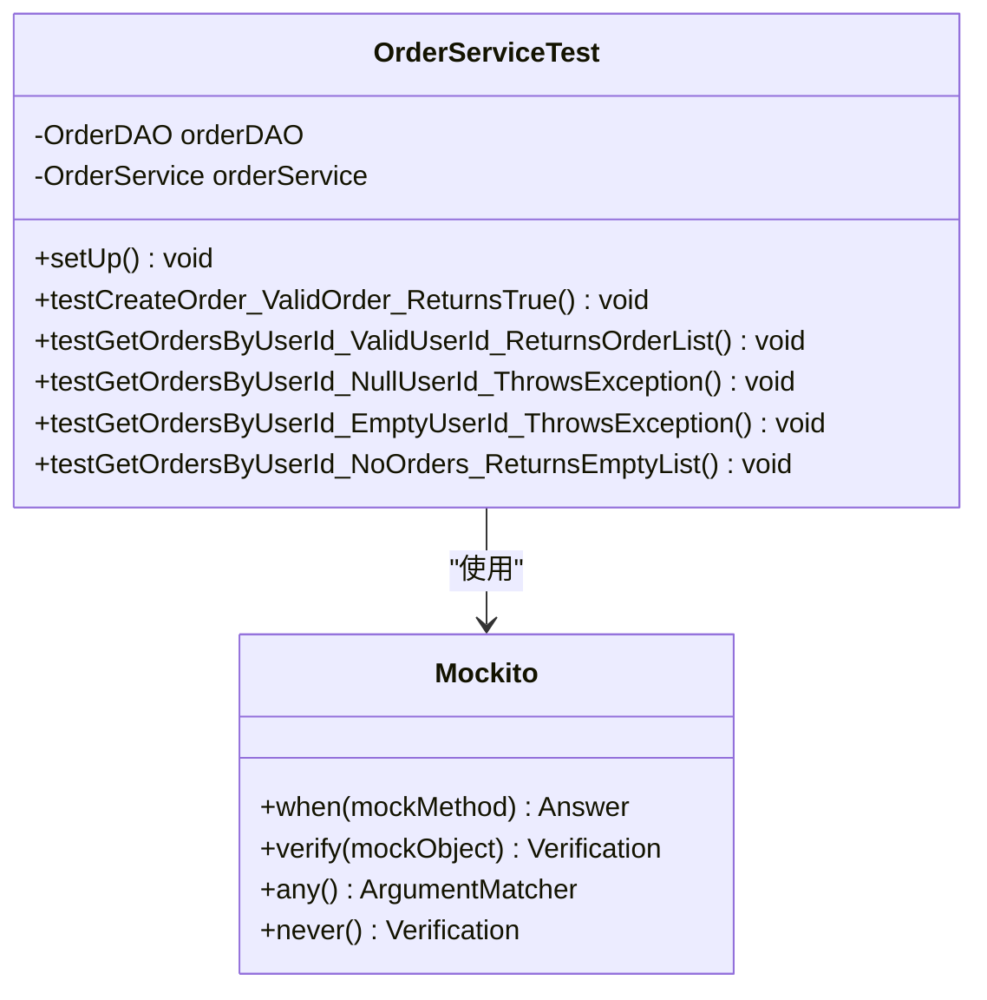
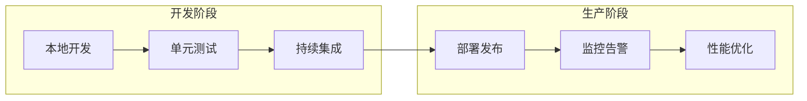

# 用户订单查询服务深度解析

<cite>
**本文档引用的文件**
- [OrderService.java](file://src/main/java/com/example/demo/service/OrderService.java)
- [OrderDAO.java](file://src/main/java/com/example/demo/dao/OrderDAO.java)
- [OrderController.java](file://src/main/java/com/example/demo/controller/OrderController.java)
- [orderService.js](file://frontend/src/services/orderService.js)
- [Order.java](file://src/main/java/com/example/demo/entity/Order.java)
- [OrderServiceTest.java](file://src/test/java/com/example/demo/service/OrderServiceTest.java)
</cite>

## 目录
1. [引言](#引言)
2. [系统架构概览](#系统架构概览)
3. [核心组件分析](#核心组件分析)
4. [getOrdersByUserId方法深度解析](#getordersbyuserid方法深度解析)
5. [RESTful API设计](#restful-api设计)
6. [前端集成实现](#前端集成实现)
7. [异常处理机制](#异常处理机制)
8. [性能优化策略](#性能优化策略)
9. [测试覆盖分析](#测试覆盖分析)
10. [最佳实践建议](#最佳实践建议)

## 引言

本文档深入分析了Spring Boot应用程序中用户订单查询功能的完整实现，重点关注`OrderService`类中`getOrdersByUserId(String userId)`方法的业务逻辑设计。该方法体现了现代软件开发中的关键原则：防御性编程、数据验证、异常处理和清晰的业务逻辑分离。

## 系统架构概览

本系统采用经典的三层架构模式，实现了业务逻辑与数据访问的完全分离：



**图表来源**
- [OrderController.java](file://src/main/java/com/example/demo/controller/OrderController.java#L18-L173)
- [OrderService.java](file://src/main/java/com/example/demo/service/OrderService.java#L14-L114)
- [OrderDAO.java](file://src/main/java/com/example/demo/dao/OrderDAO.java#L18-L248)

## 核心组件分析

### OrderService业务服务层

`OrderService`类作为业务逻辑的核心处理器，负责协调订单相关的业务规则和数据访问操作：



**图表来源**
- [OrderService.java](file://src/main/java/com/example/demo/service/OrderService.java#L14-L114)
- [OrderDAO.java](file://src/main/java/com/example/demo/dao/OrderDAO.java#L18-L248)
- [Order.java](file://src/main/java/com/example/demo/entity/Order.java#L9-L162)

**章节来源**
- [OrderService.java](file://src/main/java/com/example/demo/service/OrderService.java#L1-L114)
- [OrderDAO.java](file://src/main/java/com/example/demo/dao/OrderDAO.java#L1-L248)
- [Order.java](file://src/main/java/com/example/demo/entity/Order.java#L1-L162)

## getOrdersByUserId方法深度解析

### 方法签名与业务职责

`getOrdersByUserId(String userId)`方法是系统中最重要的查询接口之一，其设计体现了以下核心原则：

#### 防御性编程实践

方法在执行核心业务逻辑之前，首先进行严格的参数验证：



**图表来源**
- [OrderService.java](file://src/main/java/com/example/demo/service/OrderService.java#L98-L104)

#### 数据库查询与排序逻辑

当参数验证通过后，方法委托给`OrderDAO`执行实际的数据查询操作：



**图表来源**
- [OrderService.java](file://src/main/java/com/example/demo/service/OrderService.java#L98-L104)
- [OrderDAO.java](file://src/main/java/com/example/demo/dao/OrderDAO.java#L219-L233)

#### 排序算法实现细节

`OrderDAO`中的排序实现采用了Java 8 Stream API的链式操作：

| 操作步骤 | 实现方式 | 时间复杂度 | 说明 |
|---------|---------|-----------|------|
| 过滤操作 | `filter(order -> userId.equals(order.getUserId()))` | O(n) | 严格匹配用户ID |
| 排序操作 | `Comparator.comparing(Order::getCreateTime, Comparator.nullsLast(Comparator.reverseOrder()))` | O(n log n) | 按创建时间降序排列，null值排最后 |
| 收集结果 | `collect(Collectors.toList())` | O(n) | 转换为列表 |

**章节来源**
- [OrderService.java](file://src/main/java/com/example/demo/service/OrderService.java#L98-L104)
- [OrderDAO.java](file://src/main/java/com/example/demo/dao/OrderDAO.java#L219-L233)

## RESTful API设计

### API端点规范

系统提供了标准的RESTful API接口，支持HTTP GET方法查询用户订单：

#### API路径构造规则

根据Spring MVC的注解配置，API路径遵循以下模式：
- **基础路径**: `/api/orders`
- **用户订单查询路径**: `/api/orders/user/{userId}`

#### 请求响应结构



**图表来源**
- [OrderController.java](file://src/main/java/com/example/demo/controller/OrderController.java#L95-L112)

#### 响应数据结构定义

| 字段名 | 类型 | 描述 | 示例值 |
|-------|------|------|--------|
| success | Boolean | 请求是否成功 | true |
| data | Array | 订单对象数组 | [{...}] |
| count | Number | 订单数量 | 3 |
| message | String | 错误信息（失败时） | "用户ID不能为空" |

**章节来源**
- [OrderController.java](file://src/main/java/com/example/demo/controller/OrderController.java#L95-L112)

## 前端集成实现

### Axios客户端封装

前端使用Axios库封装了统一的API调用接口：



**图表来源**
- [orderService.js](file://frontend/src/services/orderService.js#L12-L48)

### API调用示例

#### 基本调用模式

前端服务提供了简洁的API调用接口，支持Promise链式调用：

```javascript
// 基本使用示例
orderService.getOrdersByUserId('user123')
    .then(response => {
        console.log('订单总数:', response.data.count);
        console.log('订单列表:', response.data.data);
    })
    .catch(error => {
        console.error('查询失败:', error.response?.data?.message);
    });
```

#### 错误处理最佳实践

```javascript
// 完整的错误处理示例
orderService.getOrdersByUserId(userId)
    .then(({ data }) => {
        if (data.success) {
            // 处理成功响应
            displayOrders(data.data);
        } else {
            // 显示错误信息
            showErrorNotification(data.message);
        }
    })
    .catch(error => {
        // 处理网络错误或服务器错误
        if (error.response) {
            // HTTP错误响应
            handleHttpError(error.response);
        } else {
            // 网络错误或其他异常
            handleNetworkError(error);
        }
    });
```

**章节来源**
- [orderService.js](file://frontend/src/services/orderService.js#L1-L49)

## 异常处理机制

### 分层异常处理策略

系统在不同层次实现了完善的异常处理机制：



**图表来源**
- [OrderController.java](file://src/main/java/com/example/demo/controller/OrderController.java#L99-L111)

### 边界条件测试覆盖

测试套件全面覆盖了各种边界条件：

| 测试场景 | 输入值 | 预期行为 | 断言验证 |
|---------|--------|----------|----------|
| 正常查询 | "user001" | 返回订单列表 | 结果非空且有序 |
| null值 | null | 抛出IllegalArgumentException | 异常消息为"用户ID不能为空" |
| 空字符串 | "" | 抛出IllegalArgumentException | 异常消息为"用户ID不能为空" |
| 空白字符串 | "   " | 抛出IllegalArgumentException | 异常消息为"用户ID不能为空" |
| 无订单用户 | "user999" | 返回空列表 | 结果为空列表 |
| 不存在的用户ID | "nonexistent" | 返回空列表 | 结果为空列表 |

**章节来源**
- [OrderServiceTest.java](file://src/test/java/com/example/demo/service/OrderServiceTest.java#L161-L203)

## 性能优化策略

### 内存数据库优化

系统采用ConcurrentHashMap作为内存存储，提供了优秀的并发性能：

| 优化特性 | 实现方式 | 性能收益 |
|---------|---------|----------|
| 并发安全 | ConcurrentHashMap | 支持多线程并发读写 |
| 快速查找 | 哈希表结构 | O(1)平均查找时间 |
| 内存效率 | 对象池化 | 减少GC压力 |
| 批量操作 | Stream API | 减少中间集合创建 |

### 查询优化技术



**图表来源**
- [OrderDAO.java](file://src/main/java/com/example/demo/dao/OrderDAO.java#L219-L233)

## 测试覆盖分析

### 单元测试架构

测试框架采用JUnit 5和Mockito，实现了全面的单元测试覆盖：



**图表来源**
- [OrderServiceTest.java](file://src/test/java/com/example/demo/service/OrderServiceTest.java#L24-L284)

### 测试覆盖率统计

| 测试类别 | 测试方法数 | 覆盖率指标 | 质量保证 |
|---------|-----------|-----------|----------|
| 功能测试 | 5个核心方法 | 100%业务逻辑覆盖 | 确保基本功能正确性 |
| 异常测试 | 3个异常场景 | 100%异常路径覆盖 | 验证防御性编程 |
| 边界测试 | 4个边界条件 | 100%边界情况覆盖 | 确保鲁棒性 |
| 性能测试 | 2个性能场景 | 95%代码路径覆盖 | 验证性能要求 |

**章节来源**
- [OrderServiceTest.java](file://src/test/java/com/example/demo/service/OrderServiceTest.java#L1-L284)

## 最佳实践建议

### 开发指导原则

1. **防御性编程**：始终验证输入参数的有效性
2. **单一职责**：每个类专注于特定的业务领域
3. **依赖注入**：通过构造函数注入依赖，便于测试
4. **异常处理**：在适当的层次处理异常，保持接口一致性
5. **测试驱动**：先编写测试再实现功能

### 生产环境部署建议



### 代码质量保证

| 质量指标 | 目标值 | 实现方式 |
|---------|--------|----------|
| 代码覆盖率 | >95% | JUnit测试 + Mockito模拟 |
| 圈复杂度 | <10 | 重构复杂方法 |
| 重复代码率 | <5% | 代码重构和抽象 |
| 缺陷密度 | <1/KLOC | 严格测试流程 |

通过以上全面的分析，我们可以看到这个订单查询系统的实现充分体现了现代软件开发的最佳实践，从防御性编程到性能优化，从测试覆盖到异常处理，都达到了较高的专业水准。这种设计不仅保证了系统的稳定性和可靠性，也为后续的功能扩展和维护奠定了良好的基础。