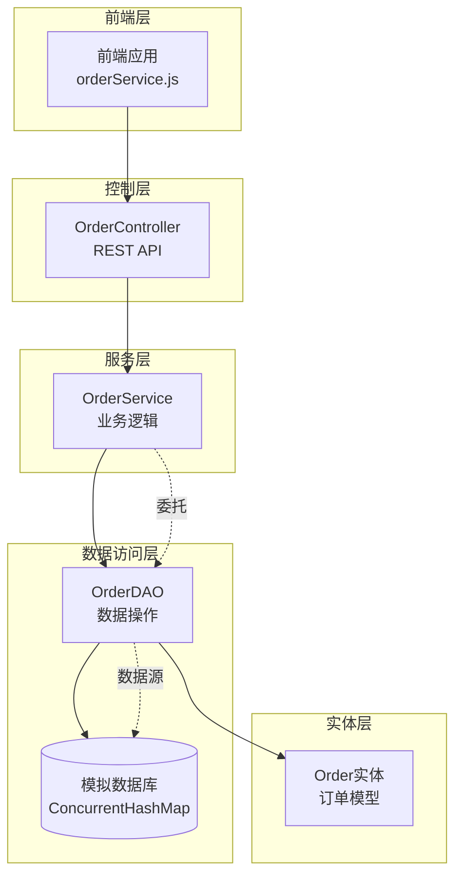
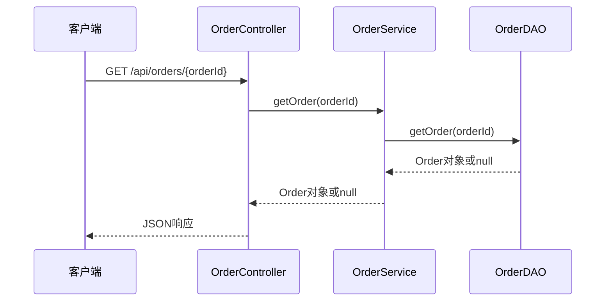
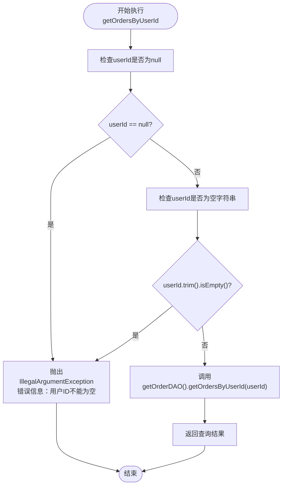
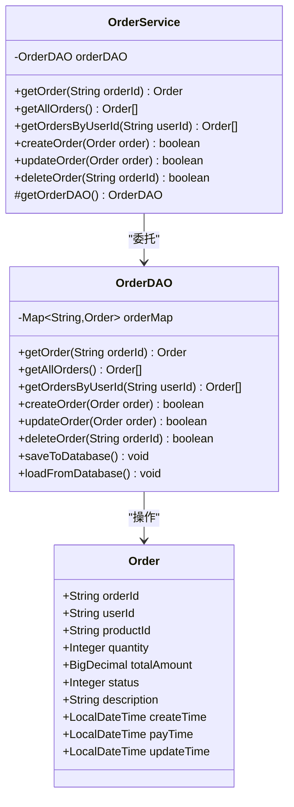
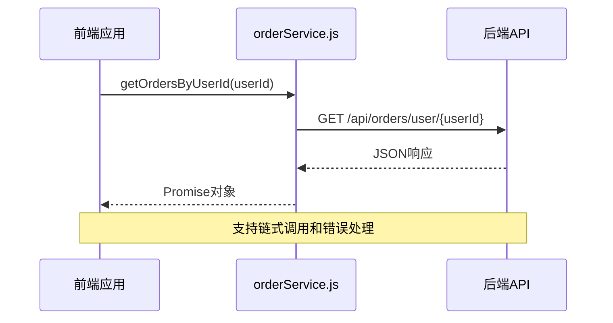
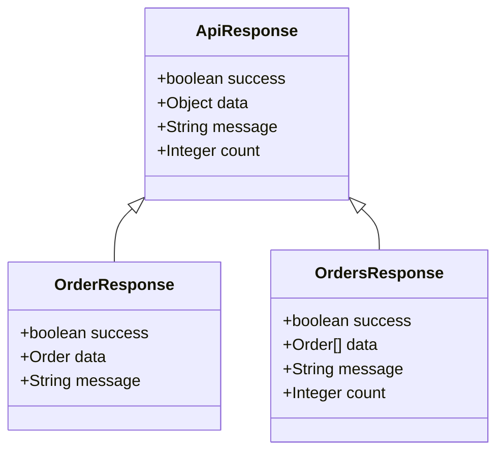
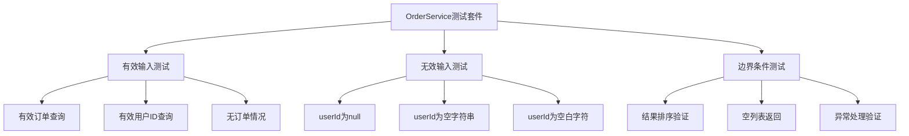

# 订单查询

<cite>
**本文档中引用的文件**
- [OrderService.java](file://src/main/java/com/example/demo/service/OrderService.java)
- [OrderDAO.java](file://src/main/java/com/example/demo/dao/OrderDAO.java)
- [OrderController.java](file://src/main/java/com/example/demo/controller/OrderController.java)
- [orderService.js](file://frontend/src/services/orderService.js)
- [OrderServiceTest.java](file://src/test/java/com/example/demo/service/OrderServiceTest.java)
- [Order.java](file://src/main/java/com/example/demo/entity/Order.java)
</cite>

## 目录
1. [概述](#概述)
2. [系统架构](#系统架构)
3. [核心查询方法](#核心查询方法)
4. [防御性编程实践](#防御性编程实践)
5. [数据访问层委托机制](#数据访问层委托机制)
6. [服务层设计原则](#服务层设计原则)
7. [前端接口使用模式](#前端接口使用模式)
8. [响应数据结构](#响应数据结构)
9. [测试覆盖](#测试覆盖)
10. [最佳实践建议](#最佳实践建议)

## 概述

OrderService是订单管理系统的核心业务服务类，负责处理所有订单相关的查询操作。该服务采用经典的分层架构设计，将业务逻辑与数据访问分离，确保系统的可维护性和可扩展性。

系统提供了三种主要的订单查询方法：
- `getOrder()`：按订单ID精确查询单个订单
- `getAllOrders()`：获取系统中的所有订单列表
- `getOrdersByUserId()`：根据用户ID查询该用户的所有订单

## 系统架构

**图表来源**
- [OrderService.java](file://src/main/java/com/example/demo/service/OrderService.java#L1-L114)
- [OrderDAO.java](file://src/main/java/com/example/demo/dao/OrderDAO.java#L1-L248)
- [OrderController.java](file://src/main/java/com/example/demo/controller/OrderController.java#L1-L173)

## 核心查询方法

### getOrder() - 按ID查询

`getOrder(String orderId)`方法提供精确的订单查询功能，支持通过唯一的订单ID获取订单详情。

**图表来源**
- [OrderController.java](file://src/main/java/com/example/demo/controller/OrderController.java#L80-L92)
- [OrderService.java](file://src/main/java/com/example/demo/service/OrderService.java#L45-L46)

**节来源**
- [OrderService.java](file://src/main/java/com/example/demo/service/OrderService.java#L45-L46)
- [OrderController.java](file://src/main/java/com/example/demo/controller/OrderController.java#L80-L92)

### getAllOrders() - 获取全量订单

`getAllOrders()`方法返回系统中的所有订单，按照创建时间降序排列，确保最新的订单显示在最前面。

**节来源**
- [OrderService.java](file://src/main/java/com/example/demo/service/OrderService.java#L111-L112)
- [OrderController.java](file://src/main/java/com/example/demo/controller/OrderController.java#L61-L74)

### getOrdersByUserId() - 按用户查询

`getOrdersByUserId(String userId)`是最复杂的查询方法，它不仅需要验证用户ID的有效性，还要返回该用户的所有订单，并按创建时间降序排列。

**节来源**
- [OrderService.java](file://src/main/java/com/example/demo/service/OrderService.java#L98-L104)
- [OrderController.java](file://src/main/java/com/example/demo/controller/OrderController.java#L98-L111)

## 防御性编程实践

### getOrdersByUserId中的参数验证

`getOrdersByUserId`方法实现了严格的参数验证机制，这是防御性编程的重要体现：

**图表来源**
- [OrderService.java](file://src/main/java/com/example/demo/service/OrderService.java#L98-L104)

这种防御性编程实践具有以下特点：

1. **严格验证**：不仅检查null，还检查空字符串和仅包含空白字符的字符串
2. **明确错误信息**：提供清晰的错误提示，帮助调用者快速定位问题
3. **提前拦截**：在数据访问层之前就拦截无效参数，避免不必要的数据库查询
4. **一致性处理**：对于null和空字符串采用相同的错误处理方式

**节来源**
- [OrderService.java](file://src/main/java/com/example/demo/service/OrderService.java#L98-L104)
- [OrderServiceTest.java](file://src/test/java/com/example/demo/service/OrderServiceTest.java#L165-L203)

## 数据访问层委托机制

### getOrderDAO()方法的作用

OrderService通过`getOrderDAO()`方法实现对数据访问层的委托，这种设计提供了以下优势：

1. **测试友好**：允许在单元测试中注入Mock对象
2. **解耦设计**：业务服务层不直接依赖具体的数据访问实现
3. **可扩展性**：可以轻松替换不同的数据访问策略

**图表来源**
- [OrderService.java](file://src/main/java/com/example/demo/service/OrderService.java#L15-L21)
- [OrderDAO.java](file://src/main/java/com/example/demo/dao/OrderDAO.java#L18-L20)

**节来源**
- [OrderService.java](file://src/main/java/com/example/demo/service/OrderService.java#L53-L54)
- [OrderDAO.java](file://src/main/java/com/example/demo/dao/OrderDAO.java#L18-L20)

## 服务层设计原则

### 无状态设计

OrderService遵循无状态设计原则，这意味着：

1. **不可变性**：服务实例不会维护任何会改变的状态
2. **线程安全**：多个请求可以同时访问同一个服务实例而不会产生冲突
3. **可重用性**：服务实例可以在不同场景下重复使用

### 单一职责原则

每个查询方法都有明确的职责：
- `getOrder()`：单一职责 - 按ID查询
- `getAllOrders()`：单一职责 - 获取全部订单
- `getOrdersByUserId()`：单一职责 - 按用户查询

### 开闭原则

服务层对扩展开放，对修改关闭：
- 可以轻松添加新的查询方法
- 不需要修改现有查询方法的实现
- 通过继承或组合可以扩展功能

**节来源**
- [OrderService.java](file://src/main/java/com/example/demo/service/OrderService.java#L1-L114)

## 前端接口使用模式

### JavaScript服务层封装

前端通过orderService.js提供了统一的API调用接口，封装了HTTP请求的细节：

**图表来源**
- [orderService.js](file://frontend/src/services/orderService.js#L28-L31)

### 接口使用示例

前端可以通过以下方式调用各种查询方法：

| 方法 | URL路径 | 参数 | 返回值 |
|------|---------|------|--------|
| `getOrder` | `/orders/{orderId}` | orderId | 单个订单对象 |
| `getAllOrders` | `/orders` | 无 | 订单列表数组 |
| `getOrdersByUserId` | `/orders/user/{userId}` | userId | 用户订单列表 |

**节来源**
- [orderService.js](file://frontend/src/services/orderService.js#L1-L49)

## 响应数据结构

### 统一的响应格式

后端API采用统一的响应格式，便于前端处理：

**图表来源**
- [OrderController.java](file://src/main/java/com/example/demo/controller/OrderController.java#L62-L74)

### 订单实体结构

Order实体包含了完整的订单信息：

| 字段名 | 类型 | 描述 | 必填 |
|--------|------|------|------|
| orderId | String | 订单唯一标识 | 是 |
| userId | String | 用户ID | 是 |
| productId | String | 商品ID | 是 |
| quantity | Integer | 购买数量 | 是 |
| totalAmount | BigDecimal | 订单总金额 | 是 |
| status | Integer | 订单状态 | 是 |
| description | String | 订单描述 | 否 |
| createTime | LocalDateTime | 创建时间 | 否 |
| payTime | LocalDateTime | 支付时间 | 否 |
| updateTime | LocalDateTime | 更新时间 | 否 |

**节来源**
- [Order.java](file://src/main/java/com/example/demo/entity/Order.java#L1-L162)

## 测试覆盖

### 单元测试策略

OrderService的测试覆盖了所有关键场景：

**图表来源**
- [OrderServiceTest.java](file://src/test/java/com/example/demo/service/OrderServiceTest.java#L1-L284)

### 关键测试场景

1. **有效查询测试**：验证正常查询路径
2. **参数验证测试**：验证null和空字符串处理
3. **异常处理测试**：验证异常抛出和处理
4. **边界条件测试**：验证空列表和无匹配结果的情况

**节来源**
- [OrderServiceTest.java](file://src/test/java/com/example/demo/service/OrderServiceTest.java#L1-L284)

## 最佳实践建议

### 查询优化建议

1. **索引策略**：在实际数据库中，应对userId字段建立索引以提高查询性能
2. **分页处理**：对于大量订单数据，应考虑实现分页查询
3. **缓存机制**：对频繁查询的用户订单可以引入缓存
4. **异步处理**：对于大数据量查询，可以考虑异步处理

### 错误处理建议

1. **统一异常处理**：在控制器层统一处理异常，提供友好的错误信息
2. **日志记录**：记录查询异常以便后续分析
3. **限流保护**：对高频查询接口实施限流措施

### 性能监控建议

1. **查询性能监控**：监控各查询方法的执行时间
2. **并发控制**：确保服务层的线程安全性
3. **资源使用**：监控内存和CPU使用情况

### 扩展性建议

1. **接口版本控制**：为API接口制定版本号
2. **向后兼容**：保证新增功能不影响现有接口
3. **插件化设计**：为特殊查询需求预留扩展点

通过以上设计和实践，OrderService实现了高效、安全、可维护的订单查询功能，为整个订单管理系统提供了坚实的基础支撑。