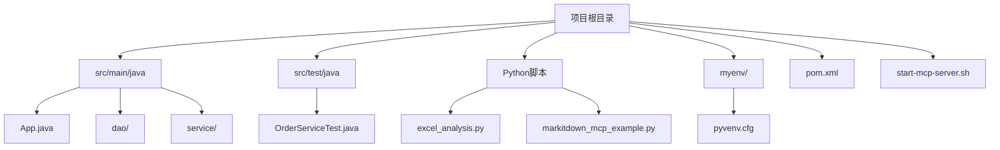
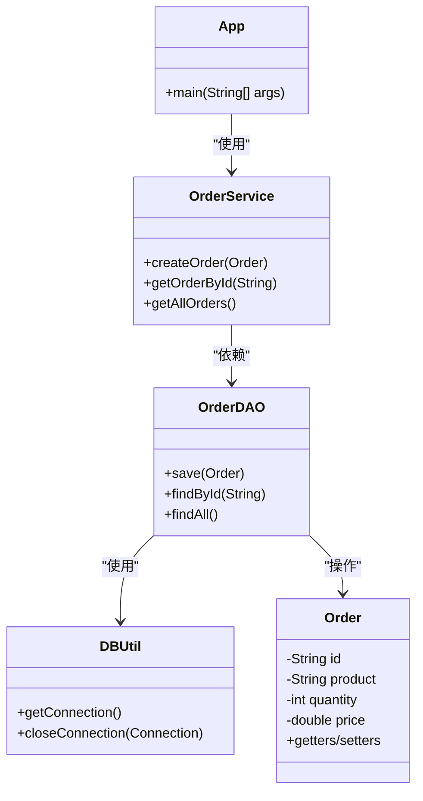
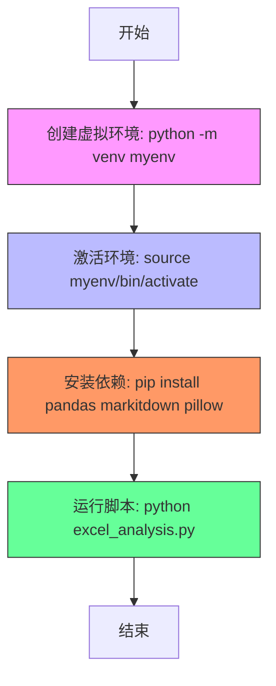
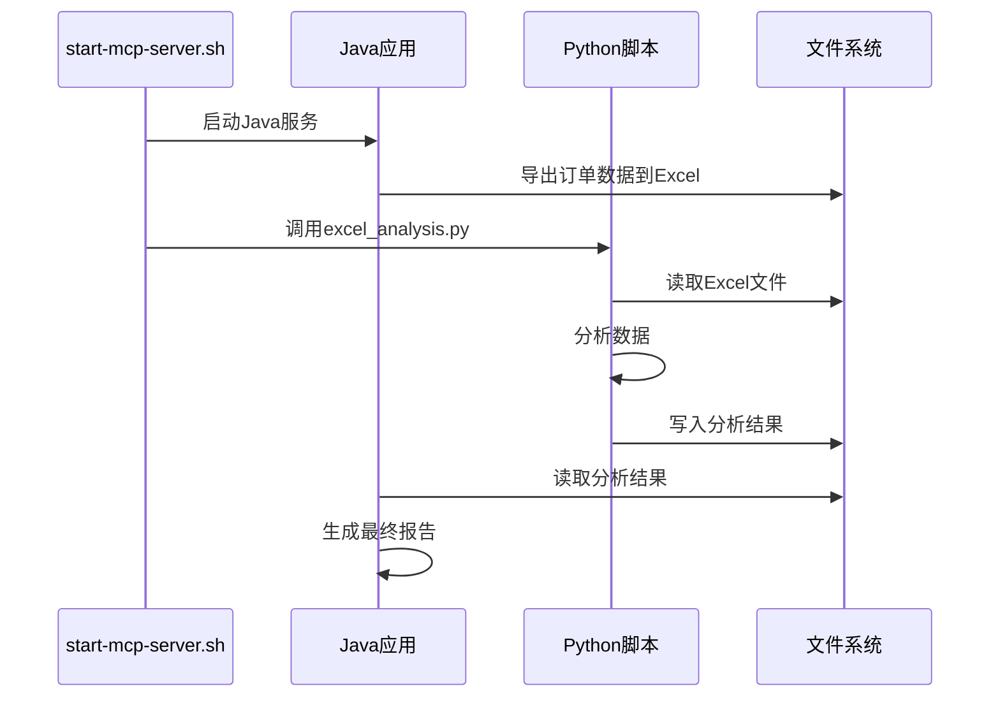

# 技术栈与依赖

<cite>
**本文档引用的文件**  
- [pom.xml](file://pom.xml)
- [myenv/pyvenv.cfg](file://myenv/pyvenv.cfg)
- [src/main/java/com/example/demo/App.java](file://src/main/java/com/example/demo/App.java)
- [src/main/java/com/example/demo/dao/DBUtil.java](file://src/main/java/com/example/demo/dao/DBUtil.java)
- [src/main/java/com/example/demo/service/OrderService.java](file://src/main/java/com/example/demo/service/OrderService.java)
- [src/test/java/com/example/demo/service/OrderServiceTest.java](file://src/test/java/com/example/demo/service/OrderServiceTest.java)
- [comprehensive_excel_analysis.py](file://comprehensive_excel_analysis.py)
- [excel_analysis.py](file://excel_analysis.py)
- [markitdown_mcp_example.py](file://markitdown_mcp_example.py)
- [start-mcp-server.sh](file://start-mcp-server.sh)
</cite>

## 目录
1. [简介](#简介)
2. [项目结构](#项目结构)
3. [Java技术栈与Maven配置](#java技术栈与maven配置)
4. [Python环境与依赖管理](#python环境与依赖管理)
5. [Java与Python协同工作机制](#java与python协同工作机制)
6. [关键技术选型分析](#关键技术选型分析)
7. [版本兼容性与依赖冲突解决](#版本兼容性与依赖冲突解决)
8. [结论](#结论)

## 简介
0713demo1103项目是一个混合技术栈应用，结合了Java和Python两种编程语言的优势，实现数据处理、分析与服务化功能。本项目通过Maven管理Java依赖，使用JUnit进行单元测试，并集成SQLite作为嵌入式数据库。同时，项目包含Python脚本用于数据分析，通过虚拟环境隔离依赖。本文档详细说明该项目的技术栈构成、配置方式及协同工作原理。

## 项目结构
项目采用分层结构组织代码，Java源码位于`src/main/java`目录，测试代码位于`src/test/java`，Python脚本位于项目根目录，虚拟环境位于`myenv/`目录。Maven构建配置通过`pom.xml`文件定义，Python依赖通过虚拟环境隔离管理。



**Diagram sources**  
- [pom.xml](file://pom.xml#L1-L10)
- [myenv/pyvenv.cfg](file://myenv/pyvenv.cfg#L1-L5)

**Section sources**  
- [pom.xml](file://pom.xml#L1-L50)
- [myenv/pyvenv.cfg](file://myenv/pyvenv.cfg#L1-L10)

## Java技术栈与Maven配置
项目使用Maven作为Java项目的构建和依赖管理工具。`pom.xml`文件定义了项目的基本信息、依赖项和构建配置。项目依赖包括JUnit用于单元测试，sqlite-jdbc作为数据库驱动，以及其他必要的Java工具库。

Maven项目结构遵循标准目录布局：`src/main/java`存放主代码，`src/test/java`存放测试代码，`target/`目录存放编译输出和测试报告。通过`mvn test`命令可执行单元测试，测试结果生成在`target/surefire-reports/`目录中。



**Diagram sources**  
- [src/main/java/com/example/demo/App.java](file://src/main/java/com/example/demo/App.java#L1-L15)
- [src/main/java/com/example/demo/service/OrderService.java](file://src/main/java/com/example/demo/service/OrderService.java#L1-L20)
- [src/main/java/com/example/demo/dao/OrderDAO.java](file://src/main/java/com/example/demo/dao/OrderDAO.java#L1-L15)
- [src/main/java/com/example/demo/entity/Order.java](file://src/main/java/com/example/demo/entity/Order.java#L1-L10)

**Section sources**  
- [pom.xml](file://pom.xml#L10-L100)
- [src/main/java/com/example/demo/App.java](file://src/main/java/com/example/demo/App.java#L1-L50)
- [src/main/java/com/example/demo/dao/DBUtil.java](file://src/main/java/com/example/demo/dao/DBUtil.java#L1-L30)

## Python环境与依赖管理
项目使用Python虚拟环境`myenv`来隔离和管理Python依赖包。虚拟环境通过`pyvenv.cfg`文件配置，确保Python解释器和包的独立性。项目中使用的Python脚本包括`excel_analysis.py`、`comprehensive_excel_analysis.py`和`markitdown_mcp_example.py`，这些脚本依赖pandas进行数据处理，markitdown用于Markdown生成，PIL/OleFileIO用于图像和文件处理。

通过虚拟环境，项目避免了系统级Python包的冲突，确保了依赖的可重现性。开发者可通过激活虚拟环境来运行Python脚本，保证依赖的一致性。



**Diagram sources**  
- [myenv/pyvenv.cfg](file://myenv/pyvenv.cfg#L1-L10)
- [comprehensive_excel_analysis.py](file://comprehensive_excel_analysis.py#L1-L20)
- [excel_analysis.py](file://excel_analysis.py#L1-L15)

**Section sources**  
- [myenv/pyvenv.cfg](file://myenv/pyvenv.cfg#L1-L20)
- [comprehensive_excel_analysis.py](file://comprehensive_excel_analysis.py#L1-L50)
- [excel_analysis.py](file://excel_analysis.py#L1-L30)

## Java与Python协同工作机制
项目通过Shell脚本`start-mcp-server.sh`协调Java和Python环境的启动。Java部分作为主服务运行，提供核心业务逻辑和数据访问，Python脚本作为数据分析组件，在需要时被调用处理Excel文件和生成报告。两者通过文件系统共享数据，Java将数据导出为Excel文件，Python脚本读取并分析这些文件，最后将结果返回给Java服务。

这种混合架构充分利用了Java在企业级应用开发中的稳定性和Python在数据科学领域的强大生态，实现了功能互补。



**Diagram sources**  
- [start-mcp-server.sh](file://start-mcp-server.sh#L1-L15)
- [src/main/java/com/example/demo/App.java](file://src/main/java/com/example/demo/App.java#L20-L40)
- [comprehensive_excel_analysis.py](file://comprehensive_excel_analysis.py#L10-L25)

**Section sources**  
- [start-mcp-server.sh](file://start-mcp-server.sh#L1-L20)
- [src/main/java/com/example/demo/App.java](file://src/main/java/com/example/demo/App.java#L15-L50)
- [comprehensive_excel_analysis.py](file://comprehensive_excel_analysis.py#L1-L40)

## 关键技术选型分析
### 选择SQLite作为嵌入式数据库的原因
SQLite被选为嵌入式数据库主要基于以下几点：轻量级、无需独立服务器进程、单文件数据库便于部署和备份、支持标准SQL语法、跨平台兼容性好。对于本项目这种小型应用，SQLite提供了足够的功能而无需复杂的数据库管理。

### 使用ConcurrentHashMap模拟DAO层的合理性
在开发初期或测试环境中，使用ConcurrentHashMap模拟DAO层可以快速构建原型，避免数据库依赖。它提供了线程安全的Map操作，能够模拟基本的CRUD操作，便于单元测试。当系统需要持久化时，只需替换DAO实现即可，不影响上层业务逻辑。

```mermaid
erDiagram
    ORDER {
        string id PK
        string product
        int quantity
        double price
        datetime create_time
    }
    class ConcurrentHashMapDAO {
        +Map<String, Order> data
        +save(Order)
        +findById(String)
        +findAll()
        +delete(String)
    }
    ORDER ||--o{ ConcurrentHashMapDAO : "由...管理"
```

**Diagram sources**  
- [src/main/java/com/example/demo/dao/OrderDAO.java](file://src/main/java/com/example/demo/dao/OrderDAO.java#L1-L20)
- [src/main/java/com/example/demo/entity/Order.java](file://src/main/java/com/example/demo/entity/Order.java#L1-L15)

**Section sources**  
- [src/main/java/com/example/demo/dao/OrderDAO.java](file://src/main/java/com/example/demo/dao/OrderDAO.java#L1-L40)
- [src/main/java/com/example/demo/dao/DBUtil.java](file://src/main/java/com/example/demo/dao/DBUtil.java#L1-L25)

## 版本兼容性与依赖冲突解决
项目需注意Java版本与Maven插件的兼容性，建议使用Java 8或11以确保最佳兼容性。Python虚拟环境有效解决了Python包版本冲突问题。对于Java依赖，Maven的依赖传递机制可能引入版本冲突，可通过`<dependencyManagement>`明确指定版本，或使用`mvn dependency:tree`分析依赖树并排除冲突传递依赖。

当出现sqlite-jdbc与其它数据库驱动冲突时，应确保项目中只引入一个数据库驱动。对于Python包冲突，虚拟环境天然隔离了不同项目的依赖，避免了全局安装带来的版本问题。

**Section sources**  
- [pom.xml](file://pom.xml#L50-L100)
- [myenv/pyvenv.cfg](file://myenv/pyvenv.cfg#L1-L15)

## 结论
0713demo1103项目成功整合了Java和Python技术栈，通过Maven和虚拟环境分别管理两种语言的依赖，实现了功能完整的混合应用。技术选型合理，架构清晰，便于维护和扩展。建议在生产环境中将ConcurrentHashMap模拟的DAO替换为真正的数据库持久化层，并加强Java与Python之间的数据交换机制。