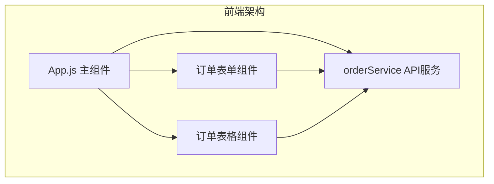
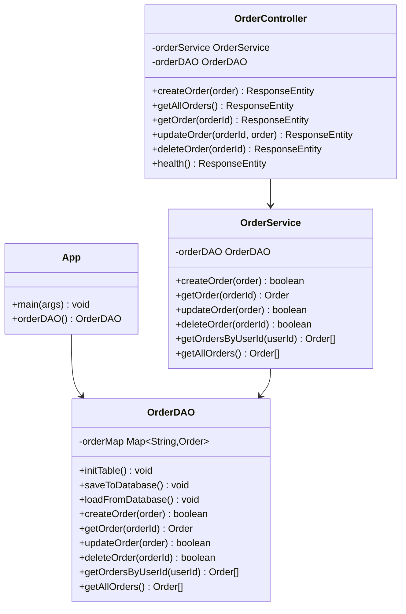
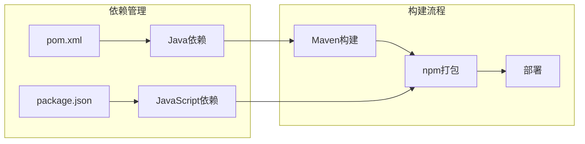
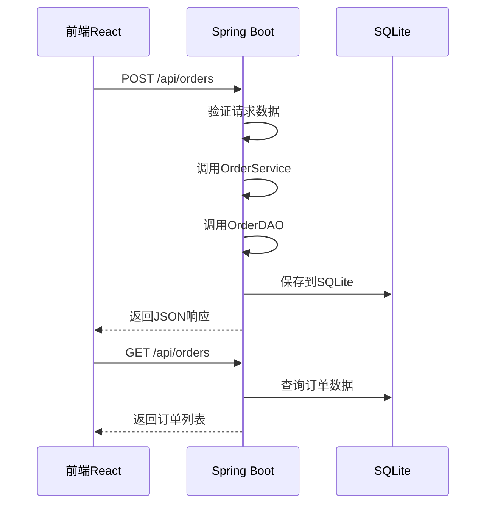
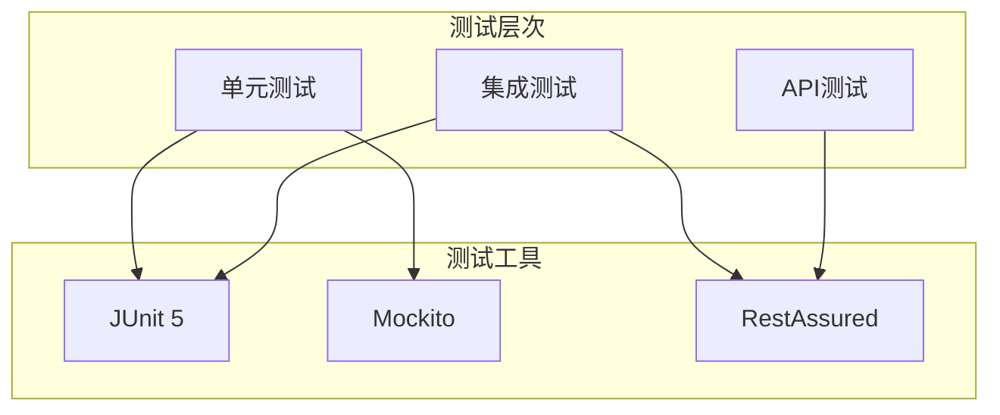

# 技术栈与依赖

<cite>
**本文档引用的文件**
- [pom.xml](file://pom.xml)
- [frontend/package.json](file://frontend/package.json)
- [src/main/resources/application.properties](file://src/main/resources/application.properties)
- [frontend/src/services/orderService.js](file://frontend/src/services/orderService.js)
- [src/main/java/com/example/demo/controller/OrderController.java](file://src/main/java/com/example/demo/controller/OrderController.java)
- [src/main/java/com/example/demo/App.java](file://src/main/java/com/example/demo/App.java)
- [src/main/java/com/example/demo/dao/OrderDAO.java](file://src/main/java/com/example/demo/dao/OrderDAO.java)
- [src/main/java/com/example/demo/service/OrderService.java](file://src/main/java/com/example/demo/service/OrderService.java)
- [src/main/java/com/example/demo/entity/Order.java](file://src/main/java/com/example/demo/entity/Order.java)
- [src/main/java/com/example/demo/dao/DBUtil.java](file://src/main/java/com/example/demo/dao/DBUtil.java)
- [frontend/src/App.js](file://frontend/src/App.js)
- [src/test/java/com/example/demo/controller/OrderControllerIT.java](file://src/test/java/com/example/demo/controller/OrderControllerIT.java)
- [src/test/java/com/example/demo/service/OrderServiceTest.java](file://src/test/java/com/example/demo/service/OrderServiceTest.java)
</cite>

## 目录
1. [项目概述](#项目概述)
2. [前端技术栈](#前端技术栈)
3. [后端技术栈](#后端技术栈)
4. [核心依赖分析](#核心依赖分析)
5. [依赖管理策略](#依赖管理策略)
6. [技术协同机制](#技术协同机制)
7. [测试策略](#测试策略)
8. [总结](#总结)

## 项目概述

本项目是一个基于Spring Boot和React技术栈构建的订单管理系统，采用前后端分离架构。系统通过RESTful API进行通信，使用SQLite数据库存储订单数据，实现了完整的订单生命周期管理功能。

## 前端技术栈

### React框架

React作为前端核心框架，提供了以下关键特性：

- **组件化开发**：采用函数式组件和Hooks模式，实现可复用的UI组件
- **状态管理**：使用React的useState和useEffect Hooks管理应用状态
- **响应式设计**：通过CSS模块化和条件渲染实现动态UI效果
- **类型安全**：配合TypeScript（虽然项目中未明确使用，但React本身支持）

**图表来源**
- [frontend/src/App.js](file://frontend/src/App.js#L1-L427)
- [frontend/src/services/orderService.js](file://frontend/src/services/orderService.js#L1-L49)

### 组件化设计思想

前端采用模块化的组件设计：

- **表单组件**：负责订单创建和编辑功能
- **表格组件**：展示订单列表和状态管理
- **状态组件**：显示连接状态和消息提示
- **服务层**：封装HTTP通信逻辑

### Axios HTTP通信

前端使用Axios库实现HTTP请求：

- **统一配置**：通过axios.create创建配置化的API实例
- **错误处理**：内置请求拦截器和响应拦截器
- **RESTful调用**：提供标准化的API调用接口
- **环境适配**：支持开发和生产环境的不同API地址

**章节来源**
- [frontend/src/services/orderService.js](file://frontend/src/services/orderService.js#L1-L49)
- [frontend/src/App.js](file://frontend/src/App.js#L1-L427)

## 后端技术栈

### Spring Boot核心优势

Spring Boot为后端提供了完整的基础设施：

- **自动配置**：简化配置过程，快速启动应用
- **内嵌服务器**：内置Tomcat服务器，无需外部部署
- **约定优于配置**：遵循Spring Boot最佳实践
- **开箱即用**：提供丰富的starter依赖

**图表来源**
- [src/main/java/com/example/demo/App.java](file://src/main/java/com/example/demo/App.java#L1-L24)
- [src/main/java/com/example/demo/controller/OrderController.java](file://src/main/java/com/example/demo/controller/OrderController.java#L1-L173)
- [src/main/java/com/example/demo/service/OrderService.java](file://src/main/java/com/example/demo/service/OrderService.java#L1-L114)
- [src/main/java/com/example/demo/dao/OrderDAO.java](file://src/main/java/com/example/demo/dao/OrderDAO.java#L1-L248)

### Spring MVC Web请求处理

Spring MVC提供了完整的Web请求处理机制：

- **注解驱动**：使用@RestController和@RequestMapping简化控制器开发
- **路径参数**：支持@PathVariable提取URL路径参数
- **请求体**：通过@RequestBody绑定JSON请求体
- **跨域支持**：使用@CrossOrigin解决CORS问题
- **响应状态**：灵活的HTTP状态码和响应体控制

### 数据访问层设计

数据访问层采用DAO模式：

- **内存缓存**：使用ConcurrentHashMap实现高性能内存存储
- **持久化**：通过SQLite JDBC驱动实现数据持久化
- **事务管理**：确保数据一致性和完整性
- **异常处理**：完善的SQL异常处理机制

**章节来源**
- [src/main/java/com/example/demo/controller/OrderController.java](file://src/main/java/com/example/demo/controller/OrderController.java#L1-L173)
- [src/main/java/com/example/demo/dao/OrderDAO.java](file://src/main/java/com/example/demo/dao/OrderDAO.java#L1-L248)

## 核心依赖分析

### Maven依赖管理

项目使用Maven进行Java依赖管理，核心依赖包括：

| 依赖名称 | 版本 | 用途 | 在项目中的作用 |
|---------|------|------|---------------|
| spring-boot-starter-web | 2.7.14 | Web应用基础 | 提供Spring MVC和嵌入式Tomcat |
| junit-jupiter-api/engine | 5.8.1 | 单元测试 | JUnit 5测试框架核心 |
| mockito-core | 4.6.1 | 测试模拟 | Mock对象创建和验证 |
| sqlite-jdbc | 3.36.0.3 | 数据库驱动 | SQLite数据库连接 |
| spring-boot-starter-test | 2.7.14 | 测试支持 | Spring Boot测试集成 |
| rest-assured | 4.5.1 | API测试 | RESTful API集成测试 |

### npm依赖管理

前端使用npm管理JavaScript依赖：

| 依赖名称 | 版本 | 用途 | 在项目中的作用 |
|---------|------|------|---------------|
| react | 19.2.0 | 核心框架 | UI组件开发 |
| react-dom | 19.2.0 | DOM渲染 | React与DOM交互 |
| axios | 1.13.2 | HTTP客户端 | API请求发送 |
| react-scripts | 5.0.1 | 构建工具 | 开发和构建脚本 |
| @testing-library/react | 16.3.0 | 测试工具 | React组件测试 |

### 关键配置

#### Spring Boot配置
- **端口配置**：server.port=9090
- **应用名称**：spring.application.name=order-management-system
- **日志级别**：logging.level.com.example.demo=INFO

#### 数据库配置
- **连接URL**：jdbc:sqlite:test.db
- **表结构**：自动创建order0713表
- **字段类型**：支持文本、整数、浮点数、日期时间

**章节来源**
- [pom.xml](file://pom.xml#L1-L136)
- [frontend/package.json](file://frontend/package.json#L1-L41)
- [src/main/resources/application.properties](file://src/main/resources/application.properties#L1-L5)

## 依赖管理策略

### Maven与npm协同工作机制

项目采用双依赖管理体系：

**图表来源**
- [pom.xml](file://pom.xml#L1-L136)
- [frontend/package.json](file://frontend/package.json#L1-L41)

### 依赖版本策略

- **Spring Boot版本**：使用官方推荐的稳定版本2.7.14
- **测试框架版本**：保持JUnit 5和Mockito的兼容性
- **前端框架版本**：采用最新的React 19.2.0
- **数据库驱动**：选择稳定的SQLite JDBC 3.36.0.3

### 依赖冲突解决

项目通过以下方式避免依赖冲突：
- 使用Spring Boot BOM管理依赖版本
- 明确指定测试依赖范围
- 排除不必要的传递依赖

**章节来源**
- [pom.xml](file://pom.xml#L12-L136)

## 技术协同机制

### 前后端通信协议

系统采用RESTful API进行前后端通信：

**图表来源**
- [frontend/src/services/orderService.js](file://frontend/src/services/orderService.js#L1-L49)
- [src/main/java/com/example/demo/controller/OrderController.java](file://src/main/java/com/example/demo/controller/OrderController.java#L1-L173)

### 数据流转机制

1. **前端数据**：通过React组件收集用户输入
2. **HTTP传输**：使用Axios发送JSON格式数据
3. **后端处理**：Spring Boot接收并验证请求
4. **业务逻辑**：OrderService处理业务规则
5. **数据持久化**：OrderDAO操作SQLite数据库
6. **响应返回**：标准化JSON格式响应

### 错误处理机制

- **前端错误**：捕获网络错误和API响应错误
- **后端错误**：统一的异常处理器和状态码返回
- **数据库错误**：SQL异常的优雅处理和用户友好提示

**章节来源**
- [frontend/src/services/orderService.js](file://frontend/src/services/orderService.js#L1-L49)
- [src/main/java/com/example/demo/controller/OrderController.java](file://src/main/java/com/example/demo/controller/OrderController.java#L1-L173)

## 测试策略

### JUnit 5与Mockito测试

项目采用现代化的测试框架组合：

**图表来源**
- [src/test/java/com/example/demo/service/OrderServiceTest.java](file://src/test/java/com/example/demo/service/OrderServiceTest.java#L1-L284)
- [src/test/java/com/example/demo/controller/OrderControllerIT.java](file://src/test/java/com/example/demo/controller/OrderControllerIT.java#L1-L175)

### 测试覆盖范围

- **单元测试**：OrderService和OrderDAO的业务逻辑测试
- **集成测试**：OrderController的完整API流程测试
- **API测试**：使用RestAssured进行端到端的API验证

### 测试最佳实践

- **Mock对象**：使用Mockito模拟依赖组件
- **测试隔离**：每个测试用例独立运行
- **断言验证**：详细的响应数据验证
- **异常测试**：边界条件和错误场景测试

**章节来源**
- [src/test/java/com/example/demo/service/OrderServiceTest.java](file://src/test/java/com/example/demo/service/OrderServiceTest.java#L1-L284)
- [src/test/java/com/example/demo/controller/OrderControllerIT.java](file://src/test/java/com/example/demo/controller/OrderControllerIT.java#L1-L175)

## 总结

本项目通过精心选择的技术栈和依赖管理策略，构建了一个功能完整、架构清晰的订单管理系统。前端采用React框架实现现代化的用户界面，后端基于Spring Boot提供强大的业务处理能力，两者通过RESTful API实现高效的数据交换。

### 技术优势

1. **开发效率**：Spring Boot和React的成熟生态提高了开发效率
2. **维护性**：清晰的分层架构便于代码维护和扩展
3. **测试性**：完善的测试策略确保代码质量
4. **性能**：内存缓存结合SQLite数据库提供良好的性能表现

### 学习价值

对于新手开发者，该项目展示了：
- 现代Web应用的前后端分离架构
- Spring Boot快速开发的最佳实践
- React组件化开发的设计思想
- RESTful API的设计原则
- 测试驱动开发的方法论

通过深入理解这些技术的协同工作机制，开发者可以掌握构建现代Web应用的核心技能。