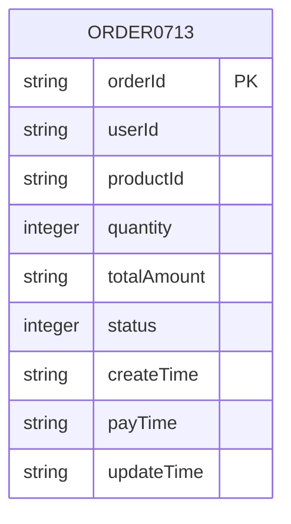
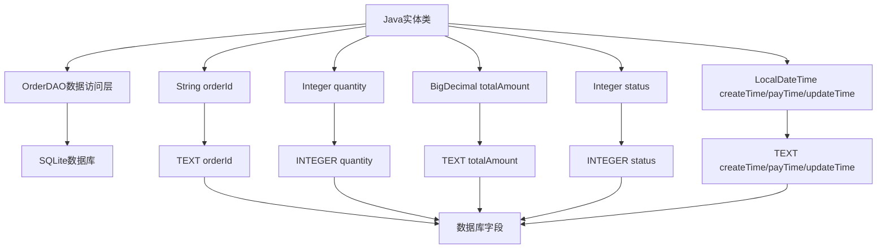
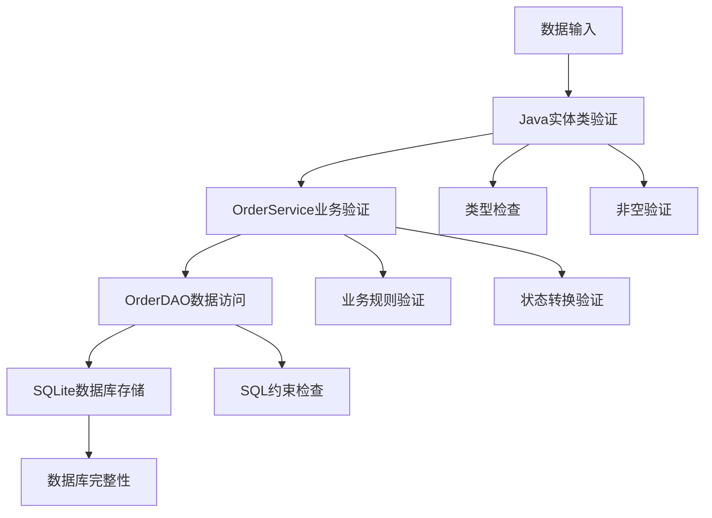
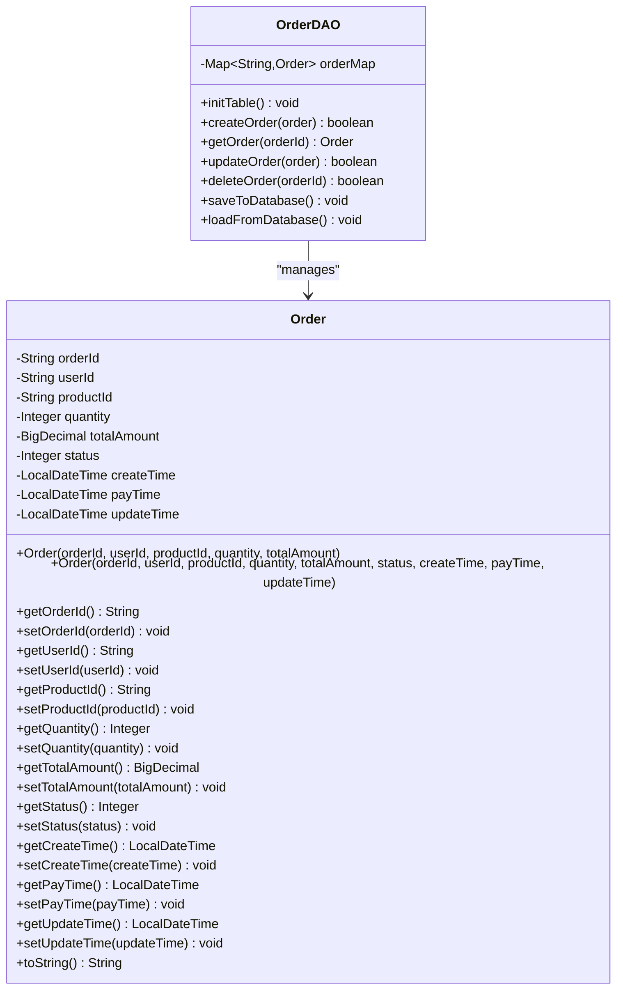
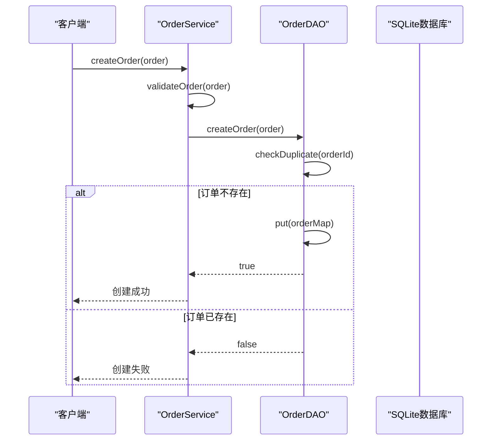
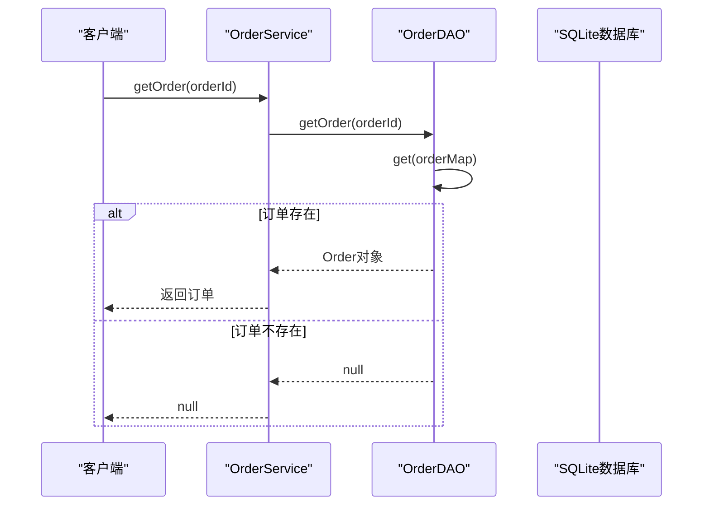
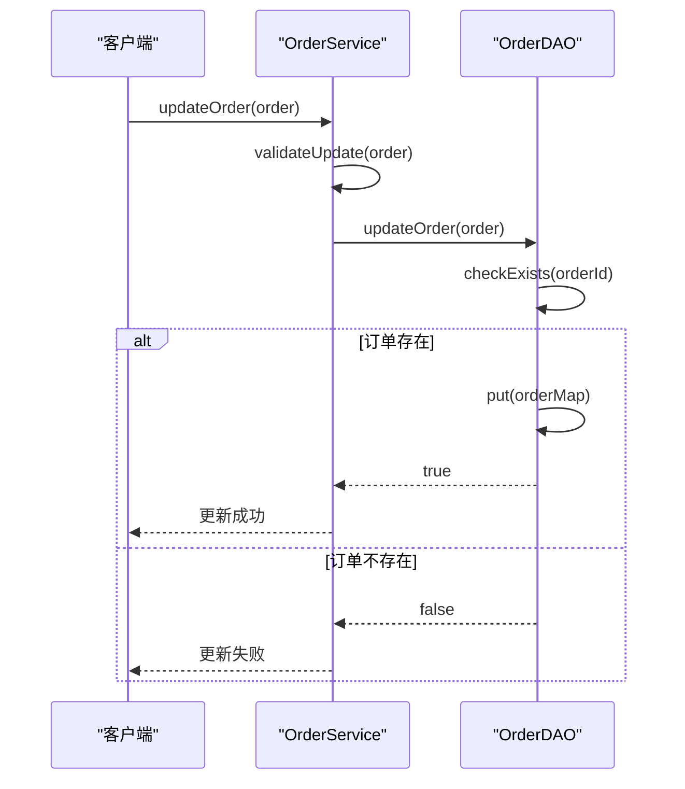
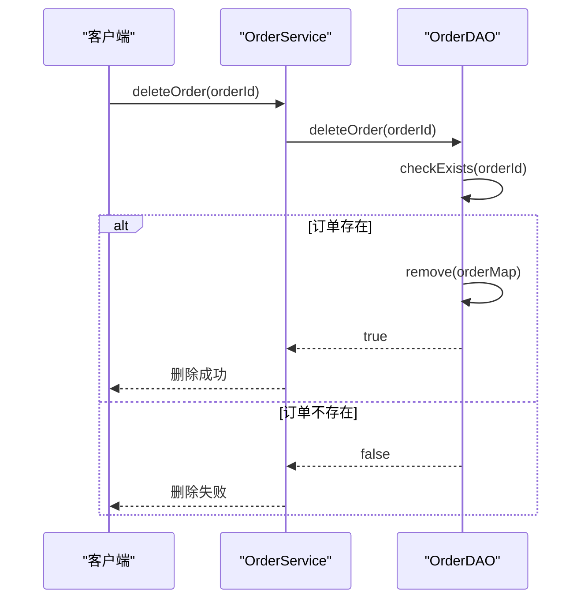
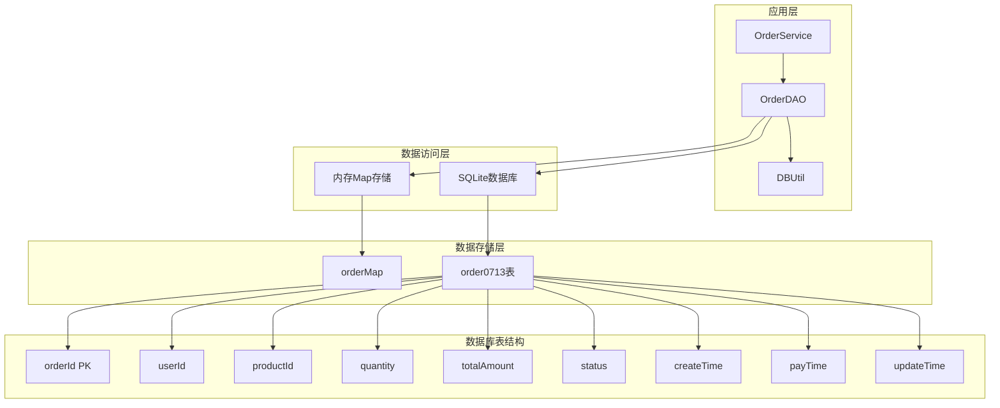

# 数据库表结构文档

<cite>
**本文档中引用的文件**
- [OrderDAO.java](file://src/main/java/com/example/demo/dao/OrderDAO.java)
- [Order.java](file://src/main/java/com/example/demo/entity/Order.java)
- [DBUtil.java](file://src/main/java/com/example/demo/dao/DBUtil.java)
- [App.java](file://src/main/java/com/example/demo/App.java)
- [OrderServiceTest.java](file://src/test/java/com/example/demo/service/OrderServiceTest.java)
- [pom.xml](file://pom.xml)
</cite>

## 目录
1. [简介](#简介)
2. [表结构概述](#表结构概述)
3. [字段详细说明](#字段详细说明)
4. [数据类型映射](#数据类型映射)
5. [约束与完整性](#约束与完整性)
6. [业务规则](#业务规则)
7. [实体类映射](#实体类映射)
8. [CRUD操作](#crud操作)
9. [数据库架构图](#数据库架构图)
10. [示例数据](#示例数据)
11. [总结](#总结)

## 简介

本文档详细描述了order0713表的数据库结构设计，该表用于存储订单信息。表结构基于Java实体类Order的设计，采用SQLite数据库实现，通过OrderDAO类进行数据访问操作。

## 表结构概述

order0713表是一个订单数据存储表，包含以下核心字段：



**图表来源**
- [OrderDAO.java](file://src/main/java/com/example/demo/dao/OrderDAO.java#L16-L25)

**节来源**
- [OrderDAO.java](file://src/main/java/com/example/demo/dao/OrderDAO.java#L16-L25)

## 字段详细说明

### 核心标识字段

| 字段名 | 数据类型 | 约束 | 描述 |
|--------|----------|------|------|
| orderId | TEXT | PRIMARY KEY | 订单唯一标识符，字符串格式，作为主键 |

### 关联信息字段

| 字段名 | 数据类型 | 约束 | 描述 |
|--------|----------|------|------|
| userId | TEXT | NULLABLE | 用户ID，关联用户系统 |
| productId | TEXT | NULLABLE | 商品ID，关联商品系统 |

### 交易信息字段

| 字段名 | 数据类型 | 约束 | 描述 |
|--------|----------|------|------|
| quantity | INTEGER | NULLABLE | 购买数量，必须大于0 |
| totalAmount | TEXT | NULLABLE | 订单总金额，以字符串形式存储BigDecimal值 |

### 状态信息字段

| 字段名 | 数据类型 | 约束 | 描述 |
|--------|----------|------|------|
| status | INTEGER | NULLABLE | 订单状态，整数值表示不同状态 |

### 时间戳字段

| 字段名 | 数据类型 | 约束 | 描述 |
|--------|----------|------|------|
| createTime | TEXT | NULLABLE | 订单创建时间，ISO格式字符串 |
| payTime | TEXT | NULLABLE | 订单支付时间，ISO格式字符串 |
| updateTime | TEXT | NULLABLE | 订单最后更新时间，ISO格式字符串 |

**节来源**
- [Order.java](file://src/main/java/com/example/demo/entity/Order.java#L10-L35)

## 数据类型映射

### Java类型到SQL类型的映射



**图表来源**
- [OrderDAO.java](file://src/main/java/com/example/demo/dao/OrderDAO.java#L54-L65)
- [Order.java](file://src/main/java/com/example/demo/entity/Order.java#L10-L35)

### 类型转换处理

1. **BigDecimal处理**：Java中的BigDecimal对象转换为字符串存储
2. **LocalDateTime处理**：Java时间对象转换为ISO格式字符串存储
3. **状态枚举**：整数值映射业务状态

**节来源**
- [OrderDAO.java](file://src/main/java/com/example/demo/dao/OrderDAO.java#L54-L65)
- [OrderDAO.java](file://src/main/java/com/example/demo/dao/OrderDAO.java#L75-L85)

## 约束与完整性

### 主键约束

- **主键定义**：`orderId TEXT PRIMARY KEY`
- **唯一性保证**：确保每条订单记录的唯一性
- **索引自动创建**：SQLite自动为主键创建索引

### 外键约束

- **外键缺失**：当前表不包含外键约束
- **业务逻辑约束**：通过应用层保证数据完整性

### 数据完整性保障



**图表来源**
- [OrderServiceTest.java](file://src/test/java/com/example/demo/service/OrderServiceTest.java#L80-L120)

**节来源**
- [OrderDAO.java](file://src/main/java/com/example/demo/dao/OrderDAO.java#L16-L25)
- [OrderServiceTest.java](file://src/test/java/com/example/demo/service/OrderServiceTest.java#L80-L120)

## 业务规则

### 状态值定义

| 状态码 | 状态名称 | 描述 |
|--------|----------|------|
| 0 | 待支付 | 订单已创建但未支付 |
| 1 | 已支付 | 订单已完成支付 |
| 2 | 已发货 | 订单商品已发货 |
| 3 | 已完成 | 订单交易完成 |
| 4 | 已取消 | 订单被取消 |

### 业务约束

1. **数量约束**：`quantity > 0`
2. **金额约束**：`totalAmount > 0`
3. **状态转换**：状态只能按顺序流转
4. **时间约束**：
   - `createTime ≤ payTime ≤ updateTime`

### 默认值设置

- **默认状态**：0（待支付）
- **默认创建时间**：当前时间
- **可为空字段**：所有非必需字段

**节来源**
- [Order.java](file://src/main/java/com/example/demo/entity/Order.java#L20-L25)
- [OrderServiceTest.java](file://src/test/java/com/example/demo/service/OrderServiceTest.java#L80-L120)

## 实体类映射

### Order实体类结构



**图表来源**
- [Order.java](file://src/main/java/com/example/demo/entity/Order.java#L10-L35)
- [OrderDAO.java](file://src/main/java/com/example/demo/dao/OrderDAO.java#L10-L15)

### 映射关系

1. **一对一映射**：每个Order对象对应数据库中的一条记录
2. **字段映射**：实体类属性直接映射到数据库字段
3. **类型转换**：复杂类型通过序列化/反序列化处理

**节来源**
- [Order.java](file://src/main/java/com/example/demo/entity/Order.java#L10-L35)
- [OrderDAO.java](file://src/main/java/com/example/demo/dao/OrderDAO.java#L75-L85)

## CRUD操作

### 创建操作（Create）



**图表来源**
- [OrderDAO.java](file://src/main/java/com/example/demo/dao/OrderDAO.java#L100-L108)

### 查询操作（Read）



**图表来源**
- [OrderDAO.java](file://src/main/java/com/example/demo/dao/OrderDAO.java#L110-L115)

### 更新操作（Update）



**图表来源**
- [OrderDAO.java](file://src/main/java/com/example/demo/dao/OrderDAO.java#L117-L125)

### 删除操作（Delete）



**图表来源**
- [OrderDAO.java](file://src/main/java/com/example/demo/dao/OrderDAO.java#L127-L135)

**节来源**
- [OrderDAO.java](file://src/main/java/com/example/demo/dao/OrderDAO.java#L100-L135)

## 数据库架构图



**图表来源**
- [OrderDAO.java](file://src/main/java/com/example/demo/dao/OrderDAO.java#L10-L15)
- [DBUtil.java](file://src/main/java/com/example/demo/dao/DBUtil.java#L8-L12)

## 示例数据

### 订单记录示例

| orderId | userId | productId | quantity | totalAmount | status | createTime | payTime | updateTime |
|---------|--------|-----------|----------|-------------|--------|------------|---------|------------|
| O001 | U100 | P200 | 2 | 99.99 | 1 | 2024-01-01T10:00:00 | 2024-01-01T10:05:00 | 2024-01-01T10:05:00 |
| O002 | U101 | P201 | 1 | 49.99 | 0 | 2024-01-01T11:00:00 | NULL | 2024-01-01T11:00:00 |
| O003 | U102 | P202 | 3 | 149.97 | 2 | 2024-01-01T12:00:00 | 2024-01-01T12:05:00 | 2024-01-01T12:10:00 |

### 数据库SQL示例

```sql
-- 创建表语句
CREATE TABLE IF NOT EXISTS order0713(
    orderId TEXT PRIMARY KEY, 
    userId TEXT, 
    productId TEXT, 
    quantity INTEGER, 
    totalAmount TEXT, 
    status INTEGER, 
    createTime TEXT, 
    payTime TEXT, 
    updateTime TEXT
);

-- 插入示例数据
INSERT INTO order0713 VALUES 
('O001', 'U100', 'P200', 2, '99.99', 1, '2024-01-01T10:00:00', '2024-01-01T10:05:00', '2024-01-01T10:05:00'),
('O002', 'U101', 'P201', 1, '49.99', 0, '2024-01-01T11:00:00', NULL, '2024-01-01T11:00:00'),
('O003', 'U102', 'P202', 3, '149.97', 2, '2024-01-01T12:00:00', '2024-01-01T12:05:00', '2024-01-01T12:10:00');
```

**节来源**
- [OrderDAO.java](file://src/main/java/com/example/demo/dao/OrderDAO.java#L16-L25)
- [App.java](file://src/main/java/com/example/demo/App.java#L20-L35)

## 总结

order0713表是一个设计简洁、功能明确的订单数据存储表。其主要特点包括：

1. **简单高效**：采用SQLite轻量级数据库，适合小型应用
2. **类型安全**：通过Java实体类确保类型安全
3. **业务完整**：包含完整的订单生命周期信息
4. **扩展性强**：支持状态机模式的业务流程控制

该表结构为订单管理系统提供了坚实的数据基础，通过合理的字段设计和约束设置，确保了数据的完整性和业务规则的有效执行。