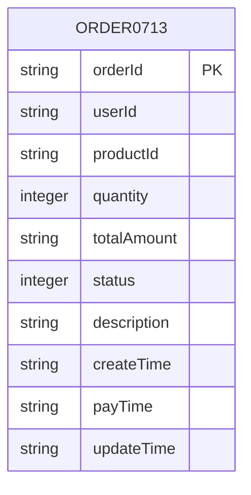
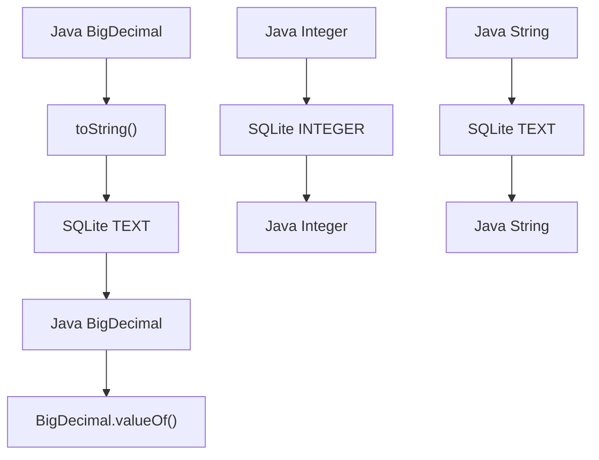
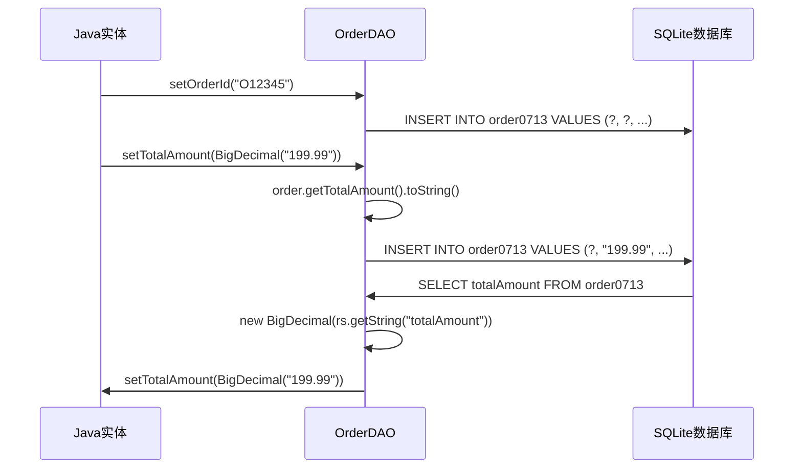
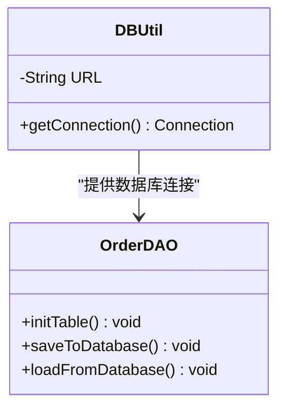
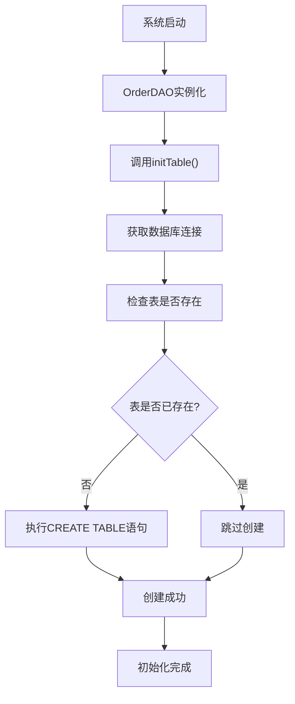

# 数据库表结构文档

<cite>
**本文档中引用的文件**
- [OrderDAO.java](file://src/main/java/com/example/demo/dao/OrderDAO.java)
- [Order.java](file://src/main/java/com/example/demo/entity/Order.java)
- [DBUtil.java](file://src/main/java/com/example/demo/dao/DBUtil.java)
- [application.properties](file://src/main/resources/application.properties)
- [OrderDAOTest.java](file://src/test/java/com/example/demo/dao/OrderDAOTest.java)
</cite>

## 目录
1. [概述](#概述)
2. [表结构设计](#表结构设计)
3. [字段详细说明](#字段详细说明)
4. [数据类型选择分析](#数据类型选择分析)
5. [主键约束与索引](#主键约束与索引)
6. [CREATE TABLE语句](#create-table语句)
7. [字段映射关系](#字段映射关系)
8. [数据库文件位置](#数据库文件位置)
9. [初始化流程](#初始化流程)
10. [最佳实践建议](#最佳实践建议)

## 概述

本文档详细介绍了项目中orders表的数据库表结构设计。该表由OrderDAO类中的initTable()方法在首次运行时自动创建，数据库文件位于项目根目录下的`test.db`文件中。表名为`order0713`，采用SQLite数据库作为底层存储引擎。

## 表结构设计

orders表采用扁平化设计，包含10个核心字段，涵盖了订单管理的基本信息、状态跟踪和时间戳记录。设计遵循以下原则：

- **简洁性**：只包含必要的业务字段
- **完整性**：涵盖订单生命周期的各个阶段
- **可扩展性**：为未来功能扩展预留空间
- **性能优化**：合理的数据类型选择提升查询效率



**图表来源**
- [OrderDAO.java](file://src/main/java/com/example/demo/dao/OrderDAO.java#L28-L42)

## 字段详细说明

### 核心业务字段

| 字段名 | 数据类型 | 是否必填 | 描述 |
|--------|----------|----------|------|
| orderId | TEXT | 是 | 订单唯一标识符，主键，采用字符串类型便于灵活扩展 |
| userId | TEXT | 否 | 用户ID，关联用户系统，支持多用户场景 |
| productId | TEXT | 是 | 商品ID，标识购买的商品，支持多种商品类型 |
| quantity | INTEGER | 否 | 购买数量，整数类型，限制为正整数值 |

### 金额与状态字段

| 字段名 | 数据类型 | 是否必填 | 描述 |
|--------|----------|----------|------|
| totalAmount | TEXT | 否 | 订单总金额，采用TEXT类型存储BigDecimal字符串 |
| status | INTEGER | 否 | 订单状态，整数类型，取值范围：0-待支付, 1-已支付, 2-已发货, 3-已完成, 4-已取消 |

### 描述与备注字段

| 字段名 | 数据类型 | 是否必填 | 描述 |
|--------|----------|----------|------|
| description | TEXT | 否 | 订单描述信息，支持详细说明 |

### 时间戳字段

| 字段名 | 数据类型 | 是否必填 | 描述 |
|--------|----------|----------|------|
| createTime | TEXT | 否 | 订单创建时间，采用ISO-8601格式存储 |
| payTime | TEXT | 否 | 订单支付时间，nullable，仅在支付后填充 |
| updateTime | TEXT | 否 | 订单最后更新时间，用于记录状态变更时间 |

**节来源**
- [OrderDAO.java](file://src/main/java/com/example/demo/dao/OrderDAO.java#L28-L42)
- [Order.java](file://src/main/java/com/example/demo/entity/Order.java#L10-L38)

## 数据类型选择分析

### TEXT类型的选择

**orderId、userId、productId、description、createTime、payTime、updateTime** 采用TEXT类型的原因：
- **灵活性**：支持任意长度的字符串，适应不同业务场景
- **兼容性**：与Java String类型直接对应，减少转换开销
- **国际化**：支持多语言字符集
- **扩展性**：便于未来字段长度扩展

### INTEGER类型的选择

**quantity、status** 采用INTEGER类型的原因：
- **性能**：整数运算比浮点数更高效
- **准确性**：避免浮点数精度问题
- **业务逻辑**：符合业务规则，如数量必须为整数
- **存储空间**：占用固定字节，节省存储空间

### 特殊处理：totalAmount字段

**totalAmount字段采用TEXT类型而非REAL的原因**：
- **精度保证**：避免浮点数精度丢失问题
- **货币计算**：支持精确的货币金额计算
- **序列化友好**：与BigDecimal对象直接对应
- **一致性**：与Java实体类保持一致



**图表来源**
- [OrderDAO.java](file://src/main/java/com/example/demo/dao/OrderDAO.java#L59-L71)

## 主键约束与索引

### 主键设计

- **主键字段**：orderId（TEXT PRIMARY KEY）
- **设计理由**：
  - 唯一性：确保每条订单记录的唯一性
  - 性能：主键自动建立索引，提升查询效率
  - 业务意义：订单ID具有业务含义，便于识别和管理
  - 扩展性：支持复杂订单ID格式（如UUID）

### 索引策略

- **隐式索引**：主键自动创建唯一索引
- **查询优化**：userId字段可用于查询特定用户的订单
- **时间查询**：createTime、updateTime字段支持时间范围查询

## CREATE TABLE语句

以下是orders表的完整CREATE TABLE语句：

```sql
CREATE TABLE IF NOT EXISTS order0713 (
    orderId TEXT PRIMARY KEY,
    userId TEXT,
    productId TEXT NOT NULL,
    quantity INTEGER,
    totalAmount TEXT,
    status INTEGER,
    description TEXT,
    createTime TEXT,
    payTime TEXT,
    updateTime TEXT
);
```

**节来源**
- [OrderDAO.java](file://src/main/java/com/example/demo/dao/OrderDAO.java#L31-L41)

## 字段映射关系

### Java实体类与数据库字段映射

| Java实体类字段 | 数据库字段 | 类型转换 | 备注 |
|----------------|------------|----------|------|
| orderId | orderId | String ↔ TEXT | 直接映射，主键 |
| userId | userId | String ↔ TEXT | 可为空 |
| productId | productId | String ↔ TEXT | 必填字段 |
| quantity | quantity | Integer ↔ INTEGER | 可为空 |
| totalAmount | totalAmount | BigDecimal.toString() ↔ TEXT | 特殊处理 |
| status | status | Integer ↔ INTEGER | 可为空，默认0 |
| description | description | String ↔ TEXT | 可为空 |
| createTime | createTime | LocalDateTime.toString() ↔ TEXT | ISO-8601格式 |
| payTime | payTime | LocalDateTime.toString() ↔ TEXT | 可为空 |
| updateTime | updateTime | LocalDateTime.toString() ↔ TEXT | 可为空 |

### 映射实现细节



**图表来源**
- [OrderDAO.java](file://src/main/java/com/example/demo/dao/OrderDAO.java#L59-L71)
- [OrderDAO.java](file://src/main/java/com/example/demo/dao/OrderDAO.java#L140-L150)

**节来源**
- [Order.java](file://src/main/java/com/example/demo/entity/Order.java#L46-L59)
- [OrderDAO.java](file://src/main/java/com/example/demo/dao/OrderDAO.java#L59-L71)

## 数据库文件位置

### 文件路径

- **相对路径**：项目根目录
- **文件名**：`test.db`
- **JDBC URL**：`jdbc:sqlite:test.db`
- **绝对路径**：根据项目部署环境确定

### 连接管理

数据库连接通过DBUtil类统一管理：



**图表来源**
- [DBUtil.java](file://src/main/java/com/example/demo/dao/DBUtil.java#L10-L18)
- [OrderDAO.java](file://src/main/java/com/example/demo/dao/OrderDAO.java#L28-L46)

**节来源**
- [DBUtil.java](file://src/main/java/com/example/demo/dao/DBUtil.java#L10-L18)

## 初始化流程

### 自动初始化机制

orders表的创建采用延迟初始化策略，在系统启动时自动执行：



**图表来源**
- [OrderDAO.java](file://src/main/java/com/example/demo/dao/OrderDAO.java#L28-L46)

### 初始化特点

- **幂等性**：使用`CREATE TABLE IF NOT EXISTS`确保多次执行的安全性
- **自动触发**：无需手动干预，系统自动完成
- **错误处理**：捕获SQL异常并输出错误信息
- **事务安全**：单次执行，保证原子性

**节来源**
- [OrderDAO.java](file://src/main/java/com/example/demo/dao/OrderDAO.java#L28-L46)

## 最佳实践建议

### 数据完整性保证

1. **字段约束**
   - productId字段应设置NOT NULL约束
   - status字段可考虑添加CHECK约束限制取值范围

2. **外键关系**
   ```sql
   -- 推荐的改进版本
   CREATE TABLE IF NOT EXISTS order0713 (
       orderId TEXT PRIMARY KEY,
       userId TEXT REFERENCES users(userId),
       productId TEXT NOT NULL,
       quantity INTEGER CHECK(quantity > 0),
       totalAmount TEXT,
       status INTEGER CHECK(status BETWEEN 0 AND 4),
       description TEXT,
       createTime TEXT,
       payTime TEXT,
       updateTime TEXT
   );
   ```

3. **索引优化**
   ```sql
   -- 为常用查询字段创建索引
   CREATE INDEX idx_user_orders ON order0713(userId, createTime DESC);
   ```

### 性能优化建议

1. **批量操作**
   - 使用PreparedStatement进行批量插入
   - 合理设置批处理大小（建议100-1000条）

2. **查询优化**
   - 对userId字段建立索引
   - 使用LIMIT子句限制查询结果数量
   - 避免SELECT *，明确指定需要的字段

3. **缓存策略**
   - 利用ConcurrentHashMap实现内存缓存
   - 定期将内存数据同步到数据库

### 数据迁移考虑

1. **版本控制**
   - 记录数据库版本号
   - 提供升级脚本处理结构变更

2. **数据备份**
   - 定期备份test.db文件
   - 实现增量备份机制

3. **容错处理**
   - 添加数据库连接超时设置
   - 实现重试机制处理临时故障

### 安全性建议

1. **输入验证**
   - 验证orderId格式合法性
   - 限制description字段长度

2. **访问控制**
   - 设置适当的文件权限
   - 考虑使用连接池管理数据库连接

3. **监控告警**
   - 监控数据库文件大小
   - 设置查询性能阈值告警

**节来源**
- [OrderDAO.java](file://src/main/java/com/example/demo/dao/OrderDAO.java#L28-L46)
- [OrderDAO.java](file://src/main/java/com/example/demo/dao/OrderDAO.java#L59-L71)