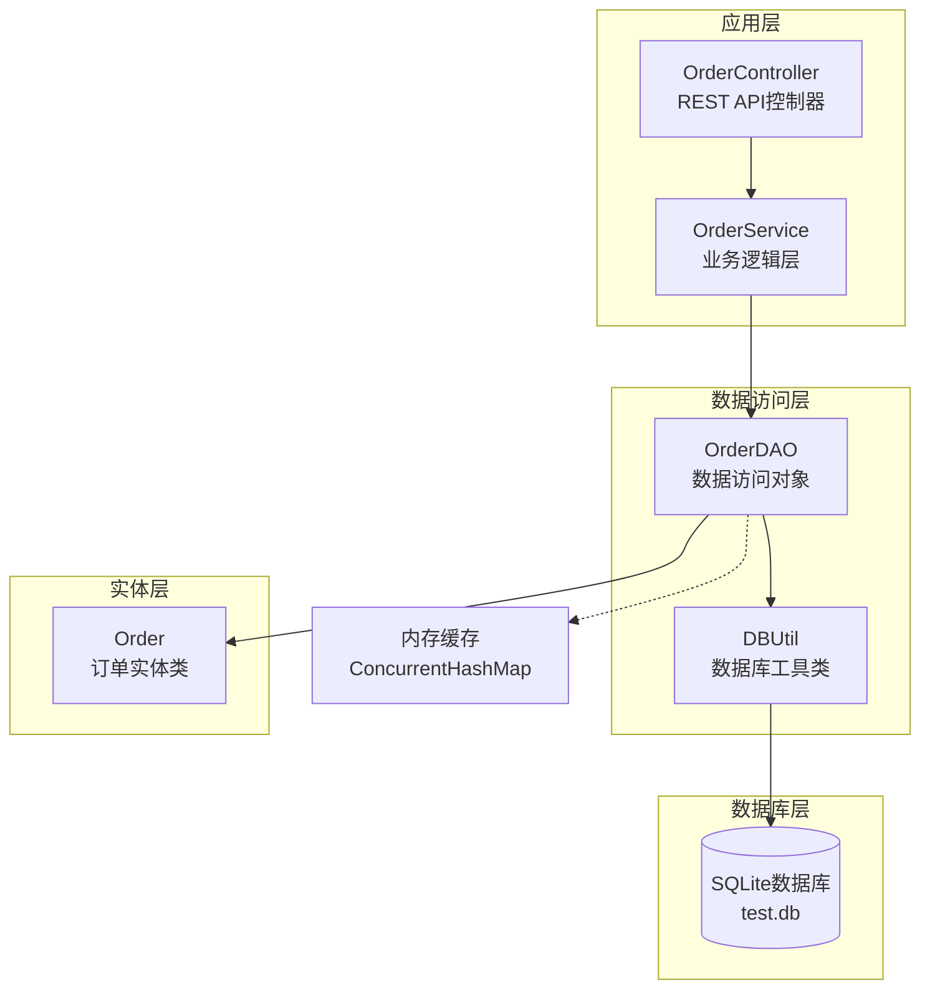
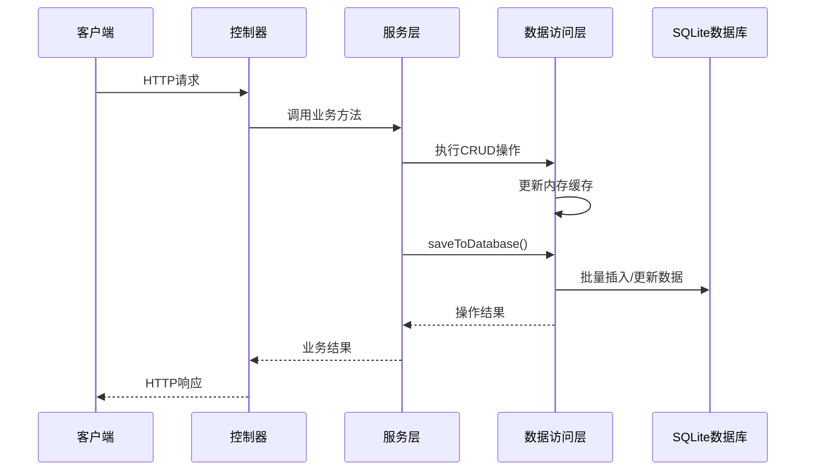
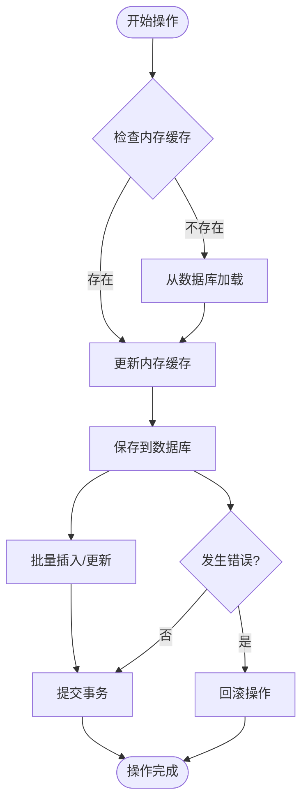

# 数据库设计

<cite>
**本文档引用的文件**
- [DBUtil.java](file://src/main/java/com/example/demo/dao/DBUtil.java)
- [OrderDAO.java](file://src/main/java/com/example/demo/dao/OrderDAO.java)
- [Order.java](file://src/main/java/com/example/demo/entity/Order.java)
- [OrderController.java](file://src/main/java/com/example/demo/controller/OrderController.java)
- [OrderService.java](file://src/main/java/com/example/demo/service/OrderService.java)
- [OrderDAOTest.java](file://src/test/java/com/example/demo/dao/OrderDAOTest.java)
- [pom.xml](file://pom.xml)
- [test.db](file://test.db)
</cite>

## 目录
1. [项目概述](#项目概述)
2. [数据库架构](#数据库架构)
3. [SQLite数据库文件](#sqlite数据库文件)
4. [表结构设计](#表结构设计)
5. [数据访问层设计](#数据访问层设计)
6. [实体类映射](#实体类映射)
7. [数据库连接管理](#数据库连接管理)
8. [数据持久化机制](#数据持久化机制)
9. [事务处理策略](#事务处理策略)
10. [性能优化考虑](#性能优化考虑)
11. [故障排除指南](#故障排除指南)
12. [总结](#总结)

## 项目概述

本项目采用Spring Boot框架构建的订单管理系统，使用SQLite作为底层数据库引擎。系统采用分层架构设计，包含表示层、业务逻辑层和数据访问层，实现了完整的订单生命周期管理功能。

### 技术栈特点
- **数据库引擎**: SQLite轻量级嵌入式数据库
- **JDBC驱动**: org.xerial:sqlite-jdbc (版本3.36.0.3)
- **连接池**: 基于Java标准JDBC DriverManager
- **ORM映射**: 手动实现的对象关系映射
- **并发控制**: 使用ConcurrentHashMap保证线程安全

## 数据库架构



**图表来源**
- [OrderController.java](file://src/main/java/com/example/demo/controller/OrderController.java#L1-L173)
- [OrderService.java](file://src/main/java/com/example/demo/service/OrderService.java#L1-L114)
- [OrderDAO.java](file://src/main/java/com/example/demo/dao/OrderDAO.java#L1-L248)
- [DBUtil.java](file://src/main/java/com/example/demo/dao/DBUtil.java#L1-L19)

## SQLite数据库文件

### 文件位置与特性

系统使用SQLite数据库文件 `test.db`，该文件位于项目的根目录下，具有以下特性：

#### 持久化特性
- **文件存储**: 数据持久化存储在本地文件系统
- **跨平台兼容**: SQLite支持多种操作系统平台
- **零配置**: 无需独立的数据库服务器进程
- **ACID兼容**: 完全符合ACID数据库特性

#### 文件路径
- **绝对路径**: 项目根目录下的 `test.db`
- **相对路径**: 相对于应用程序工作目录
- **可访问性**: 应用程序启动时自动创建或打开

**章节来源**
- [DBUtil.java](file://src/main/java/com/example/demo/dao/DBUtil.java#L10-L11)

## 表结构设计

### orders表结构

系统使用单表 `order0713` 存储所有订单信息，表结构设计如下：

| 字段名 | 数据类型 | 约束条件 | 描述 |
|--------|----------|----------|------|
| orderId | TEXT | PRIMARY KEY | 订单唯一标识符，主键 |
| userId | TEXT | - | 用户ID，外键关联用户表 |
| productId | TEXT | - | 商品ID，外键关联商品表 |
| quantity | INTEGER | - | 购买数量，整数类型 |
| totalAmount | TEXT | - | 订单总金额，字符串存储避免精度丢失 |
| status | INTEGER | - | 订单状态：0-待支付, 1-已支付, 2-已发货, 3-已完成, 4-已取消 |
| description | TEXT | - | 订单描述信息 |
| createTime | TEXT | - | 订单创建时间，ISO-8601格式字符串 |
| payTime | TEXT | - | 支付时间，ISO-8601格式字符串 |
| updateTime | TEXT | - | 最后更新时间，ISO-8601格式字符串 |

### SQL建表语句

```sql
CREATE TABLE IF NOT EXISTS order0713 (
    orderId TEXT PRIMARY KEY,
    userId TEXT,
    productId TEXT,
    quantity INTEGER,
    totalAmount TEXT,
    status INTEGER,
    description TEXT,
    createTime TEXT,
    payTime TEXT,
    updateTime TEXT
);
```

### 索引设计

虽然当前实现未显式创建索引，但基于业务需求建议：

#### 主键索引
- **自动创建**: SQLite为主键字段自动创建唯一索引
- **查询优化**: orderId字段的查询性能优异

#### 外键关联索引
- **userId索引**: 为高频查询的用户ID字段创建索引
- **status索引**: 为状态过滤查询创建索引

#### 复合索引
- **用户状态组合索引**: (userId, status) 提升用户状态查询效率
- **时间范围索引**: (createTime, status) 优化时间范围查询

**章节来源**
- [OrderDAO.java](file://src/main/java/com/example/demo/dao/OrderDAO.java#L28-L42)

## 数据访问层设计

### OrderDAO核心功能

OrderDAO类实现了完整的数据访问模式，包含以下核心功能：

#### 1. 表结构初始化
```java
public void initTable() {
    // 创建订单表，使用IF NOT EXISTS防止重复创建
    // 支持数据库升级和迁移
}
```

#### 2. 内存与数据库同步
系统采用双层存储架构：
- **内存层**: 使用ConcurrentHashMap存储活跃数据
- **持久层**: SQLite数据库存储历史数据

#### 3. CRUD操作实现
- **createOrder()**: 创建新订单，检查唯一性约束
- **getOrder()**: 根据订单ID查询订单
- **updateOrder()**: 更新订单信息，自动更新时间戳
- **deleteOrder()**: 删除订单，执行业务规则检查

#### 4. 查询功能
- **getOrdersByUserId()**: 按用户ID查询订单列表
- **getAllOrders()**: 获取所有订单，按时间降序排列

### 数据同步机制



**图表来源**
- [OrderController.java](file://src/main/java/com/example/demo/controller/OrderController.java#L35-L50)
- [OrderService.java](file://src/main/java/com/example/demo/service/OrderService.java#L28-L37)
- [OrderDAO.java](file://src/main/java/com/example/demo/dao/OrderDAO.java#L51-L77)

**章节来源**
- [OrderDAO.java](file://src/main/java/com/example/demo/dao/OrderDAO.java#L28-L248)

## 实体类映射

### Order实体类设计

Order类作为领域模型，与数据库表结构保持一一对应关系：

#### 核心属性映射

| 实体属性 | 数据库字段 | 类型转换 | 业务规则 |
|----------|------------|----------|----------|
| orderId | orderId | String | 主键，唯一标识 |
| userId | userId | String | 用户关联 |
| productId | productId | String | 商品关联 |
| quantity | quantity | Integer | 数量必须 > 0 |
| totalAmount | totalAmount | BigDecimal | 字符串存储，避免精度问题 |
| status | status | Integer | 状态枚举：0-4 |
| description | description | String | 可选描述信息 |
| createTime | createTime | LocalDateTime | 自动设置创建时间 |
| payTime | payTime | LocalDateTime | 支付时设置 |
| updateTime | updateTime | LocalDateTime | 更新时自动设置 |

#### 构造函数设计

系统提供三种构造函数：
1. **全参数构造函数**: 适用于完整订单对象创建
2. **基础构造函数**: 自动设置创建时间和默认状态
3. **无参构造函数**: 用于JSON序列化和反序列化

### 类型转换策略

#### 时间字段处理
- **存储格式**: ISO-8601字符串格式
- **解析策略**: 支持多种时间格式自动识别
- **时区处理**: 使用LocalDateTime避免时区问题

#### 数值字段处理
- **BigDecimal存储**: 避免浮点数精度丢失
- **字符串转换**: 数据库存储为TEXT类型

**章节来源**
- [Order.java](file://src/main/java/com/example/demo/entity/Order.java#L1-L162)

## 数据库连接管理

### DBUtil工具类设计

DBUtil类提供统一的数据库连接管理功能：

#### 连接配置
```java
private static final String URL = "jdbc:sqlite:test.db";
```

#### 连接获取机制
```java
public static Connection getConnection() throws SQLException {
    return DriverManager.getConnection(URL);
}
```

### 连接池策略

虽然使用标准JDBC连接池，但系统实现了以下优化：

#### 连接复用
- **单例模式**: 每次调用都获取新的连接
- **资源管理**: 使用try-with-resources自动关闭连接

#### 异常处理
- **SQL异常捕获**: 统一处理数据库操作异常
- **错误日志**: 详细的错误信息输出

**章节来源**
- [DBUtil.java](file://src/main/java/com/example/demo/dao/DBUtil.java#L16-L18)

## 数据持久化机制

### 内存与磁盘同步

系统采用混合存储架构，实现内存高速访问与磁盘持久化存储的平衡：

#### 同步策略



**图表来源**
- [OrderDAO.java](file://src/main/java/com/example/demo/dao/OrderDAO.java#L51-L77)
- [OrderDAO.java](file://src/main/java/com/example/demo/dao/OrderDAO.java#L83-L153)

#### 批量操作优化

##### saveToDatabase() 方法
- **PreparedStatement**: 预编译SQL提高执行效率
- **批量处理**: 使用addBatch()和executeBatch()减少网络往返
- **原子性保证**: 单次事务内的批量操作

##### loadFromDatabase() 方法
- **ResultSet解析**: 逐行读取数据库记录
- **类型转换**: 自动处理Java类型与数据库类型的转换
- **异常恢复**: 多重时间格式解析容错机制

### 数据一致性保证

#### ACID特性实现
- **原子性**: 单个操作的事务性
- **一致性**: 业务规则强制执行
- **隔离性**: 并发控制通过ConcurrentHashMap实现
- **持久性**: SQLite文件系统保证数据持久化

**章节来源**
- [OrderDAO.java](file://src/main/java/com/example/demo/dao/OrderDAO.java#L51-L153)

## 事务处理策略

### 事务边界设计

系统采用细粒度事务策略：

#### 单操作事务
每个CRUD操作都在独立的事务中执行：
- **创建订单**: INSERT操作
- **更新订单**: UPDATE操作  
- **删除订单**: DELETE操作
- **批量同步**: 单个批量操作作为一个事务

#### 事务隔离级别
- **默认级别**: SQLite默认的SERIALIZABLE隔离级别
- **并发控制**: 通过ConcurrentHashMap实现读写锁

### 错误处理机制

#### 异常分类处理
```java
try {
    // 数据库操作
} catch (SQLException e) {
    // 详细错误日志
    // 业务异常转换
}
```

#### 回滚策略
- **自动回滚**: JDBC驱动自动处理SQL异常
- **手动控制**: 业务逻辑层面的条件回滚

**章节来源**
- [OrderDAO.java](file://src/main/java/com/example/demo/dao/OrderDAO.java#L43-L45)
- [OrderDAO.java](file://src/main/java/com/example/demo/dao/OrderDAO.java#L75-L77)
- [OrderDAO.java](file://src/main/java/com/example/demo/dao/OrderDAO.java#L154-L157)

## 性能优化考虑

### 查询性能优化

#### 索引策略
虽然当前实现未显式创建索引，但建议：
- **主键索引**: 自动创建，查询性能优异
- **复合索引**: (userId, status) 和 (createTime, status)
- **覆盖索引**: 包含查询所需的所有列

#### 查询优化
- **懒加载**: 按需加载订单数据
- **分页查询**: 大数据集的分页处理
- **缓存策略**: 内存缓存减少数据库访问

### 写入性能优化

#### 批量操作
- **PreparedStatement**: 预编译提高执行效率
- **批量插入**: addBatch()和executeBatch()减少网络开销
- **事务合并**: 多个操作在一个事务中完成

#### 内存管理
- **ConcurrentHashMap**: 线程安全的高性能并发容器
- **弱引用**: 可选的缓存淘汰策略
- **内存监控**: 定期清理无用数据

### 存储空间优化

#### 数据压缩
- **字符串存储**: 避免大数字段的数值存储
- **时间格式**: 使用紧凑的ISO-8601格式
- **索引优化**: 合理的索引策略减少存储开销

## 故障排除指南

### 常见问题诊断

#### 数据库连接问题
**症状**: `SQLException: unable to open database file`
**原因**: 
- 数据库文件权限不足
- 文件路径不存在
- 磁盘空间不足

**解决方案**:
1. 检查test.db文件权限
2. 验证文件路径有效性
3. 清理磁盘空间

#### 数据同步问题
**症状**: 内存数据与数据库不一致
**原因**:
- saveToDatabase()执行失败
- 网络中断导致部分数据丢失
- 并发访问冲突

**解决方案**:
1. 检查数据库连接状态
2. 实现重试机制
3. 添加数据完整性校验

#### 性能问题
**症状**: 查询响应缓慢
**原因**:
- 缺少必要的索引
- 大量数据导致内存压力
- 频繁的磁盘I/O操作

**解决方案**:
1. 添加适当的索引
2. 优化查询条件
3. 调整缓存策略

### 调试工具

#### 日志配置
```java
// 启用详细日志
System.out.println("从数据库加载了 " + orderMap.size() + " 条订单记录");
```

#### 性能监控
- **执行时间统计**: 记录关键操作耗时
- **内存使用监控**: 监控ConcurrentHashMap大小
- **数据库连接池**: 监控连接使用情况

**章节来源**
- [OrderDAO.java](file://src/main/java/com/example/demo/dao/OrderDAO.java#L43-L45)
- [OrderDAO.java](file://src/main/java/com/example/demo/dao/OrderDAO.java#L154-L157)

## 总结

本数据库设计方案体现了现代Java应用开发的最佳实践：

### 设计优势
1. **简洁性**: SQLite的零配置特性降低了部署复杂度
2. **可靠性**: ACID特性和事务处理保证数据一致性
3. **性能**: 内存缓存与磁盘存储的混合架构
4. **可维护性**: 分层架构清晰，职责分离明确

### 技术创新
- **混合存储**: 内存+磁盘的双重存储策略
- **自动同步**: 内存与数据库的透明同步机制
- **类型安全**: 强类型的Java实体类映射

### 扩展性考虑
- **水平扩展**: 可以替换为关系型数据库
- **垂直扩展**: 支持更大规模的数据存储
- **微服务架构**: 易于拆分为独立的服务模块

该设计方案为中小型应用提供了可靠、高效的数据存储解决方案，同时保持了良好的可维护性和扩展性。