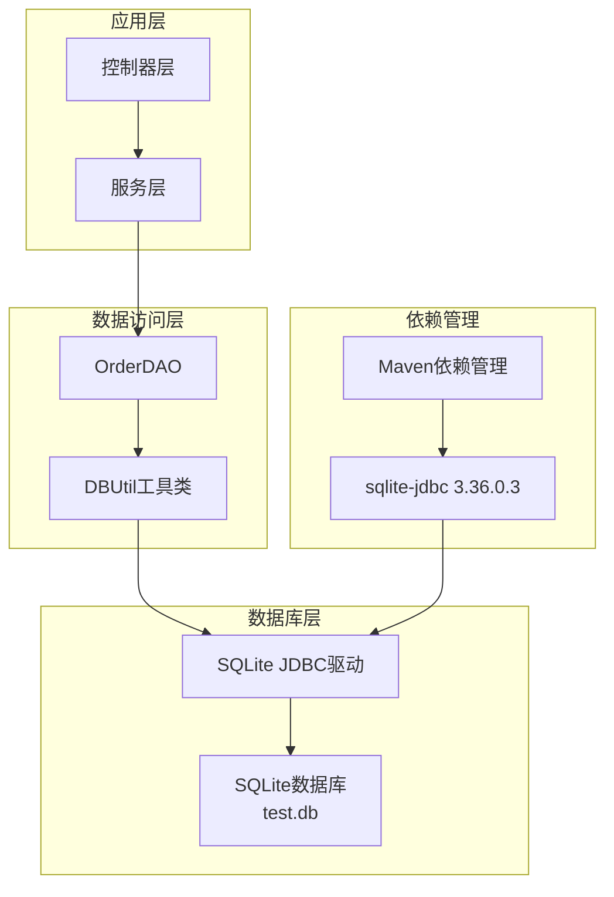
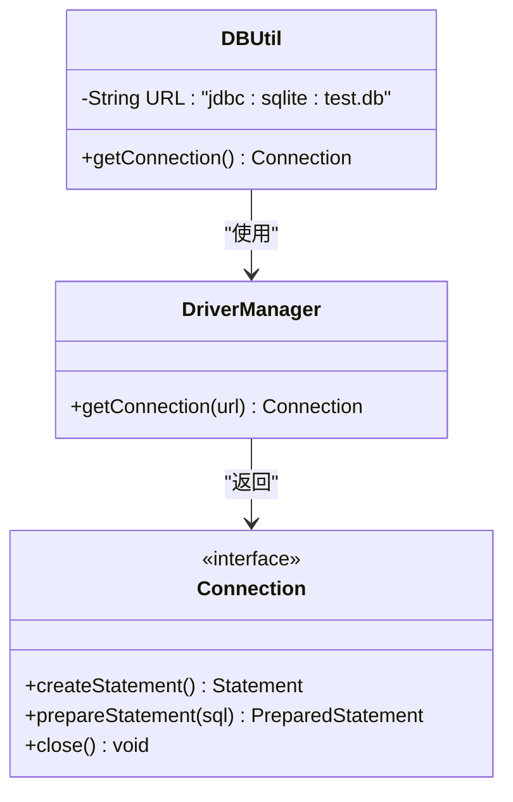
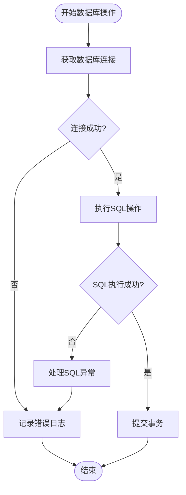
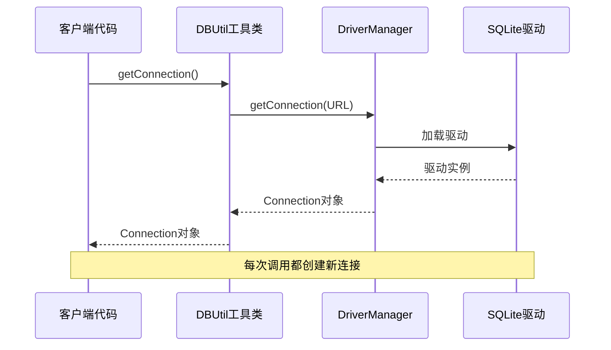
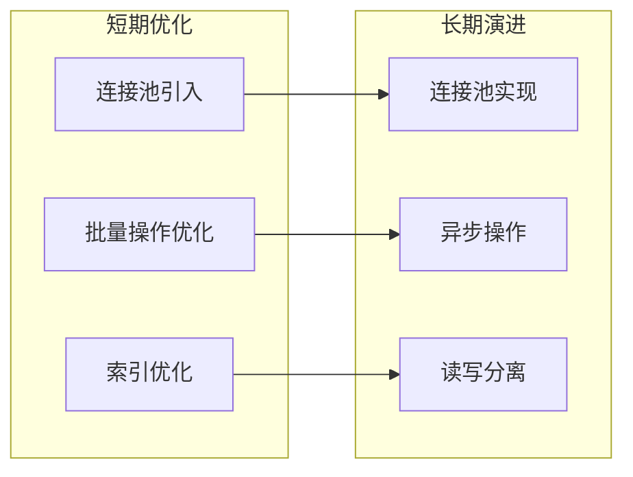

# 数据库连接机制

<cite>
**本文档引用的文件**
- [DBUtil.java](file://src/main/java/com/example/demo/dao/DBUtil.java)
- [OrderDAO.java](file://src/main/java/com/example/demo/dao/OrderDAO.java)
- [pom.xml](file://pom.xml)
- [OrderDAOTest.java](file://src/test/java/com/example/demo/dao/OrderDAOTest.java)
</cite>

## 目录
1. [项目概述](#项目概述)
2. [数据库连接架构](#数据库连接架构)
3. [核心连接机制](#核心连接机制)
4. [SQLite JDBC驱动配置](#sqlite-jdbc驱动配置)
5. [连接字符串解析](#连接字符串解析)
6. [异常处理机制](#异常处理机制)
7. [单例连接管理模式](#单例连接管理模式)
8. [性能与并发考虑](#性能与并发考虑)
9. [最佳实践建议](#最佳实践建议)
10. [总结](#总结)

## 项目概述

本项目采用Spring Boot框架构建，集成了SQLite数据库作为轻量级数据存储解决方案。项目通过DBUtil工具类提供统一的数据库连接管理，支持订单数据的持久化操作。整个系统设计简洁高效，特别适用于小型应用或原型开发场景。

## 数据库连接架构

**图表来源**
- [DBUtil.java](file://src/main/java/com/example/demo/dao/DBUtil.java#L1-L19)
- [OrderDAO.java](file://src/main/java/com/example/demo/dao/OrderDAO.java#L1-L248)
- [pom.xml](file://pom.xml#L54-L59)

**章节来源**
- [DBUtil.java](file://src/main/java/com/example/demo/dao/DBUtil.java#L1-L19)
- [OrderDAO.java](file://src/main/java/com/example/demo/dao/OrderDAO.java#L1-L248)

## 核心连接机制

### DBUtil工具类设计

DBUtil类采用静态工厂模式，提供简单而高效的数据库连接获取机制。该类封装了SQLite数据库连接的创建过程，为上层业务逻辑提供统一的连接入口。

**图表来源**
- [DBUtil.java](file://src/main/java/com/example/demo/dao/DBUtil.java#L10-L18)

### 静态getConnection()方法实现

DBUtil类的getConnection()方法是整个数据库连接机制的核心，其实现极其简洁但功能完整：

- **方法签名**：`public static Connection getConnection() throws SQLException`
- **异常声明**：明确声明抛出SQLException，便于调用方进行异常处理
- **实现逻辑**：直接委托给DriverManager.getConnection()方法
- **返回类型**：返回标准的java.sql.Connection接口实例

**章节来源**
- [DBUtil.java](file://src/main/java/com/example/demo/dao/DBUtil.java#L16-L18)

## SQLite JDBC驱动配置

### Maven依赖管理

项目通过Maven管理SQLite JDBC驱动依赖，确保运行时能够正确加载数据库驱动程序。

| 依赖项 | 版本 | 用途 |
|--------|------|------|
| org.xerial:sqlite-jdbc | 3.36.0.3 | 提供SQLite数据库驱动支持 |
| spring-boot-starter-web | 2.7.14 | 支持Web应用开发 |

### 驱动程序加载机制

SQLite JDBC驱动采用自动发现机制，在首次使用时通过以下方式加载：
1. **类路径扫描**：查找META-INF/services/java.sql.Driver文件
2. **服务提供者接口**：DriverManager自动注册SQLite驱动
3. **无配置要求**：无需额外的驱动配置文件

**章节来源**
- [pom.xml](file://pom.xml#L54-L59)

## 连接字符串解析

### JDBC连接URL格式

连接字符串`jdbc:sqlite:test.db`遵循标准的JDBC URL格式，具有以下组成部分：

| 组件 | 含义 | 示例值 |
|------|------|--------|
| jdbc: | JDBC协议标识符 | 固定前缀 |
| sqlite: | 数据库类型标识 | 指定SQLite数据库 |
| test.db | 数据库文件名 | 相对于项目根目录 |

### 路径解析机制

**相对路径解析**：
- **工作目录**：连接字符串中的test.db相对于项目根目录解析
- **文件位置**：数据库文件位于项目根目录下
- **文件特性**：SQLite采用文件形式存储数据库，支持跨平台兼容性

### 文件持久化特性

SQLite数据库采用文件系统存储，具有以下特点：
- **单文件存储**：整个数据库以单一文件形式存在
- **跨平台兼容**：支持Windows、Linux、macOS等操作系统
- **事务支持**：提供完整的ACID事务特性
- **零配置**：无需数据库服务器进程

**章节来源**
- [DBUtil.java](file://src/main/java/com/example/demo/dao/DBUtil.java#L10-L11)

## 异常处理机制

### SQLException异常处理

虽然DBUtil工具类本身不进行异常处理，但在OrderDAO类中实现了完善的异常处理机制：

**图表来源**
- [OrderDAO.java](file://src/main/java/com/example/demo/dao/OrderDAO.java#L28-L45)
- [OrderDAO.java](file://src/main/java/com/example/demo/dao/OrderDAO.java#L56-L74)
- [OrderDAO.java](file://src/main/java/com/example/demo/dao/OrderDAO.java#L85-L157)

### 异常类型分析

| 异常类型 | 可能原因 | 处理策略 |
|----------|----------|----------|
| SQLException | 数据库连接失败、SQL语法错误、约束违反 | 记录日志并继续执行 |
| ClassNotFoundException | JDBC驱动未找到 | 检查Maven依赖配置 |
| NullPointerException | 数据库连接为空 | 重新获取连接 |

### 日志输出机制

OrderDAO类中的异常处理采用控制台输出方式：
- **错误信息**：输出详细的错误消息
- **堆栈跟踪**：在调试模式下输出完整的异常堆栈
- **业务影响**：不影响整体业务流程，仅记录错误信息

**章节来源**
- [OrderDAO.java](file://src/main/java/com/example/demo/dao/OrderDAO.java#L43-L45)
- [OrderDAO.java](file://src/main/java/com/example/demo/dao/OrderDAO.java#L75-L77)
- [OrderDAO.java](file://src/main/java/com/example/demo/dao/OrderDAO.java#L154-L157)

## 单例连接管理模式

### 设计意图分析

DBUtil采用简单的单例模式，具有以下设计考量：

**图表来源**
- [DBUtil.java](file://src/main/java/com/example/demo/dao/DBUtil.java#L16-L18)

### 适用场景分析

**轻量级应用优势**：
- **简单性**：实现简单，易于理解和维护
- **灵活性**：每次请求都创建新连接，避免连接状态问题
- **资源友好**：连接生命周期短，减少资源占用

**潜在限制**：
- **性能开销**：频繁创建和销毁连接可能影响性能
- **并发限制**：缺乏连接池管理，并发访问可能受限
- **资源浪费**：重复的连接建立过程消耗系统资源

### 并发风险评估

**主要风险点**：
1. **连接竞争**：高并发场景下可能出现连接获取失败
2. **资源泄漏**：不当的连接关闭可能导致资源泄漏
3. **性能瓶颈**：大量并发连接导致系统资源耗尽

**章节来源**
- [DBUtil.java](file://src/main/java/com/example/demo/dao/DBUtil.java#L1-L19)
- [OrderDAO.java](file://src/main/java/com/example/demo/dao/OrderDAO.java#L28-L157)

## 性能与并发考虑

### 当前实现的性能特征

| 性能指标 | 当前实现 | 影响因素 |
|----------|----------|----------|
| 连接创建时间 | 快速 | 直接委托给DriverManager |
| 内存占用 | 较低 | 每次创建独立连接对象 |
| 并发支持 | 基础 | 无连接池管理 |
| 资源利用率 | 中等 | 连接复用率低 |

### 并发访问模式

OrderDAO类中的数据库操作采用以下并发访问模式：
- **独立连接**：每个数据库操作使用独立的连接
- **自动关闭**：使用try-with-resources确保连接及时释放
- **异常隔离**：单个操作失败不影响其他操作

### 性能优化建议

针对当前实现的性能优化方向：

**章节来源**
- [OrderDAO.java](file://src/main/java/com/example/demo/dao/OrderDAO.java#L56-L74)
- [OrderDAO.java](file://src/main/java/com/example/demo/dao/OrderDAO.java#L85-L157)

## 最佳实践建议

### 开发阶段建议

**代码质量保证**：
1. **异常处理**：在关键业务点添加适当的异常处理逻辑
2. **资源管理**：确保所有数据库资源都能正确关闭
3. **日志记录**：增加更详细的日志信息以便问题排查

**测试策略**：
1. **单元测试**：为数据库操作编写全面的单元测试
2. **集成测试**：验证数据库连接和操作的正确性
3. **性能测试**：评估高并发场景下的系统表现

### 生产环境部署

**配置优化**：
1. **连接超时**：设置合理的连接超时时间
2. **最大连接数**：根据系统负载调整连接池参数
3. **监控告警**：建立数据库连接状态监控机制

**安全考虑**：
1. **权限控制**：限制数据库文件的访问权限
2. **备份策略**：定期备份数据库文件
3. **加密存储**：对敏感数据进行加密处理

### 技术演进路径

**短期改进**：
- 引入HikariCP连接池
- 实现数据库连接池配置
- 添加连接健康检查机制

**长期规划**：
- 考虑迁移到关系型数据库
- 实现分布式数据库架构
- 引入ORM框架简化开发

**章节来源**
- [OrderDAOTest.java](file://src/test/java/com/example/demo/dao/OrderDAOTest.java#L1-L239)

## 总结

本项目的数据库连接机制体现了轻量级应用开发的最佳实践。DBUtil工具类通过简洁的设计实现了SQLite数据库的有效连接管理，为订单数据的持久化操作提供了可靠的基础支撑。

### 核心优势

1. **设计简洁**：单例模式实现简单明了，易于理解和维护
2. **依赖最小**：仅需SQLite JDBC驱动，部署成本低
3. **文件存储**：SQLite的文件存储特性便于部署和迁移

### 应用场景

该连接机制特别适合以下应用场景：
- **原型开发**：快速验证业务逻辑
- **小型应用**：单机部署的轻量级系统
- **学习演示**：展示数据库连接的基本概念

### 发展建议

随着应用规模的增长，建议逐步引入连接池等高级特性，以提升系统的并发处理能力和整体性能。同时，应关注数据库安全性和可扩展性，为未来的业务发展做好准备。