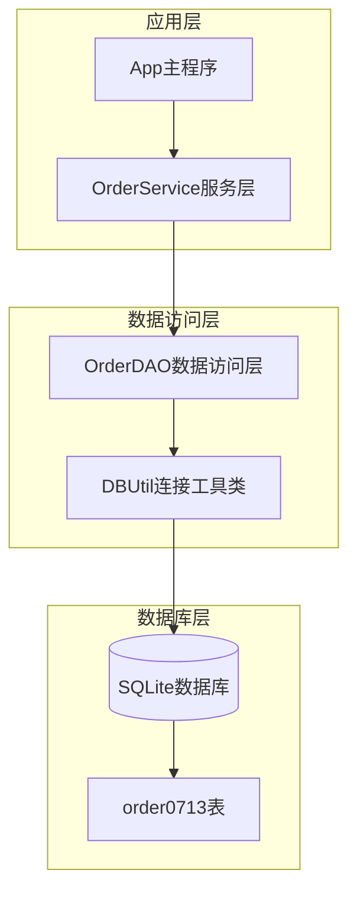
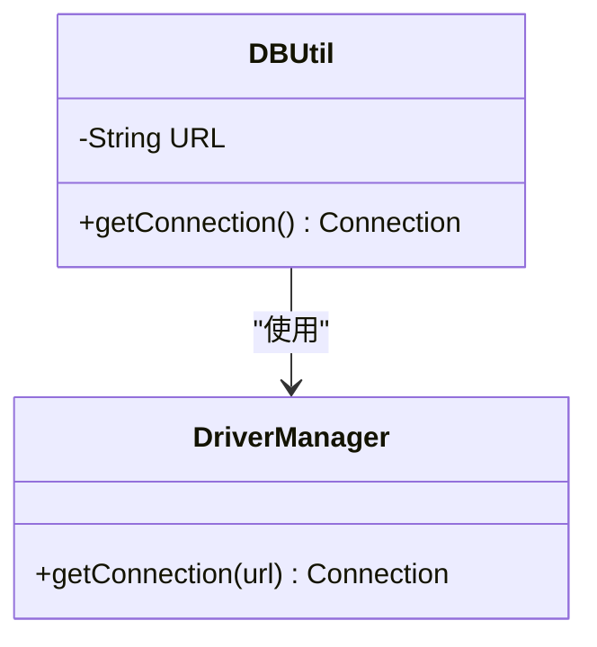
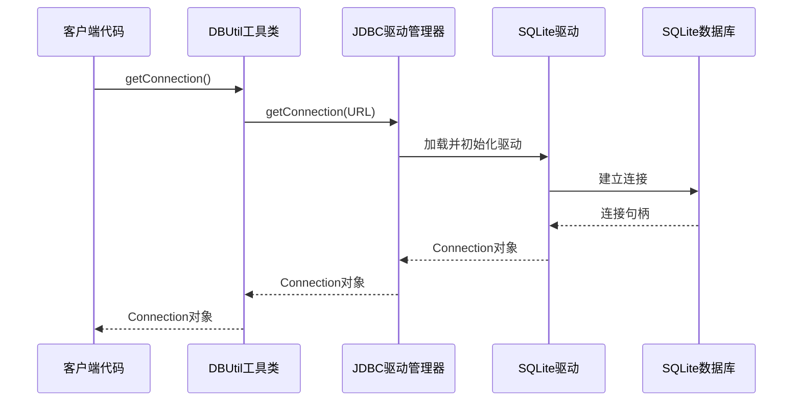
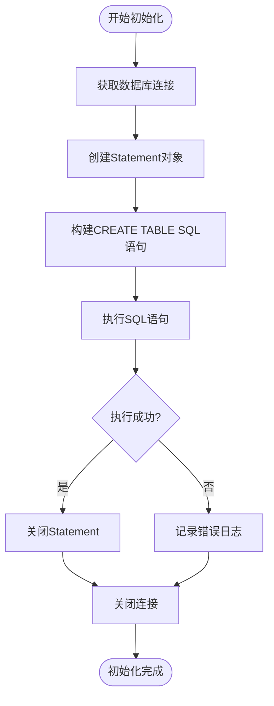

# 数据库连接配置

<cite>
**本文档引用的文件**
- [DBUtil.java](file:///Users/yuxiao/Downloads/0713demo1103/src/main/java/com/example/demo/dao/DBUtil.java) - *更新了数据库连接路径*
- [OrderDAO.java](file:///Users/yuxiao/Downloads/0713demo1103/src/main/java/com/example/demo/dao/OrderDAO.java)
- [App.java](file:///Users/yuxiao/Downloads/0713demo1103/src/main/java/com/example/demo/App.java)
- [OrderService.java](file:///Users/yuxiao/Downloads/0713demo1103/src/main/java/com/example/demo/service/OrderService.java)
- [pom.xml](file:///Users/yuxiao/Downloads/0713demo1103/pom.xml)
- [OrderServiceTest.java](file:///Users/yuxiao/Downloads/0713demo1103/src/test/java/com/example/demo/service/OrderServiceTest.java)
</cite>

## 更新摘要
**已做更改**
- 更新了数据库文件路径配置，从相对路径 `test.db` 调整为绝对路径 `/Users/yuxiao/Downloads/0713demo1103/test.db`
- 同步更新了“数据库连接管理”和“连接URL格式”章节中的路径信息
- 修正了“SQLite数据库架构”章节中的文件路径说明

## 目录
1. [项目概述](#项目概述)
2. [SQLite数据库架构](#sqlite数据库架构)
3. [JDBC驱动配置](#jdbc驱动配置)
4. [数据库连接管理](#数据库连接管理)
5. [连接获取机制](#连接获取机制)
6. [数据库初始化流程](#数据库初始化流程)
7. [连接生命周期管理](#连接生命周期管理)
8. [最佳实践建议](#最佳实践建议)
9. [故障排除指南](#故障排除指南)
10. [总结](#总结)

## 项目概述

本项目是一个基于Java的订单管理系统，采用SQLite作为底层数据库存储。系统通过JDBC接口实现与SQLite数据库的交互，提供了完整的数据库连接管理、表结构初始化、数据持久化和查询功能。

### 核心组件架构



**图表来源**
- [App.java](file:///Users/yuxiao/Downloads/0713demo1103/src/main/java/com/example/demo/App.java#L1-L62)
- [OrderService.java](file:///Users/yuxiao/Downloads/0713demo1103/src/main/java/com/example/demo/service/OrderService.java#L1-L81)
- [OrderDAO.java](file:///Users/yuxiao/Downloads/0713demo1103/src/main/java/com/example/demo/dao/OrderDAO.java#L1-L148)
- [DBUtil.java](file:///Users/yuxiao/Downloads/0713demo1103/src/main/java/com/example/demo/dao/DBUtil.java#L1-L19)

## SQLite数据库架构

### 数据库文件位置

系统使用绝对路径配置SQLite数据库文件，确保跨平台兼容性：

| 配置项 | 值 | 说明 |
|--------|-----|------|
| 数据库类型 | SQLite | 轻量级嵌入式数据库 |
| 文件路径 | `/Users/yuxiao/Downloads/0713demo1103/test.db` | 绝对路径，避免相对路径问题 |
| 连接协议 | `jdbc:sqlite:` | SQLite专用JDBC协议 |

### 表结构设计

系统定义了名为`order0713`的订单表，包含以下字段：

| 字段名 | 数据类型 | 约束 | 说明 |
|--------|----------|------|------|
| orderId | TEXT | PRIMARY KEY | 订单唯一标识符 |
| userId | TEXT | - | 用户标识符 |
| productId | TEXT | - | 商品标识符 |
| quantity | INTEGER | - | 商品数量 |
| totalAmount | TEXT | - | 订单总金额（字符串存储） |
| status | INTEGER | - | 订单状态 |
| createTime | TEXT | - | 创建时间 |
| payTime | TEXT | - | 支付时间 |
| updateTime | TEXT | - | 更新时间 |

**节来源**
- [OrderDAO.java](file:///Users/yuxiao/Downloads/0713demo1103/src/main/java/com/example/demo/dao/OrderDAO.java#L18-L30)

## JDBC驱动配置

### Maven依赖配置

项目通过Maven管理SQLite JDBC驱动依赖：

```xml
<!-- SQLite JDBC 驱动 -->
<dependency>
    <groupId>org.xerial</groupId>
    <artifactId>sqlite-jdbc</artifactId>
    <version>3.36.0.3</version>
</dependency>
```

### 驱动加载机制

虽然当前实现中没有显式的`Class.forName()`调用，但SQLite JDBC驱动会自动注册到`DriverManager`中。这种设计简化了驱动加载过程，减少了潜在的类加载问题。

**节来源**
- [pom.xml](file:///Users/yuxiao/Downloads/0713demo1103/pom.xml#L38-L42)

## 数据库连接管理

### 连接工具类设计

`DBUtil`类作为数据库连接的统一入口点，提供了简洁的连接获取接口：



**图表来源**
- [DBUtil.java](file:///Users/yuxiao/Downloads/0713demo1103/src/main/java/com/example/demo/dao/DBUtil.java#L1-L19)

### 连接URL格式

数据库连接采用标准的SQLite JDBC URL格式：
- **协议前缀**: `jdbc:sqlite:`
- **数据库文件路径**: `/Users/yuxiao/Downloads/0713demo1103/test.db`

这种格式的优势：
1. **明确性**: 清晰标识数据库类型和文件位置
2. **可移植性**: 支持不同操作系统和部署环境
3. **安全性**: 使用绝对路径避免相对路径解析问题

**节来源**
- [DBUtil.java](file:///Users/yuxiao/Downloads/0713demo1103/src/main/java/com/example/demo/dao/DBUtil.java#L8-L11)

## 连接获取机制

### getConnection()静态方法

`DBUtil.getConnection()`方法实现了数据库连接的获取：



**图表来源**
- [DBUtil.java](file:///Users/yuxiao/Downloads/0713demo1103/src/main/java/com/example/demo/dao/DBUtil.java#L13-L16)
- [OrderDAO.java](file:///Users/yuxiao/Downloads/0713demo1103/src/main/java/com/example/demo/dao/OrderDAO.java#L20-L22)

### 线程安全性分析

当前实现具有以下特点：
1. **无状态设计**: `DBUtil`类是无状态的，适合多线程环境
2. **不可变常量**: URL常量在类加载时初始化，保证线程安全
3. **独立连接**: 每次调用都会创建新的数据库连接

**节来源**
- [DBUtil.java](file:///Users/yuxiao/Downloads/0713demo1103/src/main/java/com/example/demo/dao/DBUtil.java#L1-L19)

## 数据库初始化流程

### 表结构初始化

`OrderDAO.initTable()`方法负责创建订单表：



**图表来源**
- [OrderDAO.java](file:///Users/yuxiao/Downloads/0713demo1103/src/main/java/com/example/demo/dao/OrderDAO.java#L18-L30)

### 初始化特性

1. **表存在性检查**: 使用`IF NOT EXISTS`确保表不存在时才创建
2. **异常处理**: 捕获SQL异常并输出错误信息
3. **资源管理**: 使用try-with-resources自动关闭资源

**节来源**
- [OrderDAO.java](file:///Users/yuxiao/Downloads/0713demo1103/src/main/java/com/example/demo/dao/OrderDAO.java#L18-L30)

## 连接生命周期管理

### 资源管理模式

系统采用多种资源管理模式确保资源正确释放：

#### 1. Try-With-Resources模式

```java
// 连接+语句+结果集的完整资源管理
try (Connection conn = DBUtil.getConnection();
     Statement stmt = conn.createStatement();
     ResultSet rs = stmt.executeQuery(sql)) {
    // 处理结果集
} // 自动关闭所有资源
```

#### 2. 批量操作资源管理

```java
// 批量插入操作的资源管理
try (Connection conn = DBUtil.getConnection();
     PreparedStatement pstmt = conn.prepareStatement(sql)) {
    // 添加批处理并执行
    pstmt.executeBatch();
} // 自动关闭连接和PreparedStatement
```

### 资源关闭策略

| 资源类型 | 关闭时机 | 实现方式 |
|----------|----------|----------|
| Connection | 使用完毕后立即关闭 | try-with-resources |
| Statement | 使用完毕后立即关闭 | try-with-resources |
| PreparedStatement | 使用完毕后立即关闭 | try-with-resources |
| ResultSet | 使用完毕后立即关闭 | try-with-resources |

**节来源**
- [OrderDAO.java](file:///Users/yuxiao/Downloads/0713demo1103/src/main/java/com/example/demo/dao/OrderDAO.java#L32-L50)
- [OrderDAO.java](file:///Users/yuxiao/Downloads/0713demo1103/src/main/java/com/example/demo/dao/OrderDAO.java#L52-L87)
- [OrderDAO.java](file:///Users/yuxiao/Downloads/0713demo1103/src/main/java/com/example/demo/dao/OrderDAO.java#L89-L110)

## 最佳实践建议

### 连接配置优化

#### 1. 连接池配置（推荐）

虽然当前实现是简单的连接获取，但在生产环境中建议使用连接池：

```java
// 推荐的连接池配置示例
HikariConfig config = new HikariConfig();
config.setJdbcUrl("jdbc:sqlite:/path/to/database.db");
config.setMaximumPoolSize(10);
config.setMinimumIdle(2);
config.setIdleTimeout(30000);
config.setMaxLifetime(1800000);
```

#### 2. 异常处理最佳实践

```java
public void safeDatabaseOperation() {
    Connection conn = null;
    try {
        conn = DBUtil.getConnection();
        // 执行数据库操作
    } catch (SQLException e) {
        // 记录详细错误日志
        logger.error("数据库操作失败: {}", e.getMessage(), e);
        // 根据业务需求决定是否重试
    } finally {
        // 确保连接关闭
        if (conn != null) {
            try {
                conn.close();
            } catch (SQLException e) {
                logger.warn("关闭数据库连接失败", e);
            }
        }
    }
}
```

#### 3. 事务管理建议

```java
public void transactionalOperation() {
    Connection conn = null;
    try {
        conn = DBUtil.getConnection();
        conn.setAutoCommit(false); // 开启事务
        
        // 执行多个数据库操作
        // ...
        
        conn.commit(); // 提交事务
    } catch (SQLException e) {
        if (conn != null) {
            try {
                conn.rollback(); // 回滚事务
            } catch (SQLException rollbackEx) {
                logger.error("回滚事务失败", rollbackEx);
            }
        }
        throw new RuntimeException(e);
    } finally {
        if (conn != null) {
            try {
                conn.setAutoCommit(true); // 恢复自动提交
                conn.close();
            } catch (SQLException e) {
                logger.warn("关闭连接失败", e);
            }
        }
    }
}
```

### 性能优化建议

#### 1. SQL语句优化

- 使用PreparedStatement替代Statement
- 合理使用索引
- 避免SELECT *，只查询需要的字段

#### 2. 连接管理优化

- 避免频繁创建和销毁连接
- 使用连接池管理连接
- 设置合理的连接超时时间

#### 3. 数据库配置优化

```java
// SQLite性能优化配置
Properties props = new Properties();
props.setProperty("journal_mode", "WAL"); // 启用WAL模式
props.setProperty("synchronous", "NORMAL"); // 平衡性能和安全性
props.setProperty("cache_size", "10000"); // 增加缓存大小
```

### 安全性考虑

#### 1. SQL注入防护

始终使用PreparedStatement，避免字符串拼接SQL语句。

#### 2. 敏感数据保护

- 对密码等敏感数据进行加密存储
- 限制数据库文件的访问权限
- 使用SSL/TLS保护网络传输

#### 3. 输入验证

```java
public boolean validateOrder(Order order) {
    if (order == null) return false;
    if (order.getOrderId() == null || order.getOrderId().isEmpty()) return false;
    if (order.getQuantity() <= 0) return false;
    if (order.getTotalAmount() == null || order.getTotalAmount().compareTo(BigDecimal.ZERO) <= 0) return false;
    return true;
}
```

## 故障排除指南

### 常见问题及解决方案

#### 1. 驱动加载失败

**症状**: ClassNotFoundException或No suitable driver found

**原因**: 
- SQLite JDBC驱动未正确添加到classpath
- 驱动版本不兼容

**解决方案**:
```xml
<!-- 确保pom.xml中包含正确的依赖 -->
<dependency>
    <groupId>org.xerial</groupId>
    <artifactId>sqlite-jdbc</artifactId>
    <version>3.36.0.3</version>
</dependency>
```

#### 2. 数据库文件访问权限

**症状**: Access denied或File not found

**原因**:
- 数据库文件路径不存在
- 当前用户没有读写权限

**解决方案**:
```java
// 检查文件是否存在和可访问
File dbFile = new File("/path/to/database.db");
if (!dbFile.exists()) {
    dbFile.getParentFile().mkdirs(); // 创建父目录
    dbFile.createNewFile(); // 创建文件
}
if (!dbFile.canWrite()) {
    dbFile.setWritable(true); // 设置写权限
}
```

#### 3. 连接超时问题

**症状**: SQLException: Connection timeout

**原因**:
- 数据库文件过大
- 系统资源不足
- 网络延迟（如果使用网络数据库）

**解决方案**:
```java
// 设置连接超时
Properties props = new Properties();
props.setProperty("timeout", "30"); // 30秒超时
DriverManager.setLoginTimeout(30);
```

#### 4. 数据库锁定

**症状**: Database is locked

**原因**:
- 多个进程同时访问同一数据库文件
- 长时间运行的事务未提交

**解决方案**:
```java
// 使用WAL模式减少锁定
Properties props = new Properties();
props.setProperty("journal_mode", "WAL");
Connection conn = DriverManager.getConnection("jdbc:sqlite:database.db", props);
```

### 调试技巧

#### 1. 启用SQL日志

```java
// 启用JDBC日志记录
System.setProperty("javax.net.debug", "all");
```

#### 2. 连接状态监控

```java
public void monitorConnection(Connection conn) {
    try {
        DatabaseMetaData meta = conn.getMetaData();
        System.out.println("数据库产品名称: " + meta.getDatabaseProductName());
        System.out.println("数据库产品版本: " + meta.getDatabaseProductVersion());
        System.out.println("驱动程序版本: " + meta.getDriverVersion());
    } catch (SQLException e) {
        System.err.println("获取数据库元数据失败: " + e.getMessage());
    }
}
```

**节来源**
- [OrderDAO.java](file:///Users/yuxiao/Downloads/0713demo1103/src/main/java/com/example/demo/dao/OrderDAO.java#L32-L50)
- [OrderDAO.java](file:///Users/yuxiao/Downloads/0713demo1103/src/main/java/com/example/demo/dao/OrderDAO.java#L89-L110)

## 总结

本项目展示了SQLite数据库在Java应用程序中的完整连接配置方案。通过分析DBUtil工具类和OrderDAO数据访问层的实现，我们可以看到：

### 核心优势

1. **简单易用**: 基于JDBC的标准接口，易于理解和维护
2. **轻量高效**: SQLite作为嵌入式数据库，启动速度快，资源占用少
3. **跨平台兼容**: 支持多种操作系统和部署环境
4. **资源管理完善**: 使用try-with-resources确保资源正确释放

### 技术亮点

1. **连接管理**: 通过工具类统一管理数据库连接
2. **异常处理**: 完善的错误处理和日志记录机制
3. **资源优化**: 自动化的资源管理和垃圾回收
4. **扩展性**: 支持批量操作和事务处理

### 改进建议

1. **连接池**: 在高并发场景下引入连接池
2. **配置管理**: 将数据库配置提取到外部配置文件
3. **监控机制**: 添加数据库性能监控和健康检查
4. **备份策略**: 实现数据库文件的定期备份

这个数据库连接配置方案为小型应用提供了可靠的数据持久化解决方案，同时保持了代码的简洁性和可维护性。对于更复杂的应用场景，可以在此基础上进行扩展和优化。