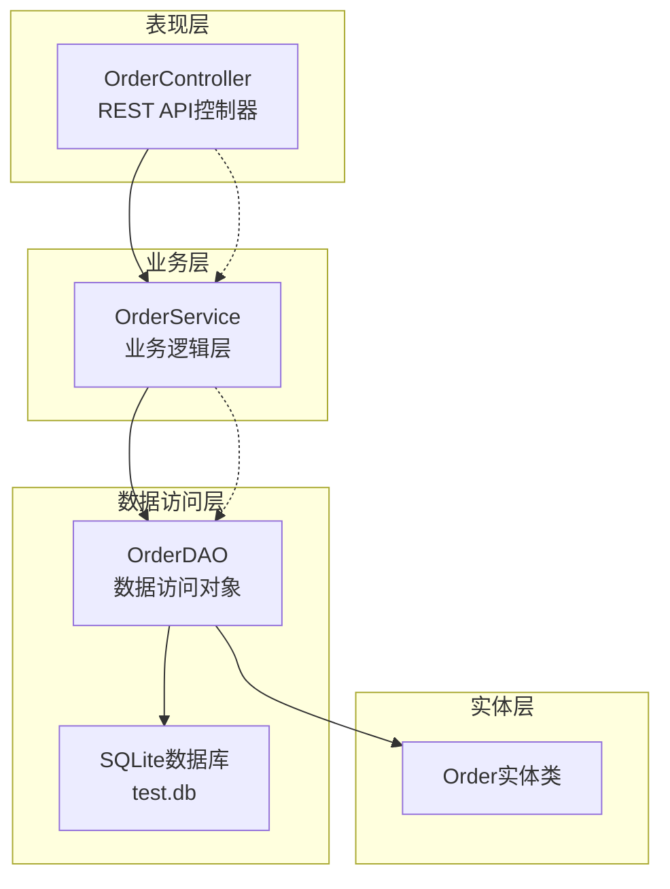
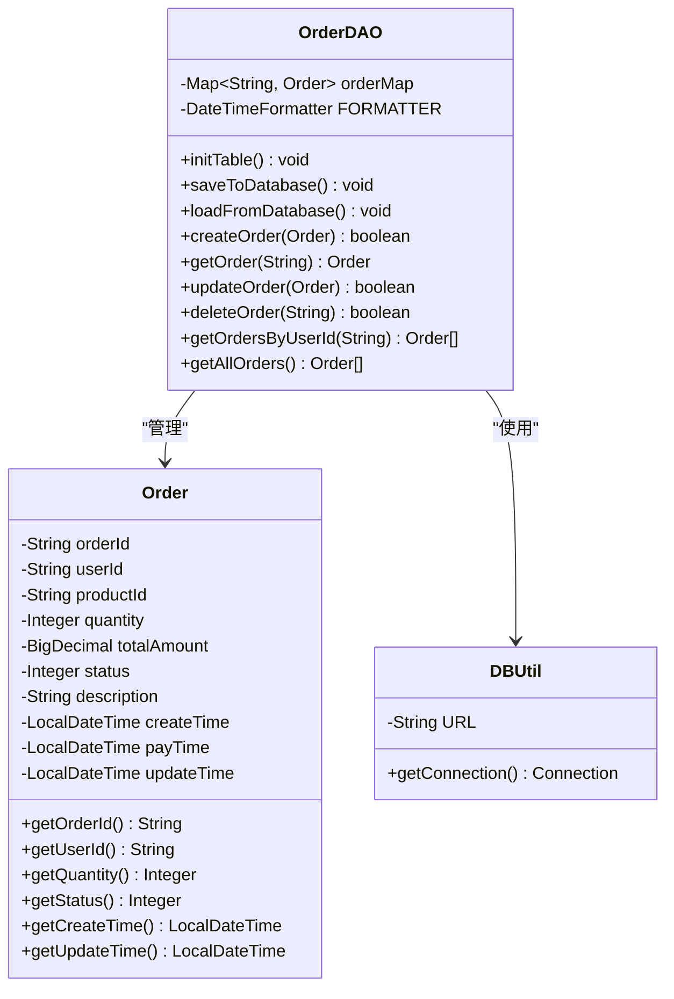
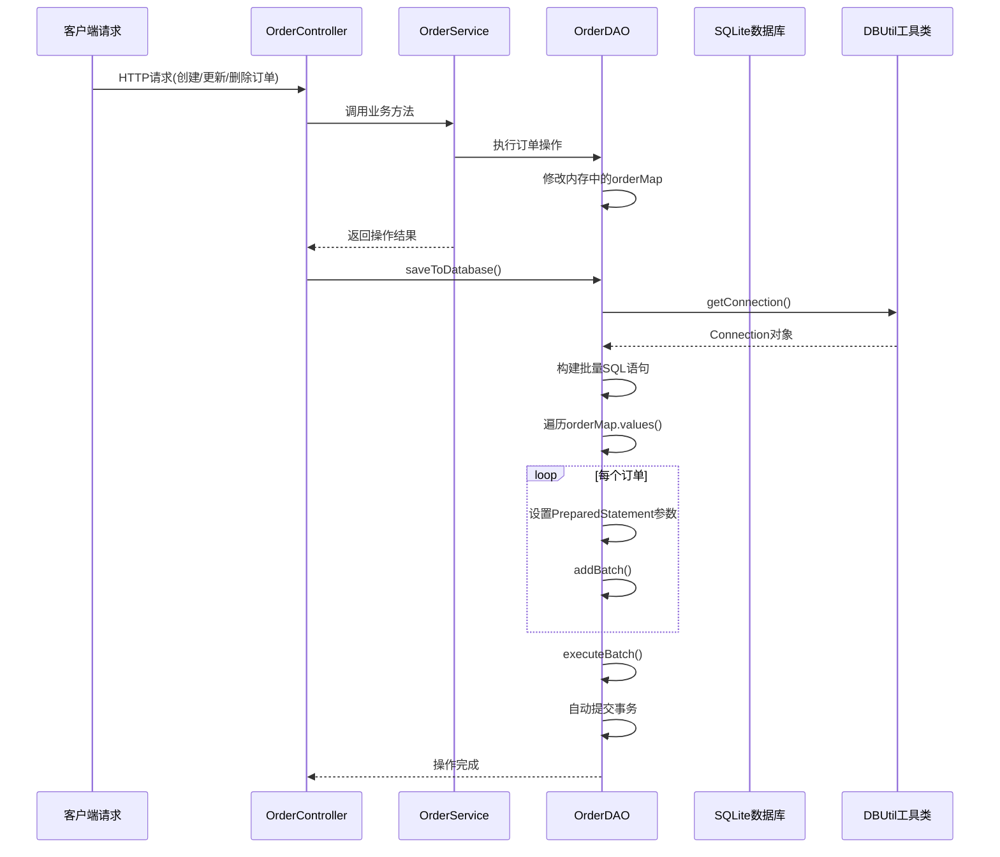
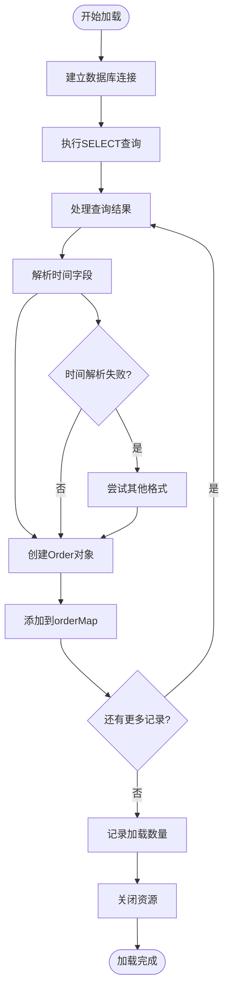
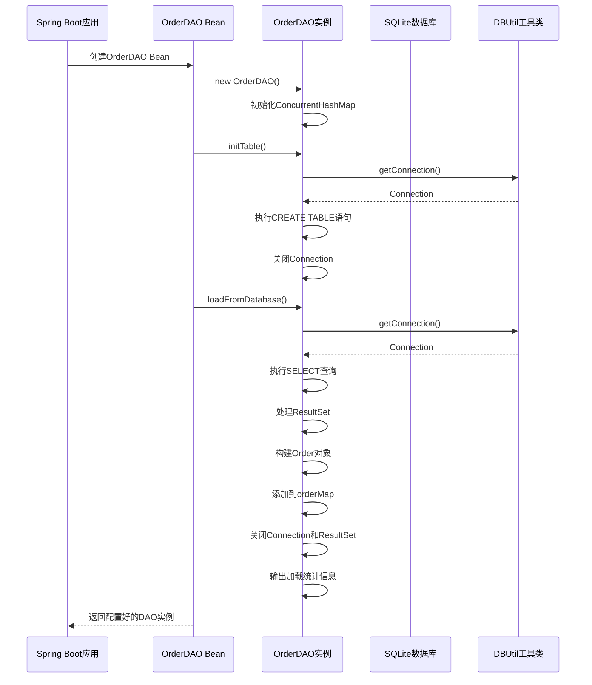
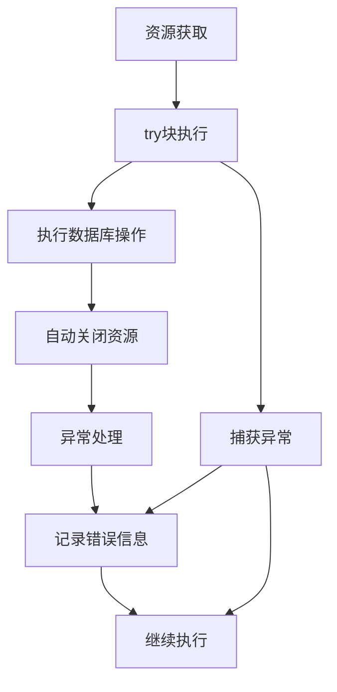

# 数据持久化策略

<cite>
**本文档引用的文件**
- [OrderDAO.java](file://src/main/java/com/example/demo/dao/OrderDAO.java)
- [DBUtil.java](file://src/main/java/com/example/demo/dao/DBUtil.java)
- [Order.java](file://src/main/java/com/example/demo/entity/Order.java)
- [App.java](file://src/main/java/com/example/demo/App.java)
- [OrderController.java](file://src/main/java/com/example/demo/controller/OrderController.java)
- [OrderService.java](file://src/main/java/com/example/demo/service/OrderService.java)
- [OrderDAOTest.java](file://src/test/java/com/example/demo/dao/OrderDAOTest.java)
</cite>

## 目录
1. [引言](#引言)
2. [系统架构概览](#系统架构概览)
3. [OrderDAO核心组件分析](#orderdao核心组件分析)
4. [数据持久化策略详解](#数据持久化策略详解)
5. [系统启动初始化流程](#系统启动初始化流程)
6. [内存优先+全量写入模式分析](#内存优先全量写入模式分析)
7. [事务边界与资源管理](#事务边界与资源管理)
8. [性能特征与优化建议](#性能特征与优化建议)
9. [数据一致性风险评估](#数据一致性风险评估)
10. [故障排除指南](#故障排除指南)
11. [总结](#总结)

## 引言

本系统采用了一种独特的"内存优先+全量写入"数据持久化策略，通过将SQLite数据库中的订单数据完全加载到内存中的ConcurrentHashMap中进行管理，实现了高性能的订单处理能力。这种设计在保证数据一致性的同时，提供了极快的查询响应速度，特别适用于中小规模的订单管理系统。

## 系统架构概览

系统采用分层架构设计，主要包含以下层次：

**图表来源**
- [OrderController.java](file://src/main/java/com/example/demo/controller/OrderController.java#L1-L173)
- [OrderService.java](file://src/main/java/com/example/demo/service/OrderService.java#L1-L114)
- [OrderDAO.java](file://src/main/java/com/example/demo/dao/OrderDAO.java#L1-L248)

**章节来源**
- [OrderController.java](file://src/main/java/com/example/demo/controller/OrderController.java#L1-L50)
- [OrderService.java](file://src/main/java/com/example/demo/service/OrderService.java#L1-L30)
- [OrderDAO.java](file://src/main/java/com/example/demo/dao/OrderDAO.java#L1-L50)

## OrderDAO核心组件分析

### 数据存储结构

OrderDAO使用线程安全的ConcurrentHashMap作为内存中的数据存储容器：

**图表来源**
- [OrderDAO.java](file://src/main/java/com/example/demo/dao/OrderDAO.java#L18-L25)
- [Order.java](file://src/main/java/com/example/demo/entity/Order.java#L9-L162)
- [DBUtil.java](file://src/main/java/com/example/demo/dao/DBUtil.java#L9-L19)

### 关键属性说明

| 属性 | 类型 | 描述 | 默认值 |
|------|------|------|--------|
| orderMap | ConcurrentHashMap<String, Order> | 内存中的订单存储容器 | 空Map |
| FORMATTER | DateTimeFormatter | 时间格式化器 | "yyyy-MM-dd'T'HH:mm:ss.SSS" |
| URL | String | SQLite数据库连接URL | "jdbc:sqlite:test.db" |

**章节来源**
- [OrderDAO.java](file://src/main/java/com/example/demo/dao/OrderDAO.java#L18-L25)
- [DBUtil.java](file://src/main/java/com/example/demo/dao/DBUtil.java#L10-L12)

## 数据持久化策略详解

### saveToDatabase()方法工作机制

saveToDatabase()方法实现了将内存中的所有订单数据批量写入SQLite数据库的功能：

**图表来源**
- [OrderController.java](file://src/main/java/com/example/demo/controller/OrderController.java#L39-L41)
- [OrderDAO.java](file://src/main/java/com/example/demo/dao/OrderDAO.java#L51-L77)
- [DBUtil.java](file://src/main/java/com/example/demo/dao/DBUtil.java#L16-L18)

#### 方法执行流程

1. **数据库连接建立**：通过DBUtil.getConnection()获取数据库连接
2. **批量SQL准备**：构建INSERT OR REPLACE语句
3. **数据遍历**：遍历ConcurrentHashMap中的所有订单
4. **参数设置**：为每个订单设置PreparedStatement参数
5. **批量添加**：使用addBatch()方法添加到批处理队列
6. **批量执行**：executeBatch()一次性执行所有插入/更新操作
7. **资源释放**：自动关闭Connection、PreparedStatement和ResultSet

**章节来源**
- [OrderDAO.java](file://src/main/java/com/example/demo/dao/OrderDAO.java#L51-L77)

### loadFromDatabase()方法工作机制

loadFromDatabase()方法负责从SQLite数据库加载所有订单数据到内存：

**图表来源**
- [OrderDAO.java](file://src/main/java/com/example/demo/dao/OrderDAO.java#L83-L157)

#### 时间字段解析策略

系统实现了健壮的时间字段解析机制：

| 时间字段 | 解析优先级 | 失败处理 |
|----------|------------|----------|
| createTime | FORMATTER → LocalDateTime.parse() | 输出错误日志 |
| payTime | FORMATTER → LocalDateTime.parse() | 输出错误日志 |
| updateTime | FORMATTER → LocalDateTime.parse() | 输出错误日志 |

**章节来源**
- [OrderDAO.java](file://src/main/java/com/example/demo/dao/OrderDAO.java#L83-L157)

## 系统启动初始化流程

### 应用启动序列

**图表来源**
- [App.java](file://src/main/java/com/example/demo/App.java#L17-L22)
- [OrderDAO.java](file://src/main/java/com/example/demo/dao/OrderDAO.java#L28-L46)
- [OrderDAO.java](file://src/main/java/com/example/demo/dao/OrderDAO.java#L83-L157)

### 初始化步骤详解

1. **Bean创建阶段**：Spring容器创建OrderDAO Bean实例
2. **表初始化**：调用initTable()方法确保数据库表结构存在
3. **数据加载**：调用loadFromDatabase()方法从数据库加载所有订单
4. **内存构建**：将数据库记录转换为Order对象并存储到内存Map中

**章节来源**
- [App.java](file://src/main/java/com/example/demo/App.java#L17-L22)
- [OrderDAO.java](file://src/main/java/com/example/demo/dao/OrderDAO.java#L28-L46)
- [OrderDAO.java](file://src/main/java/com/example/demo/dao/OrderDAO.java#L83-L157)

## 内存优先+全量写入模式分析

### 优势分析

#### 1. 性能优势
- **快速查询**：所有订单数据都在内存中，查询响应时间接近O(1)
- **批量操作**：支持高效的批量数据库写入操作
- **并发安全**：使用ConcurrentHashMap支持高并发读写

#### 2. 简单性优势
- **统一接口**：提供一致的内存和数据库操作接口
- **简化事务**：无需复杂的分布式事务管理
- **易于调试**：内存中的数据状态清晰可见

#### 3. 开发效率
- **快速原型**：开发和测试周期短
- **热部署**：内存数据可随时重新加载
- **监控友好**：内存使用情况容易监控

### 劣势分析

#### 1. 内存消耗
- **容量限制**：受JVM堆内存大小限制
- **GC压力**：大量对象可能导致频繁GC
- **内存泄漏风险**：不当的引用管理可能造成内存泄漏

#### 2. 性能瓶颈
- **启动时间**：大数据量下首次加载耗时较长
- **写入延迟**：每次写入都需要全量同步
- **并发冲突**：高并发场景下可能出现竞争

#### 3. 数据一致性风险
- **断电丢失**：服务器宕机可能导致数据丢失
- **并发问题**：多实例部署时数据不一致
- **版本冲突**：长时间未同步导致的数据冲突

**章节来源**
- [OrderDAO.java](file://src/main/java/com/example/demo/dao/OrderDAO.java#L51-L77)
- [OrderDAO.java](file://src/main/java/com/example/demo/dao/OrderDAO.java#L83-L157)

## 事务边界与资源管理

### JDBC资源管理策略

系统采用了Java 7+的try-with-resources语法确保资源正确释放：

**图表来源**
- [OrderDAO.java](file://src/main/java/com/example/demo/dao/OrderDAO.java#L57-L77)
- [OrderDAO.java](file://src/main/java/com/example/demo/dao/OrderDAO.java#L86-L157)

### 事务边界定义

#### 1. saveToDatabase()事务边界
- **开始点**：getConnection()调用
- **结束点**：executeBatch()执行完成
- **特性**：自动提交模式，每批次独立事务

#### 2. loadFromDatabase()事务边界
- **开始点**：getConnection()调用
- **结束点**：ResultSet关闭
- **特性**：读取操作，无写入事务

#### 3. 单个订单操作事务边界
- **开始点**：OrderDAO方法入口
- **结束点**：方法返回
- **特性**：内存操作即时完成，数据库操作异步

**章节来源**
- [OrderDAO.java](file://src/main/java/com/example/demo/dao/OrderDAO.java#L57-L77)
- [OrderDAO.java](file://src/main/java/com/example/demo/dao/OrderDAO.java#L86-L157)

### 资源释放最佳实践

#### 1. 连接池管理
- **自动关闭**：使用try-with-resources确保Connection自动关闭
- **连接复用**：DBUtil提供静态getConnection()方法避免重复创建
- **异常处理**：捕获SQLException并记录详细错误信息

#### 2. 批量操作优化
- **批处理**：使用PreparedStatement.addBatch()减少网络往返
- **内存控制**：合理设置批处理大小避免内存溢出
- **错误恢复**：部分失败时的错误处理策略

**章节来源**
- [DBUtil.java](file://src/main/java/com/example/demo/dao/DBUtil.java#L16-L18)
- [OrderDAO.java](file://src/main/java/com/example/demo/dao/OrderDAO.java#L57-L77)

## 性能特征与优化建议

### 性能特征分析

#### 1. 查询性能
- **内存查询**：O(1)复杂度，直接通过orderId查找
- **范围查询**：O(n log n)复杂度，需要对所有订单排序
- **过滤查询**：O(n)复杂度，需要遍历所有订单

#### 2. 写入性能
- **单条写入**：内存操作O(1)，数据库批量O(m)（m为批处理大小）
- **批量写入**：数据库层面的批量操作显著提升性能
- **并发写入**：ConcurrentHashMap支持高并发写入

#### 3. 启动性能
- **冷启动**：O(n)复杂度，n为订单总数
- **热启动**：O(1)复杂度，直接使用内存数据
- **增量加载**：不支持，需要全量重新加载

### 优化建议

#### 1. 内存优化
- **数据压缩**：考虑使用更紧凑的数据结构
- **懒加载**：按需加载特定用户或时间段的订单
- **缓存策略**：实现LRU缓存淘汰机制

#### 2. 数据库优化
- **索引优化**：为常用查询字段添加索引
- **分区策略**：按时间或用户ID进行数据分区
- **连接池**：使用连接池管理数据库连接

#### 3. 并发优化
- **读写分离**：区分读写操作，优化锁策略
- **分片策略**：按订单ID范围分片存储
- **异步处理**：将数据库写入操作异步化

**章节来源**
- [OrderDAO.java](file://src/main/java/com/example/demo/dao/OrderDAO.java#L18-L25)
- [OrderDAO.java](file://src/main/java/com/example/demo/dao/OrderDAO.java#L219-L233)
- [OrderDAO.java](file://src/main/java/com/example/demo/dao/OrderDAO.java#L239-L247)

## 数据一致性风险评估

### 风险类型分析

#### 1. 数据丢失风险
- **硬件故障**：服务器宕机导致内存数据丢失
- **软件异常**：程序崩溃或异常终止
- **人为错误**：误操作导致数据清除

#### 2. 数据不一致风险
- **并发修改**：多实例同时修改同一订单
- **网络中断**：写入过程中网络故障
- **事务中断**：部分写入导致数据不完整

#### 3. 数据损坏风险
- **格式错误**：时间格式解析失败导致数据损坏
- **类型转换**：BigDecimal等数值类型的转换错误
- **约束违反**：外键约束或业务规则违反

### 风险缓解措施

#### 1. 备份策略
- **定期备份**：定时将内存数据导出为备份文件
- **增量备份**：记录操作日志，支持增量恢复
- **异地备份**：将备份文件存储在不同位置

#### 2. 监控告警
- **内存监控**：监控内存使用率和GC频率
- **数据库监控**：监控数据库连接状态和查询性能
- **健康检查**：提供健康检查接口监控系统状态

#### 3. 错误恢复
- **自动重试**：网络异常时的自动重试机制
- **数据校验**：启动时验证数据完整性
- **降级策略**：数据库不可用时的降级方案

**章节来源**
- [OrderDAO.java](file://src/main/java/com/example/demo/dao/OrderDAO.java#L100-L110)
- [OrderDAO.java](file://src/main/java/com/example/demo/dao/OrderDAO.java#L113-L123)
- [OrderDAO.java](file://src/main/java/com/example/demo/dao/OrderDAO.java#L126-L136)

## 故障排除指南

### 常见问题诊断

#### 1. 数据加载失败
**症状**：系统启动时订单数据为空
**可能原因**：
- 数据库文件不存在或权限不足
- 表结构不匹配
- SQL语法错误

**解决方案**：
- 检查test.db文件是否存在
- 验证数据库表结构是否正确
- 查看控制台错误日志

#### 2. 时间格式解析失败
**症状**：订单的时间字段显示为null
**可能原因**：
- 数据库中存储的时间格式不标准
- 本地时间格式配置不匹配

**解决方案**：
- 检查数据库中时间字段的存储格式
- 验证FORMATTER配置是否正确
- 添加更多的格式解析尝试

#### 3. 内存溢出问题
**症状**：系统运行一段时间后出现OutOfMemoryError
**可能原因**：
- 订单数据量过大
- 内存泄漏
- GC配置不当

**解决方案**：
- 监控内存使用情况
- 分析内存泄漏原因
- 调整JVM堆内存配置

### 调试技巧

#### 1. 日志分析
系统提供了详细的日志输出：
- 数据加载统计：`从数据库加载了 X 条订单记录`
- 操作执行：各种CRUD操作的成功/失败状态
- 错误信息：详细的异常堆栈信息

#### 2. 性能监控
- 监控orderMap的大小变化
- 跟踪数据库操作的执行时间
- 分析内存使用趋势

#### 3. 数据验证
- 对比内存中的订单数量与数据库中的记录数
- 验证订单数据的完整性
- 检查时间戳的一致性

**章节来源**
- [OrderDAO.java](file://src/main/java/com/example/demo/dao/OrderDAO.java#L153-L154)
- [OrderDAO.java](file://src/main/java/com/example/demo/dao/OrderDAO.java#L155-L157)
- [OrderDAO.java](file://src/main/java/com/example/demo/dao/OrderDAO.java#L100-L110)

## 总结

本系统采用的"内存优先+全量写入"数据持久化策略具有以下特点：

### 核心优势
1. **高性能**：内存操作提供毫秒级响应时间
2. **简单可靠**：单一数据源，事务管理简单
3. **开发效率高**：快速迭代和调试
4. **资源管理完善**：自动化的资源生命周期管理

### 适用场景
- 中小规模订单系统（订单量在数十万以内）
- 对实时性要求较高的应用场景
- 开发初期的快速原型验证
- 单实例部署的系统环境

### 限制与改进方向
- **容量限制**：适合中小规模数据，大规模场景需要分片或分布式架构
- **一致性保障**：需要额外的备份和监控机制
- **并发处理**：高并发场景下可能需要读写分离或缓存优化

这种设计在特定场景下提供了优秀的平衡，既保证了性能又保持了代码的简洁性。对于需要更高扩展性的系统，可以考虑在此基础上进行演进，如引入Redis缓存、实现数据分片或采用分布式数据库等方案。