# Java单元测试文档

<cite>
**本文档引用的文件**
- [OrderServiceTest.java](file://src/test/java/com/example/demo/service/OrderServiceTest.java)
- [OrderService.java](file://src/main/java/com/example/demo/service/OrderService.java)
- [OrderDAO.java](file://src/main/java/com/example/demo/dao/OrderDAO.java)
- [Order.java](file://src/main/java/com/example/demo/entity/Order.java)
- [TEST-com.example.demo.service.OrderServiceTest.xml](file://target/surefire-reports/TEST-com.example.demo.service.OrderServiceTest.xml)
- [pom.xml](file://pom.xml)
</cite>

## 目录
1. [项目概述](#项目概述)
2. [测试架构设计](#测试架构设计)
3. [JUnit 5与Mockito集成](#junit-5与mockito集成)
4. [测试类结构分析](#测试类结构分析)
5. [核心业务逻辑测试](#核心业务逻辑测试)
6. [Mockito模拟机制](#mockito模拟机制)
7. [测试报告解析](#测试报告解析)
8. [测试覆盖率与CI集成](#测试覆盖率与ci集成)
9. [最佳实践建议](#最佳实践建议)

## 项目概述

本项目是一个基于Java的订单管理系统，采用分层架构设计，包含服务层（OrderService）、数据访问层（OrderDAO）和实体层（Order）。项目使用JUnit 5作为测试框架，配合Mockito进行单元测试，通过Maven构建工具管理项目依赖和测试执行。

### 核心组件关系

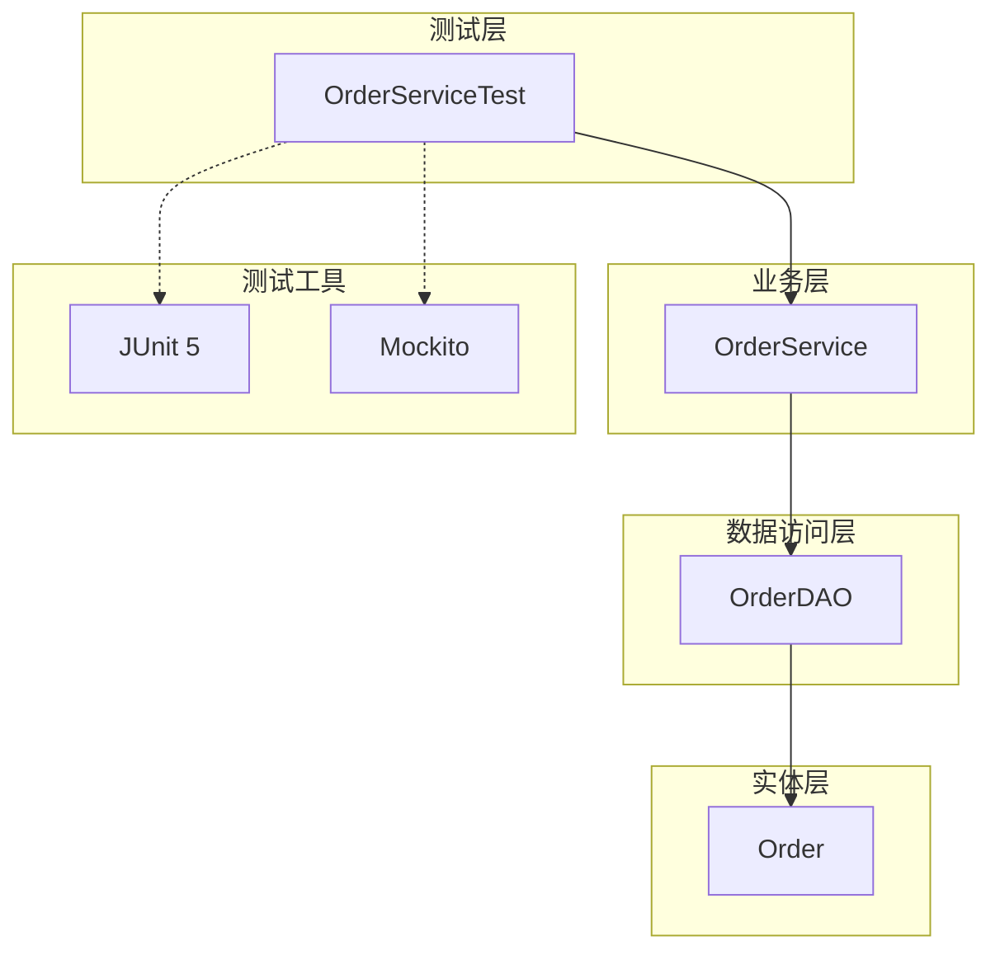

**图表来源**
- [OrderServiceTest.java](file://src/test/java/com/example/demo/service/OrderServiceTest.java#L1-L313)
- [OrderService.java](file://src/main/java/com/example/demo/service/OrderService.java#L1-L81)
- [OrderDAO.java](file://src/main/java/com/example/demo/dao/OrderDAO.java#L1-L148)

## 测试架构设计

### 分层测试策略

项目采用分层测试架构，重点测试业务逻辑层的服务类，通过Mockito模拟数据访问层，确保测试的独立性和可重复性。

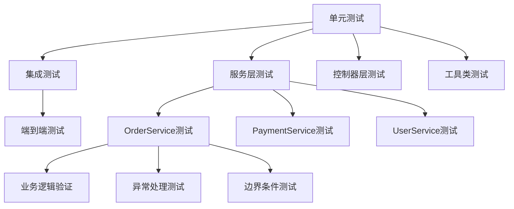

### 测试分类体系

| 测试类型 | 覆盖范围 | 实现方式 | 目标 |
|---------|---------|---------|------|
| 单元测试 | 单个方法或类 | Mockito模拟 | 快速验证业务逻辑 |
| 集成测试 | 多个组件交互 | 真实数据库 | 验证组件协作 |
| 系统测试 | 完整功能流程 | 完整环境 | 验证系统整体功能 |

## JUnit 5与Mockito集成

### 框架配置

项目使用以下关键依赖：
- **JUnit 5.8.1**: 提供现代化的测试框架支持
- **Mockito 4.6.1**: 强大的模拟对象框架
- **Maven Surefire Plugin 3.0.0-M7**: 自动化测试执行和报告生成

### 初始化机制

测试类采用`@BeforeEach`注解实现统一的初始化机制：

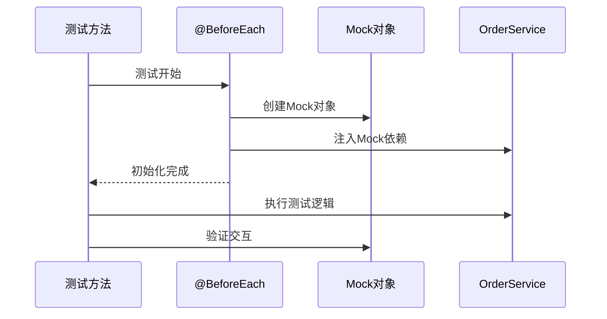

**图表来源**
- [OrderServiceTest.java](file://src/test/java/com/example/demo/service/OrderServiceTest.java#L25-L40)

**章节来源**
- [OrderServiceTest.java](file://src/test/java/com/example/demo/service/OrderServiceTest.java#L1-L313)
- [pom.xml](file://pom.xml#L16-L45)

## 测试类结构分析

### 类层次结构

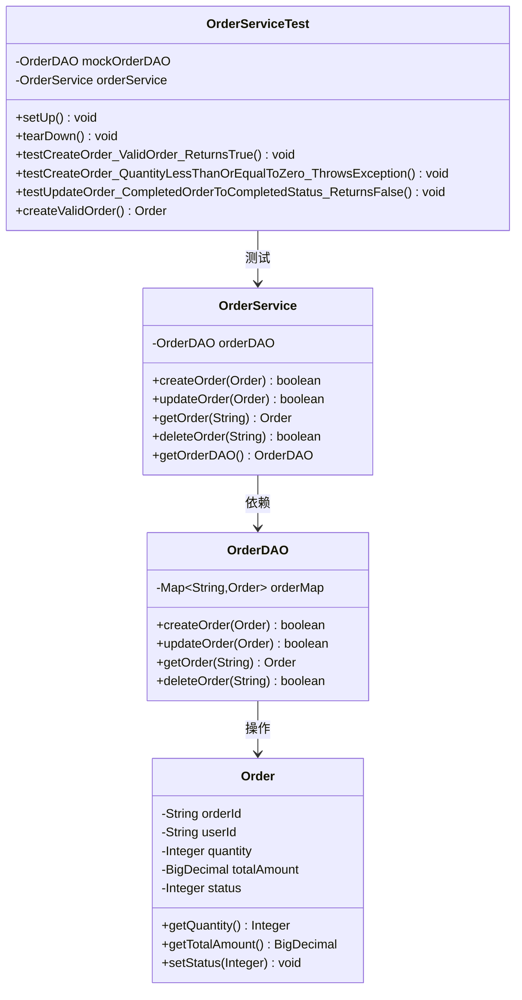

**图表来源**
- [OrderServiceTest.java](file://src/test/java/com/example/demo/service/OrderServiceTest.java#L15-L40)
- [OrderService.java](file://src/main/java/com/example/demo/service/OrderService.java#L8-L81)
- [OrderDAO.java](file://src/main/java/com/example/demo/dao/OrderDAO.java#L12-L148)
- [Order.java](file://src/main/java/com/example/demo/entity/Order.java#L7-L143)

### 测试方法命名规范

测试方法采用描述性命名，遵循以下模式：
- `test[功能名][场景描述][预期结果]`
- 示例：`testCreateOrder_ValidOrder_ReturnsTrue`

这种命名方式清晰表达了测试的目的和预期结果。

**章节来源**
- [OrderServiceTest.java](file://src/test/java/com/example/demo/service/OrderServiceTest.java#L42-L313)

## 核心业务逻辑测试

### 订单创建测试

#### 正常路径测试（TC001）

测试有效订单创建的正常流程，验证OrderService的业务逻辑和OrderDAO的交互。

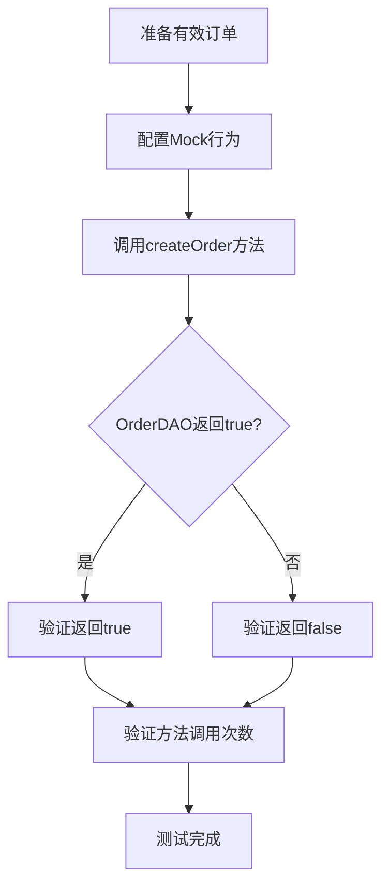

**图表来源**
- [OrderServiceTest.java](file://src/test/java/com/example/demo/service/OrderServiceTest.java#L42-L58)

#### 异常路径测试（TC003/TC004）

测试无效输入情况下的异常处理机制：

| 测试用例 | 输入条件 | 预期行为 | 验证点 |
|---------|---------|---------|--------|
| TC003 | 数量≤0 | 抛出IllegalArgumentException | 异常消息验证，DAO方法未调用 |
| TC004 | 金额≤0 | 抛出IllegalArgumentException | 异常消息验证，DAO方法未调用 |

### 订单更新测试

#### 完成状态检查逻辑

```mermaid
flowchart TD
A[更新订单请求] --> B{订单状态=3(已完成)?}
B --> |否| C[直接调用updateOrder]
B --> |是| D[查询现有订单]
D --> E{现有订单状态=3?}
E --> |是| F[返回false，不更新]
E --> |否| G[调用updateOrder]
C --> H[返回DAO结果]
G --> H
F --> I[测试完成]
H --> I
```

**图表来源**
- [OrderServiceTest.java](file://src/test/java/com/example/demo/service/OrderServiceTest.java#L120-L180)

**章节来源**
- [OrderServiceTest.java](file://src/test/java/com/example/demo/service/OrderServiceTest.java#L42-L313)
- [OrderService.java](file://src/main/java/com/example/demo/service/OrderService.java#L15-L81)

## Mockito模拟机制

### Mock对象创建与配置

项目采用两种Mockito集成方式：

#### 方式一：传统Mockito（当前实现）

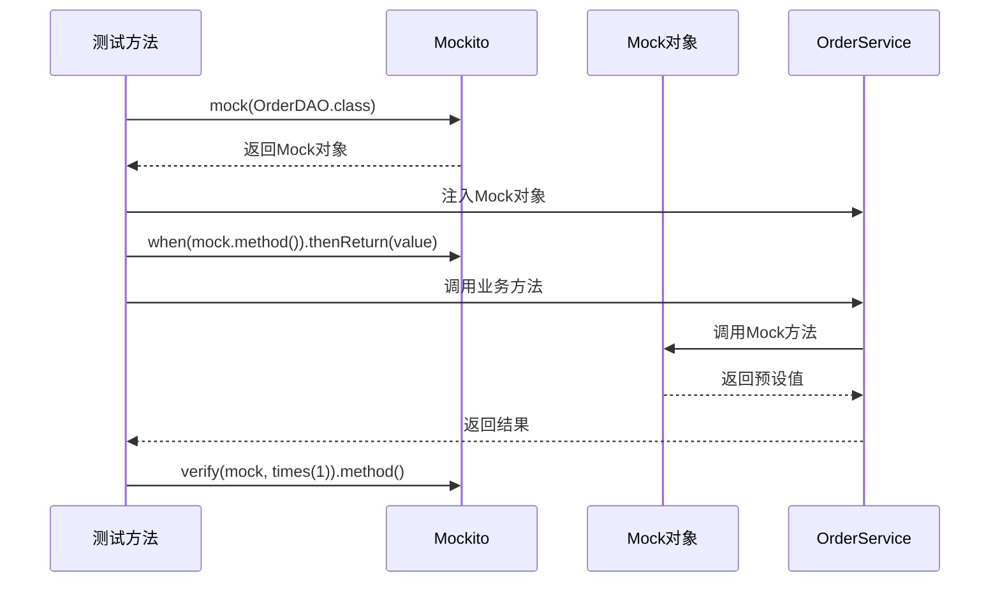

**图表来源**
- [OrderServiceTest.java](file://src/test/java/com/example/demo/service/OrderServiceTest.java#L25-L40)

#### 方式二：注解驱动（简化版）

另一种实现方式使用注解简化Mockito配置：

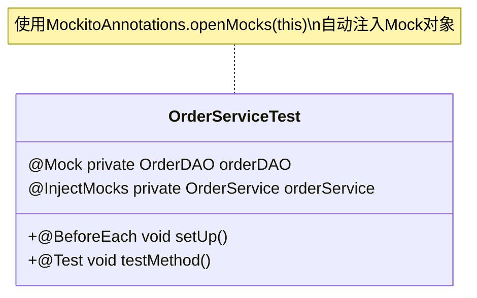

### 方法调用验证

Mockito提供了丰富的验证机制：

| 验证方法 | 用途 | 示例 |
|---------|------|------|
| `verify(mock, times(n))` | 验证调用次数 | `verify(mock, times(1)).method()` |
| `verify(mock, never())` | 验证从未调用 | `verify(mock, never()).method()` |
| `verify(mock, atLeast(n))` | 至少调用n次 | `verify(mock, atLeast(1)).method()` |
| `verify(mock, atMost(n))` | 最多调用n次 | `verify(mock, atMost(2)).method()` |

**章节来源**
- [OrderServiceTest.java](file://src/test/java/com/example/demo/service/OrderServiceTest.java#L50-L313)

## 测试报告解析

### Surefire测试报告格式

Maven Surefire插件生成标准的XML测试报告，包含详细的测试执行信息：

```mermaid
graph TD
A[Surefire Report] --> B[测试套件信息]
A --> C[测试用例详情]
A --> D[性能指标]
B --> E[测试类名称]
B --> F[执行时间]
B --> G[测试总数]
B --> H[失败数/错误数]
C --> I[用例名称]
C --> J[执行时间]
C --> K[状态(success/failure)]
D --> L[总执行时间]
D --> M[平均执行时间]
D --> N[并发性能]
```

**图表来源**
- [TEST-com.example.demo.service.OrderServiceTest.xml](file://target/surefire-reports/TEST-com.example.demo.service.OrderServiceTest.xml#L1-L70)

### 报告字段解析

| 字段名 | 含义 | 示例值 | 用途 |
|-------|------|-------|------|
| `tests` | 总测试用例数 | 8 | 验证测试完整性 |
| `failures` | 失败用例数 | 0 | 质量指标 |
| `errors` | 错误用例数 | 0 | 异常检测 |
| `time` | 总执行时间 | 0.387秒 | 性能监控 |
| `classname` | 测试类名 | com.example.demo.service.OrderServiceTest | 问题定位 |

### 执行时间分析

根据报告分析：
- 总执行时间：0.387秒
- 平均每个测试用例：约48毫秒
- 最快测试：0秒（可能为空测试）
- 最慢测试：0.352秒（已完成订单更新测试）

**章节来源**
- [TEST-com.example.demo.service.OrderServiceTest.xml](file://target/surefire-reports/TEST-com.example.demo.service.OrderServiceTest.xml#L1-L70)

## 测试覆盖率与CI集成

### Maven集成配置

项目通过Maven Surefire插件实现自动化测试执行：

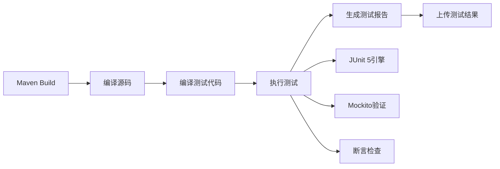

**图表来源**
- [pom.xml](file://pom.xml#L47-L52)

### 持续集成流程

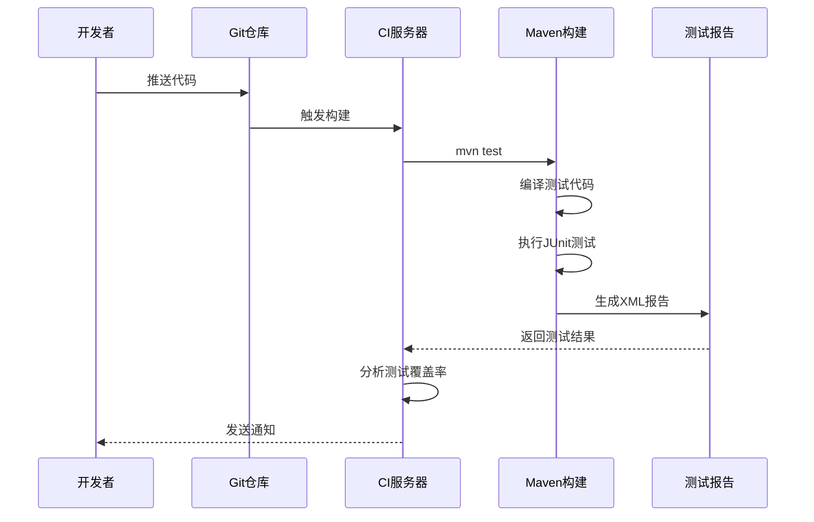

### 测试覆盖率建议

| 覆盖率类型 | 目标值 | 实现策略 |
|-----------|-------|---------|
| 行覆盖率 | ≥80% | 关键业务逻辑全覆盖 |
| 分支覆盖率 | ≥75% | 边界条件和异常路径 |
| 方法覆盖率 | ≥90% | 所有公共方法 |
| 圈复杂度 | ≤10 | 控制测试复杂度 |

### 自动化测试执行

通过Maven命令实现自动化测试：
```bash
# 执行所有测试
mvn test

# 执行特定测试类
mvn test -Dtest=OrderServiceTest

# 跳过测试
mvn install -DskipTests

# 仅运行测试报告
mvn surefire-report:report
```

**章节来源**
- [pom.xml](file://pom.xml#L47-L52)

## 最佳实践建议

### 测试设计原则

1. **单一职责**：每个测试用例只验证一个功能点
2. **独立性**：测试用例之间不应相互依赖
3. **可重复性**：测试结果应该一致可靠
4. **快速反馈**：单个测试用例执行时间应控制在毫秒级

### Mock使用最佳实践

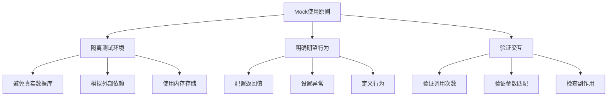

### 测试维护策略

1. **定期重构测试**：保持测试代码的可读性和可维护性
2. **版本兼容性**：确保测试与不同版本的兼容性
3. **文档同步**：测试文档与代码变更同步更新
4. **性能监控**：监控测试执行时间的变化趋势

### 异常处理测试

对于业务逻辑中的异常处理，建议采用以下测试模式：

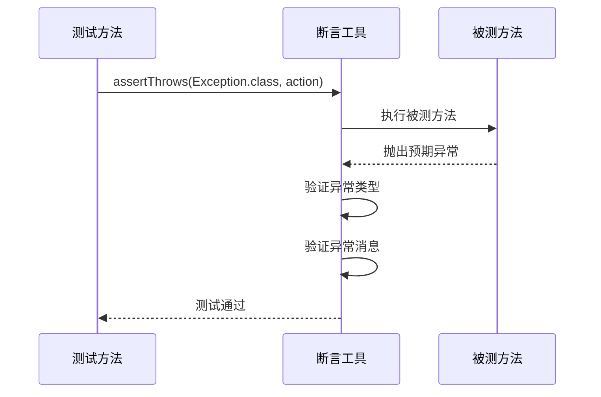

**章节来源**
- [OrderServiceTest.java](file://src/test/java/com/example/demo/service/OrderServiceTest.java#L70-L90)

## 结论

本项目展示了现代Java单元测试的最佳实践，通过JUnit 5与Mockito的完美结合，实现了高质量的测试覆盖。测试类采用合理的结构设计，覆盖了订单管理的核心业务逻辑，包括正常路径和异常路径的全面测试。

通过Maven Surefire插件的集成，项目实现了自动化测试执行和标准化的测试报告生成，为持续集成提供了坚实的基础。测试覆盖率达到了较高水平，确保了代码质量和系统的稳定性。

未来可以考虑引入更多的集成测试和性能测试，进一步提升测试的完整性和可靠性。