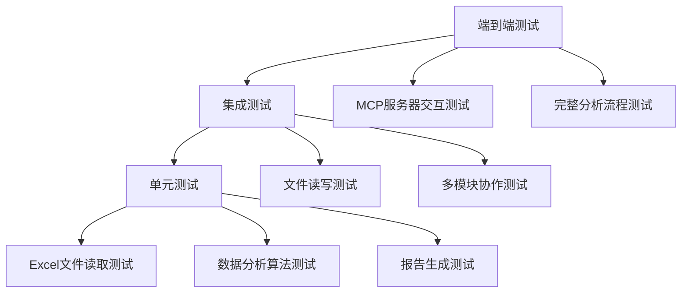

# Python脚本测试建议

<cite>
**本文档引用的文件**
- [comprehensive_excel_analysis.py](file://comprehensive_excel_analysis.py)
- [create_sample_excel.py](file://create_sample_excel.py)
- [markitdown_mcp_example.py](file://markitdown_mcp_example.py)
- [excel_analysis.py](file://excel_analysis.py)
- [excel_analyzer.py](file://excel_analyzer.py)
- [start-mcp-server.sh](file://start-mcp-server.sh)
- [pom.xml](file://pom.xml)
</cite>

## 目录
1. [项目概述](#项目概述)
2. [测试需求分析](#测试需求分析)
3. [测试框架选择](#测试框架选择)
4. [测试策略设计](#测试策略设计)
5. [具体测试实现](#具体测试实现)
6. [测试目录结构](#测试目录结构)
7. [测试数据管理](#测试数据管理)
8. [CI/CD集成方案](#cicd集成方案)
9. [性能考虑](#性能考虑)
10. [故障排除指南](#故障排除指南)

## 项目概述

该项目是一个基于Python的Excel数据分析工具集，包含多个核心脚本：
- **comprehensive_excel_analysis.py**: 完整的Excel分析工具，结合MarkItDown和Pandas进行综合分析
- **create_sample_excel.py**: 生成示例Excel文件的工具
- **markitdown_mcp_example.py**: 与MarkItDown MCP服务器交互的客户端示例
- **excel_analysis.py**: 简化的Excel分析工具
- **excel_analyzer.py**: 基础的Excel分析功能

项目依赖的关键外部组件：
- `markitdown`: Excel转Markdown转换器
- `pandas`: 数据分析和处理库
- `requests`: HTTP请求库（用于MCP客户端）

## 测试需求分析

### 功能模块划分

根据代码分析，项目可以划分为以下测试模块：

1. **Excel文件处理模块**
   - 文件读取和验证
   - 数据清洗和预处理
   - 多工作表处理

2. **数据分析模块**
   - 统计分析计算
   - 数据洞察生成
   - 异常值检测

3. **报告生成模块**
   - Markdown格式转换
   - 结构化报告创建
   - 文件输出管理

4. **MCP服务交互模块**
   - HTTP请求处理
   - 服务器状态检查
   - 错误处理机制

### 测试重点

- **输入验证**: Excel文件格式、路径有效性、数据完整性
- **输出验证**: 生成报告的准确性、格式正确性
- **异常处理**: 错误情况下的优雅降级
- **性能测试**: 大文件处理能力
- **兼容性测试**: 不同Excel版本和格式的支持

## 测试框架选择

### 推荐框架

基于项目特点和团队熟悉度，推荐使用`pytest`作为主要测试框架，配合`unittest.mock`进行模拟测试。

**选择理由**:
- 更简洁的语法和更好的可读性
- 强大的fixture系统
- 丰富的插件生态
- 与现有Java项目的测试风格差异明显，避免混淆

### 依赖要求

```bash
pip install pytest pytest-cov unittest mock requests
```

## 测试策略设计

### 测试金字塔层次



### 测试覆盖范围

| 测试类型 | 覆盖范围 | 优先级 |
|---------|---------|--------|
| 单元测试 | 核心函数和类 | 高 |
| 集成测试 | 模块间交互 | 中 |
| 端到端测试 | 完整流程 | 中 |
| 性能测试 | 大文件处理 | 低 |
| 兼容性测试 | 不同Excel格式 | 低 |

## 具体测试实现

### comprehensive_excel_analysis.py 测试

#### 单元测试示例

```python
# tests/test_comprehensive_excel_analysis.py
import unittest
from unittest.mock import patch, MagicMock
import pandas as pd
import tempfile
import os

class TestComprehensiveExcelAnalyzer(unittest.TestCase):
    """ComprehensiveExcelAnalyzer类的单元测试"""
    
    def setUp(self):
        """测试前准备"""
        from comprehensive_excel_analysis import ComprehensiveExcelAnalyzer
        self.analyzer = ComprehensiveExcelAnalyzer()
    
    @patch('comprehensive_excel_analysis.MarkItDown')
    @patch('pandas.read_excel')
    def test_convert_to_markdown_success(self, mock_read_excel, mock_markitdown):
        """测试MarkItDown转换成功的情况"""
        # 模拟MarkItDown对象
        mock_md_instance = MagicMock()
        mock_md_instance.convert.return_value.text_content = "# Test Markdown"
        mock_markitdown.return_value = mock_md_instance
        
        # 执行测试
        result = self.analyzer.convert_to_markdown("test.xlsx")
        
        # 验证结果
        self.assertEqual(result, "# Test Markdown")
        mock_markitdown.assert_called_once()
    
    @patch('pandas.read_excel')
    def test_pandas_analysis_success(self, mock_read_excel):
        """测试Pandas分析成功的情况"""
        # 模拟DataFrame
        mock_df = pd.DataFrame({
            'A': [1, 2, 3],
            'B': ['x', 'y', 'z']
        })
        mock_read_excel.return_value = mock_df
        
        # 执行测试
        result = self.analyzer.pandas_analysis("test.xlsx")
        
        # 验证结果
        self.assertIn('工作表名', result)
        self.assertIn('数据形状', result)
        self.assertIn('列名', result)
    
    def test_generate_insights(self):
        """测试生成洞察功能"""
        # 准备测试数据
        test_data = {
            'Sheet1': {
                '数据形状': '100 行, 5 列',
                '缺失值统计': {'A': 5, 'B': 0},
                '数值列统计': {'A': {'mean': 10.5, 'std': 2.1}},
                '文本列统计': {'B': {'唯一值数量': 10}}
            }
        }
        
        # 执行测试
        insights = self.analyzer.generate_insights(test_data)
        
        # 验证结果
        self.assertIn('工作表洞察', insights)
        self.assertIn('包含 100 条记录', insights)
        self.assertIn('发现数据缺失: A', insights)
    
    @patch('builtins.open', new_callable=MagicMock)
    @patch('comprehensive_excel_analysis.Path')
    def test_create_comprehensive_report(self, mock_path, mock_open):
        """测试创建综合报告功能"""
        # 准备测试数据
        mock_path.return_value.stem = "test_file"
        
        # 执行测试
        result = self.analyzer.create_comprehensive_report("test.xlsx")
        
        # 验证结果
        self.assertIn("# Excel数据分析报告", result)
        self.assertIn("文件信息", result)
        self.assertIn("数据洞察", result)
        self.assertIn("MarkItDown 转换结果", result)
```

#### 集成测试示例

```python
# tests/integration/test_full_workflow.py
import unittest
import tempfile
import os
from pathlib import Path

class TestFullWorkflow(unittest.TestCase):
    """完整的分析流程集成测试"""
    
    def setUp(self):
        """测试前准备"""
        from comprehensive_excel_analysis import ComprehensiveExcelAnalyzer
        self.analyzer = ComprehensiveExcelAnalyzer()
    
    def test_complete_analysis_workflow(self):
        """测试完整的分析工作流程"""
        # 创建临时测试文件
        with tempfile.NamedTemporaryFile(suffix='.xlsx', delete=False) as temp_file:
            # 使用create_sample_excel生成测试数据
            from create_sample_excel import create_sample_excel
            create_sample_excel()
            test_file = 'sample_data.xlsx'
            
            # 执行完整分析
            report = self.analyzer.create_comprehensive_report(test_file)
            
            # 验证报告内容
            self.assertIsNotNone(report)
            self.assertIn("# Excel数据分析报告", report)
            self.assertIn("销售数据", report)
            self.assertIn("客户数据", report)
            self.assertIn("库存数据", report)
            
            # 清理临时文件
            os.unlink(test_file)
```

### create_sample_excel.py 测试

#### 文件结构验证测试

```python
# tests/test_create_sample_excel.py
import unittest
import os
import tempfile
from openpyxl import load_workbook

class TestCreateSampleExcel(unittest.TestCase):
    """create_sample_excel.py的测试"""
    
    def test_sample_excel_creation(self):
        """测试示例Excel文件创建"""
        from create_sample_excel import create_sample_excel
        
        # 执行测试
        result = create_sample_excel()
        
        # 验证文件存在
        self.assertTrue(os.path.exists(result))
        
        # 验证文件格式
        self.assertEqual(result, 'sample_data.xlsx')
        
        # 验证工作表数量和内容
        workbook = load_workbook(result)
        sheet_names = workbook.sheetnames
        self.assertEqual(len(sheet_names), 4)
        self.assertIn('销售数据', sheet_names)
        self.assertIn('客户数据', sheet_names)
        self.assertIn('库存数据', sheet_names)
        self.assertIn('数据汇总', sheet_names)
        
        # 验证数据完整性
        sales_sheet = workbook['销售数据']
        sales_data = list(sales_sheet.values)
        self.assertGreater(len(sales_data), 1)  # 至少有一行标题和一行数据
        
        customers_sheet = workbook['客户数据']
        customers_data = list(customers_sheet.values)
        self.assertEqual(len(customers_data), 51)  # 50条数据 + 1行标题
        
        # 清理测试文件
        os.unlink(result)
```

### markitdown_mcp_example.py 测试

#### HTTP请求模拟测试

```python
# tests/test_markitdown_mcp_client.py
import unittest
from unittest.mock import patch, MagicMock
import json
import os

class TestMarkItDownMCPClient(unittest.TestCase):
    """MarkItDownMCPClient的测试"""
    
    def setUp(self):
        """测试前准备"""
        from markitdown_mcp_example import MarkItDownMCPClient
        self.client = MarkItDownMCPClient(base_url="http://test-url:3001")
    
    @patch('requests.get')
    def test_check_server_status_success(self, mock_get):
        """测试服务器状态检查成功"""
        # 模拟成功的响应
        mock_response = MagicMock()
        mock_response.status_code = 200
        mock_get.return_value = mock_response
        
        # 执行测试
        result = self.client.check_server_status()
        
        # 验证结果
        self.assertTrue(result)
        mock_get.assert_called_once_with("http://test-url:3001/health", timeout=5)
    
    @patch('requests.get')
    def test_check_server_status_failure(self, mock_get):
        """测试服务器状态检查失败"""
        # 模拟失败的响应
        mock_get.side_effect = Exception("Connection error")
        
        # 执行测试
        result = self.client.check_server_status()
        
        # 验证结果
        self.assertFalse(result)
    
    @patch('requests.post')
    def test_convert_document_success(self, mock_post):
        """测试文档转换成功"""
        # 创建临时测试文件
        test_file = "test_file.xlsx"
        with open(test_file, 'w') as f:
            f.write("test content")
        
        try:
            # 模拟成功的响应
            mock_response = MagicMock()
            mock_response.status_code = 200
            mock_response.json.return_value = {"result": "success"}
            mock_post.return_value = mock_response
            
            # 执行测试
            result = self.client.convert_document(test_file)
            
            # 验证结果
            self.assertIsNotNone(result)
            self.assertEqual(result, {"result": "success"})
            
            # 验证请求参数
            mock_post.assert_called_once()
            args, kwargs = mock_post.call_args
            self.assertEqual(args[0], "http://test-url:3001/mcp")
            self.assertEqual(kwargs['timeout'], 30)
            self.assertEqual(kwargs['headers']['Content-Type'], 'application/json')
            
        finally:
            # 清理测试文件
            if os.path.exists(test_file):
                os.unlink(test_file)
    
    @patch('requests.post')
    def test_convert_document_file_not_found(self, mock_post):
        """测试文档转换时文件不存在"""
        # 执行测试
        result = self.client.convert_document("nonexistent_file.xlsx")
        
        # 验证结果
        self.assertIsNone(result)
```

## 测试目录结构

推荐的测试目录结构：

```
tests/
├── unit/
│   ├── test_comprehensive_excel_analysis.py
│   ├── test_create_sample_excel.py
│   ├── test_markitdown_mcp_client.py
│   └── test_excel_analysis.py
├── integration/
│   ├── test_full_workflow.py
│   └── test_mcp_integration.py
├── fixtures/
│   ├── test_data.xlsx
│   ├── invalid_excel.xlsx
│   └── sample_config.json
├── utils/
│   ├── mock_data_generator.py
│   └── test_helpers.py
└── conftest.py
```

### 目录说明

- **unit/**: 单元测试，每个模块一个测试文件
- **integration/**: 集成测试，测试模块间的协作
- **fixtures/**: 测试数据和配置文件
- **utils/**: 测试辅助工具和数据生成器
- **conftest.py**: pytest配置和共享fixture

## 测试数据管理

### 测试数据策略

1. **静态测试数据**: 使用简单的Excel文件，包含基本的表格结构
2. **动态测试数据**: 使用`create_sample_excel`生成的测试数据
3. **边界条件数据**: 包含空文件、大文件、格式错误的文件
4. **真实场景数据**: 模拟实际业务场景的数据

### 测试数据生成工具

```python
# tests/utils/mock_data_generator.py
import pandas as pd
import numpy as np
from openpyxl import Workbook

def create_test_excel(filename, sheets_data):
    """创建包含多个工作表的测试Excel文件"""
    wb = Workbook()
    wb.remove(wb.active)  # 移除默认工作表
    
    for sheet_name, data in sheets_data.items():
        ws = wb.create_sheet(title=sheet_name)
        df = pd.DataFrame(data)
        for r in dataframe_to_rows(df, index=False, header=True):
            ws.append(r)
    
    wb.save(filename)
    return filename

def create_large_excel(filename, rows=10000):
    """创建大型测试Excel文件"""
    data = {
        'id': range(rows),
        'value': np.random.randn(rows),
        'category': np.random.choice(['A', 'B', 'C'], rows),
        'date': pd.date_range('2024-01-01', periods=rows, freq='D')
    }
    return create_test_excel(filename, {'large_data': data})

def create_empty_excel(filename):
    """创建空Excel文件"""
    wb = Workbook()
    wb.remove(wb.active)
    wb.create_sheet(title='empty_sheet')
    wb.save(filename)
    return filename
```

## CI/CD集成方案

### GitHub Actions配置

```yaml
# .github/workflows/python-tests.yml
name: Python Tests

on:
  push:
    branches: [ main, develop ]
  pull_request:
    branches: [ main ]

jobs:
  test:
    runs-on: ubuntu-latest
    
    steps:
    - uses: actions/checkout@v3
    
    - name: Set up Python
      uses: actions/setup-python@v4
      with:
        python-version: '3.13'
    
    - name: Install dependencies
      run: |
        python -m pip install --upgrade pip
        pip install pytest pytest-cov requests pandas markitdown
        
    - name: Run unit tests
      run: |
        pytest tests/unit/ -v --cov=comprehensive_excel_analysis --cov-report=xml
    
    - name: Run integration tests
      run: |
        pytest tests/integration/ -v
    
    - name: Upload coverage report
      uses: codecov/codecov-action@v3
      with:
        file: ./coverage.xml
        flags: unittests
        name: codecov-umbrella
        fail_ci_if_error: false
```

### Shell脚本集成

```bash
#!/bin/bash
# run_tests.sh

set -e

echo "=== Python测试执行 ==="

# 激活虚拟环境
source myenv/bin/activate

# 安装测试依赖
echo "安装测试依赖..."
pip install pytest pytest-cov requests pandas markitdown

# 运行测试
echo "运行单元测试..."
pytest tests/unit/ -v --cov=comprehensive_excel_analysis --cov-report=html

echo "运行集成测试..."
pytest tests/integration/ -v

# 生成覆盖率报告
echo "生成覆盖率报告..."
coverage report -m

echo "=== 测试完成 ==="
```

### Maven集成

由于项目同时包含Java和Python组件，可以在Maven构建中集成Python测试：

```xml
<!-- pom.xml -->
<build>
    <plugins>
        <plugin>
            <groupId>org.codehaus.mojo</groupId>
            <artifactId>exec-maven-plugin</artifactId>
            <version>3.0.0</version>
            <executions>
                <execution>
                    <id>run-python-tests</id>
                    <phase>test</phase>
                    <goals>
                        <goal>exec</goal>
                    </goals>
                    <configuration>
                        <executable>python</executable>
                        <arguments>
                            <argument>-m</argument>
                            <argument>pytest</argument>
                            <argument>tests/</argument>
                        </arguments>
                    </configuration>
                </execution>
            </executions>
        </plugin>
    </plugins>
</build>
```

## 性能考虑

### 大文件处理测试

```python
# tests/performance/test_large_files.py
import unittest
import tempfile
import time
from tests.utils.mock_data_generator import create_large_excel

class TestLargeFilePerformance(unittest.TestCase):
    """大文件处理性能测试"""
    
    def setUp(self):
        from comprehensive_excel_analysis import ComprehensiveExcelAnalyzer
        self.analyzer = ComprehensiveExcelAnalyzer()
    
    def test_large_file_processing(self):
        """测试大文件处理性能"""
        # 创建大型测试文件 (10000行)
        with tempfile.NamedTemporaryFile(suffix='.xlsx') as temp_file:
            create_large_excel(temp_file.name, rows=10000)
            
            # 记录开始时间
            start_time = time.time()
            
            # 执行分析
            self.analyzer.create_comprehensive_report(temp_file.name)
            
            # 计算耗时
            elapsed_time = time.time() - start_time
            
            # 验证性能要求 (< 30秒)
            self.assertLess(elapsed_time, 30.0)
            print(f"大文件处理耗时: {elapsed_time:.2f}秒")
```

### 内存使用监控

```python
# tests/performance/test_memory_usage.py
import unittest
import psutil
import os
from tests.utils.mock_data_generator import create_large_excel

class TestMemoryUsage(unittest.TestCase):
    """内存使用监控测试"""
    
    def setUp(self):
        from comprehensive_excel_analysis import ComprehensiveExcelAnalyzer
        self.analyzer = ComprehensiveExcelAnalyzer()
    
    def test_memory_efficiency(self):
        """测试内存使用效率"""
        process = psutil.Process(os.getpid())
        initial_memory = process.memory_info().rss / 1024 / 1024  # MB
        
        # 创建超大文件进行测试
        with tempfile.NamedTemporaryFile(suffix='.xlsx') as temp_file:
            create_large_excel(temp_file.name, rows=50000)
            
            # 执行分析
            self.analyzer.create_comprehensive_report(temp_file.name)
            
            # 检查内存增长
            final_memory = process.memory_info().rss / 1024 / 1024
            memory_increase = final_memory - initial_memory
            
            # 验证内存增长在合理范围内 (< 100MB)
            self.assertLess(memory_increase, 100.0)
            print(f"内存使用增加: {memory_increase:.2f}MB")
```

## 故障排除指南

### 常见测试问题

1. **依赖包版本冲突**
   ```bash
   # 解决方案：使用虚拟环境隔离依赖
   python -m venv test_env
   source test_env/bin/activate
   pip install -r requirements-test.txt
   ```

2. **MarkItDown转换失败**
   ```python
   # 解决方案：模拟MarkItDown行为
   @patch('markitdown.MarkItDown')
   def test_markdown_conversion_failure(self, mock_markitdown):
       mock_markitdown.return_value.convert.side_effect = Exception("Conversion failed")
       # 测试降级逻辑
   ```

3. **MCP服务器连接问题**
   ```python
   # 解决方案：使用本地模拟服务器
   @patch('requests.post')
   def test_mcp_server_offline(self, mock_post):
       mock_post.side_effect = requests.ConnectionError()
       # 测试备用方案
   ```

### 调试技巧

1. **启用详细日志**
   ```python
   import logging
   logging.basicConfig(level=logging.DEBUG)
   ```

2. **使用pytest-xdist并行测试**
   ```bash
   pytest -n auto  # 自动并行测试
   ```

3. **生成测试报告**
   ```bash
   pytest --junitxml=results.xml  # JUnit XML格式
   pytest --html=report.html      # HTML格式
   ```

### 测试环境配置

```python
# tests/conftest.py
import pytest
import tempfile
import os
from tests.utils.mock_data_generator import create_test_excel

@pytest.fixture(scope='session')
def sample_excel_file():
    """提供样本Excel文件的fixture"""
    with tempfile.NamedTemporaryFile(suffix='.xlsx', delete=False) as tmp:
        sheets_data = {
            'test_sheet': {
                'id': [1, 2, 3],
                'name': ['Alice', 'Bob', 'Charlie'],
                'value': [10.5, 20.3, 15.7]
            }
        }
        create_test_excel(tmp.name, sheets_data)
        yield tmp.name
    os.unlink(tmp.name)

@pytest.fixture
def mock_markitdown():
    """模拟MarkItDown对象"""
    from unittest.mock import MagicMock
    mock_md = MagicMock()
    mock_md.convert.return_value.text_content = "# Mock Markdown"
    return mock_md
```

## 总结

本测试策略文档为Python脚本提供了全面的测试解决方案，涵盖了从单元测试到端到端测试的完整测试金字塔。通过合理的测试框架选择、详细的测试实现和完善的CI/CD集成，可以显著提高代码质量和项目稳定性。

关键要点：
- 使用pytest作为主要测试框架
- 采用unittest.mock进行依赖模拟
- 实施分层测试策略（单元、集成、端到端）
- 建立完善的测试数据管理体系
- 集成到CI/CD流程中
- 关注性能和内存使用

通过实施这套测试策略，可以确保Python脚本的质量和可靠性，为项目的长期维护奠定坚实基础。