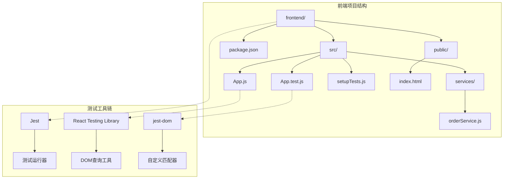
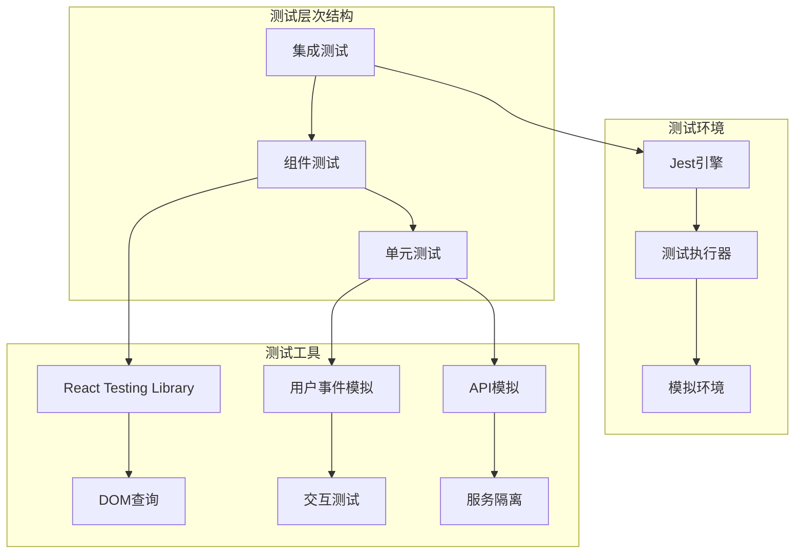
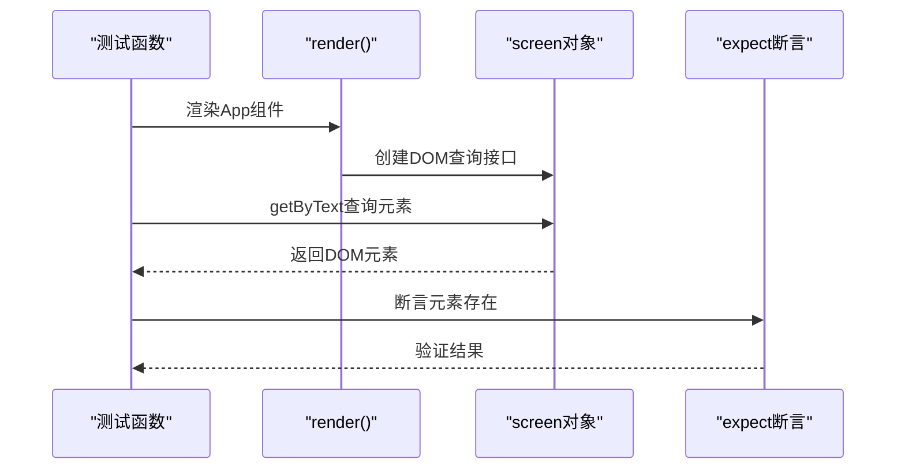
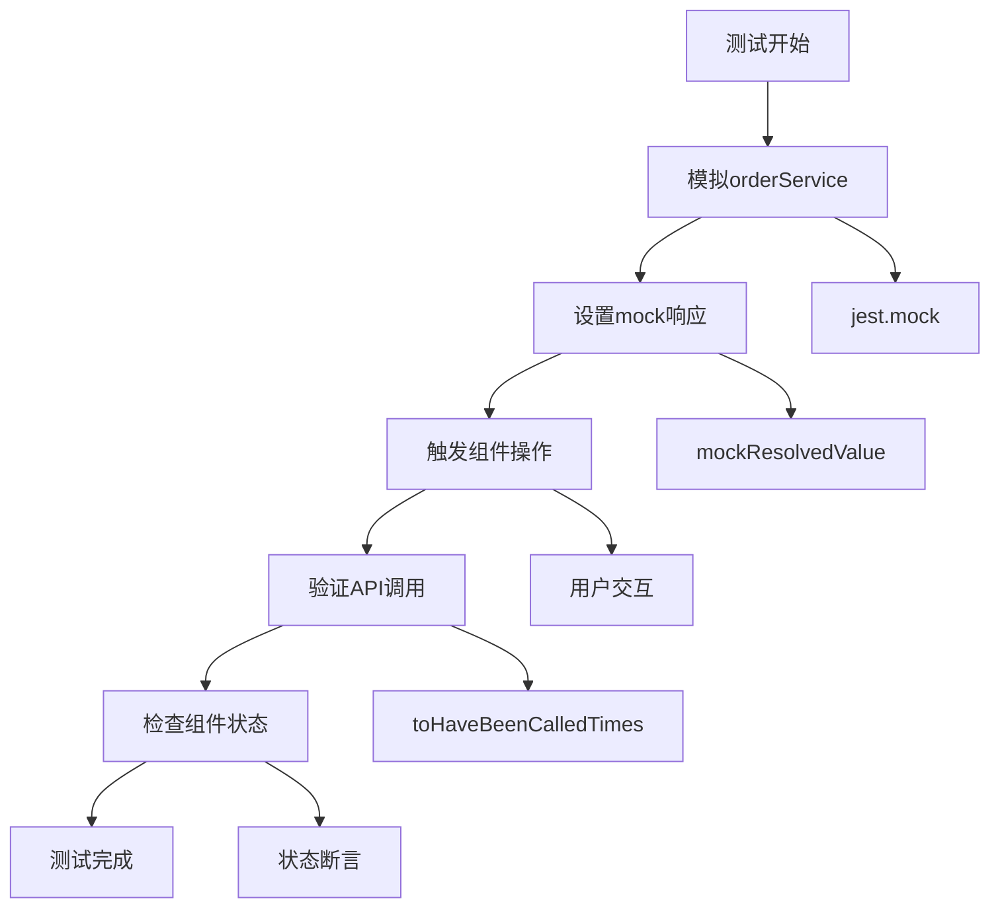
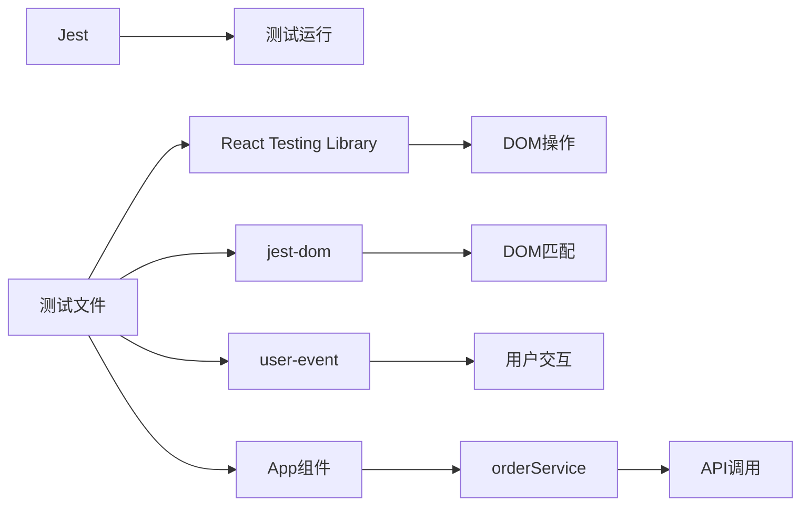

# 前端测试

<cite>
**本文档引用的文件**
- [App.test.js](file://frontend/src/App.test.js)
- [App.js](file://frontend/src/App.js)
- [orderService.js](file://frontend/src/services/orderService.js)
- [package.json](file://frontend/package.json)
- [setupTests.js](file://frontend/src/setupTests.js)
- [index.js](file://frontend/src/index.js)
- [index.html](file://frontend/public/index.html)
</cite>

## 目录
1. [简介](#简介)
2. [项目结构](#项目结构)
3. [核心组件](#核心组件)
4. [架构概览](#架构概览)
5. [详细组件分析](#详细组件分析)
6. [依赖关系分析](#依赖关系分析)
7. [性能考虑](#性能考虑)
8. [故障排除指南](#故障排除指南)
9. [结论](#结论)

## 简介

本文档详细说明了基于React Testing Library和Jest的前端组件测试实施方式。该项目采用现代前端测试策略，通过App.test.js文件展示了如何对App.js中的React组件进行全面的渲染测试、用户交互测试和API调用模拟测试。

前端测试在现代软件开发中扮演着至关重要的角色，它能够：
- 防止UI回归问题
- 提升用户体验的一致性
- 确保组件功能的正确性
- 加速开发流程和重构过程
- 提供自动化质量保证

## 项目结构

该项目采用标准的Create React App项目结构，前端测试相关的核心文件组织如下：

**图表来源**
- [package.json](file://frontend/package.json#L1-L41)
- [setupTests.js](file://frontend/src/setupTests.js#L1-L6)

**章节来源**
- [package.json](file://frontend/package.json#L1-L41)
- [setupTests.js](file://frontend/src/setupTests.js#L1-L6)

## 核心组件

### 测试框架配置

项目使用以下核心测试工具：

| 工具 | 版本 | 用途 |
|------|------|------|
| Jest | 内置 | 测试运行器和断言库 |
| React Testing Library | ^16.3.0 | DOM测试工具 |
| @testing-library/jest-dom | ^6.9.1 | 自定义DOM匹配器 |
| @testing-library/user-event | ^13.5.0 | 用户事件模拟 |

### 应用程序组件

App.js是主要的React组件，包含以下核心功能：
- 订单管理界面
- 表单数据处理
- API服务集成
- 状态管理
- 用户交互处理

**章节来源**
- [package.json](file://frontend/package.json#L6-L15)
- [App.js](file://frontend/src/App.js#L1-L427)

## 架构概览

前端测试架构采用分层设计，确保测试的独立性和可维护性：

**图表来源**
- [App.test.js](file://frontend/src/App.test.js#L1-L9)
- [setupTests.js](file://frontend/src/setupTests.js#L1-L6)

## 详细组件分析

### 基础测试结构

当前的App.test.js展示了最基础的测试模式：

**图表来源**
- [App.test.js](file://frontend/src/App.test.js#L4-L8)

### 组件渲染测试

测试的核心目标是验证组件的渲染行为：

| 测试类型 | 方法 | 目标 |
|----------|------|------|
| 元素存在性 | `getByText()` | 验证UI元素正确渲染 |
| 属性验证 | `getByRole()` | 检查元素属性设置 |
| 样式验证 | `toHaveClass()` | 确认样式应用正确 |
| 可访问性 | `getByLabelText()` | 验证ARIA属性 |

### API调用模拟

项目中的orderService.js提供了与后端API的接口，测试中需要对其进行模拟：

**图表来源**
- [orderService.js](file://frontend/src/services/orderService.js#L1-L49)

### 用户交互测试

测试需要覆盖各种用户交互场景：

| 交互类型 | 测试方法 | 验证点 |
|----------|----------|--------|
| 表单输入 | `fireEvent.change()` | 数据绑定正确 |
| 按钮点击 | `fireEvent.click()` | 事件处理器触发 |
| 键盘操作 | `fireEvent.keyPress()` | 键盘事件处理 |
| 表单提交 | `fireEvent.submit()` | 提交逻辑验证 |

**章节来源**
- [App.test.js](file://frontend/src/App.test.js#L1-L9)
- [App.js](file://frontend/src/App.js#L62-L103)

## 依赖关系分析

### 测试工具依赖

**图表来源**
- [package.json](file://frontend/package.json#L6-L15)
- [setupTests.js](file://frontend/src/setupTests.js#L1-L6)

### 外部依赖隔离

测试通过以下方式隔离外部依赖：

1. **API调用模拟**：使用`jest.mock`隔离网络请求
2. **状态管理**：通过测试钩子控制组件状态
3. **副作用处理**：使用`beforeEach`清理测试环境

**章节来源**
- [package.json](file://frontend/package.json#L1-L41)
- [orderService.js](file://frontend/src/services/orderService.js#L1-L49)

## 性能考虑

前端测试的性能优化策略：

### 测试执行优化

- 使用并行测试执行
- 合理的测试文件组织
- 避免不必要的DOM查询
- 适当的测试超时设置

### 内存管理

- 及时清理测试状态
- 避免内存泄漏
- 合理使用测试钩子

## 故障排除指南

### 常见测试问题

| 问题类型 | 症状 | 解决方案 |
|----------|------|----------|
| 元素未找到 | `TestingLibraryElementError` | 检查选择器和元素渲染 |
| 异步等待 | 测试超时 | 使用`waitFor`或`findBy` |
| 状态不一致 | 断言失败 | 检查异步操作和状态更新 |
| 模拟失效 | API调用真实执行 | 确认jest.mock配置 |

### 调试技巧

1. **使用调试器**：在测试中设置断点
2. **添加日志**：使用`console.log`输出中间状态
3. **截图测试**：捕获测试过程中的DOM状态
4. **逐步测试**：分解复杂测试为简单步骤

**章节来源**
- [App.test.js](file://frontend/src/App.test.js#L1-L9)

## 结论

前端测试是确保应用程序质量和可维护性的关键环节。通过合理的测试策略和工具选择，可以：

1. **提高代码质量**：及早发现和修复问题
2. **加速开发流程**：自动化测试减少手动验证
3. **增强团队信心**：可靠的测试套件支持重构和迭代
4. **改善用户体验**：确保功能的一致性和稳定性

建议的测试实践包括：
- 编写有意义的测试名称
- 保持测试的独立性和可重复性
- 使用适当的测试工具和模式
- 定期审查和重构测试代码
- 建立持续集成的测试流程

通过遵循这些最佳实践，开发团队可以构建更加可靠和可维护的前端应用程序。