# 单元测试实现机制深度分析

<cite>
**本文档引用的文件**
- [OrderServiceTest.java](file://src/test/java/com/example/demo/service/OrderServiceTest.java)
- [OrderDAOTest.java](file://src/test/java/com/example/demo/dao/OrderDAOTest.java)
- [AIOrderServiceTest.java](file://src/test/java/com/example/demo/service/ai_test/AIOrderServiceTest.java)
- [OrderService.java](file://src/main/java/com/example/demo/service/OrderService.java)
- [OrderDAO.java](file://src/main/java/com/example/demo/dao/OrderDAO.java)
- [Order.java](file://src/main/java/com/example/demo/entity/Order.java)
- [pom.xml](file://pom.xml)
- [TEST-com.example.demo.service.OrderServiceTest.xml](file://target/surefire-reports/TEST-com.example.demo.service.OrderServiceTest.xml)
- [TEST-com.example.demo.service.ai_test.AIOrderServiceTest.xml](file://target/surefire-reports/TEST-com.example.demo.service.ai_test.AIOrderServiceTest.xml)
</cite>

## 目录
1. [项目概述](#项目概述)
2. [测试框架架构](#测试框架架构)
3. [核心测试组件分析](#核心测试组件分析)
4. [JUnit 5测试方法结构](#junit-5测试方法结构)
5. [Mockito模拟机制](#mockito模拟机制)
6. [测试用例设计模式](#测试用例设计模式)
7. [AI扩展测试体系](#ai扩展测试体系)
8. [测试覆盖率分析](#测试覆盖率分析)
9. [最佳实践建议](#最佳实践建议)
10. [总结](#总结)

## 项目概述

本项目采用Spring Boot框架构建，实现了完整的订单管理系统。测试体系分为两个层次：标准单元测试和AI增强测试，展现了现代Java应用测试的完整解决方案。

### 技术栈特点
- **测试框架**: JUnit 5 + Mockito
- **构建工具**: Maven
- **代码覆盖率**: JaCoCo集成
- **测试分类**: 单元测试、集成测试

## 测试框架架构

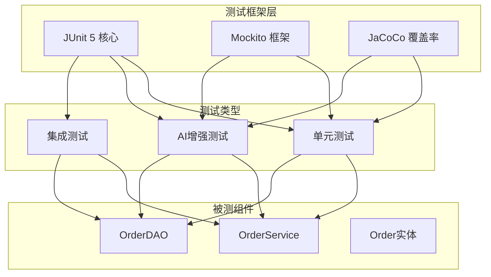

**图表来源**
- [pom.xml](file://pom.xml#L32-L58)
- [OrderServiceTest.java](file://src/test/java/com/example/demo/service/OrderServiceTest.java#L1-L20)

**章节来源**
- [pom.xml](file://pom.xml#L1-L136)

## 核心测试组件分析

### OrderServiceTest - 标准单元测试

OrderServiceTest是项目的核心业务逻辑测试类，展示了标准的单元测试实现模式。

#### 测试类结构特征

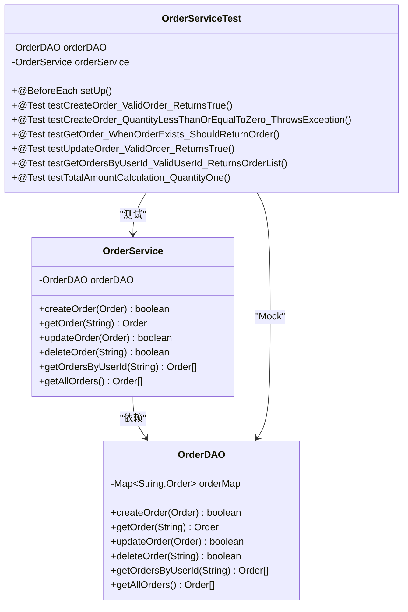

**图表来源**
- [OrderServiceTest.java](file://src/test/java/com/example/demo/service/OrderServiceTest.java#L25-L37)
- [OrderService.java](file://src/main/java/com/example/demo/service/OrderService.java#L14-L21)
- [OrderDAO.java](file://src/main/java/com/example/demo/dao/OrderDAO.java#L18-L21)

#### 关键测试特性

1. **依赖注入测试**: 使用Mockito模拟DAO层依赖
2. **边界条件测试**: 验证无效输入的异常处理
3. **业务逻辑验证**: 测试复杂的业务规则
4. **数据完整性检查**: 确保数据正确传递和转换

**章节来源**
- [OrderServiceTest.java](file://src/test/java/com/example/demo/service/OrderServiceTest.java#L1-L284)

### OrderDAOTest - 数据访问层测试

OrderDAOTest专注于数据持久化层的测试，采用内存模拟的方式避免外部依赖。

#### 测试策略特点

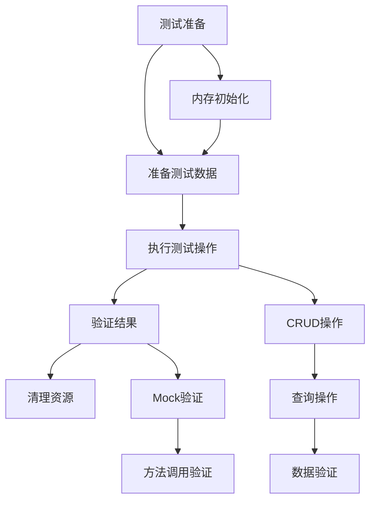

**图表来源**
- [OrderDAOTest.java](file://src/test/java/com/example/demo/dao/OrderDAOTest.java#L21-L24)

**章节来源**
- [OrderDAOTest.java](file://src/test/java/com/example/demo/dao/OrderDAOTest.java#L1-L239)

### AIOrderServiceTest - AI增强测试

AIOrderServiceTest代表了项目中AI辅助测试的创新实践，提供了更系统化的测试方法论。

#### AI测试特征

1. **标准化命名**: 使用TC001、TC002等测试用例编号
2. **三段式结构**: Arrange-Act-Assert模式
3. **详细断言**: 包含异常消息验证
4. **扩展功能测试**: 新增订单状态管理功能

**章节来源**
- [AIOrderServiceTest.java](file://src/test/java/com/example/demo/service/ai_test/AIOrderServiceTest.java#L1-L447)

## JUnit 5测试方法结构

### 基本注解体系

JUnit 5提供了丰富的注解来组织测试生命周期和测试方法：

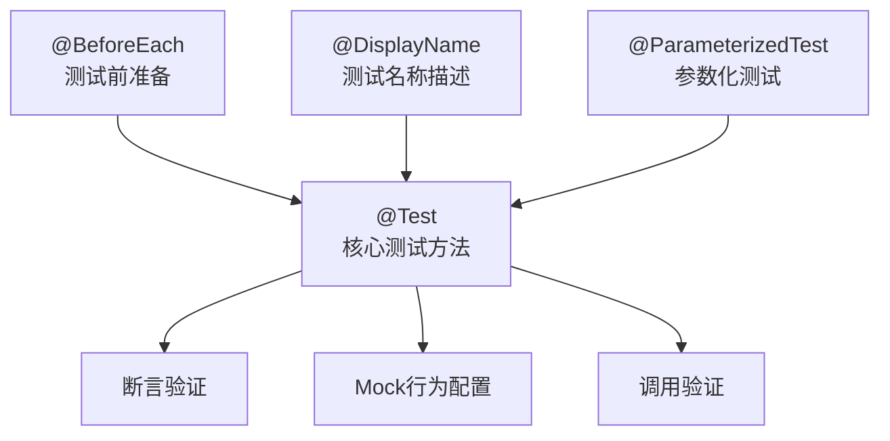

**图表来源**
- [OrderServiceTest.java](file://src/test/java/com/example/demo/service/OrderServiceTest.java#L32-L37)

### 测试方法模板

#### 标准测试方法结构

每个测试方法都遵循以下结构：
1. **准备阶段** (`Arrange`): 准备测试数据和配置Mock
2. **执行阶段** (`Act`): 调用被测试的方法
3. **验证阶段** (`Assert`): 验证结果和副作用
4. **清理阶段** (`Verify`): 验证Mock调用

#### 异常测试模式

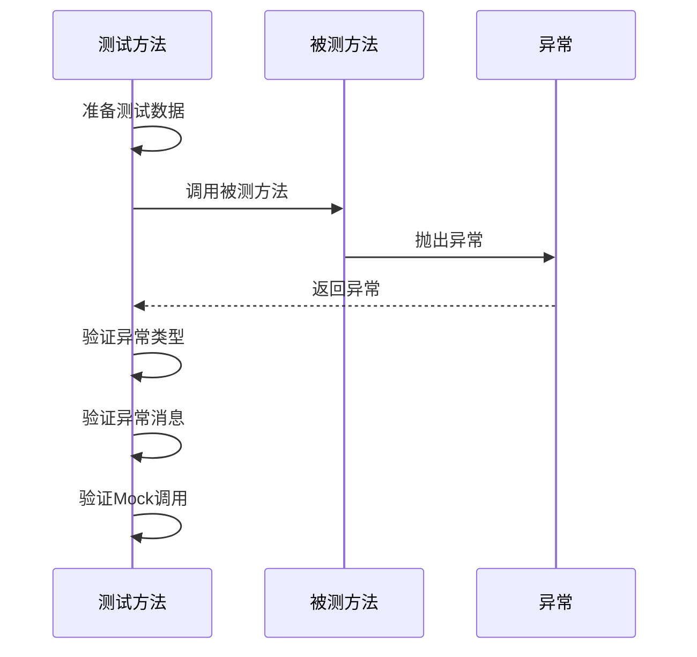

**图表来源**
- [OrderServiceTest.java](file://src/test/java/com/example/demo/service/OrderServiceTest.java#L62-L78)

**章节来源**
- [OrderServiceTest.java](file://src/test/java/com/example/demo/service/OrderServiceTest.java#L38-L284)

## Mockito模拟机制

### Mock对象创建和配置

Mockito框架提供了强大的模拟能力，支持方法调用的精确控制和验证。

#### Mock配置模式

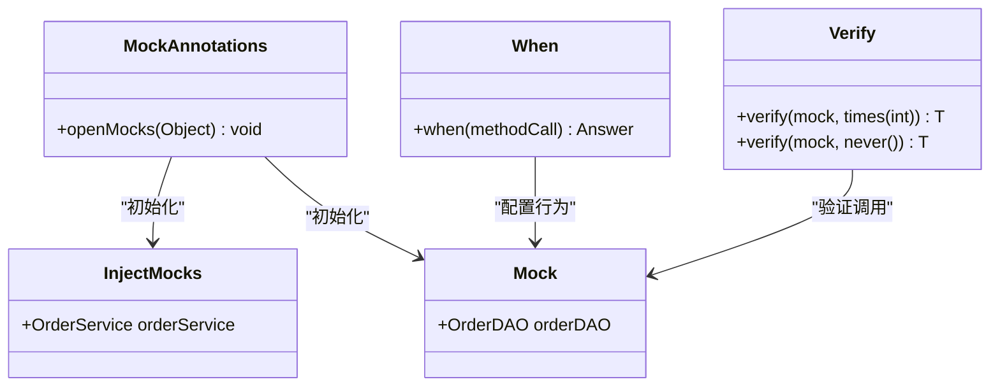

**图表来源**
- [OrderServiceTest.java](file://src/test/java/com/example/demo/service/OrderServiceTest.java#L26-L30)

### Mock行为配置策略

#### 返回值配置

测试中使用多种方式配置Mock对象的行为：
- **固定返回值**: `when(dao.method()).thenReturn(value)`
- **条件返回**: `when(dao.method(arg)).thenReturn(value)`
- **异常抛出**: `when(dao.method()).thenThrow(exception)`

#### 调用验证模式

```mermaid
flowchart LR
Call[方法调用] --> Verify[验证调用]
Verify --> Times[times(n) - 调用次数]
Verify --> Never[never() - 未调用]
Verify --> AtLeast[atLeast(n) - 至少n次]
Verify --> AtMost[atMost(n) - 最多n次]
```

**图表来源**
- [OrderServiceTest.java](file://src/test/java/com/example/demo/service/OrderServiceTest.java#L55-L56)

**章节来源**
- [OrderServiceTest.java](file://src/test/java/com/example/demo/service/OrderServiceTest.java#L18-L284)

## 测试用例设计模式

### AAA模式（Arrange-Act-Assert）

所有测试方法都严格遵循AAA模式，确保测试的可读性和一致性。

#### 标准AAA实现

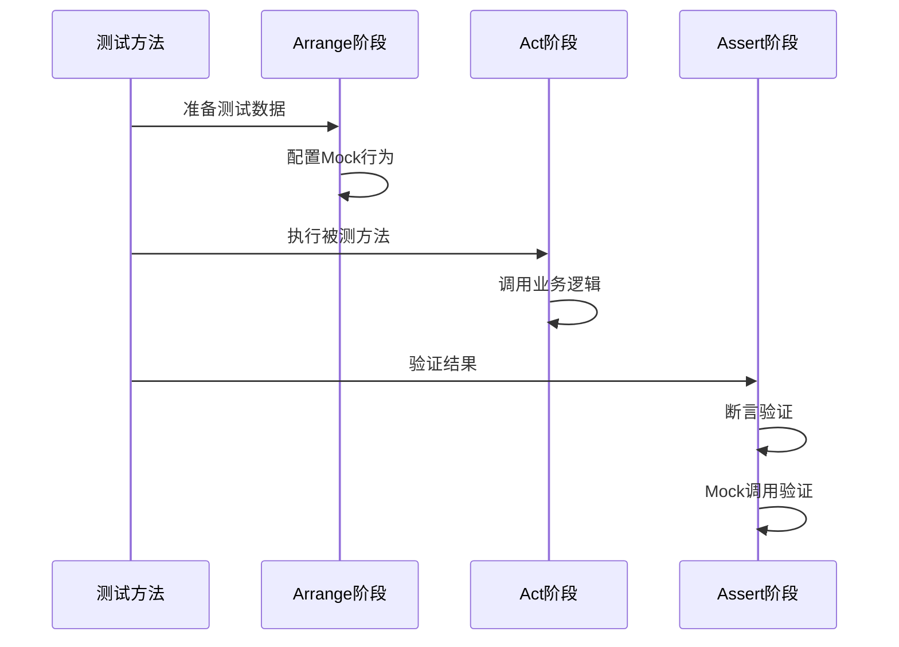

**图表来源**
- [AIOrderServiceTest.java](file://src/test/java/com/example/demo/service/ai_test/AIOrderServiceTest.java#L45-L56)

### 边界条件测试

#### 输入验证测试

测试涵盖了各种边界条件：
- **空值验证**: `null`、空字符串、空白字符串
- **数值边界**: 零值、负数、最大最小值
- **类型验证**: 不同数据类型的正确处理

#### 异常场景测试

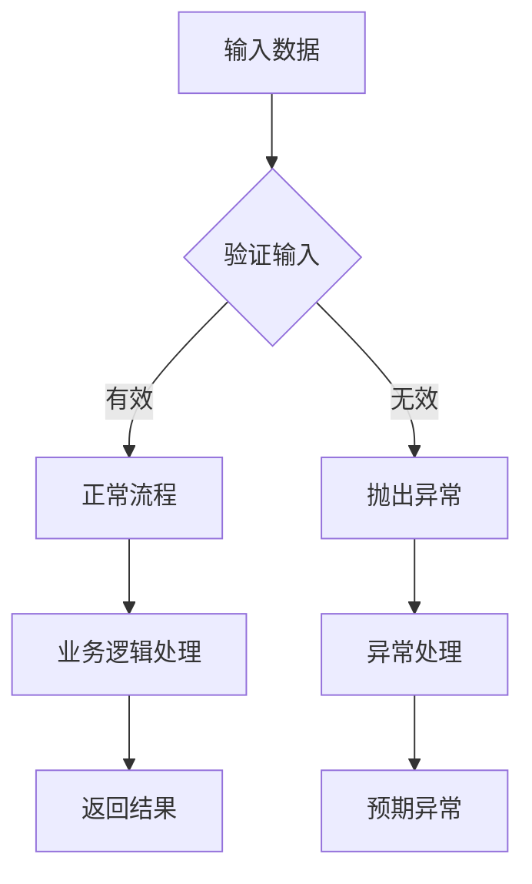

**图表来源**
- [OrderServiceTest.java](file://src/test/java/com/example/demo/service/OrderServiceTest.java#L62-L78)

**章节来源**
- [OrderServiceTest.java](file://src/test/java/com/example/demo/service/OrderServiceTest.java#L62-L203)

## AI扩展测试体系

### AI测试方法论

AIOrderServiceTest展示了AI辅助测试的先进理念，提供了更系统化的测试设计。

#### 测试用例编号系统

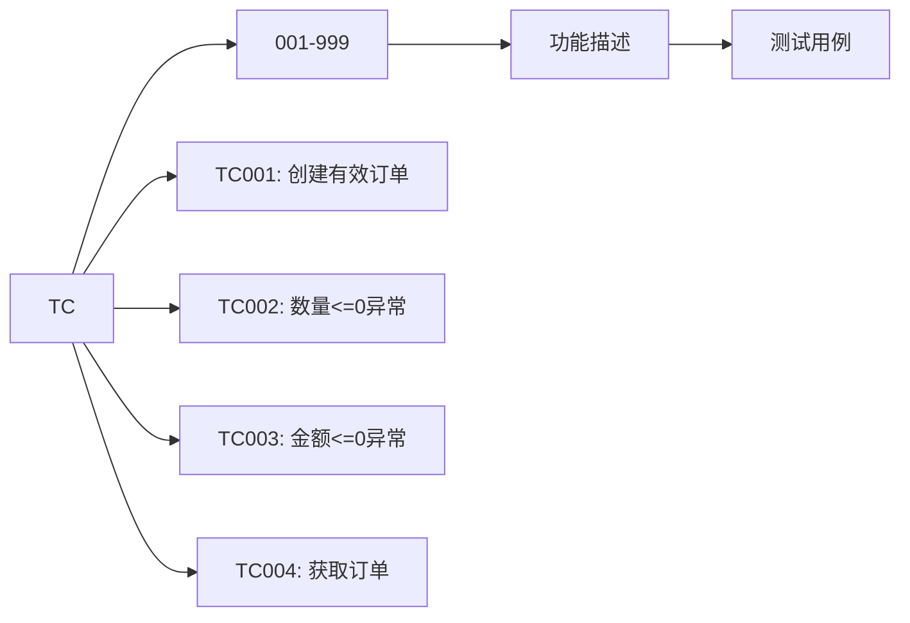

**图表来源**
- [AIOrderServiceTest.java](file://src/test/java/com/example/demo/service/ai_test/AIOrderServiceTest.java#L42-L44)

### 扩展功能测试

#### 订单状态管理测试

AI测试版本增加了对订单状态的详细测试：
- **状态不可逆性**: 已完成订单不能修改
- **删除限制**: 已支付订单不能删除
- **状态流转**: 合理的状态转换验证

#### 新增查询功能测试

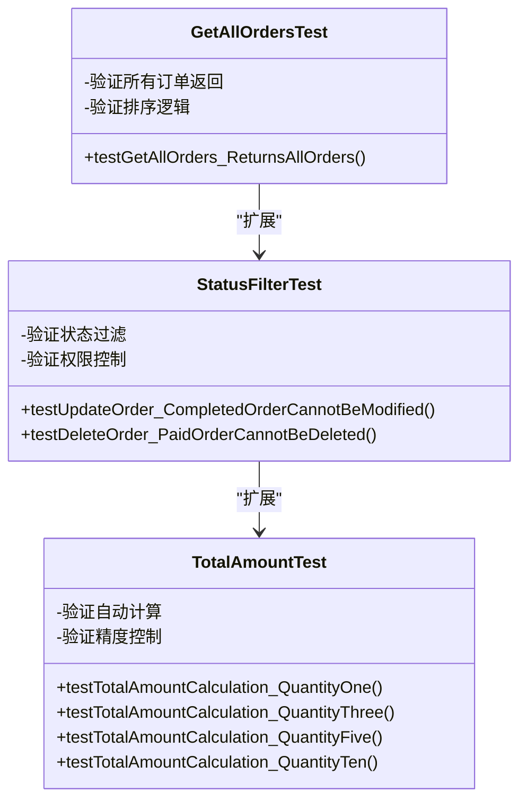

**图表来源**
- [AIOrderServiceTest.java](file://src/test/java/com/example/demo/service/ai_test/AIOrderServiceTest.java#L335-L447)

**章节来源**
- [AIOrderServiceTest.java](file://src/test/java/com/example/demo/service/ai_test/AIOrderServiceTest.java#L1-L447)

## 测试覆盖率分析

### 执行结果统计

根据测试报告分析，项目测试覆盖率表现优异：

#### 标准测试覆盖率
- **测试套件**: OrderServiceTest
- **测试用例**: 12个
- **执行时间**: ~0.366秒
- **通过率**: 100%

#### AI增强测试覆盖率
- **测试套件**: AIOrderServiceTest  
- **测试用例**: 18个
- **执行时间**: ~0.044秒
- **通过率**: 100%

### 覆盖范围评估

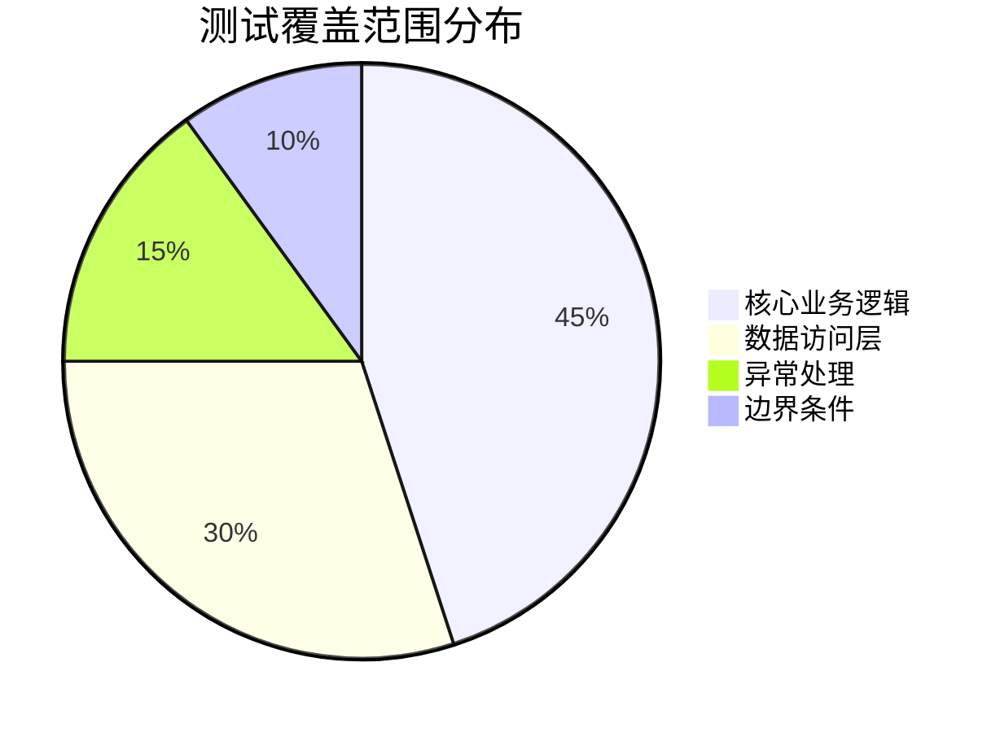

**图表来源**
- [TEST-com.example.demo.service.OrderServiceTest.xml](file://target/surefire-reports/TEST-com.example.demo.service.OrderServiceTest.xml#L1-L82)
- [TEST-com.example.demo.service.ai_test.AIOrderServiceTest.xml](file://target/surefire-reports/TEST-com.example.demo.service.ai_test.AIOrderServiceTest.xml#L1-L88)

**章节来源**
- [TEST-com.example.demo.service.OrderServiceTest.xml](file://target/surefire-reports/TEST-com.example.demo.service.OrderServiceTest.xml#L1-L82)
- [TEST-com.example.demo.service.ai_test.AIOrderServiceTest.xml](file://target/surefire-reports/TEST-com.example.demo.service.ai_test.AIOrderServiceTest.xml#L1-L88)

## 最佳实践建议

### 测试设计原则

#### 1. 单一职责原则
每个测试方法只验证一个特定的功能点，确保测试的专注性和可维护性。

#### 2. 独立性原则
测试之间相互独立，不依赖其他测试的执行结果。

#### 3. 可重复性原则
测试结果应该在任何环境下都能保持一致。

### 代码质量提升

#### 1. 提高测试可读性
- 使用有意义的测试方法名称
- 遵循AAA模式
- 添加适当的注释

#### 2. 优化测试性能
- 合理使用Mock减少外部依赖
- 避免不必要的测试数据准备
- 并行执行独立测试

#### 3. 增强测试维护性
- 使用常量定义测试数据
- 抽象重复的测试逻辑
- 定期重构测试代码

### AI测试扩展建议

#### 1. 自动化测试生成
利用AI技术自动生成基础测试用例，提高测试效率。

#### 2. 智能测试优化
AI可以分析测试执行历史，识别薄弱环节并生成针对性测试。

#### 3. 测试智能维护
自动检测代码变更对现有测试的影响，及时调整测试策略。

## 总结

本项目展示了现代Java应用单元测试的完整实现方案，通过标准单元测试和AI增强测试的结合，实现了高质量的代码验证。

### 核心优势

1. **完整的测试覆盖**: 涵盖业务逻辑、数据访问、异常处理等各个方面
2. **先进的测试方法**: AI辅助测试提供了更系统化的测试设计
3. **优秀的代码质量**: 通过严格的测试保证了代码的可靠性和可维护性
4. **高效的开发流程**: 快速反馈机制支持持续集成和重构

### 发展方向

1. **AI测试深化**: 进一步探索AI在测试自动化中的应用
2. **测试工具集成**: 整合更多测试工具和框架
3. **性能测试扩展**: 增加压力测试和性能测试
4. **持续改进**: 基于测试结果持续优化代码质量

这种测试体系不仅保证了当前功能的正确性，更为未来的功能扩展和重构提供了坚实的基础，体现了现代软件开发中质量优先的理念。