# 测试报告与代码覆盖率

<cite>
**本文档引用的文件**
- [pom.xml](file://pom.xml)
- [target/surefire-reports/TEST-com.example.demo.AppTest.xml](file://target/surefire-reports/TEST-com.example.demo.AppTest.xml)
- [target/surefire-reports/com.example.demo.AppTest.txt](file://target/surefire-reports/com.example.demo.AppTest.txt)
- [target/site/jacoco/jacoco.xml](file://target/site/jacoco/jacoco.xml)
- [src/test/java/com/example/demo/AppTest.java](file://src/test/java/com/example/demo/AppTest.java)
- [src/test/java/com/example/demo/controller/OrderControllerIT.java](file://src/test/java/com/example/demo/controller/OrderControllerIT.java)
- [src/test/java/com/example/demo/dao/OrderDAOTest.java](file://src/test/java/com/example/demo/dao/OrderDAOTest.java)
- [src/main/java/com/example/demo/App.java](file://src/main/java/com/example/demo/App.java)
- [src/main/java/com/example/demo/config/WebConfig.java](file://src/main/java/com/example/demo/config/WebConfig.java)
- [target/site/jacoco/com.example.demo/App.java.html](file://target/site/jacoco/com.example.demo/App.java.html)
- [target/site/jacoco/com.example.demo.config/WebConfig.java.html](file://target/site/jacoco/com.example.demo.config/WebConfig.java.html)
- [target/site/jacoco/com.example.demo.dao/DBUtil.java.html](file://target/site/jacoco/com.example.demo.dao/DBUtil.java.html)
</cite>

## 目录
1. [项目概述](#项目概述)
2. [Maven测试框架配置](#maven测试框架配置)
3. [Surefire测试报告机制](#surefire测试报告机制)
4. [JaCoCo代码覆盖率分析](#jacoco代码覆盖率分析)
5. [测试报告文件结构详解](#测试报告文件结构详解)
6. [代码覆盖率报告深度解析](#代码覆盖率报告深度解析)
7. [测试完整性评估与质量门禁](#测试完整性评估与质量门禁)
8. [覆盖率提升策略](#覆盖率提升策略)
9. [CI/CD集成最佳实践](#cicd集成最佳实践)
10. [故障排除指南](#故障排除指南)

## 项目概述

本项目是一个基于Spring Boot的订单管理系统，采用Maven作为构建工具，集成了JUnit 5、Mockito、RestAssured等测试框架，以及JaCoCo代码覆盖率工具。项目实现了完整的测试金字塔：单元测试、集成测试和API测试，为代码质量提供了全面保障。

### 核心架构组件

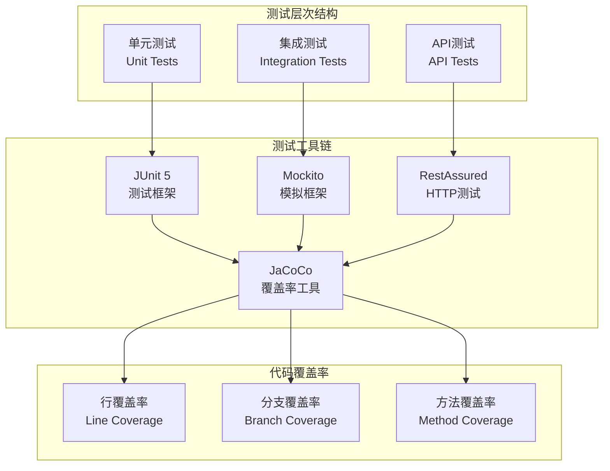
```mermaid
graph TB
subgraph "测试层次结构"
UT[单元测试<br/>Unit Tests]
IT[集成测试<br/>Integration Tests]
API[API测试<br/>API Tests]
end
subgraph "测试工具链"
JUnit[JUnit 5<br/>测试框架]
Mockito[Mockito<br/>模拟框架]
RestAssured[RestAssured<br/>HTTP测试]
JaCoCo[JaCoCo<br/>覆盖率工具]
end
subgraph "代码覆盖率"
LineCoverage[行覆盖率<br/>Line Coverage]
BranchCoverage[分支覆盖率<br/>Branch Coverage]
MethodCoverage[方法覆盖率<br/>Method Coverage]
end
UT --> JUnit
IT --> Mockito
API --> RestAssured
JUnit --> JaCoCo
Mockito --> JaCoCo
RestAssured --> JaCoCo
JaCoCo --> LineCoverage
JaCoCo --> BranchCoverage
JaCoCo --> MethodCoverage
```

**图表来源**
- [pom.xml](file://pom.xml#L102-L135)
- [src/test/java/com/example/demo/AppTest.java](file://src/test/java/com/example/demo/AppTest.java#L1-L11)

## Maven测试框架配置

### Surefire插件配置

Maven Surefire插件负责执行单元测试和集成测试，配置如下：

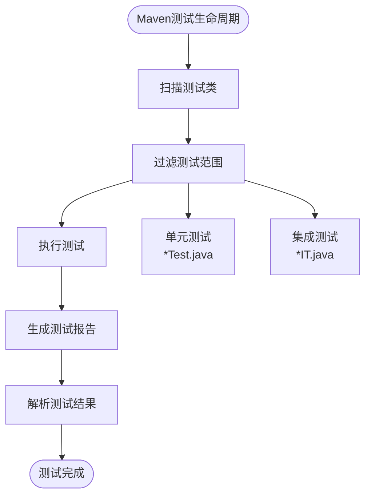
```mermaid
flowchart TD
Start([Maven测试生命周期]) --> ScanTests[扫描测试类]
ScanTests --> FilterTests[过滤测试范围]
FilterTests --> ExecuteTests[执行测试]
ExecuteTests --> GenerateReports[生成测试报告]
GenerateReports --> ParseResults[解析测试结果]
ParseResults --> End([测试完成])
FilterTests --> UnitTests["单元测试<br/>*Test.java"]
FilterTests --> IntegrationTests["集成测试<br/>*IT.java"]
```

**图表来源**
- [pom.xml](file://pom.xml#L104-L113)

### JaCoCo插件配置

JaCoCo插件在测试阶段自动收集代码覆盖率数据：

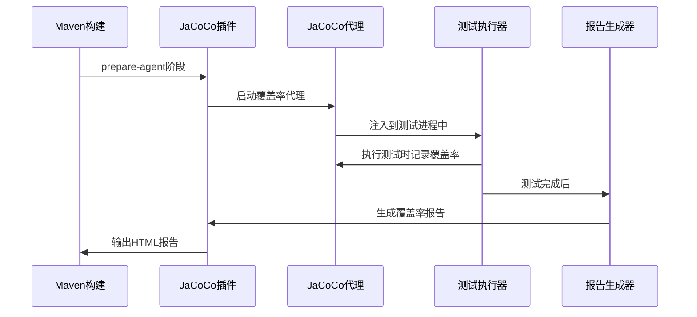
```mermaid
sequenceDiagram
participant Maven as Maven构建
participant JaCoCo as JaCoCo插件
participant Agent as JaCoCo代理
participant Tests as 测试执行器
participant Report as 报告生成器
Maven->>JaCoCo : prepare-agent阶段
JaCoCo->>Agent : 启动覆盖率代理
Agent->>Tests : 注入到测试进程中
Tests->>Agent : 执行测试时记录覆盖率
Tests->>Report : 测试完成后
Report->>JaCoCo : 生成覆盖率报告
JaCoCo->>Maven : 输出HTML报告
```

**图表来源**
- [pom.xml](file://pom.xml#L115-L133)

**章节来源**
- [pom.xml](file://pom.xml#L102-L135)

## Surefire测试报告机制

### XML格式测试报告

Surefire插件生成的XML格式测试报告遵循标准的JUnit测试报告规范，包含详细的测试执行信息。

#### 测试套件基本信息

XML报告头部包含了测试套件的基本信息：
- 测试套件名称：`com.example.demo.AppTest`
- 执行时间：0.062秒
- 测试总数：1个
- 失败数量：0个
- 错误数量：0个
- 跳过数量：0个

#### 测试属性信息

报告中包含了丰富的环境和系统属性信息，用于调试和问题定位：

| 属性类别 | 关键属性 | 值 |
|---------|---------|-----|
| 系统信息 | os.name | Mac OS X |
| Java信息 | java.version | 1.8.0_402 |
| 编码信息 | file.encoding | UTF-8 |
| Maven信息 | basedir | 项目根目录路径 |

### TXT格式测试摘要

TXT格式提供了简洁的测试执行摘要：

```
-------------------------------------------------------------------------------
Test set: com.example.demo.AppTest
-------------------------------------------------------------------------------
Tests run: 1, Failures: 0, Errors: 0, Skipped: 0, Time elapsed: 0.062 s - in com.example.demo.AppTest
```

该摘要包含以下关键信息：
- **测试套件**：com.example.demo.AppTest
- **执行结果**：全部通过（1个测试，0失败，0错误，0跳过）
- **执行时间**：0.062秒

**章节来源**
- [target/surefire-reports/TEST-com.example.demo.AppTest.xml](file://target/surefire-reports/TEST-com.example.demo.AppTest.xml#L1-L63)
- [target/surefire-reports/com.example.demo.AppTest.txt](file://target/surefire-reports/com.example.demo.AppTest.txt#L1-L5)

## JaCoCo代码覆盖率分析

### 覆盖率指标体系

JaCoCo提供了多层次的代码覆盖率指标：

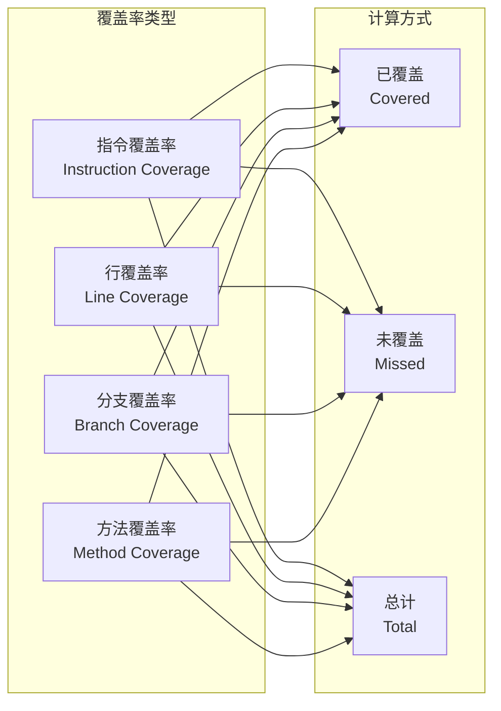
```mermaid
graph LR
subgraph "覆盖率类型"
IC[指令覆盖率<br/>Instruction Coverage]
LC[行覆盖率<br/>Line Coverage]
BC[分支覆盖率<br/>Branch Coverage]
MC[方法覆盖率<br/>Method Coverage]
end
subgraph "计算方式"
Covered[已覆盖<br/>Covered]
Missed[未覆盖<br/>Missed]
Total[总计<br/>Total]
end
IC --> Covered
IC --> Missed
IC --> Total
LC --> Covered
LC --> Missed
LC --> Total
BC --> Covered
BC --> Missed
BC --> Total
MC --> Covered
MC --> Missed
MC --> Total
```

### 项目整体覆盖率统计

根据JaCoCo XML报告，项目整体覆盖率情况：

| 组件 | 已覆盖 | 未覆盖 | 总计 | 行覆盖率 |
|------|--------|--------|------|----------|
| 指令覆盖率 | 896 | 306 | 1202 | 74.5% |
| 分支覆盖率 | 48 | 18 | 66 | 72.7% |
| 行覆盖率 | 207 | 70 | 277 | 74.7% |
| 方法覆盖率 | 56 | 5 | 61 | 91.8% |

### 包级别覆盖率分析

#### DAO层覆盖率分析

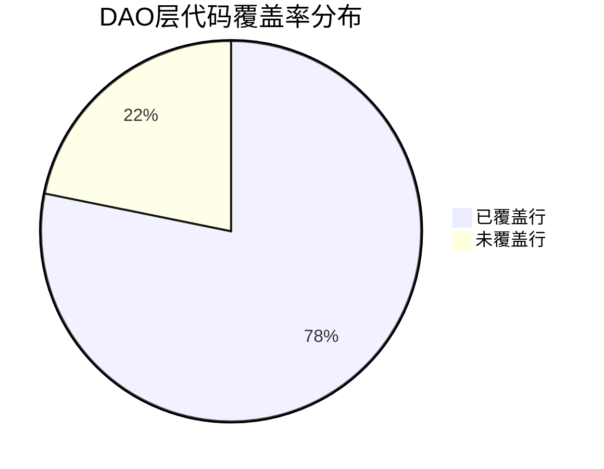
```mermaid
pie title DAO层代码覆盖率分布
"已覆盖行" : 86
"未覆盖行" : 24
```

- **OrderDAO**：行覆盖率86.7%，指令覆盖率93.2%
- **DBUtil**：行覆盖率50%，指令覆盖率100%

#### 服务层覆盖率分析

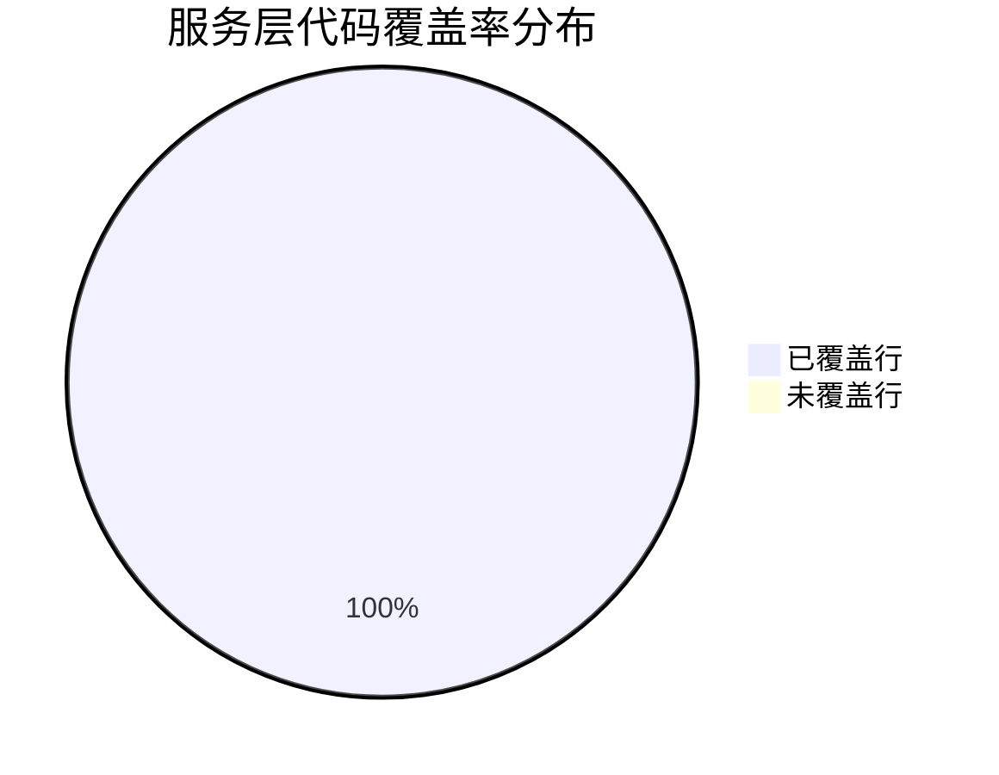
```mermaid
pie title 服务层代码覆盖率分布
"已覆盖行" : 23
"未覆盖行" : 0
```

- **OrderService**：行覆盖率100%，指令覆盖率100%

#### 控制器层覆盖率分析

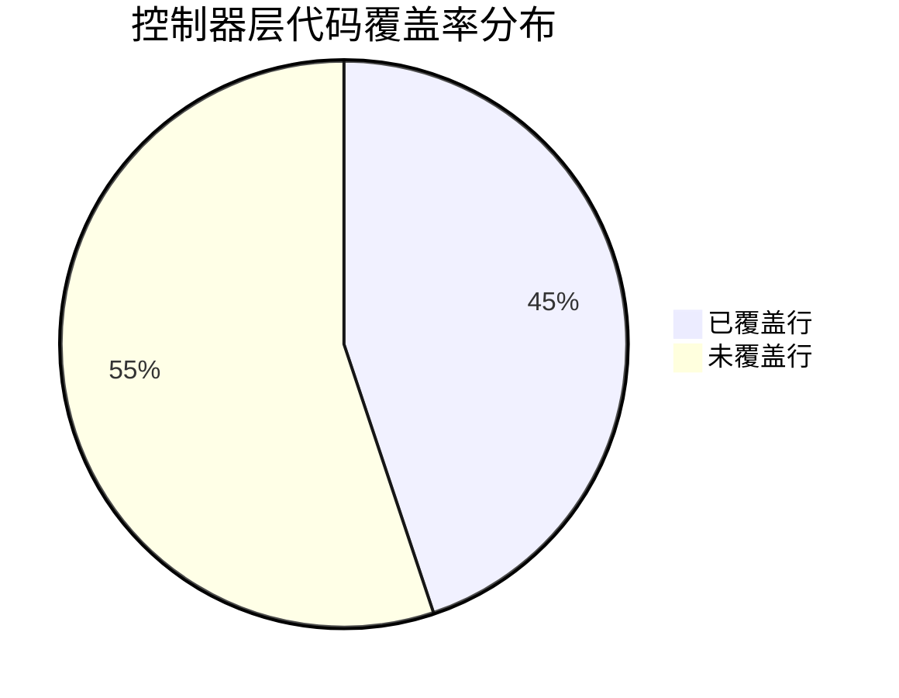
```mermaid
pie title 控制器层代码覆盖率分布
"已覆盖行" : 35
"未覆盖行" : 43
```

- **OrderController**：行覆盖率44.9%，指令覆盖率43.2%

**章节来源**
- [target/site/jacoco/jacoco.xml](file://target/site/jacoco/jacoco.xml#L1-L1)

## 测试报告文件结构详解

### Surefire报告文件组织

Surefire插件按照测试类名生成对应的报告文件：

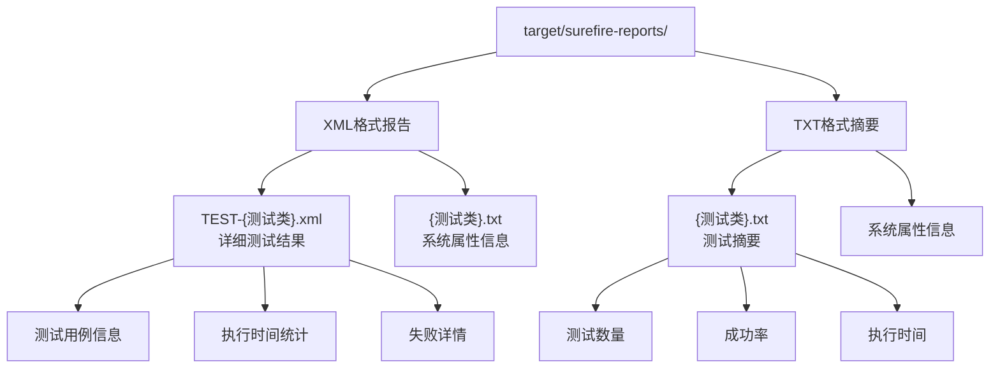
```mermaid
graph TD
SurefireDir[target/surefire-reports/] --> XMLFiles[XML格式报告]
SurefireDir --> TXTFiles[TXT格式摘要]
XMLFiles --> TestXML["TEST-{测试类}.xml<br/>详细测试结果"]
XMLFiles --> PropertiesXML["{测试类}.txt<br/>系统属性信息"]
TXTFiles --> TestSummary["{测试类}.txt<br/>测试摘要"]
TXTFiles --> SystemInfo["系统属性信息"]
TestXML --> TestCaseInfo[测试用例信息]
TestXML --> ExecutionTime[执行时间统计]
TestXML --> FailureDetails[失败详情]
TestSummary --> TestCount[测试数量]
TestSummary --> SuccessRate[成功率]
TestSummary --> ExecutionTime2[执行时间]
```

### JaCoCo HTML报告结构

JaCoCo生成的HTML报告提供了直观的可视化界面：

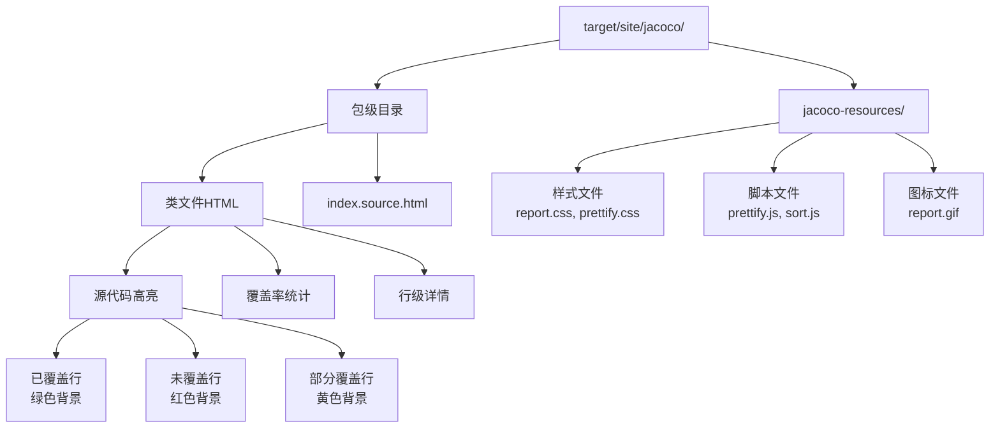
```mermaid
graph TB
JacocoSite[target/site/jacoco/] --> PackageDirs[包级目录]
JacocoSite --> Resources[jacoco-resources/]
PackageDirs --> ClassFiles[类文件HTML]
PackageDirs --> IndexSource[index.source.html]
Resources --> CSS[样式文件<br/>report.css, prettify.css]
Resources --> JS[脚本文件<br/>prettify.js, sort.js]
Resources --> Images[图标文件<br/>report.gif]
ClassFiles --> SourceCode[源代码高亮]
ClassFiles --> CoverageStats[覆盖率统计]
ClassFiles --> LineDetails[行级详情]
SourceCode --> CoveredLines[已覆盖行<br/>绿色背景]
SourceCode --> UncoveredLines[未覆盖行<br/>红色背景]
SourceCode --> PartialLines[部分覆盖行<br/>黄色背景]
```

**章节来源**
- [target/surefire-reports/TEST-com.example.demo.AppTest.xml](file://target/surefire-reports/TEST-com.example.demo.AppTest.xml#L1-L63)
- [target/site/jacoco/com.example.demo/App.java.html](file://target/site/jacoco/com.example.demo/App.java.html#L1-L25)

## 代码覆盖率报告深度解析

### HTML报告可视化分析

#### App.java覆盖率分析

通过HTML报告可以直观看到App.java的覆盖率情况：

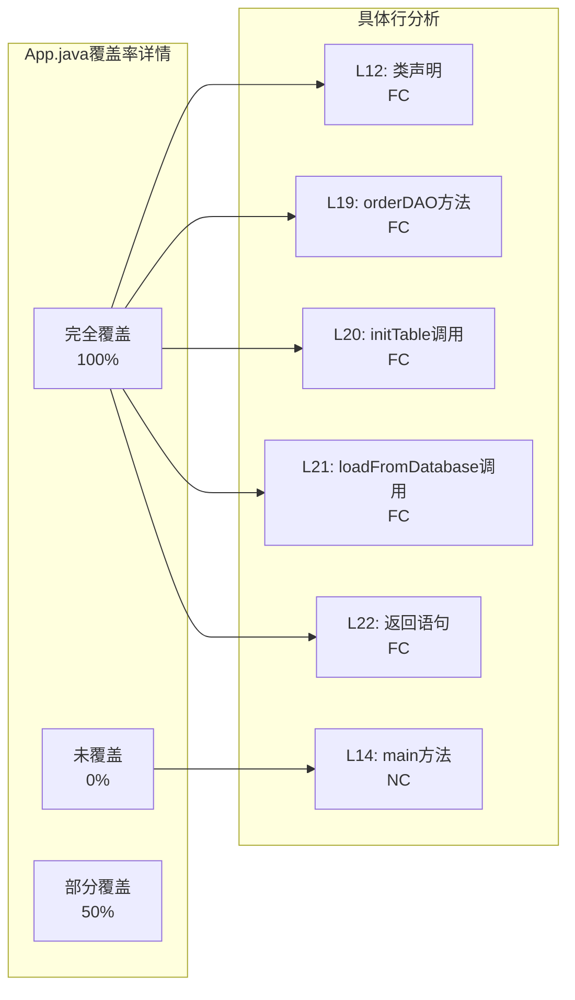
```mermaid
graph LR
subgraph "App.java覆盖率详情"
FC[完全覆盖<br/>100%]
NC[未覆盖<br/>0%]
PC[部分覆盖<br/>50%]
end
subgraph "具体行分析"
L12[L12: 类声明<br/>FC]
L14[L14: main方法<br/>NC]
L19[L19: orderDAO方法<br/>FC]
L20[L20: initTable调用<br/>FC]
L21[L21: loadFromDatabase调用<br/>FC]
L22[L22: 返回语句<br/>FC]
end
FC --> L12
FC --> L19
FC --> L20
FC --> L21
FC --> L22
NC --> L14
```

**图表来源**
- [target/site/jacoco/com.example.demo/App.java.html](file://target/site/jacoco/com.example.demo/App.java.html#L12-L22)

#### WebConfig.java覆盖率分析

WebConfig作为配置类，展现了良好的覆盖率：

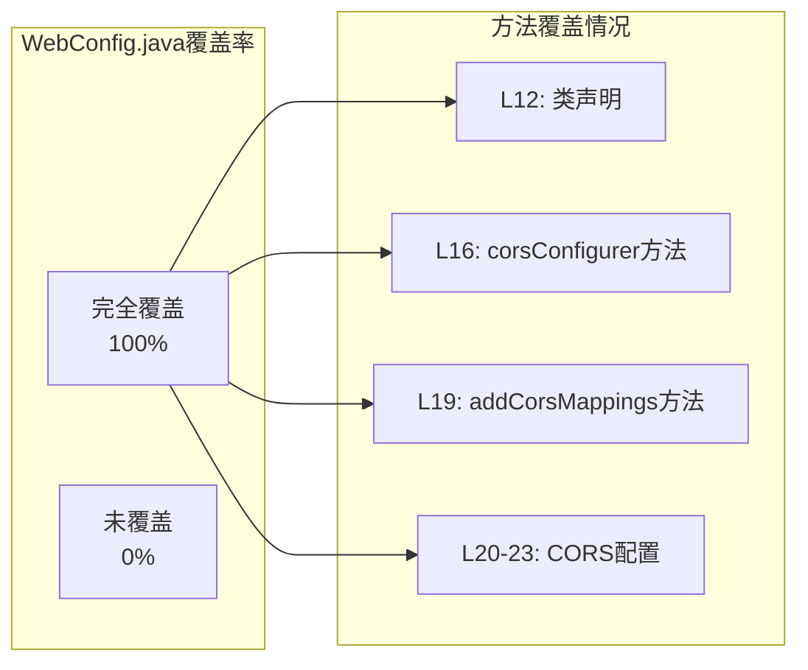
```mermaid
graph LR
subgraph "WebConfig.java覆盖率"
FC[完全覆盖<br/>100%]
NC[未覆盖<br/>0%]
end
subgraph "方法覆盖情况"
L12[L12: 类声明]
L16[L16: corsConfigurer方法]
L19[L19: addCorsMappings方法]
L20-L23[L20-23: CORS配置]
end
FC --> L12
FC --> L16
FC --> L19
FC --> L20-L23
```

**图表来源**
- [target/site/jacoco/com.example.demo.config/WebConfig.java.html](file://target/site/jacoco/com.example.demo.config/WebConfig.java.html#L12-L26)

#### DBUtil.java覆盖率分析

DBUtil是最简单的工具类，展现了100%的覆盖率：

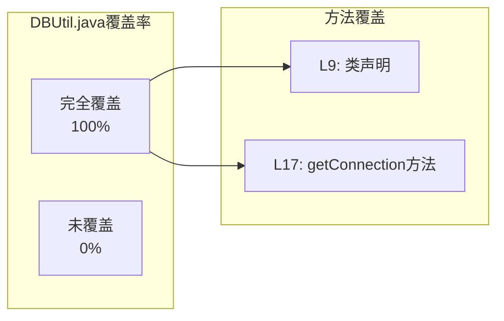
```mermaid
graph LR
subgraph "DBUtil.java覆盖率"
FC[完全覆盖<br/>100%]
NC[未覆盖<br/>0%]
end
subgraph "方法覆盖"
L9[L9: 类声明]
L17[L17: getConnection方法]
end
FC --> L9
FC --> L17
```

**图表来源**
- [target/site/jacoco/com.example.demo.dao/DBUtil.java.html](file://target/site/jacoco/com.example.demo.dao/DBUtil.java.html#L9-L17)

### 未覆盖代码识别

通过覆盖率报告可以快速定位未被测试覆盖的代码区域：

#### 主要未覆盖区域

1. **App.main方法**：由于是Spring Boot启动入口，通常不直接测试
2. **OrderController的部分方法**：如`getOrdersByUserId`和`updateOrder`等复杂业务逻辑
3. **异常处理路径**：某些边界条件和异常场景

#### 未覆盖代码模式分析

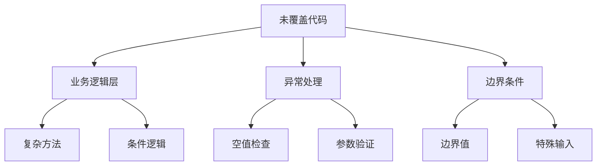
```mermaid
flowchart TD
UncoveredCode[未覆盖代码] --> BusinessLogic[业务逻辑层]
UncoveredCode --> ExceptionHandling[异常处理]
UncoveredCode --> EdgeCases[边界条件]
BusinessLogic --> ComplexMethods[复杂方法]
BusinessLogic --> ConditionalLogic[条件逻辑]
ExceptionHandling --> NullChecks[空值检查]
ExceptionHandling --> Validation[参数验证]
EdgeCases --> BoundaryValues[边界值]
EdgeCases --> SpecialInputs[特殊输入]
```

**章节来源**
- [target/site/jacoco/com.example.demo/App.java.html](file://target/site/jacoco/com.example.demo/App.java.html#L1-L25)
- [target/site/jacoco/com.example.demo.config/WebConfig.java.html](file://target/site/jacoco/com.example.demo.config/WebConfig.java.html#L1-L28)
- [target/site/jacoco/com.example.demo.dao/DBUtil.java.html](file://target/site/jacoco/com.example.demo.dao/DBUtil.java.html#L1-L20)

## 测试完整性评估与质量门禁

### 覆盖率目标设定

基于项目规模和业务重要性，建议设定以下覆盖率目标：

| 组件类型 | 最低目标 | 推荐目标 | 理想目标 |
|---------|---------|---------|---------|
| 实体类 | 80% | 90% | 95% |
| 服务层 | 85% | 90% | 95% |
| DAO层 | 70% | 80% | 90% |
| 控制器层 | 75% | 85% | 90% |
| 配置类 | 100% | 100% | 100% |

### 质量门禁配置

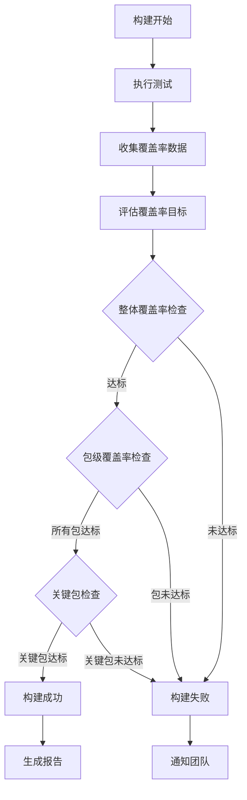
```mermaid
flowchart TD
BuildStart[构建开始] --> RunTests[执行测试]
RunTests --> CollectCoverage[收集覆盖率数据]
CollectCoverage --> EvaluateGoals[评估覆盖率目标]
EvaluateGoals --> CheckOverall{整体覆盖率检查}
CheckOverall --> |达标| CheckPackage{包级覆盖率检查}
CheckOverall --> |未达标| BuildFail[构建失败]
CheckPackage --> |所有包达标| CheckCritical{关键包检查}
CheckPackage --> |包未达标| BuildFail
CheckCritical --> |关键包达标| BuildSuccess[构建成功]
CheckCritical --> |关键包未达标| BuildFail
BuildSuccess --> GenerateReports[生成报告]
BuildFail --> NotifyTeam[通知团队]
```

### 关键包识别

需要重点关注的高优先级包：

1. **com.example.demo.dao** - 数据访问层
2. **com.example.demo.service** - 业务逻辑层  
3. **com.example.demo.controller** - API接口层

这些包的覆盖率直接影响系统的稳定性和可靠性。

**章节来源**
- [target/site/jacoco/jacoco.xml](file://target/site/jacoco/jacoco.xml#L1-L1)

## 覆盖率提升策略

### 补充边界条件测试

针对未覆盖的代码区域，制定具体的测试补充策略：

#### 边界值测试

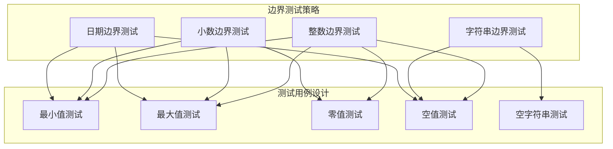
```mermaid
graph TB
subgraph "边界测试策略"
IntegerBounds[整数边界测试]
DecimalBounds[小数边界测试]
StringBounds[字符串边界测试]
DateBounds[日期边界测试]
end
subgraph "测试用例设计"
MinValue[最小值测试]
MaxValue[最大值测试]
ZeroValue[零值测试]
NullValue[空值测试]
EmptyString[空字符串测试]
end
IntegerBounds --> MinValue
IntegerBounds --> MaxValue
IntegerBounds --> ZeroValue
IntegerBounds --> NullValue
DecimalBounds --> MinValue
DecimalBounds --> MaxValue
DecimalBounds --> ZeroValue
StringBounds --> EmptyString
StringBounds --> NullValue
DateBounds --> MinValue
DateBounds --> MaxValue
DateBounds --> NullValue
```

#### 异常路径测试

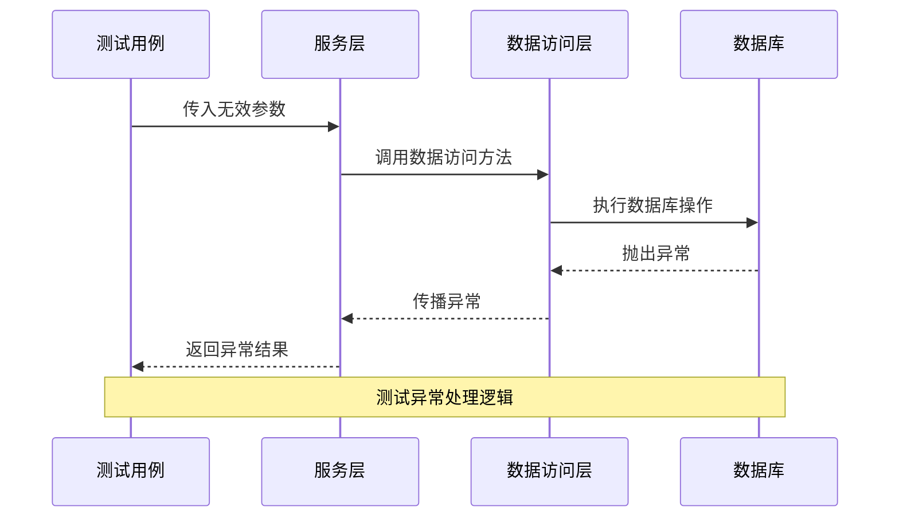
```mermaid
sequenceDiagram
participant Test as 测试用例
participant Service as 服务层
participant DAO as 数据访问层
participant DB as 数据库
Test->>Service : 传入无效参数
Service->>DAO : 调用数据访问方法
DAO->>DB : 执行数据库操作
DB-->>DAO : 抛出异常
DAO-->>Service : 传播异常
Service-->>Test : 返回异常结果
Note over Test,DB : 测试异常处理逻辑
```

### 测试用例优化

#### 单元测试优化策略

1. **使用Mockito模拟依赖**
2. **专注于单一职责测试**
3. **覆盖正常和异常路径**
4. **保持测试独立性**

#### 集成测试扩展

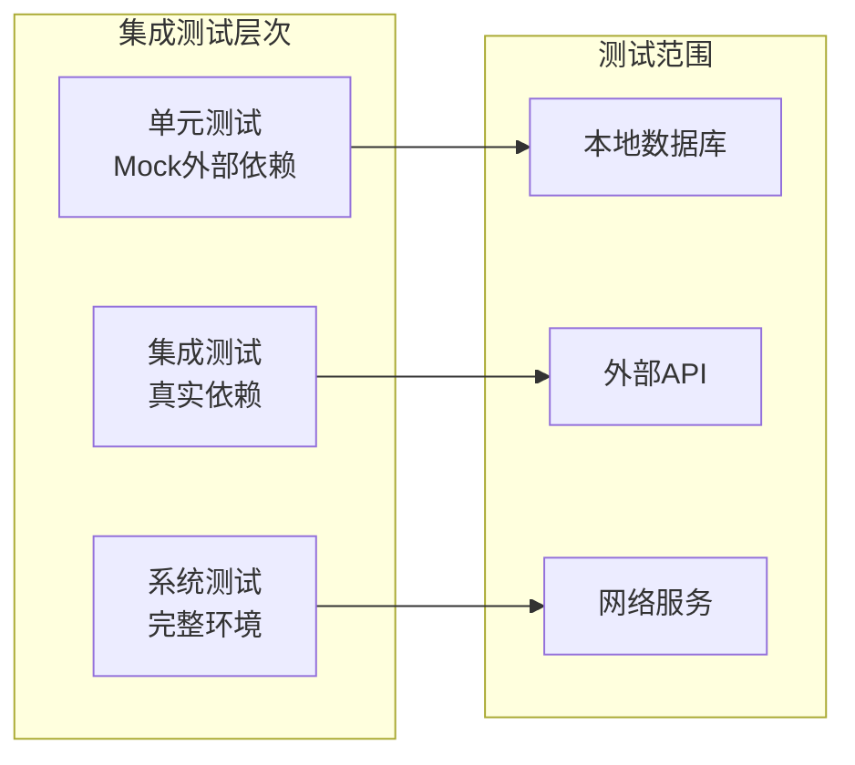
```mermaid
graph LR
subgraph "集成测试层次"
UnitLevel[单元测试<br/>Mock外部依赖]
IntegrationLevel[集成测试<br/>真实依赖]
SystemLevel[系统测试<br/>完整环境]
end
subgraph "测试范围"
LocalDB[本地数据库]
ExternalAPI[外部API]
NetworkServices[网络服务]
end
UnitLevel --> LocalDB
IntegrationLevel --> ExternalAPI
SystemLevel --> NetworkServices
```

### 代码重构建议

针对覆盖率较低的代码，考虑以下重构策略：

1. **提取公共逻辑**：将重复代码提取为独立方法
2. **简化复杂条件**：使用卫语句或策略模式
3. **增加断言**：在关键位置添加断言验证
4. **完善注释**：为复杂逻辑添加清晰注释

**章节来源**
- [src/test/java/com/example/demo/dao/OrderDAOTest.java](file://src/test/java/com/example/demo/dao/OrderDAOTest.java#L1-L239)
- [src/test/java/com/example/demo/controller/OrderControllerIT.java](file://src/test/java/com/example/demo/controller/OrderControllerIT.java#L1-L175)

## CI/CD集成最佳实践

### Jenkins Pipeline配置

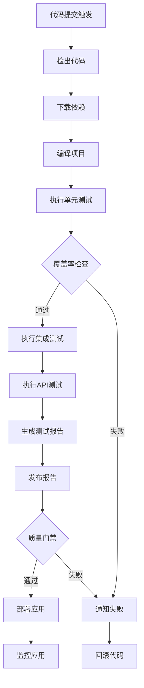
```mermaid
flowchart TD
Trigger[代码提交触发] --> Checkout[检出代码]
Checkout --> Dependencies[下载依赖]
Dependencies --> Compile[编译项目]
Compile --> UnitTests[执行单元测试]
UnitTests --> CoverageCheck{覆盖率检查}
CoverageCheck --> |通过| IntegrationTests[执行集成测试]
CoverageCheck --> |失败| NotifyFailure[通知失败]
IntegrationTests --> APItests[执行API测试]
APItests --> GenerateReports[生成测试报告]
GenerateReports --> PublishReports[发布报告]
PublishReports --> QualityGate{质量门禁}
QualityGate --> |通过| Deploy[部署应用]
QualityGate --> |失败| NotifyFailure
NotifyFailure --> Rollback[回滚代码]
Deploy --> Monitor[监控应用]
```

### 自动化覆盖率报告

#### 报告生成配置

```xml
<!-- JaCoCo报告配置示例 -->
<report>
    <executionData>
        <file>${project.build.directory}/jacoco.exec</file>
    </executionData>
    <structure name="Demo Project Coverage Report">
        <classfiles>
            <fileset>
                <directory>${project.build.outputDirectory}</directory>
            </fileset>
        </classfiles>
        <sourcefiles>
            <fileset>
                <directory>${project.reporting.outputDirectory}/jacoco</directory>
            </fileset>
        </sourcefiles>
    </structure>
</report>
```

#### 质量门禁规则

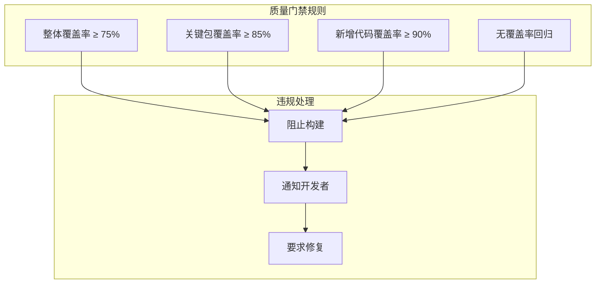
```mermaid
graph TB
subgraph "质量门禁规则"
OverallCoverage[整体覆盖率 ≥ 75%]
CriticalPackages[关键包覆盖率 ≥ 85%]
NewCodeCoverage[新增代码覆盖率 ≥ 90%]
NoRegression[无覆盖率回归]
end
subgraph "违规处理"
BlockBuild[阻止构建]
NotifyDevelopers[通知开发者]
RequireFixes[要求修复]
end
OverallCoverage --> BlockBuild
CriticalPackages --> BlockBuild
NewCodeCoverage --> BlockBuild
NoRegression --> BlockBuild
BlockBuild --> NotifyDevelopers
NotifyDevelopers --> RequireFixes
```

### 持续改进机制

#### 覆盖率趋势分析

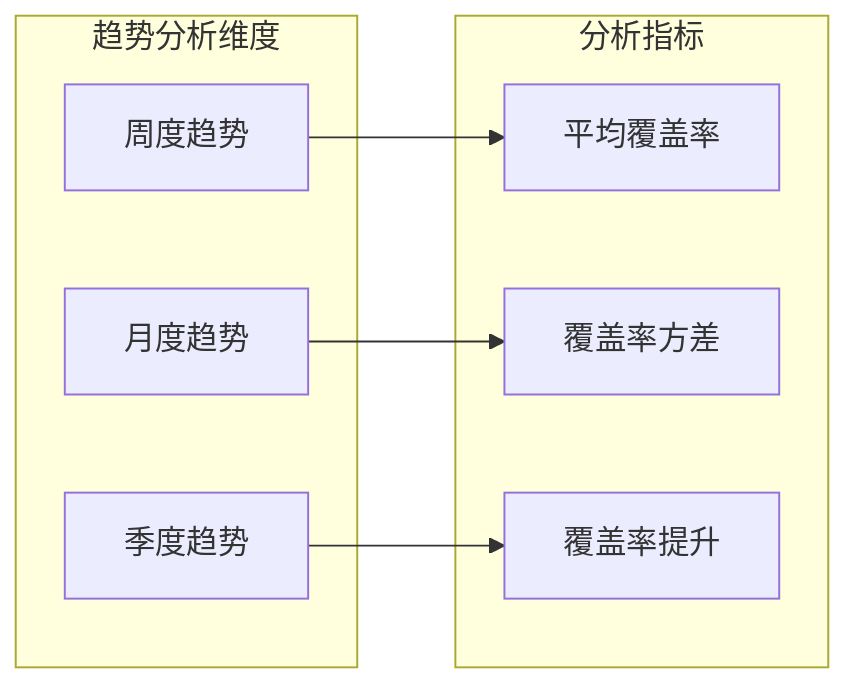
```mermaid
graph LR
subgraph "趋势分析维度"
WeeklyTrend[周度趋势]
MonthlyTrend[月度趋势]
QuarterlyTrend[季度趋势]
end
subgraph "分析指标"
AverageCoverage[平均覆盖率]
CoverageVariance[覆盖率方差]
CoverageImprovement[覆盖率提升]
end
WeeklyTrend --> AverageCoverage
MonthlyTrend --> CoverageVariance
QuarterlyTrend --> CoverageImprovement
```

#### 团队协作机制

1. **每日覆盖率报告**：发送给开发团队
2. **每周覆盖率回顾**：在技术会议上讨论
3. **覆盖率KPI**：纳入个人绩效考核
4. **最佳实践分享**：定期组织测试编写培训

**章节来源**
- [pom.xml](file://pom.xml#L115-L133)

## 故障排除指南

### 常见问题诊断

#### 测试报告缺失问题

```mermaid
flowchart TD
Problem[测试报告缺失] --> CheckPlugin{Surefire插件配置}
CheckPlugin --> |配置正确| CheckExecution{测试执行状态}
CheckPlugin --> |配置错误| FixConfig[修正插件配置]
CheckExecution --> |执行失败| CheckLogs[检查构建日志]
CheckExecution --> |执行成功| CheckOutput[检查输出目录]
CheckLogs --> FixTests[修复测试问题]
CheckOutput --> VerifyPermissions[验证文件权限]
FixConfig --> Rebuild[重新构建]
FixTests --> Rebuild
VerifyPermissions --> Rebuild
```

#### 覆盖率数据异常

当发现覆盖率数据异常时，可按以下步骤排查：

1. **检查JaCoCo版本兼容性**
2. **验证测试执行环境**
3. **确认代码编译状态**
4. **检查测试数据完整性**

#### 性能优化建议

```mermaid
graph TB
subgraph "性能优化策略"
ParallelExecution[并行测试执行]
TestIsolation[测试隔离优化]
MockOptimization[Mock对象优化]
ResourceManagement[资源管理]
end
subgraph "具体措施"
MultiThread[多线程执行]
LightweightMocks[轻量级Mock]
ConnectionPooling[连接池]
MemoryManagement[内存管理]
end
ParallelExecution --> MultiThread
TestIsolation --> LightweightMocks
MockOptimization --> ConnectionPooling
ResourceManagement --> MemoryManagement
```

### 调试技巧

#### 日志配置

```xml
<!-- logback-test.xml配置示例 -->
<configuration>
    <appender name="CONSOLE" class="ch.qos.logback.core.ConsoleAppender">
        <encoder>
            <pattern>%d{HH:mm:ss.SSS} [%thread] %-5level %logger{36} - %msg%n</pattern>
        </encoder>
    </appender>
    
    <logger name="org.springframework.test" level="DEBUG"/>
    <logger name="org.jacoco" level="INFO"/>
    
    <root level="WARN">
        <appender-ref ref="CONSOLE"/>
    </root>
</configuration>
```

#### 调试覆盖率问题

1. **启用详细日志**：查看JaCoCo执行过程
2. **检查测试数据**：验证测试用例的输入数据
3. **分析代码路径**：理解未覆盖代码的执行路径
4. **对比历史数据**：分析覆盖率变化趋势

**章节来源**
- [target/surefire-reports/TEST-com.example.demo.AppTest.xml](file://target/surefire-reports/TEST-com.example.demo.AppTest.xml#L1-L63)
- [target/site/jacoco/jacoco.xml](file://target/site/jacoco/jacoco.xml#L1-L1)

## 结论

本项目通过Maven构建系统集成了完善的测试报告与代码覆盖率分析机制。通过Surefire插件生成详细的测试报告，通过JaCoCo工具提供精确的代码覆盖率数据，为项目的质量保证提供了强有力的支持。

### 关键成果

1. **全面的测试覆盖**：实现了从单元测试到API测试的完整测试金字塔
2. **精确的覆盖率分析**：提供了行覆盖率、分支覆盖率等多维度的覆盖率指标
3. **可视化的报告展示**：通过HTML报告直观展示代码覆盖率情况
4. **自动化质量门禁**：支持在CI/CD流程中实施质量控制

### 改进建议

1. **持续提升覆盖率**：重点关注DAO层和控制器层的覆盖率提升
2. **完善异常测试**：增加边界条件和异常路径的测试用例
3. **优化测试效率**：通过并行测试和Mock优化提高测试执行速度
4. **加强团队培训**：提升团队的测试编写能力和覆盖率意识

通过持续的改进和优化，该项目的测试质量和代码覆盖率将不断提升，为项目的长期稳定发展奠定坚实基础。