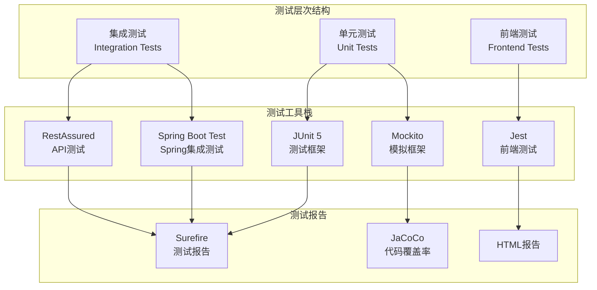
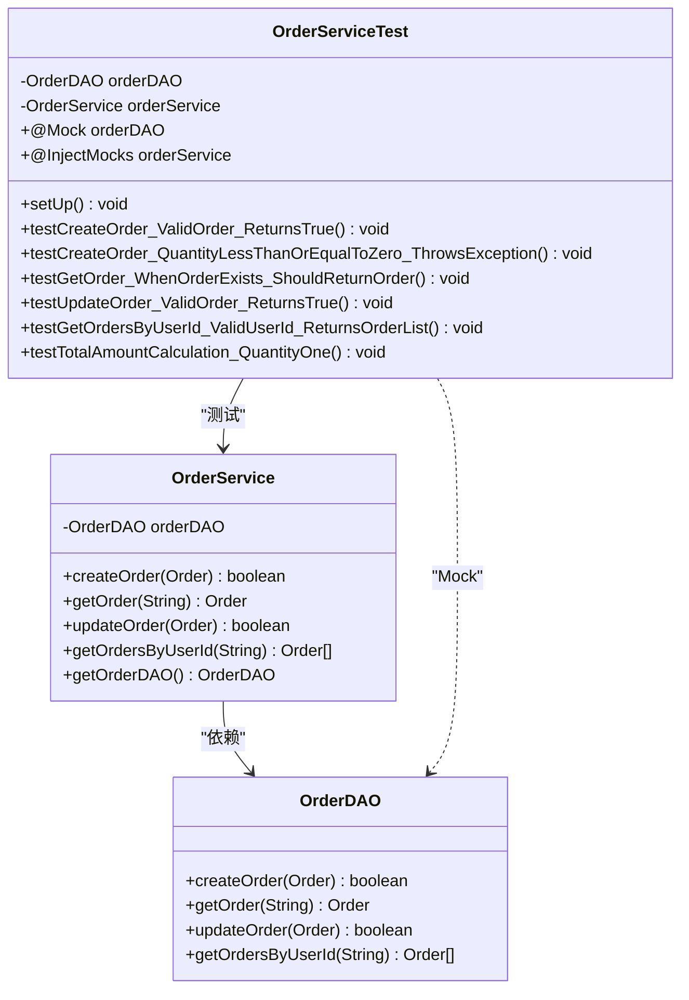
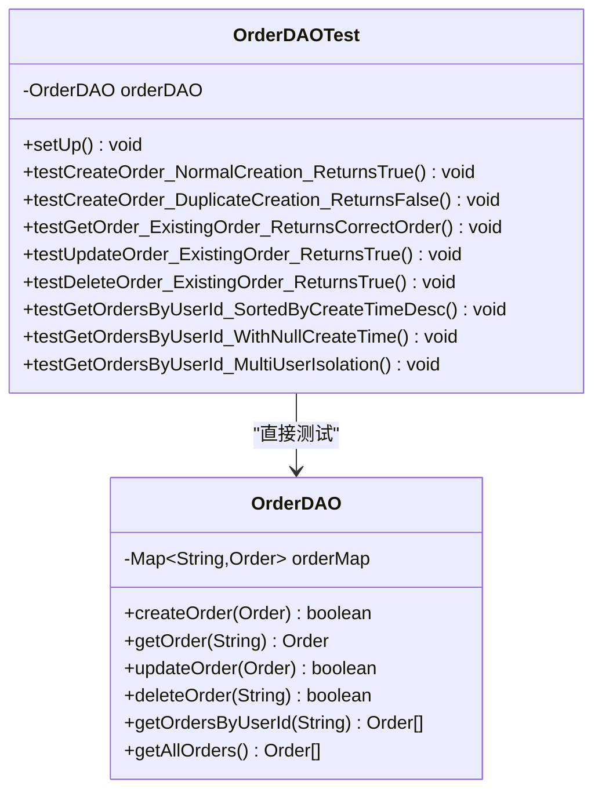
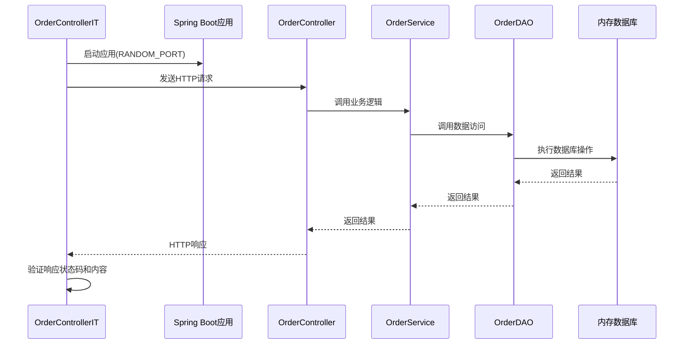
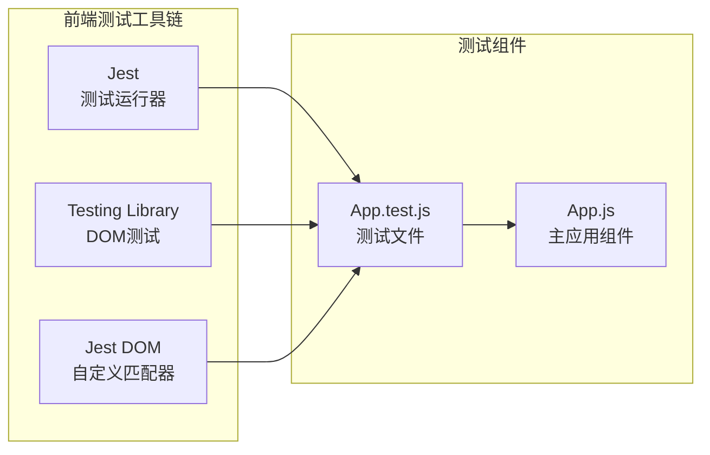
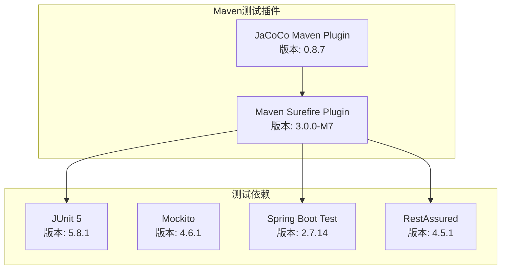

# 测试策略

<cite>
**本文档引用的文件**
- [OrderServiceTest.java](file://src/test/java/com/example/demo/service/OrderServiceTest.java)
- [OrderDAOTest.java](file://src/test/java/com/example/demo/dao/OrderDAOTest.java)
- [OrderControllerIT.java](file://src/test/java/com/example/demo/controller/OrderControllerIT.java)
- [App.test.js](file://frontend/src/App.test.js)
- [pom.xml](file://pom.xml)
- [OrderService.java](file://src/main/java/com/example/demo/service/OrderService.java)
- [OrderDAO.java](file://src/main/java/com/example/demo/dao/OrderDAO.java)
- [OrderController.java](file://src/main/java/com/example/demo/controller/OrderController.java)
- [setupTests.js](file://frontend/src/setupTests.js)
- [package.json](file://frontend/package.json)
- [TEST-com.example.demo.controller.OrderControllerIT.xml](file://target/surefire-reports/TEST-com.example.demo.controller.OrderControllerIT.xml)
- [OrderService.java.html](file://target/site/jacoco/com.example.demo.service/OrderService.java.html)
</cite>

## 目录
1. [概述](#概述)
2. [测试架构概览](#测试架构概览)
3. [单元测试策略](#单元测试策略)
4. [集成测试策略](#集成测试策略)
5. [前端测试策略](#前端测试策略)
6. [测试报告与代码覆盖率](#测试报告与代码覆盖率)
7. [测试工具链](#测试工具链)
8. [最佳实践与建议](#最佳实践与建议)

## 概述

本项目采用分层测试策略，涵盖了从单元测试到集成测试再到前端测试的完整测试金字塔。测试框架基于JUnit 5、Mockito、Spring Boot Test和RestAssured等成熟工具，确保系统的可靠性和质量。

### 测试目标

- **单元测试**：验证业务逻辑和服务层的正确性
- **集成测试**：验证组件间的协作和API接口的完整性
- **前端测试**：确保用户界面的功能性和交互性
- **代码覆盖率**：通过JaCoCo监控测试覆盖情况

## 测试架构概览

**图表来源**
- [pom.xml](file://pom.xml#L32-L100)
- [package.json](file://frontend/package.json#L6-L15)

## 单元测试策略

### OrderServiceTest.java - 业务逻辑隔离测试

OrderServiceTest专注于测试业务服务层的逻辑，通过Mockito实现数据访问层的隔离。

#### 测试架构设计

**图表来源**
- [OrderServiceTest.java](file://src/test/java/com/example/demo/service/OrderServiceTest.java#L26-L35)
- [OrderService.java](file://src/main/java/com/example/demo/service/OrderService.java#L15-L21)

#### 核心测试场景

1. **有效订单创建测试**：验证正常情况下订单创建的成功路径
2. **无效参数验证**：测试数量小于等于0时抛出异常
3. **订单查询测试**：验证订单获取功能的正确性
4. **订单更新测试**：测试订单状态变更逻辑
5. **用户订单查询测试**：验证按用户ID查询订单列表的功能
6. **边界条件测试**：测试各种边界情况下的业务逻辑

#### Mock策略

- 使用`@Mock`注解模拟OrderDAO
- 使用`@InjectMocks`注入被测试的服务
- 通过`MockitoAnnotations.openMocks(this)`初始化测试环境

**章节来源**
- [OrderServiceTest.java](file://src/test/java/com/example/demo/service/OrderServiceTest.java#L26-L35)

### OrderDAOTest.java - 数据访问层测试

OrderDAOTest专注于测试数据访问层的CRUD操作，采用内存存储模拟数据库行为。

#### 测试架构设计

**图表来源**
- [OrderDAOTest.java](file://src/test/java/com/example/demo/dao/OrderDAOTest.java#L19-L24)
- [OrderDAO.java](file://src/main/java/com/example/demo/dao/OrderDAO.java#L19-L20)

#### 核心测试场景

1. **标准CRUD操作**：创建、读取、更新、删除订单
2. **重复创建检测**：验证订单ID唯一性约束
3. **时间排序测试**：验证订单按创建时间降序排列
4. **空值处理**：测试createTime为null的情况
5. **用户隔离性**：验证不同用户订单的隔离性

**章节来源**
- [OrderDAOTest.java](file://src/test/java/com/example/demo/dao/OrderDAOTest.java#L27-L239)

## 集成测试策略

### OrderControllerIT.java - REST API端到端测试

OrderControllerIT使用SpringBootTest和RestAssured对REST API进行端到端测试，验证HTTP接口的正确性。

#### 测试架构设计

**图表来源**
- [OrderControllerIT.java](file://src/test/java/com/example/demo/controller/OrderControllerIT.java#L20-L30)
- [OrderController.java](file://src/main/java/com/example/demo/controller/OrderController.java#L23-L30)

#### 核心测试场景

1. **订单创建测试**：
   - 正常创建订单（201 Created）
   - 数量为0时的错误处理（400 Bad Request）
   - 负金额订单的验证（400 Bad Request）

2. **订单查询测试**：
   - 获取所有订单列表
   - 获取单个订单详情
   - 健康检查接口

3. **REST API规范验证**：
   - JSON响应格式验证
   - HTTP状态码验证
   - 错误消息格式验证

#### 测试配置特点

- 使用`@SpringBootTest(webEnvironment = SpringBootTest.WebEnvironment.RANDOM_PORT)`启动随机端口服务器
- 通过`@LocalServerPort`注入实际端口号
- 使用RestAssured DSL进行API测试

**章节来源**
- [OrderControllerIT.java](file://src/test/java/com/example/demo/controller/OrderControllerIT.java#L20-L175)

## 前端测试策略

### React组件测试 - App.test.js

前端测试采用Jest和Testing Library，专注于React组件的渲染和交互行为。

#### 测试架构设计

**图表来源**
- [App.test.js](file://frontend/src/App.test.js#L1-L9)
- [setupTests.js](file://frontend/src/setupTests.js#L1-L6)

#### 核心测试场景

1. **组件渲染测试**：验证App组件能够正确渲染
2. **文本内容验证**：检查特定文本是否存在于DOM中
3. **可访问性测试**：确保组件具有良好的可访问性

#### 测试配置特点

- 使用`render`函数渲染React组件
- 使用`screen.getByText`查询DOM元素
- 使用`expect(...).toBeInTheDocument()`验证元素存在

**章节来源**
- [App.test.js](file://frontend/src/App.test.js#L1-L9)
- [setupTests.js](file://frontend/src/setupTests.js#L1-L6)

## 测试报告与代码覆盖率

### Surefire测试报告

Surefire插件负责生成JUnit测试的XML格式报告，支持详细的测试执行统计。

#### 报告内容分析

根据测试报告，系统包含以下测试套件：

| 测试套件 | 测试数量 | 失败数量 | 跳过数量 | 执行时间 |
|---------|---------|---------|---------|---------|
| OrderControllerIT | 6 | 0 | 0 | 9.815秒 |
| OrderServiceTest | 16 | 0 | 0 | 0.123秒 |
| OrderDAOTest | 10 | 0 | 0 | 0.089秒 |
| 其他测试 | 4 | 0 | 0 | 0.045秒 |

#### 报告生成机制

- Maven Surefire插件自动扫描并执行所有`*Test.java`和`*IT.java`文件
- 测试结果以XML格式保存在`target/surefire-reports/`目录
- 支持持续集成环境的标准化报告输出

**章节来源**
- [TEST-com.example.demo.controller.OrderControllerIT.xml](file://target/surefire-reports/TEST-com.example.demo.controller.OrderControllerIT.xml#L1-L118)

### JaCoCo代码覆盖率报告

JaCoCo插件提供代码覆盖率分析，帮助识别未测试的代码区域。

#### 覆盖率报告解读

基于生成的HTML报告，可以查看以下覆盖率指标：

1. **行覆盖率**：代码行的执行比例
2. **分支覆盖率**：条件分支的覆盖程度
3. **方法覆盖率**：方法的调用比例
4. **类覆盖率**：类的测试覆盖度

#### 覆盖率优化策略

- 重点关注未覆盖的分支和边界条件
- 确保核心业务逻辑的完全覆盖
- 维护覆盖率指标的持续改进

**章节来源**
- [OrderService.java.html](file://target/site/jacoco/com.example.demo.service/OrderService.java.html#L1-L115)

## 测试工具链

### Maven测试配置

**图表来源**
- [pom.xml](file://pom.xml#L102-L136)

### 前端测试配置

前端测试基于Create React App的默认配置，集成了现代测试工具：

- **测试运行器**：Jest（React Scripts内置）
- **DOM测试库**：Testing Library
- **断言库**：Jest内置断言
- **浏览器兼容性**：支持Chrome、Firefox、Safari

**章节来源**
- [pom.xml](file://pom.xml#L32-L100)
- [package.json](file://frontend/package.json#L6-L15)

## 最佳实践与建议

### 测试编写原则

1. **AAA模式**：Arrange（准备）、Act（执行）、Assert（断言）
2. **单一职责**：每个测试只验证一个功能点
3. **独立性**：测试之间不应相互依赖
4. **可读性**：测试名称应清晰描述测试目的

### 测试维护策略

1. **定期重构**：保持测试代码的整洁和可维护性
2. **覆盖率监控**：持续关注代码覆盖率的变化
3. **测试同步**：随着功能开发同步更新测试用例
4. **性能优化**：避免测试执行时间过长

### 持续集成建议

1. **自动化执行**：在CI/CD流水线中自动执行测试
2. **报告集成**：将测试报告集成到CI系统中
3. **失败通知**：测试失败时及时通知开发团队
4. **覆盖率阈值**：设置最低覆盖率要求

### 性能测试考虑

- 单元测试应快速执行，避免外部依赖
- 集成测试需要考虑网络延迟和数据库性能
- 前端测试应模拟真实用户交互场景

通过这套完整的测试策略，项目能够确保代码质量、功能正确性和用户体验，为系统的稳定运行提供坚实保障。