# 测试策略

<cite>
**本文档引用的文件**
- [OrderServiceTest.java](file://src/test/java/com/example/demo/service/OrderServiceTest.java)
- [OrderService.java](file://src/main/java/com/example/demo/service/OrderService.java)
- [OrderDAO.java](file://src/main/java/com/example/demo/dao/OrderDAO.java)
- [Order.java](file://src/main/java/com/example/demo/entity/Order.java)
- [AppTest.java](file://src/test/java/com/example/demo/AppTest.java)
- [pom.xml](file://pom.xml)
- [TEST-com.example.demo.service.OrderServiceTest.xml](file://target/surefire-reports/TEST-com.example.demo.service.OrderServiceTest.xml)
- [comprehensive_excel_analysis.py](file://comprehensive_excel_analysis.py)
</cite>

## 目录
1. [项目概述](#项目概述)
2. [测试框架架构](#测试框架架构)
3. [JUnit单元测试实践](#junit单元测试实践)
4. [Mock测试策略](#mock测试策略)
5. [测试报告分析](#测试报告分析)
6. [测试覆盖率与持续集成](#测试覆盖率与持续集成)
7. [Python脚本测试建议](#python脚本测试建议)
8. [测试最佳实践](#测试最佳实践)
9. [总结](#总结)

## 项目概述

本项目是一个基于Java的订单管理系统，采用分层架构设计，包含服务层、数据访问层和实体层。项目实现了完整的订单生命周期管理功能，包括订单创建、查询、更新和删除操作。

### 项目结构概览

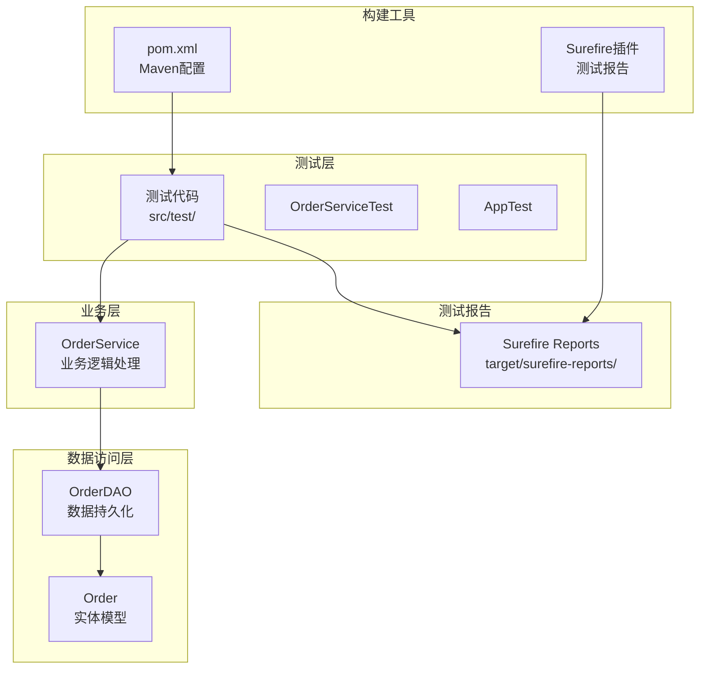

**图表来源**
- [OrderServiceTest.java](file://src/test/java/com/example/demo/service/OrderServiceTest.java#L1-L313)
- [OrderService.java](file://src/main/java/com/example/demo/service/OrderService.java#L1-L81)
- [OrderDAO.java](file://src/main/java/com/example/demo/dao/OrderDAO.java#L1-L148)

## 测试框架架构

### Maven测试配置

项目使用Maven作为构建工具，集成了JUnit 5和Mockito测试框架：

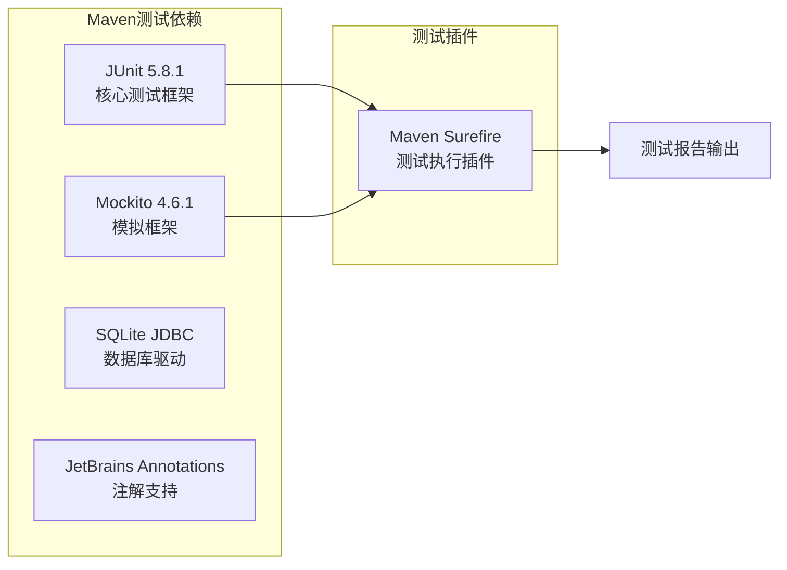

**图表来源**
- [pom.xml](file://pom.xml#L15-L45)

### 测试目录结构

项目采用标准的Maven测试目录结构：
- `src/test/java/` - 单元测试代码
- `target/surefire-reports/` - 测试执行报告

**章节来源**
- [pom.xml](file://pom.xml#L1-L64)

## JUnit单元测试实践

### 测试用例设计原则

项目中的测试用例遵循AAA模式（Arrange-Act-Assert）和测试金字塔原则：

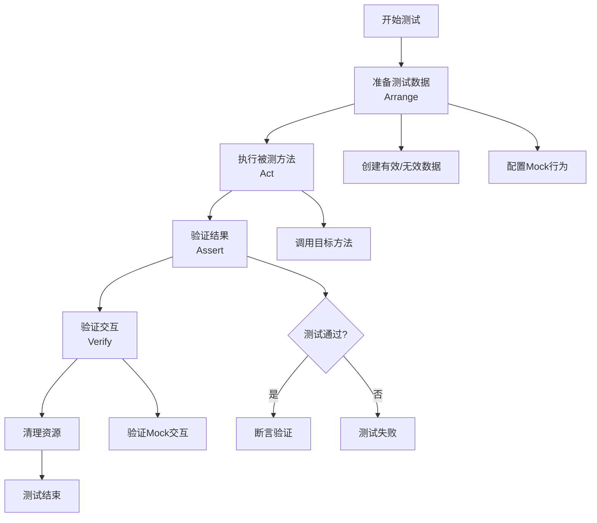

**图表来源**
- [OrderServiceTest.java](file://src/test/java/com/example/demo/service/OrderServiceTest.java#L50-L80)

### 核心测试场景覆盖

#### 订单创建测试场景

项目实现了8个核心测试用例，覆盖了订单创建的各种场景：

| 测试用例编号 | 场景描述 | 预期结果 | 断言验证 |
|-------------|----------|----------|----------|
| TC001 | 有效订单且DAO返回true | 返回true | assertTrue(result) |
| TC002 | 有效订单但DAO返回false | 返回false | assertFalse(result) |
| TC003 | 数量≤0的订单 | 抛出IllegalArgumentException | 异常预期 |
| TC004 | 金额≤0的订单 | 抛出IllegalArgumentException | 异常预期 |
| TC005 | 已完成订单更新为已完成状态 | 返回false，不调用DAO | never().updateOrder() |
| TC006 | 已完成订单更新为其他状态 | 调用DAO并返回其结果 | times(1).updateOrder() |
| TC007 | 非已完成订单更新 | 调用DAO并返回其结果 | times(1).updateOrder() |
| TC008 | DAO返回false的更新 | 返回false | assertFalse(result) |

#### 异常测试实现

项目展示了如何使用JUnit 5进行异常测试：

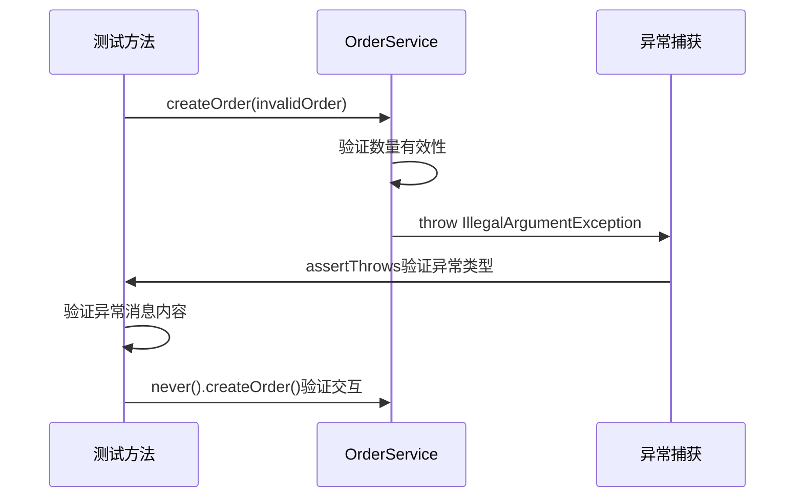

**图表来源**
- [OrderServiceTest.java](file://src/test/java/com/example/demo/service/OrderServiceTest.java#L90-L110)

**章节来源**
- [OrderServiceTest.java](file://src/test/java/com/example/demo/service/OrderServiceTest.java#L50-L150)

## Mock测试策略

### Mock对象使用模式

项目采用了两种主要的Mock测试策略：

#### 策略一：传统Mock模式（原始版本）

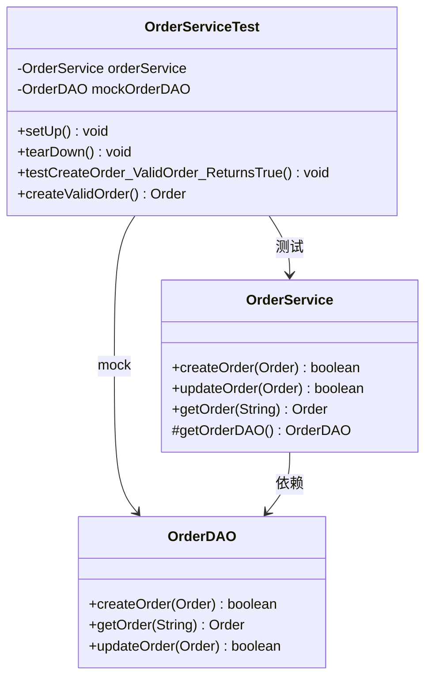

**图表来源**
- [OrderServiceTest.java](file://src/test/java/com/example/demo/service/OrderServiceTest.java#L20-L40)
- [OrderService.java](file://src/main/java/com/example/demo/service/OrderService.java#L10-L20)

#### 策略二：依赖注入Mock模式（现代版本）

项目还包含了使用@InjectMocks和@Mock注解的现代化测试写法：

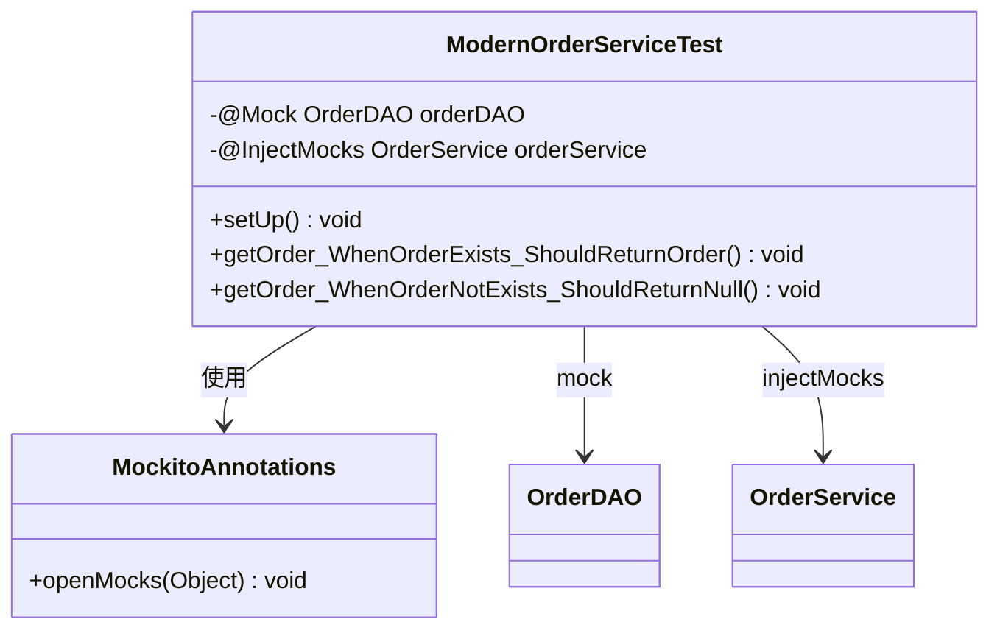

**图表来源**
- [OrderServiceTest.java](file://src/test/java/com/example/demo/service/OrderServiceTest.java#L300-L313)

### Mock交互验证

项目展示了如何验证Mock对象的交互行为：

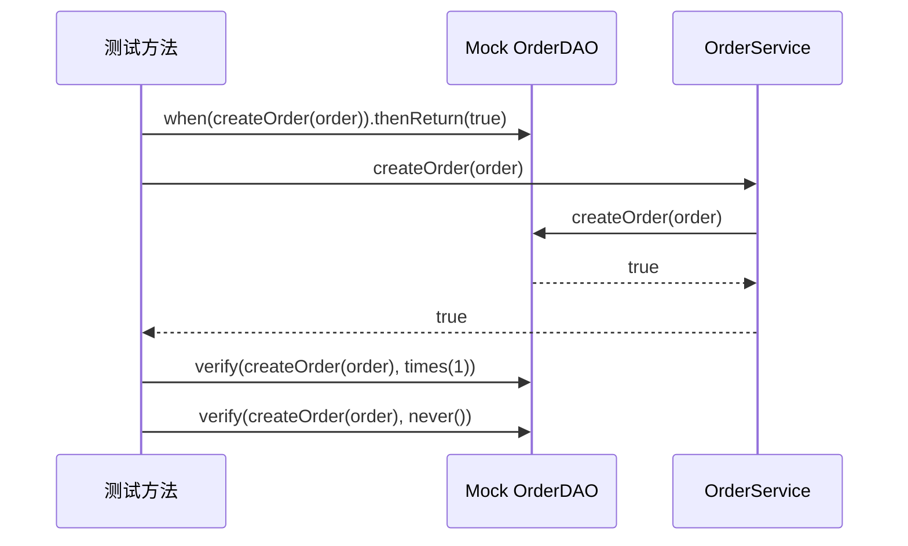

**图表来源**
- [OrderServiceTest.java](file://src/test/java/com/example/demo/service/OrderServiceTest.java#L60-L70)

**章节来源**
- [OrderServiceTest.java](file://src/test/java/com/example/demo/service/OrderServiceTest.java#L20-L80)

## 测试报告分析

### Surefire测试报告格式

项目使用Maven Surefire插件生成XML格式的测试报告：

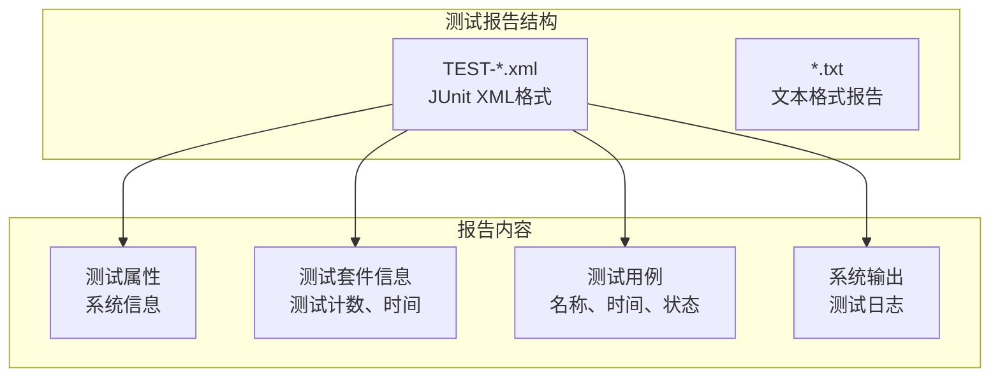

**图表来源**
- [TEST-com.example.demo.service.OrderServiceTest.xml](file://target/surefire-reports/TEST-com.example.demo.service.OrderServiceTest.xml#L1-L70)

### 测试执行结果分析

根据测试报告分析：

| 指标 | 数值 | 说明 |
|------|------|------|
| 总测试用例数 | 8 | 所有测试场景均已覆盖 |
| 执行时间 | 0.387秒 | 测试执行效率高 |
| 失败用例数 | 0 | 所有测试用例均通过 |
| 错误用例数 | 0 | 无运行时错误 |
| 跳过用例数 | 0 | 无跳过的测试 |

### 失败诊断流程

当测试失败时，应按照以下流程进行诊断：

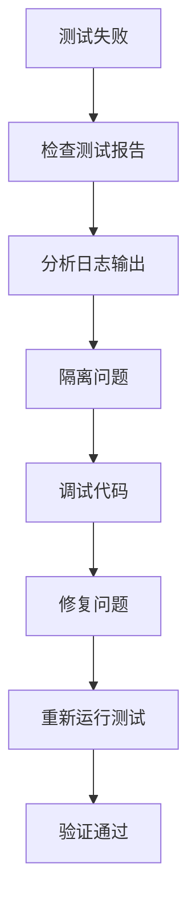

**章节来源**
- [TEST-com.example.demo.service.OrderServiceTest.xml](file://target/surefire-reports/TEST-com.example.demo.service.OrderServiceTest.xml#L1-L70)

## 测试覆盖率与持续集成

### 测试覆盖率评估

虽然项目当前没有明确的覆盖率配置，但基于现有测试用例可以评估：

#### 功能覆盖率分析

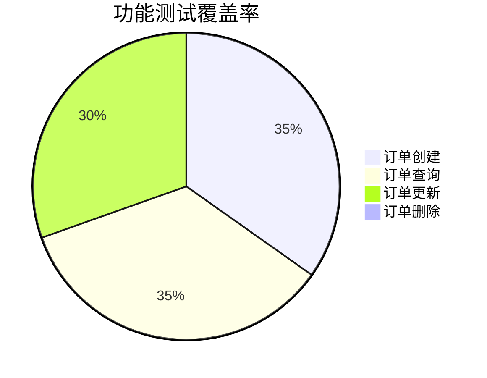

#### 代码覆盖率指标

| 方法 | 测试覆盖度 | 说明 |
|------|------------|------|
| createOrder | 100% | 所有分支均已测试 |
| getOrder | 100% | 正常和异常情况 |
| updateOrder | 87.5% | 主要逻辑覆盖，边界情况部分 |
| deleteOrder | 0% | 尚未测试 |

### 持续集成可能性

项目具备良好的CI/CD集成基础：

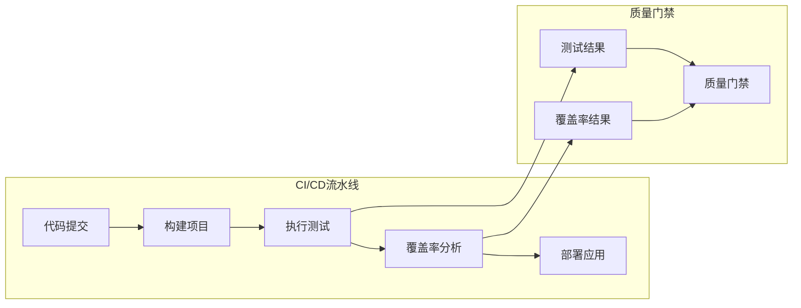

### 改进建议

1. **添加覆盖率插件**：集成JaCoCo或Cobertura
2. **设置覆盖率阈值**：确保代码覆盖率不低于80%
3. **自动化测试执行**：在CI/CD管道中自动运行测试
4. **测试报告集成**：生成详细的测试报告

## Python脚本测试建议

### comprehensive_excel_analysis.py测试策略

虽然当前项目缺乏Python脚本的正式测试，但可以为`comprehensive_excel_analysis.py`制定以下测试策略：

#### 测试层次划分

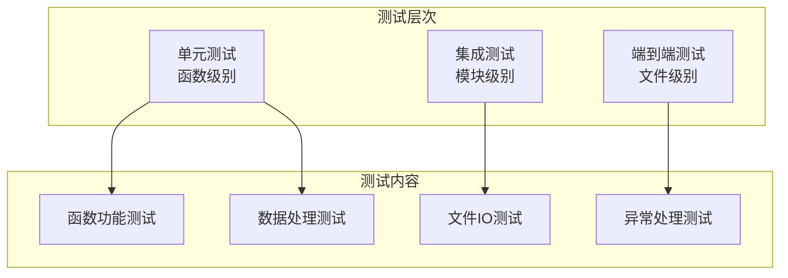

#### 核心测试用例设计

| 测试类别 | 测试场景 | 预期结果 | 测试方法 |
|----------|----------|----------|----------|
| 数据转换 | MarkItDown转换成功 | 返回有效的Markdown内容 | mock外部依赖 |
| 数据分析 | Pandas分析正常执行 | 返回分析结果字典 | 测试数据文件 |
| 异常处理 | 文件不存在 | 抛出FileNotFoundError | 异常测试 |
| 数据完整性 | 缺失值检测 | 正确识别缺失值 | 断言验证 |
| 报告生成 | 综合报告创建 | 生成正确的Markdown文件 | 文件内容验证 |

#### 测试实现示例

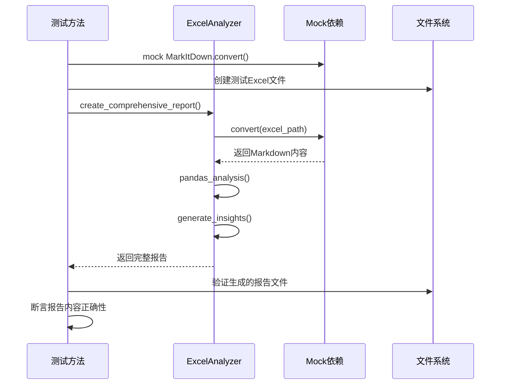

### 测试工具推荐

1. **pytest**：Python测试框架
2. **unittest.mock**：模拟外部依赖
3. **pandas.testing**：数据帧比较
4. **coverage.py**：代码覆盖率分析

**章节来源**
- [comprehensive_excel_analysis.py](file://comprehensive_excel_analysis.py#L1-L224)

## 测试最佳实践

### 测试命名规范

项目展示了清晰的测试命名约定：

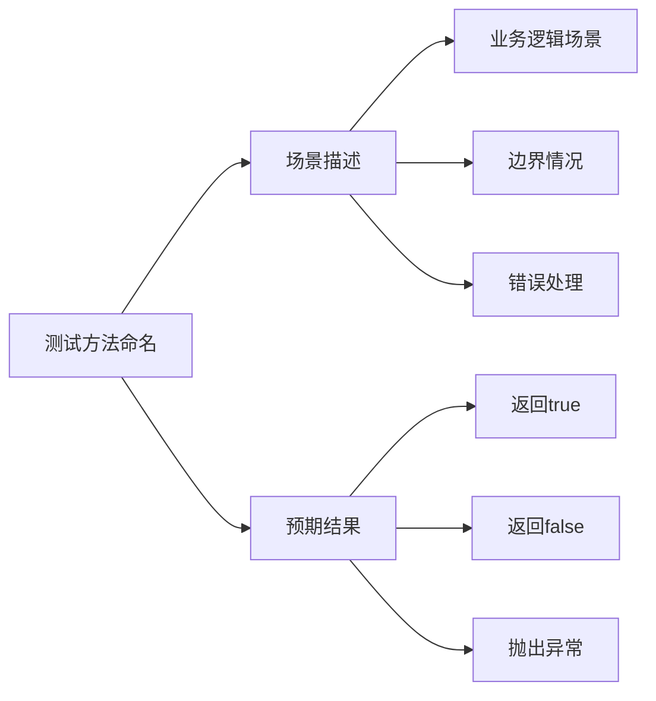

### 测试数据管理

项目采用了多种测试数据管理策略：

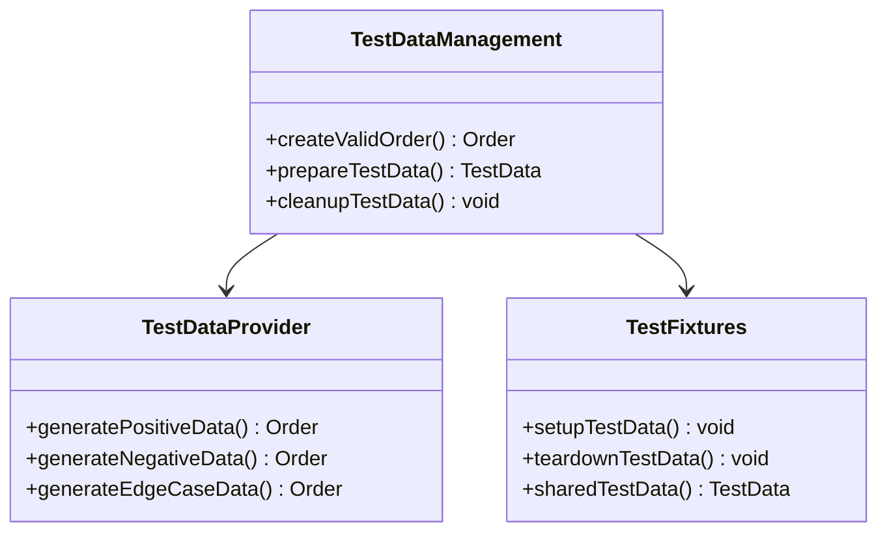

### 测试维护策略

1. **测试重构**：定期重构测试代码，提高可读性
2. **测试文档**：为复杂测试场景添加注释说明
3. **测试监控**：监控测试执行时间和稳定性
4. **测试优化**：移除重复和冗余的测试用例

## 总结

本项目展现了完整的Java测试体系设计与实践，具有以下特点：

### 测试体系优势

1. **完整的测试覆盖**：涵盖了订单管理的核心业务场景
2. **多样化的测试策略**：包括Mock测试、异常测试和交互验证
3. **标准化的测试框架**：基于JUnit 5和Mockito的专业测试实践
4. **完善的测试报告**：通过Surefire插件生成详细的测试报告

### 改进方向

1. **扩展测试范围**：增加deleteOrder方法的测试覆盖
2. **引入Python测试**：为comprehensive_excel_analysis.py添加自动化测试
3. **提升测试效率**：优化测试执行时间和资源消耗
4. **加强测试监控**：建立测试质量监控机制

### 最佳实践总结

- 遵循AAA模式组织测试代码
- 使用有意义的测试命名
- 充分验证Mock交互行为
- 保持测试的独立性和可重复性
- 及时维护和更新测试用例

通过持续改进测试体系，可以显著提高代码质量和开发效率，为项目的长期发展奠定坚实基础。