# OrderControllerIT集成测试设计与实现详解

<cite>
**本文档引用的文件**
- [OrderControllerIT.java](file://src/test/java/com/example/demo/controller/OrderControllerIT.java)
- [OrderController.java](file://src/main/java/com/example/demo/controller/OrderController.java)
- [OrderService.java](file://src/main/java/com/example/demo/service/OrderService.java)
- [OrderDAO.java](file://src/main/java/com/example/demo/dao/OrderDAO.java)
- [Order.java](file://src/main/java/com/example/demo/entity/Order.java)
- [application.properties](file://src/main/resources/application.properties)
- [pom.xml](file://pom.xml)
</cite>

## 目录
1. [引言](#引言)
2. [项目架构概览](#项目架构概览)
3. [集成测试框架设计](#集成测试框架设计)
4. [测试类核心组件分析](#测试类核心组件分析)
5. [测试用例详细分析](#测试用例详细分析)
6. [Spring Boot集成测试机制](#spring-boot集成测试机制)
7. [RestAssured测试工具应用](#restassured测试工具应用)
8. [测试数据准备与管理](#测试数据准备与管理)
9. [完整调用链验证](#完整调用链验证)
10. [集成测试与单元测试对比](#集成测试与单元测试对比)
11. [性能优化策略](#性能优化策略)
12. [最佳实践与建议](#最佳实践与建议)
13. [总结](#总结)

## 引言

OrderControllerIT.java是一个典型的Spring Boot集成测试类，专门用于验证OrderController暴露的REST API端点功能。该测试类展示了如何使用@SpringBootTest注解加载完整的Spring应用程序上下文，通过RestAssured工具发起真实的HTTP请求，验证整个系统栈的正确性。

集成测试是软件测试金字塔的重要组成部分，它不仅验证单个组件的功能，更重要的是验证组件间的协作关系和数据流转的完整性。通过OrderControllerIT的实现，我们可以深入理解现代Java Web应用的集成测试设计模式和最佳实践。

## 项目架构概览

该项目采用经典的三层架构模式，包含控制器层、服务层和数据访问层，每层都有明确的职责分工：

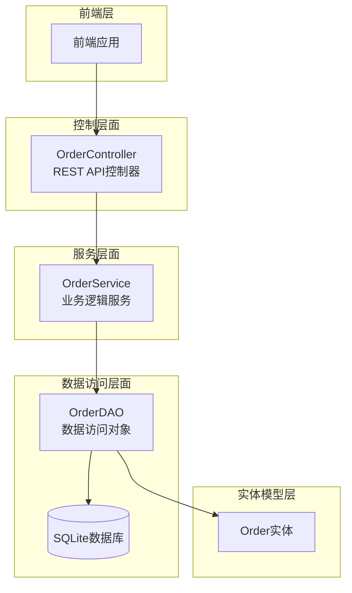

**图表来源**
- [OrderController.java](file://src/main/java/com/example/demo/controller/OrderController.java#L18-L173)
- [OrderService.java](file://src/main/java/com/example/demo/service/OrderService.java#L13-L114)
- [OrderDAO.java](file://src/main/java/com/example/demo/dao/OrderDAO.java#L18-L248)

**章节来源**
- [OrderController.java](file://src/main/java/com/example/demo/controller/OrderController.java#L1-L173)
- [OrderService.java](file://src/main/java/com/example/demo/service/OrderService.java#L1-L114)
- [OrderDAO.java](file://src/main/java/com/example/demo/dao/OrderDAO.java#L1-L248)

## 集成测试框架设计

### @SpringBootTest注解配置

OrderControllerIT类使用了关键的@SpringBootTest注解，其配置特点如下：

- **webEnvironment = SpringBootTest.WebEnvironment.RANDOM_PORT**：启动一个随机端口的Web服务器，避免端口冲突
- **完整Spring上下文加载**：包括所有Bean的依赖注入和配置
- **自动配置发现**：扫描项目中的配置类和组件

### 测试环境初始化

测试类通过以下机制确保测试环境的一致性和隔离性：

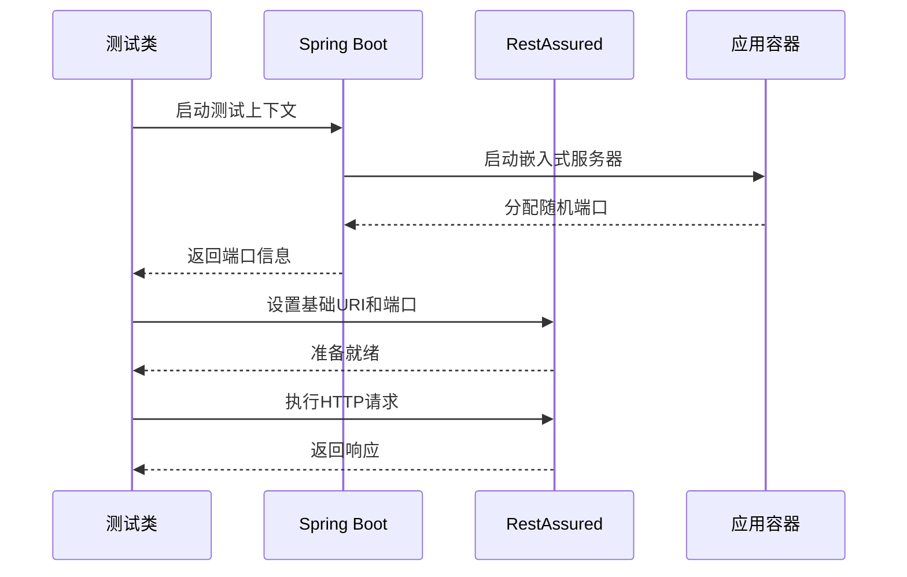

**图表来源**
- [OrderControllerIT.java](file://src/test/java/com/example/demo/controller/OrderControllerIT.java#L20-L30)

**章节来源**
- [OrderControllerIT.java](file://src/test/java/com/example/demo/controller/OrderControllerIT.java#L20-L30)

## 测试类核心组件分析

### 类级别注解与配置

OrderControllerIT类采用了现代化的测试注解组合：

- **@SpringBootTest**：启用Spring Boot测试支持
- **@LocalServerPort**：自动注入随机分配的服务器端口
- **@BeforeEach**：每个测试方法执行前的初始化操作

### RestAssured配置机制

测试类通过setUp方法配置RestAssured，建立统一的测试环境：

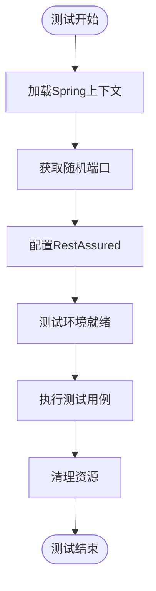

**图表来源**
- [OrderControllerIT.java](file://src/test/java/com/example/demo/controller/OrderControllerIT.java#L26-L30)

**章节来源**
- [OrderControllerIT.java](file://src/test/java/com/example/demo/controller/OrderControllerIT.java#L16-L30)

## 测试用例详细分析

### 创建订单测试用例

#### 正常流程测试（testCreateOrder_ValidOrder_ReturnsSuccess）

该测试验证了创建订单的核心业务流程：

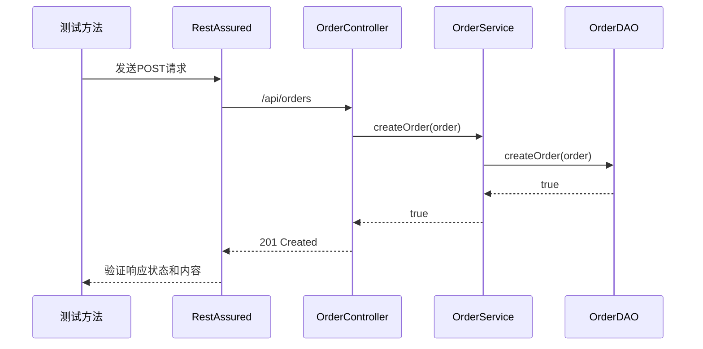

**图表来源**
- [OrderControllerIT.java](file://src/test/java/com/example/demo/controller/OrderControllerIT.java#L35-L57)
- [OrderController.java](file://src/main/java/com/example/demo/controller/OrderController.java#L36-L55)
- [OrderService.java](file://src/main/java/com/example/demo/service/OrderService.java#L28-L37)

#### 边界条件测试

测试类包含了多个边界条件验证：

1. **数量为零测试**（testCreateOrder_ZeroQuantity_ReturnsBadRequest）
   - 输入验证：数量必须大于0
   - 错误处理：返回400状态码和错误信息

2. **金额为负数测试**（testCreateOrder_NegativeAmount_ReturnsBadRequest）
   - 业务规则验证：订单金额必须大于0
   - 异常处理：参数校验失败

### 查询订单测试用例

#### 获取所有订单测试（testGetAllOrders_ReturnsOrderList）

该测试验证了订单列表查询功能：

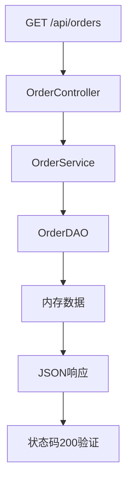

**图表来源**
- [OrderControllerIT.java](file://src/test/java/com/example/demo/controller/OrderControllerIT.java#L111-L121)
- [OrderController.java](file://src/main/java/com/example/demo/controller/OrderController.java#L61-L73)

#### 获取单个订单测试（testGetOrder_ValidOrderId_ReturnsOrder）

该测试展示了完整的订单生命周期验证：

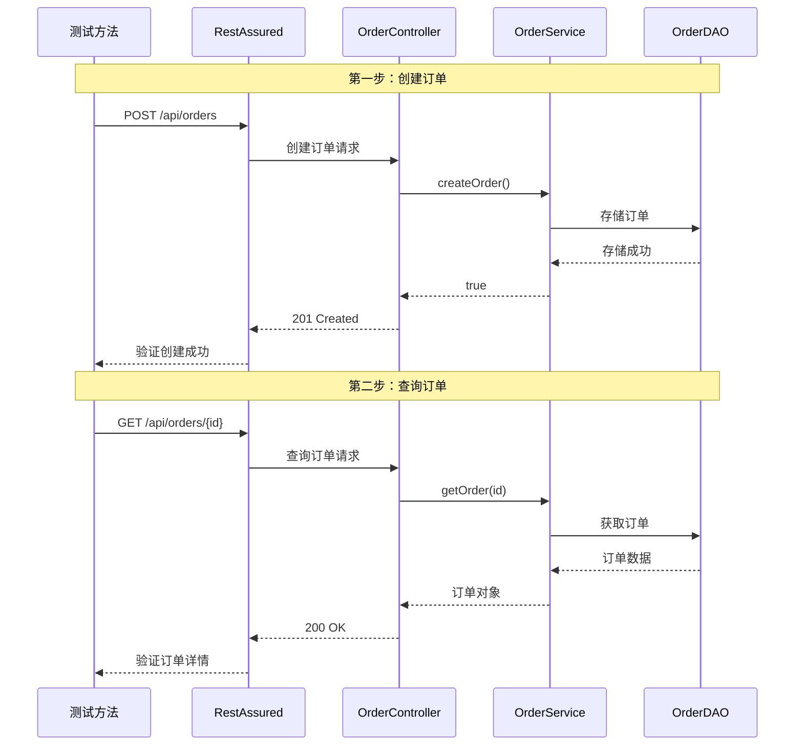

**图表来源**
- [OrderControllerIT.java](file://src/test/java/com/example/demo/controller/OrderControllerIT.java#L128-L159)

### 健康检查测试（testHealthCheck_ReturnsOK）

该测试验证了系统的健康监控功能：

- **端点路径**：`/api/orders/health`
- **响应格式**：标准化的成功响应
- **业务价值**：支持运维监控和自动化部署

**章节来源**
- [OrderControllerIT.java](file://src/test/java/com/example/demo/controller/OrderControllerIT.java#L35-L174)

## Spring Boot集成测试机制

### 上下文加载策略

Spring Boot集成测试采用以下策略确保测试的独立性和可靠性：

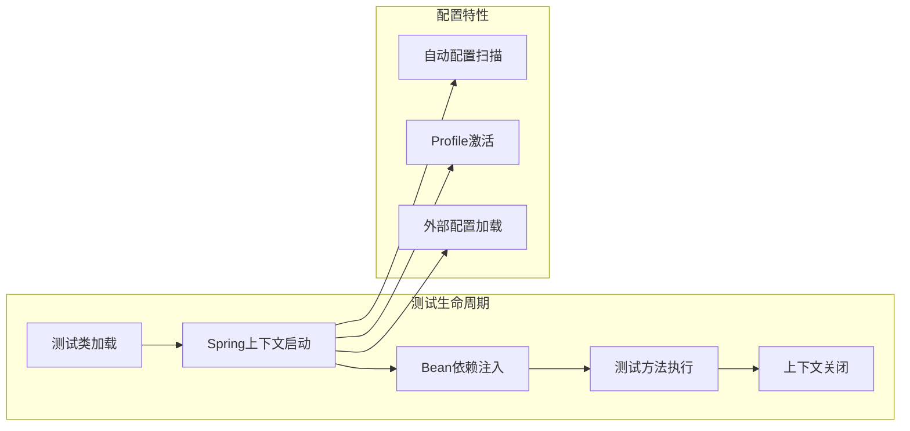

### 端口管理机制

通过@LocalServerPort注解实现动态端口分配：

- **随机端口选择**：避免测试间的端口冲突
- **自动配置**：测试环境自动适配新的端口
- **资源释放**：测试结束后自动释放端口资源

**章节来源**
- [OrderControllerIT.java](file://src/test/java/com/example/demo/controller/OrderControllerIT.java#L23-L30)

## RestAssured测试工具应用

### HTTP请求构建模式

RestAssured提供了流畅的API来构建和验证HTTP请求：

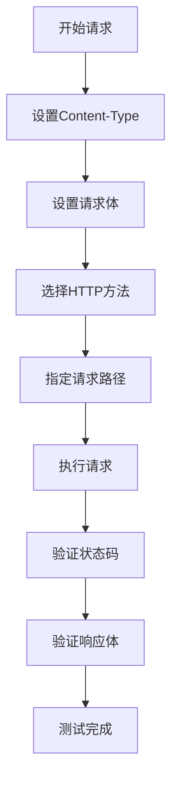

### 响应验证策略

测试类使用了多种响应验证技术：

1. **状态码验证**：使用statusCode()方法
2. **JSON结构验证**：使用body()方法进行断言
3. **内容匹配**：使用equalTo()、containsString()等匹配器

### 断言库使用

测试类充分利用了Hamcrest断言库的强大功能：

- **精确匹配**：equalTo()用于确切值比较
- **部分匹配**：containsString()用于子字符串查找
- **类型验证**：notNullValue()用于非空检查

**章节来源**
- [OrderControllerIT.java](file://src/test/java/com/example/demo/controller/OrderControllerIT.java#L13-L14)

## 测试数据准备与管理

### 动态数据生成策略

测试类采用了智能的数据生成策略：

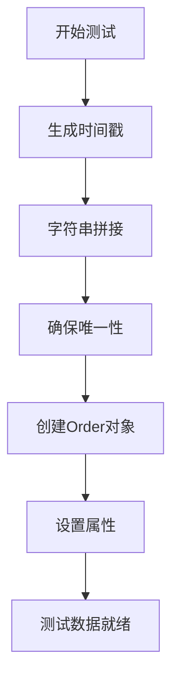

### 数据一致性保证

为了确保测试的可重复性和独立性：

1. **时间戳驱动**：使用System.currentTimeMillis()确保唯一性
2. **动态属性**：为每个测试生成不同的订单ID
3. **状态重置**：每次测试后保持数据隔离

### 测试数据生命周期

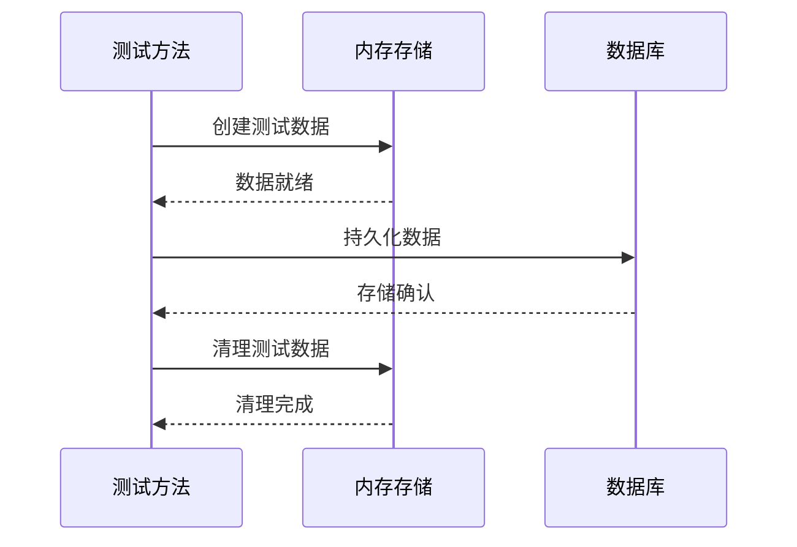

**图表来源**
- [OrderControllerIT.java](file://src/test/java/com/example/demo/controller/OrderControllerIT.java#L38-L44)

**章节来源**
- [OrderControllerIT.java](file://src/test/java/com/example/demo/controller/OrderControllerIT.java#L38-L44)

## 完整调用链验证

### 控制器层验证

OrderController作为REST API的入口点，验证了以下功能：

- **路由映射**：正确的URL路径和HTTP方法绑定
- **参数解析**：JSON请求体的自动反序列化
- **异常处理**：业务异常的优雅处理
- **响应格式**：标准化的JSON响应结构

### 服务层验证

OrderService验证了业务逻辑的正确性：

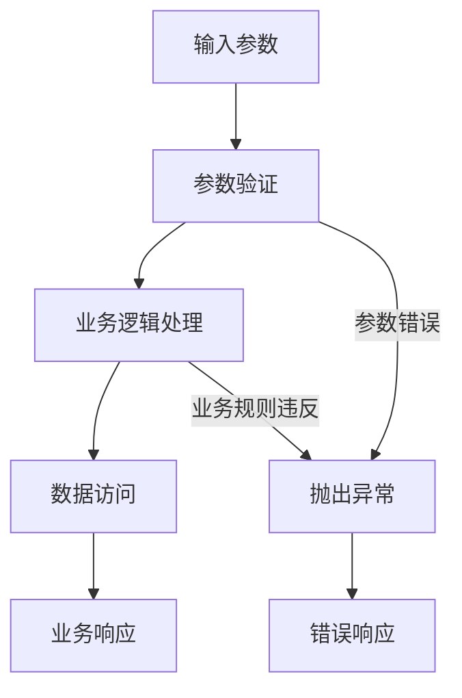

### 数据访问层验证

OrderDAO验证了数据持久化的完整性：

- **CRUD操作**：创建、读取、更新、删除功能
- **事务管理**：数据一致性的保证
- **异常处理**：数据库操作异常的捕获和处理

### 数据库交互验证

虽然项目使用了内存模拟存储，但测试验证了完整的数据库交互流程：

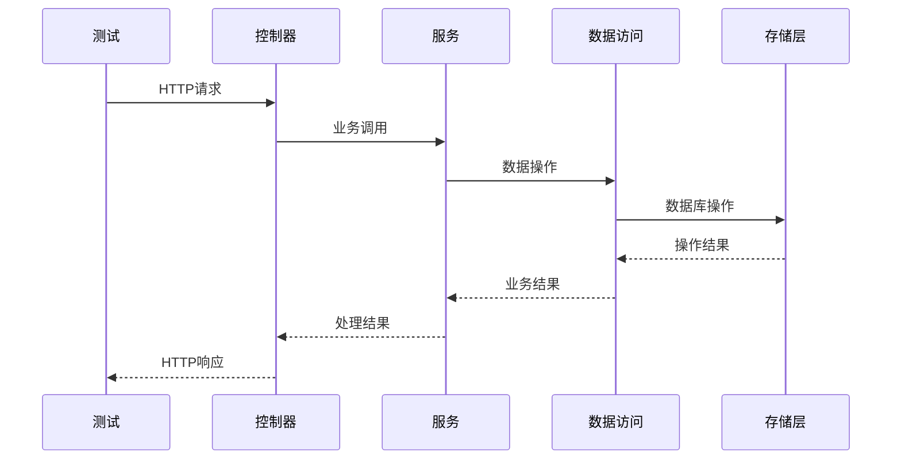

**图表来源**
- [OrderController.java](file://src/main/java/com/example/demo/controller/OrderController.java#L36-L55)
- [OrderService.java](file://src/main/java/com/example/demo/service/OrderService.java#L28-L37)
- [OrderDAO.java](file://src/main/java/com/example/demo/dao/OrderDAO.java#L165-L174)

**章节来源**
- [OrderController.java](file://src/main/java/com/example/demo/controller/OrderController.java#L36-L55)
- [OrderService.java](file://src/main/java/com/example/demo/service/OrderService.java#L28-L37)
- [OrderDAO.java](file://src/main/java/com/example/demo/dao/OrderDAO.java#L165-L174)

## 集成测试与单元测试对比

### 测试范围差异

| 特性 | 单元测试 | 集成测试 |
|------|----------|----------|
| 测试范围 | 单个类或方法 | 多个组件协作 |
| 依赖隔离 | Mock外部依赖 | 使用真实依赖 |
| 执行速度 | 快速（毫秒级） | 较慢（秒级） |
| 覆盖层次 | 逻辑正确性 | 系统完整性 |
| 数据真实性 | 模拟数据 | 实际数据 |

### 适用场景对比

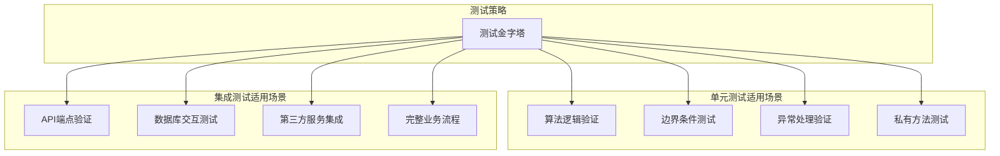

### 关键价值对比

**单元测试的价值**：
- 快速反馈开发问题
- 隔离代码逻辑验证
- 支持重构和重构

**集成测试的价值**：
- 验证组件间协作
- 确保系统整体功能
- 发现配置和集成问题

## 性能优化策略

### 嵌入式数据库优化

虽然当前项目使用内存存储，但在实际生产环境中可以考虑以下优化：

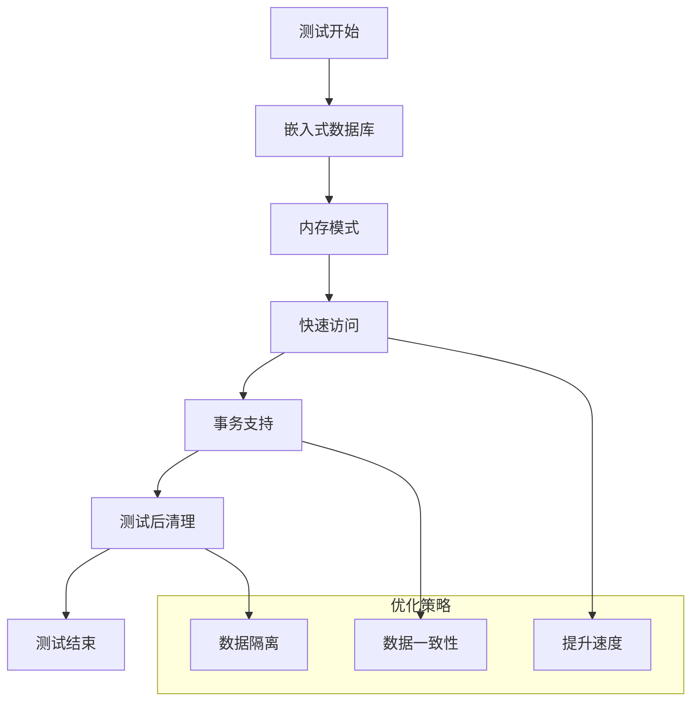

### 测试执行优化

1. **并行执行**：利用多核CPU并行运行测试
2. **资源复用**：在测试间复用共享资源
3. **快速失败**：早期检测和报告失败
4. **增量测试**：只运行变更相关的测试

### 内存管理优化

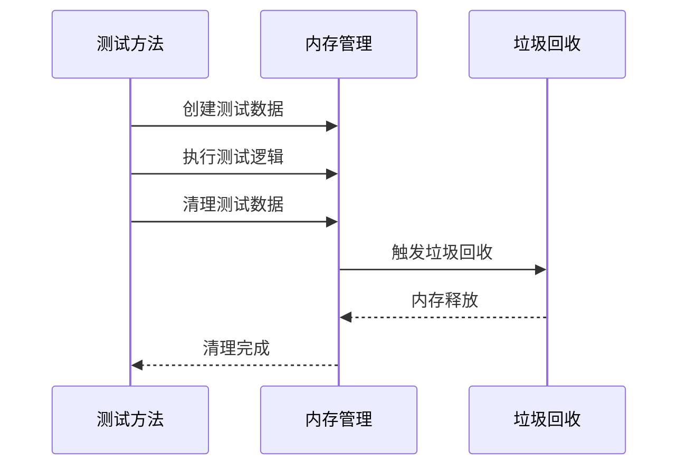

**章节来源**
- [pom.xml](file://pom.xml#L25-L100)

## 最佳实践与建议

### 测试设计原则

1. **单一职责**：每个测试用例验证一个特定功能
2. **独立性**：测试用例之间不应相互依赖
3. **可重复性**：测试结果应该一致可预测
4. **自包含性**：测试应包含所有必要的准备工作

### 错误处理测试

测试类展示了良好的错误处理测试实践：

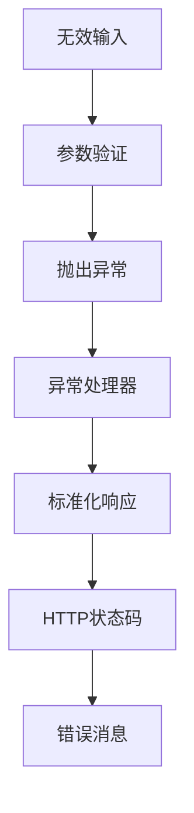

### 数据库测试策略

对于真实的数据库集成测试，建议：

1. **事务回滚**：每个测试在事务中执行并在结束后回滚
2. **测试数据隔离**：使用不同的测试前缀或命名空间
3. **数据库快照**：测试前备份，测试后恢复
4. **环境隔离**：开发、测试、生产环境使用不同数据库

### 监控和日志

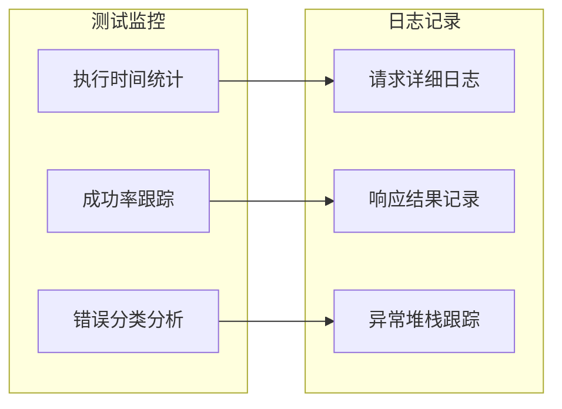

**章节来源**
- [OrderControllerIT.java](file://src/test/java/com/example/demo/controller/OrderControllerIT.java#L35-L174)

## 总结

OrderControllerIT.java集成测试展现了现代Java Web应用测试的最佳实践。通过Spring Boot的集成测试框架，结合RestAssured强大的HTTP测试能力，实现了对整个系统栈的全面验证。

### 核心优势

1. **完整栈验证**：从HTTP请求到数据库存储的完整流程验证
2. **真实环境模拟**：使用真实的Spring上下文和网络端口
3. **业务逻辑覆盖**：涵盖正常流程和异常情况的全面测试
4. **可维护性强**：清晰的测试结构和标准化的断言方式

### 技术亮点

- **@SpringBootTest注解**：简化了Spring应用的集成测试配置
- **RestAssured工具**：提供了简洁而强大的HTTP测试API
- **动态数据生成**：确保测试的独立性和可重复性
- **多层次验证**：从响应状态到具体内容的全面验证

### 应用价值

该集成测试不仅验证了OrderController的功能正确性，更重要的是确保了系统各层组件间的协作关系。通过模拟真实的HTTP请求和响应，发现了潜在的集成问题和配置错误，为系统的稳定性和可靠性提供了重要保障。

在实际项目中，这种集成测试模式可以扩展到其他控制器和服务，形成完整的测试体系，支持持续集成和持续交付流程，确保软件质量的持续改进。