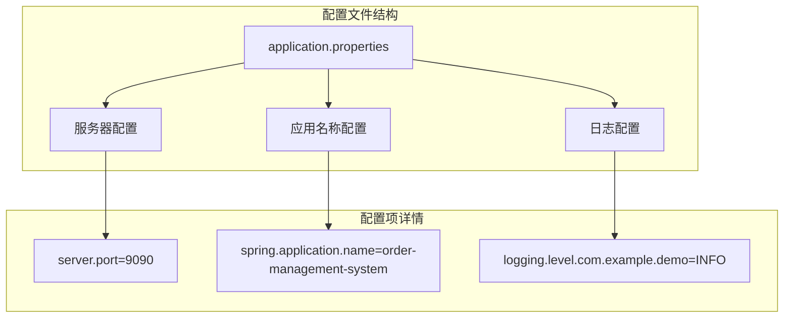
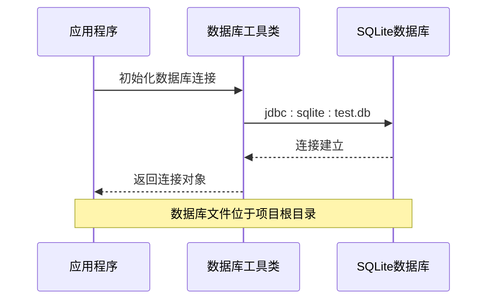
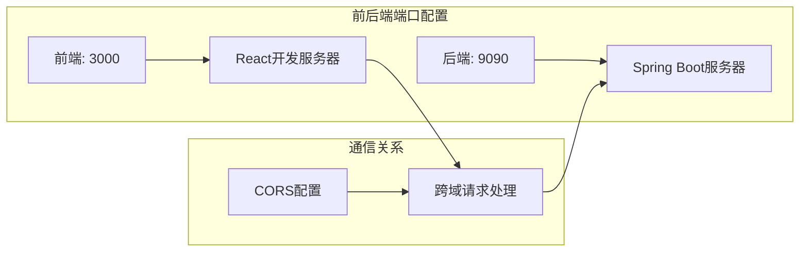
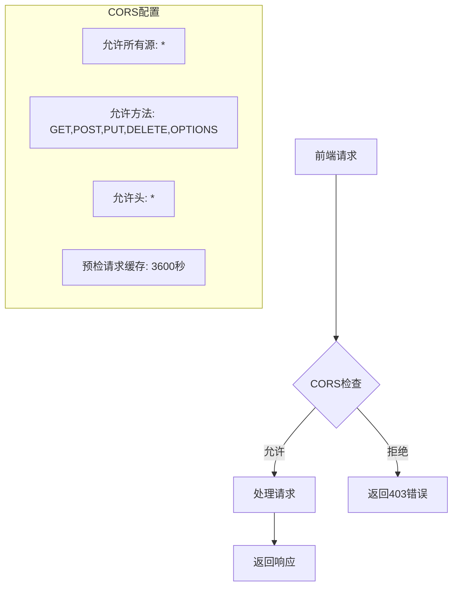

# 环境配置

<cite>
**本文档中引用的文件**
- [application.properties](file://src/main/resources/application.properties)
- [使用说明.md](file://使用说明.md)
- [pom.xml](file://pom.xml)
- [App.java](file://src/main/java/com/example/demo/App.java)
- [DBUtil.java](file://src/main/java/com/example/demo/dao/DBUtil.java)
- [WebConfig.java](file://src/main/java/com/example/demo/config/WebConfig.java)
- [orderService.js](file://frontend/src/services/orderService.js)
- [package.json](file://frontend/package.json)
</cite>

## 目录
1. [项目概述](#项目概述)
2. [核心配置文件详解](#核心配置文件详解)
3. [数据库配置分析](#数据库配置分析)
4. [端口配置与服务监听](#端口配置与服务监听)
5. [日志配置](#日志配置)
6. [跨域配置](#跨域配置)
7. [环境变量与配置修改指南](#环境变量与配置修改指南)
8. [端口占用注意事项](#端口占用注意事项)
9. [生产环境配置建议](#生产环境配置建议)
10. [故障排除指南](#故障排除指南)

## 项目概述

本项目是一个完整的全栈订单管理系统，采用Spring Boot后端和React前端架构。系统使用SQLite作为数据库，提供RESTful API接口进行订单管理。

### 技术栈概览

- **后端**: Spring Boot 2.7.14 (Java 8)
- **前端**: React 19.2.0
- **数据库**: SQLite
- **构建工具**: Maven
- **包管理**: npm

**章节来源**
- [使用说明.md](file://使用说明.md#L1-L10)
- [pom.xml](file://pom.xml#L1-L50)

## 核心配置文件详解

### application.properties配置解析

项目的核心配置文件位于`src/main/resources/application.properties`，包含了应用程序的基本配置信息。



**图表来源**
- [application.properties](file://src/main/resources/application.properties#L1-L5)

#### 配置项详细说明

| 配置项 | 值 | 作用 | 修改建议 |
|--------|-----|------|----------|
| `server.port` | 9090 | 指定后端服务监听端口 | 开发环境可改为8080，避免与前端冲突 |
| `spring.application.name` | order-management-system | 应用程序名称 | 通常无需修改 |
| `logging.level.com.example.demo` | INFO | 自定义包的日志级别 | 生产环境可调整为WARN或ERROR |

**章节来源**
- [application.properties](file://src/main/resources/application.properties#L1-L5)

## 数据库配置分析

### SQLite数据库连接配置

项目使用SQLite作为嵌入式数据库，配置方式如下：



**图表来源**
- [DBUtil.java](file://src/main/java/com/example/demo/dao/DBUtil.java#L10-L18)

#### 数据库配置特点

1. **连接字符串格式**: `jdbc:sqlite:test.db`
   - `jdbc:`: JDBC协议标识
   - `sqlite:`: SQLite数据库驱动
   - `test.db`: 数据库文件名

2. **文件位置**: 项目根目录下的`test.db`文件
   - 实际部署时可能需要调整为`orders.db`
   - 数据持久化存储，重启后数据不丢失

3. **连接管理**: 使用静态常量维护连接URL
   - 便于统一管理和修改
   - 支持集中式的连接配置

**章节来源**
- [DBUtil.java](file://src/main/java/com/example/demo/dao/DBUtil.java#L1-L19)

## 端口配置与服务监听

### 后端服务端口配置

#### 当前配置
- **默认端口**: 9090
- **配置位置**: `application.properties`
- **实际监听地址**: `http://localhost:9090`

#### 前端服务端口配置

前端React应用使用不同的端口：
- **默认端口**: 3000
- **配置位置**: `package.json`中的开发服务器
- **实际监听地址**: `http://localhost:3000`



**图表来源**
- [orderService.js](file://frontend/src/services/orderService.js#L3)
- [WebConfig.java](file://src/main/java/com/example/demo/config/WebConfig.java#L19-L23)

**章节来源**
- [orderService.js](file://frontend/src/services/orderService.js#L1-L49)
- [使用说明.md](file://使用说明.md#L16-L18)

## 日志配置

### 日志级别配置

项目采用分包级别的日志控制策略：

#### 配置详情
- **包级别**: `com.example.demo`
- **日志级别**: `INFO`
- **配置语法**: `logging.level.<包名>=<级别>`

#### 日志级别说明

| 级别 | 用途 | 输出内容 |
|------|------|----------|
| ERROR | 错误信息 | 系统错误、异常堆栈 |
| WARN | 警告信息 | 潜在问题、性能警告 |
| INFO | 一般信息 | 业务流程、状态变更 |
| DEBUG | 调试信息 | 详细执行过程 |
| TRACE | 跟踪信息 | 最详细的执行跟踪 |

#### 日志配置优化建议

1. **开发环境**: 保持INFO级别，便于调试
2. **测试环境**: 可适当降低到DEBUG级别
3. **生产环境**: 建议调整为WARN或ERROR级别

**章节来源**
- [application.properties](file://src/main/resources/application.properties#L5)

## 跨域配置

### CORS配置详解

项目通过WebConfig类配置跨域资源共享(CORS)，支持前端与后端的跨域通信。



**图表来源**
- [WebConfig.java](file://src/main/java/com/example/demo/config/WebConfig.java#L19-L23)

#### CORS配置特点

1. **通配符配置**: 允许所有域名访问
2. **方法支持**: 完整的HTTP方法支持
3. **头部支持**: 允许所有请求头部
4. **预检缓存**: 3600秒缓存时间

**章节来源**
- [WebConfig.java](file://src/main/java/com/example/demo/config/WebConfig.java#L1-L28)

## 环境变量与配置修改指南

### 配置修改步骤

#### 1. 修改后端端口配置

**修改文件**: `src/main/resources/application.properties`

```properties
# 修改前
server.port=9090

# 修改后（推荐开发环境使用8080）
server.port=8080
```

#### 2. 修改数据库连接配置

**修改文件**: `src/main/java/com/example/demo/dao/DBUtil.java`

```java
// 修改前
private static final String URL = "jdbc:sqlite:test.db";

// 修改后（生产环境推荐使用orders.db）
private static final String URL = "jdbc:sqlite:orders.db";
```

#### 3. 修改前端API地址

**修改文件**: `frontend/src/services/orderService.js`

```javascript
// 修改前
const API_BASE_URL = 'http://localhost:9090/api';

// 修改后（如果后端端口改变）
const API_BASE_URL = 'http://localhost:8080/api';
```

### 配置模板

#### 开发环境配置
```properties
# 开发环境配置
server.port=8080
spring.application.name=order-management-dev
logging.level.com.example.demo=DEBUG
```

#### 生产环境配置
```properties
# 生产环境配置
server.port=9090
spring.application.name=order-management-prod
logging.level.com.example.demo=WARN
```

## 端口占用注意事项

### 关键端口说明

根据使用说明文档，系统依赖以下关键端口：

| 端口号 | 用途 | 占用风险 | 解决方案 |
|--------|------|----------|----------|
| 8080 | 后端开发端口 | 中等 | 修改application.properties |
| 9090 | 后端生产端口 | 低 | 默认无需修改 |
| 3000 | 前端开发端口 | 高 | 修改package.json或使用PORT环境变量 |

### 端口冲突检测与解决

#### 检测方法

1. **Windows系统**:
   ```cmd
   netstat -ano | findstr :8080
   ```

2. **Linux/Mac系统**:
   ```bash
   lsof -i :8080
   ```

#### 解决策略

1. **临时解决方案**:
   - 修改配置文件中的端口号
   - 使用命令行参数指定端口

2. **永久解决方案**:
   - 统一团队的端口分配
   - 使用端口映射工具

**章节来源**
- [使用说明.md](file://使用说明.md#L169-L170)

## 生产环境配置建议

### 安全配置

#### 1. 端口安全
```properties
# 生产环境建议使用非标准端口
server.port=8080
```

#### 2. 日志级别优化
```properties
# 生产环境降低日志级别
logging.level.root=WARN
logging.level.com.example.demo=ERROR
```

#### 3. 数据库安全
```properties
# 使用绝对路径确保数据库安全
spring.datasource.url=jdbc:sqlite:/var/lib/orders/orders.db
```

### 性能优化配置

#### 连接池配置
```properties
# 配置数据库连接池（如果需要）
spring.datasource.hikari.maximum-pool-size=10
spring.datasource.hikari.minimum-idle=2
spring.datasource.hikari.idle-timeout=30000
spring.datasource.hikari.pool-name=OrdersPool
```

#### JVM参数优化
```bash
# 推荐的JVM参数
java -Xms512m -Xmx1024m -jar demo.jar
```

### 监控配置

#### Actuator端点配置
```properties
# 启用监控端点
management.endpoints.web.exposure.include=health,info,metrics
management.endpoint.health.show-details=when-authorized
```

## 故障排除指南

### 常见配置问题

#### 1. 端口占用问题

**症状**: 应用启动失败，提示端口已被占用
**解决方案**:
```bash
# 检查端口占用
netstat -anp | grep 8080  # Linux/Mac
netstat -ano | findstr :8080  # Windows

# 杀死占用进程
kill -9 <PID>  # Linux/Mac
taskkill /PID <PID> /F  # Windows
```

#### 2. 数据库连接失败

**症状**: 应用启动时报数据库连接错误
**解决方案**:
1. 检查数据库文件是否存在
2. 验证文件权限
3. 确认数据库驱动版本兼容性

#### 3. 跨域请求失败

**症状**: 前端无法访问后端API
**解决方案**:
1. 检查CORS配置是否正确
2. 验证前端API地址是否匹配
3. 确认防火墙设置

### 配置验证清单

#### 启动前检查
- [ ] 确认端口未被占用
- [ ] 检查数据库文件权限
- [ ] 验证网络连接
- [ ] 确认环境变量设置

#### 启动后验证
- [ ] 访问健康检查接口
- [ ] 测试API功能
- [ ] 检查日志输出
- [ ] 验证数据库连接

**章节来源**
- [使用说明.md](file://使用说明.md#L169-L173)

## 总结

本项目的配置设计遵循了Spring Boot的最佳实践，提供了灵活且易于维护的配置体系。通过合理配置端口、数据库连接、日志级别和跨域策略，确保了系统的稳定运行和良好的开发体验。

在实际部署过程中，建议根据具体环境需求调整配置参数，并建立完善的监控和日志机制，以保障系统的可靠性和可维护性。