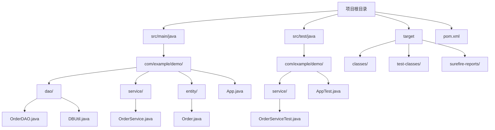
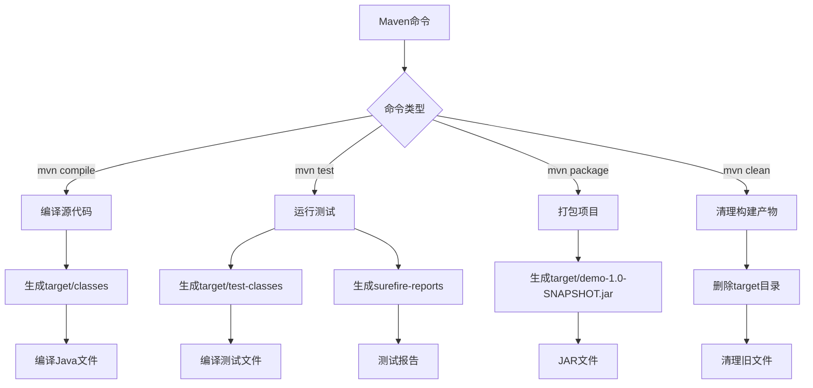
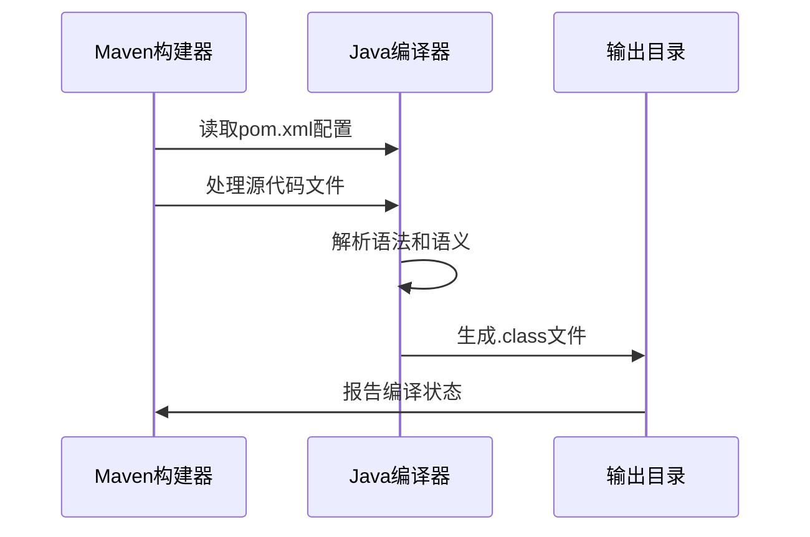
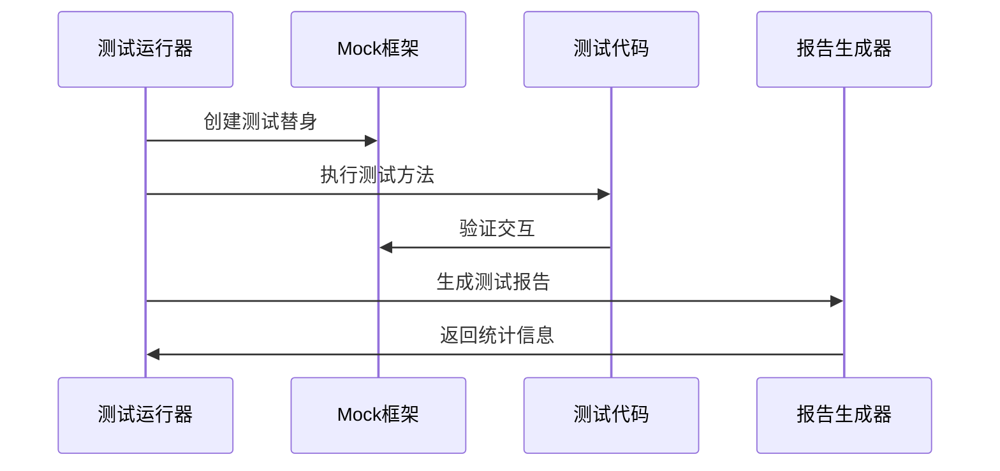
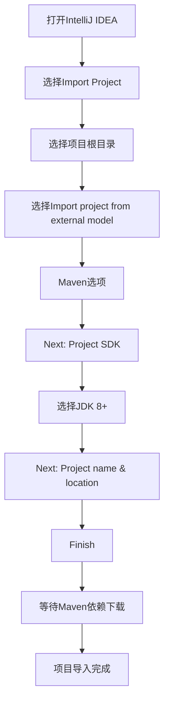

# Java开发环境配置指南

<cite>
**本文档引用的文件**
- [pom.xml](file://pom.xml)
- [README.md](file://README.md)
- [App.java](file://src/main/java/com/example/demo/App.java)
- [AppTest.java](file://src/test/java/com/example/demo/AppTest.java)
- [OrderService.java](file://src/main/java/com/example/demo/service/OrderService.java)
- [OrderDAO.java](file://src/main/java/com/example/demo/dao/OrderDAO.java)
- [Order.java](file://src/main/java/com/example/demo/entity/Order.java)
- [OrderServiceTest.java](file://src/test/java/com/example/demo/service/OrderServiceTest.java)
- [demo.iml](file://demo.iml)
</cite>

## 目录
1. [项目概述](#项目概述)
2. [系统要求](#系统要求)
3. [JDK安装与配置](#jdk安装与配置)
4. [Maven环境配置](#maven环境配置)
5. [项目结构解析](#项目结构解析)
6. [pom.xml配置详解](#pomxml配置详解)
7. [Maven构建命令](#maven构建命令)
8. [IDE导入配置](#ide导入配置)
9. [常见问题排查](#常见问题排查)
10. [最佳实践建议](#最佳实践建议)

## 项目概述

本项目是一个基于Java 8的Maven多模块项目，采用分层架构设计，包含以下核心组件：
- **数据访问层（DAO）**：使用SQLite数据库进行数据持久化
- **业务逻辑层（Service）**：处理订单业务逻辑和规则验证
- **实体模型层（Entity）**：定义订单相关数据模型
- **测试层**：包含单元测试和集成测试

项目展示了典型的Maven项目结构，包含标准的`src/main/java`和`src/test/java`目录，以及自动生成的`target`输出目录。

## 系统要求

### 最低系统要求
- **操作系统**：Windows 10+/macOS 10.14+/Linux
- **内存**：至少2GB RAM
- **磁盘空间**：至少500MB可用空间

### 必需软件
- **JDK 8+**：Java开发工具包
- **Maven 3.6+**：项目构建和依赖管理工具
- **IDE**：IntelliJ IDEA或Eclipse（推荐）

## JDK安装与配置

### Windows系统安装

1. **下载JDK**
   - 访问Oracle官网或OpenJDK官方下载页面
   - 下载对应Windows系统的JDK安装包（建议使用JDK 17 LTS）

2. **安装JDK**
   ```cmd
   # 运行下载的安装包
   # 安装路径示例：C:\Program Files\Java\jdk-17
   ```

3. **配置环境变量**
   ```cmd
   # 设置JAVA_HOME
   set JAVA_HOME=C:\Program Files\Java\jdk-17
   
   # 添加到PATH
   set PATH=%JAVA_HOME%\bin;%PATH%
   ```

4. **验证安装**
   ```cmd
   java -version
   javac -version
   ```

### macOS系统安装

1. **使用Homebrew安装**
   ```bash
   brew install openjdk@17
   ```

2. **手动安装**
   - 下载macOS版本的JDK安装包
   - 挂载并运行安装程序

3. **配置环境变量**
   ```bash
   # 编辑 ~/.zshrc 或 ~/.bash_profile
   export JAVA_HOME=/Library/Java/JavaVirtualMachines/openjdk-17.jdk/Contents/Home
   export PATH=$JAVA_HOME/bin:$PATH
   ```

4. **验证安装**
   ```bash
   java -version
   javac -version
   ```

### Linux系统安装

1. **Ubuntu/Debian**
   ```bash
   sudo apt update
   sudo apt install openjdk-17-jdk
   ```

2. **CentOS/RHEL**
   ```bash
   sudo yum install java-17-openjdk-devel
   ```

3. **验证安装**
   ```bash
   java -version
   javac -version
   ```

**章节来源**
- [App.java](file://src/main/java/com/example/demo/App.java#L1-L62)
- [OrderService.java](file://src/main/java/com/example/demo/service/OrderService.java#L1-L81)

## Maven环境配置

### Maven安装

1. **下载Maven**
   - 访问Apache Maven官网下载页面
   - 下载二进制zip/tar.gz压缩包

2. **解压安装**
   ```bash
   # Linux/macOS
   tar -xzf apache-maven-3.8.8-bin.tar.gz
   sudo mv apache-maven-3.8.8 /opt/maven
   
   # Windows
   # 解压到C:\Program Files\Maven
   ```

3. **配置环境变量**
   ```bash
   # Linux/macOS
   export MAVEN_HOME=/opt/maven
   export PATH=$MAVEN_HOME/bin:$PATH
   
   # Windows
   set M2_HOME=C:\Program Files\Maven
   set PATH=%M2_HOME%\bin;%PATH%
   ```

4. **验证安装**
   ```bash
   mvn -v
   ```

### Maven仓库配置

1. **本地仓库位置**
   - 默认位置：`~/.m2/repository`
   - 可在`~/.m2/settings.xml`中自定义

2. **镜像配置**
   在`~/.m2/settings.xml`中添加阿里云镜像：
   ```xml
   <mirrors>
       <mirror>
           <id>aliyun</id>
           <name>Aliyun Maven</name>
           <url>https://maven.aliyun.com/repository/public</url>
           <mirrorOf>central</mirrorOf>
       </mirror>
   </mirrors>
   ```

**章节来源**
- [pom.xml](file://pom.xml#L1-L64)

## 项目结构解析

### 标准Maven目录结构



**图表来源**
- [App.java](file://src/main/java/com/example/demo/App.java#L1-L62)
- [OrderService.java](file://src/main/java/com/example/demo/service/OrderService.java#L1-L81)
- [OrderDAO.java](file://src/main/java/com/example/demo/dao/OrderDAO.java#L1-L148)

### 目录结构说明

| 目录 | 用途 | 包含内容 |
|------|------|----------|
| `src/main/java` | 主要源代码 | 应用程序的核心业务逻辑、数据访问层、实体模型 |
| `src/test/java` | 测试代码 | 单元测试、集成测试、测试工具类 |
| `src/main/resources` | 资源文件 | 配置文件、SQL脚本、静态资源 |
| `src/test/resources` | 测试资源 | 测试专用配置文件、测试数据 |
| `target` | 构建输出 | 编译后的类文件、打包的JAR/WAR文件 |

### 关键文件说明

| 文件类型 | 示例 | 功能描述 |
|----------|------|----------|
| 实体类 | `Order.java` | 定义订单数据模型和业务属性 |
| DAO类 | `OrderDAO.java` | 数据访问接口，负责数据库操作 |
| Service类 | `OrderService.java` | 业务逻辑处理，包含业务规则验证 |
| 主程序 | `App.java` | 应用程序入口点，演示完整业务流程 |
| 测试类 | `OrderServiceTest.java` | 单元测试，验证业务逻辑正确性 |

**章节来源**
- [Order.java](file://src/main/java/com/example/demo/entity/Order.java#L1-L143)
- [OrderDAO.java](file://src/main/java/com/example/demo/dao/OrderDAO.java#L1-L148)
- [OrderService.java](file://src/main/java/com/example/demo/service/OrderService.java#L1-L81)

## pom.xml配置详解

### 项目基本信息

```xml
<groupId>com.example</groupId>
<artifactId>demo</artifactId>
<version>1.0-SNAPSHOT</version>
<packaging>jar</packaging>
```

**配置说明：**
- **groupId**: 组织标识符，通常使用反向域名格式
- **artifactId**: 项目名称，用于区分同一组织下的不同项目
- **version**: 版本号，SNAPSHOT表示开发中的版本
- **packaging**: 打包类型，这里使用JAR格式

### 编译配置

```xml
<properties>
    <maven.compiler.source>1.8</maven.compiler.source>
    <maven.compiler.target>1.8</maven.compiler.target>
</properties>
```

**配置说明：**
- 指定Java编译版本为1.8
- 确保代码兼容Java 8及更高版本

### 依赖管理

#### JUnit 5测试框架
```xml
<dependency>
    <groupId>org.junit.jupiter</groupId>
    <artifactId>junit-jupiter-api</artifactId>
    <version>5.8.1</version>
    <scope>test</scope>
</dependency>
<dependency>
    <groupId>org.junit.jupiter</groupId>
    <artifactId>junit-jupiter-engine</artifactId>
    <version>5.8.1</version>
    <scope>test</scope>
</dependency>
```

**功能说明：**
- 提供现代化的测试API和断言功能
- 支持参数化测试、条件测试等高级特性
- 与Mockito集成良好

#### Mockito模拟框架
```xml
<dependency>
    <groupId>org.mockito</groupId>
    <artifactId>mockito-core</artifactId>
    <version>4.6.1</version>
    <scope>test</scope>
</dependency>
```

**功能说明：**
- 用于创建测试替身对象
- 支持方法调用验证和行为模拟
- 提高单元测试的独立性和可维护性

#### SQLite JDBC驱动
```xml
<dependency>
    <groupId>org.xerial</groupId>
    <artifactId>sqlite-jdbc</artifactId>
    <version>3.36.0.3</version>
</dependency>
```

**功能说明：**
- 提供SQLite数据库的JDBC驱动支持
- 支持嵌入式数据库操作
- 适合轻量级应用和测试场景

#### Java 8时间API支持
```xml
<dependency>
    <groupId>org.jetbrains</groupId>
    <artifactId>annotations</artifactId>
    <version>24.0.0</version>
</dependency>
```

**功能说明：**
- 提供Java 8时间API的注解支持
- 帮助开发者避免空指针异常
- 提高代码的可读性和安全性

### 构建插件配置

```xml
<build>
    <plugins>
        <plugin>
            <groupId>org.apache.maven.plugins</groupId>
            <artifactId>maven-surefire-plugin</artifactId>
            <version>3.0.0-M7</version>
        </plugin>
    </plugins>
</build>
```

**配置说明：**
- `maven-surefire-plugin`：用于执行单元测试
- 自动发现和运行JUnit 5测试
- 生成测试报告和统计信息

**章节来源**
- [pom.xml](file://pom.xml#L1-L64)

## Maven构建命令

### 基本构建流程



**图表来源**
- [pom.xml](file://pom.xml#L45-L52)

### 常用Maven命令

#### 1. 清理构建
```bash
# 清除target目录
mvn clean
```

**作用：**
- 删除`target`目录及其所有内容
- 清理编译生成的类文件和打包文件
- 确保从头开始构建

#### 2. 编译项目
```bash
# 编译主代码
mvn compile

# 编译测试代码
mvn test-compile
```

**作用：**
- 编译`src/main/java`中的Java文件
- 生成`target/classes`目录
- 编译`src/test/java`中的测试文件
- 生成`target/test-classes`目录

#### 3. 运行测试
```bash
# 运行所有测试
mvn test

# 只运行特定测试类
mvn test -Dtest=OrderServiceTest

# 排除特定测试类
mvn test -Dexcludes=**/AppTest.java
```

**作用：**
- 执行所有JUnit测试
- 生成测试报告到`target/surefire-reports`
- 显示测试覆盖率和失败详情

#### 4. 打包项目
```bash
# 打包为JAR文件
mvn package

# 跳过测试打包
mvn package -DskipTests

# 生成可执行JAR
mvn package assembly:single
```

**作用：**
- 根据`pom.xml`中的配置打包
- 生成`target/demo-1.0-SNAPSHOT.jar`
- 包含所有依赖（如果配置了打包方式）

#### 5. 安装到本地仓库
```bash
# 安装到本地Maven仓库
mvn install
```

**作用：**
- 将项目安装到本地Maven仓库
- 其他项目可以引用此依赖
- 便于模块化开发

### 构建过程详解

#### 编译阶段（Compile Phase）


**图表来源**
- [App.java](file://src/main/java/com/example/demo/App.java#L1-L62)
- [OrderService.java](file://src/main/java/com/example/demo/service/OrderService.java#L1-L81)

#### 测试阶段（Test Phase）


**图表来源**
- [OrderServiceTest.java](file://src/test/java/com/example/demo/service/OrderServiceTest.java#L1-L313)

**章节来源**
- [App.java](file://src/main/java/com/example/demo/App.java#L1-L62)
- [OrderServiceTest.java](file://src/test/java/com/example/demo/service/OrderServiceTest.java#L1-L313)

## IDE导入配置

### IntelliJ IDEA配置

#### 1. 导入Maven项目


**图表来源**
- [demo.iml](file://demo.iml#L1-L26)

#### 2. 配置项目设置
- **项目SDK**：确保使用JDK 8+
- **语言级别**：设置为1.8
- **编码格式**：统一设置为UTF-8

#### 3. Maven配置
- **Maven home directory**：使用内置Maven或指定外部Maven
- **User settings file**：配置`settings.xml`路径
- **Local repository**：指定本地仓库位置

#### 4. 编码格式设置
```xml
<!-- 在项目的根目录创建或编辑 .idea/codeStyles/Project.xml -->
<code_scheme name="Project">
    <option name="USE_PER_PROJECT_SETTINGS" value="true" />
    <JavaCodeStyleSettings>
        <option name="CLASS_COUNT_TO_USE_IMPORT_ON_DEMAND" value="999" />
        <option name="NAMES_COUNT_TO_USE_IMPORT_ON_DEMAND" value="999" />
    </JavaCodeStyleSettings>
    <XML>
        <option name="XML_LEGACY_SETTINGS_APPLIED" value="true" />
    </XML>
    <codeStyleSettings language="JAVA">
        <option name="LINE_SEPARATOR" value="&#10;" />
        <option name="KEEP_BLANK_LINES_IN_CODE" value="1" />
        <option name="SPACE_BEFORE_METHOD_PARENTHESES" value="true" />
        <option name="FORMATTER_TAGS_ENABLED" value="true" />
    </codeStyleSettings>
</code_scheme>
```

### Eclipse配置

#### 1. 导入Maven项目
```bash
# 方法一：直接导入
File -> Import -> Existing Maven Projects

# 方法二：命令行导入
cd 项目根目录
mvn eclipse:eclipse
```

#### 2. 配置项目属性
- **Java Build Path**：检查源代码路径和库依赖
- **Java Compiler**：设置编译器版本为1.8
- **Resource**：设置文本文件编码为UTF-8

#### 3. 插件配置
- **Maven Integration**：确保安装Maven插件
- **Git Integration**：如果需要版本控制支持

### 通用配置建议

#### 1. 编码格式统一
```properties
# 在项目的根目录创建 .editorconfig 文件
root = true

[*.{java,xml}]
charset = utf-8
indent_style = space
indent_size = 4
end_of_line = lf
insert_final_newline = true
trim_trailing_whitespace = true
```

#### 2. 版本控制配置
```gitignore
# Maven相关
/target/
!/src/main/resources/**
!/src/test/resources/**

# IDE相关
.idea/
*.iml
*.ipr
*.iws

# 临时文件
*.log
*.tmp
```

**章节来源**
- [demo.iml](file://demo.iml#L1-L26)

## 常见问题排查

### 依赖下载失败

#### 问题现象
```bash
[ERROR] Failed to execute goal on project demo: 
Could not resolve dependencies for project com.example:demo:jar:1.0-SNAPSHOT: 
Failed to collect dependencies at org.junit.jupiter:junit-jupiter-api:jar:5.8.1
```

#### 解决方案

1. **检查网络连接**
   ```bash
   # 测试Maven中央仓库连通性
   curl -I https://repo1.maven.org/maven2/
   ```

2. **配置国内镜像**
   ```xml
   <!-- 在 ~/.m2/settings.xml 中添加 -->
   <mirrors>
       <mirror>
           <id>aliyun</id>
           <name>Aliyun Maven</name>
           <url>https://maven.aliyun.com/repository/public</url>
           <mirrorOf>central</mirrorOf>
       </mirror>
   </mirrors>
   ```

3. **强制更新依赖**
   ```bash
   # 强制重新下载所有依赖
   mvn clean install -U
   
   # 只更新特定依赖
   mvn dependency:resolve
   ```

### 版本冲突问题

#### 问题现象
```bash
[WARNING] Multiple dependencies with the same groupId:artifactId but different versions
```

#### 解决方案

1. **使用dependencyManagement**
   ```xml
   <dependencyManagement>
       <dependencies>
           <dependency>
               <groupId>org.junit.jupiter</groupId>
               <artifactId>junit-jupiter</artifactId>
               <version>5.8.1</version>
           </dependency>
       </dependencies>
   </dependencyManagement>
   ```

2. **排除传递依赖**
   ```xml
   <dependency>
       <groupId>org.springframework.boot</groupId>
       <artifactId>spring-boot-starter</artifactId>
       <exclusions>
           <exclusion>
               <groupId>org.springframework.boot</groupId>
               <artifactId>spring-boot-starter-logging</artifactId>
           </exclusion>
       </exclusions>
   </dependency>
   ```

### 编译错误

#### 问题现象
```bash
[ERROR] Failed to compile due to missing JDK classes
```

#### 解决方案

1. **检查JDK版本**
   ```bash
   # 确认JDK版本匹配
   java -version
   javac -version
   
   # 检查环境变量
   echo $JAVA_HOME
   ```

2. **调整编译器设置**
   ```xml
   <properties>
       <maven.compiler.source>1.8</maven.compiler.source>
       <maven.compiler.target>1.8</maven.compiler.target>
       <maven.compiler.release>8</maven.compiler.release>
   </properties>
   ```

### 测试失败

#### 问题现象
```bash
[ERROR] Tests run: 10, Failures: 3, Errors: 0, Skipped: 0
```

#### 解决方案

1. **检查测试环境**
   ```bash
   # 确保测试数据库可用
   sqlite3 target/test.db
   ```

2. **调试测试代码**
   ```bash
   # 运行单个测试类
   mvn test -Dtest=com.example.demo.OrderServiceTest
   
   # 详细日志输出
   mvn test -X
   ```

### 内存不足

#### 问题现象
```bash
[ERROR] Java heap space
```

#### 解决方案

1. **增加Maven内存**
   ```bash
   # Linux/macOS
   export MAVEN_OPTS="-Xmx1024m -XX:MaxPermSize=512m"
   
   # Windows
   set MAVEN_OPTS=-Xmx1024m -XX:MaxPermSize=512m
   ```

2. **优化构建配置**
   ```xml
   <plugin>
       <groupId>org.apache.maven.plugins</groupId>
       <artifactId>maven-surefire-plugin</artifactId>
       <version>3.0.0-M7</version>
       <configuration>
           <argLine>-Xmx512m</argLine>
       </configuration>
   </plugin>
   ```

## 最佳实践建议

### 项目结构优化

1. **模块化设计**
   - 将大型项目拆分为多个Maven模块
   - 使用父子POM管理公共配置
   - 遵循单一职责原则

2. **命名规范**
   ```java
   // 包名：使用反向域名格式
   package com.example.project.module
   
   // 类名：使用PascalCase
   public class OrderService
   
   // 方法名：使用camelCase
   public void createOrder(Order order)
   
   // 常量：使用UPPER_SNAKE_CASE
   public static final int MAX_ORDER_COUNT = 100
   ```

### 依赖管理策略

1. **版本控制**
   ```xml
   <!-- 使用BOM管理版本 -->
   <dependencyManagement>
       <dependencies>
           <dependency>
               <groupId>org.springframework.boot</groupId>
               <artifactId>spring-boot-dependencies</artifactId>
               <version>2.7.0</version>
               <type>pom</type>
               <scope>import</scope>
           </dependency>
       </dependencies>
   </dependencyManagement>
   ```

2. **依赖范围控制**
   ```xml
   <!-- 开发工具仅用于测试 -->
   <dependency>
       <groupId>org.projectlombok</groupId>
       <artifactId>lombok</artifactId>
       <version>1.18.24</version>
       <scope>provided</scope>
   </dependency>
   ```

### 构建优化

1. **并行构建**
   ```bash
   # 启用并行构建
   mvn clean install -T 4
   ```

2. **跳过测试**
   ```bash
   # 生产环境跳过测试
   mvn clean package -DskipTests
   
   # 开发环境保留测试
   mvn clean package
   ```

### 测试策略

1. **测试分类**
   ```java
   // 单元测试
   @Test
   void testCreateOrder_ValidInput_ShouldReturnTrue()
   
   // 集成测试
   @SpringBootTest
   void testOrderService_WithDatabase_ShouldPersistOrder()
   
   // 性能测试
   @RepeatedTest(100)
   void testOrderCreation_Performance_ShouldBeAcceptable()
   ```

2. **测试数据管理**
   ```java
   // 使用测试工厂模式
   public class TestDataFactory {
       public static Order createValidOrder() {
           return new Order("O001", "U100", "P200", 2, BigDecimal.TEN);
       }
   }
   ```

### 持续集成配置

1. **GitHub Actions**
   ```yaml
   name: Java CI
   
   on: [push, pull_request]
   
   jobs:
     build:
       runs-on: ubuntu-latest
       
       steps:
       - uses: actions/checkout@v2
       - name: Set up JDK 17
         uses: actions/setup-java@v2
         with:
           java-version: '17'
           distribution: 'temurin'
       - name: Build with Maven
         run: mvn clean package
   ```

2. **质量门禁**
   ```xml
   <!-- 集成SonarQube -->
   <plugin>
       <groupId>org.sonarsource.scanner.maven</groupId>
       <artifactId>sonar-maven-plugin</artifactId>
       <version>3.9.1.2184</version>
   </plugin>
   ```

通过遵循这些最佳实践，您可以构建更加健壮、可维护和高效的Java应用程序。定期审查和优化您的项目配置，确保团队开发效率和代码质量。