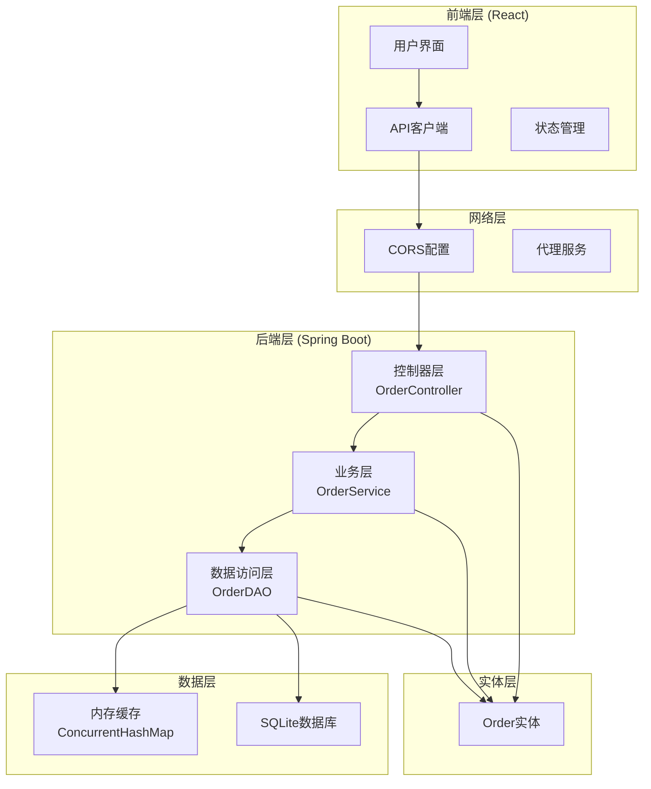
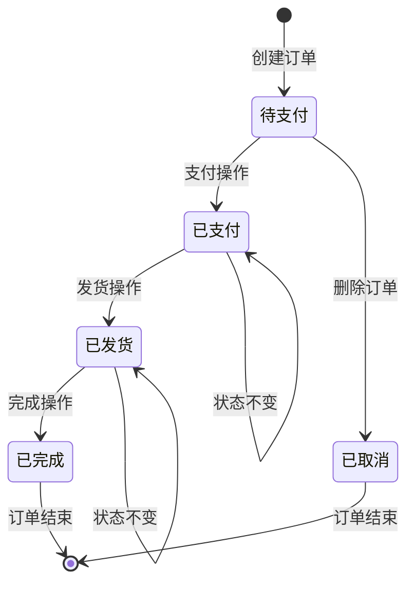
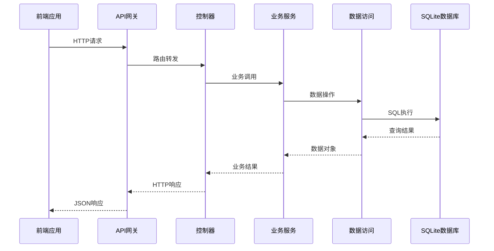
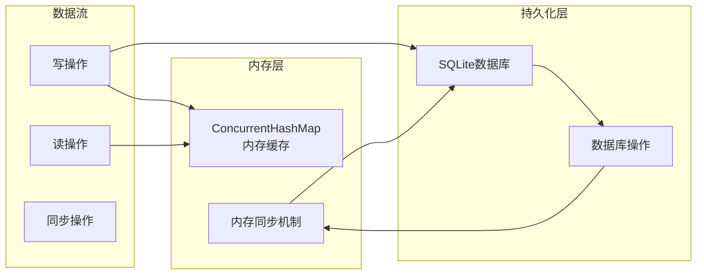
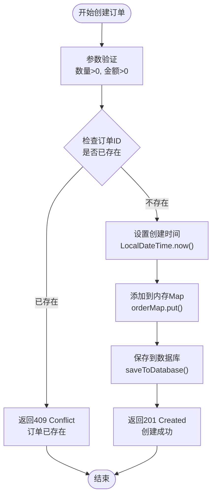

# 系统概述

<cite>
**本文档中引用的文件**
- [README.md](file://README.md)
- [DesignDoc1110.md](file://DesignDoc1110.md)
- [API1111.md](file://API1111.md)
- [pom.xml](file://pom.xml)
- [frontend/README.md](file://frontend/README.md)
- [src/main/java/com/example/demo/App.java](file://src/main/java/com/example/demo/App.java)
- [src/main/java/com/example/demo/controller/OrderController.java](file://src/main/java/com/example/demo/controller/OrderController.java)
- [src/main/java/com/example/demo/service/OrderService.java](file://src/main/java/com/example/demo/service/OrderService.java)
- [src/main/java/com/example/demo/dao/OrderDAO.java](file://src/main/java/com/example/demo/dao/OrderDAO.java)
- [src/main/java/com/example/demo/entity/Order.java](file://src/main/java/com/example/demo/entity/Order.java)
- [frontend/src/App.js](file://frontend/src/App.js)
- [frontend/src/services/orderService.js](file://frontend/src/services/orderService.js)
- [src/main/resources/application.properties](file://src/main/resources/application.properties)
</cite>

## 目录
1. [项目简介](#项目简介)
2. [系统架构概览](#系统架构概览)
3. [核心功能特性](#核心功能特性)
4. [技术栈分析](#技术栈分析)
5. [前后端分离设计](#前后端分离设计)
6. [数据持久化方案](#数据持久化方案)
7. [业务流程分析](#业务流程分析)
8. [系统优势与特点](#系统优势与特点)
9. [适用场景与价值](#适用场景与价值)
10. [技术决策权衡](#技术决策权衡)

## 项目简介

0713demo1103由余晓在11月3日创建，是一个基于Spring Boot和React技术栈构建的全栈订单管理系统，专为中小型电商场景设计。该系统提供了完整的订单生命周期管理功能，包括订单的创建、查询、更新、删除以及按用户ID检索订单列表等核心业务功能。

### 项目定位
- **技术学习项目**：展示Spring Boot + React的前后端分离架构最佳实践
- **业务功能完整**：涵盖订单管理的核心业务场景
- **轻量级解决方案**：适合快速原型开发和小型项目部署

### 核心价值
- **教育意义**：为开发者提供完整的全栈项目参考
- **实用性**：满足基本的订单管理需求
- **可扩展性**：模块化设计便于功能扩展

**章节来源**
- [README.md](file://README.md#L1-L2)
- [DesignDoc1110.md](file://DesignDoc1110.md#L1-L50)

## 系统架构概览

### 整体架构设计

**图表来源**
- [DesignDoc1110.md](file://DesignDoc1110.md#L6-L66)
- [src/main/java/com/example/demo/controller/OrderController.java](file://src/main/java/com/example/demo/controller/OrderController.java#L1-L173)
- [src/main/java/com/example/demo/service/OrderService.java](file://src/main/java/com/example/demo/service/OrderService.java#L1-L114)
- [src/main/java/com/example/demo/dao/OrderDAO.java](file://src/main/java/com/example/demo/dao/OrderDAO.java#L1-L248)

### 层次化架构分析

系统采用经典的三层架构模式，实现了清晰的关注点分离：

#### 控制层 (Controller Layer)
- **职责**：处理HTTP请求和响应
- **实现**：`OrderController`提供RESTful API接口
- **特点**：参数验证、响应封装、异常处理

#### 业务层 (Service Layer)
- **职责**：实现核心业务逻辑
- **实现**：`OrderService`处理业务规则和数据校验
- **特点**：业务规则集中管理、事务边界控制

#### 数据访问层 (DAO Layer)
- **职责**：数据持久化操作
- **实现**：`OrderDAO`管理内存缓存和数据库交互
- **特点**：内存+数据库双重存储、线程安全

**章节来源**
- [DesignDoc1110.md](file://DesignDoc1110.md#L69-L88)

## 核心功能特性

### 订单管理功能矩阵

| 功能类别 | 功能名称 | API端点 | 描述 | 业务规则 |
|---------|---------|---------|------|----------|
| CRUD操作 | 创建订单 | POST `/api/orders` | 新建订单记录 | 数量>0, 金额>0, 不重复 |
| CRUD操作 | 查询订单 | GET `/api/orders/{orderId}` | 获取订单详情 | 订单存在性校验 |
| CRUD操作 | 更新订单 | PUT `/api/orders/{orderId}` | 修改订单信息 | 已完成订单不可修改 |
| CRUD操作 | 删除订单 | DELETE `/api/orders/{orderId}` | 删除订单记录 | 已支付订单不可删除 |
| 查询功能 | 获取所有订单 | GET `/api/orders` | 列出所有订单 | 按创建时间倒序 |
| 查询功能 | 按用户查询 | GET `/api/orders/user/{userId}` | 用户订单列表 | 精确匹配用户ID |

### 订单状态流转

**图表来源**
- [src/main/java/com/example/demo/service/OrderService.java](file://src/main/java/com/example/demo/service/OrderService.java#L63-L90)
- [frontend/src/App.js](file://frontend/src/App.js#L131-L173)

### 前端功能特性

- **实时连接检测**：自动检测后端服务可用性
- **智能表单验证**：金额自动计算、必填字段校验
- **状态化UI**：实时反映订单状态变化
- **批量操作**：支持按用户ID批量查询
- **响应式设计**：适配不同屏幕尺寸

**章节来源**
- [API1111.md](file://API1111.md#L334-L500)
- [frontend/src/App.js](file://frontend/src/App.js#L1-L427)

## 技术栈分析

### 后端技术栈

#### Spring Boot生态系统
- **核心框架**：Spring Boot 2.7.14
- **Web层**：Spring MVC + RESTful API
- **依赖注入**：基于注解的IoC容器
- **自动配置**：简化开发和部署

#### 数据库技术
- **存储引擎**：SQLite嵌入式数据库
- **JDBC驱动**：org.xerial:sqlite-jdbc
- **连接池**：内置HikariCP

#### 开发工具链
- **构建工具**：Maven 3.8+
- **测试框架**：JUnit 5 + Mockito
- **代码质量**：JaCoCo代码覆盖率

### 前端技术栈

#### React生态系统
- **核心框架**：React 17+
- **状态管理**：React Hooks (useState, useEffect)
- **HTTP客户端**：Axios
- **构建工具**：Create React App

#### 开发体验
- **热重载**：开发服务器自动刷新
- **类型安全**：TypeScript兼容
- **样式管理**：CSS Modules

**章节来源**
- [pom.xml](file://pom.xml#L1-L136)
- [frontend/README.md](file://frontend/README.md#L1-L71)

## 前后端分离设计

### 架构设计理念

系统采用严格的前后端分离架构，通过RESTful API进行通信：

**图表来源**
- [src/main/java/com/example/demo/controller/OrderController.java](file://src/main/java/com/example/demo/controller/OrderController.java#L35-L172)
- [frontend/src/services/orderService.js](file://frontend/src/services/orderService.js#L1-L49)

### API设计原则

#### RESTful规范遵循
- **资源导向**：以订单资源为中心的URL设计
- **HTTP方法语义**：正确使用GET、POST、PUT、DELETE
- **状态码规范**：标准HTTP状态码返回
- **幂等性保证**：GET、DELETE操作幂等，POST、PUT非幂等

#### 跨域资源共享 (CORS)
- **配置策略**：全局CORS允许所有域名访问
- **安全性考虑**：生产环境建议限制特定域名
- **预检请求**：支持复杂请求的OPTIONS预检

### 前端集成方案

#### API客户端封装
- **统一基地址**：`http://localhost:9090/api`
- **错误处理**：统一的错误响应处理
- **拦截器**：自动添加认证头和错误处理

#### 状态管理模式
- **本地状态**：React Hooks管理组件状态
- **异步数据**：Promise-based异步操作
- **错误边界**：组件级错误捕获和显示

**章节来源**
- [frontend/src/services/orderService.js](file://frontend/src/services/orderService.js#L1-L49)
- [src/main/java/com/example/demo/controller/OrderController.java](file://src/main/java/com/example/demo/controller/OrderController.java#L20-L21)

## 数据持久化方案

### 存储架构设计

系统采用内存+数据库的双重存储架构，实现了高性能和持久化的平衡：

**图表来源**
- [src/main/java/com/example/demo/dao/OrderDAO.java](file://src/main/java/com/example/demo/dao/OrderDAO.java#L18-L248)

### SQLite技术选型

#### 技术优势
- **零配置部署**：无需独立数据库服务器
- **文件级存储**：单个.db文件即可
- **跨平台兼容**：支持Windows、Linux、macOS
- **轻量级性能**：适合小规模数据存储

#### 应用场景适配
- **开发环境**：快速原型和本地测试
- **小型项目**：用户量少、数据量小的应用
- **边缘部署**：需要独立部署的场景

### 数据一致性保障

#### 内存同步机制
- **写入同步**：每次数据变更后立即同步到数据库
- **启动加载**：应用启动时从数据库加载所有数据
- **事务保证**：批量操作使用PreparedStatement批量提交

#### 并发安全保障
- **线程安全**：使用ConcurrentHashMap保证并发安全
- **原子操作**：数据库操作使用事务保证原子性
- **锁机制**：避免并发写入冲突

**章节来源**
- [src/main/java/com/example/demo/dao/OrderDAO.java](file://src/main/java/com/example/demo/dao/OrderDAO.java#L28-L158)

## 业务流程分析

### 订单创建流程

**图表来源**
- [src/main/java/com/example/demo/service/OrderService.java](file://src/main/java/com/example/demo/service/OrderService.java#L28-L38)
- [src/main/java/com/example/demo/dao/OrderDAO.java](file://src/main/java/com/example/demo/dao/OrderDAO.java#L165-L175)

### 订单状态管理

#### 状态转换规则
- **初始状态**：创建订单时默认为"待支付"(0)
- **支付流程**：点击"支付"按钮将状态改为"已支付"(1)
- **发货流程**：点击"发货"按钮将状态改为"已发货"(2)
- **完成流程**：点击"完成"按钮将状态改为"已完成"(3)
- **取消流程**：删除订单时标记为"已取消"(4)

#### 状态约束规则
- **不可逆状态**：已完成订单不能修改状态
- **删除限制**：已支付订单不能删除
- **状态验证**：所有状态变更都需要有效性验证

### 数据查询优化

#### 查询策略
- **内存优先**：所有查询首先在内存中进行
- **索引利用**：订单ID作为主键，查询效率高
- **分页支持**：大数据量场景下的分页查询
- **排序规则**：按创建时间倒序排列，最新订单优先

#### 性能优化措施
- **批量操作**：数据库操作使用批量插入/更新
- **连接复用**：数据库连接池管理
- **缓存策略**：内存缓存减少数据库访问

**章节来源**
- [src/main/java/com/example/demo/service/OrderService.java](file://src/main/java/com/example/demo/service/OrderService.java#L63-L90)
- [src/main/java/com/example/demo/dao/OrderDAO.java](file://src/main/java/com/example/demo/dao/OrderDAO.java#L214-L247)

## 系统优势与特点

### 技术优势

#### 开发效率
- **快速启动**：Spring Boot自动配置，开箱即用
- **热部署**：前后端分离，支持热重载
- **类型安全**：强类型语言保证代码质量
- **测试友好**：完善的单元测试和集成测试支持

#### 维护性
- **模块化设计**：清晰的分层架构
- **依赖注入**：松耦合的组件设计
- **日志记录**：完整的操作日志
- **异常处理**：统一的错误处理机制

### 功能完整性

#### 核心功能覆盖
- **基础CRUD**：完整的增删改查操作
- **业务规则**：订单状态流转和约束
- **查询功能**：灵活的订单查询方式
- **状态管理**：完整的订单生命周期

#### 用户体验
- **实时反馈**：操作结果即时提示
- **智能验证**：前端表单验证和后端校验
- **响应式设计**：适配各种设备屏幕
- **错误恢复**：网络异常时的重试机制

### 部署便利性

#### 零依赖部署
- **自包含应用**：Spring Boot可执行JAR
- **单一文件**：SQLite数据库文件
- **简单配置**：少量配置文件
- **跨平台支持**：支持主流操作系统

**章节来源**
- [DesignDoc1110.md](file://DesignDoc1110.md#L447-L490)

## 适用场景与价值

### 目标用户群体

#### 技术团队
- **初学者学习**：Spring Boot和React技术栈学习
- **项目参考**：全栈项目架构参考
- **原型开发**：快速验证业务想法
- **技术交流**：开源项目贡献和学习

#### 业务团队
- **电商运营**：订单管理日常操作
- **产品管理**：订单流程优化
- **数据分析**：订单数据统计分析
- **客户支持**：订单状态查询和处理

### 适用业务场景

#### 小型电商系统
- **初创公司**：初期订单管理需求
- **个体商户**：个人网店订单处理
- **小型企业**：内部订单管理系统
- **教育机构**：教学演示系统

#### 特定应用场景
- **库存管理**：订单与库存的关联管理
- **物流跟踪**：订单状态与物流信息
- **财务结算**：订单金额与支付记录
- **客户服务**：订单查询和状态跟踪

### 业务价值

#### 提升运营效率
- **自动化程度**：减少人工干预，提高处理速度
- **数据准确性**：实时数据同步，减少人为错误
- **流程标准化**：统一的订单处理流程
- **可追溯性**：完整的操作日志和状态记录

#### 降低运营成本
- **人力成本**：自动化处理减少人工需求
- **培训成本**：直观的用户界面，降低培训难度
- **维护成本**：简单的架构，易于维护
- **部署成本**：零配置部署，降低运维复杂度

**章节来源**
- [DesignDoc1110.md](file://DesignDoc1110.md#L1-L50)

## 技术决策权衡

### 技术选型分析

#### Spring Boot vs 其他框架
- **优势**：快速开发、自动配置、生态丰富
- **劣势**：学习曲线、过度工程化风险
- **权衡**：对于学习项目和小型项目，收益大于成本

#### React vs Vue.js
- **优势**：社区活跃、生态系统成熟、性能优秀
- **劣势**：学习曲线较陡、配置相对复杂
- **权衡**：技术栈统一性更重要，选择更主流的React

#### SQLite vs 关系型数据库
- **优势**：零配置、轻量级、部署简单
- **劣势**：并发性能有限、大型数据集性能差
- **权衡**：项目规模较小，性能不是瓶颈，选择SQLite

### 架构设计权衡

#### 内存+数据库架构
- **优势**：读取性能高、开发简单、部署方便
- **劣势**：内存占用、断电数据丢失风险
- **权衡**：项目数据量不大，性能要求适中，接受这些权衡

#### RESTful API vs GraphQL
- **优势**：标准规范、易于理解和使用
- **劣势**：灵活性不如GraphQL、可能存在过度获取
- **权衡**：项目功能明确，不需要GraphQL的灵活性

### 安全性考虑

#### 输入验证
- **前端验证**：提供良好的用户体验
- **后端验证**：确保数据完整性
- **双重保障**：前后端验证相结合

#### 错误处理
- **用户友好**：友好的错误提示信息
- **安全考虑**：不暴露敏感信息
- **调试支持**：开发环境提供详细错误信息

### 性能优化策略

#### 内存管理
- **缓存策略**：内存缓存提升读取性能
- **垃圾回收**：合理管理对象生命周期
- **内存监控**：关注内存使用情况

#### 数据库优化
- **批量操作**：减少数据库交互次数
- **连接池**：合理配置连接池参数
- **索引设计**：为主键和常用查询字段建立索引

**章节来源**
- [DesignDoc1110.md](file://DesignDoc1110.md#L447-L490)
- [src/main/java/com/example/demo/dao/OrderDAO.java](file://src/main/java/com/example/demo/dao/OrderDAO.java#L50-L78)

## 总结

0713demo1103项目作为一个全栈订单管理系统，成功展示了现代Web应用开发的最佳实践。通过Spring Boot和React技术栈的完美结合，项目实现了功能完整、架构清晰、易于维护的订单管理解决方案。

### 核心成就
- **技术融合**：成功整合了Java后端和React前端技术
- **架构清晰**：三层架构设计实现了良好的关注点分离
- **功能完整**：涵盖了订单管理的核心业务场景
- **易于扩展**：模块化设计为后续功能扩展奠定了基础

### 学习价值
- **技术栈掌握**：Spring Boot、React、RESTful API等核心技术
- **架构理解**：前后端分离架构的设计理念和实现方式
- **最佳实践**：代码组织、错误处理、性能优化等方面的实践经验
- **项目管理**：从需求分析到部署上线的完整项目周期

### 发展方向
虽然项目目前功能相对简单，但其清晰的架构设计和良好的代码质量为未来的功能扩展和性能优化提供了坚实的基础。随着业务需求的增长，可以考虑引入缓存机制、分布式部署、微服务架构等更高级的技术方案。

这个项目不仅是一个技术学习的优秀案例，更是理解现代Web应用开发流程和架构设计思想的重要参考。