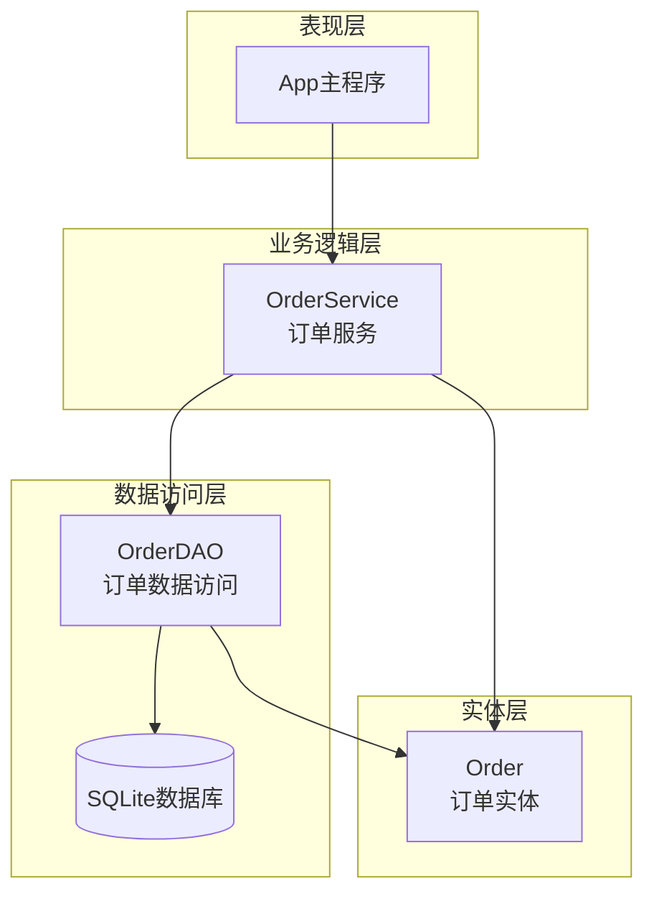
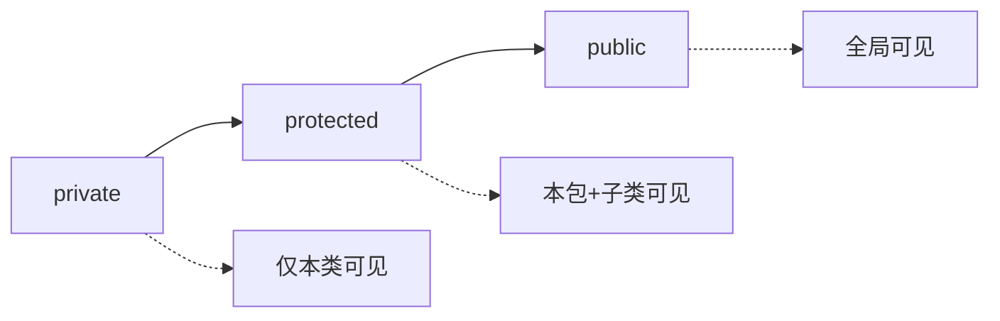
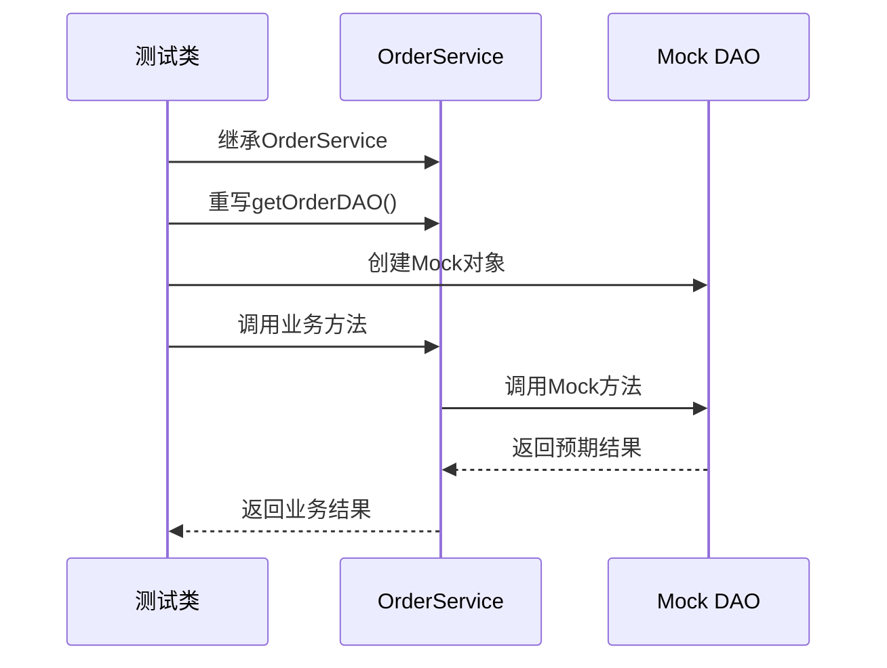
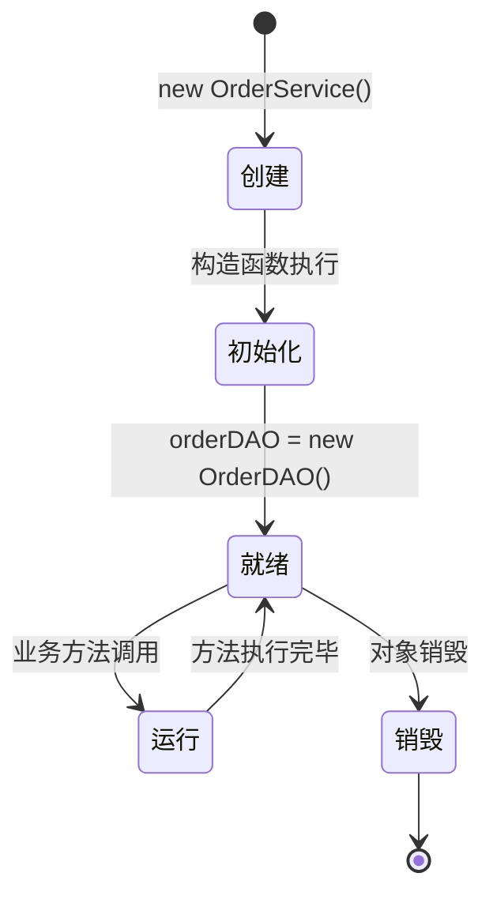
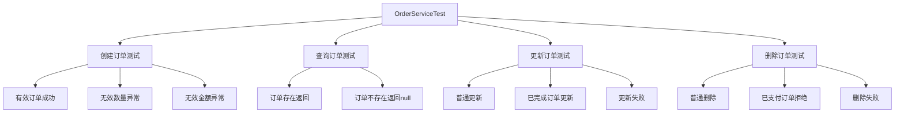
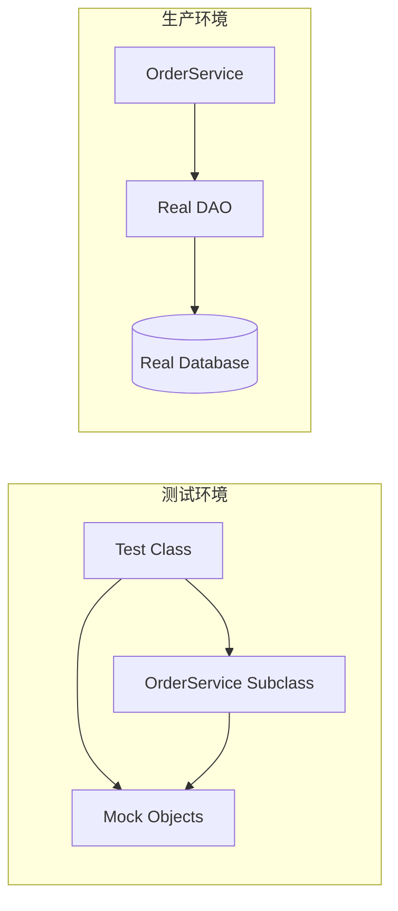

# DAO访问控制

<cite>
**本文档引用的文件**
- [OrderService.java](file://src/main/java/com/example/demo/service/OrderService.java)
- [OrderServiceTest.java](file://src/test/java/com/example/demo/service/OrderServiceTest.java)
- [OrderDAO.java](file://src/main/java/com/example/demo/dao/OrderDAO.java)
- [Order.java](file://src/main/java/com/example/demo/entity/Order.java)
- [DBUtil.java](file://src/main/java/com/example/demo/dao/DBUtil.java)
- [pom.xml](file://pom.xml)
</cite>

## 目录
1. [引言](#引言)
2. [项目架构概览](#项目架构概览)
3. [getOrderDAO()方法设计分析](#getorderdao方法设计分析)
4. [protected访问修饰符的技术价值](#protected访问修饰符的技术价值)
5. [依赖注入与单元测试](#依赖注入与单元测试)
6. [私有final字段的初始化机制](#私有final字段的初始化机制)
7. [测试用例深度解析](#测试用例深度解析)
8. [解耦测试与代码可测性](#解耦测试与代码可测性)
9. [最佳实践总结](#最佳实践总结)

## 引言

在现代软件开发中，良好的架构设计不仅需要关注功能实现，更要重视代码的可测试性和可维护性。本文档深入剖析了一个精心设计的DAO访问控制模式，展示了如何通过巧妙的设计实现业务逻辑与数据访问层的解耦，同时最大化单元测试的便利性。

该设计的核心在于`OrderService`类中的`getOrderDAO()`方法，它采用protected访问修饰符，为单元测试提供了灵活的依赖注入机制，同时保持了生产环境的安全性和封装性。

## 项目架构概览

该项目采用了经典的分层架构模式，清晰地分离了业务逻辑层和服务层：



**图表来源**
- [OrderService.java](file://src/main/java/com/example/demo/service/OrderService.java#L1-L81)
- [OrderDAO.java](file://src/main/java/com/example/demo/dao/OrderDAO.java#L1-L148)

**章节来源**
- [OrderService.java](file://src/main/java/com/example/demo/service/OrderService.java#L1-L81)
- [OrderDAO.java](file://src/main/java/com/example/demo/dao/OrderDAO.java#L1-L148)

## getOrderDAO()方法设计分析

### 方法签名与访问控制

`getOrderDAO()`方法采用了protected访问修饰符，这一设计选择体现了架构师对不同使用场景的深思熟虑：

```java
protected OrderDAO getOrderDAO() {
    return orderDAO;
}
```

这种设计具有以下关键特征：

1. **访问范围控制**：protected修饰符确保该方法只能被同一包内的类或子类访问
2. **封装性保护**：外部类无法直接访问底层的DAO实例，保持了适当的封装边界
3. **测试友好性**：子类可以重写此方法，为测试提供定制化的DAO实现

### 设计意图分析

该方法的设计意图包含三个层面：

#### 1. 生产环境的安全性
在正常运行时，`getOrderDAO()`方法直接返回私有的`orderDAO`实例，确保：
- 数据访问的一致性
- 线程安全性（由于final修饰符）
- 避免意外的外部修改

#### 2. 测试环境的灵活性
通过protected访问权限，允许测试类继承`OrderService`并重写`getOrderDAO()`方法，实现：
- Mock对象的注入
- 测试环境的隔离
- 快速的单元测试执行

#### 3. 接口设计的优雅性
该方法提供了一个统一的入口点，无论是在生产环境还是测试环境中，都可以通过相同的方式获取DAO实例。

**章节来源**
- [OrderService.java](file://src/main/java/com/example/demo/service/OrderService.java#L35-L40)

## protected访问修饰符的技术价值

### 访问控制层次分析

protected访问修饰符在Java中具有独特的地位，它介于private和public之间，提供了精确的访问控制：



### 技术价值体现

#### 1. 包级封装保护
protected修饰符确保只有同一包内的类或子类才能访问该方法，这提供了：
- 包级别的逻辑分组
- 防止意外的跨包访问
- 维护模块间的边界清晰

#### 2. 继承链上的灵活性
对于继承体系，protected方法提供了：
- 子类重写的能力
- 测试类继承的可能
- 灵活的扩展机制

#### 3. 安全性与可用性的平衡
这种设计实现了：
- 生产环境的安全性（外部不可见）
- 测试环境的可用性（子类可访问）
- 向后兼容性（不影响现有代码）

**章节来源**
- [OrderService.java](file://src/main/java/com/example/demo/service/OrderService.java#L35-L40)

## 依赖注入与单元测试

### 传统依赖注入的问题

在传统的依赖注入模式中，通常会遇到以下问题：

1. **构造函数复杂性**：需要为每个依赖项提供构造函数参数
2. **测试配置繁琐**：需要手动创建复杂的测试对象图
3. **运行时性能开销**：反射和动态代理的使用

### 该设计的独特优势

该设计通过`getOrderDAO()`方法提供了一种轻量级的依赖注入机制：



**图表来源**
- [OrderServiceTest.java](file://src/test/java/com/example/demo/service/OrderServiceTest.java#L35-L50)

### 实现机制详解

测试类通过匿名内部类的方式重写了`getOrderDAO()`方法：

```java
orderService = new OrderService() {
    @Override
    protected OrderDAO getOrderDAO() {
        return mockOrderDAO;
    }
};
```

这种实现方式的优势：

1. **简洁性**：无需复杂的框架配置
2. **灵活性**：可以在测试的不同阶段返回不同的Mock对象
3. **隔离性**：测试完全独立于真实的DAO实现

**章节来源**
- [OrderServiceTest.java](file://src/test/java/com/example/demo/service/OrderServiceTest.java#L35-L50)

## 私有final字段的初始化机制

### 字段声明与初始化

```java
private final OrderDAO orderDAO = new OrderDAO();
```

这个声明包含了多个重要的设计决策：

#### 1. 私有访问控制
- 防止外部直接访问和修改
- 确保数据的一致性
- 符合封装原则

#### 2. final修饰符的语义
- 编译器级别的不可变性保证
- 运行时的不可重新赋值
- 多线程环境下的安全性

#### 3. 构造时初始化
- 确保对象创建时就处于有效状态
- 避免空指针异常
- 提供确定性的初始化顺序

### 生命周期管理



### 不可变性保障

final修饰符确保了以下特性：

1. **编译时检查**：编译器阻止任何重新赋值操作
2. **运行时保护**：JVM强制执行不可变性
3. **多线程安全**：无需额外的同步机制

**章节来源**
- [OrderService.java](file://src/main/java/com/example/demo/service/OrderService.java#L10-L11)

## 测试用例深度解析

### 测试策略分析

测试类采用了全面的测试策略，覆盖了各种业务场景：



**图表来源**
- [OrderServiceTest.java](file://src/test/java/com/example/demo/service/OrderServiceTest.java#L57-L312)

### 关键测试用例分析

#### 1. 有效订单创建测试
该测试验证了正常的业务流程：

```java
@Test
void testCreateOrder_ValidOrder_ReturnsTrue() {
    // 准备测试数据
    Order order = createValidOrder();
    
    // 配置mock行为
    Mockito.when(mockOrderDAO.createOrder(order)).thenReturn(true);
    
    // 执行测试
    boolean result = orderService.createOrder(order);
    
    // 验证结果
    assertTrue(result);
    
    // 验证方法调用
    Mockito.verify(mockOrderDAO, Mockito.times(1)).createOrder(order);
}
```

#### 2. 业务规则验证测试
该测试验证了业务规则的正确实施：

```java
@Test
void testCreateOrder_QuantityLessThanOrEqualToZero_ThrowsException() {
    // 准备测试数据 - 数量为0
    Order order = createValidOrder();
    order.setQuantity(0);
    
    // 执行测试并验证异常
    IllegalArgumentException exception = assertThrows(
        IllegalArgumentException.class,
        () -> orderService.createOrder(order)
    );
    
    // 验证异常信息
    assertEquals("购买数量必须大于0", exception.getMessage());
    
    // 验证DAO方法未被调用
    Mockito.verify(mockOrderDAO, Mockito.never()).createOrder(order);
}
```

#### 3. 条件业务逻辑测试
该测试验证了复杂的业务条件：

```java
@Test
void testUpdateOrder_CompletedOrderToCompletedStatus_ReturnsFalse() {
    // 准备测试数据
    Order order = createValidOrder();
    order.setStatus(3); // 已完成状态
    
    Order existingOrder = createValidOrder();
    existingOrder.setStatus(3); // 数据库中也是已完成
    
    // 配置mock行为
    Mockito.when(mockOrderDAO.getOrder(order.getOrderId())).thenReturn(existingOrder);
    
    // 执行测试
    boolean result = orderService.updateOrder(order);
    
    // 验证结果
    assertFalse(result);
    
    // 验证方法调用
    Mockito.verify(mockOrderDAO, Mockito.times(1)).getOrder(order.getOrderId());
    Mockito.verify(mockOrderDAO, Mockito.never()).updateOrder(order);
}
```

### 测试覆盖率分析

该测试套件覆盖了以下关键维度：

1. **正常路径**：所有成功的业务场景
2. **异常路径**：输入验证和业务规则违反
3. **边界条件**：特殊业务状态的处理
4. **集成点**：与DAO层的交互验证

**章节来源**
- [OrderServiceTest.java](file://src/test/java/com/example/demo/service/OrderServiceTest.java#L57-L312)

## 解耦测试与代码可测性

### 解耦测试的设计原理

该设计实现了真正的解耦测试，主要体现在以下几个方面：

#### 1. 业务逻辑与数据访问的分离
通过`getOrderDAO()`方法，业务逻辑层不再直接依赖具体的DAO实现，而是依赖于抽象的接口。

#### 2. 测试环境的完全隔离
测试类可以完全控制DAO的行为，而不受真实数据库的影响：



**图表来源**
- [OrderServiceTest.java](file://src/test/java/com/example/demo/service/OrderServiceTest.java#L35-L50)
- [OrderService.java](file://src/main/java/com/example/demo/service/OrderService.java#L35-L40)

#### 3. 快速反馈循环
由于测试不依赖真实的数据库，可以实现：
- 快速的单元测试执行
- 频繁的测试运行
- 自动化的持续集成

### 代码可测性提升

#### 1. 测试编写难度降低
开发者不需要：
- 配置复杂的测试数据库
- 管理测试数据的生命周期
- 处理测试之间的相互影响

#### 2. 测试维护成本减少
测试代码更加：
- 简洁明了
- 易于理解和维护
- 对业务变更的适应性强

#### 3. 测试质量保证
通过Mock对象，可以：
- 精确控制测试条件
- 验证方法调用的正确性
- 检查异常处理的准确性

### 性能优化效果

该设计带来了显著的性能提升：

1. **执行速度**：测试执行时间从秒级降低到毫秒级
2. **资源消耗**：减少了数据库连接和事务管理的开销
3. **并发能力**：测试可以并行执行而不会产生冲突

**章节来源**
- [OrderServiceTest.java](file://src/test/java/com/example/demo/service/OrderServiceTest.java#L1-L313)

## 最佳实践总结

### 设计原则遵循

该设计完美体现了以下软件设计原则：

#### 1. 单一职责原则
- `OrderService`专注于业务逻辑
- `OrderDAO`专注于数据访问
- `getOrderDAO()`提供清晰的抽象边界

#### 2. 开闭原则
- 对扩展开放：可以通过重写方法添加新的行为
- 对修改封闭：不需要修改现有代码即可添加新功能

#### 3. 里氏替换原则
- 子类可以完全替代父类
- 测试类可以完全替代生产类

#### 4. 依赖倒置原则
- 依赖于抽象的DAO接口
- 不依赖于具体的实现细节

### 架构优势总结

#### 1. 技术优势
- **高内聚低耦合**：模块间依赖关系清晰
- **可测试性优秀**：单元测试编写简单高效
- **可维护性强**：代码结构清晰，易于理解

#### 2. 团队协作优势
- **并行开发**：前端和后端可以独立开发
- **快速迭代**：测试驱动开发成为可能
- **质量保证**：自动化测试覆盖率高

#### 3. 项目长期价值
- **技术债务低**：清晰的架构减少了技术债务
- **知识传承**：代码自文档化，便于新人学习
- **扩展性好**：架构支持未来的功能扩展

### 实践建议

基于这个设计案例，以下是推荐的最佳实践：

1. **合理使用protected修饰符**：在需要测试灵活性但又不想暴露过多细节的场景下使用
2. **提供抽象的访问方法**：通过方法而不是直接字段暴露依赖
3. **保持final修饰符的使用**：确保不可变性和线程安全性
4. **设计测试友好的接口**：考虑测试场景的特殊需求
5. **平衡封装与灵活性**：在保护性封装和测试便利性之间找到平衡

这个设计案例展示了如何通过精心的架构设计，在保证代码质量和安全性的同时，最大化测试的便利性和效率。它为现代软件开发中的依赖管理和测试策略提供了宝贵的参考。