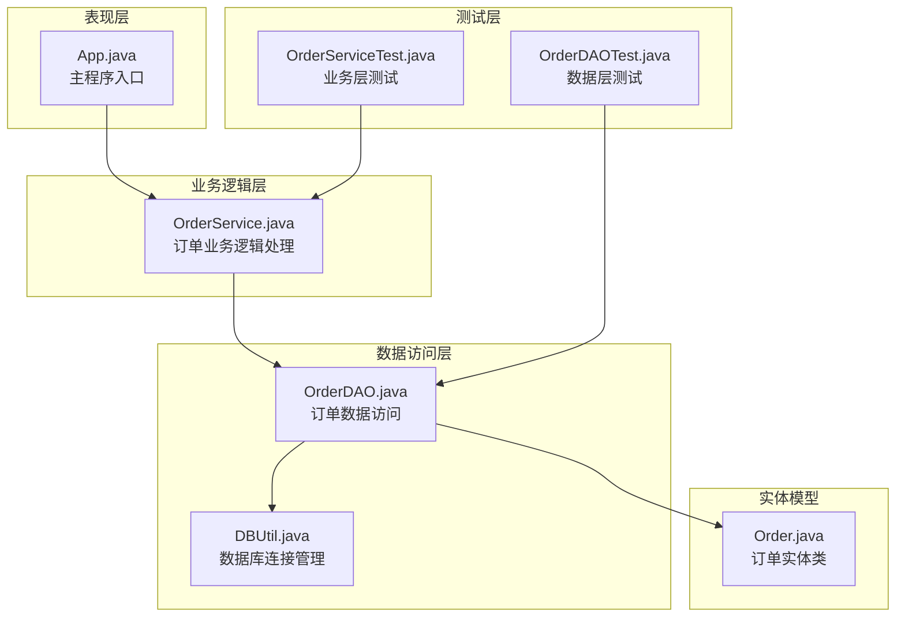
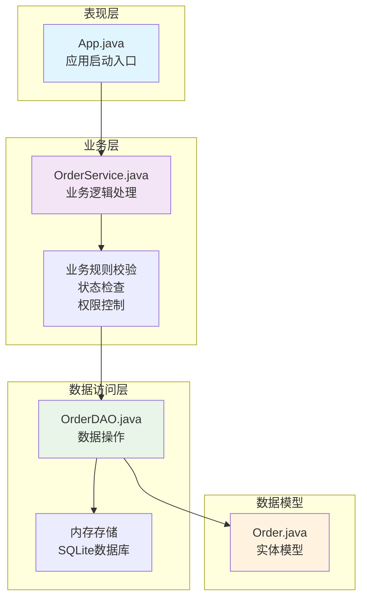
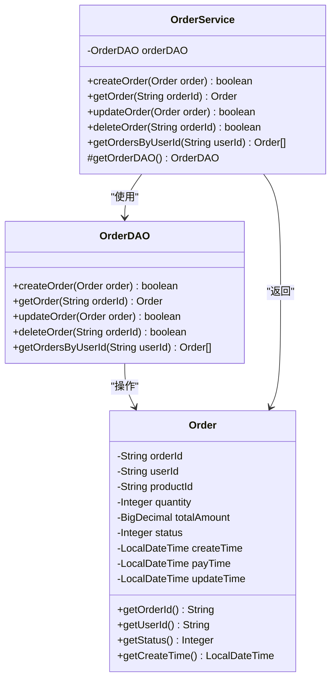
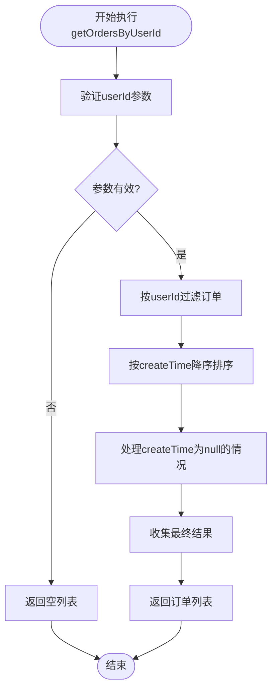
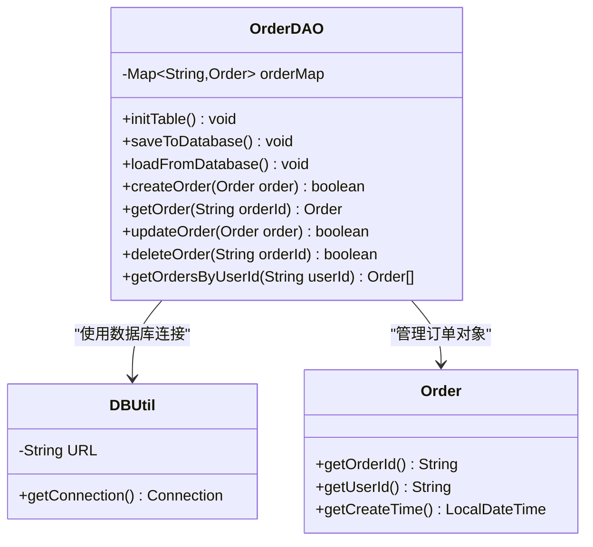
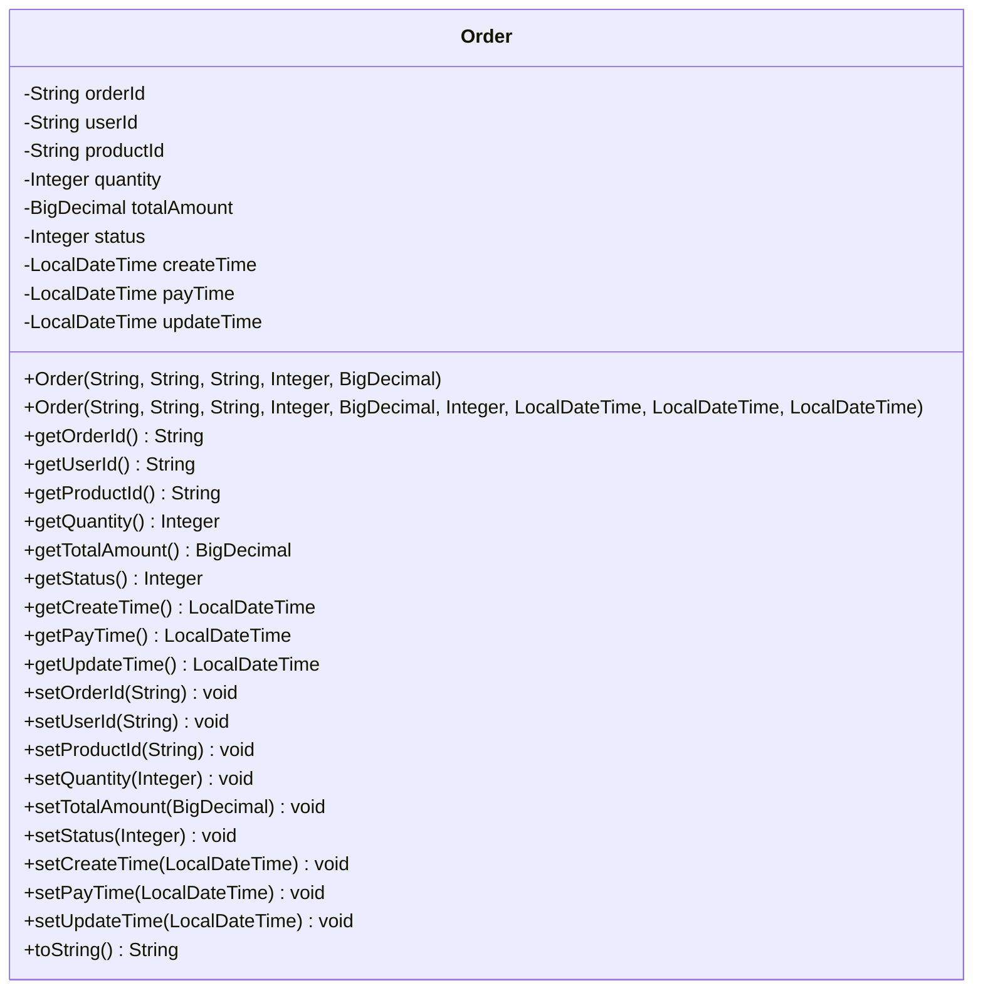
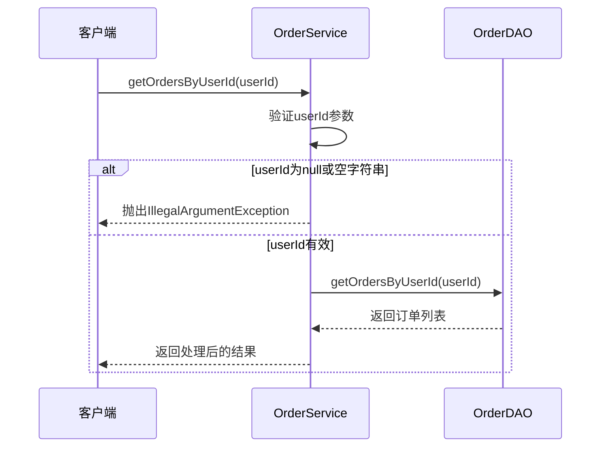
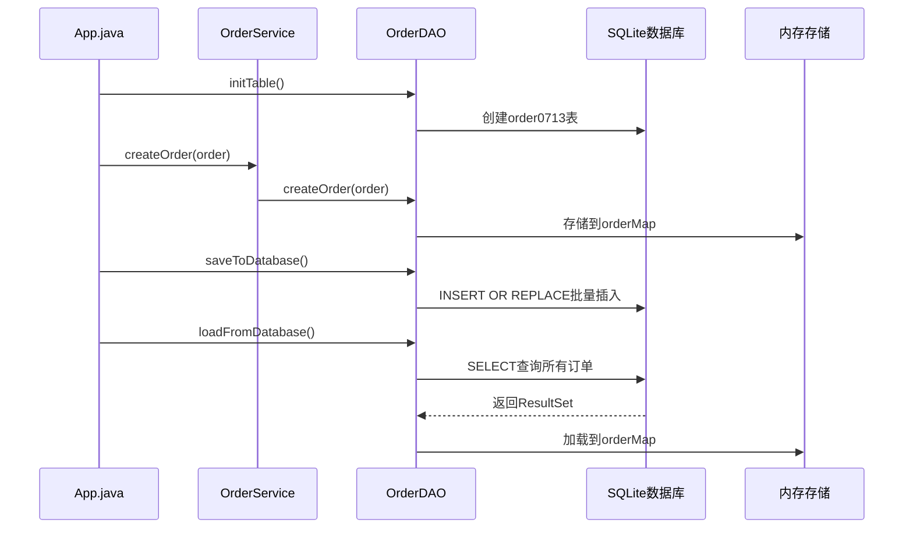

# 获取订单通过用户ID 功能文档

<cite>
**本文档中引用的文件**
- [App.java](file://src/main/java/com/example/demo/App.java)
- [OrderService.java](file://src/main/java/com/example/demo/service/OrderService.java)
- [OrderDAO.java](file://src/main/java/com/example/demo/dao/OrderDAO.java)
- [Order.java](file://src/main/java/com/example/demo/entity/Order.java)
- [DBUtil.java](file://src/main/java/com/example/demo/dao/DBUtil.java)
- [OrderServiceTest.java](file://src/test/java/com/example/demo/service/OrderServiceTest.java)
- [OrderDAOTest.java](file://src/test/java/com/example/demo/dao/OrderDAOTest.java)
- [pom.xml](file://pom.xml)
</cite>

## 目录
1. [简介](#简介)
2. [项目结构](#项目结构)
3. [核心组件](#核心组件)
4. [架构概览](#架构概览)
5. [详细组件分析](#详细组件分析)
6. [功能实现详解](#功能实现详解)
7. [测试策略](#测试策略)
8. [性能考虑](#性能考虑)
9. [故障排除指南](#故障排除指南)
10. [结论](#结论)

## 简介

本文档详细介绍了基于Java Spring Boot架构的订单管理系统中"获取订单通过用户ID"功能的完整实现。该功能允许根据用户ID查询该用户的所有订单记录，并按照创建时间降序排列，确保最新的订单显示在最前面。

系统采用经典的三层架构设计：表现层（App）、业务逻辑层（OrderService）和数据访问层（OrderDAO），并通过SQLite数据库进行数据持久化存储。

## 项目结构



**图表来源**
- [App.java](file://src/main/java/com/example/demo/App.java#L1-L62)
- [OrderService.java](file://src/main/java/com/example/demo/service/OrderService.java#L1-L97)
- [OrderDAO.java](file://src/main/java/com/example/demo/dao/OrderDAO.java#L1-L173)
- [Order.java](file://src/main/java/com/example/demo/entity/Order.java#L1-L143)
- [DBUtil.java](file://src/main/java/com/example/demo/dao/DBUtil.java#L1-L19)

**章节来源**
- [App.java](file://src/main/java/com/example/demo/App.java#L1-L62)
- [OrderService.java](file://src/main/java/com/example/demo/service/OrderService.java#L1-L97)
- [OrderDAO.java](file://src/main/java/com/example/demo/dao/OrderDAO.java#L1-L173)

## 核心组件

### 订单实体类（Order）

订单实体类是整个系统的核心数据模型，包含以下关键属性：

| 属性 | 类型 | 描述 | 约束 |
|------|------|------|------|
| orderId | String | 订单唯一标识符 | 主键，不能为空 |
| userId | String | 用户ID | 外键关联，不能为空 |
| productId | String | 商品ID | 关联商品信息 |
| quantity | Integer | 购买数量 | 必须大于0 |
| totalAmount | BigDecimal | 订单总金额 | 必须大于0 |
| status | Integer | 订单状态 | 0-待支付, 1-已支付, 2-已发货, 3-已完成, 4-已取消 |
| createTime | LocalDateTime | 创建时间 | 自动设置，不可为空 |
| payTime | LocalDateTime | 支付时间 | 可为空 |
| updateTime | LocalDateTime | 更新时间 | 可为空 |

### 订单服务类（OrderService）

订单服务类负责处理业务逻辑，提供以下核心方法：

| 方法名 | 参数 | 返回值 | 功能描述 |
|--------|------|--------|----------|
| createOrder | Order | boolean | 创建新订单，包含业务校验 |
| getOrder | String orderId | Order | 根据订单ID获取订单信息 |
| updateOrder | Order | boolean | 更新订单信息，包含状态检查 |
| deleteOrder | String orderId | boolean | 删除订单，包含删除规则 |
| getOrdersByUserId | String userId | List<Order> | 根据用户ID查询订单列表 |

### 订单数据访问对象（OrderDAO）

数据访问对象负责与底层数据存储交互：

| 方法名 | 参数 | 返回值 | 功能描述 |
|--------|------|--------|----------|
| createOrder | Order | boolean | 创建订单记录 |
| getOrder | String orderId | Order | 获取单个订单 |
| updateOrder | Order | boolean | 更新订单信息 |
| deleteOrder | String orderId | boolean | 删除订单 |
| getOrdersByUserId | String userId | List<Order> | 根据用户ID查询订单列表 |

**章节来源**
- [Order.java](file://src/main/java/com/example/demo/entity/Order.java#L1-L143)
- [OrderService.java](file://src/main/java/com/example/demo/service/OrderService.java#L1-L97)
- [OrderDAO.java](file://src/main/java/com/example/demo/dao/OrderDAO.java#L1-L173)

## 架构概览

系统采用分层架构设计，遵循关注点分离原则：



**图表来源**
- [App.java](file://src/main/java/com/example/demo/App.java#L10-L60)
- [OrderService.java](file://src/main/java/com/example/demo/service/OrderService.java#L10-L97)
- [OrderDAO.java](file://src/main/java/com/example/demo/dao/OrderDAO.java#L15-L173)

## 详细组件分析

### OrderService 类详细分析

OrderService类是业务逻辑的核心，提供了完整的订单管理功能：



**图表来源**
- [OrderService.java](file://src/main/java/com/example/demo/service/OrderService.java#L10-L97)
- [OrderDAO.java](file://src/main/java/com/example/demo/dao/OrderDAO.java#L15-L173)
- [Order.java](file://src/main/java/com/example/demo/entity/Order.java#L10-L143)

#### getOrdersByUserId 方法实现

该方法是核心功能的具体实现，具有以下特点：

1. **参数验证**：严格检查userId参数的有效性
2. **内存过滤**：在内存中对订单列表进行过滤
3. **智能排序**：使用Java 8 Stream API进行高效排序
4. **空值处理**：优雅处理createTime为null的情况



**图表来源**
- [OrderService.java](file://src/main/java/com/example/demo/service/OrderService.java#L75-L97)

**章节来源**
- [OrderService.java](file://src/main/java/com/example/demo/service/OrderService.java#L75-L97)

### OrderDAO 类详细分析

OrderDAO类实现了数据访问层的核心功能：



**图表来源**
- [OrderDAO.java](file://src/main/java/com/example/demo/dao/OrderDAO.java#L15-L173)
- [DBUtil.java](file://src/main/java/com/example/demo/dao/DBUtil.java#L10-L19)

#### 内存存储机制

OrderDAO使用ConcurrentHashMap作为内存存储引擎：

| 特性 | 实现方式 | 优势 |
|------|----------|------|
| 并发安全 | ConcurrentHashMap | 支持多线程并发访问 |
| 快速查找 | 哈希表结构 | O(1)平均查找复杂度 |
| 内存效率 | 对象直接存储 | 避免序列化开销 |
| 线程安全 | 内置同步机制 | 自动处理并发问题 |

**章节来源**
- [OrderDAO.java](file://src/main/java/com/example/demo/dao/OrderDAO.java#L15-L173)

### Order 实体类详细分析

Order实体类定义了订单的数据结构和行为：



**图表来源**
- [Order.java](file://src/main/java/com/example/demo/entity/Order.java#L10-L143)

**章节来源**
- [Order.java](file://src/main/java/com/example/demo/entity/Order.java#L1-L143)

## 功能实现详解

### getOrdersByUserId 方法实现流程

该方法的实现体现了现代Java编程的最佳实践：

#### 1. 参数验证阶段



**图表来源**
- [OrderService.java](file://src/main/java/com/example/demo/service/OrderService.java#L75-L85)
- [OrderDAO.java](file://src/main/java/com/example/demo/dao/OrderDAO.java#L140-L155)

#### 2. 内存过滤与排序阶段

OrderDAO中的实现使用了Java 8 Stream API的链式操作：

| 操作步骤 | 实现方式 | 复杂度 | 功能描述 |
|----------|----------|--------|----------|
| 过滤 | `.filter(order -> userId.equals(order.getUserId()))` | O(n) | 筛选出指定用户的订单 |
| 排序 | `.sorted(Comparator.comparing(Order::getCreateTime, Comparator.nullsLast(Comparator.reverseOrder())))` | O(n log n) | 按创建时间降序排列 |
| 收集 | `.collect(Collectors.toList())` | O(n) | 转换为列表返回 |

#### 3. 空值处理策略

对于createTime为null的订单，系统采用以下策略：
- 使用`Comparator.nullsLast()`确保null值排在最后
- 保证排序结果的一致性和可预测性
- 避免NullPointerException异常

**章节来源**
- [OrderDAO.java](file://src/main/java/com/example/demo/dao/OrderDAO.java#L140-L155)

### 数据持久化机制

系统支持内存数据与SQLite数据库之间的双向同步：



**图表来源**
- [App.java](file://src/main/java/com/example/demo/App.java#L10-L20)
- [OrderDAO.java](file://src/main/java/com/example/demo/dao/OrderDAO.java#L20-L130)

**章节来源**
- [App.java](file://src/main/java/com/example/demo/App.java#L10-L60)
- [OrderDAO.java](file://src/main/java/com/example/demo/dao/OrderDAO.java#L20-L130)

## 测试策略

### 单元测试覆盖范围

系统提供了全面的单元测试，涵盖各种边界情况：

#### OrderService 测试场景

| 测试方法 | 测试目标 | 边界条件 |
|----------|----------|----------|
| testGetOrdersByUserId_ValidUserId_ReturnsOrderList | 正常查询 | 有效用户ID，多个订单 |
| testGetOrdersByUserId_NullUserId_ThrowsException | 参数验证 | null用户ID |
| testGetOrdersByUserId_EmptyUserId_ThrowsException | 参数验证 | 空字符串用户ID |
| testGetOrdersByUserId_NoOrders_ReturnsEmptyList | 空结果处理 | 用户无订单 |
| testGetOrdersByUserId_WithNullCreateTime | 空值处理 | createTime为null |

#### OrderDAO 测试场景

| 测试方法 | 测试目标 | 边界条件 |
|----------|----------|----------|
| testGetOrdersByUserId_WithExistingOrders | 多订单查询 | 同一用户多个订单 |
| testGetOrdersByUserId_WithNoOrders | 空结果处理 | 用户无订单记录 |
| testGetOrdersByUserId_WithNullUserId | 参数验证 | null用户ID |
| testGetOrdersByUserId_OrderingSortedByCreateTimeDesc | 排序验证 | 不同创建时间 |
| testGetOrdersByUserId_WithNullCreateTime | 空值处理 | createTime为null |
| testGetOrdersByUserId_MultiUserIsolation | 用户隔离性 | 多用户订单隔离 |

### Mock测试策略

OrderServiceTest使用Mockito框架进行依赖注入测试：

```mermaid
flowchart TD
Setup[测试准备] --> MockConfig[配置Mock行为]
MockConfig --> TestExecution[执行测试方法]
TestExecution --> Verification[验证交互]
Verification --> Cleanup[清理资源]
Setup --> MockitoAnnotations.openMocks()
MockConfig --> when(orderDAO.getOrdersByUserId(userId)).thenReturn(mockList)
TestExecution --> orderService.getOrdersByUserId(userId)
Verification --> verify(orderDAO, times(1)).getOrdersByUserId(userId)
```

**图表来源**
- [OrderServiceTest.java](file://src/test/java/com/example/demo/service/OrderServiceTest.java#L25-L40)

**章节来源**
- [OrderServiceTest.java](file://src/test/java/com/example/demo/service/OrderServiceTest.java#L1-L227)
- [OrderDAOTest.java](file://src/test/java/com/example/demo/dao/OrderDAOTest.java#L1-L188)

## 性能考虑

### 内存优化策略

1. **并发安全的内存存储**：使用ConcurrentHashMap确保多线程环境下的性能
2. **懒加载机制**：只有在需要时才从数据库加载数据
3. **批量操作**：支持批量插入和更新操作

### 查询性能优化

1. **索引策略**：在userId字段上建立索引（SQLite自动维护）
2. **内存过滤**：利用内存中的哈希表进行快速查找
3. **流式处理**：使用Stream API进行高效的内存操作

### 数据库性能优化

1. **批量操作**：使用PreparedStatement批量插入减少数据库往返
2. **事务管理**：自动提交模式简化操作
3. **连接池**：通过DBUtil统一管理数据库连接

## 故障排除指南

### 常见问题及解决方案

#### 1. 数据查询为空

**症状**：getOrdersByUserId返回空列表
**可能原因**：
- 用户ID不存在
- 订单数据未正确保存到数据库
- 数据库连接失败

**解决步骤**：
1. 检查用户ID是否正确
2. 验证数据库表结构
3. 确认数据已成功保存

#### 2. 排序结果不正确

**症状**：订单列表未按创建时间降序排列
**可能原因**：
- createTime字段为null
- 数据类型转换错误

**解决步骤**：
1. 检查所有订单的createTime字段
2. 验证LocalDateTime的序列化/反序列化

#### 3. 性能问题

**症状**：查询响应时间过长
**可能原因**：
- 内存中订单数量过多
- 数据库连接池耗尽

**解决步骤**：
1. 监控内存使用情况
2. 优化数据库查询
3. 考虑分页查询

**章节来源**
- [OrderDAO.java](file://src/main/java/com/example/demo/dao/OrderDAO.java#L140-L155)
- [OrderService.java](file://src/main/java/com/example/demo/service/OrderService.java#L75-L97)

## 结论

"获取订单通过用户ID"功能是一个设计良好的业务功能，体现了以下优秀的设计原则：

### 设计优势

1. **清晰的分层架构**：表现层、业务层和数据访问层职责分明
2. **完善的错误处理**：严格的参数验证和优雅的异常处理
3. **优秀的性能设计**：内存存储结合数据库持久化
4. **全面的测试覆盖**：单元测试和集成测试确保代码质量
5. **现代化的编程实践**：使用Java 8 Stream API和Lambda表达式

### 扩展建议

1. **添加缓存机制**：对于频繁查询的用户订单，可以引入Redis缓存
2. **实现分页查询**：当订单数量庞大时，支持分页返回
3. **增加统计功能**：提供订单数量统计和金额汇总
4. **优化数据库索引**：在userId和createTime字段上建立复合索引

该功能为电商系统中的订单管理奠定了坚实的基础，具有良好的可扩展性和维护性。