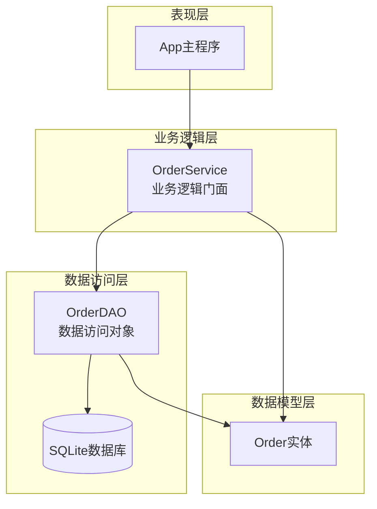
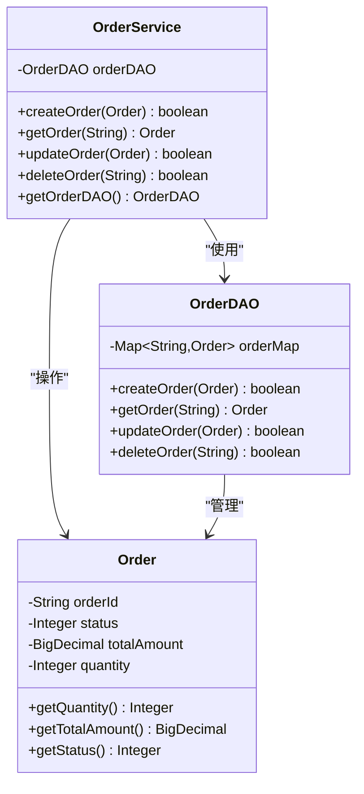
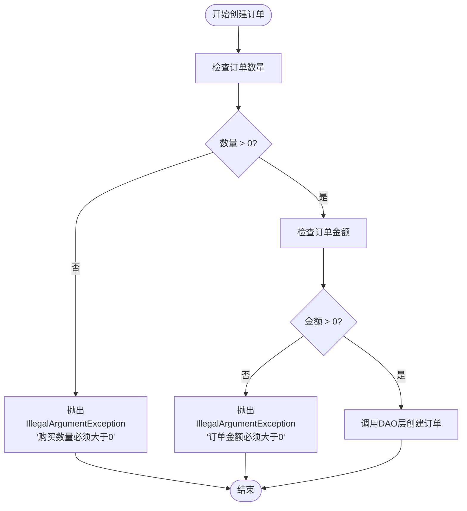
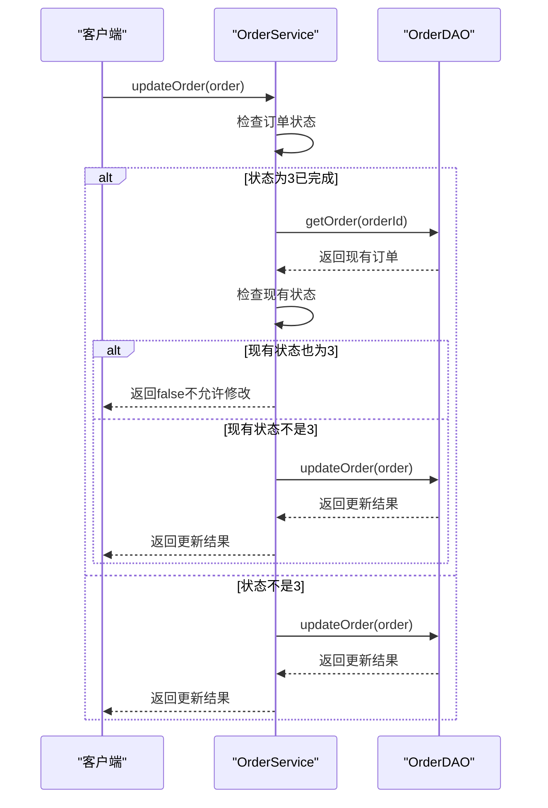
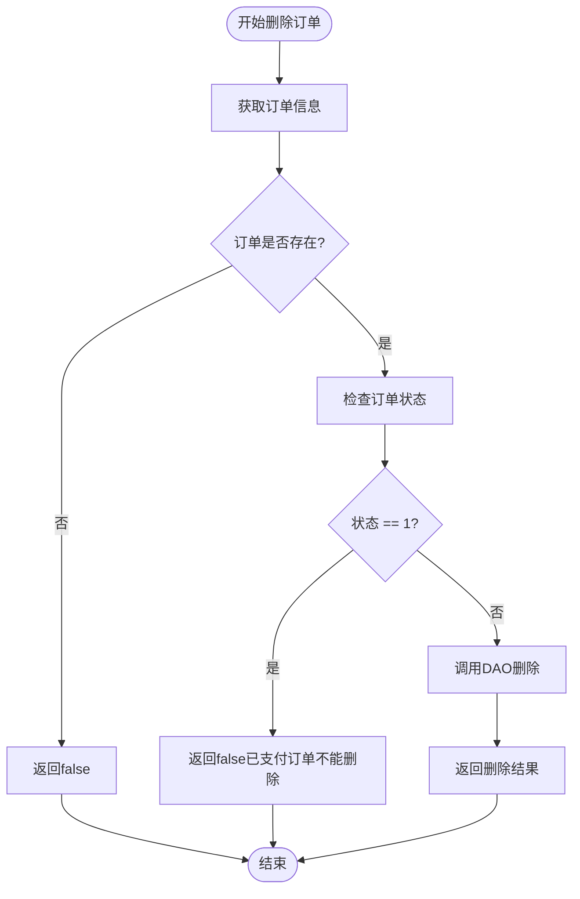
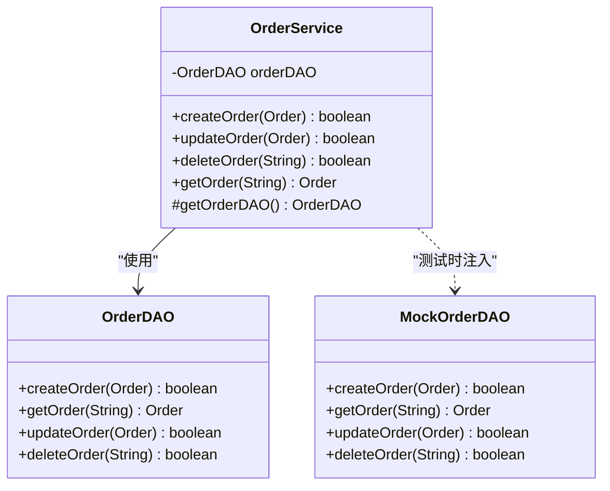
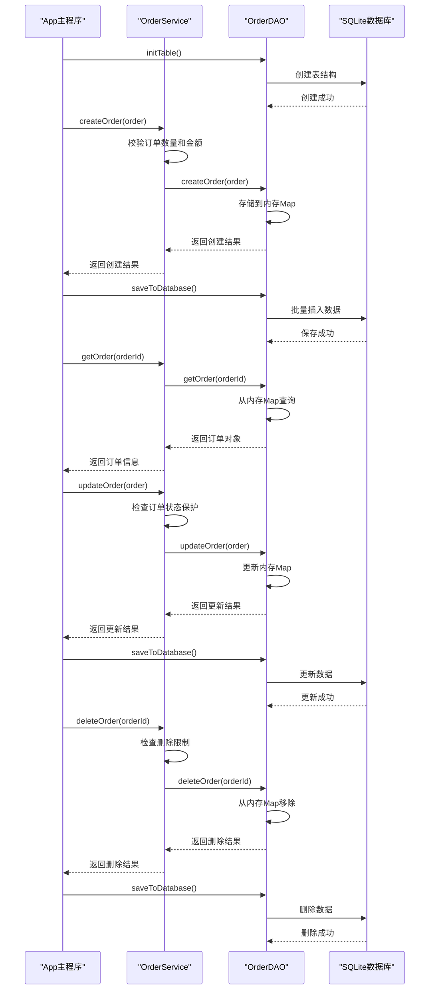
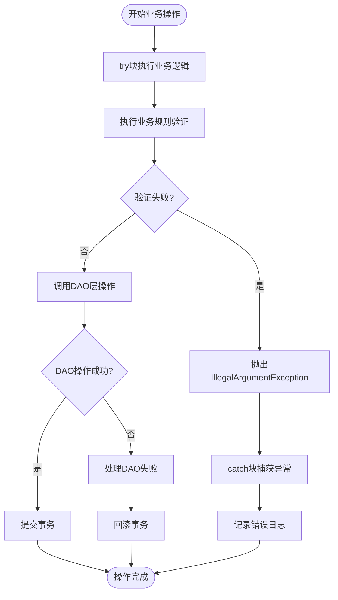

# 业务逻辑层

<cite>
**本文档引用的文件**
- [OrderService.java](file://src/main/java/com/example/demo/service/OrderService.java)
- [Order.java](file://src/main/java/com/example/demo/entity/Order.java)
- [OrderDAO.java](file://src/main/java/com/example/demo/dao/OrderDAO.java)
- [App.java](file://src/main/java/com/example/demo/App.java)
- [OrderServiceTest.java](file://src/test/java/com/example/demo/service/OrderServiceTest.java)
- [DBUtil.java](file://src/main/java/com/example/demo/dao/DBUtil.java)
</cite>

## 目录
1. [引言](#引言)
2. [系统架构概述](#系统架构概述)
3. [OrderService核心职责](#orderservice核心职责)
4. [业务校验规则详解](#业务校验规则详解)
5. [订单状态保护机制](#订单状态保护机制)
6. [依赖注入与测试设计](#依赖注入与测试设计)
7. [调用流程分析](#调用流程分析)
8. [异常处理与事务边界](#异常处理与事务边界)
9. [总结](#总结)

## 引言

OrderService作为业务逻辑层的核心组件，在整个订单管理系统中承担着关键的职责。它不仅实现了业务规则的验证和执行，还负责协调数据访问层完成完整的订单生命周期管理。本文档将深入分析OrderService的设计理念、核心功能以及在实际应用中的作用。

## 系统架构概述

OrderService在整个系统架构中处于业务逻辑层，与数据访问层（OrderDAO）和表现层（App）形成清晰的分层结构。

**图表来源**
- [App.java](file://src/main/java/com/example/demo/App.java#L1-L62)
- [OrderService.java](file://src/main/java/com/example/demo/service/OrderService.java#L1-L81)
- [OrderDAO.java](file://src/main/java/com/example/demo/dao/OrderDAO.java#L1-L148)

## OrderService核心职责

OrderService作为业务逻辑门面，主要承担以下核心职责：

### 1. 业务规则验证
- 对订单创建进行数量和金额的双重校验
- 实现订单状态的完整性保护
- 提供删除操作的安全性控制

### 2. 状态机管理
- 维护订单状态转换的合法性
- 实现状态变更的原子性保证
- 提供状态查询和验证功能

### 3. 协调数据访问
- 作为业务逻辑与数据访问的桥梁
- 处理业务层面的事务边界
- 提供统一的错误处理机制

**图表来源**
- [OrderService.java](file://src/main/java/com/example/demo/service/OrderService.java#L8-L81)
- [OrderDAO.java](file://src/main/java/com/example/demo/dao/OrderDAO.java#L12-L148)
- [Order.java](file://src/main/java/com/example/demo/entity/Order.java#L7-L143)

**章节来源**
- [OrderService.java](file://src/main/java/com/example/demo/service/OrderService.java#L1-L81)

## 业务校验规则详解

OrderService在createOrder()方法中实现了严格的业务校验规则，确保数据的完整性和业务逻辑的正确性。

### 数量校验机制

**图表来源**
- [OrderService.java](file://src/main/java/com/example/demo/service/OrderService.java#L15-L22)

### 校验规则特点

1. **断言检查机制**：使用`if`语句进行显式的条件判断
2. **异常抛出策略**：当校验失败时立即抛出`IllegalArgumentException`
3. **错误信息明确**：提供具体的错误描述帮助问题定位
4. **早期失败原则**：在业务逻辑执行前进行验证

### 校验规则表

| 校验项 | 条件 | 异常类型 | 错误信息 |
|--------|------|----------|----------|
| 购买数量 | `order.getQuantity() <= 0` | `IllegalArgumentException` | "购买数量必须大于0" |
| 订单金额 | `order.getTotalAmount().compareTo(order.getTotalAmount().ZERO) <= 0` | `IllegalArgumentException` | "订单金额必须大于0" |

**章节来源**
- [OrderService.java](file://src/main/java/com/example/demo/service/OrderService.java#L15-L22)

## 订单状态保护机制

OrderService实现了基于状态机的订单保护机制，防止非法的状态变更。

### 完成订单保护逻辑

**图表来源**
- [OrderService.java](file://src/main/java/com/example/demo/service/OrderService.java#L46-L56)

### 已支付订单删除限制

**图表来源**
- [OrderService.java](file://src/main/java/com/example/demo/service/OrderService.java#L64-L72)

### 状态保护策略

1. **完成订单保护**：
   - 检查目标状态是否为3（已完成）
   - 查询现有订单状态
   - 如果现有状态也是3，则拒绝修改

2. **已支付订单保护**：
   - 检查订单状态是否为1（已支付）
   - 阻止已支付订单的删除操作

**章节来源**
- [OrderService.java](file://src/main/java/com/example/demo/service/OrderService.java#L46-L72)

## 依赖注入与测试设计

OrderService提供了灵活的依赖注入机制，特别为单元测试设计了protected访问级别的getOrderDAO()方法。

### 依赖注入设计

**图表来源**
- [OrderService.java](file://src/main/java/com/example/demo/service/OrderService.java#L8-L81)
- [OrderServiceTest.java](file://src/test/java/com/example/demo/service/OrderServiceTest.java#L30-L45)

### 测试设计特点

1. **protected访问级别**：getOrderDAO()方法使用protected修饰符
2. **继承扩展**：允许子类重写该方法提供不同的实现
3. **Mock支持**：便于单元测试时注入模拟对象
4. **灵活性**：支持不同场景下的依赖替换

### 测试用例分析

OrderServiceTest包含了多个关键测试用例：

| 测试用例编号 | 测试场景 | 预期结果 | 关键验证点 |
|-------------|----------|----------|------------|
| TC001 | 有效订单且DAO返回true | 返回true | 方法调用次数验证 |
| TC002 | 有效订单但DAO返回false | 返回false | 方法调用次数验证 |
| TC003 | 数量≤0的订单 | 抛出IllegalArgumentException | 异常类型和消息验证 |
| TC004 | 金额≤0的订单 | 抛出IllegalArgumentException | 异常类型和消息验证 |
| TC005 | 已完成订单修改为已完成 | 返回false | 不调用DAO方法 |
| TC006 | 已完成订单修改为已完成（数据库状态不符） | 返回DAO结果 | 正确调用DAO方法 |

**章节来源**
- [OrderService.java](file://src/main/java/com/example/demo/service/OrderService.java#L35-L37)
- [OrderServiceTest.java](file://src/test/java/com/example/demo/service/OrderServiceTest.java#L30-L312)

## 调用流程分析

结合App.java中的调用流程，展示了OrderService如何协调DAO层完成完整的订单生命周期管理。

### 完整订单生命周期流程

**图表来源**
- [App.java](file://src/main/java/com/example/demo/App.java#L12-L61)
- [OrderService.java](file://src/main/java/com/example/demo/service/OrderService.java#L13-L72)
- [OrderDAO.java](file://src/main/java/com/example/demo/dao/OrderDAO.java#L15-L147)

### 关键流程节点

1. **初始化阶段**：数据库表结构创建
2. **创建阶段**：业务校验 + 数据持久化
3. **查询阶段**：状态查询和验证
4. **更新阶段**：状态保护 + 数据更新
5. **删除阶段**：权限检查 + 数据清理
6. **持久化阶段**：批量数据同步

**章节来源**
- [App.java](file://src/main/java/com/example/demo/App.java#L12-L61)

## 异常处理与事务边界

OrderService在异常处理和事务边界控制方面展现了良好的设计原则。

### 异常处理策略

### 事务边界控制原则

1. **业务层面控制**：OrderService负责业务规则的事务边界
2. **DAO层面执行**：OrderDAO负责具体的数据操作事务
3. **异常传播**：业务异常向上层传播，由调用方处理
4. **资源管理**：使用try-with-resources确保资源释放

### 异常类型映射

| 业务场景 | 异常类型 | 异常原因 | 处理策略 |
|----------|----------|----------|----------|
| 数量校验失败 | `IllegalArgumentException` | 订单数量无效 | 立即终止，返回错误信息 |
| 金额校验失败 | `IllegalArgumentException` | 订单金额无效 | 立即终止，返回错误信息 |
| 状态保护失败 | `业务逻辑返回值` | 违反业务规则 | 返回false，不执行操作 |
| DAO操作失败 | `SQLException` | 数据库操作异常 | 记录日志，可能需要重试 |

**章节来源**
- [OrderService.java](file://src/main/java/com/example/demo/service/OrderService.java#L15-L22)
- [OrderDAO.java](file://src/main/java/com/example/demo/dao/OrderDAO.java#L15-L147)

## 总结

OrderService作为业务逻辑层的核心组件，展现了优秀的软件设计原则：

### 设计亮点

1. **职责分离**：清晰地分离了业务逻辑和数据访问职责
2. **规则内聚**：将业务规则集中在一个地方管理
3. **保护机制**：实现了完善的状态保护和权限控制
4. **测试友好**：提供了灵活的依赖注入支持单元测试
5. **异常清晰**：使用明确的异常类型和错误信息

### 架构优势

1. **可维护性**：业务规则集中管理，易于修改和扩展
2. **可测试性**：支持依赖注入，便于编写单元测试
3. **可扩展性**：通过接口抽象支持多种数据存储方案
4. **可监控性**：清晰的异常处理和日志记录机制

### 最佳实践体现

- **单一职责原则**：每个方法都有明确的业务职责
- **开闭原则**：通过继承和多态支持扩展
- **依赖倒置原则**：依赖抽象而非具体实现
- **接口隔离原则**：提供最小化的接口契约

OrderService的设计充分体现了现代软件架构的最佳实践，为构建稳定可靠的业务系统奠定了坚实的基础。