# 订单创建

<cite>
**本文档中引用的文件**
- [OrderService.java](file://src/main/java/com/example/demo/service/OrderService.java)
- [Order.java](file://src/main/java/com/example/demo/entity/Order.java)
- [OrderDAO.java](file://src/main/java/com/example/demo/dao/OrderDAO.java)
- [App.java](file://src/main/java/com/example/demo/App.java)
- [OrderServiceTest.java](file://src/test/java/com/example/demo/service/OrderServiceTest.java)
- [DBUtil.java](file://src/main/java/com/example/demo/dao/DBUtil.java)
- [pom.xml](file://pom.xml)
</cite>

## 目录
1. [简介](#简介)
2. [项目架构概览](#项目架构概览)
3. [OrderService核心组件分析](#orderservice核心组件分析)
4. [createOrder方法详细实现](#createorder方法详细实现)
5. [业务逻辑校验机制](#业务逻辑校验机制)
6. [数据访问层集成](#数据访问层集成)
7. [完整调用流程分析](#完整调用流程分析)
8. [错误处理机制](#错误处理机制)
9. [事务边界与原子性保证](#事务边界与原子性保证)
10. [测试覆盖分析](#测试覆盖分析)
11. [最佳实践建议](#最佳实践建议)

## 简介

OrderService类是本系统中负责订单业务逻辑的核心服务组件，其中的`createOrder()`方法实现了订单创建的完整业务流程。该方法不仅负责验证订单数据的合法性，还通过数据访问层将合法订单持久化到数据库中，确保了业务逻辑与数据访问的有效分离。

## 项目架构概览

系统采用经典的三层架构模式，清晰地分离了业务逻辑层、数据访问层和表现层：

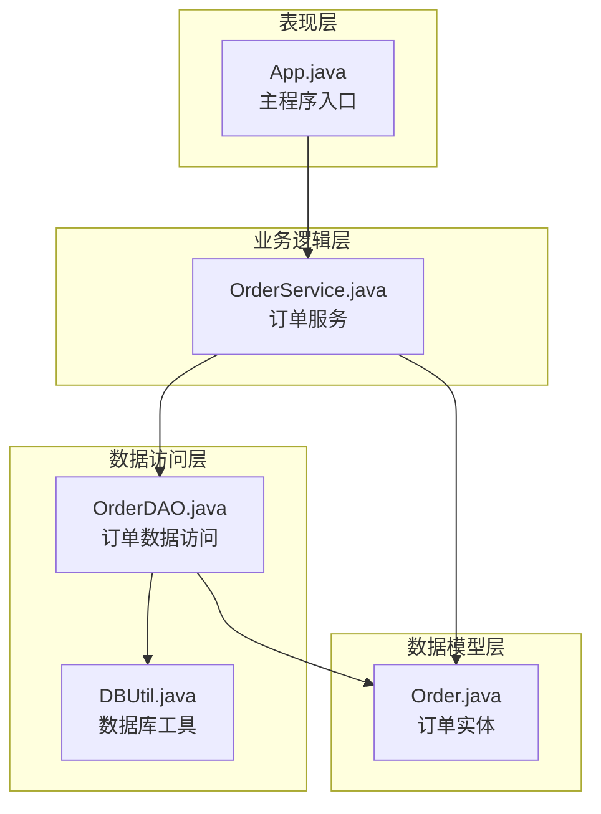

**图表来源**
- [App.java](file://src/main/java/com/example/demo/App.java#L1-L62)
- [OrderService.java](file://src/main/java/com/example/demo/service/OrderService.java#L1-L81)
- [OrderDAO.java](file://src/main/java/com/example/demo/dao/OrderDAO.java#L1-L148)

## OrderService核心组件分析

OrderService类作为业务逻辑层的核心组件，承担着订单创建、查询、更新和删除等核心功能。其设计遵循单一职责原则，每个方法都专注于特定的业务操作。

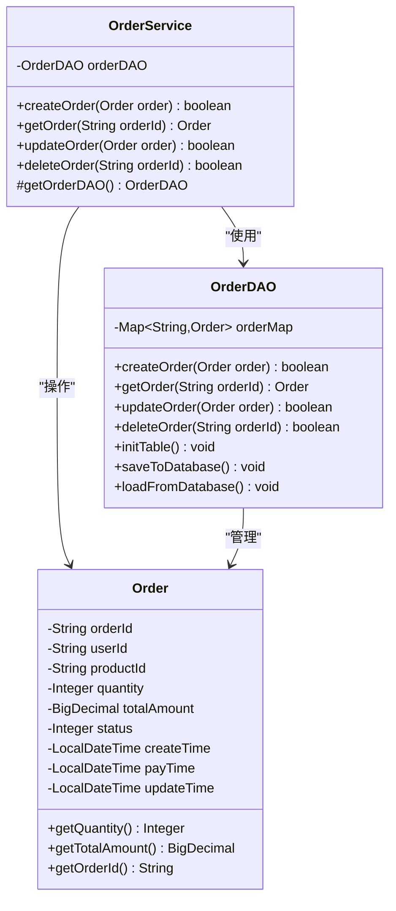

**图表来源**
- [OrderService.java](file://src/main/java/com/example/demo/service/OrderService.java#L8-L81)
- [OrderDAO.java](file://src/main/java/com/example/demo/dao/OrderDAO.java#L14-L148)
- [Order.java](file://src/main/java/com/example/demo/entity/Order.java#L7-L143)

**章节来源**
- [OrderService.java](file://src/main/java/com/example/demo/service/OrderService.java#L1-L81)
- [OrderDAO.java](file://src/main/java/com/example/demo/dao/OrderDAO.java#L1-L148)
- [Order.java](file://src/main/java/com/example/demo/entity/Order.java#L1-L143)

## createOrder方法详细实现

`createOrder()`方法是订单创建的核心入口点，它实现了完整的业务逻辑验证和数据持久化流程：

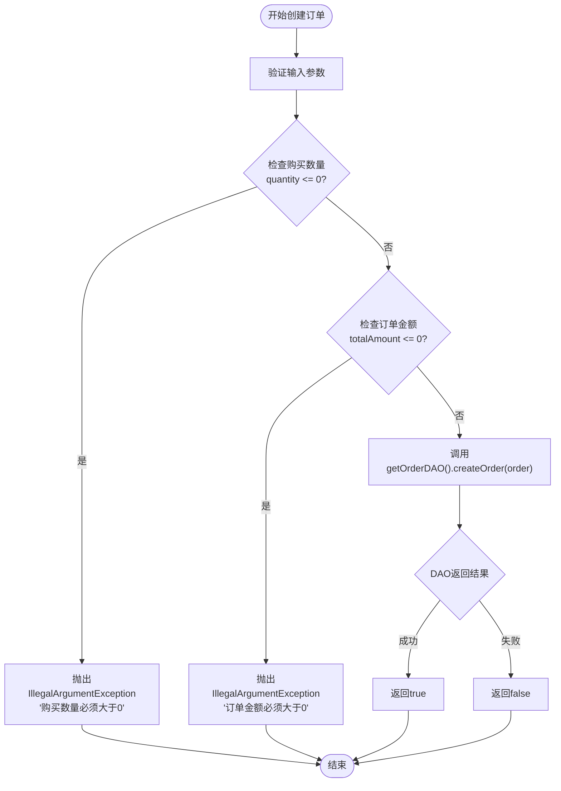

**图表来源**
- [OrderService.java](file://src/main/java/com/example/demo/service/OrderService.java#L15-L26)

该方法的实现特点包括：

1. **严格的参数验证**：确保传入的订单对象包含有效的购买数量和订单金额
2. **异常驱动的控制流**：通过抛出异常来处理非法输入情况
3. **委托模式**：将具体的数据库操作委托给数据访问层
4. **布尔返回值**：提供明确的操作结果反馈

**章节来源**
- [OrderService.java](file://src/main/java/com/example/demo/service/OrderService.java#L15-L26)

## 业务逻辑校验机制

### 购买数量校验

系统对订单的购买数量实施严格校验，确保业务逻辑的合理性：

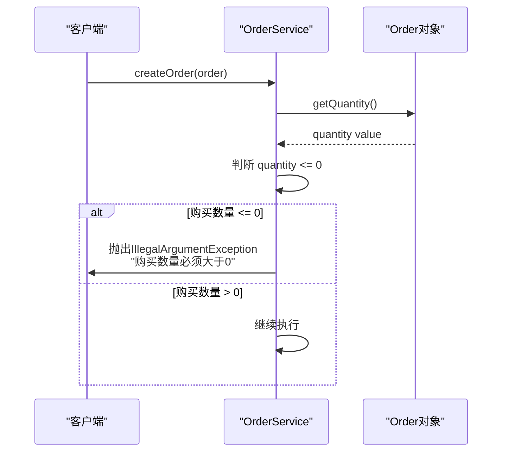

**图表来源**
- [OrderService.java](file://src/main/java/com/example/demo/service/OrderService.java#L17-L19)

### 订单金额校验

对于订单金额的校验采用了更精确的BigDecimal比较方式：

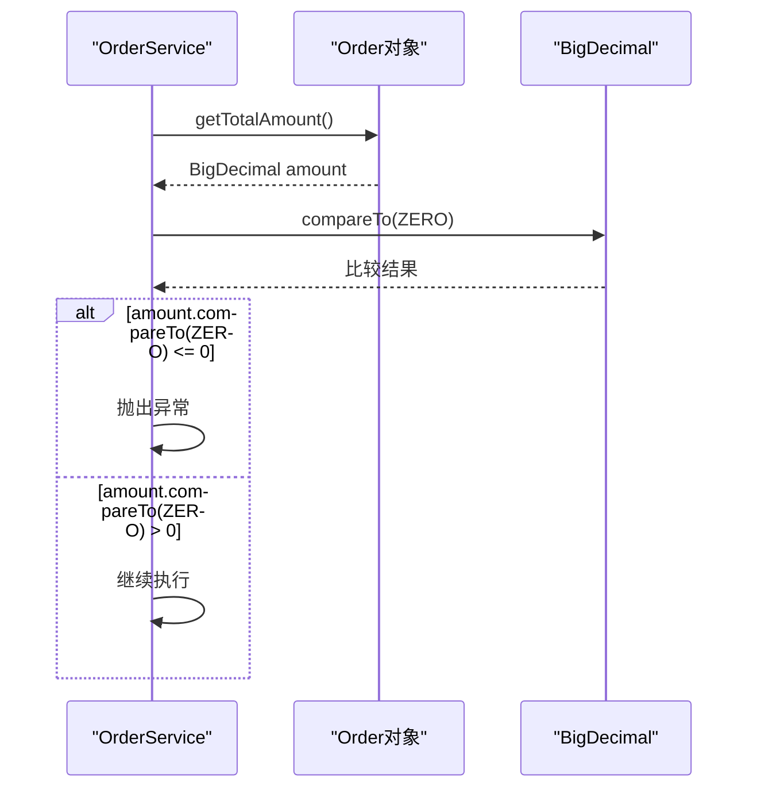

**图表来源**
- [OrderService.java](file://src/main/java/com/example/demo/service/OrderService.java#L20-L22)

### 校验机制的设计原理

1. **防御性编程**：在业务逻辑层进行第一道防线的验证
2. **异常导向**：通过异常处理机制确保非法数据不会进入系统
3. **精确比较**：使用BigDecimal的compareTo方法避免浮点数精度问题
4. **清晰的错误信息**：提供用户友好的错误提示信息

**章节来源**
- [OrderService.java](file://src/main/java/com/example/demo/service/OrderService.java#L17-L22)

## 数据访问层集成

### DAO层接口设计

OrderDAO类提供了完整的CRUD操作接口，采用内存Map模拟数据库存储：

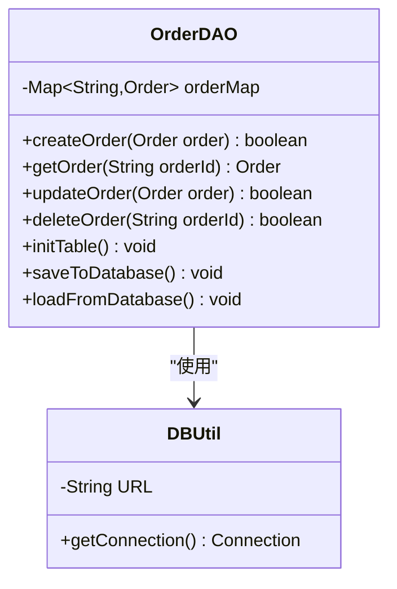

**图表来源**
- [OrderDAO.java](file://src/main/java/com/example/demo/dao/OrderDAO.java#L14-L148)
- [DBUtil.java](file://src/main/java/com/example/demo/dao/DBUtil.java#L9-L18)

### 数据持久化流程

系统支持两种数据持久化方式：

1. **内存到数据库**：通过`saveToDatabase()`方法将内存中的订单数据持久化到SQLite数据库
2. **数据库到内存**：通过`loadFromDatabase()`方法从SQLite数据库加载数据到内存

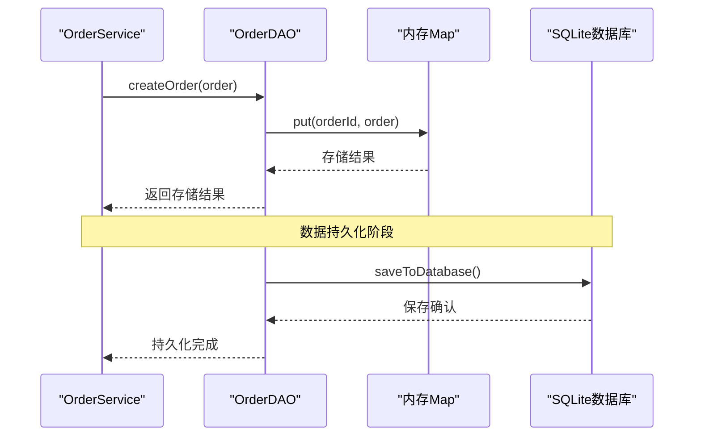

**图表来源**
- [OrderDAO.java](file://src/main/java/com/example/demo/dao/OrderDAO.java#L35-L75)
- [OrderDAO.java](file://src/main/java/com/example/demo/dao/OrderDAO.java#L77-L117)

**章节来源**
- [OrderDAO.java](file://src/main/java/com/example/demo/dao/OrderDAO.java#L35-L117)
- [DBUtil.java](file://src/main/java/com/example/demo/dao/DBUtil.java#L1-L19)

## 完整调用流程分析

### App.java中的调用示例

App.java展示了createOrder方法在实际应用中的完整调用流程：

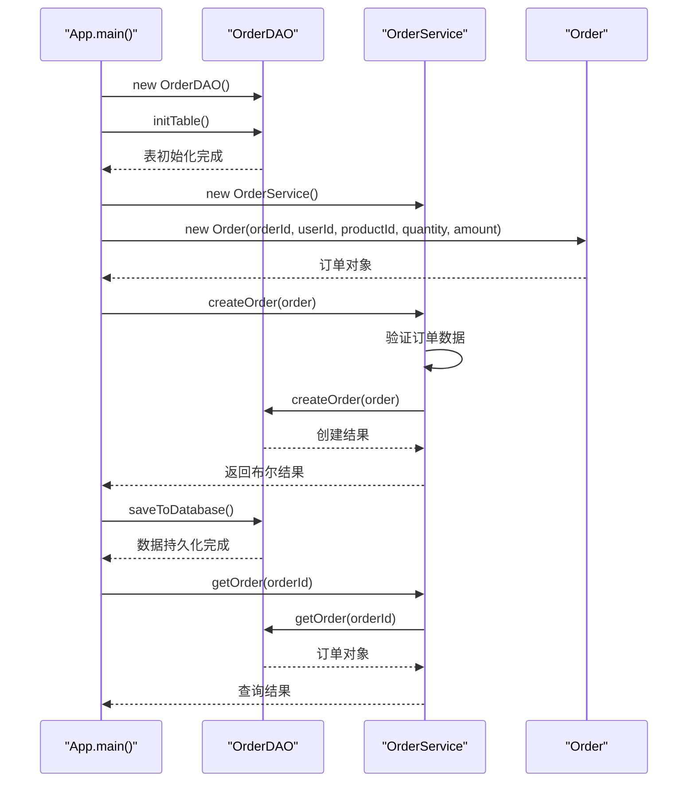

**图表来源**
- [App.java](file://src/main/java/com/example/demo/App.java#L15-L35)

### 错误处理的代码片段

系统提供了完整的错误处理机制，以下是关键的错误处理代码模式：

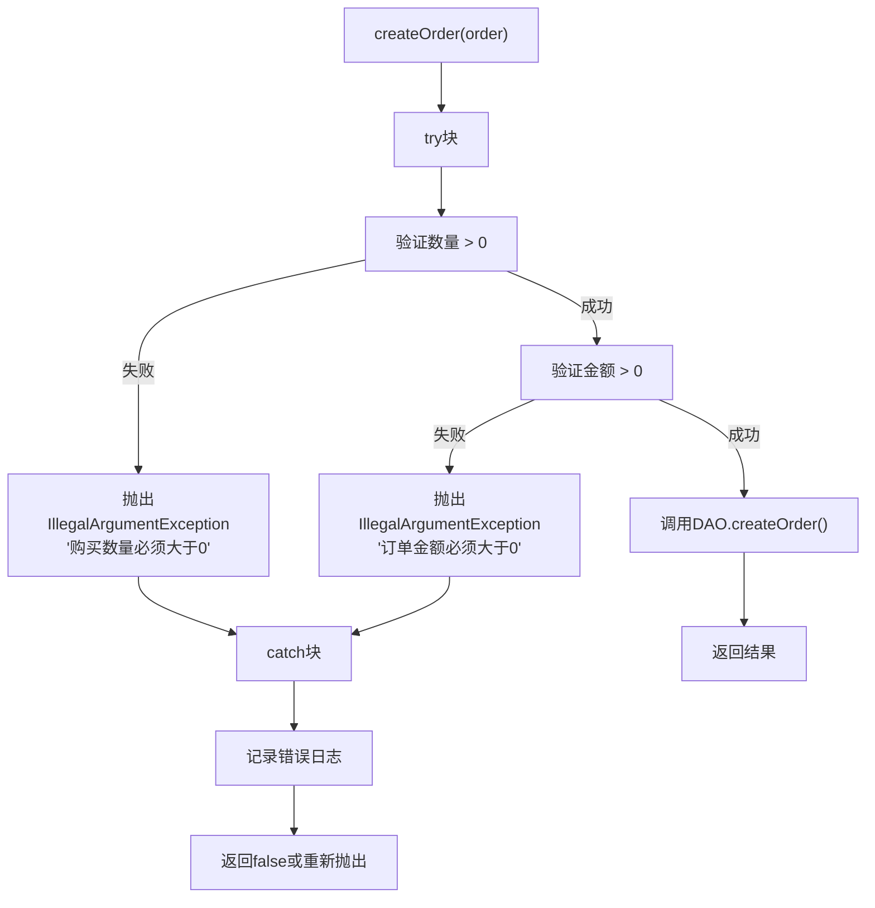

**图表来源**
- [OrderService.java](file://src/main/java/com/example/demo/service/OrderService.java#L15-L26)

**章节来源**
- [App.java](file://src/main/java/com/example/demo/App.java#L15-L35)

## 错误处理机制

### 异常类型与处理策略

系统采用异常驱动的错误处理策略，主要涉及以下异常类型：

| 异常类型 | 触发条件 | 错误信息 | 处理策略 |
|---------|---------|---------|---------|
| IllegalArgumentException | 购买数量 ≤ 0 | "购买数量必须大于0" | 立即终止操作，返回错误信息 |
| IllegalArgumentException | 订单金额 ≤ 0 | "订单金额必须大于0" | 立即终止操作，返回错误信息 |
| SQLException | 数据库操作失败 | 具体SQL错误信息 | 记录日志，可能重试或回滚 |

### 异常传播机制

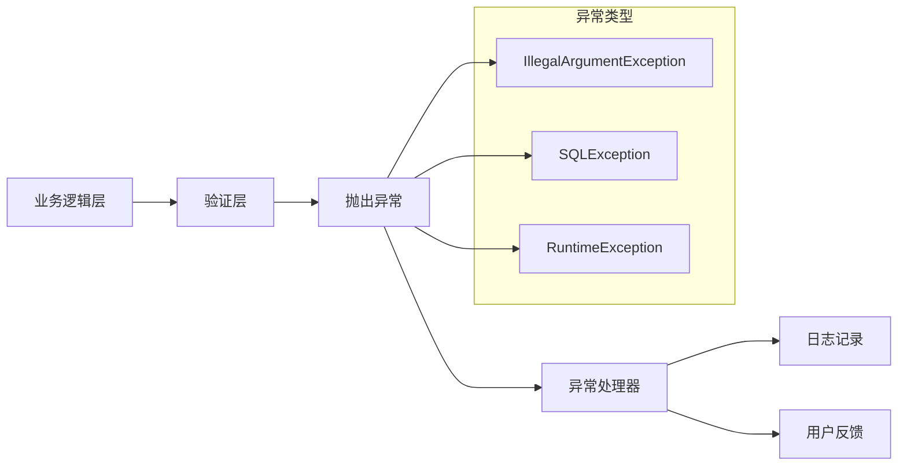

**图表来源**
- [OrderService.java](file://src/main/java/com/example/demo/service/OrderService.java#L17-L22)

**章节来源**
- [OrderService.java](file://src/main/java/com/example/demo/service/OrderService.java#L17-L22)

## 事务边界与原子性保证

### 事务边界的定义

在当前的单机内存实现中，事务边界由OrderService的createOrder方法定义：

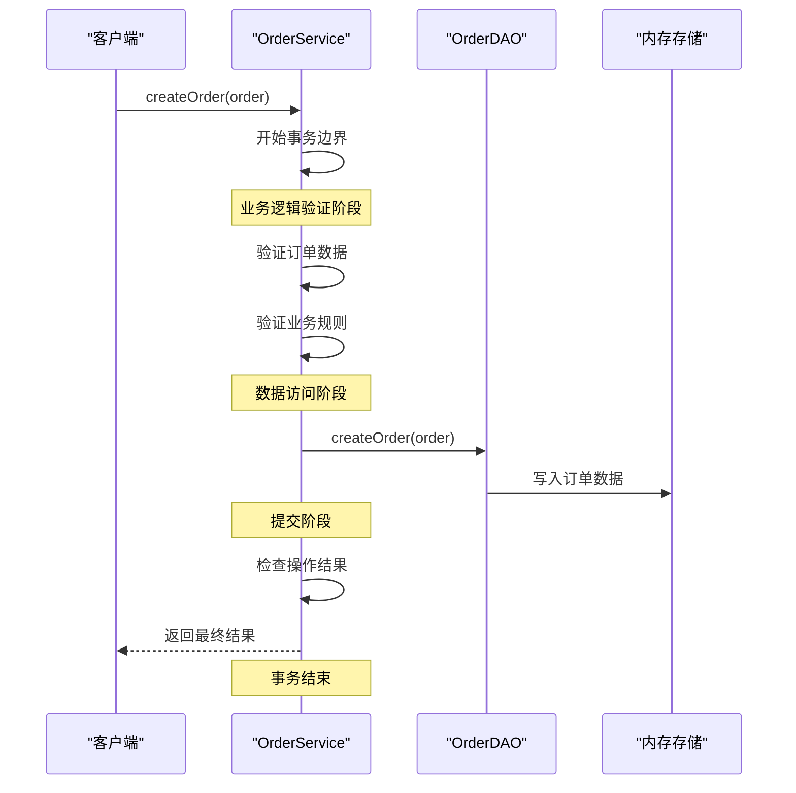

**图表来源**
- [OrderService.java](file://src/main/java/com/example/demo/service/OrderService.java#L15-L26)
- [OrderDAO.java](file://src/main/java/com/example/demo/dao/OrderDAO.java#L105-L117)

### 原子性保证机制

1. **单一操作原子性**：createOrder方法作为一个不可分割的操作单元
2. **数据一致性**：通过内存Map确保数据的一致性状态
3. **回滚能力**：虽然当前实现没有显式回滚，但可以通过状态检查实现

### 分布式事务考虑

对于生产环境，建议扩展为分布式事务处理：

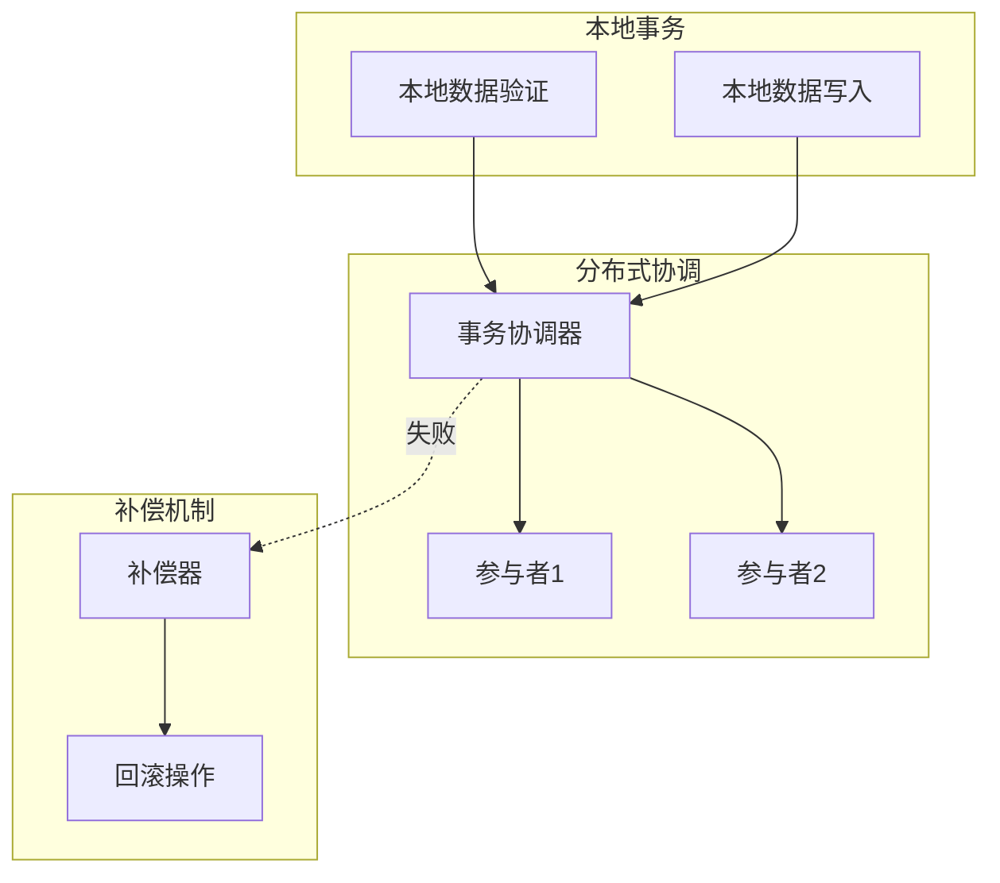

**章节来源**
- [OrderService.java](file://src/main/java/com/example/demo/service/OrderService.java#L15-L26)
- [OrderDAO.java](file://src/main/java/com/example/demo/dao/OrderDAO.java#L105-L117)

## 测试覆盖分析

### 单元测试覆盖范围

OrderServiceTest类提供了全面的测试覆盖，特别是针对createOrder方法的各种边界情况：

| 测试用例编号 | 测试场景 | 预期结果 | 测试目的 |
|-------------|---------|---------|---------|
| TC001 | 有效订单且DAO返回true | 返回true | 正常路径测试 |
| TC002 | 有效订单但DAO返回false | 返回false | DAO失败处理测试 |
| TC003 | 数量≤0的订单 | 抛出IllegalArgumentException | 输入验证测试 |
| TC004 | 金额≤0的订单 | 抛出IllegalArgumentException | 输入验证测试 |

### Mock对象使用策略

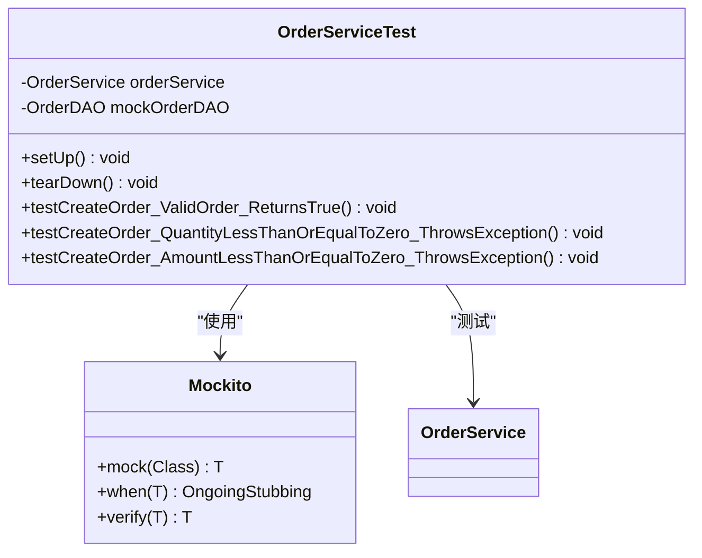

**图表来源**
- [OrderServiceTest.java](file://src/test/java/com/example/demo/service/OrderServiceTest.java#L25-L312)

### 测试断言策略

测试方法采用了多种断言策略：

1. **结果断言**：验证方法返回值的正确性
2. **异常断言**：验证预期异常的抛出
3. **行为断言**：验证方法调用次数和参数

**章节来源**
- [OrderServiceTest.java](file://src/test/java/com/example/demo/service/OrderServiceTest.java#L25-L312)

## 最佳实践建议

### 代码质量改进建议

1. **配置外部化**：将数据库连接信息等配置参数外部化
2. **日志增强**：增加详细的日志记录，便于问题排查
3. **性能优化**：考虑批量操作和缓存机制
4. **并发控制**：添加适当的并发控制机制

### 架构演进建议

1. **微服务拆分**：考虑将订单服务拆分为独立的微服务
2. **事件驱动**：引入事件驱动架构，提高系统的响应性
3. **CQRS模式**：对于复杂查询场景，可以考虑命令查询职责分离
4. **分布式缓存**：引入Redis等分布式缓存，提高读取性能

### 安全性改进建议

1. **输入验证增强**：增加更多的输入验证规则
2. **权限控制**：实现基于角色的访问控制
3. **审计日志**：记录所有订单操作的审计日志
4. **数据加密**：对敏感数据进行加密存储

### 监控与运维建议

1. **指标监控**：监控订单创建的成功率和响应时间
2. **告警机制**：设置异常情况的告警机制
3. **健康检查**：实现服务健康检查接口
4. **容量规划**：根据业务增长进行容量规划

通过以上分析可以看出，OrderService的createOrder方法实现了一个完整的订单创建流程，从输入验证到数据持久化，都体现了良好的软件工程实践。该设计既保证了业务逻辑的正确性，又为未来的扩展和优化奠定了良好的基础。