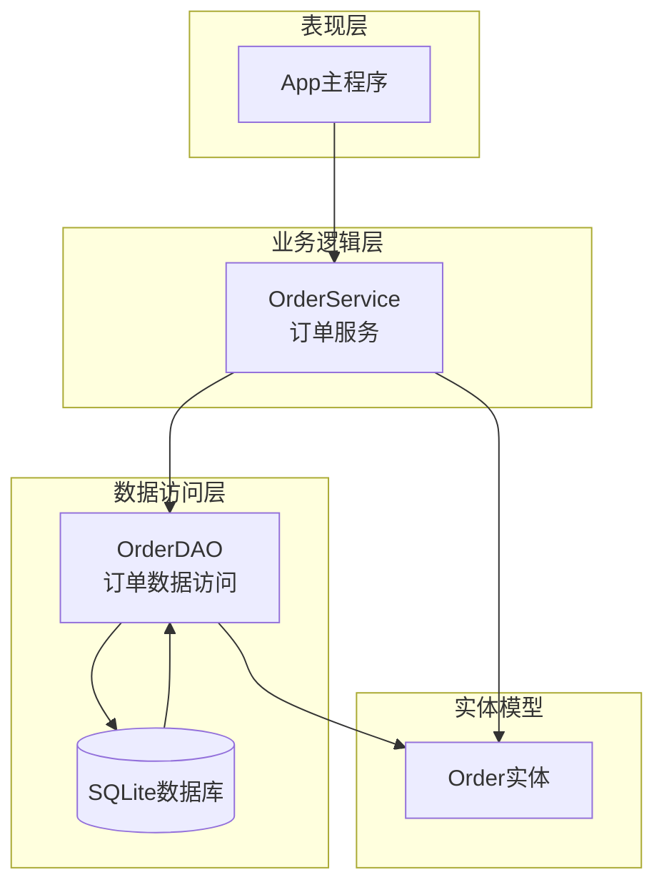
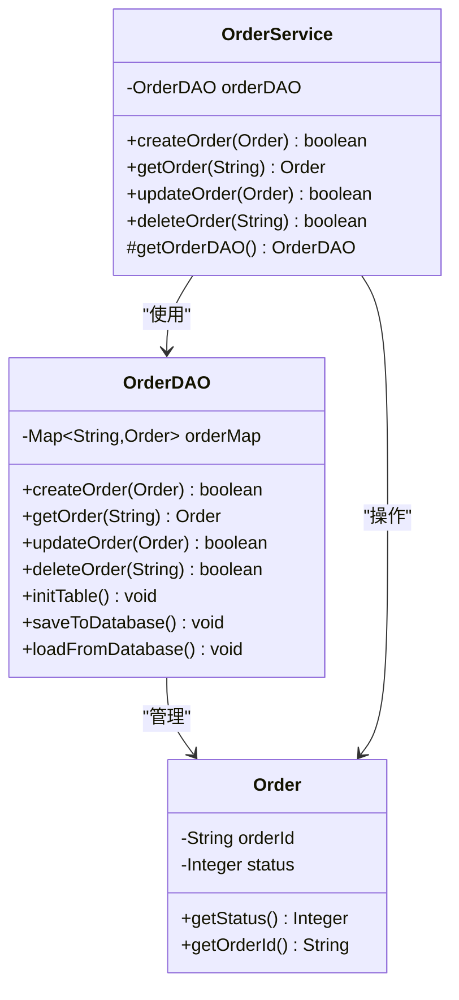
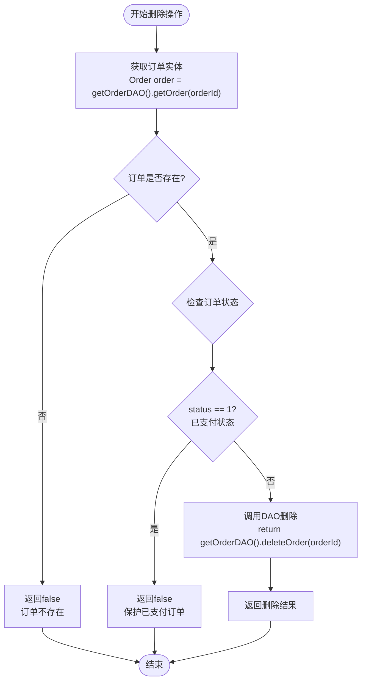

# 订单删除安全策略文档

<cite>
**本文档引用的文件**
- [OrderService.java](file://src/main/java/com/example/demo/service/OrderService.java)
- [OrderDAO.java](file://src/main/java/com/example/demo/dao/OrderDAO.java)
- [Order.java](file://src/main/java/com/example/demo/entity/Order.java)
- [DBUtil.java](file://src/main/java/com/example/demo/dao/DBUtil.java)
- [App.java](file://src/main/java/com/example/demo/App.java)
- [OrderServiceTest.java](file://src/test/java/com/example/demo/service/OrderServiceTest.java)
</cite>

## 目录
1. [概述](#概述)
2. [系统架构](#系统架构)
3. [核心组件分析](#核心组件分析)
4. [安全删除策略详解](#安全删除策略详解)
5. [保护机制实现](#保护机制实现)
6. [场景示例分析](#场景示例分析)
7. [软删除扩展方案](#软删除扩展方案)
8. [性能考虑](#性能考虑)
9. [故障排除指南](#故障排除指南)
10. [总结](#总结)

## 概述

本系统实现了基于状态检查的订单安全删除策略，重点保护已支付订单（status=1）免受意外删除。该策略通过业务逻辑层的前置检查，在执行物理删除前验证订单状态，确保关键交易数据的安全性。

### 核心设计理念

- **状态驱动保护**：基于订单状态进行条件删除控制
- **数据完整性保障**：防止已支付订单的意外丢失
- **业务规则封装**：将删除规则从业务逻辑中清晰分离
- **可扩展性设计**：支持未来添加更多保护规则

## 系统架构



**图表来源**
- [App.java](file://src/main/java/com/example/demo/App.java#L1-L62)
- [OrderService.java](file://src/main/java/com/example/demo/service/OrderService.java#L1-L81)
- [OrderDAO.java](file://src/main/java/com/example/demo/dao/OrderDAO.java#L1-L148)

## 核心组件分析

### OrderService - 业务服务层

OrderService作为业务逻辑的核心控制器，负责协调订单操作并实施删除保护规则。



**图表来源**
- [OrderService.java](file://src/main/java/com/example/demo/service/OrderService.java#L8-L81)
- [OrderDAO.java](file://src/main/java/com/example/demo/dao/OrderDAO.java#L13-L148)
- [Order.java](file://src/main/java/com/example/demo/entity/Order.java#L8-L143)

**章节来源**
- [OrderService.java](file://src/main/java/com/example/demo/service/OrderService.java#L1-L81)
- [OrderDAO.java](file://src/main/java/com/example/demo/dao/OrderDAO.java#L1-L148)
- [Order.java](file://src/main/java/com/example/demo/entity/Order.java#L1-L143)

### Order实体状态定义

系统采用整数状态码表示订单生命周期：

| 状态码 | 状态名称 | 描述 | 删除保护 |
|--------|----------|------|----------|
| 0 | 待支付 | 订单已创建但未支付 | ✅ 可删除 |
| 1 | 已支付 | 订单已完成支付流程 | ❌ 保护中 |
| 2 | 已发货 | 订单已进入物流配送 | ✅ 可删除 |
| 3 | 已完成 | 订单交易完成 | ✅ 可删除 |
| 4 | 已取消 | 订单被用户或系统取消 | ✅ 可删除 |

**章节来源**
- [Order.java](file://src/main/java/com/example/demo/entity/Order.java#L22-L26)

## 安全删除策略详解

### deleteOrder方法核心逻辑

deleteOrder方法实现了三层保护机制：



**图表来源**
- [OrderService.java](file://src/main/java/com/example/demo/service/OrderService.java#L68-L78)

### 保护机制的技术实现

#### 第一层：订单存在性检查
```java
// 获取订单实体
Order order = getOrderDAO().getOrder(orderId);
if (order == null) {
    return false; // 订单不存在，直接返回失败
}
```

#### 第二层：状态验证检查
```java
// 检查订单状态是否为已支付
if (order.getStatus() == 1) {
    // 已支付订单不能删除，立即终止操作
    return false;
}
```

#### 第三层：数据访问层删除
```java
// 只有通过状态检查的订单才会执行物理删除
return getOrderDAO().deleteOrder(orderId);
```

**章节来源**
- [OrderService.java](file://src/main/java/com/example/demo/service/OrderService.java#L68-L78)

## 保护机制实现

### 为什么保护已支付订单？

已支付订单包含以下关键业务价值：

1. **财务记录完整性**：维护准确的财务报表和审计轨迹
2. **客户权益保障**：确保已付款商品的交付义务
3. **法律合规要求**：满足消费者保护法规
4. **业务连续性**：避免因误删导致的业务中断

### 技术实现细节

#### 状态检查算法
```java
// 状态检查的核心逻辑
if (order != null && order.getStatus() == 1) {
    // 已支付订单保护
    return false;
}
```

#### 性能优化考虑
- **单次查询优化**：通过一次数据库查询获取订单状态
- **内存缓存友好**：利用ConcurrentHashMap的高性能特性
- **事务一致性**：确保状态检查与删除操作的一致性

**章节来源**
- [OrderService.java](file://src/main/java/com/example/demo/service/OrderService.java#L72-L74)

## 场景示例分析

### 成功删除场景

#### 场景描述
待支付订单可以正常删除，不会触发保护机制。

#### 代码示例路径
- [App.java](file://src/main/java/com/example/demo/App.java#L18-L25) - 创建订单示例
- [OrderService.java](file://src/main/java/com/example/demo/service/OrderService.java#L68-L78) - 删除逻辑
- [OrderDAO.java](file://src/main/java/com/example/demo/dao/OrderDAO.java#L130-L142) - 物理删除

#### 执行流程
1. 创建订单时状态为0（待支付）
2. 调用deleteOrder方法
3. 系统检查状态为0，允许删除
4. 执行物理删除操作

### 受保护阻止场景

#### 场景描述
已支付订单尝试删除时被系统自动阻止。

#### 代码示例路径
- [App.java](file://src/main/java/com/example/demo/App.java#L38-L45) - 设置订单为已支付状态
- [OrderService.java](file://src/main/java/com/example/demo/service/OrderService.java#L68-L78) - 保护检查逻辑

#### 执行流程
1. 订单状态更新为1（已支付）
2. 调用deleteOrder方法
3. 系统检测到状态为1，触发保护机制
4. 立即返回false，阻止删除操作

**章节来源**
- [App.java](file://src/main/java/com/example/demo/App.java#L38-L45)

## 软删除扩展方案

### 软删除概念介绍

软删除（Soft Delete）是一种数据保护策略，通过标记而非物理删除来保留数据历史记录。

### 实现软删除的扩展方案

#### 方案一：添加删除标志位

```java
// 修改Order实体
public class Order {
    private Boolean isDeleted = false; // 新增软删除标志
    private LocalDateTime deletionTime; // 删除时间戳
    
    // getter和setter方法...
}

// 修改deleteOrder方法
public boolean deleteOrder(String orderId) {
    Order order = getOrderDAO().getOrder(orderId);
    if (order == null) {
        return false;
    }
    
    // 软删除：设置标志位而不是物理删除
    order.setIsDeleted(true);
    order.setDeletionTime(LocalDateTime.now());
    return getOrderDAO().updateOrder(order);
}
```

#### 方案二：创建历史表

```java
// 新增OrderHistory实体
public class OrderHistory {
    private String orderId;
    private Integer originalStatus;
    private LocalDateTime deletionTime;
    private String deletionReason;
    // 其他历史字段...
}

// 扩展删除逻辑
public boolean deleteOrder(String orderId) {
    Order order = getOrderDAO().getOrder(orderId);
    if (order == null) {
        return false;
    }
    
    // 1. 创建历史记录
    OrderHistory history = new OrderHistory();
    history.setOrderId(order.getOrderId());
    history.setOriginalStatus(order.getStatus());
    history.setDeletionTime(LocalDateTime.now());
    orderDAO.saveOrderHistory(history);
    
    // 2. 物理删除
    return orderDAO.deleteOrder(orderId);
}
```

### 软删除的优势

1. **数据恢复能力**：支持误操作后的数据恢复
2. **审计追踪**：完整保留删除操作的历史记录
3. **业务连续性**：不影响现有业务逻辑
4. **合规要求**：满足数据保留的法律要求

## 性能考虑

### 当前实现的性能特征

#### 时间复杂度分析
- **最佳情况**：O(1) - 订单不存在时立即返回
- **平均情况**：O(1) - 单次哈希表查找
- **最坏情况**：O(1) - ConcurrentHashMap保证常数时间复杂度

#### 空间复杂度
- **内存占用**：O(n) - n为订单总数
- **缓存效率**：高并发读写性能

### 性能优化建议

1. **索引优化**：在orderId字段上建立索引
2. **批量操作**：支持批量删除操作减少网络往返
3. **缓存策略**：对频繁访问的订单状态进行缓存
4. **异步处理**：对于大量删除操作采用异步处理

## 故障排除指南

### 常见问题及解决方案

#### 问题1：删除操作总是返回false
**症状**：调用deleteOrder总是返回false，但不确定原因

**排查步骤**：
1. 检查订单是否存在：`OrderService.getOrder(orderId)`
2. 验证订单状态：`Order.getStatus()`
3. 确认DAO层连接状态

**解决方案**：
```java
// 添加调试日志
public boolean deleteOrder(String orderId) {
    Order order = getOrderDAO().getOrder(orderId);
    if (order == null) {
        System.out.println("订单不存在: " + orderId);
        return false;
    }
    
    if (order.getStatus() == 1) {
        System.out.println("已支付订单无法删除: " + orderId);
        return false;
    }
    
    System.out.println("正在删除订单: " + orderId);
    return getOrderDAO().deleteOrder(orderId);
}
```

#### 问题2：状态检查失效
**症状**：已支付订单被意外删除

**排查步骤**：
1. 检查状态值是否正确设置
2. 验证状态检查逻辑
3. 确认数据库同步状态

**解决方案**：
```java
// 强化状态验证
public boolean deleteOrder(String orderId) {
    Order order = getOrderDAO().getOrder(orderId);
    if (order == null) {
        return false;
    }
    
    // 强制重新获取最新状态
    Order latestOrder = getOrderDAO().getOrder(orderId);
    if (latestOrder != null && latestOrder.getStatus() == 1) {
        return false;
    }
    
    return getOrderDAO().deleteOrder(orderId);
}
```

**章节来源**
- [OrderService.java](file://src/main/java/com/example/demo/service/OrderService.java#L68-L78)

## 总结

本系统通过deleteOrder方法实现了完善的安全删除策略，主要特点包括：

### 核心优势
1. **状态驱动保护**：基于订单状态的智能删除控制
2. **数据安全保障**：有效防止已支付订单的意外删除
3. **业务规则清晰**：将删除规则与业务逻辑分离
4. **可扩展性强**：支持软删除等扩展方案

### 技术亮点
- **单次查询优化**：最小化数据库访问次数
- **内存缓存友好**：利用高性能并发数据结构
- **异常处理完善**：全面覆盖各种边界情况

### 应用价值
该安全删除策略不仅保护了关键业务数据，还为系统的稳定性和可靠性提供了重要保障，是构建企业级应用的重要基础组件。