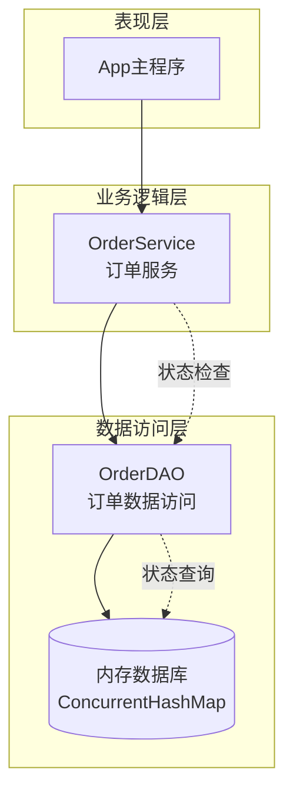
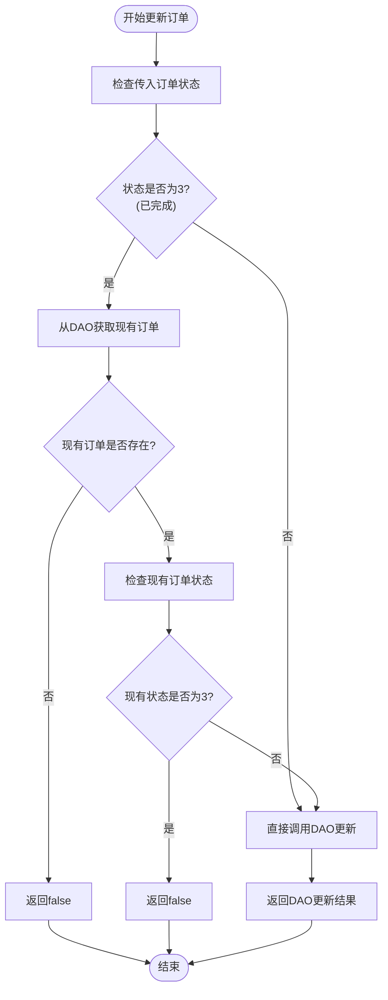
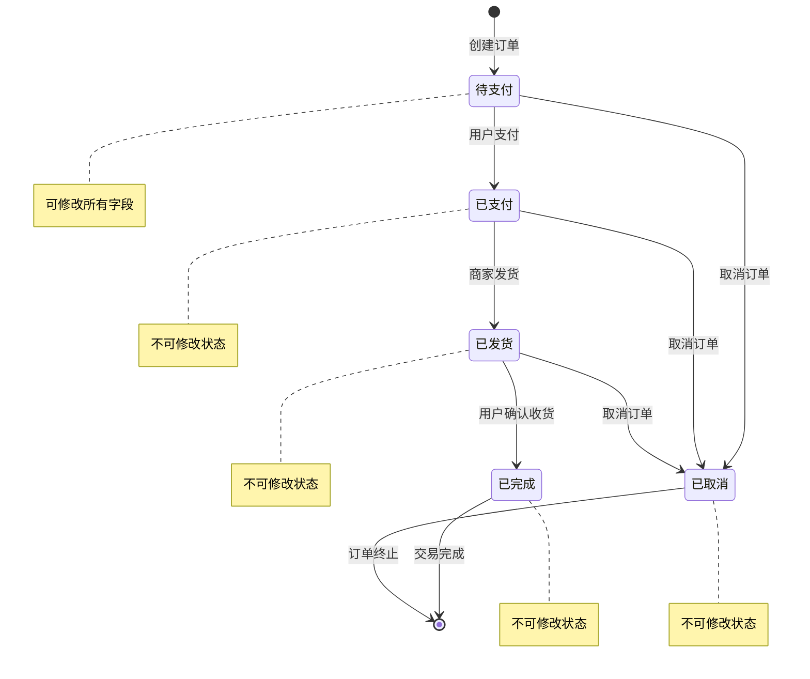
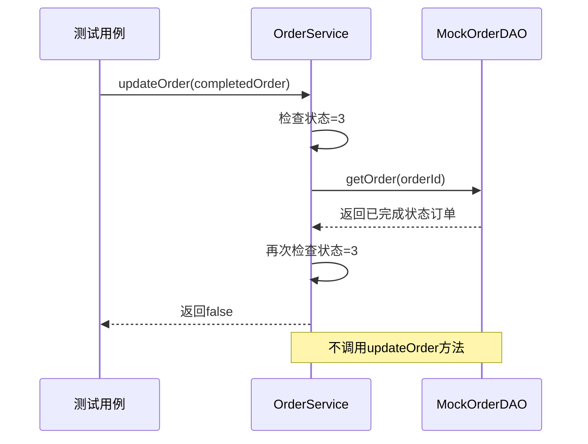
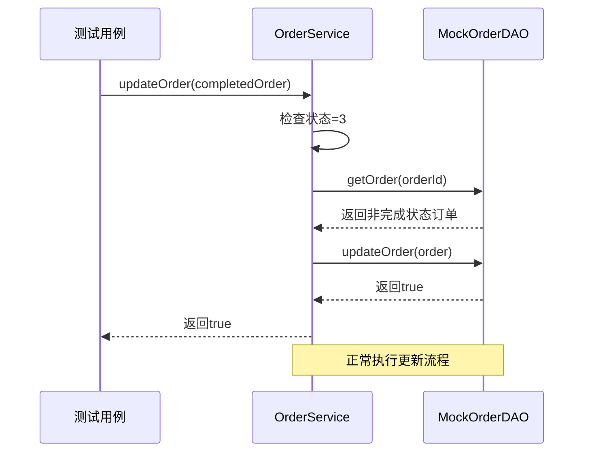

# 订单更新状态保护机制分析

<cite>
**本文档引用的文件**
- [OrderService.java](file://src/main/java/com/example/demo/service/OrderService.java)
- [Order.java](file://src/main/java/com/example/demo/entity/Order.java)
- [OrderDAO.java](file://src/main/java/com/example/demo/dao/OrderDAO.java)
- [OrderServiceTest.java](file://src/test/java/com/example/demo/service/OrderServiceTest.java)
- [App.java](file://src/main/java/com/example/demo/App.java)
</cite>

## 目录
1. [引言](#引言)
2. [系统架构概览](#系统架构概览)
3. [订单状态模型](#订单状态模型)
4. [updateOrder方法核心逻辑](#updateorder方法核心逻辑)
5. [状态保护机制详解](#状态保护机制详解)
6. [状态机生命周期分析](#状态机生命周期分析)
7. [测试用例分析](#测试用例分析)
8. [业务一致性保障](#业务一致性保障)
9. [总结](#总结)

## 引言

在电商系统中，订单状态管理是确保业务流程正确性和数据一致性的关键组件。本文档深入分析OrderService中updateOrder方法的状态保护机制，重点关注当订单状态为3（已完成）时的防护逻辑，探讨该设计如何防止已完成订单被非法修改，保障业务一致性。

## 系统架构概览

系统采用经典的三层架构模式，实现了业务逻辑与数据访问的分离：



**图表来源**
- [OrderService.java](file://src/main/java/com/example/demo/service/OrderService.java#L1-L81)
- [OrderDAO.java](file://src/main/java/com/example/demo/dao/OrderDAO.java#L1-L148)

**章节来源**
- [OrderService.java](file://src/main/java/com/example/demo/service/OrderService.java#L1-L81)
- [OrderDAO.java](file://src/main/java/com/example/demo/dao/OrderDAO.java#L1-L148)

## 订单状态模型

订单状态采用整数编码，定义了完整的生命周期状态：

| 状态码 | 状态名称 | 描述 | 可修改性 |
|--------|----------|------|----------|
| 0 | 待支付 | 订单已创建，等待用户付款 | ✅ 可修改 |
| 1 | 已支付 | 用户已完成支付 | ❌ 不可修改 |
| 2 | 已发货 | 商家已发货，等待收货 | ❌ 不可修改 |
| 3 | 已完成 | 用户确认收货，交易完成 | ❌ 不可修改 |
| 4 | 已取消 | 订单被取消 | ❌ 不可修改 |

**章节来源**
- [Order.java](file://src/main/java/com/example/demo/entity/Order.java#L25-L27)

## updateOrder方法核心逻辑

updateOrder方法实现了智能的状态保护机制，通过双重检查确保已完成订单的安全性：



**图表来源**
- [OrderService.java](file://src/main/java/com/example/demo/service/OrderService.java#L52-L65)

**章节来源**
- [OrderService.java](file://src/main/java/com/example/demo/service/OrderService.java#L52-L65)

## 状态保护机制详解

### 第一重保护：状态预检查

方法首先检查传入订单对象的状态字段，如果状态为3（已完成），触发保护机制：

```java
if (order.getStatus() != null && order.getStatus() == 3) {
    // 已完成订单不能修改
    Order existing = getOrderDAO().getOrder(order.getOrderId());
    if (existing != null && existing.getStatus() == 3) {
        return false;
    }
}
```

### 第二重保护：数据库一致性验证

即使传入订单状态为3，系统还会从数据库中获取当前真实状态进行验证：

1. **获取现有订单**：通过`getOrderDAO().getOrder()`从数据层获取最新状态
2. **状态对比**：比较数据库中的状态与传入状态的一致性
3. **拒绝更新**：如果数据库中状态仍为3，则拒绝更新并返回false

### 设计优势

这种双重验证机制具有以下优势：

- **防止并发修改**：避免多个请求同时修改已完成订单
- **确保数据一致性**：保证数据库状态与业务逻辑一致
- **提高系统可靠性**：减少因状态错误导致的业务问题

**章节来源**
- [OrderService.java](file://src/main/java/com/example/demo/service/OrderService.java#L52-L65)

## 状态机生命周期分析

订单状态遵循有限状态自动机模型，在整个生命周期中具有明确的可变区间：



**图表来源**
- [Order.java](file://src/main/java/com/example/demo/entity/Order.java#L25-L27)

### 可变区间分析

| 生命周期阶段 | 可修改字段 | 不可修改字段 | 保护机制 |
|-------------|------------|--------------|----------|
| 待支付 | 所有字段 | 状态 | 无特殊限制 |
| 已支付 | 非状态字段 | 状态、支付时间 | 状态锁定 |
| 已发货 | 非状态字段 | 状态、发货时间 | 状态锁定 |
| 已完成 | 无 | 所有字段 | 状态锁定+双重验证 |
| 已取消 | 无 | 所有字段 | 状态锁定 |

**章节来源**
- [Order.java](file://src/main/java/com/example/demo/entity/Order.java#L25-L27)

## 测试用例分析

系统提供了完整的单元测试覆盖，重点验证已完成订单的保护机制：

### 测试用例1：已完成订单更新保护



**图表来源**
- [OrderServiceTest.java](file://src/test/java/com/example/demo/service/OrderServiceTest.java#L148-L170)

### 测试用例2：已完成订单状态变更



**图表来源**
- [OrderServiceTest.java](file://src/test/java/com/example/demo/service/OrderServiceTest.java#L172-L194)

### 测试覆盖范围

| 测试场景 | 预期结果 | 验证要点 |
|----------|----------|----------|
| 已完成订单更新 | 返回false | 不调用DAO更新 |
| 已完成订单状态变更 | 返回DAO结果 | 正常更新流程 |
| 非完成状态订单 | 返回DAO结果 | 无状态检查 |
| DAO返回false | 返回false | 传播DAO结果 |

**章节来源**
- [OrderServiceTest.java](file://src/test/java/com/example/demo/service/OrderServiceTest.java#L148-L248)

## 业务一致性保障

### 数据完整性保护

状态保护机制从多个层面确保数据完整性：

1. **应用层保护**：OrderService的业务逻辑验证
2. **数据层保护**：OrderDAO的数据操作控制
3. **并发控制**：双重验证防止并发修改

### 错误处理策略

系统采用优雅降级的错误处理策略：

- **拒绝更新**：返回false表示操作失败
- **保持原状**：不改变数据库中的订单状态
- **日志记录**：可通过扩展添加审计日志

### 性能考虑

该保护机制在性能上做了优化：

- **条件检查**：仅对状态为3的订单进行额外检查
- **缓存友好**：利用内存数据库的快速查询
- **最小化开销**：只在必要时进行数据库查询

**章节来源**
- [OrderService.java](file://src/main/java/com/example/demo/service/OrderService.java#L52-L65)
- [OrderDAO.java](file://src/main/java/com/example/demo/dao/OrderDAO.java#L118-L147)

## 总结

OrderService的updateOrder方法实现了一个精巧的状态保护机制，通过双重验证确保已完成订单的安全性。该设计具有以下特点：

### 核心价值

1. **业务一致性**：严格维护订单状态的业务规则
2. **数据安全性**：防止已完成订单被非法修改
3. **系统稳定性**：通过保护机制减少业务错误
4. **可测试性**：完整的单元测试覆盖关键场景

### 最佳实践

- **防御性编程**：双重检查确保数据一致性
- **状态机思维**：清晰定义状态转换规则
- **分层架构**：业务逻辑与数据访问分离
- **测试驱动**：全面的单元测试验证功能

### 应用建议

该状态保护机制可以作为其他业务系统的参考模板，特别是在需要严格状态管理的场景中。通过类似的双重验证机制，可以有效防止数据篡改，确保业务流程的正确执行。