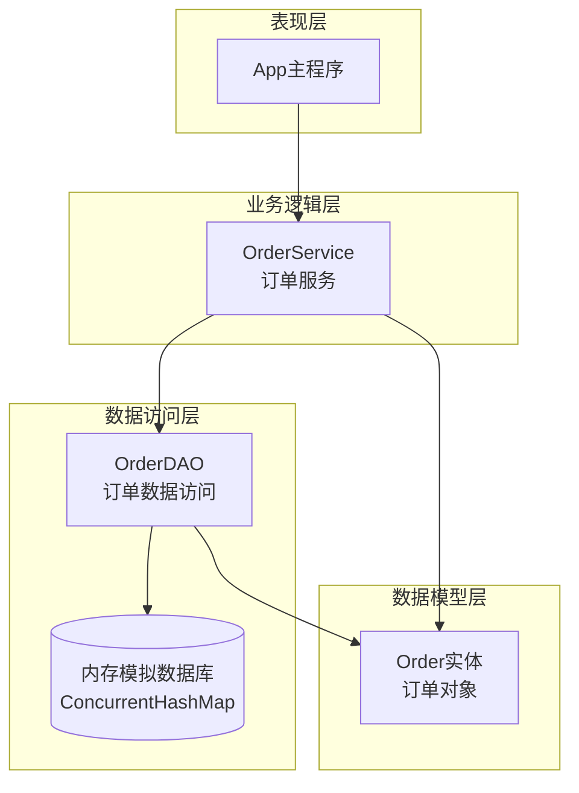
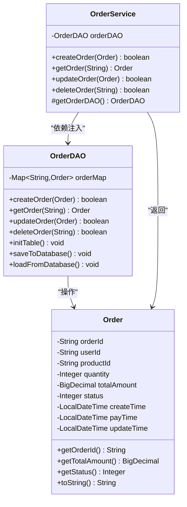
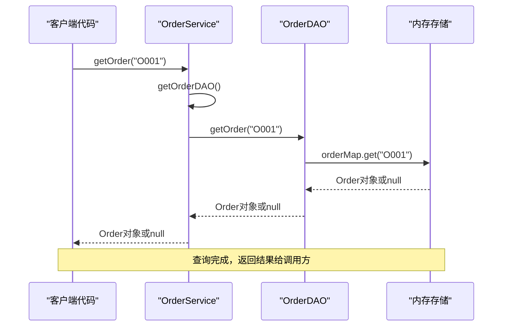
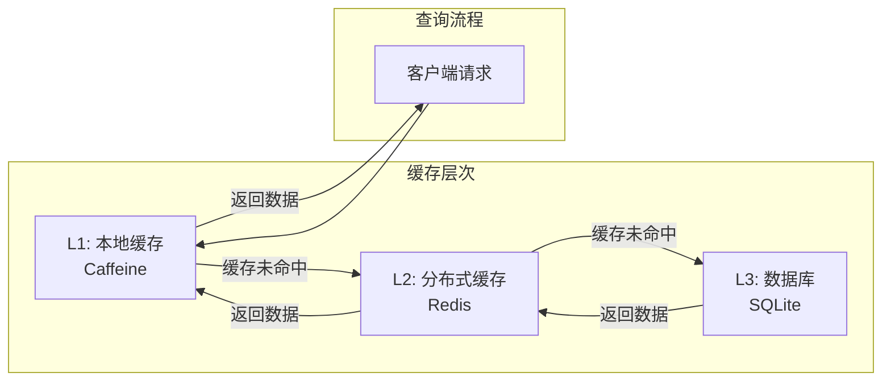

# 订单查询服务深度解析

<cite>
**本文档引用的文件**
- [OrderService.java](file://src/main/java/com/example/demo/service/OrderService.java)
- [OrderDAO.java](file://src/main/java/com/example/demo/dao/OrderDAO.java)
- [Order.java](file://src/main/java/com/example/demo/entity/Order.java)
- [App.java](file://src/main/java/com/example/demo/App.java)
- [OrderServiceTest.java](file://src/test/java/com/example/demo/service/OrderServiceTest.java)
- [DBUtil.java](file://src/main/java/com/example/demo/dao/DBUtil.java)
</cite>

## 目录
1. [引言](#引言)
2. [系统架构概览](#系统架构概览)
3. [OrderService核心组件分析](#orderservice核心组件分析)
4. [getOrder方法实现原理](#getorder方法实现原理)
5. [调用示例与使用指南](#调用示例与使用指南)
6. [性能特征与优化策略](#性能特征与优化策略)
7. [高并发场景下的优化方案](#高并发场景下的优化方案)
8. [故障排除与最佳实践](#故障排除与最佳实践)
9. [总结](#总结)

## 引言

OrderService作为订单管理系统的核心服务层组件，采用了经典的分层架构设计，实现了业务逻辑与数据访问的清晰分离。其中，`getOrder(String orderId)`方法作为最基础的查询接口，展现了现代软件架构中简单代理模式的优雅实现。本文将深入解析该方法的设计理念、实现原理以及在实际应用中的性能表现。

## 系统架构概览

本系统采用三层架构模式，通过清晰的职责分离实现了高度的可维护性和可扩展性：



**图表来源**
- [OrderService.java](file://src/main/java/com/example/demo/service/OrderService.java#L1-L81)
- [OrderDAO.java](file://src/main/java/com/example/demo/dao/OrderDAO.java#L1-L148)
- [Order.java](file://src/main/java/com/example/demo/entity/Order.java#L1-L143)

**章节来源**
- [OrderService.java](file://src/main/java/com/example/demo/service/OrderService.java#L1-L20)
- [OrderDAO.java](file://src/main/java/com/example/demo/dao/OrderDAO.java#L1-L30)

## OrderService核心组件分析

OrderService类体现了良好的面向对象设计原则，通过依赖注入和保护方法模式增强了测试性和灵活性：



**图表来源**
- [OrderService.java](file://src/main/java/com/example/demo/service/OrderService.java#L8-L81)
- [OrderDAO.java](file://src/main/java/com/example/demo/dao/OrderDAO.java#L12-L148)
- [Order.java](file://src/main/java/com/example/demo/entity/Order.java#L8-L142)

**章节来源**
- [OrderService.java](file://src/main/java/com/example/demo/service/OrderService.java#L8-L20)
- [OrderDAO.java](file://src/main/java/com/example/demo/dao/OrderDAO.java#L12-L30)

## getOrder方法实现原理

### 方法签名与功能描述

`getOrder(String orderId)`方法是一个典型的简单代理模式实现，其设计哲学体现了"最小化职责"的原则：

```java
public Order getOrder(String orderId) {
    return getOrderDAO().getOrder(orderId);
}
```

### 实现机制详解

该方法的实现过程遵循以下步骤：

1. **参数验证阶段**：虽然方法本身没有进行参数校验，但在实际调用链中，上游服务通常会进行必要的输入验证
2. **委托调用阶段**：通过`getOrderDAO()`方法获取数据访问层实例，并调用其`getOrder`方法
3. **结果传递阶段**：直接返回底层DAO方法的执行结果，不做任何额外处理

### 底层实现分析

OrderDAO中的`getOrder`方法采用内存Map存储，提供了O(1)时间复杂度的查找性能：

```java
public Order getOrder(String orderId) {
    return orderMap.get(orderId);
}
```

**章节来源**
- [OrderService.java](file://src/main/java/com/example/demo/service/OrderService.java#L32-L35)
- [OrderDAO.java](file://src/main/java/com/example/demo/dao/OrderDAO.java#L108-L111)

## 调用示例与使用指南

### 正常查询场景

以下是标准的订单查询使用模式：

```java
// 创建服务实例
OrderService orderService = new OrderService();

// 查询存在的订单
Order order = orderService.getOrder("O001");
if (order != null) {
    System.out.println("订单详情: " + order);
} else {
    System.out.println("订单不存在");
}
```

### 未找到订单的处理

当查询不存在的订单时，方法返回null，调用方需要进行适当的空值检查：

```java
Order order = orderService.getOrder("NON_EXISTENT_ORDER_ID");
if (order == null) {
    // 处理订单不存在的情况
    System.out.println("请求的订单不存在");
} else {
    // 处理正常情况
    processOrder(order);
}
```

### 完整的应用示例

基于App.java中的实际使用场景：



**图表来源**
- [App.java](file://src/main/java/com/example/demo/App.java#L35-L40)
- [OrderService.java](file://src/main/java/com/example/demo/service/OrderService.java#L32-L35)
- [OrderDAO.java](file://src/main/java/com/example/demo/dao/OrderDAO.java#L108-L111)

**章节来源**
- [App.java](file://src/main/java/com/example/demo/App.java#L35-L40)
- [OrderServiceTest.java](file://src/test/java/com/example/demo/service/OrderServiceTest.java#L260-L280)

## 性能特征与优化策略

### 时间复杂度分析

getOrder方法的时间复杂度为O(1)，这是由于底层使用了ConcurrentHashMap实现：

| 操作类型 | 时间复杂度 | 空间复杂度 | 说明 |
|---------|-----------|-----------|------|
| 查找操作 | O(1) | O(n) | 哈希表查找，平均时间复杂度为常数 |
| 内存占用 | O(n) | O(n) | n为订单数量，每个订单占用固定空间 |
| 并发支持 | O(1) amortized | O(n) | 支持多线程并发读取 |

### 空间复杂度分析

- **内存使用**：每个Order对象占用约100-200字节（取决于具体属性）
- **哈希表开销**：ConcurrentHashMap额外占用约20-30%的内存
- **总体估算**：每百万订单占用约100MB内存

### 性能优化建议

1. **内存优化**：
   - 考虑使用更紧凑的数据结构
   - 实现对象池化减少GC压力
   - 启用JVM压缩指针（-XX:+UseCompressedOops）

2. **并发优化**：
   - 利用ConcurrentHashMap的分段锁机制
   - 避免长时间持有锁
   - 考虑读写分离策略

**章节来源**
- [OrderDAO.java](file://src/main/java/com/example/demo/dao/OrderDAO.java#L12-L15)
- [OrderService.java](file://src/main/java/com/example/demo/service/OrderService.java#L32-L35)

## 高并发场景下的优化方案

### 缓存机制引入

为了应对高并发查询场景，可以引入多级缓存架构：



### 缓存策略设计

1. **缓存键设计**：
   ```java
   String cacheKey = "order:" + orderId;
   ```

2. **过期策略**：
   - TTL（Time To Live）：订单信息通常不会频繁变化，可设置较长TTL（如24小时）
   - 主动失效：订单状态变更时主动清除缓存

3. **缓存预热**：
   - 系统启动时预加载热点订单
   - 定期刷新缓存数据

### 异步处理优化

对于非关键路径的查询，可以考虑异步处理：

```java
CompletableFuture<Order> futureOrder = CompletableFuture.supplyAsync(() -> 
    orderService.getOrder(orderId)
);
```

### 监控指标

建议监控以下关键指标：

| 指标名称 | 监控目的 | 告警阈值 |
|---------|---------|---------|
| 查询QPS | 并发能力评估 | >1000 req/s |
| 响应时间 | 性能监控 | >10ms |
| 缓存命中率 | 缓存效果评估 | <90% |
| 内存使用率 | 资源监控 | >80% |

## 故障排除与最佳实践

### 常见问题诊断

1. **查询超时**：
   - 检查网络连接稳定性
   - 验证数据库连接池配置
   - 监控系统资源使用情况

2. **内存泄漏**：
   - 定期检查ConcurrentHashMap大小
   - 监控垃圾回收频率
   - 实施缓存清理策略

3. **并发冲突**：
   - 分析锁竞争情况
   - 优化并发控制策略
   - 考虑读写分离

### 最佳实践建议

1. **错误处理**：
   ```java
   public Order safeGetOrder(String orderId) {
       try {
           return getOrder(orderId);
       } catch (Exception e) {
           logger.error("查询订单失败: {}", orderId, e);
           return null;
       }
   }
   ```

2. **日志记录**：
   ```java
   logger.debug("查询订单: orderId={}", orderId);
   ```

3. **限流保护**：
   ```java
   RateLimiter rateLimiter = RateLimiter.create(100.0);
   if (rateLimiter.tryAcquire()) {
       return getOrder(orderId);
   } else {
       throw new RateLimitException("请求过于频繁");
   }
   ```

**章节来源**
- [OrderServiceTest.java](file://src/test/java/com/example/demo/service/OrderServiceTest.java#L260-L290)
- [OrderDAO.java](file://src/main/java/com/example/demo/dao/OrderDAO.java#L108-L111)

## 总结

OrderService中的getOrder方法展现了现代软件架构中简单代理模式的精髓。作为一个轻量级的查询接口，它具有以下核心优势：

1. **简洁性**：方法实现极其简洁，符合单一职责原则
2. **高效性**：O(1)时间复杂度，适合高频查询场景
3. **可测试性**：通过保护方法设计，便于单元测试
4. **可扩展性**：支持缓存、监控等横向扩展

在实际应用中，该方法特别适用于实时订单查询场景，如订单状态跟踪、订单详情展示等。通过合理的缓存策略和监控机制，可以在保证性能的同时确保系统的稳定性和可靠性。

对于大规模应用，建议结合分布式缓存、异步处理等技术手段进一步提升系统性能，同时建立完善的监控和告警体系，确保系统在高并发环境下的稳定运行。