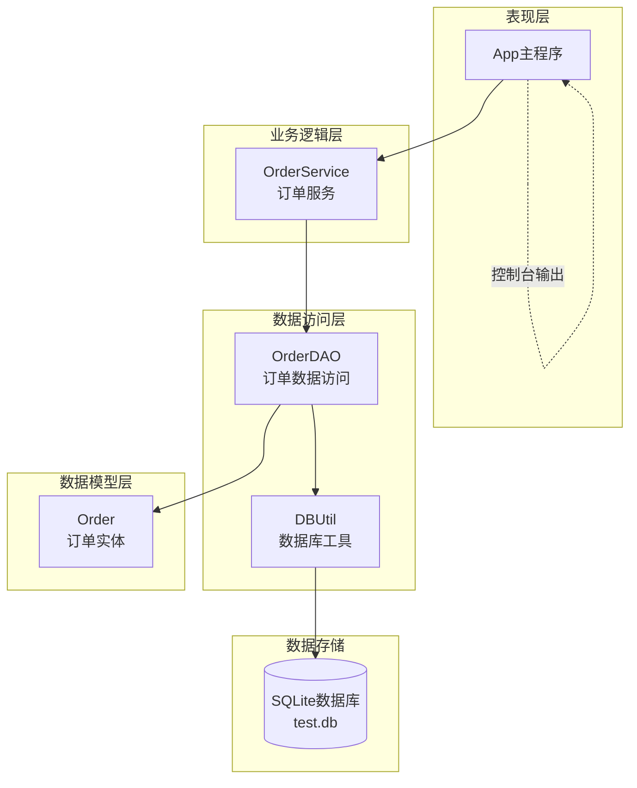
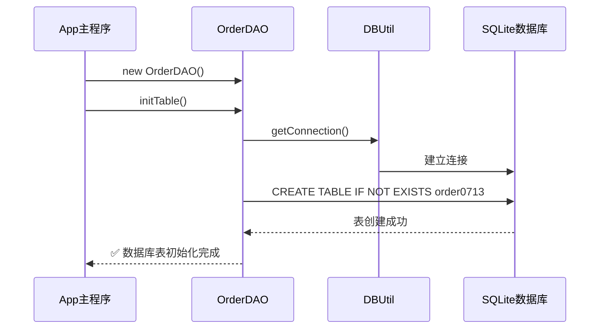
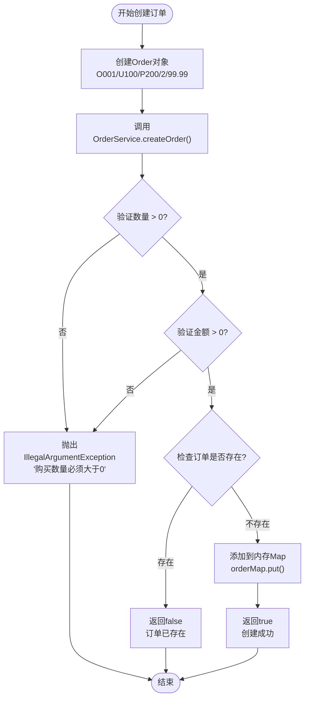
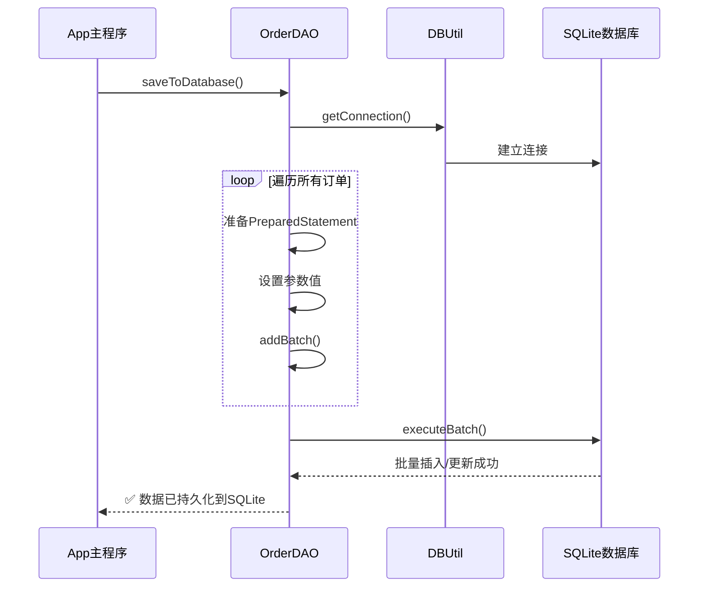
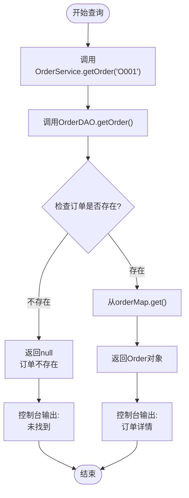
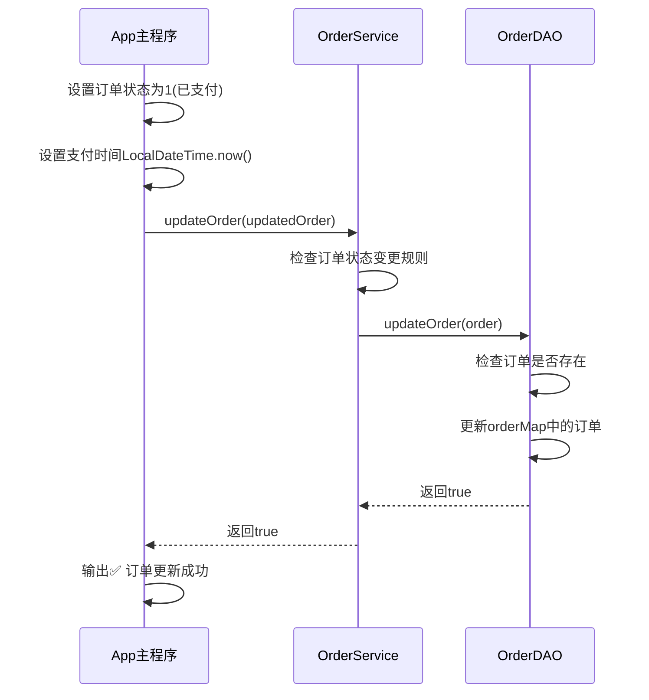
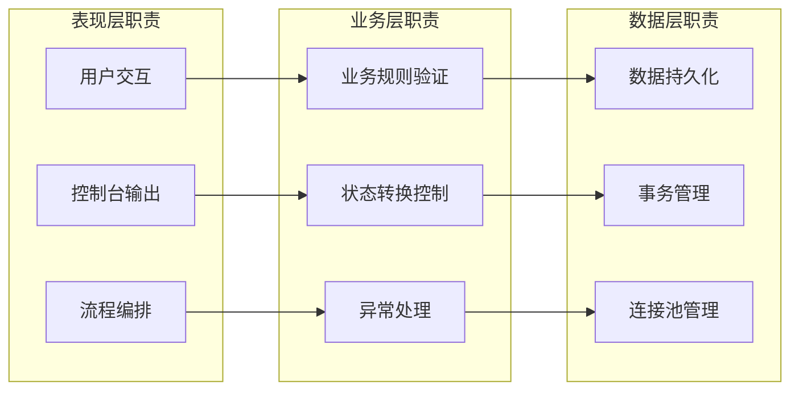
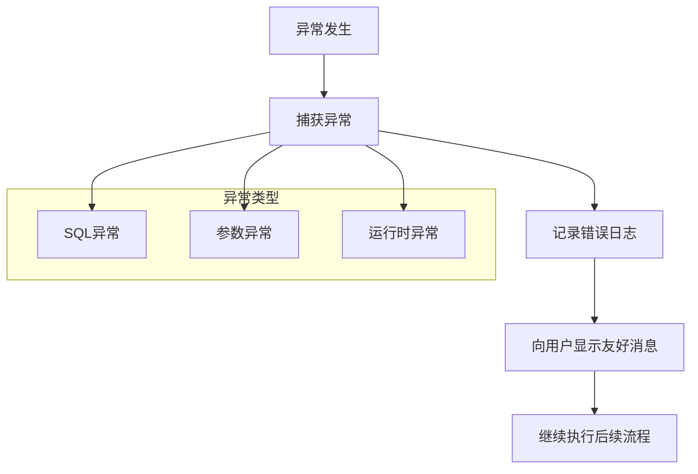

# 主程序执行流程

<cite>
**本文档中引用的文件**
- [App.java](file://src/main/java/com/example/demo/App.java)
- [OrderDAO.java](file://src/main/java/com/example/demo/dao/OrderDAO.java)
- [OrderService.java](file://src/main/java/com/example/demo/service/OrderService.java)
- [Order.java](file://src/main/java/com/example/demo/entity/Order.java)
- [DBUtil.java](file://src/main/java/com/example/demo/dao/DBUtil.java)
- [pom.xml](file://pom.xml)
</cite>

## 目录
1. [系统概述](#系统概述)
2. [核心组件架构](#核心组件架构)
3. [执行流程详解](#执行流程详解)
4. [组件协作模式](#组件协作模式)
5. [系统反馈机制](#系统反馈机制)
6. [技术实现要点](#技术实现要点)
7. [总结](#总结)

## 系统概述

本订单管理系统是一个基于Java的集成测试示例，展示了完整的订单生命周期管理功能。系统采用经典的三层架构设计：表现层（App）、业务逻辑层（OrderService）、数据访问层（OrderDAO），并通过SQLite数据库实现数据持久化。

系统的核心价值在于作为集成测试入口，验证各组件间的协同工作能力，同时展示订单管理的完整业务流程。

## 核心组件架构



**图表来源**
- [App.java](file://src/main/java/com/example/demo/App.java#L1-L62)
- [OrderService.java](file://src/main/java/com/example/demo/service/OrderService.java#L1-L81)
- [OrderDAO.java](file://src/main/java/com/example/demo/dao/OrderDAO.java#L1-L148)
- [DBUtil.java](file://src/main/java/com/example/demo/dao/DBUtil.java#L1-L19)

**章节来源**
- [App.java](file://src/main/java/com/example/demo/App.java#L1-L62)
- [OrderService.java](file://src/main/java/com/example/demo/service/OrderService.java#L1-L81)
- [OrderDAO.java](file://src/main/java/com/example/demo/dao/OrderDAO.java#L1-L148)

## 执行流程详解

### 第一阶段：系统初始化与数据库准备



**图表来源**
- [App.java](file://src/main/java/com/example/demo/App.java#L12-L14)
- [OrderDAO.java](file://src/main/java/com/example/demo/dao/OrderDAO.java#L19-L36)
- [DBUtil.java](file://src/main/java/com/example/demo/dao/DBUtil.java#L14-L16)

系统启动时首先创建OrderDAO实例并调用initTable方法。该方法负责：
1. **数据库连接建立**：通过DBUtil.getConnection()获取SQLite连接
2. **表结构定义**：创建名为order0713的订单表，包含orderId（主键）、userId、productId、quantity、totalAmount、status、createTime、payTime、updateTime等字段
3. **异常处理**：捕获SQL异常并输出错误信息

**章节来源**
- [App.java](file://src/main/java/com/example/demo/App.java#L12-L14)
- [OrderDAO.java](file://src/main/java/com/example/demo/dao/OrderDAO.java#L19-L36)

### 第二阶段：订单创建与业务校验



**图表来源**
- [App.java](file://src/main/java/com/example/demo/App.java#L17-L22)
- [OrderService.java](file://src/main/java/com/example/demo/service/OrderService.java#L17-L27)

订单创建过程包含严格的业务校验：
1. **数量校验**：确保购买数量大于0
2. **金额校验**：确保订单总金额大于0
3. **重复性检查**：验证订单ID是否已存在
4. **内存存储**：成功后将订单添加到ConcurrentHashMap

**章节来源**
- [App.java](file://src/main/java/com/example/demo/App.java#L17-L22)
- [OrderService.java](file://src/main/java/com/example/demo/service/OrderService.java#L17-L27)

### 第三阶段：数据持久化到SQLite



**图表来源**
- [App.java](file://src/main/java/com/example/demo/App.java#L25-L26)
- [OrderDAO.java](file://src/main/java/com/example/demo/dao/OrderDAO.java#L41-L67)

数据持久化采用批量操作策略：
1. **SQL语句构建**：使用INSERT OR REPLACE确保数据一致性
2. **参数绑定**：将Order对象属性映射到SQL参数
3. **批处理优化**：使用addBatch()和executeBatch()提高性能
4. **异常处理**：捕获SQL异常并输出详细错误信息

**章节来源**
- [App.java](file://src/main/java/com/example/demo/App.java#L25-L26)
- [OrderDAO.java](file://src/main/java/com/example/demo/dao/OrderDAO.java#L41-L67)

### 第四阶段：订单查询与检索



**图表来源**
- [App.java](file://src/main/java/com/example/demo/App.java#L29-L30)
- [OrderDAO.java](file://src/main/java/com/example/demo/dao/OrderDAO.java#L85-L89)

订单查询功能：
1. **快速检索**：通过orderId在ConcurrentHashMap中进行O(1)查找
2. **空值处理**：订单不存在时返回null
3. **格式化输出**：使用Order.toString()提供可读的订单信息

**章节来源**
- [App.java](file://src/main/java/com/example/demo/App.java#L29-L30)
- [OrderDAO.java](file://src/main/java/com/example/demo/dao/OrderDAO.java#L85-L89)

### 第五阶段：订单状态更新与支付处理



**图表来源**
- [App.java](file://src/main/java/com/example/demo/App.java#L33-L40)
- [OrderService.java](file://src/main/java/com/example/demo/service/OrderService.java#L52-L63)

订单更新包含以下规则：
1. **状态变更检查**：如果状态设为3（已完成），需要验证原状态
2. **幂等性保证**：已完成订单不允许再次修改
3. **时间戳更新**：自动更新updateTime字段
4. **状态同步**：payTime字段仅在支付时设置

**章节来源**
- [App.java](file://src/main/java/com/example/demo/App.java#L33-L40)
- [OrderService.java](file://src/main/java/com/example/demo/service/OrderService.java#L52-L63)

### 第六阶段：订单删除与业务规则验证

```mermaid
flowchart TD
Start([开始删除]) --> GetOrder["调用OrderDAO.getOrder('O001')"]
GetOrder --> CheckStatus{"检查订单状态"}
CheckStatus --> |状态=1(已支付)| BlockDelete["阻止删除<br/>返回false"]
CheckStatus --> |其他状态| AllowDelete["允许删除<br/>继续流程"]
BlockDelete --> OutputFail["输出❌ 订单删除失败"]
AllowDelete --> CallDelete["调用OrderDAO.deleteOrder()"]
CallDelete --> RemoveFromMap["从orderMap.remove()"]
RemoveFromMap --> OutputSuccess["输出✅ 订单删除成功"]
OutputFail --> Persist["保存到数据库"]
OutputSuccess --> Persist
Persist --> End([结束])
```

**图表来源**
- [App.java](file://src/main/java/com/example/demo/App.java#L43-L46)
- [OrderService.java](file://src/main/java/com/example/demo/service/OrderService.java#L70-L79)

删除操作的业务规则：
1. **支付状态检查**：已支付订单（状态=1）禁止删除
2. **状态兼容性**：其他状态下允许删除
3. **原子性操作**：删除成功后立即持久化
4. **异常处理**：删除失败时明确提示原因

**章节来源**
- [App.java](file://src/main/java/com/example/demo/App.java#L43-L46)
- [OrderService.java](file://src/main/java/com/example/demo/service/OrderService.java#L70-L79)

## 组件协作模式

### 分层架构设计



**图表来源**
- [App.java](file://src/main/java/com/example/demo/App.java#L1-L62)
- [OrderService.java](file://src/main/java/com/example/demo/service/OrderService.java#L1-L81)
- [OrderDAO.java](file://src/main/java/com/example/demo/dao/OrderDAO.java#L1-L148)

### 组件间通信机制

| 组件对 | 调用方式 | 参数传递 | 返回值 | 异常处理 |
|--------|----------|----------|--------|----------|
| App → OrderService | 直接方法调用 | Order对象或orderId | boolean/Order | 控制台输出 |
| OrderService → OrderDAO | 方法委托 | 业务参数 | boolean/Order | 抛出运行时异常 |
| OrderDAO → DBUtil | 静态方法调用 | 无 | Connection | SQLException |
| OrderDAO ↔ SQLite | JDBC接口 | SQL语句+参数 | ResultSet/影响行数 | SQLException |

**章节来源**
- [App.java](file://src/main/java/com/example/demo/App.java#L1-L62)
- [OrderService.java](file://src/main/java/com/example/demo/service/OrderService.java#L1-L81)
- [OrderDAO.java](file://src/main/java/com/example/demo/dao/OrderDAO.java#L1-L148)

## 系统反馈机制

### 控制台输出规范

系统采用统一的控制台输出格式来提供实时反馈：

| 操作阶段 | 成功标识 | 失败标识 | 错误信息格式 |
|----------|----------|----------|--------------|
| 数据库初始化 | ✅ | ❌ | "数据库初始化失败: {错误消息}" |
| 订单创建 | ✅ | ❌ | "订单创建成功"/"订单创建失败" |
| 数据持久化 | ✅ | ❌ | "数据已持久化到SQLite"/"数据保存失败: {错误消息}" |
| 订单查询 | ✅ | ❌ | "查询结果: {订单信息}"/"未找到" |
| 订单更新 | ✅ | ❌ | "订单更新成功"/"订单更新失败" |
| 订单删除 | ✅ | ❌ | "订单删除成功"/"订单删除失败" |

### 错误处理策略



**图表来源**
- [OrderDAO.java](file://src/main/java/com/example/demo/dao/OrderDAO.java#L25-L27)
- [OrderDAO.java](file://src/main/java/com/example/demo/dao/OrderDAO.java#L69-L71)
- [OrderService.java](file://src/main/java/com/example/demo/service/OrderService.java#L19-L21)

**章节来源**
- [App.java](file://src/main/java/com/example/demo/App.java#L14-L46)
- [OrderDAO.java](file://src/main/java/com/example/demo/dao/OrderDAO.java#L25-L27)
- [OrderDAO.java](file://src/main/java/com/example/demo/dao/OrderDAO.java#L69-L71)

## 技术实现要点

### 数据库设计考虑

| 字段名 | 数据类型 | 约束条件 | 用途说明 |
|--------|----------|----------|----------|
| orderId | TEXT | PRIMARY KEY | 订单唯一标识符 |
| userId | TEXT | 无 | 用户身份标识 |
| productId | TEXT | 无 | 商品身份标识 |
| quantity | INTEGER | 无 | 购买数量 |
| totalAmount | TEXT | 无 | 订单总金额（字符串存储避免精度丢失） |
| status | INTEGER | 无 | 订单状态：0-待支付, 1-已支付, 2-已发货, 3-已完成, 4-已取消 |
| createTime | TEXT | 无 | 订单创建时间 |
| payTime | TEXT | 无 | 支付完成时间 |
| updateTime | TEXT | 无 | 最后更新时间 |

### 性能优化策略

1. **批量操作**：saveToDatabase方法使用PreparedStatement批量处理
2. **内存缓存**：OrderDAO使用ConcurrentHashMap提供快速访问
3. **连接复用**：DBUtil管理数据库连接池
4. **索引优化**：orderId作为主键自动建立索引

### 安全性考虑

1. **输入验证**：OrderService对订单参数进行严格校验
2. **状态约束**：防止非法状态转换
3. **并发安全**：使用ConcurrentHashMap处理多线程访问
4. **异常隔离**：各层异常独立处理不相互传播

**章节来源**
- [OrderDAO.java](file://src/main/java/com/example/demo/dao/OrderDAO.java#L20-L30)
- [OrderDAO.java](file://src/main/java/com/example/demo/dao/OrderDAO.java#L41-L67)
- [OrderService.java](file://src/main/java/com/example/demo/service/OrderService.java#L17-L27)

## 总结

App.java作为系统集成测试入口，完整展示了订单管理系统的执行流程，体现了以下核心价值：

### 架构优势
1. **清晰分层**：表现层、业务层、数据层职责分明
2. **松耦合设计**：组件间通过接口而非具体实现依赖
3. **可测试性**：支持单元测试和集成测试
4. **可扩展性**：易于添加新的业务规则和数据源

### 业务完整性
1. **生命周期覆盖**：从创建到删除的完整订单管理
2. **业务规则**：支付状态约束、重复性检查等
3. **数据一致性**：内存与数据库的同步保障
4. **异常处理**：完善的错误处理和用户反馈机制

### 技术特色
1. **JDBC集成**：SQLite数据库的直接操作
2. **并发安全**：线程安全的数据结构
3. **性能优化**：批量操作和内存缓存
4. **开发效率**：简洁明了的代码结构

该系统不仅作为集成测试验证了各组件的协同工作能力，更为实际的订单管理系统开发提供了良好的架构参考和最佳实践示范。通过控制台输出的实时反馈机制，开发者可以直观地了解系统运行状态，便于调试和问题定位。