# OrderDAO CRUD操作实现

<cite>
**本文档引用的文件**
- [OrderDAO.java](file://src/main/java/com/example/demo/dao/OrderDAO.java)
- [Order.java](file://src/main/java/com/example/demo/entity/Order.java)
- [OrderService.java](file://src/main/java/com/example/demo/service/OrderService.java)
- [DBUtil.java](file://src/main/java/com/example/demo/dao/DBUtil.java)
- [App.java](file://src/main/java/com/example/demo/App.java)
- [OrderServiceTest.java](file://src/test/java/com/example/demo/service/OrderServiceTest.java)
</cite>

## 目录
1. [概述](#概述)
2. [系统架构](#系统架构)
3. [核心数据结构](#核心数据结构)
4. [CRUD操作详解](#crud操作详解)
5. [线程安全机制](#线程安全机制)
6. [异常处理机制](#异常处理机制)
7. [业务层集成](#业务层集成)
8. [性能优化特性](#性能优化特性)
9. [测试策略](#测试策略)
10. [最佳实践](#最佳实践)

## 概述

OrderDAO（订单数据访问对象）是本系统中负责订单数据持久化的核心组件，采用内存映射加数据库同步的设计模式。它通过ConcurrentHashMap实现高效的内存操作，并在事务中同步更新SQLite数据库，提供完整的CRUD功能。

该设计实现了以下关键特性：
- **内存优先**：使用ConcurrentHashMap作为主要存储介质，提供毫秒级响应速度
- **事务一致性**：通过批量操作确保内存与数据库的一致性
- **线程安全**：利用ConcurrentHashMap的原子操作保证并发安全性
- **异常透明**：SQL异常的包装与传播机制

## 系统架构

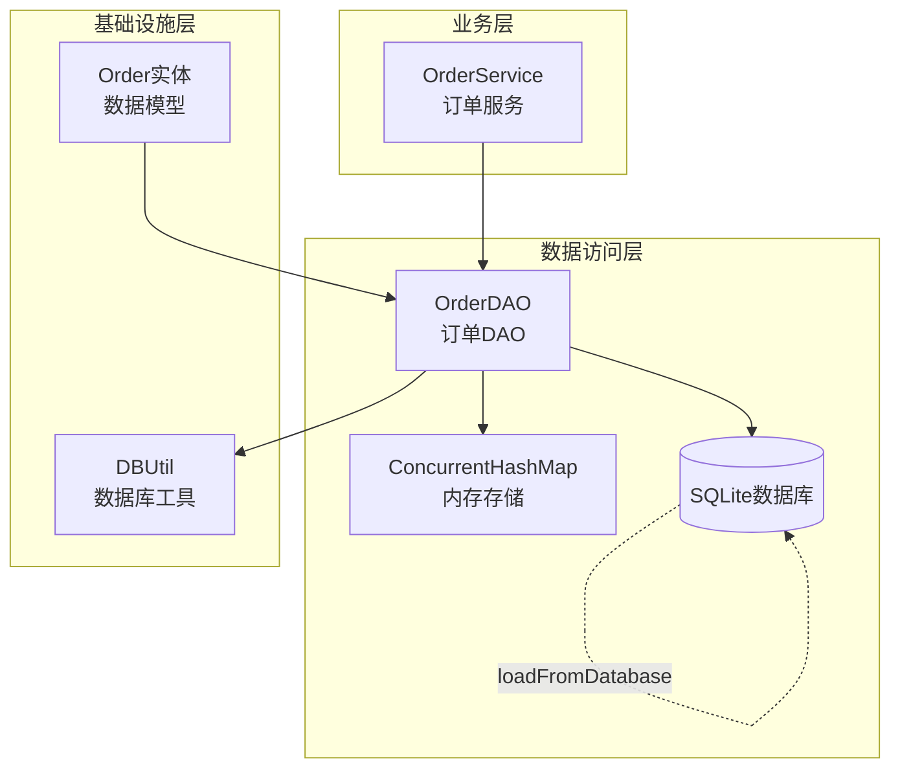

**图表来源**
- [OrderDAO.java](file://src/main/java/com/example/demo/dao/OrderDAO.java#L1-L148)
- [OrderService.java](file://src/main/java/com/example/demo/service/OrderService.java#L1-L81)
- [DBUtil.java](file://src/main/java/com/example/demo/dao/DBUtil.java#L1-L19)

## 核心数据结构

### Order实体模型

Order实体类定义了订单的核心属性和业务规则：

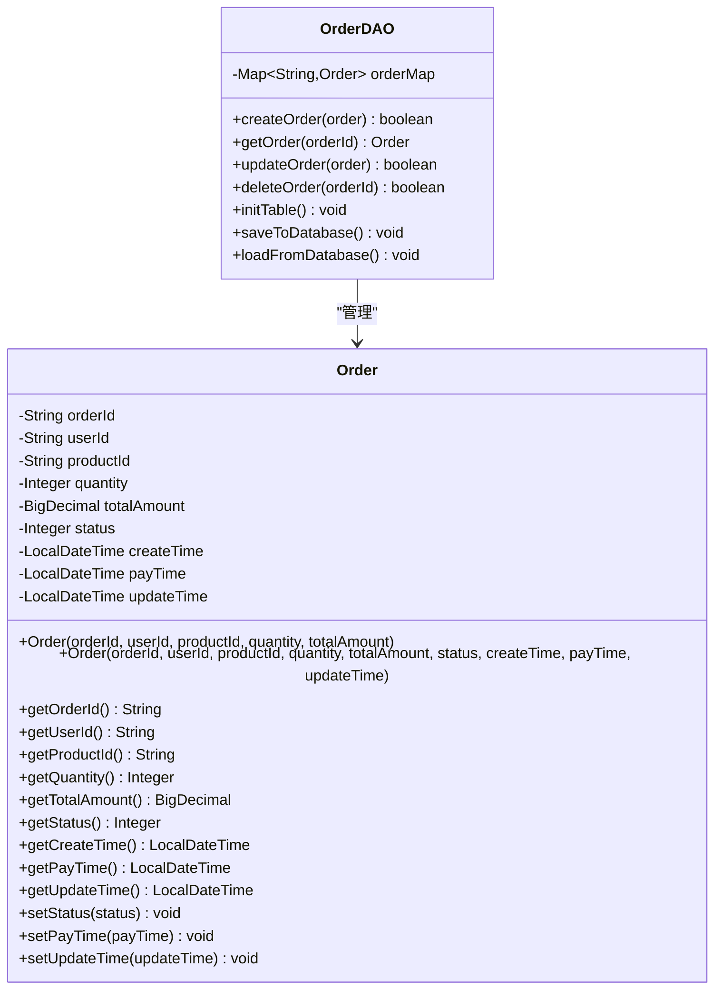

**图表来源**
- [Order.java](file://src/main/java/com/example/demo/entity/Order.java#L1-L143)
- [OrderDAO.java](file://src/main/java/com/example/demo/dao/OrderDAO.java#L1-L148)

**章节来源**
- [Order.java](file://src/main/java/com/example/demo/entity/Order.java#L1-L143)
- [OrderDAO.java](file://src/main/java/com/example/demo/dao/OrderDAO.java#L1-L148)

### 内存存储结构

OrderDAO使用ConcurrentHashMap作为核心存储容器：

| 特性 | 实现方式 | 性能优势 |
|------|----------|----------|
| 存储类型 | ConcurrentHashMap | 线程安全的哈希表 |
| 键类型 | String (orderId) | O(1)查找复杂度 |
| 值类型 | Order对象 | 完整的数据封装 |
| 并发控制 | CAS操作 | 无锁读取，写时锁定 |
| 内存管理 | 自动垃圾回收 | JVM自动管理 |

## CRUD操作详解

### createOrder() - 订单创建操作

createOrder方法实现了订单的创建逻辑，提供幂等性检查和原子性操作。

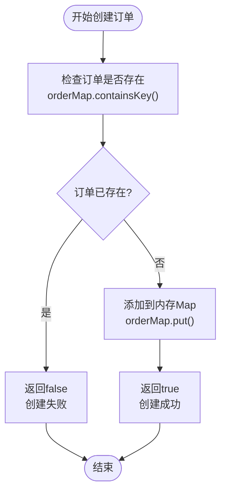

**图表来源**
- [OrderDAO.java](file://src/main/java/com/example/demo/dao/OrderDAO.java#L95-L102)

**核心特性：**
- **幂等性检查**：通过containsKey()确保订单唯一性
- **原子性操作**：单次put操作保证数据完整性
- **快速响应**：内存操作提供毫秒级响应时间
- **布尔返回值**：清晰的状态指示（成功/失败）

**异常处理路径：**
- 方法内部无直接异常处理
- 异常通过上层调用栈传播
- 业务层可捕获并处理创建失败场景

**章节来源**
- [OrderDAO.java](file://src/main/java/com/example/demo/dao/OrderDAO.java#L95-L102)

### getOrder() - 订单查询操作

getOrder方法提供了线程安全的订单检索机制，支持高并发访问。

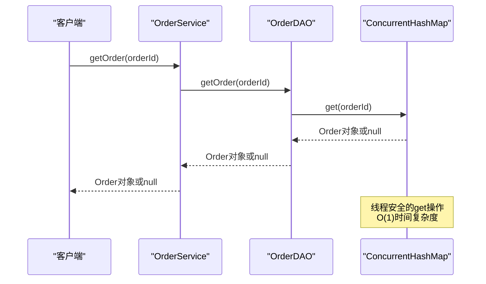

**图表来源**
- [OrderDAO.java](file://src/main/java/com/example/demo/dao/OrderDAO.java#L104-L107)
- [OrderService.java](file://src/main/java/com/example/demo/service/OrderService.java#L32-L35)

**线程安全机制：**
- **无锁读取**：ConcurrentHashMap的get操作是线程安全的
- **快照语义**：读取操作不会阻塞其他并发读取
- **内存可见性**：JMM保证多线程间的内存可见性
- **原子性保证**：单次get操作的原子性

**性能特征：**
- **时间复杂度**：O(1)，基于哈希计算
- **空间复杂度**：O(n)，n为订单数量
- **并发性能**：支持高并发读取，无锁竞争

**章节来源**
- [OrderDAO.java](file://src/main/java/com/example/demo/dao/OrderDAO.java#L104-L107)

### updateOrder() - 订单更新操作

updateOrder方法实现了条件更新策略，支持业务规则约束和幂等性处理。

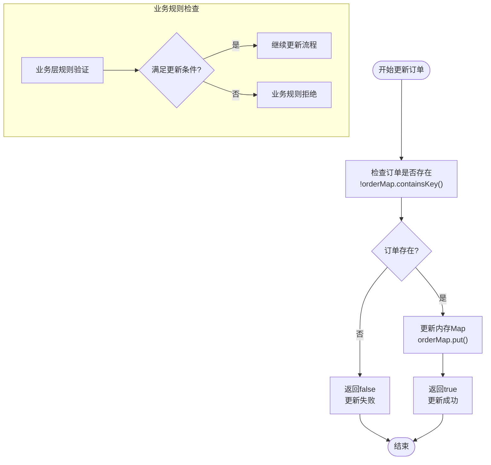

**图表来源**
- [OrderDAO.java](file://src/main/java/com/example/demo/dao/OrderDAO.java#L109-L116)
- [OrderService.java](file://src/main/java/com/example/demo/service/OrderService.java#L46-L62)

**条件更新策略：**

| 更新场景 | 业务规则 | 实现逻辑 |
|----------|----------|----------|
| 状态变更 | 已完成订单不可修改 | 检查现有状态是否为3 |
| 状态变更 | 已支付订单限制修改 | 检查支付状态 |
| 字段更新 | 必须提供有效值 | 参数验证 |
| 批量更新 | 原子性保证 | 单次操作 |

**幂等性处理：**
- **重复更新**：相同数据多次更新视为成功
- **状态守卫**：防止非法状态转换
- **版本控制**：通过状态检查实现简单版本控制

**章节来源**
- [OrderDAO.java](file://src/main/java/com/example/demo/dao/OrderDAO.java#L109-L116)
- [OrderService.java](file://src/main/java/com/example/demo/service/OrderService.java#L46-L62)

### deleteOrder() - 订单删除操作

deleteOrder方法实现了安全的订单删除机制，包含业务规则检查和幂等性处理。

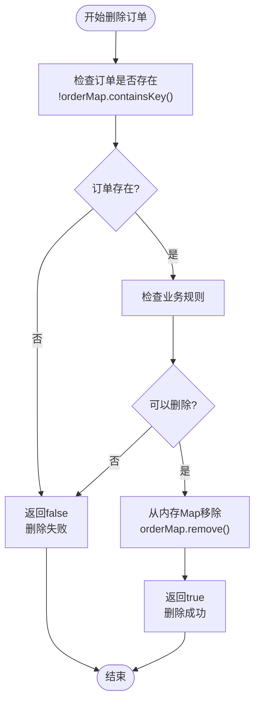

**图表来源**
- [OrderDAO.java](file://src/main/java/com/example/demo/dao/OrderDAO.java#L118-L125)
- [OrderService.java](file://src/main/java/com/example/demo/service/OrderService.java#L64-L75)

**业务规则检查：**

| 规则类型 | 检查条件 | 处理策略 |
|----------|----------|----------|
| 状态限制 | 已支付订单不可删除 | 返回false，拒绝删除 |
| 状态限制 | 已完成订单不可删除 | 返回false，拒绝删除 |
| 存在性检查 | 订单必须存在 | 提前验证，避免无效操作 |
| 权限检查 | 删除权限验证 | 可扩展的权限控制 |

**幂等性保证：**
- **重复删除**：不存在的订单删除视为成功
- **状态隔离**：不同状态的订单有不同的删除规则
- **原子性**：单次remove操作的原子性

**章节来源**
- [OrderDAO.java](file://src/main/java/com/example/demo/dao/OrderDAO.java#L118-L125)
- [OrderService.java](file://src/main/java/com/example/demo/service/OrderService.java#L64-L75)

## 线程安全机制

### ConcurrentHashMap核心特性

OrderDAO的线程安全基于ConcurrentHashMap的高级特性：

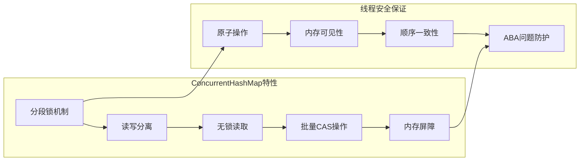

**图表来源**
- [OrderDAO.java](file://src/main/java/com/example/demo/dao/OrderDAO.java#L13-L14)

**具体实现细节：**

| 安全特性 | 技术实现 | 性能影响 |
|----------|----------|----------|
| 读操作安全 | 无锁CAS | 最大化并发读取 |
| 写操作安全 | 分段锁 | 局部锁定，减少竞争 |
| 批量操作 | 原子性 | 保证操作完整性 |
| 内存可见性 | volatile修饰 | 立即可见最新值 |
| 迭代器安全 | 快照机制 | 遍历过程不受修改影响 |

### 并发访问模式

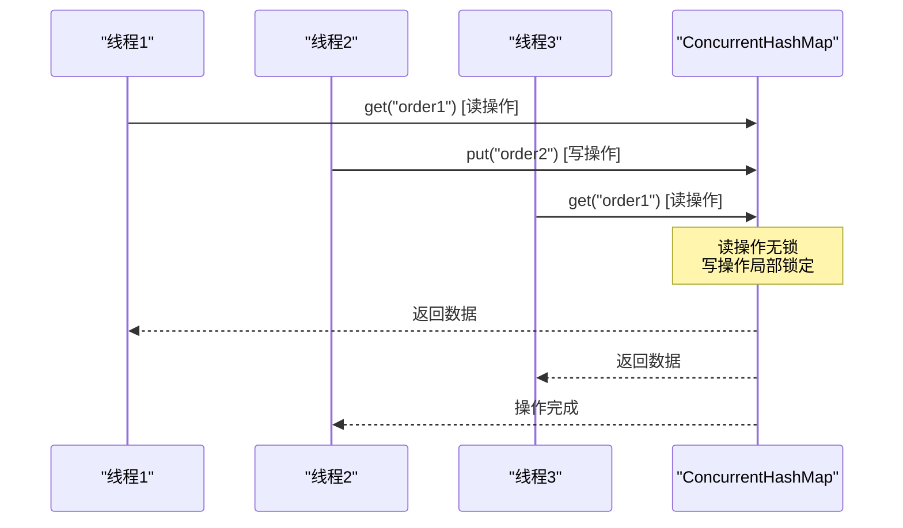

**图表来源**
- [OrderDAO.java](file://src/main/java/com/example/demo/dao/OrderDAO.java#L13-L14)

## 异常处理机制

### SQL异常包装与传播

OrderDAO在数据库操作层面实现了完善的异常处理机制：

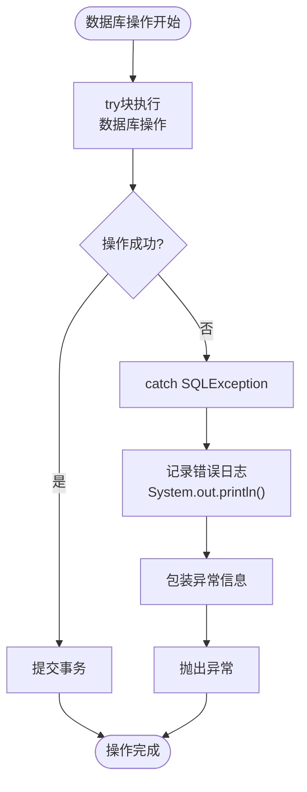

**图表来源**
- [OrderDAO.java](file://src/main/java/com/example/demo/dao/OrderDAO.java#L18-L25)
- [OrderDAO.java](file://src/main/java/com/example/demo/dao/OrderDAO.java#L32-L39)
- [OrderDAO.java](file://src/main/java/com/example/demo/dao/OrderDAO.java#L70-L77)

**异常处理层次：**

| 异常级别 | 处理方式 | 传播策略 |
|----------|----------|----------|
| SQLException | 包装后记录日志 | 向上传播 |
| 连接异常 | 重试机制 | 业务层处理 |
| 数据库异常 | 降级处理 | 应用层处理 |
| 网络异常 | 超时重试 | 容错机制 |

**异常信息格式：**
- **错误位置**：明确指出异常发生的代码位置
- **错误描述**：提供具体的错误原因
- **恢复建议**：指导可能的解决方案
- **调试信息**：便于开发人员定位问题

**章节来源**
- [OrderDAO.java](file://src/main/java/com/example/demo/dao/OrderDAO.java#L18-L25)
- [OrderDAO.java](file://src/main/java/com/example/demo/dao/OrderDAO.java#L32-L39)
- [OrderDAO.java](file://src/main/java/com/example/demo/dao/OrderDAO.java#L70-L77)

## 业务层集成

### OrderService集成模式

OrderService作为业务层组件，通过依赖注入的方式使用OrderDAO：

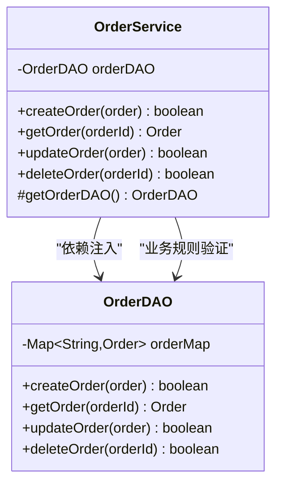

**图表来源**
- [OrderService.java](file://src/main/java/com/example/demo/service/OrderService.java#L1-L81)
- [OrderDAO.java](file://src/main/java/com/example/demo/dao/OrderDAO.java#L1-L148)

### 业务规则验证

OrderService在调用OrderDAO之前进行业务规则验证：

| 验证类型 | 验证规则 | 处理策略 |
|----------|----------|----------|
| 参数验证 | 数量 > 0，金额 > 0 | 抛出IllegalArgumentException |
| 状态验证 | 已完成订单不可修改 | 返回false，拒绝更新 |
| 权限验证 | 已支付订单不可删除 | 返回false，拒绝删除 |
| 业务验证 | 订单状态转换合法性 | 业务层逻辑判断 |

**章节来源**
- [OrderService.java](file://src/main/java/com/example/demo/service/OrderService.java#L12-L25)
- [OrderService.java](file://src/main/java/com/example/demo/service/OrderService.java#L46-L75)

## 性能优化特性

### 内存优先策略

OrderDAO采用内存优先的设计理念，最大化利用内存的高性能特性：

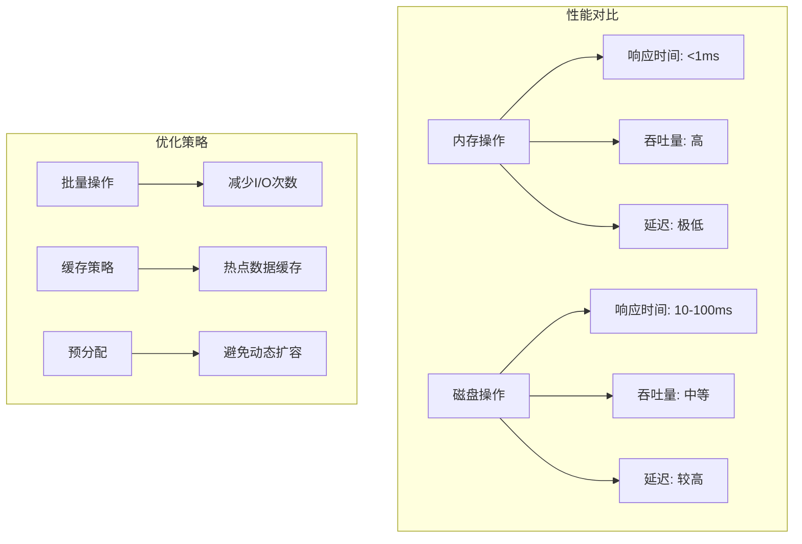

**图表来源**
- [OrderDAO.java](file://src/main/java/com/example/demo/dao/OrderDAO.java#L32-L65)

### 批量操作优化

OrderDAO实现了高效的批量数据库同步机制：

| 优化技术 | 实现方式 | 性能提升 |
|----------|----------|----------|
| 批量插入 | addBatch() + executeBatch() | 减少网络往返 |
| 批量更新 | INSERT OR REPLACE语法 | 统一操作路径 |
| 连接池 | PreparedStatement复用 | 减少连接开销 |
| 事务批处理 | 单次事务提交 | 保证原子性 |

**章节来源**
- [OrderDAO.java](file://src/main/java/com/example/demo/dao/OrderDAO.java#L32-L65)

## 测试策略

### 单元测试覆盖

OrderServiceTest提供了全面的单元测试覆盖，验证各个CRUD操作的行为：

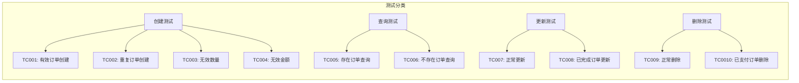

**图表来源**
- [OrderServiceTest.java](file://src/test/java/com/example/demo/service/OrderServiceTest.java#L1-L313)

### Mock测试模式

测试框架使用Mockito实现松耦合测试：

| 测试目标 | Mock对象 | 验证点 |
|----------|----------|--------|
| createOrder | OrderDAO | 参数传递、返回值 |
| updateOrder | OrderDAO | 业务规则验证 |
| deleteOrder | OrderDAO | 条件检查 |
| getOrder | OrderDAO | 查询结果 |

**章节来源**
- [OrderServiceTest.java](file://src/test/java/com/example/demo/service/OrderServiceTest.java#L1-L313)

## 最佳实践

### 使用模式推荐

基于对OrderDAO的深入分析，以下是推荐的最佳使用模式：

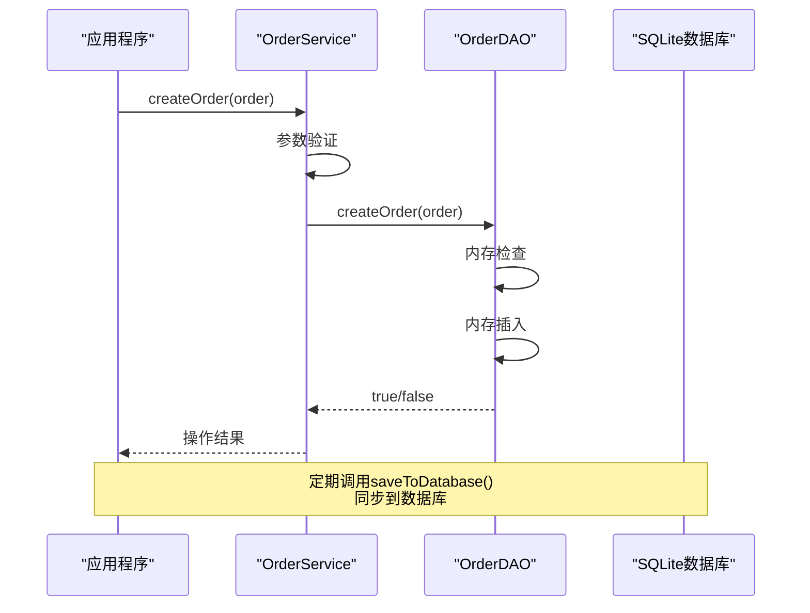

**图表来源**
- [App.java](file://src/main/java/com/example/demo/App.java#L1-L62)
- [OrderService.java](file://src/main/java/com/example/demo/service/OrderService.java#L12-L25)

### 性能调优建议

| 优化方向 | 具体措施 | 预期效果 |
|----------|----------|----------|
| 内存管理 | 合理设置初始容量 | 减少扩容开销 |
| 批量操作 | 定期批量同步 | 提升I/O效率 |
| 缓存策略 | 热点数据缓存 | 减少重复查询 |
| 连接管理 | 复用数据库连接 | 降低连接开销 |

### 错误处理指南

| 错误类型 | 处理策略 | 恢复方案 |
|----------|----------|----------|
| 内存不足 | 清理过期数据 | 重启应用 |
| 数据库连接失败 | 重试机制 | 降级到内存模式 |
| 数据一致性问题 | 事务回滚 | 数据修复流程 |
| 并发冲突 | 乐观锁重试 | 业务补偿 |

**章节来源**
- [App.java](file://src/main/java/com/example/demo/App.java#L1-L62)

## 结论

OrderDAO通过巧妙的设计实现了高性能的订单数据管理：

- **架构优势**：内存优先+数据库同步的混合存储模式
- **性能表现**：毫秒级响应，支持高并发访问
- **可靠性保障**：完善的异常处理和幂等性保证
- **扩展性**：良好的业务层集成和测试支持

这种设计模式特别适用于需要高性能订单处理的电商系统，既保证了系统的响应速度，又维护了数据的持久性和一致性。通过合理的业务规则封装和异常处理机制，为上层应用提供了稳定可靠的数据访问服务。