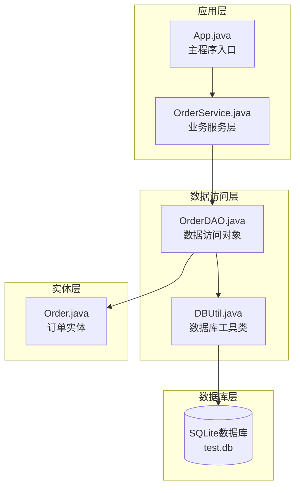
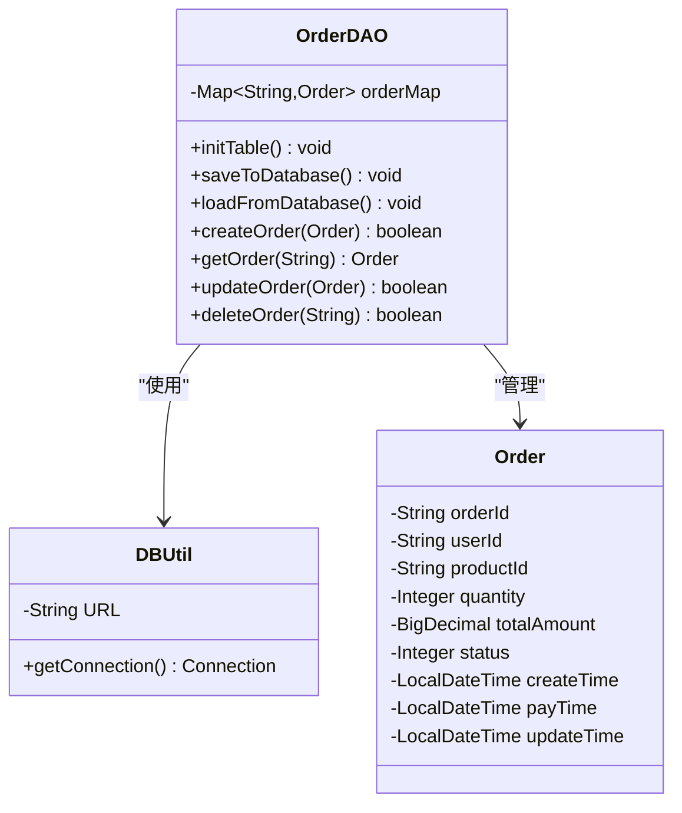
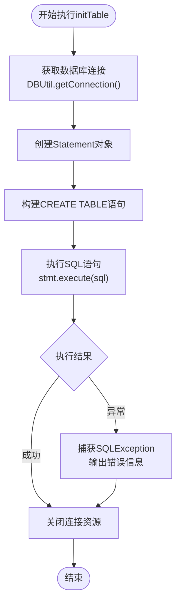
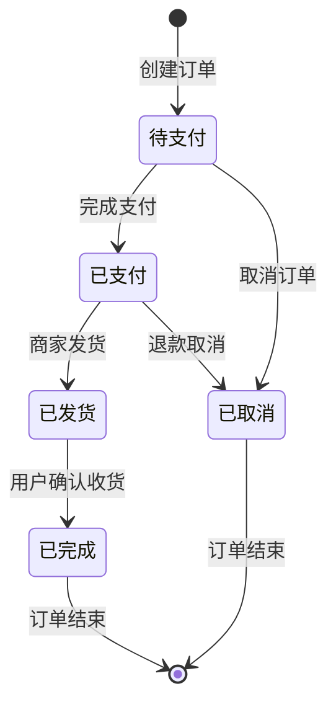
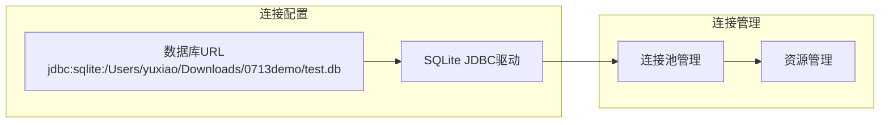
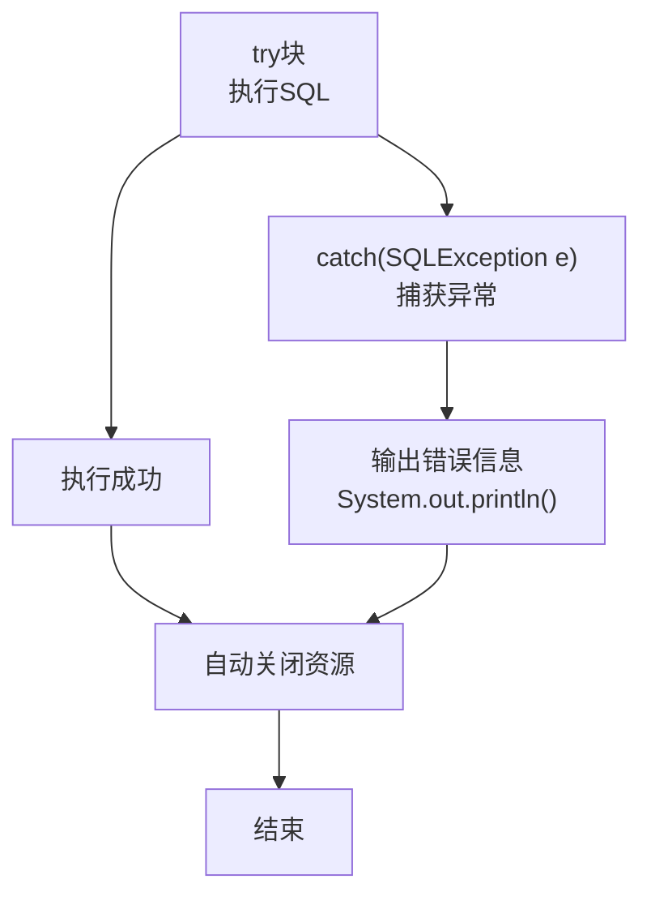
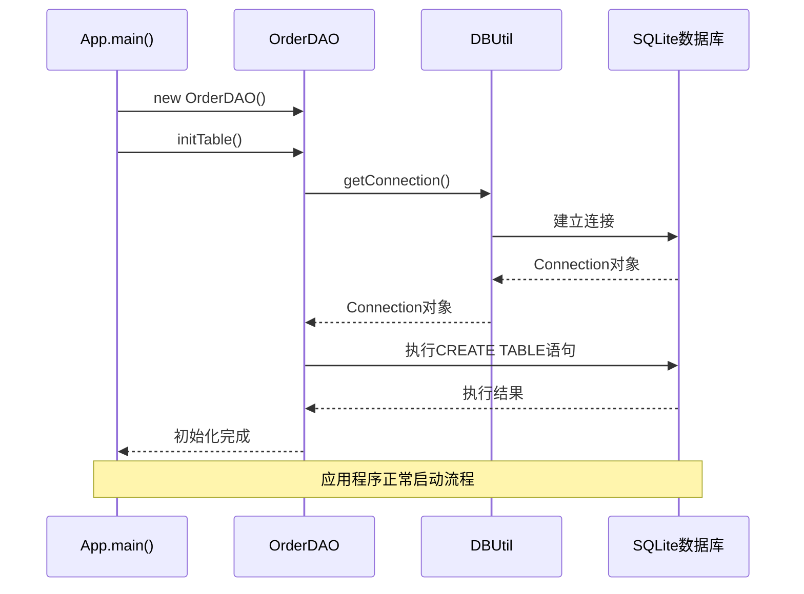
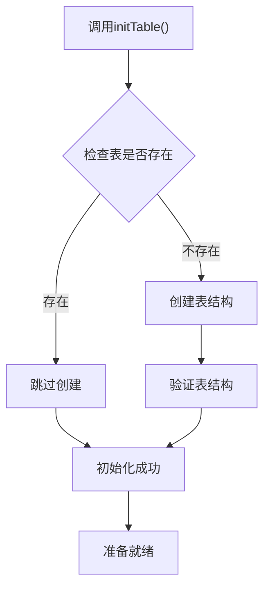

# 数据库初始化机制

<cite>
**本文档引用的文件**
- [OrderDAO.java](file://src/main/java/com/example/demo/dao/OrderDAO.java)
- [DBUtil.java](file://src/main/java/com/example/demo/dao/DBUtil.java)
- [Order.java](file://src/main/java/com/example/demo/entity/Order.java)
- [App.java](file://src/main/java/com/example/demo/App.java)
- [OrderService.java](file://src/main/java/com/example/demo/service/OrderService.java)
- [pom.xml](file://pom.xml)
</cite>

## 目录
1. [项目概述](#项目概述)
2. [数据库架构设计](#数据库架构设计)
3. [OrderDAO类核心功能](#orderdao类核心功能)
4. [initTable()方法深度解析](#inittable方法深度解析)
5. [表结构设计详解](#表结构设计详解)
6. [数据库连接管理](#数据库连接管理)
7. [异常处理机制](#异常处理机制)
8. [应用启动流程](#应用启动流程)
9. [最佳实践建议](#最佳实践建议)

## 项目概述

本项目是一个基于Java的订单管理系统，采用SQLite作为底层数据库存储方案。系统实现了完整的订单生命周期管理，包括创建、查询、更新和删除操作。数据库初始化机制是整个系统的基础，确保应用程序启动时能够正确建立必要的数据结构。

项目采用分层架构设计：
- **表现层**：App.java作为主程序入口
- **业务逻辑层**：OrderService.java处理业务规则
- **数据访问层**：OrderDAO.java负责数据库操作
- **实体层**：Order.java定义数据模型

## 数据库架构设计



**图表来源**
- [App.java](file://src/main/java/com/example/demo/App.java#L1-L62)
- [OrderService.java](file://src/main/java/com/example/demo/service/OrderService.java#L1-L81)
- [OrderDAO.java](file://src/main/java/com/example/demo/dao/OrderDAO.java#L1-L148)
- [DBUtil.java](file://src/main/java/com/example/demo/dao/DBUtil.java#L1-L19)

## OrderDAO类核心功能

OrderDAO类是数据访问层的核心组件，负责管理订单数据的持久化操作。该类采用了双重存储策略：内存Map模拟数据库和SQLite数据库实际存储。

### 核心特性

1. **双重存储机制**：使用ConcurrentHashMap模拟内存数据库，同时支持SQLite持久化
2. **事务管理**：通过DBUtil.getConnection()获取数据库连接
3. **批量操作**：支持批量插入和更新操作
4. **异常处理**：完善的SQL异常处理机制



**图表来源**
- [OrderDAO.java](file://src/main/java/com/example/demo/dao/OrderDAO.java#L10-L148)
- [DBUtil.java](file://src/main/java/com/example/demo/dao/DBUtil.java#L8-L19)
- [Order.java](file://src/main/java/com/example/demo/entity/Order.java#L6-L143)

**章节来源**
- [OrderDAO.java](file://src/main/java/com/example/demo/dao/OrderDAO.java#L1-L148)
- [DBUtil.java](file://src/main/java/com/example/demo/dao/DBUtil.java#L1-L19)

## initTable()方法深度解析

### 方法功能概述

`initTable()`方法是OrderDAO类的核心初始化方法，负责创建SQLite数据库表结构。该方法在应用启动时被调用，确保数据库具备正确的表结构。

### SQL语句分析

```sql
CREATE TABLE IF NOT EXISTS order0713(
    orderId TEXT PRIMARY KEY, 
    userId TEXT, 
    productId TEXT, 
    quantity INTEGER, 
    totalAmount TEXT, 
    status INTEGER, 
    createTime TEXT, 
    payTime TEXT, 
    updateTime TEXT
)
```

### 执行流程



**图表来源**
- [OrderDAO.java](file://src/main/java/com/example/demo/dao/OrderDAO.java#L16-L30)

### 关键技术点

1. **资源管理**：使用try-with-resources自动关闭Connection和Statement
2. **幂等性**：`CREATE TABLE IF NOT EXISTS`确保重复执行不会报错
3. **连接池**：通过DBUtil.getConnection()获取连接，避免连接泄漏

**章节来源**
- [OrderDAO.java](file://src/main/java/com/example/demo/dao/OrderDAO.java#L16-L30)

## 表结构设计详解

### 字段定义与数据类型选择

| 字段名 | 数据类型 | 约束条件 | 设计考虑 |
|--------|----------|----------|----------|
| orderId | TEXT | PRIMARY KEY | 唯一标识符，使用TEXT便于扩展 |
| userId | TEXT | 无 | 用户ID，使用TEXT存储字符串形式 |
| productId | TEXT | 无 | 商品ID，同样使用TEXT存储 |
| quantity | INTEGER | 无 | 购买数量，整数类型足够 |
| totalAmount | TEXT | 无 | 订单金额，使用TEXT存储BigDecimal值 |
| status | INTEGER | 无 | 订单状态，整数表示状态码 |
| createTime | TEXT | 无 | 创建时间，存储为字符串 |
| payTime | TEXT | 无 | 支付时间，允许为空 |
| updateTime | TEXT | 无 | 更新时间，允许为空 |

### 数据类型选择原因

1. **orderId, userId, productId**：使用TEXT而非INTEGER作为主键，因为这些字段通常是业务标识符，包含字母和数字组合
2. **totalAmount**：使用TEXT存储BigDecimal值，避免浮点数精度问题
3. **status**：使用INTEGER存储状态码，便于状态机管理和查询优化
4. **时间字段**：统一使用TEXT存储LocalDateTime对象的字符串表示

### 订单状态机设计



**图表来源**
- [Order.java](file://src/main/java/com/example/demo/entity/Order.java#L22-L24)

### 时间戳字段设计

1. **createTime**：订单创建时的时间戳，记录订单的初始状态
2. **payTime**：订单支付完成的时间戳，支持空值表示未支付
3. **updateTime**：订单最后更新的时间戳，支持空值表示从未更新

**章节来源**
- [OrderDAO.java](file://src/main/java/com/example/demo/dao/OrderDAO.java#L18-L28)
- [Order.java](file://src/main/java/com/example/demo/entity/Order.java#L22-L32)

## 数据库连接管理

### DBUtil类设计

DBUtil类提供了统一的数据库连接管理功能，采用静态方法设计简化连接获取过程。

### 连接配置



**图表来源**
- [DBUtil.java](file://src/main/java/com/example/demo/dao/DBUtil.java#L8-L19)

### 连接获取机制

1. **静态URL配置**：硬编码数据库文件路径，便于部署和维护
2. **DriverManager**：使用标准JDBC接口获取连接
3. **异常处理**：SQLException包装为更友好的错误信息

**章节来源**
- [DBUtil.java](file://src/main/java/com/example/demo/dao/DBUtil.java#L1-L19)

## 异常处理机制

### initTable()异常处理



**图表来源**
- [OrderDAO.java](file://src/main/java/com/example/demo/dao/OrderDAO.java#L29-L30)

### 异常处理策略

1. **表已存在处理**：`CREATE TABLE IF NOT EXISTS`确保重复执行不会抛出异常
2. **连接失败处理**：SQLException被捕获并记录错误信息
3. **资源清理**：try-with-resources确保连接和语句对象正确关闭

### 错误恢复机制

- **优雅降级**：即使初始化失败，应用程序仍可继续运行（内存模式）
- **日志记录**：详细的错误信息便于调试和问题定位
- **资源隔离**：异常不影响其他数据库操作

**章节来源**
- [OrderDAO.java](file://src/main/java/com/example/demo/dao/OrderDAO.java#L29-L30)

## 应用启动流程

### 启动序列图



**图表来源**
- [App.java](file://src/main/java/com/example/demo/App.java#L14-L16)
- [OrderDAO.java](file://src/main/java/com/example/demo/dao/OrderDAO.java#L16-L30)
- [DBUtil.java](file://src/main/java/com/example/demo/dao/DBUtil.java#L13-L16)

### 触发时机

1. **应用启动时**：在App.main()方法中立即调用
2. **单次执行**：确保表结构只创建一次
3. **依赖前置**：在任何数据库操作之前执行

### 启动验证



**图表来源**
- [App.java](file://src/main/java/com/example/demo/App.java#L14-L16)

**章节来源**
- [App.java](file://src/main/java/com/example/demo/App.java#L14-L16)

## 最佳实践建议

### 性能优化建议

1. **连接池配置**：考虑引入连接池减少连接开销
2. **索引设计**：为常用查询字段（如userId, status）添加索引
3. **批量操作**：充分利用PreparedStatement的批量处理功能

### 安全性考虑

1. **SQL注入防护**：使用PreparedStatement而非Statement
2. **数据验证**：在业务层添加输入验证逻辑
3. **异常信息**：避免在生产环境中暴露敏感错误信息

### 维护性改进

1. **配置外部化**：将数据库URL配置到外部配置文件
2. **日志集成**：使用专业日志框架替代System.out.println
3. **单元测试**：为initTable()方法编写单元测试

### 扩展性设计

1. **多数据库支持**：抽象数据库操作接口，支持多种数据库
2. **版本控制**：实现数据库迁移脚本管理
3. **监控指标**：添加数据库操作性能监控

通过以上分析可以看出，该项目的数据库初始化机制设计合理，既保证了系统的稳定性和可靠性，又提供了良好的扩展性和维护性。initTable()方法作为系统启动的关键步骤，确保了数据库结构的正确建立，为后续的数据操作奠定了坚实基础。