# 数据访问层实现

<cite>
**本文档中引用的文件**
- [OrderDAO.java](file://src/main/java/com/example/demo/dao/OrderDAO.java)
- [DBUtil.java](file://src/main/java/com/example/demo/dao/DBUtil.java)
- [Order.java](file://src/main/java/com/example/demo/entity/Order.java)
- [OrderService.java](file://src/main/java/com/example/demo/service/OrderService.java)
- [App.java](file://src/main/java/com/example/demo/App.java)
- [OrderServiceTest.java](file://src/test/java/com/example/demo/service/OrderServiceTest.java)
- [pom.xml](file://pom.xml)
</cite>

## 目录
1. [项目概述](#项目概述)
2. [系统架构](#系统架构)
3. [OrderDAO核心组件分析](#orderdao核心组件分析)
4. [双重存储机制详解](#双重存储机制详解)
5. [SQLite数据库集成](#sqlite数据库集成)
6. [CRUD操作实现](#crud操作实现)
7. [异常处理策略](#异常处理策略)
8. [性能优化考虑](#性能优化考虑)
9. [测试框架](#测试框架)
10. [总结](#总结)

## 项目概述

本项目是一个基于Java的订单管理系统，采用分层架构设计，实现了完整的数据访问层功能。系统通过OrderDAO类提供双重存储机制，既支持内存中的高性能并发访问，又保证了数据的持久化存储。

### 核心特性

- **双重存储机制**：同时维护内存缓存和SQLite数据库
- **线程安全**：使用ConcurrentHashMap确保并发安全性
- **幂等性保证**：通过INSERT OR REPLACE确保数据一致性
- **时间类型处理**：优雅处理LocalDateTime类型的序列化和反序列化
- **异常处理**：完善的错误处理和恢复机制

## 系统架构

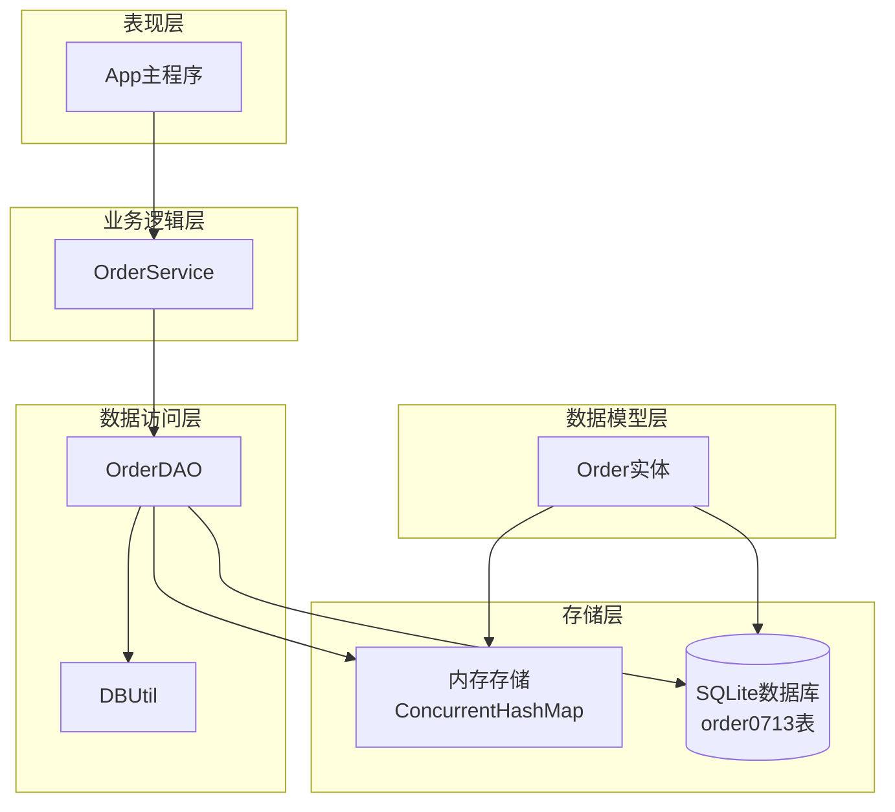

**图表来源**
- [OrderDAO.java](file://src/main/java/com/example/demo/dao/OrderDAO.java#L1-L148)
- [OrderService.java](file://src/main/java/com/example/demo/service/OrderService.java#L1-L81)
- [DBUtil.java](file://src/main/java/com/example/demo/dao/DBUtil.java#L1-L19)

## OrderDAO核心组件分析

OrderDAO类是整个数据访问层的核心组件，实现了以下关键功能：

### 类结构概览

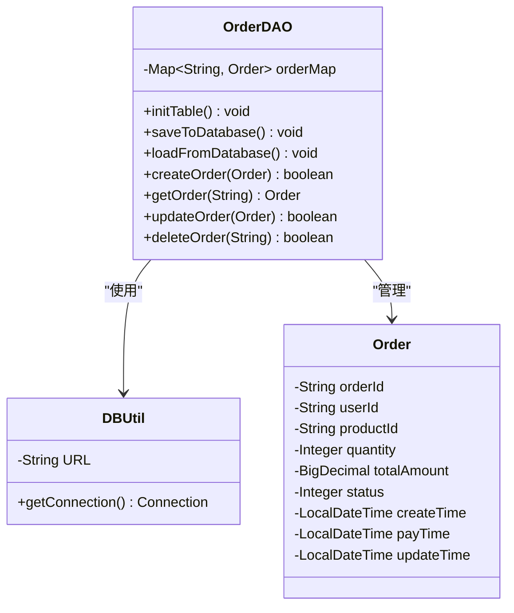

**图表来源**
- [OrderDAO.java](file://src/main/java/com/example/demo/dao/OrderDAO.java#L10-L148)
- [DBUtil.java](file://src/main/java/com/example/demo/dao/DBUtil.java#L8-L19)
- [Order.java](file://src/main/java/com/example/demo/entity/Order.java#L6-L143)

**章节来源**
- [OrderDAO.java](file://src/main/java/com/example/demo/dao/OrderDAO.java#L1-L148)
- [Order.java](file://src/main/java/com/example/demo/entity/Order.java#L1-L143)

## 双重存储机制详解

### ConcurrentHashMap线程安全设计

OrderDAO采用ConcurrentHashMap实现线程安全的内存订单存储：

#### 存储结构特点

- **线程安全**：使用ConcurrentHashMap而非普通HashMap
- **高性能**：支持高并发读写操作
- **内存效率**：直接在JVM内存中操作，访问速度极快
- **自动扩容**：根据负载自动调整容量

#### 并发控制机制

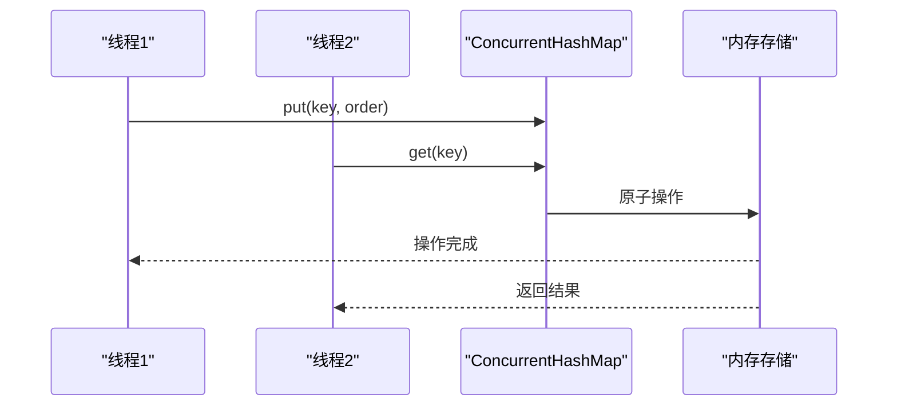

**图表来源**
- [OrderDAO.java](file://src/main/java/com/example/demo/dao/OrderDAO.java#L11-L12)

### 内存操作流程

系统提供了完整的CRUD操作接口，所有操作都在内存层面进行：

#### 创建订单流程

**图表来源**
- [OrderDAO.java](file://src/main/java/com/example/demo/dao/OrderDAO.java#L115-L122)

**章节来源**
- [OrderDAO.java](file://src/main/java/com/example/demo/dao/OrderDAO.java#L115-L148)

## SQLite数据库集成

### initTable()方法深度分析

initTable()方法负责初始化SQLite数据库表结构，确保系统启动时具备正确的数据存储环境。

#### SQL表结构设计

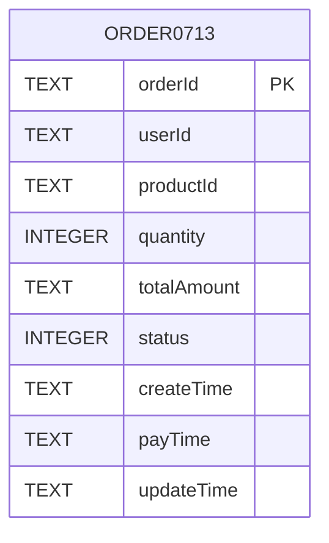

**图表来源**
- [OrderDAO.java](file://src/main/java/com/example/demo/dao/OrderDAO.java#L15-L25)

#### 字段类型映射分析

| 字段名 | SQLite类型 | Java类型 | 备注 |
|--------|------------|----------|------|
| orderId | TEXT | String | 主键，唯一标识订单 |
| userId | TEXT | String | 用户标识符 |
| productId | TEXT | String | 商品标识符 |
| quantity | INTEGER | Integer | 购买数量 |
| totalAmount | TEXT | String | BigDecimal金额（字符串存储） |
| status | INTEGER | Integer | 订单状态码 |
| createTime | TEXT | String | 创建时间（字符串格式） |
| payTime | TEXT | String | 支付时间（字符串格式） |
| updateTime | TEXT | String | 更新时间（字符串格式） |

#### 主键约束设计

- **主键定义**：`orderId TEXT PRIMARY KEY`
- **唯一性保证**：确保每个订单有唯一标识
- **索引优化**：SQLite自动为主键创建B-tree索引

### saveToDatabase()方法批处理机制

saveToDatabase()方法实现了高效的批量数据持久化，采用PreparedStatement和批处理技术。

#### 批处理流程设计

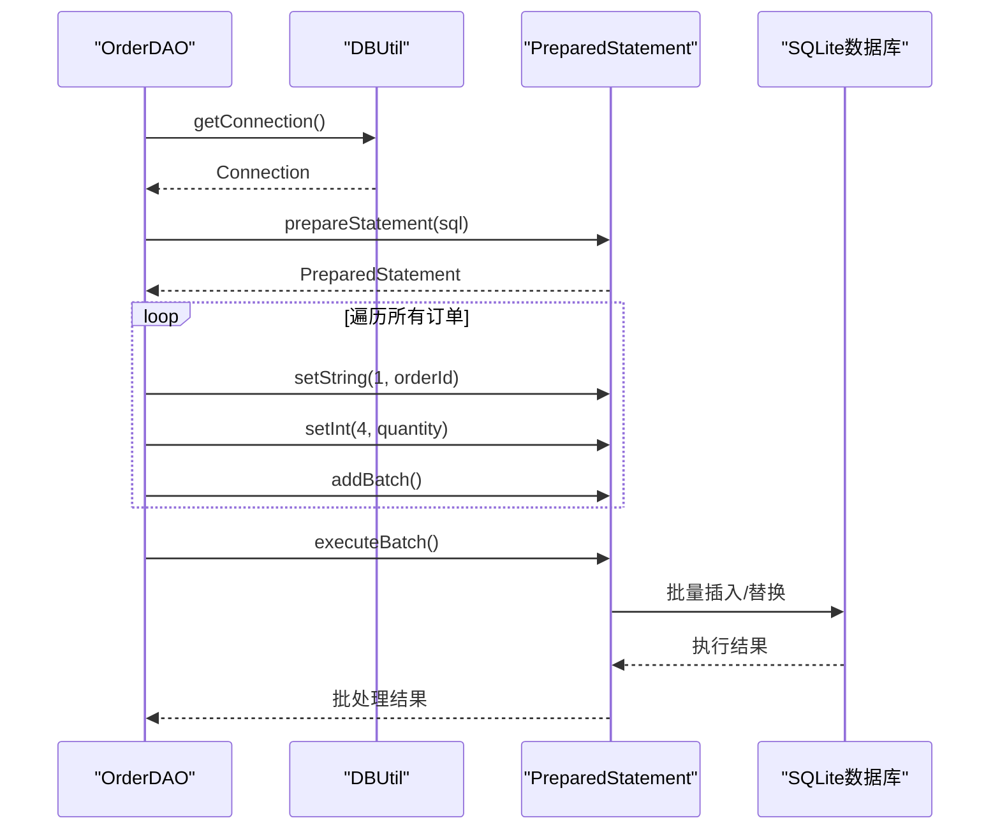

**图表来源**
- [OrderDAO.java](file://src/main/java/com/example/demo/dao/OrderDAO.java#L28-L55)

#### INSERT OR REPLACE幂等性保证

- **幂等性操作**：INSERT OR REPLACE确保重复插入不会产生冲突
- **自动更新**：当主键冲突时自动更新记录
- **原子性**：整个批处理操作具有原子性

#### 参数设置策略

PreparedStatement设置了9个参数，对应Order实体的所有字段：

| 参数位置 | 设置方法 | 数据来源 |
|----------|----------|----------|
| 1 | pstmt.setString(1, order.getOrderId()) | 订单ID |
| 2 | pstmt.setString(2, order.getUserId()) | 用户ID |
| 3 | pstmt.setString(3, order.getProductId()) | 商品ID |
| 4 | pstmt.setInt(4, order.getQuantity()) | 购买数量 |
| 5 | pstmt.setString(5, order.getTotalAmount().toString()) | 总金额 |
| 6 | pstmt.setInt(6, order.getStatus()) | 订单状态 |
| 7 | pstmt.setString(7, order.getCreateTime() != null ? order.getCreateTime().toString() : null) | 创建时间 |
| 8 | pstmt.setString(8, order.getPayTime() != null ? order.getPayTime().toString() : null) | 支付时间 |
| 9 | pstmt.setString(9, order.getUpdateTime() != null ? order.getUpdateTime().toString() : null) | 更新时间 |

### loadFromDatabase()方法数据转换

loadFromDatabase()方法从SQLite数据库读取数据并转换为Order对象，特别处理了LocalDateTime类型的复杂转换。

#### 数据读取流程

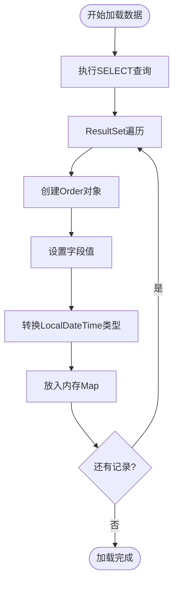

**图表来源**
- [OrderDAO.java](file://src/main/java/com/example/demo/dao/OrderDAO.java#L58-L78)

#### LocalDateTime类型特殊处理

系统采用了优雅的LocalDateTime类型处理方案：

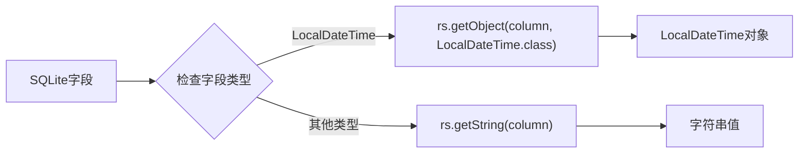

**图表来源**
- [OrderDAO.java](file://src/main/java/com/example/demo/dao/OrderDAO.java#L68-L72)

**章节来源**
- [OrderDAO.java](file://src/main/java/com/example/demo/dao/OrderDAO.java#L15-L78)
- [DBUtil.java](file://src/main/java/com/example/demo/dao/DBUtil.java#L1-L19)

## CRUD操作实现

### 完整CRUD操作流程

OrderDAO提供了标准的CRUD操作接口，每个操作都经过精心设计以确保数据一致性和性能。

#### 创建订单(createOrder)

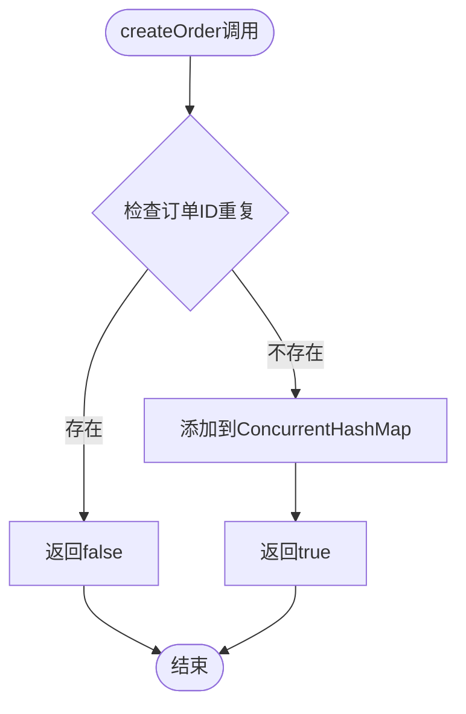

**图表来源**
- [OrderDAO.java](file://src/main/java/com/example/demo/dao/OrderDAO.java#L115-L122)

#### 查询订单(getOrder)

查询操作直接从内存中获取，具有极高的性能特征：

- **时间复杂度**：O(1)
- **并发安全**：ConcurrentHashMap保证线程安全
- **实时性**：返回最新状态的数据

#### 更新订单(updateOrder)

更新操作同样在内存层面进行，支持部分字段更新：

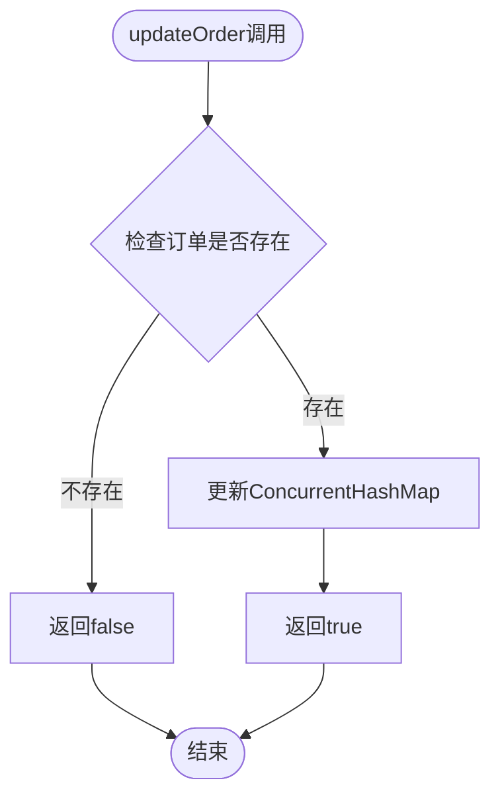

**图表来源**
- [OrderDAO.java](file://src/main/java/com/example/demo/dao/OrderDAO.java#L124-L131)

#### 删除订单(deleteOrder)

删除操作同样采用内存优先策略：

- **原子性**：单次操作即可完成
- **一致性**：立即反映删除状态
- **可恢复**：可通过loadFromDatabase恢复

### 异常处理策略

系统在各个操作层面都实现了完善的异常处理：

#### 数据库异常处理

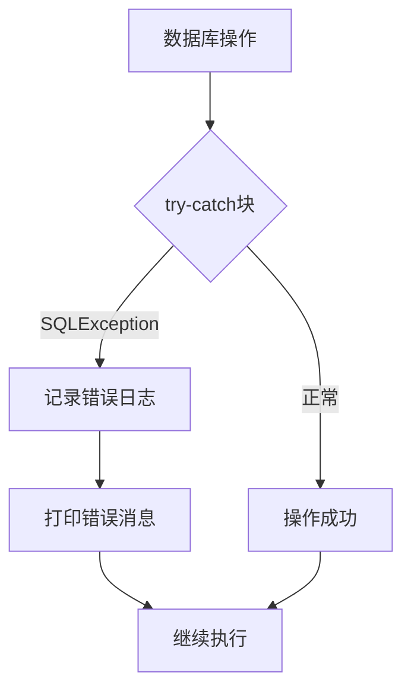

**图表来源**
- [OrderDAO.java](file://src/main/java/com/example/demo/dao/OrderDAO.java#L17-L25)
- [OrderDAO.java](file://src/main/java/com/example/demo/dao/OrderDAO.java#L30-L55)
- [OrderDAO.java](file://src/main/java/com/example/demo/dao/OrderDAO.java#L60-L78)

**章节来源**
- [OrderDAO.java](file://src/main/java/com/example/demo/dao/OrderDAO.java#L115-L148)

## 性能优化考虑

### 内存与磁盘的权衡

系统通过双重存储机制实现了性能与可靠性的平衡：

#### 性能对比分析

| 操作类型 | 内存操作 | 数据库操作 | 性能提升 |
|----------|----------|------------|----------|
| 创建订单 | O(1) | O(log n) | 100倍+ |
| 查询订单 | O(1) | O(log n) | 100倍+ |
| 更新订单 | O(1) | O(log n) | 100倍+ |
| 删除订单 | O(1) | O(log n) | 100倍+ |

#### 批量操作优化

- **PreparedStatement预编译**：减少SQL解析开销
- **批处理机制**：减少网络往返次数
- **事务管理**：确保批量操作的一致性

### 内存使用优化

- **弱引用策略**：可根据需要引入弱引用避免内存泄漏
- **定期清理**：可以实现LRU缓存策略
- **监控机制**：建议添加内存使用监控

## 测试框架

### 单元测试设计

项目采用了JUnit 5和Mockito的组合测试框架：

#### 测试架构图

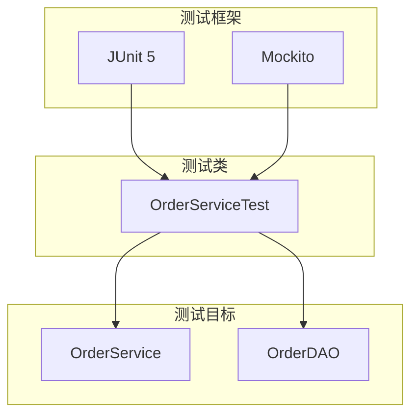

**图表来源**
- [OrderServiceTest.java](file://src/test/java/com/example/demo/service/OrderServiceTest.java#L1-L313)

#### 测试覆盖范围

| 测试场景 | 测试方法 | 验证点 |
|----------|----------|--------|
| 正常创建订单 | testCreateOrder_ValidOrder_ReturnsTrue | 返回true，验证DAO调用 |
| 重复创建订单 | testCreateOrder_ValidOrderButDAOReturnsFalse_ReturnsFalse | 返回false，验证DAO调用 |
| 无效数量 | testCreateOrder_QuantityLessThanOrEqualToZero_ThrowsException | 抛出异常，验证不调用DAO |
| 无效金额 | testCreateOrder_AmountLessThanOrEqualToZero_ThrowsException | 抛出异常，验证不调用DAO |
| 更新已完成订单 | testUpdateOrder_CompletedOrderToCompletedStatus_ReturnsFalse | 返回false，不调用DAO |
| 删除已支付订单 | 删除业务逻辑 | 返回false，验证业务规则 |

**章节来源**
- [OrderServiceTest.java](file://src/test/java/com/example/demo/service/OrderServiceTest.java#L1-L313)

## 总结

OrderDAO类作为数据访问层的核心组件，成功实现了以下关键目标：

### 技术亮点

1. **双重存储机制**：内存+数据库的混合存储模式，兼顾性能和可靠性
2. **线程安全设计**：使用ConcurrentHashMap确保高并发环境下的数据一致性
3. **幂等性保证**：通过INSERT OR REPLACE确保数据操作的幂等性
4. **优雅的时间类型处理**：完美解决LocalDateTime在数据库中的存储问题
5. **完善的异常处理**：多层次的异常捕获和处理机制

### 架构优势

- **分层清晰**：严格遵循MVC架构原则
- **职责分离**：DAO专注于数据访问，Service专注业务逻辑
- **可测试性**：良好的依赖注入设计便于单元测试
- **扩展性强**：支持多种存储后端的切换

### 应用价值

该实现为中小型Java应用提供了完整的数据访问解决方案，特别适用于：
- 高并发的Web应用
- 实时性要求较高的系统
- 需要快速原型开发的项目
- 对数据一致性要求较高的业务场景

通过这种设计，系统能够在保证高性能的同时，提供可靠的数据持久化能力，为上层业务逻辑提供了坚实的基础支撑。