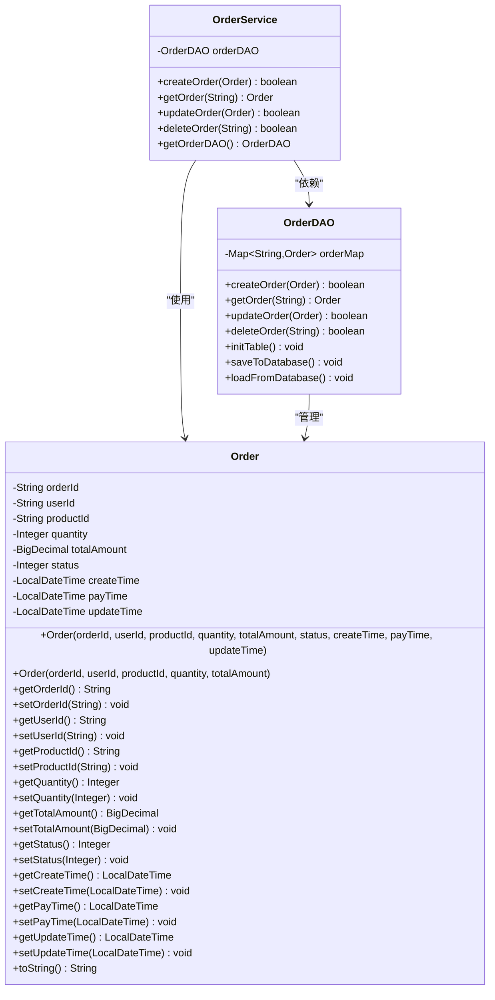
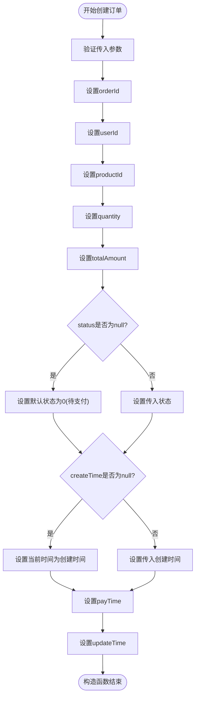
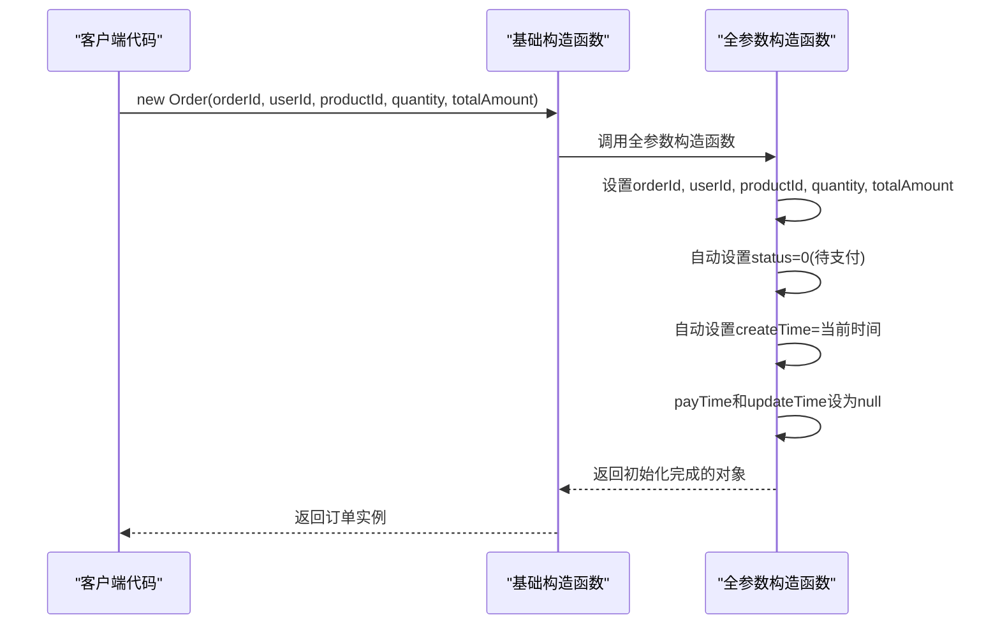
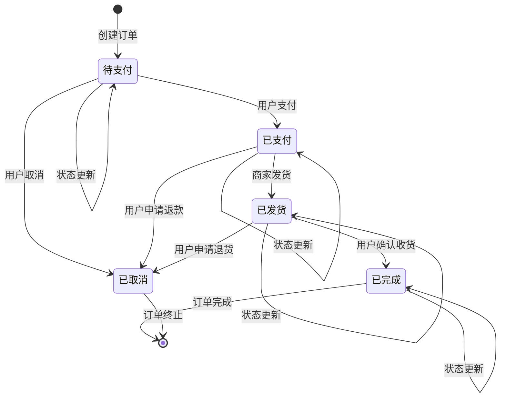
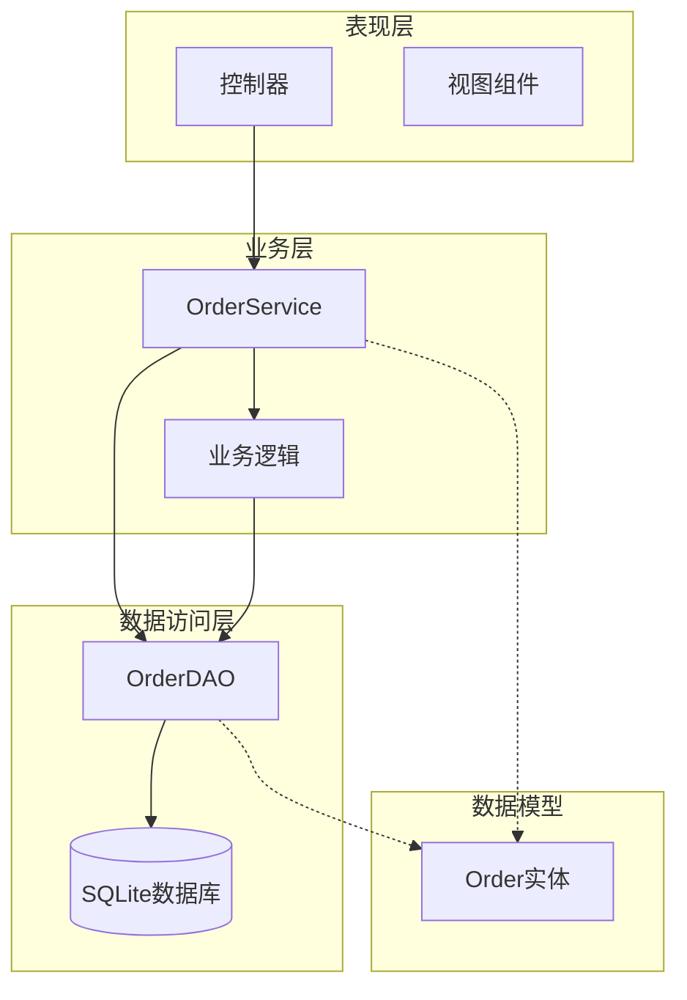

# 订单实体设计

<cite>
**本文档中引用的文件**
- [Order.java](file://src/main/java/com/example/demo/entity/Order.java)
- [OrderService.java](file://src/main/java/com/example/demo/service/OrderService.java)
- [OrderDAO.java](file://src/main/java/com/example/demo/dao/OrderDAO.java)
- [App.java](file://src/main/java/com/example/demo/App.java)
- [OrderServiceTest.java](file://src/test/java/com/example/demo/service/OrderServiceTest.java)
- [pom.xml](file://pom.xml)
</cite>

## 目录
1. [概述](#概述)
2. [实体类架构](#实体类架构)
3. [核心字段设计](#核心字段设计)
4. [构造函数设计](#构造函数设计)
5. [Getter/Setter方法](#gettersetter方法)
6. [toString方法](#tostring方法)
7. [业务流程分析](#业务流程分析)
8. [数据传输对象机制](#数据传输对象机制)
9. [最佳实践建议](#最佳实践建议)
10. [总结](#总结)

## 概述

Order实体类是本系统的核心数据模型，采用经典的Java Bean设计模式，实现了数据封装、业务逻辑分离和数据传输的标准架构。该实体类不仅包含了订单的基本属性，还通过精心设计的构造函数和方法提供了灵活的数据初始化和状态管理功能。

## 实体类架构

Order实体类采用了标准的面向对象设计原则，包含以下关键特性：



**图表来源**
- [Order.java](file://src/main/java/com/example/demo/entity/Order.java#L1-L143)
- [OrderService.java](file://src/main/java/com/example/demo/service/OrderService.java#L1-L81)
- [OrderDAO.java](file://src/main/java/com/example/demo/dao/OrderDAO.java#L1-L148)

**章节来源**
- [Order.java](file://src/main/java/com/example/demo/entity/Order.java#L1-L143)

## 核心字段设计

### 订单唯一标识（orderId）

- **数据类型**: `String`
- **业务含义**: 唯一标识每个订单的字符串标识符
- **设计考虑**: 使用String类型而非数字，便于扩展和国际化处理
- **约束条件**: 必须唯一，不能为空

### 用户ID（userId）

- **数据类型**: `String`
- **业务含义**: 关联订单所属用户的唯一标识
- **设计考虑**: 与用户系统解耦，支持多种用户认证机制
- **关联关系**: 外键关联到用户实体

### 商品ID（productId）

- **数据类型**: `String`
- **业务含义**: 关联订单中商品的唯一标识
- **设计考虑**: 支持多种商品管理系统
- **关联关系**: 外键关联到商品实体

### 购买数量（quantity）

- **数据类型**: `Integer`
- **业务含义**: 订单中商品的购买数量
- **设计考虑**: 使用Integer而非Long，满足大多数电商场景需求
- **业务约束**: 必须大于0

### 总金额（totalAmount）

- **数据类型**: `BigDecimal`
- **业务含义**: 订单的总金额，精确到小数点后两位
- **设计考虑**: 使用BigDecimal避免浮点数精度问题
- **精度要求**: 保留两位小数，符合货币计算标准

### 订单状态（status）

- **数据类型**: `Integer`
- **业务含义**: 订单当前所处的状态阶段
- **状态定义**:
  - `0`: 待支付 - 订单已创建但尚未支付
  - `1`: 已支付 - 订单已完成支付
  - `2`: 已发货 - 订单已发货给客户
  - `3`: 已完成 - 客户已确认收货
  - `4`: 已取消 - 订单被取消

### 时间戳字段

#### 创建时间（createTime）

- **数据类型**: `LocalDateTime`
- **业务含义**: 订单创建的时间戳
- **设计考虑**: 使用Java 8的LocalDateTime替代旧的Date类
- **自动设置**: 在基础构造函数中自动设置为当前时间

#### 支付时间（payTime）

- **数据类型**: `LocalDateTime`
- **业务含义**: 订单支付完成的时间戳
- **设计考虑**: 可为空，表示订单尚未支付
- **业务流程**: 在支付完成后设置

#### 更新时间（updateTime）

- **数据类型**: `LocalDateTime`
- **业务含义**: 订单最后更新的时间戳
- **设计考虑**: 记录所有状态变更的时间点
- **自动维护**: 在每次更新时自动刷新

**章节来源**
- [Order.java](file://src/main/java/com/example/demo/entity/Order.java#L8-L40)

## 构造函数设计

### 全参数构造函数



**图表来源**
- [Order.java](file://src/main/java/com/example/demo/entity/Order.java#L42-L54)

#### 设计意图

全参数构造函数提供了最大的灵活性，允许开发者完全控制订单的所有属性。这种设计适用于以下场景：

1. **数据库恢复**: 从数据库加载订单数据时使用
2. **API响应**: 向客户端返回完整订单信息
3. **批量导入**: 导入历史订单数据
4. **状态回滚**: 恢复订单到特定状态

#### 参数验证与默认值处理

- **状态默认值**: 当status为null时，默认设置为0（待支付）
- **时间默认值**: 当createTime为null时，自动设置为当前时间
- **可空字段**: payTime和updateTime允许为null，表示相应事件尚未发生

### 基础字段构造函数



**图表来源**
- [Order.java](file://src/main/java/com/example/demo/entity/Order.java#L56-L58)

#### 设计意图

基础构造函数简化了常见场景下的对象创建过程：

1. **快速创建**: 开发者只需提供核心业务数据
2. **默认状态**: 自动设置订单为"待支付"状态
3. **时间管理**: 自动设置创建时间为当前时间
4. **简洁性**: 避免重复设置常用默认值

#### 使用场景

- **新订单创建**: 用户下单时创建新的订单实例
- **业务逻辑**: 在业务层创建临时订单对象进行处理
- **测试用例**: 快速创建测试订单对象

**章节来源**
- [Order.java](file://src/main/java/com/example/demo/entity/Order.java#L42-L58)

## Getter/Setter方法

### 封装原则

Order实体类严格遵循Java Bean规范，为每个私有字段提供了对应的getter和setter方法。这种设计体现了以下原则：

#### 1. 数据封装
- 所有字段均为private修饰，防止外部直接访问
- 通过公共接口提供数据访问能力
- 确保数据的一致性和完整性

#### 2. 类型安全
- getter方法返回正确的数据类型
- setter方法接受正确的参数类型
- 避免类型转换错误

#### 3. 可扩展性
- setter方法可以添加额外的验证逻辑
- getter方法可以添加数据转换或缓存逻辑
- 方便未来功能扩展

### 方法命名规范

所有getter和setter方法都遵循标准的Java命名约定：

- **getter**: `get` + 字段名首字母大写
- **setter**: `set` + 字段名首字母大写

### 特殊处理

对于某些字段，setter方法可能需要特殊处理：

#### BigDecimal类型的处理
```java
// 设置总金额时的潜在验证
public void setTotalAmount(BigDecimal totalAmount) {
    if (totalAmount != null && totalAmount.compareTo(BigDecimal.ZERO) <= 0) {
        throw new IllegalArgumentException("总金额必须大于0");
    }
    this.totalAmount = totalAmount;
}
```

#### LocalDateTime类型的处理
```java
// 设置时间字段时的潜在验证
public void setCreateTime(LocalDateTime createTime) {
    if (createTime == null) {
        throw new IllegalArgumentException("创建时间不能为空");
    }
    this.createTime = createTime;
}
```

**章节来源**
- [Order.java](file://src/main/java/com/example/demo/entity/Order.java#L60-L142)

## toString方法

### 设计目的

toString方法重写了Object类的默认实现，提供了可读性强的字符串表示形式。这对于调试、日志记录和开发环境中的信息展示具有重要意义。

### 输出格式

```java
@Override
public String toString() {
    return "Order{" +
            "orderId='" + orderId + '\'' +
            ", userId='" + userId + '\'' +
            ", productId='" + productId + '\'' +
            ", quantity=" + quantity +
            ", totalAmount=" + totalAmount +
            ", status=" + status +
            ", createTime=" + createTime +
            ", payTime=" + payTime +
            ", updateTime=" + updateTime +
            '}';
}
```

### 日志输出中的作用

#### 1. 调试支持
```java
// 在OrderService中使用
System.out.println("创建订单: " + order.toString());
// 输出: 创建订单: Order{orderId='O001', userId='U100', productId='P200', quantity=2, totalAmount=99.99, status=0, createTime=2024-01-01T10:00:00}
```

#### 2. 错误追踪
```java
// 异常处理中的日志记录
catch (Exception e) {
    logger.error("订单处理失败，订单信息: {}", order.toString(), e);
}
```

#### 3. 状态监控
```java
// 定期检查订单状态
logger.info("当前订单状态: {}", order.toString());
```

### 性能考虑

虽然toString方法在生产环境中可能不会频繁调用，但其性能优化仍然重要：

- **延迟计算**: 对于复杂对象，可以考虑延迟计算toString结果
- **敏感信息过滤**: 在生产环境中，可能需要过滤掉敏感信息
- **格式化选项**: 提供不同的格式化选项以适应不同场景

**章节来源**
- [Order.java](file://src/main/java/com/example/demo/entity/Order.java#L144-L150)

## 业务流程分析

### 订单生命周期



### 业务逻辑验证

OrderService类展示了如何在业务层对Order实体进行验证和处理：

#### 创建订单验证
```java
// 数量验证
if (order.getQuantity() <= 0) {
    throw new IllegalArgumentException("购买数量必须大于0");
}

// 金额验证  
if (order.getTotalAmount().compareTo(order.getTotalAmount().ZERO) <= 0) {
    throw new IllegalArgumentException("订单金额必须大于0");
}
```

#### 状态变更规则
```java
// 已完成订单不能修改
if (order.getStatus() != null && order.getStatus() == 3) {
    Order existing = getOrderDAO().getOrder(order.getOrderId());
    if (existing != null && existing.getStatus() == 3) {
        return false;
    }
}
```

#### 删除限制
```java
// 已支付订单不能删除
Order order = getOrderDAO().getOrder(orderId);
if (order != null && order.getStatus() == 1) {
    return false;
}
```

### 数据一致性保证

Order实体通过以下机制确保数据一致性：

1. **构造函数初始化**: 确保对象创建时处于有效状态
2. **业务逻辑验证**: 在业务层进行数据有效性检查
3. **状态机约束**: 限制状态转换的合法性
4. **DAO层保护**: 在数据访问层进行最终验证

**章节来源**
- [OrderService.java](file://src/main/java/com/example/demo/service/OrderService.java#L15-L80)

## 数据传输对象机制

### DTO设计理念

Order实体类作为数据传输对象（DTO），在系统的不同层次之间发挥着桥梁作用：



**图表来源**
- [Order.java](file://src/main/java/com/example/demo/entity/Order.java#L1-L143)
- [OrderService.java](file://src/main/java/com/example/demo/service/OrderService.java#L1-L81)
- [OrderDAO.java](file://src/main/java/com/example/demo/dao/OrderDAO.java#L1-L148)

### 层间流转机制

#### 1. 表现层到业务层

```java
// 控制器接收请求参数
@PostMapping("/orders")
public ResponseEntity<Order> createOrder(@RequestBody OrderRequest request) {
    // 创建Order实体作为DTO
    Order order = new Order(
        request.getOrderId(),
        request.getUserId(),
        request.getProductId(),
        request.getQuantity(),
        request.getTotalAmount()
    );
    
    // 传递给业务层
    boolean created = orderService.createOrder(order);
    return ResponseEntity.ok(order);
}
```

#### 2. 业务层到数据访问层

```java
// 业务层验证后传递Order对象
public boolean createOrder(Order order) {
    // 业务验证逻辑
    validateOrder(order);
    
    // 传递给DAO层
    return orderDAO.createOrder(order);
}
```

#### 3. 数据访问层到业务层

```java
// DAO层返回Order对象
public Order getOrder(String orderId) {
    // 从数据库查询并创建Order对象
    Order order = new Order(
        rs.getString("orderId"),
        rs.getString("userId"),
        rs.getString("productId"),
        rs.getInt("quantity"),
        new BigDecimal(rs.getString("totalAmount")),
        rs.getInt("status"),
        rs.getObject("createTime", LocalDateTime.class),
        rs.getObject("payTime", LocalDateTime.class),
        rs.getObject("updateTime", LocalDateTime.class)
    );
    
    return order;
}
```

### 数据映射策略

#### 1. 基本类型映射
- `String` ↔ `TEXT` (数据库)
- `Integer` ↔ `INTEGER` (数据库)
- `BigDecimal` ↔ `TEXT` (数据库，避免精度丢失)

#### 2. 时间类型映射
- `LocalDateTime` ↔ `TEXT` (数据库，便于人类阅读)

#### 3. 状态枚举映射
- `Integer` 状态码 ↔ 语义化的业务状态

### 性能优化

#### 1. 延迟加载
```java
// 对于大型订单，可以实现部分字段的延迟加载
public class LazyOrder extends Order {
    private boolean loaded = false;
    
    @Override
    public String toString() {
        if (!loaded) {
            // 延迟加载完整信息
            loadFullDetails();
            loaded = true;
        }
        return super.toString();
    }
}
```

#### 2. 缓存策略
```java
// 在业务层实现缓存
@Cacheable(value = "orders", key = "#orderId")
public Order getOrder(String orderId) {
    return orderDAO.getOrder(orderId);
}
```

**章节来源**
- [OrderDAO.java](file://src/main/java/com/example/demo/dao/OrderDAO.java#L60-L147)
- [App.java](file://src/main/java/com/example/demo/App.java#L25-L61)

## 最佳实践建议

### 1. 构造函数选择指南

#### 场景化使用
```java
// 新建订单 - 使用基础构造函数
Order newOrder = new Order(orderId, userId, productId, quantity, totalAmount);

// 恢复订单 - 使用全参数构造函数
Order restoredOrder = new Order(
    orderId, userId, productId, quantity, 
    totalAmount, status, createTime, payTime, updateTime
);
```

#### 参数验证
```java
// 在构造函数中添加验证
public Order(String orderId, String userId, String productId, Integer quantity, BigDecimal totalAmount) {
    if (orderId == null || orderId.isEmpty()) {
        throw new IllegalArgumentException("订单ID不能为空");
    }
    if (quantity <= 0) {
        throw new IllegalArgumentException("购买数量必须大于0");
    }
    // ... 其他验证
}
```

### 2. Getter/Setter最佳实践

#### 1. 添加验证逻辑
```java
public void setQuantity(Integer quantity) {
    if (quantity == null || quantity <= 0) {
        throw new IllegalArgumentException("数量必须大于0");
    }
    this.quantity = quantity;
}
```

#### 2. 添加日志记录
```java
public void setStatus(Integer status) {
    logger.debug("订单状态从 {} 变更为 {}", this.status, status);
    this.status = status;
}
```

#### 3. 添加业务逻辑
```java
public void setPayTime(LocalDateTime payTime) {
    if (payTime != null && this.status != 0) {
        throw new IllegalStateException("只有待支付状态的订单才能设置支付时间");
    }
    this.payTime = payTime;
}
```

### 3. toString方法增强

#### 1. 敏感信息过滤
```java
@Override
public String toString() {
    return "Order{" +
           "orderId='" + orderId + '\'' +
           ", userId='" + maskSensitiveInfo(userId) + '\'' +
           ", productId='" + maskSensitiveInfo(productId) + '\'' +
           ", quantity=" + quantity +
           ", totalAmount=" + maskSensitiveInfo(totalAmount.toString()) +
           ", status=" + status +
           ", createTime=" + createTime +
           ", payTime=" + payTime +
           ", updateTime=" + updateTime +
           '}';
}
```

#### 2. 条件格式化
```java
public String toString(boolean includeSensitive) {
    if (includeSensitive) {
        return toString(); // 包含敏感信息的完整版本
    }
    return "Order{" +
           "orderId='" + orderId + '\'' +
           ", userId='***'" +
           ", productId='***'" +
           ", quantity=" + quantity +
           ", totalAmount=" + totalAmount +
           ", status=" + status +
           ", createTime=" + createTime +
           ", payTime=" + payTime +
           ", updateTime=" + updateTime +
           '}';
}
```

### 4. 并发安全性

#### 1. 不可变对象设计
```java
public final class ImmutableOrder {
    private final String orderId;
    private final String userId;
    private final String productId;
    private final int quantity;
    private final BigDecimal totalAmount;
    private final int status;
    private final LocalDateTime createTime;
    private final LocalDateTime payTime;
    private final LocalDateTime updateTime;
    
    // 只提供getter，不提供setter
}
```

#### 2. 线程安全的构建器模式
```java
public class OrderBuilder {
    private String orderId;
    private String userId;
    private String productId;
    private Integer quantity;
    private BigDecimal totalAmount;
    private Integer status = 0;
    private LocalDateTime createTime = LocalDateTime.now();
    private LocalDateTime payTime;
    private LocalDateTime updateTime;
    
    public OrderBuilder setOrderId(String orderId) {
        this.orderId = orderId;
        return this;
    }
    
    // ... 其他setter方法
    
    public synchronized Order build() {
        return new Order(
            orderId, userId, productId, quantity, totalAmount, 
            status, createTime, payTime, updateTime
        );
    }
}
```

### 5. 序列化优化

#### 1. 自定义序列化
```java
private void writeObject(ObjectOutputStream out) throws IOException {
    out.defaultWriteObject();
    // 自定义序列化逻辑
}

private void readObject(ObjectInputStream in) throws IOException, ClassNotFoundException {
    in.defaultReadObject();
    // 自定义反序列化逻辑
}
```

#### 2. JSON序列化配置
```java
@JsonFormat(pattern = "yyyy-MM-dd HH:mm:ss")
@JsonProperty("create_time")
public LocalDateTime getCreateTime() {
    return createTime;
}
```

### 6. 单元测试策略

#### 1. 构造函数测试
```java
@Test
void testOrderCreationWithDefaultValues() {
    Order order = new Order("O001", "U100", "P200", 2, new BigDecimal("99.99"));
    assertEquals(0, order.getStatus());
    assertNotNull(order.getCreateTime());
    assertNull(order.getPayTime());
    assertNull(order.getUpdateTime());
}
```

#### 2. Getter/Setter测试
```java
@Test
void testOrderPropertySettersAndGetters() {
    Order order = new Order("O001", "U100", "P200", 2, new BigDecimal("99.99"));
    
    order.setStatus(1);
    assertEquals(1, order.getStatus());
    
    LocalDateTime now = LocalDateTime.now();
    order.setPayTime(now);
    assertEquals(now, order.getPayTime());
}
```

#### 3. toString方法测试
```java
@Test
void testToStringMethod() {
    Order order = new Order("O001", "U100", "P200", 2, new BigDecimal("99.99"));
    String toStringResult = order.toString();
    
    assertTrue(toStringResult.contains("orderId='O001'"));
    assertTrue(toStringResult.contains("userId='U100'"));
    assertTrue(toStringResult.contains("quantity=2"));
    assertTrue(toStringResult.contains("totalAmount=99.99"));
}
```

**章节来源**
- [OrderServiceTest.java](file://src/test/java/com/example/demo/service/OrderServiceTest.java#L1-L313)

## 总结

Order实体类作为本系统的核心数据模型，展现了优秀的软件设计原则和实践：

### 设计亮点

1. **清晰的职责分离**: 通过构造函数的不同设计，满足了不同场景的需求
2. **强类型安全**: 使用适当的Java类型，避免了类型转换错误
3. **业务逻辑内聚**: 将订单相关的业务规则集中在一个类中
4. **可扩展性**: 通过继承和组合模式支持未来的功能扩展
5. **测试友好**: 提供了良好的测试接口和验证机制

### 技术优势

1. **精度保证**: 使用BigDecimal确保货币计算的准确性
2. **时间管理**: 使用Java 8的LocalDateTime提供现代化的时间处理
3. **状态管理**: 清晰的状态定义支持复杂的业务流程
4. **数据传输**: 作为DTO在各层之间高效流转

### 应用价值

Order实体类不仅是一个简单的数据容器，更是整个订单系统业务逻辑的基础。它通过精心设计的API和内部结构，为上层业务逻辑提供了稳定可靠的数据支撑，同时为下层数据持久化提供了清晰的抽象接口。

这种设计模式值得在类似的业务系统中推广和应用，特别是在需要处理复杂业务规则和多层架构的应用场景中。