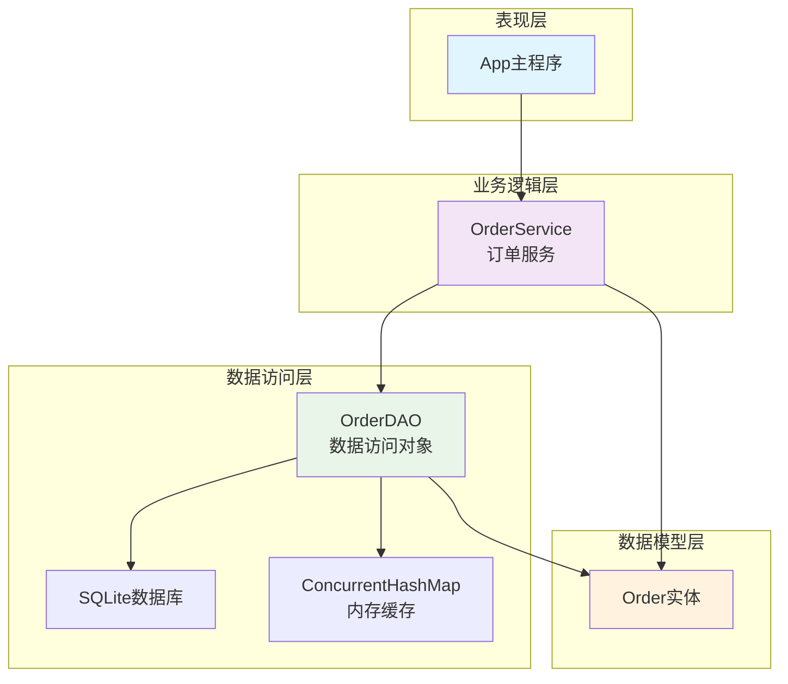
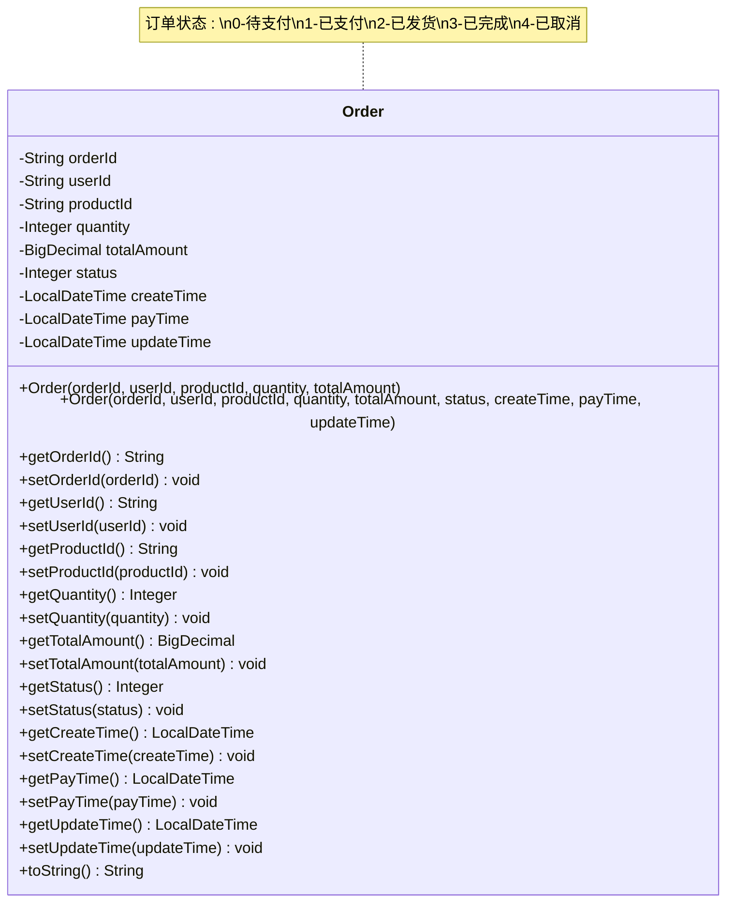
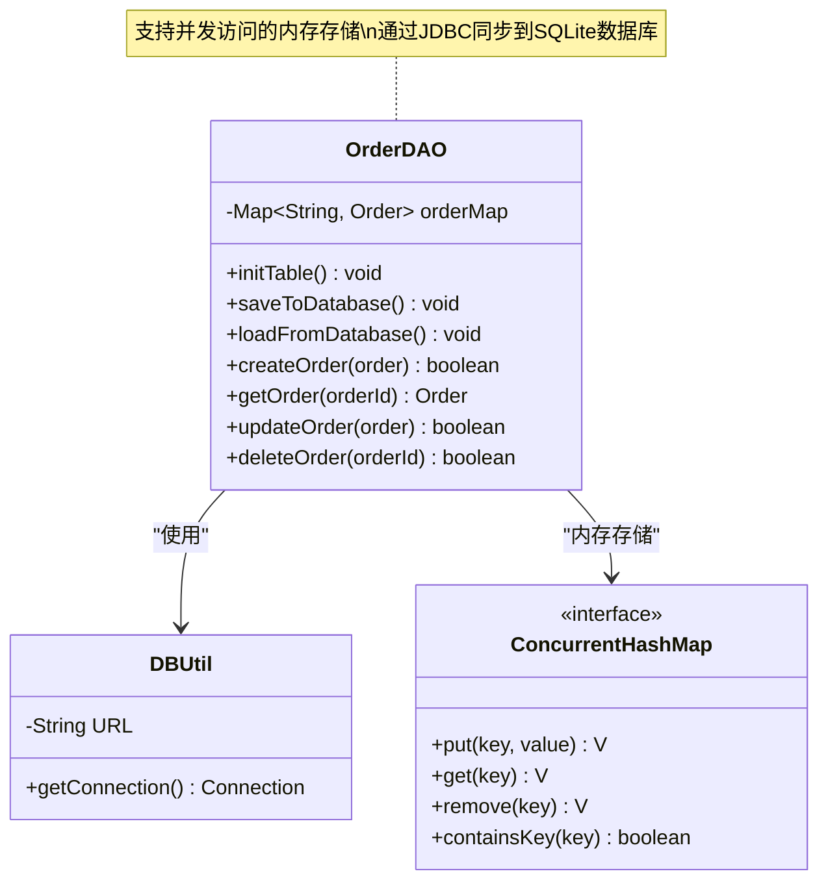
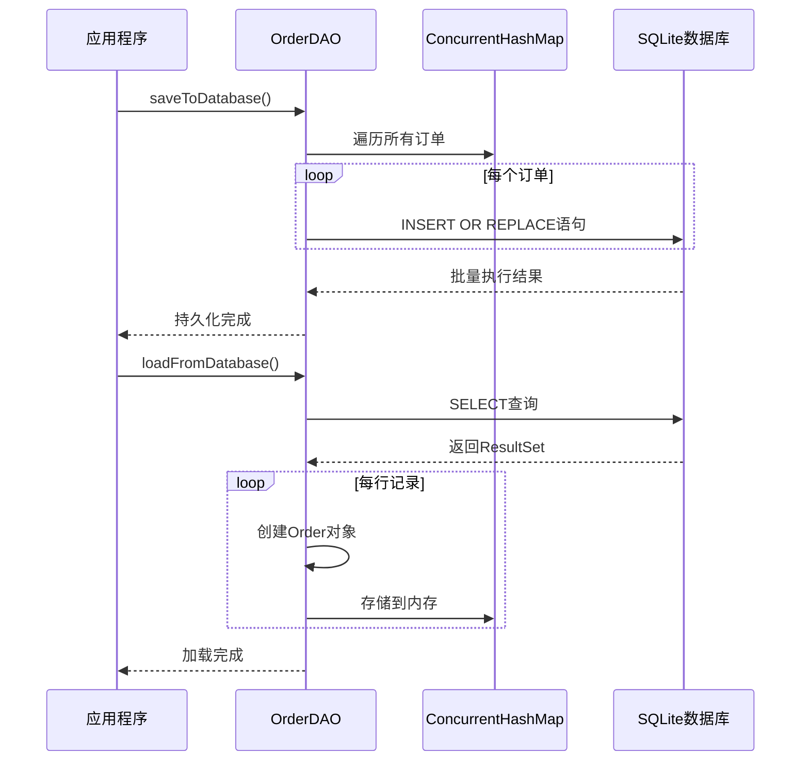
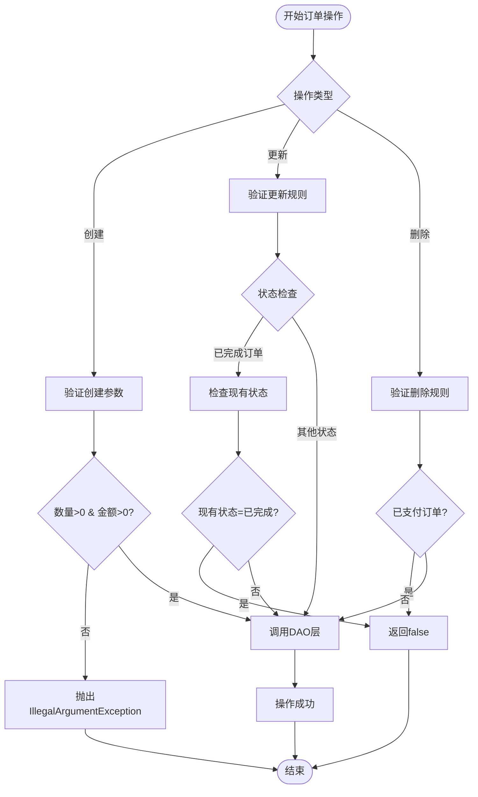
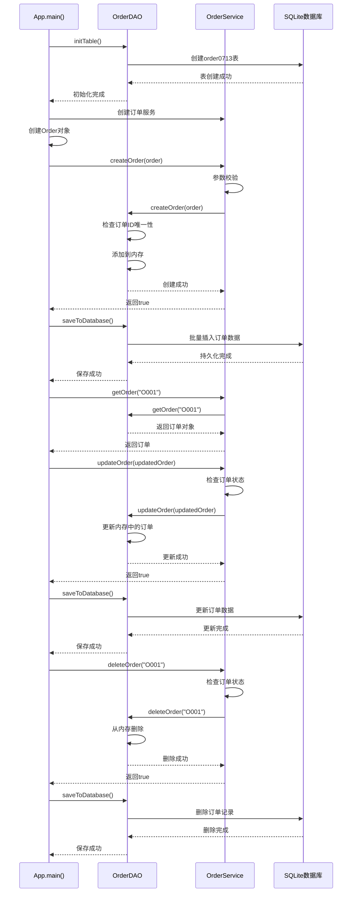
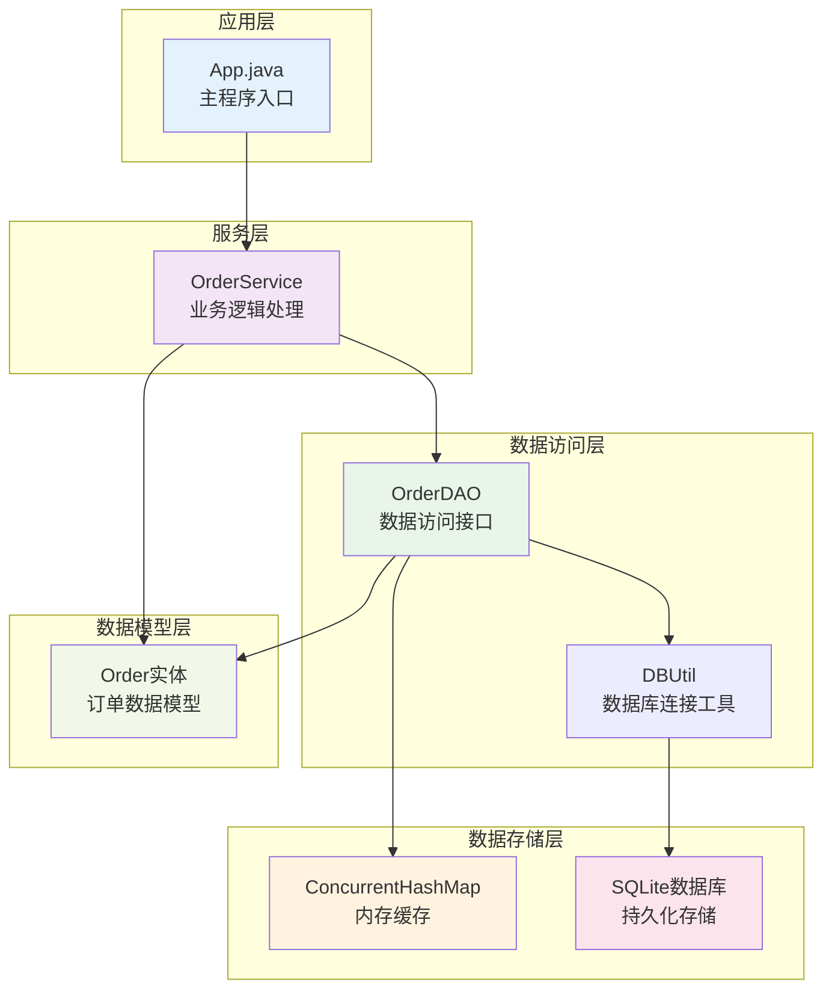
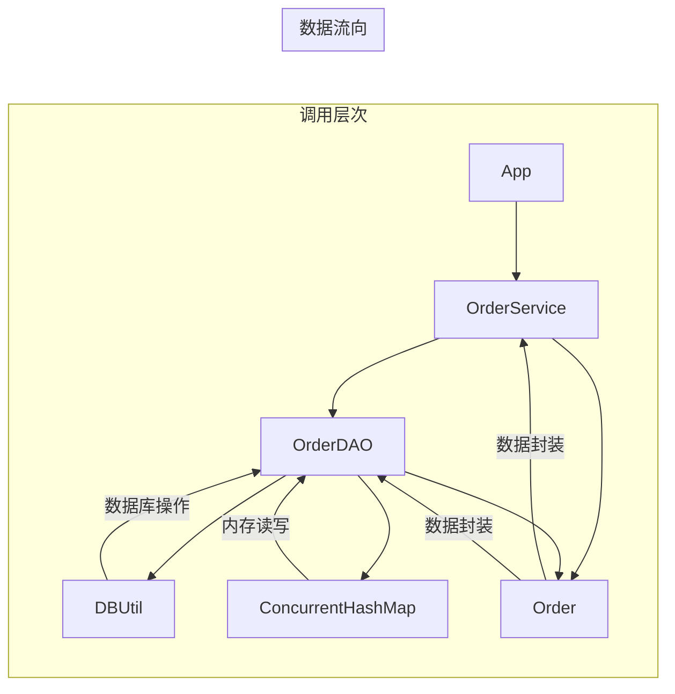
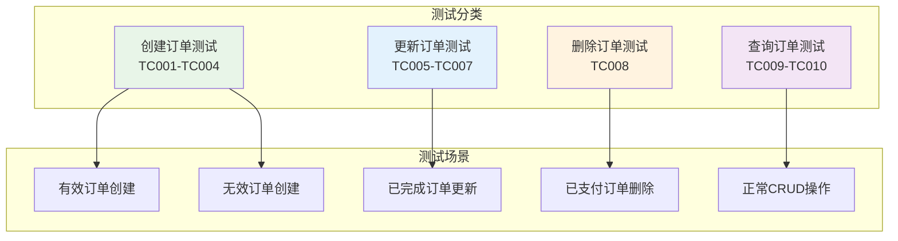

# 订单管理服务

<cite>
**本文档引用的文件**
- [Order.java](file://src/main/java/com/example/demo/entity/Order.java)
- [OrderDAO.java](file://src/main/java/com/example/demo/dao/OrderDAO.java)
- [OrderService.java](file://src/main/java/com/example/demo/service/OrderService.java)
- [App.java](file://src/main/java/com/example/demo/App.java)
- [DBUtil.java](file://src/main/java/com/example/demo/dao/DBUtil.java)
- [OrderServiceTest.java](file://src/test/java/com/example/demo/service/OrderServiceTest.java)
- [pom.xml](file://pom.xml)
</cite>

## 目录
1. [项目概述](#项目概述)
2. [系统架构](#系统架构)
3. [订单数据模型](#订单数据模型)
4. [数据访问层详解](#数据访问层详解)
5. [业务逻辑层详解](#业务逻辑层详解)
6. [主程序调用示例](#主程序调用示例)
7. [组件交互关系](#组件交互关系)
8. [测试策略](#测试策略)
9. [性能考虑](#性能考虑)
10. [总结](#总结)

## 项目概述

本订单管理系统采用经典的三层架构设计，包含实体层、数据访问层和服务层，实现了完整的订单生命周期管理功能。系统使用Java语言开发，采用SQLite数据库进行数据持久化，并通过ConcurrentHashMap提供内存级别的快速访问能力。

### 核心特性
- **内存+数据库双重存储**：使用ConcurrentHashMap提供高性能内存访问，同时通过JDBC同步到SQLite数据库确保数据持久性
- **严格的业务规则**：实现了订单状态流转控制、数量和金额校验等业务约束
- **完整的CRUD操作**：支持订单的创建、查询、更新、删除等基本操作
- **状态管理**：完整的订单状态生命周期管理（待支付→已支付→已发货→已完成/已取消）

## 系统架构

**图表来源**
- [App.java](file://src/main/java/com/example/demo/App.java#L1-L62)
- [OrderService.java](file://src/main/java/com/example/demo/service/OrderService.java#L1-L81)
- [OrderDAO.java](file://src/main/java/com/example/demo/dao/OrderDAO.java#L1-L148)

## 订单数据模型

### 实体类设计

Order实体类是整个订单管理系统的核心数据模型，包含了订单的所有关键属性和业务逻辑。

**图表来源**
- [Order.java](file://src/main/java/com/example/demo/entity/Order.java#L7-L143)

### 字段详细说明

| 字段名 | 类型 | 描述 | 业务约束 |
|--------|------|------|----------|
| orderId | String | 订单唯一标识符 | 主键，不能为空，自动生成或手动指定 |
| userId | String | 用户ID | 外键关联用户系统，不能为空 |
| productId | String | 商品ID | 外键关联商品系统，不能为空 |
| quantity | Integer | 购买数量 | 必须大于0，整数值 |
| totalAmount | BigDecimal | 订单总金额 | 必须大于0，精确到分 |
| status | Integer | 订单状态 | 枚举值：0-待支付, 1-已支付, 2-已发货, 3-已完成, 4-已取消 |
| createTime | LocalDateTime | 创建时间 | 自动设置，默认当前时间 |
| payTime | LocalDateTime | 支付时间 | 状态为已支付时设置 |
| updateTime | LocalDateTime | 更新时间 | 每次修改时自动更新 |

**节来源**
- [Order.java](file://src/main/java/com/example/demo/entity/Order.java#L9-L30)

### 构造函数设计

系统提供了两种构造函数：
1. **全参数构造函数**：允许完全控制订单的所有属性
2. **基础构造函数**：简化常用场景，自动设置默认状态和创建时间

**节来源**
- [Order.java](file://src/main/java/com/example/demo/entity/Order.java#L32-L51)

## 数据访问层详解

### OrderDAO核心功能

OrderDAO类负责处理所有与数据库相关的操作，采用内存缓存加数据库持久化的双重存储策略。

**图表来源**
- [OrderDAO.java](file://src/main/java/com/example/demo/dao/OrderDAO.java#L11-L148)
- [DBUtil.java](file://src/main/java/com/example/demo/dao/DBUtil.java#L1-L19)

### 数据库初始化机制

`initTable()`方法负责创建SQLite数据库表结构，确保系统启动时数据库结构的完整性。

**节来源**
- [OrderDAO.java](file://src/main/java/com/example/demo/dao/OrderDAO.java#L16-L30)

### 内存与数据库同步

系统采用双重存储策略：
- **内存存储**：使用ConcurrentHashMap提供高性能的并发访问
- **数据库持久化**：通过JDBC将内存数据同步到SQLite数据库

**图表来源**
- [OrderDAO.java](file://src/main/java/com/example/demo/dao/OrderDAO.java#L32-L53)
- [OrderDAO.java](file://src/main/java/com/example/demo/dao/OrderDAO.java#L55-L87)

**节来源**
- [OrderDAO.java](file://src/main/java/com/example/demo/dao/OrderDAO.java#L32-L87)

### CRUD操作实现

每个CRUD操作都遵循统一的模式：

| 操作 | 方法 | 并发安全性 | 数据一致性 |
|------|------|------------|------------|
| 创建 | createOrder() | ConcurrentHashSet保证 | 原子性检查+插入 |
| 查询 | getOrder() | 线程安全读取 | 即时内存读取 |
| 更新 | updateOrder() | 线程安全写入 | 原子性替换 |
| 删除 | deleteOrder() | 线程安全删除 | 原子性移除 |

**节来源**
- [OrderDAO.java](file://src/main/java/com/example/demo/dao/OrderDAO.java#L90-L147)

## 业务逻辑层详解

### OrderService业务规则

OrderService类实现了订单管理的核心业务逻辑，包括创建、查询、更新、删除操作的业务约束。

**图表来源**
- [OrderService.java](file://src/main/java/com/example/demo/service/OrderService.java#L15-L80)

### 业务校验规则

#### 创建订单校验
- **数量校验**：购买数量必须大于0
- **金额校验**：订单总金额必须大于0
- **重复校验**：订单ID必须唯一

**节来源**
- [OrderService.java](file://src/main/java/com/example/demo/service/OrderService.java#L15-L25)

#### 更新订单规则
- **状态保护**：已完成状态的订单不能修改
- **状态检查**：更新前需要确认当前状态

**节来源**
- [OrderService.java](file://src/main/java/com/example/demo/service/OrderService.java#L46-L58)

#### 删除订单规则
- **支付保护**：已支付状态的订单不能删除
- **存在检查**：只有存在的订单才能删除

**节来源**
- [OrderService.java](file://src/main/java/com/example/demo/service/OrderService.java#L60-L72)

### 依赖注入与可测试性

OrderService通过protected方法暴露DAO实例，便于单元测试时使用Mock对象。

**节来源**
- [OrderService.java](file://src/main/java/com/example/demo/service/OrderService.java#L35-L40)

## 主程序调用示例

### 完整订单生命周期演示

App类展示了订单管理系统的完整使用流程，从数据库初始化到订单的完整生命周期管理。

**图表来源**
- [App.java](file://src/main/java/com/example/demo/App.java#L13-L61)

### 关键操作步骤

1. **数据库初始化**：创建订单表结构
2. **订单创建**：验证参数后添加到内存
3. **数据持久化**：将内存数据同步到数据库
4. **订单查询**：从内存中获取订单信息
5. **状态更新**：修改订单状态并同步
6. **订单删除**：删除订单并更新数据库

**节来源**
- [App.java](file://src/main/java/com/example/demo/App.java#L13-L61)

## 组件交互关系

### 层次化架构图

**图表来源**
- [App.java](file://src/main/java/com/example/demo/App.java#L1-L62)
- [OrderService.java](file://src/main/java/com/example/demo/service/OrderService.java#L1-L81)
- [OrderDAO.java](file://src/main/java/com/example/demo/dao/OrderDAO.java#L1-L148)

### 职责划分

| 组件 | 主要职责 | 关注点 |
|------|----------|--------|
| App | 系统入口和流程编排 | 整体流程控制 |
| OrderService | 业务规则和逻辑处理 | 业务约束、状态管理 |
| OrderDAO | 数据访问和持久化 | 数据一致性、并发安全 |
| DBUtil | 数据库连接管理 | 连接池、事务管理 |
| Order | 数据模型和封装 | 数据结构、业务属性 |

### 调用关系图

**图表来源**
- [App.java](file://src/main/java/com/example/demo/App.java#L13-L61)
- [OrderService.java](file://src/main/java/com/example/demo/service/OrderService.java#L10-L12)
- [OrderDAO.java](file://src/main/java/com/example/demo/dao/OrderDAO.java#L11-L12)

## 测试策略

### 单元测试覆盖

OrderServiceTest类提供了全面的单元测试覆盖，使用JUnit 5和Mockito框架。

**图表来源**
- [OrderServiceTest.java](file://src/test/java/com/example/demo/service/OrderServiceTest.java#L1-L313)

### 测试用例设计

| 测试编号 | 测试场景 | 预期结果 | 验证要点 |
|----------|----------|----------|----------|
| TC001 | 有效订单创建 | 返回true | 正常流程验证 |
| TC002 | 重复订单创建 | 返回false | 唯一性约束 |
| TC003 | 数量≤0订单 | 抛出异常 | 参数校验 |
| TC004 | 金额≤0订单 | 抛出异常 | 参数校验 |
| TC005 | 已完成订单更新 | 返回false | 状态保护 |
| TC006 | 新状态订单更新 | 返回DAO结果 | 正常更新 |
| TC007 | 非完成状态更新 | 返回DAO结果 | 正常更新 |
| TC008 | DAO返回false | 返回false | 异常处理 |

**节来源**
- [OrderServiceTest.java](file://src/test/java/com/example/demo/service/OrderServiceTest.java#L57-L313)

### Mock测试策略

测试中使用Mock技术隔离外部依赖，确保测试的独立性和稳定性。

**节来源**
- [OrderServiceTest.java](file://src/test/java/com/example/demo/service/OrderServiceTest.java#L25-L55)

## 性能考虑

### 内存优化策略

1. **并发安全**：使用ConcurrentHashMap确保多线程环境下的性能
2. **批量操作**：JDBC批量插入提高数据库操作效率
3. **延迟加载**：仅在需要时从数据库加载数据

### 数据库优化

1. **索引设计**：订单ID为主键，提供快速查找
2. **批量操作**：使用PreparedStatement和batch执行提高效率
3. **连接管理**：通过DBUtil统一管理数据库连接

### 缓存策略

- **内存缓存**：提供毫秒级的读取性能
- **定期同步**：定时将内存数据同步到数据库
- **LRU淘汰**：虽然未实现，但可扩展支持

## 总结

本订单管理系统展现了良好的软件架构设计原则：

### 设计优势
1. **清晰的分层架构**：三层架构职责分明，便于维护和扩展
2. **双重存储策略**：内存+数据库结合，兼顾性能和可靠性
3. **严格的业务规则**：完善的校验机制确保数据完整性
4. **良好的测试覆盖**：全面的单元测试保障代码质量

### 技术特色
- **并发安全**：使用ConcurrentHashMap支持高并发访问
- **数据一致性**：通过事务和批量操作保证数据一致性
- **可扩展性**：模块化设计便于功能扩展
- **可测试性**：良好的依赖注入支持单元测试

### 应用价值
该系统为企业级订单管理提供了完整的解决方案，适用于中小型企业的需求场景，具有良好的学习和参考价值。