# 订单管理系统前后端集成文档

<cite>
**本文档引用的文件**
- [App.js](file://frontend/src/App.js)
- [orderService.js](file://frontend/src/services/orderService.js)
- [OrderController.java](file://src/main/java/com/example/demo/controller/OrderController.java)
- [OrderService.java](file://src/main/java/com/example/demo/service/OrderService.java)
- [OrderDAO.java](file://src/main/java/com/example/demo/dao/OrderDAO.java)
- [Order.java](file://src/main/java/com/example/demo/entity/Order.java)
- [DBUtil.java](file://src/main/java/com/example/demo/dao/DBUtil.java)
- [WebConfig.java](file://src/main/java/com/example/demo/config/WebConfig.java)
- [pom.xml](file://pom.xml)
- [package.json](file://frontend/package.json)
- [OrderServiceTest.java](file://src/test/java/com/example/demo/service/OrderServiceTest.java)
- [OrderDAOTest.java](file://src/test/java/com/example/demo/dao/OrderDAOTest.java)
</cite>

## 目录
1. [项目概述](#项目概述)
2. [系统架构](#系统架构)
3. [前端组件分析](#前端组件分析)
4. [后端服务分析](#后端服务分析)
5. [数据模型设计](#数据模型设计)
6. [API接口设计](#api接口设计)
7. [数据库集成](#数据库集成)
8. [前后端通信机制](#前后端通信机制)
9. [业务流程分析](#业务流程分析)
10. [测试策略](#测试策略)
11. [部署与配置](#部署与配置)
12. [性能优化建议](#性能优化建议)
13. [故障排除指南](#故障排除指南)

## 项目概述

订单管理系统是一个基于Spring Boot后端和React前端的全栈应用，采用前后端分离架构。系统提供完整的订单生命周期管理功能，包括订单创建、查询、更新和删除等核心业务操作。

### 技术栈概览

**前端技术栈：**
- React 19.2.0 (JavaScript框架)
- Axios 1.13.2 (HTTP客户端)
- CSS (样式管理)

**后端技术栈：**
- Spring Boot 2.7.14 (Java Web框架)
- SQLite 3.36.0.3 (嵌入式数据库)
- Maven 3.8.1 (项目构建工具)

**核心特性：**
- 实时订单状态管理
- 用户ID查询功能
- 状态流转控制
- 健康检查机制
- 跨域资源共享支持

## 系统架构

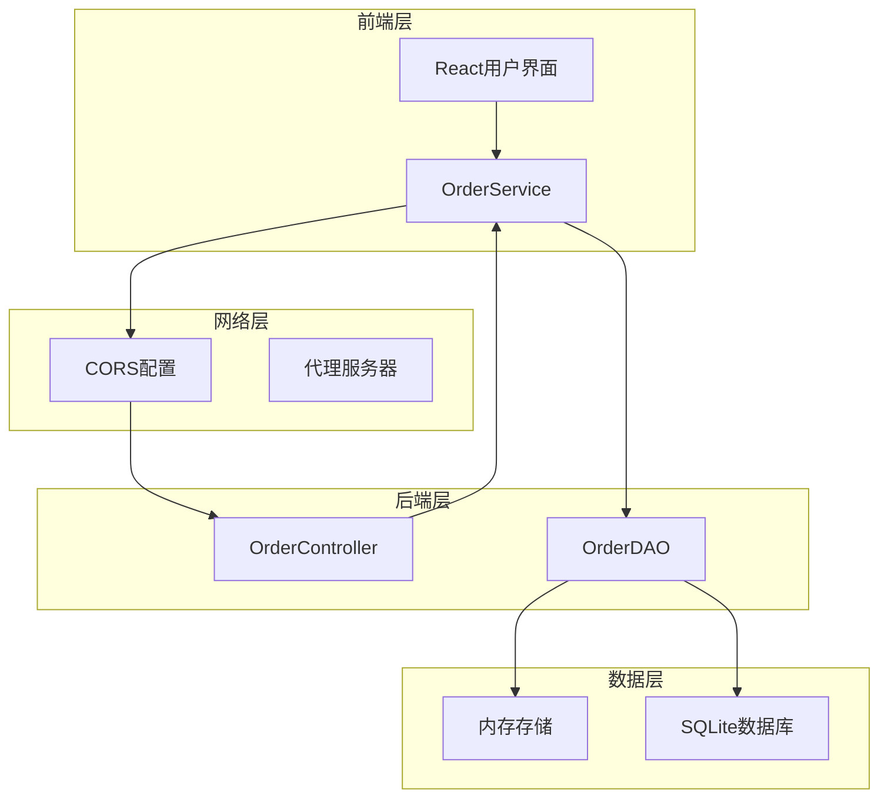

**图表来源**
- [App.js](file://frontend/src/App.js#L1-L50)
- [orderService.js](file://frontend/src/services/orderService.js#L1-L50)
- [OrderController.java](file://src/main/java/com/example/demo/controller/OrderController.java#L1-L50)
- [OrderService.java](file://src/main/java/com/example/demo/service/OrderService.java#L1-L50)
- [OrderDAO.java](file://src/main/java/com/example/demo/dao/OrderDAO.java#L1-L50)

### 架构层次说明

1. **表现层（Presentation Layer）**：React组件负责用户交互和界面展示
2. **服务层（Service Layer）**：处理业务逻辑和数据转换
3. **数据访问层（Data Access Layer）**：管理数据持久化和检索
4. **存储层（Storage Layer）**：SQLite数据库提供数据持久化

**章节来源**
- [App.js](file://frontend/src/App.js#L1-L394)
- [OrderController.java](file://src/main/java/com/example/demo/controller/OrderController.java#L1-L173)
- [OrderService.java](file://src/main/java/com/example/demo/service/OrderService.java#L1-L114)
- [OrderDAO.java](file://src/main/java/com/example/demo/dao/OrderDAO.java#L1-L187)

## 前端组件分析

### 主应用组件（App.js）

主应用组件是整个订单管理系统的核心UI组件，实现了完整的订单管理功能。

#### 组件状态管理

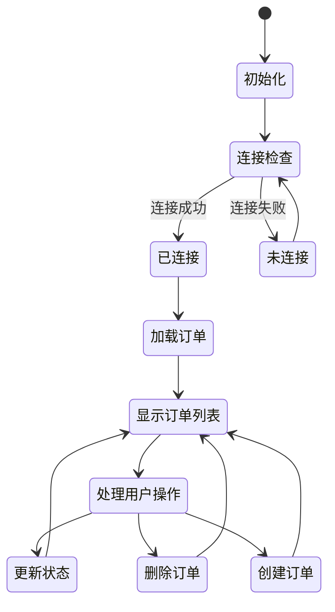

**图表来源**
- [App.js](file://frontend/src/App.js#L20-L60)

#### 核心功能模块

1. **订单创建表单**：支持订单基本信息录入
2. **订单查询功能**：按用户ID搜索订单
3. **订单状态管理**：支持状态流转操作
4. **实时消息提示**：提供操作反馈信息

#### API调用流程

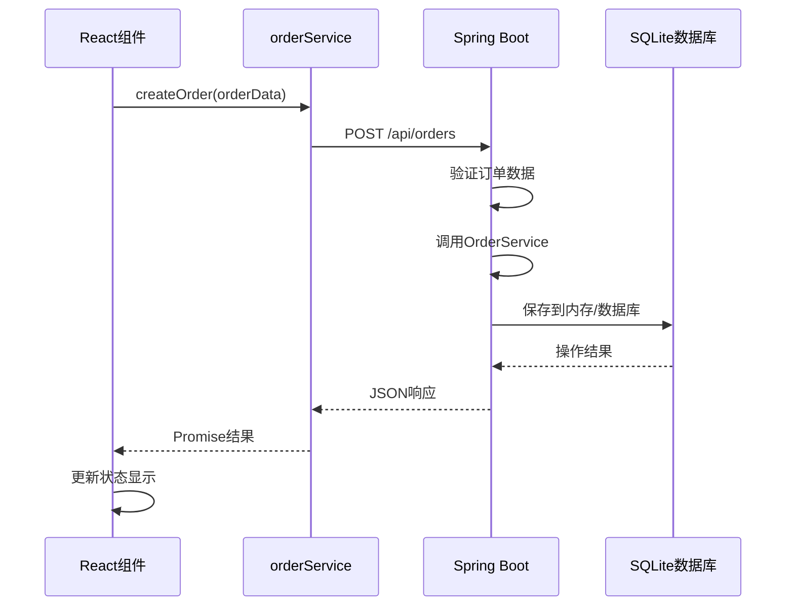

**图表来源**
- [App.js](file://frontend/src/App.js#L80-L120)
- [orderService.js](file://frontend/src/services/orderService.js#L10-L30)

**章节来源**
- [App.js](file://frontend/src/App.js#L1-L394)
- [orderService.js](file://frontend/src/services/orderService.js#L1-L50)

## 后端服务分析

### 控制器层（OrderController）

控制器层负责处理HTTP请求和响应，实现RESTful API接口。

#### API端点设计

| 端点 | 方法 | 功能描述 | 请求体 | 响应格式 |
|------|------|----------|--------|----------|
| `/api/orders` | GET | 获取所有订单 | 无 | 包含订单列表的JSON对象 |
| `/api/orders` | POST | 创建新订单 | Order对象 | 包含创建结果的JSON对象 |
| `/api/orders/{orderId}` | GET | 获取订单详情 | 无 | 包含订单信息的JSON对象 |
| `/api/orders/{orderId}` | PUT | 更新订单 | Order对象 | 包含更新结果的JSON对象 |
| `/api/orders/{orderId}` | DELETE | 删除订单 | 无 | 包含删除结果的JSON对象 |
| `/api/orders/user/{userId}` | GET | 按用户ID查询订单 | 无 | 包含订单列表的JSON对象 |
| `/api/orders/health` | GET | 健康检查 | 无 | 包含健康状态的JSON对象 |

#### 业务逻辑处理

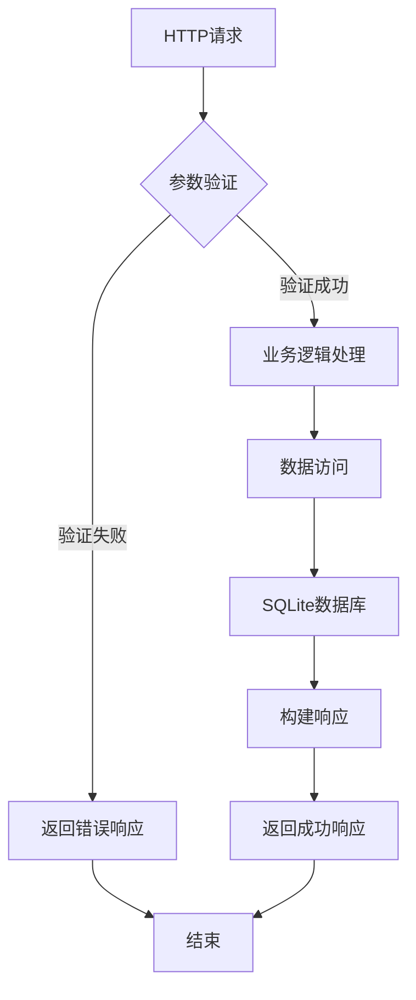

**图表来源**
- [OrderController.java](file://src/main/java/com/example/demo/controller/OrderController.java#L30-L80)

**章节来源**
- [OrderController.java](file://src/main/java/com/example/demo/controller/OrderController.java#L1-L173)

### 服务层（OrderService）

服务层实现业务规则和逻辑控制，确保数据完整性和业务一致性。

#### 状态流转控制

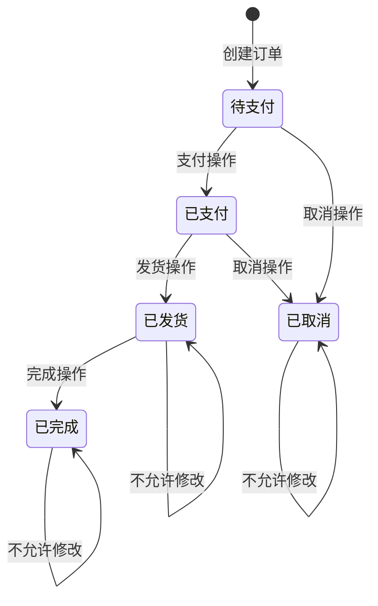

**图表来源**
- [OrderService.java](file://src/main/java/com/example/demo/service/OrderService.java#L40-L70)

#### 业务规则验证

| 规则类型 | 验证条件 | 错误处理 |
|----------|----------|----------|
| 订单创建 | 数量 > 0, 金额 > 0 | 抛出IllegalArgumentException |
| 状态更新 | 已完成订单不允许修改 | 返回false |
| 订单删除 | 已支付订单不允许删除 | 返回false |
| 用户查询 | userId不能为空 | 抛出IllegalArgumentException |

**章节来源**
- [OrderService.java](file://src/main/java/com/example/demo/service/OrderService.java#L1-L114)

### 数据访问层（OrderDAO）

数据访问层负责数据的持久化和检索，采用内存存储结合SQLite数据库的混合模式。

#### 数据存储策略

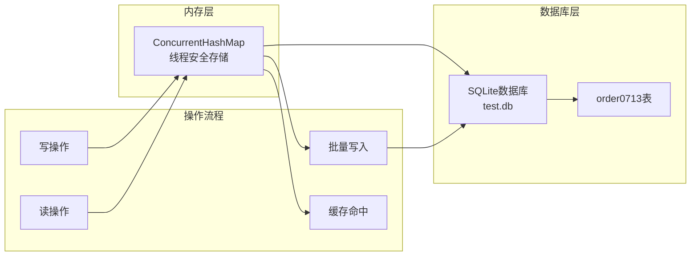

**图表来源**
- [OrderDAO.java](file://src/main/java/com/example/demo/dao/OrderDAO.java#L20-L50)
- [DBUtil.java](file://src/main/java/com/example/demo/dao/DBUtil.java#L1-L19)

**章节来源**
- [OrderDAO.java](file://src/main/java/com/example/demo/dao/OrderDAO.java#L1-L187)
- [DBUtil.java](file://src/main/java/com/example/demo/dao/DBUtil.java#L1-L19)

## 数据模型设计

### 订单实体（Order）

订单实体类定义了订单的核心属性和业务规则。

#### 属性设计

| 属性名 | 类型 | 描述 | 约束条件 |
|--------|------|------|----------|
| orderId | String | 订单唯一标识 | 主键，必填 |
| userId | String | 用户ID | 必填 |
| productId | String | 商品ID | 必填 |
| quantity | Integer | 购买数量 | 必须 > 0 |
| totalAmount | BigDecimal | 订单总金额 | 必须 > 0 |
| status | Integer | 订单状态 | 0-待支付, 1-已支付, 2-已发货, 3-已完成, 4-已取消 |
| createTime | LocalDateTime | 创建时间 | 自动生成 |
| payTime | LocalDateTime | 支付时间 | 状态为1时设置 |
| updateTime | LocalDateTime | 更新时间 | 自动更新 |

#### 状态映射表

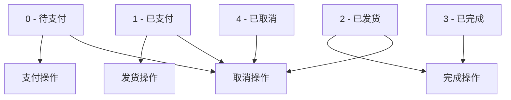

**图表来源**
- [Order.java](file://src/main/java/com/example/demo/entity/Order.java#L15-L35)

**章节来源**
- [Order.java](file://src/main/java/com/example/demo/entity/Order.java#L1-L149)

## API接口设计

### RESTful API规范

系统遵循RESTful设计原则，提供标准化的API接口。

#### 接口设计原则

1. **资源导向**：每个URL代表一个资源
2. **统一接口**：使用标准HTTP方法
3. **无状态**：每次请求包含完整信息
4. **可缓存**：支持响应缓存机制

#### 错误处理机制

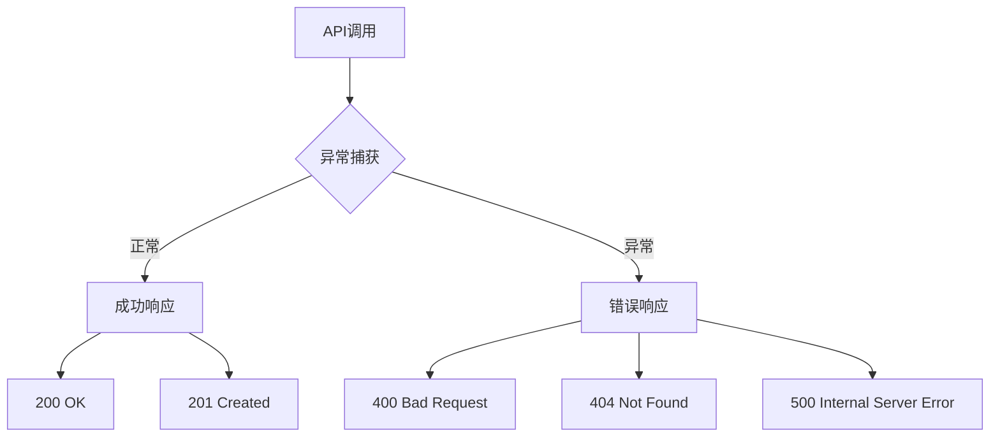

**图表来源**
- [OrderController.java](file://src/main/java/com/example/demo/controller/OrderController.java#L30-L170)

#### 响应格式标准化

所有API响应都采用统一的JSON格式：

```json
{
  "success": true,
  "message": "操作成功",
  "data": {},
  "count": 0
}
```

**章节来源**
- [OrderController.java](file://src/main/java/com/example/demo/controller/OrderController.java#L1-L173)
- [orderService.js](file://frontend/src/services/orderService.js#L1-L50)

## 数据库集成

### SQLite数据库配置

系统使用SQLite作为嵌入式数据库，通过JDBC驱动程序进行访问。

#### 数据库连接管理

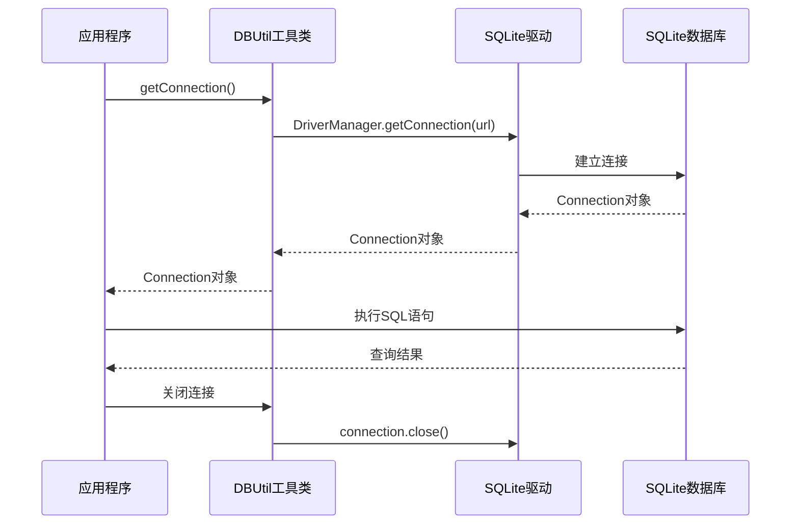

**图表来源**
- [DBUtil.java](file://src/main/java/com/example/demo/dao/DBUtil.java#L10-L18)

#### 表结构设计

```sql
CREATE TABLE IF NOT EXISTS order0713 (
    orderId TEXT PRIMARY KEY,
    userId TEXT,
    productId TEXT,
    quantity INTEGER,
    totalAmount TEXT,
    status INTEGER,
    createTime TEXT,
    payTime TEXT,
    updateTime TEXT
);
```

#### 数据持久化策略

1. **内存优先**：所有操作首先在内存中执行
2. **批量同步**：定期将内存数据批量写入数据库
3. **事务保证**：使用PreparedStatement确保数据完整性
4. **错误恢复**：操作失败时保持数据一致性

**章节来源**
- [DBUtil.java](file://src/main/java/com/example/demo/dao/DBUtil.java#L1-L19)
- [OrderDAO.java](file://src/main/java/com/example/demo/dao/OrderDAO.java#L20-L80)

## 前后端通信机制

### 跨域资源共享（CORS）配置

系统通过Spring Boot的CORS配置支持前端跨域访问。

#### CORS配置详情

| 配置项 | 值 | 说明 |
|--------|-----|------|
| 映射路径 | /api/** | 所有API端点 |
| 允许源 | * | 允许所有域名访问 |
| 允许方法 | GET, POST, PUT, DELETE, OPTIONS | 支持的HTTP方法 |
| 允许头 | * | 允许所有请求头 |
| 最大预检时间 | 3600秒 | 预检请求缓存时间 |

#### 通信协议

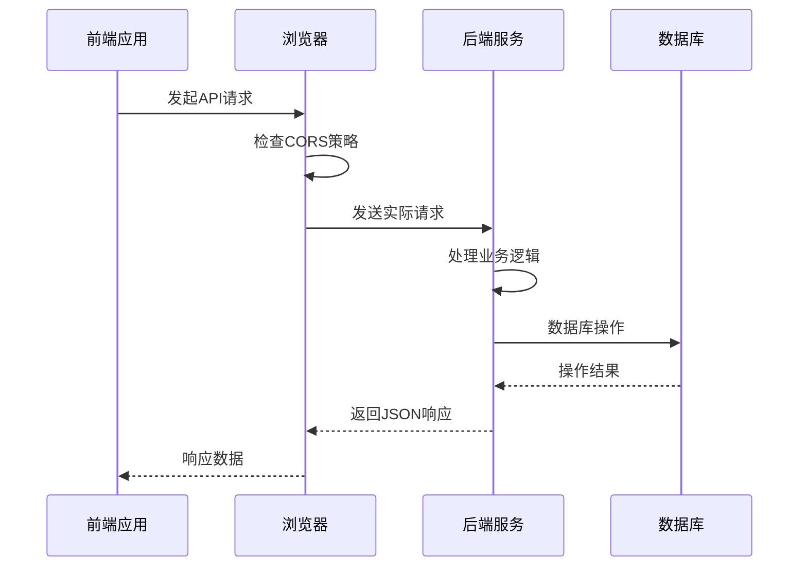

**图表来源**
- [WebConfig.java](file://src/main/java/com/example/demo/config/WebConfig.java#L15-L25)

**章节来源**
- [WebConfig.java](file://src/main/java/com/example/demo/config/WebConfig.java#L1-L28)

## 业务流程分析

### 订单生命周期管理

系统实现了完整的订单生命周期管理，支持多种业务场景。

#### 订单创建流程

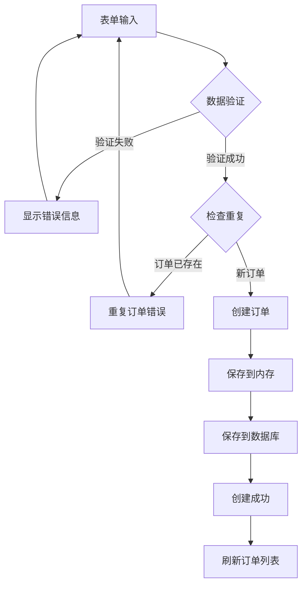

**图表来源**
- [App.js](file://frontend/src/App.js#L80-L100)
- [OrderController.java](file://src/main/java/com/example/demo/controller/OrderController.java#L30-L60)

#### 状态流转业务规则

| 当前状态 | 可执行操作 | 新状态 | 限制条件 |
|----------|------------|--------|----------|
| 待支付 | 支付 | 已支付 | 设置支付时间 |
| 已支付 | 发货 | 已发货 | 无 |
| 已发货 | 完成 | 已完成 | 无 |
| 待支付 | 取消 | 已取消 | 无 |
| 已支付 | 取消 | 已取消 | 无 |
| 已发货 | 取消 | 已取消 | 无 |
| 已完成 | - | 已完成 | 不允许修改 |
| 已取消 | - | 已取消 | 不允许修改 |

#### 订单查询功能

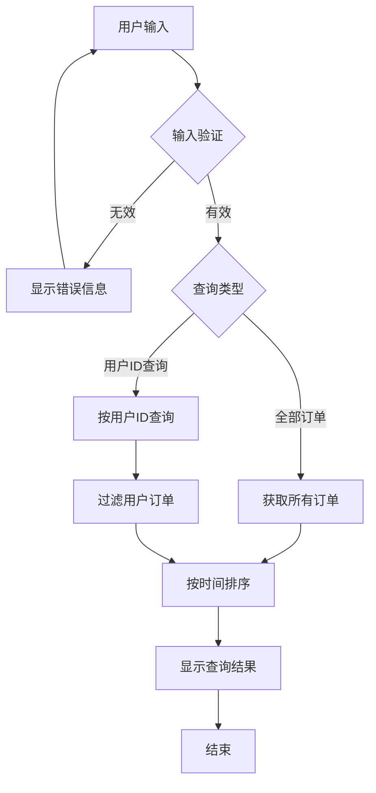

**图表来源**
- [App.js](file://frontend/src/App.js#L120-L150)

**章节来源**
- [App.js](file://frontend/src/App.js#L1-L394)
- [OrderService.java](file://src/main/java/com/example/demo/service/OrderService.java#L40-L90)

## 测试策略

### 单元测试覆盖

系统采用JUnit 5和Mockito进行全面的单元测试。

#### 测试架构

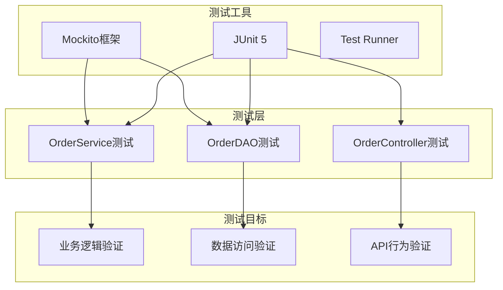

**图表来源**
- [OrderServiceTest.java](file://src/test/java/com/example/demo/service/OrderServiceTest.java#L20-L50)
- [OrderDAOTest.java](file://src/test/java/com/example/demo/dao/OrderDAOTest.java#L15-L40)

#### 核心测试场景

| 测试类别 | 测试方法 | 验证内容 | Mock对象 |
|----------|----------|----------|----------|
| 订单创建 | testCreateOrder_ValidOrder_ReturnsTrue | 正常创建订单 | OrderDAO |
| 订单创建 | testCreateOrder_QuantityLessThanOrEqualToZero_ThrowsException | 数量验证 | 无 |
| 订单查询 | testGetOrdersByUserId_ValidUserId_ReturnsOrderList | 用户订单查询 | OrderDAO |
| 订单查询 | testGetOrdersByUserId_NullUserId_ThrowsException | 参数验证 | 无 |
| 订单更新 | testUpdateOrder_ValidOrder_ReturnsTrue | 状态更新 | OrderDAO |
| 订单删除 | testDeleteOrder_WhenOrderExists_ReturnsTrue | 删除操作 | OrderDAO |

#### 测试数据准备

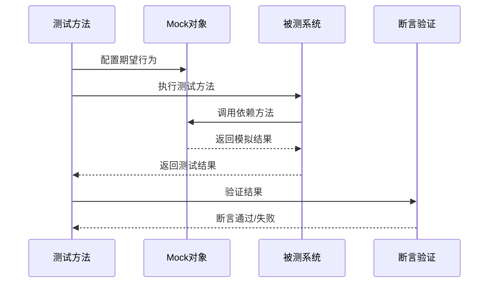

**图表来源**
- [OrderServiceTest.java](file://src/test/java/com/example/demo/service/OrderServiceTest.java#L40-L80)

**章节来源**
- [OrderServiceTest.java](file://src/test/java/com/example/demo/service/OrderServiceTest.java#L1-L222)
- [OrderDAOTest.java](file://src/test/java/com/example/demo/dao/OrderDAOTest.java#L1-L188)

## 部署与配置

### 项目构建配置

系统使用Maven进行项目构建和依赖管理。

#### Maven配置要点

| 配置项 | 值 | 说明 |
|--------|-----|------|
| JDK版本 | 1.8 | 编译和运行环境 |
| Spring Boot版本 | 2.7.14 | Web框架版本 |
| SQLite JDBC | 3.36.0.3 | 数据库驱动 |
| JUnit 5 | 5.8.1 | 单元测试框架 |
| Mockito | 4.6.1 | Mock测试框架 |

#### 前端构建配置

| 配置项 | 值 | 说明 |
|--------|-----|------|
| React版本 | 19.2.0 | 前端框架 |
| Axios版本 | 1.13.2 | HTTP客户端 |
| 开发端口 | 3000 | 前端开发服务器 |
| 后端端口 | 8080 | Spring Boot服务器 |

### 运行环境要求

1. **Java环境**：JDK 1.8或更高版本
2. **Node.js环境**：用于前端开发和构建
3. **SQLite环境**：自动包含在项目中
4. **Maven环境**：用于后端项目构建

**章节来源**
- [pom.xml](file://pom.xml#L1-L78)
- [package.json](file://frontend/package.json#L1-L41)

## 性能优化建议

### 内存优化策略

1. **并发安全**：使用ConcurrentHashMap确保多线程安全
2. **批量操作**：批量写入减少数据库I/O次数
3. **缓存策略**：内存优先的读取策略
4. **垃圾回收**：及时清理不再使用的对象

### 数据库优化

1. **索引设计**：为userId字段建立索引提高查询效率
2. **批量处理**：使用PreparedStatement批量插入
3. **连接池**：合理配置数据库连接池
4. **事务管理**：确保数据一致性

### 前端性能优化

1. **状态管理**：合理使用React状态避免不必要的重渲染
2. **API调用**：合并频繁的API请求
3. **错误处理**：及时清理错误状态
4. **用户体验**：加载状态提示和防重复提交

## 故障排除指南

### 常见问题及解决方案

#### 后端连接问题

**症状**：前端显示"无法连接到后端服务"
**原因**：Spring Boot服务未启动或端口冲突
**解决方案**：
1. 检查后端服务是否正常启动
2. 验证8080端口是否被占用
3. 查看后端日志输出

#### 数据库连接问题

**症状**：订单操作失败，数据库相关错误
**原因**：SQLite数据库文件损坏或权限问题
**解决方案**：
1. 检查test.db文件是否存在
2. 验证文件读写权限
3. 重启应用程序重新初始化数据库

#### 前后端通信问题

**症状**：API调用失败，CORS错误
**原因**：跨域配置不正确或防火墙阻止
**解决方案**：
1. 检查WebConfig中的CORS配置
2. 验证网络连接和防火墙设置
3. 使用浏览器开发者工具查看详细错误

#### 数据一致性问题

**症状**：内存数据与数据库数据不一致
**原因**：批量写入失败或数据同步延迟
**解决方案**：
1. 检查saveToDatabase方法的执行情况
2. 验证数据库连接状态
3. 实现数据校验机制

### 调试技巧

1. **日志记录**：启用详细日志输出
2. **断点调试**：在关键位置设置断点
3. **单元测试**：编写针对性的测试用例
4. **监控工具**：使用性能监控工具

**章节来源**
- [OrderController.java](file://src/main/java/com/example/demo/controller/OrderController.java#L160-L173)
- [OrderDAO.java](file://src/main/java/com/example/demo/dao/OrderDAO.java#L40-L80)

## 总结

订单管理系统采用现代化的前后端分离架构，通过Spring Boot和React技术栈实现了完整的订单管理功能。系统具有以下特点：

### 技术优势

1. **架构清晰**：分层架构便于维护和扩展
2. **数据安全**：内存+数据库的双重保障
3. **性能优异**：批量操作和缓存机制
4. **易于测试**：完善的单元测试覆盖
5. **开发友好**：标准化的API设计

### 应用价值

1. **业务完整**：涵盖订单生命周期的各个环节
2. **用户体验**：直观的界面和流畅的操作体验
3. **可扩展性**：模块化设计支持功能扩展
4. **可靠性**：多重验证和错误处理机制

该系统为企业级订单管理提供了可靠的技术解决方案，具备良好的稳定性和可维护性。