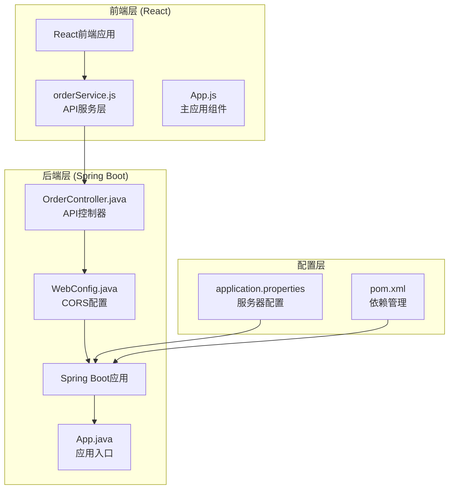
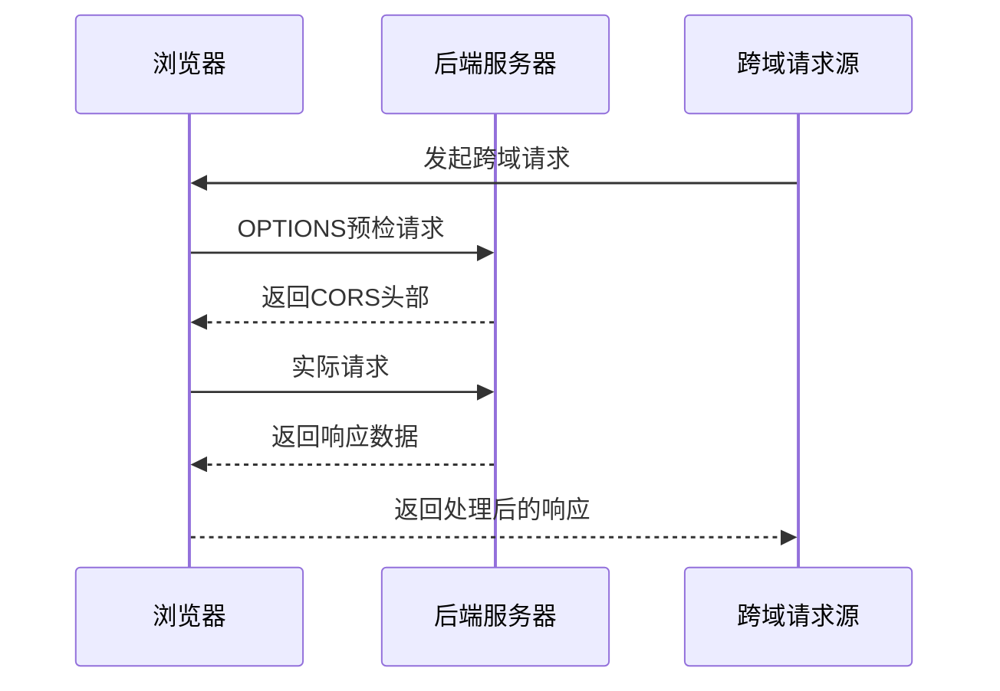
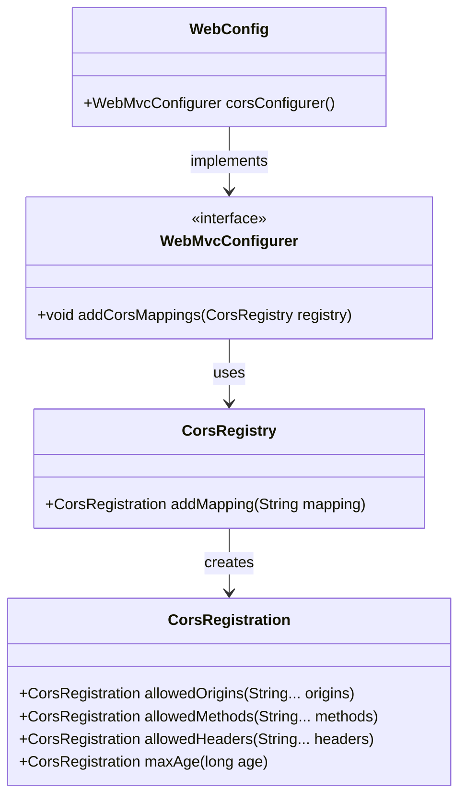
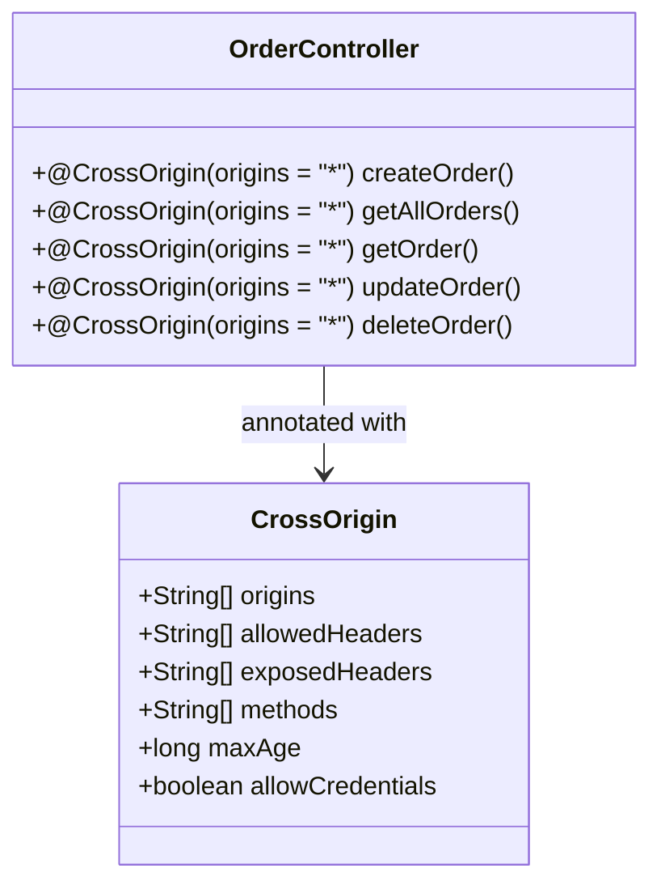
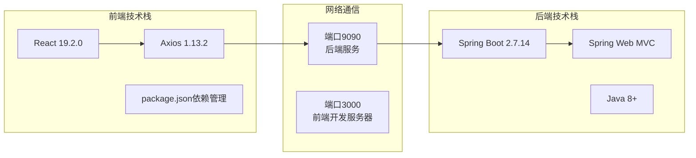
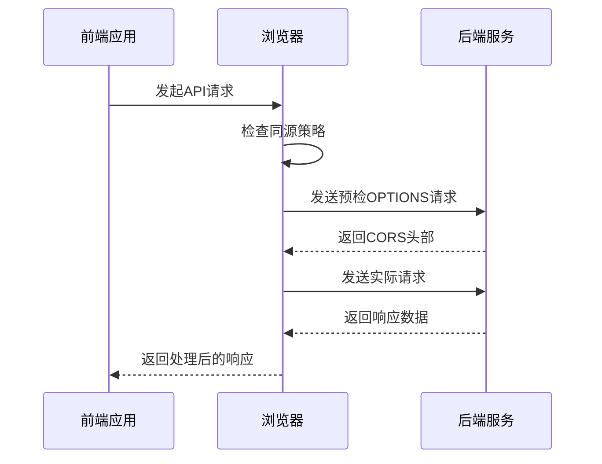
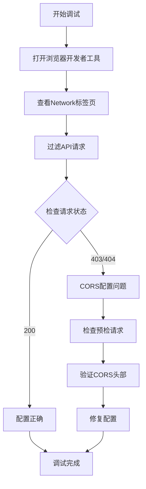

# CORS跨域配置说明

<cite>
**本文档中引用的文件**
- [WebConfig.java](file://src/main/java/com/example/demo/config/WebConfig.java)
- [OrderController.java](file://src/main/java/com/example/demo/controller/OrderController.java)
- [orderService.js](file://frontend/src/services/orderService.js)
- [App.java](file://src/main/java/com/example/demo/App.java)
- [application.properties](file://src/main/resources/application.properties)
- [pom.xml](file://pom.xml)
- [package.json](file://frontend/package.json)
- [App.js](file://frontend/src/App.js)
</cite>

## 目录
1. [简介](#简介)
2. [项目架构概览](#项目架构概览)
3. [CORS配置实现原理](#cors配置实现原理)
4. [WebConfig.java详细分析](#webconfigjava详细分析)
5. [@CrossOrigin注解使用](#crossorigin注解使用)
6. [CORS参数详解](#cors参数详解)
7. [前后端分离架构中的CORS需求](#前后端分离架构中的cors需求)
8. [调试跨域问题的方法](#调试跨域问题的方法)
9. [最佳实践与安全考虑](#最佳实践与安全考虑)
10. [总结](#总结)

## 简介

跨域资源共享（CORS，Cross-Origin Resource Sharing）是现代Web开发中不可或缺的安全机制。在本项目中，我们通过Spring Boot框架实现了完整的CORS配置，支持前端React应用与后端API之间的跨域通信。

本文档将深入解析项目中的CORS配置实现，包括技术原理、具体配置、调试方法以及最佳实践，帮助开发者理解和解决跨域问题。

## 项目架构概览

本项目采用典型的前后端分离架构，包含以下核心组件：



**图表来源**
- [WebConfig.java](file://src/main/java/com/example/demo/config/WebConfig.java#L1-L28)
- [OrderController.java](file://src/main/java/com/example/demo/controller/OrderController.java#L1-L173)
- [orderService.js](file://frontend/src/services/orderService.js#L1-L49)

**章节来源**
- [WebConfig.java](file://src/main/java/com/example/demo/config/WebConfig.java#L1-L28)
- [OrderController.java](file://src/main/java/com/example/demo/controller/OrderController.java#L1-L173)
- [App.java](file://src/main/java/com/example/demo/App.java#L1-L24)

## CORS配置实现原理

### 浏览器同源策略

浏览器出于安全考虑实施同源策略，限制不同源之间的资源访问。同源定义为：协议、域名、端口三者完全相同。

### CORS工作机制

CORS通过HTTP头部协商实现跨域访问控制：



**图表来源**
- [WebConfig.java](file://src/main/java/com/example/demo/config/WebConfig.java#L18-L24)

### Spring Boot CORS实现

Spring Boot提供了两种CORS配置方式：

1. **全局配置**：通过WebMvcConfigurer接口
2. **局部配置**：通过@CrossOrigin注解

## WebConfig.java详细分析

### 配置类结构

WebConfig类是一个标准的Spring配置类，负责全局CORS配置：



**图表来源**
- [WebConfig.java](file://src/main/java/com/example/demo/config/WebConfig.java#L14-L26)

### 关键配置解析

#### 1. 映射路径配置
```java
registry.addMapping("/api/**")
```
- 匹配所有以`/api/`开头的URL路径
- 支持通配符匹配，适用于RESTful API设计

#### 2. 允许的源配置
```java
.allowedOrigins("*")
```
- 使用通配符`*`表示允许所有源
- 生产环境中建议指定具体的可信域名

#### 3. 允许的HTTP方法
```java
.allowedMethods("GET", "POST", "PUT", "DELETE", "OPTIONS")
```
- 支持常见的HTTP方法
- 包含`OPTIONS`方法用于预检请求

#### 4. 允许的头部
```java
.allowedHeaders("*")
```
- 允许所有自定义头部
- 可根据需要限制特定头部

#### 5. 预检请求缓存
```java
.maxAge(3600)
```
- 缓存预检请求结果1小时
- 减少重复的预检请求次数

**章节来源**
- [WebConfig.java](file://src/main/java/com/example/demo/config/WebConfig.java#L18-L24)

## @CrossOrigin注解使用

### 局部配置方式

除了全局配置，还可以在控制器级别使用@CrossOrigin注解：



**图表来源**
- [OrderController.java](file://src/main/java/com/example/demo/controller/OrderController.java#L20-L20)

### 注解配置特点

1. **精确控制**：可以针对特定方法或类进行配置
2. **灵活定制**：支持更细粒度的权限控制
3. **优先级**：局部配置优先于全局配置

**章节来源**
- [OrderController.java](file://src/main/java/com/example/demo/controller/OrderController.java#L20-L20)

## CORS参数详解

### allowedOrigins参数

| 参数值 | 说明 | 安全性 | 使用场景 |
|--------|------|--------|----------|
| `"*"` | 允许所有源 | 较低 | 开发环境、内部系统 |
| `"http://localhost:3000"` | 允许特定本地开发环境 | 中等 | 本地开发调试 |
| `"https://example.com"` | 允许生产域名 | 高 | 正式上线环境 |
| `{"http://localhost:3000", "https://staging.example.com"}` | 多个可信源 | 高 | 多环境部署 |

### allowedMethods参数

| 方法类型 | 用途 | 安全考虑 |
|----------|------|----------|
| `GET` | 数据查询、获取 | 无风险 |
| `POST` | 数据创建 | 需验证数据有效性 |
| `PUT` | 数据更新 | 需验证权限和数据完整性 |
| `DELETE` | 数据删除 | 最高风险，需严格验证 |
| `OPTIONS` | 预检请求 | 必须支持 |

### allowedHeaders参数

| 头部类型 | 说明 | 安全影响 |
|----------|------|----------|
| `"*"` | 所有头部 | 可能暴露敏感信息 |
| `"Content-Type"` | 内容类型 | 基本安全 |
| `"Authorization"` | 认证信息 | 需配合认证机制 |
| `"X-Requested-With"` | AJAX请求标识 | 一般安全 |

### maxAge参数

- **单位**：秒
- **默认值**：不缓存预检结果
- **推荐值**：
  - 开发环境：3600秒（1小时）
  - 生产环境：86400秒（24小时）
  - 高频变更：1800秒（30分钟）

**章节来源**
- [WebConfig.java](file://src/main/java/com/example/demo/config/WebConfig.java#L20-L23)

## 前后端分离架构中的CORS需求

### 架构模式分析



**图表来源**
- [pom.xml](file://pom.xml#L1-L136)
- [package.json](file://frontend/package.json#L1-L41)
- [application.properties](file://src/main/resources/application.properties#L1-L5)

### 具体需求场景

#### 1. 开发环境跨域
- **前端地址**：`http://localhost:3000`
- **后端地址**：`http://localhost:9090`
- **跨域原因**：端口不同导致的跨域

#### 2. API调用示例
前端通过orderService.js发起API请求：

```javascript
// API基础配置
const API_BASE_URL = 'http://localhost:9090/api';

// 创建订单请求
api.post('/orders', orderData);

// 获取订单列表
api.get('/orders');

// 更新订单状态
api.put(`/orders/${orderId}`, orderData);
```

#### 3. 请求流程分析



**图表来源**
- [orderService.js](file://frontend/src/services/orderService.js#L3-L10)
- [WebConfig.java](file://src/main/java/com/example/demo/config/WebConfig.java#L19-L24)

**章节来源**
- [orderService.js](file://frontend/src/services/orderService.js#L1-L49)
- [application.properties](file://src/main/resources/application.properties#L1-L5)

## 调试跨域问题的方法

### 常见错误类型

#### 1. 预检失败
```
Access to XMLHttpRequest at 'http://localhost:9090/api/orders' 
from origin 'http://localhost:3000' has been blocked by CORS policy
```

#### 2. 头部不匹配
```
Response to preflight request doesn't pass access control check
```

#### 3. 方法不支持
```
Method POST is not allowed by Access-Control-Allow-Methods
```

### 调试步骤

#### 1. 浏览器开发者工具检查



#### 2. 后端日志排查

##### 关键日志点
- **请求拦截器日志**：记录所有进入的请求
- **CORS处理器日志**：记录CORS决策过程
- **异常日志**：记录CORS相关的异常

##### 日志配置示例
```properties
# application.properties中的日志配置
logging.level.org.springframework.web.filter=DEBUG
logging.level.org.springframework.web.cors=DEBUG
```

#### 3. 临时解决方案

在开发阶段，可以通过以下方式临时解决问题：

```java
// 临时放宽CORS配置
.allowedOrigins("http://localhost:3000", "http://localhost:9090")
.allowedMethods("GET", "POST", "PUT", "DELETE", "OPTIONS")
.allowedHeaders("*")
.allowCredentials(true)
```

#### 4. 网络抓包分析

使用工具如Wireshark或Fiddler捕获HTTP流量，分析CORS头部的完整交互过程。

### 调试工具推荐

| 工具类型 | 推荐工具 | 用途 | 特点 |
|----------|----------|------|------|
| 浏览器扩展 | CORS插件 | 突破CORS限制 | 开发调试专用 |
| 在线工具 | Postman/Curl | API测试 | 不受浏览器限制 |
| 开发工具 | VS Code Live Server | 本地开发 | 自动刷新功能 |
| 网络分析 | Charles Proxy | 流量监控 | 详细的请求分析 |

**章节来源**
- [WebConfig.java](file://src/main/java/com/example/demo/config/WebConfig.java#L18-L24)

## 最佳实践与安全考虑

### 生产环境配置原则

#### 1. 最小权限原则
```java
// 生产环境推荐配置
.allowedOrigins("https://yourdomain.com", "https://app.yourdomain.com")
.allowedMethods("GET", "POST")
.allowedHeaders("Content-Type", "Authorization")
.maxAge(1800)
```

#### 2. 安全头部配置
```java
// 结合安全头部增强安全性
@CrossOrigin(
    origins = "https://yourdomain.com",
    allowedHeaders = {"Content-Type", "Authorization"},
    allowCredentials = true
)
```

#### 3. 环境区分配置
```java
@Configuration
public class WebConfig {
    
    @Bean
    public WebMvcConfigurer corsConfigurer(Environment env) {
        return new WebMvcConfigurer() {
            @Override
            public void addCorsMappings(CorsRegistry registry) {
                if ("prod".equals(env.getActiveProfiles()[0])) {
                    // 生产环境严格配置
                    registry.addMapping("/api/**")
                        .allowedOrigins("https://yourdomain.com")
                        .allowedMethods("GET", "POST")
                        .allowedHeaders("Content-Type")
                        .maxAge(1800);
                } else {
                    // 开发环境宽松配置
                    registry.addMapping("/api/**")
                        .allowedOrigins("*")
                        .allowedMethods("GET", "POST", "PUT", "DELETE", "OPTIONS")
                        .allowedHeaders("*")
                        .maxAge(3600);
                }
            }
        };
    }
}
```

### 性能优化建议

#### 1. 预检请求缓存
- 合理设置`maxAge`参数
- 避免频繁变更CORS配置

#### 2. 头部精简
- 只允许必要的HTTP头部
- 避免暴露敏感信息

#### 3. 方法限制
- 根据业务需求限制HTTP方法
- 避免开放不必要的修改方法

### 监控与维护

#### 1. 日志监控
```java
@Component
public class CorsLoggingInterceptor implements HandlerInterceptor {
    
    @Override
    public boolean preHandle(HttpServletRequest request, HttpServletResponse response, Object handler) {
        log.info("CORS Request: {} from {}", 
                request.getRequestURI(), 
                request.getHeader("Origin"));
        return true;
    }
}
```

#### 2. 异常处理
```java
@RestControllerAdvice
public class CorsExceptionHandler {
    
    @ExceptionHandler(CorsConfigurationException.class)
    public ResponseEntity<Object> handleCorsError(CorsConfigurationException ex) {
        log.error("CORS Configuration Error: {}", ex.getMessage());
        return ResponseEntity.status(HttpStatus.FORBIDDEN)
                .body(Map.of("error", "CORS configuration error"));
    }
}
```

## 总结

本项目通过WebConfig.java实现了完整的CORS配置，支持前后端分离架构下的跨域通信。关键特性包括：

### 技术亮点
1. **全局配置**：通过WebMvcConfigurer实现统一的CORS管理
2. **灵活控制**：支持精确的路径、方法和头部控制
3. **开发友好**：在开发环境中提供宽松的配置选项

### 安全考虑
1. **最小权限**：生产环境采用严格的源和方法限制
2. **头部安全**：避免暴露不必要的HTTP头部信息
3. **缓存策略**：合理设置预检请求缓存时间

### 调试能力
1. **多渠道诊断**：浏览器开发者工具、后端日志、网络抓包
2. **环境区分**：开发与生产环境的不同配置策略
3. **临时解决方案**：便于开发调试的临时配置选项

通过本文档的详细解析，开发者可以深入理解CORS的工作原理，掌握配置技巧，并能够有效解决跨域问题，确保系统的安全性和稳定性。