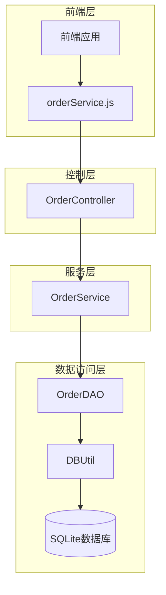
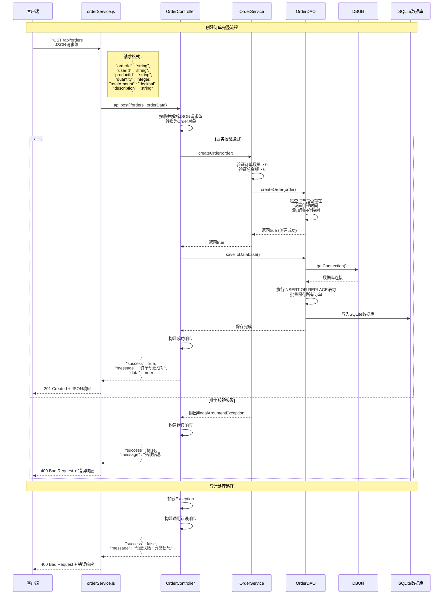
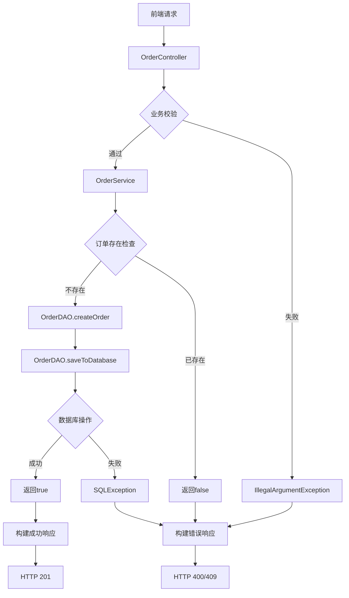

# 创建订单时序图

<cite>
**本文档中引用的文件**
- [orderService.js](file://frontend/src/services/orderService.js)
- [OrderController.java](file://src/main/java/com/example/demo/controller/OrderController.java)
- [OrderService.java](file://src/main/java/com/example/demo/service/OrderService.java)
- [OrderDAO.java](file://src/main/java/com/example/demo/dao/OrderDAO.java)
- [DBUtil.java](file://src/main/java/com/example/demo/dao/DBUtil.java)
- [Order.java](file://src/main/java/com/example/demo/entity/Order.java)
- [OrderControllerIT.java](file://src/test/java/com/example/demo/controller/OrderControllerIT.java)
</cite>

## 目录
1. [系统概述](#系统概述)
2. [时序图概览](#时序图概览)
3. [详细时序分析](#详细时序分析)
4. [数据结构说明](#数据结构说明)
5. [异常处理机制](#异常处理机制)
6. [性能考虑](#性能考虑)
7. [故障排除指南](#故障排除指南)
8. [总结](#总结)

## 系统概述

本系统是一个基于Spring Boot的订单管理系统，采用前后端分离架构。前端使用React框架，后端提供RESTful API服务，数据持久化使用SQLite数据库。系统实现了完整的订单生命周期管理功能。



**图表来源**
- [orderService.js](file://frontend/src/services/orderService.js#L1-L49)
- [OrderController.java](file://src/main/java/com/example/demo/controller/OrderController.java#L1-L173)
- [OrderService.java](file://src/main/java/com/example/demo/service/OrderService.java#L1-L114)
- [OrderDAO.java](file://src/main/java/com/example/demo/dao/OrderDAO.java#L1-L248)
- [DBUtil.java](file://src/main/java/com/example/demo/dao/DBUtil.java#L1-L19)

## 时序图概览

以下是创建订单操作的完整时序图，展示了从客户端发起请求到数据最终落库的全过程：



**图表来源**
- [orderService.js](file://frontend/src/services/orderService.js#L14-L16)
- [OrderController.java](file://src/main/java/com/example/demo/controller/OrderController.java#L36-L56)
- [OrderService.java](file://src/main/java/com/example/demo/service/OrderService.java#L28-L38)
- [OrderDAO.java](file://src/main/java/com/example/demo/dao/OrderDAO.java#L165-L175)

## 详细时序分析

### 第一阶段：前端请求处理

#### 1.1 客户端发起请求
客户端通过`orderService.js`中的`createOrder`方法发送POST请求：

**节来源**
- [orderService.js](file://frontend/src/services/orderService.js#L14-L16)

请求包含以下JSON格式的数据：
- `orderId`: 订单唯一标识符
- `userId`: 用户ID  
- `productId`: 商品ID
- `quantity`: 购买数量（必须>0）
- `totalAmount`: 订单总金额（必须>0）
- `description`: 订单描述信息

#### 1.2 Axios配置
前端使用Axios库进行HTTP通信，配置包括：
- 基础URL：`http://localhost:9090/api`
- Content-Type：`application/json`
- 自动处理JSON序列化

### 第二阶段：后端控制器处理

#### 2.1 控制器接收请求
`OrderController`的`createOrder`方法处理POST请求：

**节来源**
- [OrderController.java](file://src/main/java/com/example/demo/controller/OrderController.java#L36-L56)

控制器执行以下步骤：
1. **请求解析**：Spring MVC自动将JSON请求体转换为`Order`对象
2. **业务调用**：调用`OrderService.createOrder()`方法
3. **数据库保存**：调用`OrderDAO.saveToDatabase()`方法
4. **响应构建**：根据业务结果构建适当的HTTP响应

#### 2.2 异常处理机制
控制器实现了三层异常处理：
- **业务异常**：订单已存在时返回409 Conflict
- **参数异常**：业务校验失败时返回400 Bad Request
- **系统异常**：捕获所有未处理异常，返回400 Bad Request

### 第三阶段：业务服务层处理

#### 3.1 业务校验逻辑
`OrderService.createOrder()`方法执行核心业务校验：

**节来源**
- [OrderService.java](file://src/main/java/com/example/demo/service/OrderService.java#L28-L38)

校验规则：
1. **数量校验**：`quantity > 0`
2. **金额校验**：`totalAmount > 0`
3. **业务规则**：调用`OrderDAO.createOrder()`检查订单唯一性

#### 3.2 业务规则验证
如果校验失败，抛出`IllegalArgumentException`异常，包含具体的错误信息。

### 第四阶段：数据访问层处理

#### 4.1 内存存储
`OrderDAO.createOrder()`方法实现内存级别的订单存储：

**节来源**
- [OrderDAO.java](file://src/main/java/com/example/demo/dao/OrderDAO.java#L165-L175)

存储过程：
1. **存在性检查**：验证订单ID是否已存在
2. **时间设置**：设置创建时间为当前时间
3. **内存存储**：将订单对象存储到`ConcurrentHashMap`

#### 4.2 数据库持久化
`OrderDAO.saveToDatabase()`方法负责将内存数据持久化到SQLite数据库：

**节来源**
- [OrderDAO.java](file://src/main/java/com/example/demo/dao/OrderDAO.java#L51-L78)

持久化步骤：
1. **连接获取**：通过`DBUtil.getConnection()`获取数据库连接
2. **SQL准备**：准备`INSERT OR REPLACE`语句
3. **批量处理**：遍历所有订单，设置参数并添加到批处理
4. **执行保存**：执行批量插入操作

### 第五阶段：数据库操作

#### 5.1 数据库连接管理
`DBUtil`类提供统一的数据库连接管理：

**节来源**
- [DBUtil.java](file://src/main/java/com/example/demo/dao/DBUtil.java#L16-L18)

连接特性：
- 数据库文件：`test.db`（项目根目录）
- 连接方式：JDBC驱动程序
- 连接池：简单连接模式（单例）

#### 5.2 表结构设计
SQLite表结构包含以下字段：
- `orderId` (主键): 订单唯一标识
- `userId`: 用户ID
- `productId`: 商品ID
- `quantity`: 购买数量
- `totalAmount`: 总金额（文本格式存储）
- `status`: 订单状态（0-待支付）
- `description`: 订单描述
- `createTime`: 创建时间
- `payTime`: 支付时间
- `updateTime`: 更新时间

## 数据结构说明

### Order实体类结构

`Order`实体类定义了订单的核心属性：

**节来源**
- [Order.java](file://src/main/java/com/example/demo/entity/Order.java#L1-L162)

| 属性名 | 类型 | 描述 | 默认值 | 必填 |
|--------|------|------|--------|------|
| orderId | String | 订单唯一标识 | - | 是 |
| userId | String | 用户ID | - | 是 |
| productId | String | 商品ID | - | 是 |
| quantity | Integer | 购买数量 | - | 是 |
| totalAmount | BigDecimal | 订单总金额 | - | 是 |
| status | Integer | 订单状态 | 0（待支付） | 否 |
| description | String | 订单描述 | null | 否 |
| createTime | LocalDateTime | 创建时间 | 当前时间 | 否 |
| payTime | LocalDateTime | 支付时间 | null | 否 |
| updateTime | LocalDateTime | 更新时间 | null | 否 |

### 订单状态枚举
- **0**: 待支付
- **1**: 已支付
- **2**: 已发货
- **3**: 已完成
- **4**: 已取消

### 响应格式结构

#### 成功响应
```json
{
  "success": true,
  "message": "订单创建成功",
  "data": {
    "orderId": "string",
    "userId": "string", 
    "productId": "string",
    "quantity": integer,
    "totalAmount": "decimal",
    "status": 0,
    "description": "string",
    "createTime": "2024-01-01T12:00:00.000",
    "payTime": null,
    "updateTime": null
  }
}
```

#### 错误响应
```json
{
  "success": false,
  "message": "错误信息描述"
}
```

## 异常处理机制

### 业务异常类型

#### 1. 数量校验异常
当订单数量≤0时抛出：
- **异常类型**：`IllegalArgumentException`
- **错误信息**："购买数量必须大于0"
- **HTTP状态码**：400 Bad Request

#### 2. 金额校验异常  
当订单金额≤0时抛出：
- **异常类型**：`IllegalArgumentException`
- **错误信息**："订单金额必须大于0"
- **HTTP状态码**：400 Bad Request

#### 3. 订单重复异常
当订单ID已存在时：
- **HTTP状态码**：409 Conflict
- **错误信息**："订单已存在"

### 系统异常处理

#### 1. 数据库异常
- **异常类型**：`SQLException`
- **处理方式**：捕获并记录日志，返回通用错误信息
- **HTTP状态码**：400 Bad Request

#### 2. 通用异常处理
- **异常类型**：`Exception`
- **处理方式**：捕获所有未处理异常
- **错误信息**："创建失败: 异常信息"
- **HTTP状态码**：400 Bad Request

### 异常传播路径



**图表来源**
- [OrderController.java](file://src/main/java/com/example/demo/controller/OrderController.java#L38-L56)
- [OrderService.java](file://src/main/java/com/example/demo/service/OrderService.java#L30-L35)
- [OrderDAO.java](file://src/main/java/com/example/demo/dao/OrderDAO.java#L166-L175)

## 性能考虑

### 内存优化策略

#### 1. 并发安全的内存存储
- 使用`ConcurrentHashMap`确保多线程安全
- 支持高并发读写操作
- 自动处理线程同步问题

#### 2. 批量数据库操作
- 使用PreparedStatement批量插入
- 减少数据库连接开销
- 提高大批量数据处理效率

### 数据库性能优化

#### 1. 索引设计
- `orderId`作为主键，自动建立索引
- 查询操作利用主键索引快速定位
- 支持高效的订单检索

#### 2. 连接管理
- 单例模式管理数据库连接
- 避免频繁的连接创建销毁
- 减少连接池开销

### 缓存策略

#### 1. 内存缓存
- 订单数据优先存储在内存
- 内存访问速度远高于磁盘
- 支持实时数据查询

#### 2. 懒加载机制
- 数据库初始化时才加载现有数据
- 避免启动时的大量I/O操作
- 按需加载减少内存占用

## 故障排除指南

### 常见问题诊断

#### 1. 订单创建失败
**症状**：收到400 Bad Request响应
**可能原因**：
- 订单数量≤0
- 订单金额≤0
- 订单ID已存在
- 数据库连接失败

**排查步骤**：
1. 检查请求JSON格式是否正确
2. 验证数量和金额字段值
3. 确认订单ID唯一性
4. 查看服务器日志

#### 2. 数据不一致
**症状**：内存数据与数据库不一致
**可能原因**：
- `saveToDatabase()`方法未正确执行
- 数据库事务未提交
- 并发写入冲突

**排查步骤**：
1. 检查`OrderDAO.saveToDatabase()`调用
2. 验证数据库连接状态
3. 查看批量操作执行情况

#### 3. 性能问题
**症状**：订单创建响应缓慢
**可能原因**：
- 大量订单导致内存压力
- 数据库连接池耗尽
- 批量操作效率低

**优化建议**：
1. 实现分页批量处理
2. 增加数据库连接池大小
3. 定期清理过期订单

### 调试技巧

#### 1. 日志分析
启用详细日志记录：
```properties
logging.level.com.example.demo=DEBUG
```

#### 2. 数据库监控
监控SQLite数据库文件大小和访问频率。

#### 3. 性能指标
跟踪以下指标：
- 订单创建平均响应时间
- 内存使用率
- 数据库连接池状态

**节来源**
- [application.properties](file://src/main/resources/application.properties#L1-L5)

## 总结

本文档详细分析了创建订单操作的完整时序流程，涵盖了从前端请求到数据库落库的每个环节。系统采用了分层架构设计，实现了良好的职责分离：

### 架构优势
1. **清晰的分层**：前端、控制器、服务层、数据访问层各司其职
2. **强类型校验**：Java类型系统确保数据完整性
3. **完善的异常处理**：多层次异常捕获和响应
4. **内存+持久化结合**：兼顾性能和数据持久性

### 关键技术要点
1. **Spring Boot集成**：简化了Web应用开发
2. **SQLite轻量级**：适合小型应用场景
3. **并发安全**：支持高并发访问
4. **RESTful API**：标准化的接口设计

### 最佳实践
1. **输入验证**：在业务层进行严格的参数校验
2. **异常隔离**：不同类型的异常采用不同的处理策略
3. **性能优化**：批量操作和内存缓存提升效率
4. **可维护性**：清晰的代码结构和完善的测试覆盖

通过理解这个时序图和相关实现细节，开发者可以更好地掌握系统的运行机制，为后续的功能扩展和性能优化提供基础。