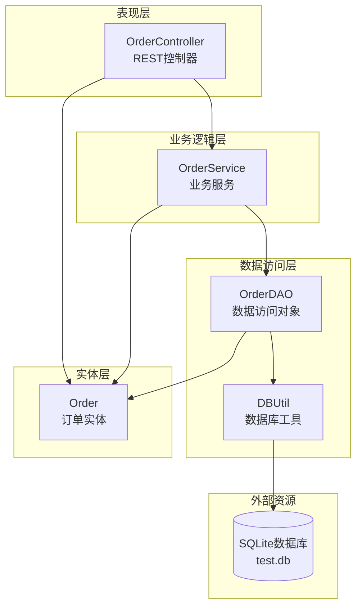
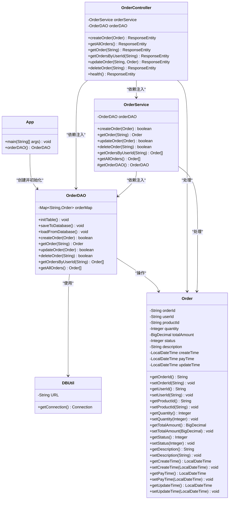
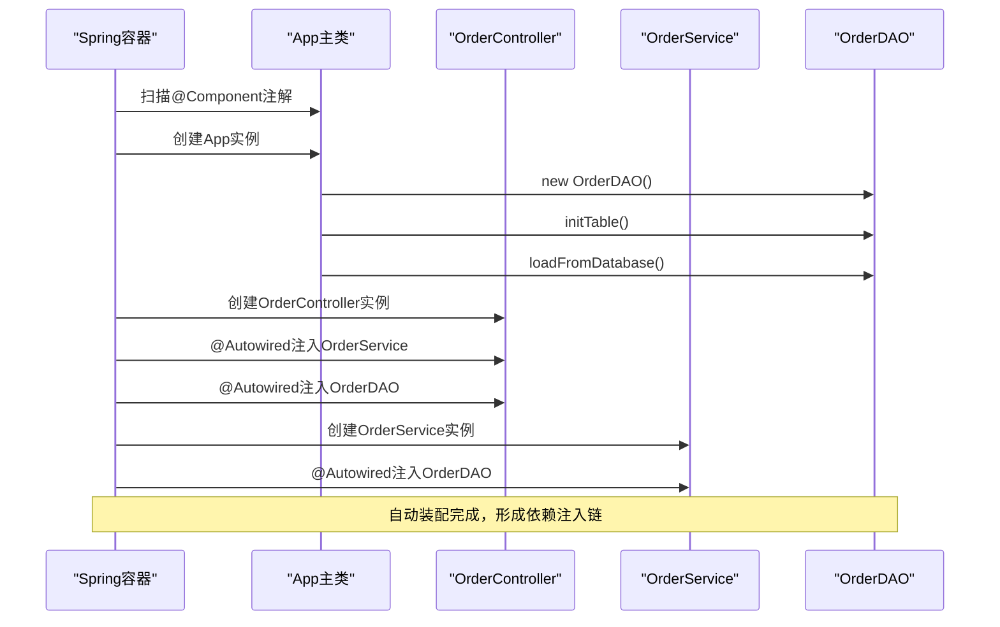
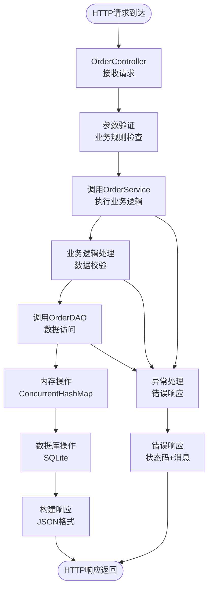
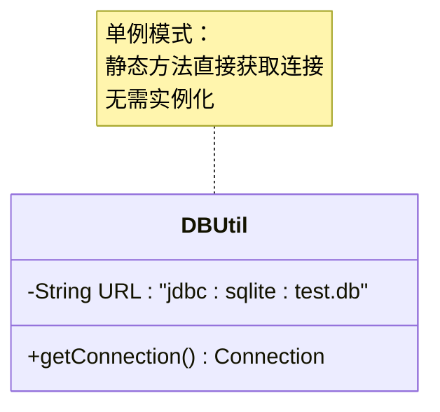
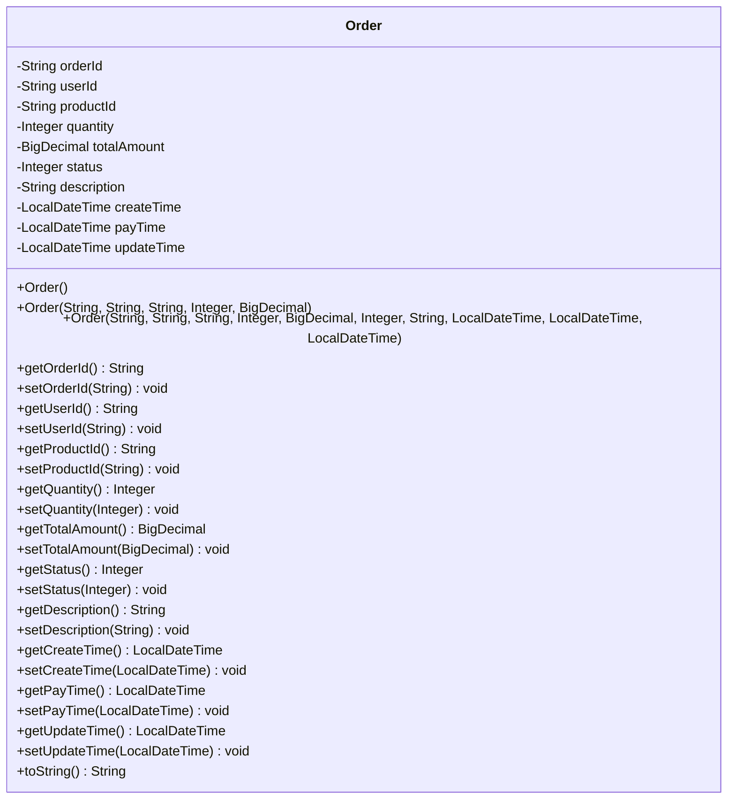

# 核心类关系图

<cite>
**本文档中引用的文件**
- [App.java](file://src/main/java/com/example/demo/App.java)
- [OrderController.java](file://src/main/java/com/example/demo/controller/OrderController.java)
- [OrderService.java](file://src/main/java/com/example/demo/service/OrderService.java)
- [OrderDAO.java](file://src/main/java/com/example/demo/dao/OrderDAO.java)
- [DBUtil.java](file://src/main/java/com/example/demo/dao/DBUtil.java)
- [Order.java](file://src/main/java/com/example/demo/entity/Order.java)
- [application.properties](file://src/main/resources/application.properties)
- [pom.xml](file://pom.xml)
</cite>

## 目录
1. [项目概述](#项目概述)
2. [系统架构概览](#系统架构概览)
3. [核心类UML类图](#核心类uml类图)
4. [Spring框架依赖注入机制](#spring框架依赖注入机制)
5. [数据流向分析](#数据流向分析)
6. [关键注解详解](#关键注解详解)
7. [数据库连接管理](#数据库连接管理)
8. [实体类设计](#实体类设计)
9. [总结](#总结)

## 项目概述

本项目是一个基于Spring Boot的订单管理系统，采用经典的三层架构模式：表现层（Controller）、业务逻辑层（Service）和数据访问层（DAO）。系统实现了完整的RESTful API接口，支持订单的增删改查操作，并集成了SQLite数据库进行持久化存储。

## 系统架构概览

**图表来源**
- [OrderController.java](file://src/main/java/com/example/demo/controller/OrderController.java#L18-L30)
- [OrderService.java](file://src/main/java/com/example/demo/service/OrderService.java#L13-L21)
- [OrderDAO.java](file://src/main/java/com/example/demo/dao/OrderDAO.java#L18-L21)
- [DBUtil.java](file://src/main/java/com/example/demo/dao/DBUtil.java#L9-L18)

## 核心类UML类图

### 完整类关系图

**图表来源**
- [App.java](file://src/main/java/com/example/demo/App.java#L11-L24)
- [OrderController.java](file://src/main/java/com/example/demo/controller/OrderController.java#L18-L30)
- [OrderService.java](file://src/main/java/com/example/demo/service/OrderService.java#L13-L21)
- [OrderDAO.java](file://src/main/java/com/example/demo/dao/OrderDAO.java#L18-L21)
- [DBUtil.java](file://src/main/java/com/example/demo/dao/DBUtil.java#L9-L18)
- [Order.java](file://src/main/java/com/example/demo/entity/Order.java#L9-L162)

## Spring框架依赖注入机制

### @Autowired注解的工作原理

Spring框架通过`@Autowired`注解实现自动依赖注入，形成以下调用链：

**图表来源**
- [App.java](file://src/main/java/com/example/demo/App.java#L18-L23)
- [OrderController.java](file://src/main/java/com/example/demo/controller/OrderController.java#L26-L29)
- [OrderService.java](file://src/main/java/com/example/demo/service/OrderService.java#L18-L20)

### 依赖注入的具体实现

1. **App主类中的@Bean方法**
   - [`App.java`](file://src/main/java/com/example/demo/App.java#L18-L23) 中的 `orderDAO()` 方法使用 `@Bean` 注解，Spring会自动管理其生命周期

2. **构造器注入**
   - [`OrderController.java`](file://src/main/java/com/example/demo/controller/OrderController.java#L26-L29) 使用构造器注入，确保依赖不可变性
   - [`OrderService.java`](file://src/main/java/com/example/demo/service/OrderService.java#L18-L20) 同样使用构造器注入

3. **字段注入（隐式）**
   - Spring容器自动将已创建的bean注入到需要的地方

**节来源**
- [App.java](file://src/main/java/com/example/demo/App.java#L11-L24)
- [OrderController.java](file://src/main/java/com/example/demo/controller/OrderController.java#L18-L30)
- [OrderService.java](file://src/main/java/com/example/demo/service/OrderService.java#L13-L21)

## 数据流向分析

### 请求处理流程

**图表来源**
- [OrderController.java](file://src/main/java/com/example/demo/controller/OrderController.java#L35-L55)
- [OrderService.java](file://src/main/java/com/example/demo/service/OrderService.java#L28-L47)
- [OrderDAO.java](file://src/main/java/com/example/demo/dao/OrderDAO.java#L165-L174)

### 数据传递机制

1. **Order实体类的作用**
   - 作为各层间的数据传输对象（DTO）
   - 包含订单的所有属性信息
   - 提供标准的getter/setter方法

2. **内存与数据库同步**
   - [`OrderDAO.java`](file://src/main/java/com/example/demo/dao/OrderDAO.java#L51-L77) 实现内存数据与SQLite数据库的双向同步
   - 使用`ConcurrentHashMap`保证线程安全
   - 支持批量操作提高性能

**节来源**
- [Order.java](file://src/main/java/com/example/demo/entity/Order.java#L9-L162)
- [OrderDAO.java](file://src/main/java/com/example/demo/dao/OrderDAO.java#L18-L248)

## 关键注解详解

### @SpringBootApplication注解

[`App.java`](file://src/main/java/com/example/demo/App.java#L11) 是Spring Boot应用的入口点，包含以下功能：
- `@SpringBootApplication` = `@Configuration` + `@EnableAutoConfiguration` + `@ComponentScan`
- 自动扫描同包及其子包下的组件
- 启用Spring Boot自动配置功能

### @RestController注解

[`OrderController.java`](file://src/main/java/com/example/demo/controller/OrderController.java#L18) 的作用：
- 组合了`@Controller`和`@ResponseBody`注解
- 标识这是一个RESTful风格的控制器
- 自动将方法返回值转换为JSON/XML格式

### @Service注解

[`OrderService.java`](file://src/main/java/com/example/demo/service/OrderService.java#L13) 的作用：
- 标识这是一个业务服务组件
- Spring容器自动将其注册为bean
- 支持事务管理和AOP切面

### @Repository注解（未显式使用）

虽然项目中没有显式使用`@Repository`注解，但按照最佳实践：
- `OrderDAO`应该标注`@Repository`
- 提供统一的异常转换机制
- 支持声明式事务管理

### @RequestMapping和@CrossOrigin注解

[`OrderController.java`](file://src/main/java/com/example/demo/controller/OrderController.java#L19-L20) 的配置：
- `@RequestMapping("/api/orders")`定义基础路径
- `@CrossOrigin(origins = "*")`允许跨域访问

**节来源**
- [App.java](file://src/main/java/com/example/demo/App.java#L11-L12)
- [OrderController.java](file://src/main/java/com/example/demo/controller/OrderController.java#L18-L20)
- [OrderService.java](file://src/main/java/com/example/demo/service/OrderService.java#L13)

## 数据库连接管理

### DBUtil类的设计

[`DBUtil.java`](file://src/main/java/com/example/demo/dao/DBUtil.java#L9-L18) 实现了数据库连接的统一管理：

**图表来源**
- [DBUtil.java](file://src/main/java/com/example/demo/dao/DBUtil.java#L9-L18)

### 数据库操作流程

1. **连接建立**
   - 使用JDBC-ODBC桥接SQLite驱动
   - 连接字符串指向项目根目录下的`test.db`文件

2. **表初始化**
   - [`OrderDAO.java`](file://src/main/java/com/example/demo/dao/OrderDAO.java#L28-L45) 的`initTable()`方法创建订单表
   - 表结构包含订单的所有必要字段

3. **数据持久化**
   - 使用PreparedStatement防止SQL注入
   - 支持批量插入提高性能
   - 使用`INSERT OR REPLACE`确保数据一致性

**节来源**
- [DBUtil.java](file://src/main/java/com/example/demo/dao/DBUtil.java#L9-L18)
- [OrderDAO.java](file://src/main/java/com/example/demo/dao/OrderDAO.java#L28-L77)

## 实体类设计

### Order实体类结构

[`Order.java`](file://src/main/java/com/example/demo/entity/Order.java#L9-L162) 设计遵循Java Bean规范：

**图表来源**
- [Order.java](file://src/main/java/com/example/demo/entity/Order.java#L9-L162)

### 构造函数设计

1. **无参构造函数**
   - 用于Jackson反序列化
   - 设置默认状态为0（待支付）
   - 自动设置创建时间为当前时间

2. **全参数构造函数**
   - 支持完整订单信息的创建
   - 对可选参数提供默认值

3. **基础字段构造函数**
   - 最常用的订单创建方式
   - 自动设置状态和创建时间

### 字段设计原则

| 字段名 | 类型 | 用途 | 默认值 |
|--------|------|------|--------|
| orderId | String | 订单唯一标识 | 必填 |
| userId | String | 用户ID | 必填 |
| productId | String | 商品ID | 必填 |
| quantity | Integer | 购买数量 | 必填 |
| totalAmount | BigDecimal | 订单总金额 | 必填 |
| status | Integer | 订单状态 | 0（待支付） |
| description | String | 订单描述 | null |
| createTime | LocalDateTime | 创建时间 | 当前时间 |
| payTime | LocalDateTime | 支付时间 | null |
| updateTime | LocalDateTime | 更新时间 | null |

**节来源**
- [Order.java](file://src/main/java/com/example/demo/entity/Order.java#L9-L162)

## 总结

本项目展示了Spring Boot框架下典型的三层架构设计，通过以下关键特性实现了清晰的职责分离：

1. **分层架构**：Controller负责HTTP请求处理，Service处理业务逻辑，DAO处理数据访问
2. **依赖注入**：Spring框架通过`@Autowired`实现自动依赖注入，形成清晰的调用链
3. **数据一致性**：Order实体类作为数据传输对象，在各层间保持数据完整性
4. **数据库抽象**：DBUtil类提供统一的数据库连接管理，隐藏底层实现细节
5. **注解驱动**：合理使用Spring注解简化配置，提高开发效率

这种设计模式具有良好的可扩展性和可维护性，为后续的功能扩展提供了坚实的基础。通过合理的分层和依赖注入，系统实现了高内聚低耦合的架构目标。