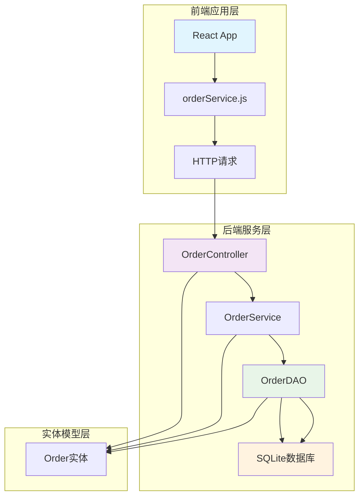
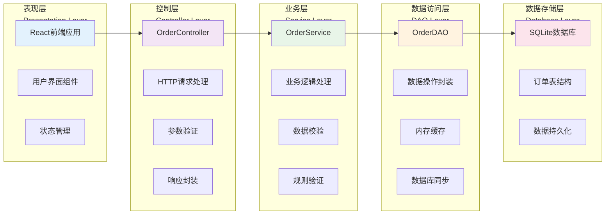
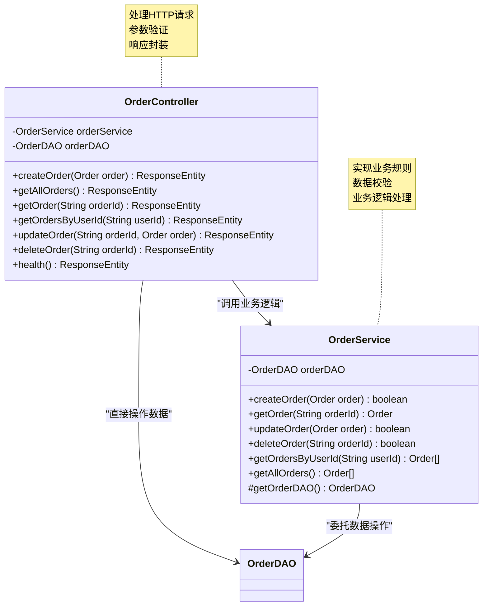
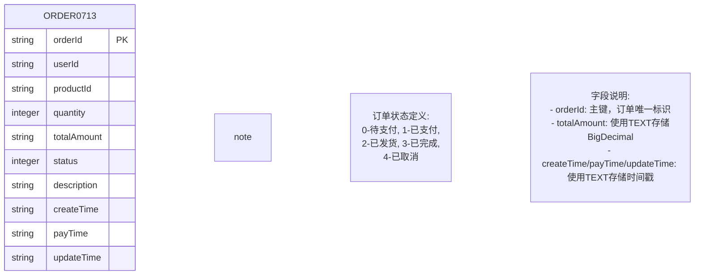
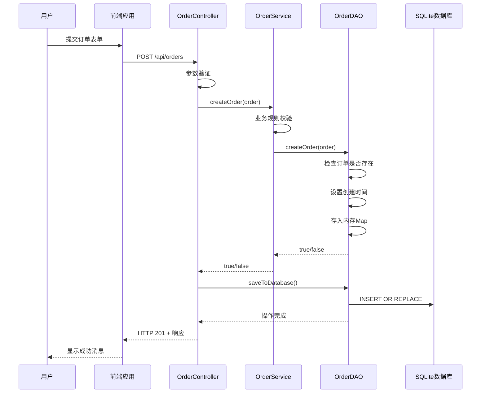
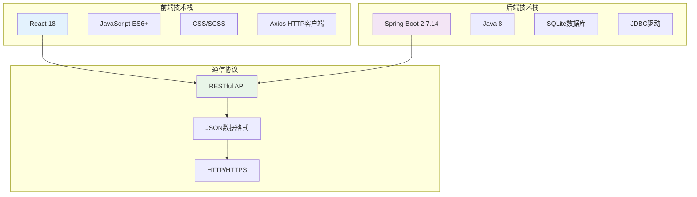

# 系统架构图

<cite>
**本文档中引用的文件**
- [DesignDoc1110.md](file://DesignDoc1110.md)
- [frontend/src/App.js](file://frontend/src/App.js)
- [frontend/src/services/orderService.js](file://frontend/src/services/orderService.js)
- [src/main/java/com/example/demo/controller/OrderController.java](file://src/main/java/com/example/demo/controller/OrderController.java)
- [src/main/java/com/example/demo/service/OrderService.java](file://src/main/java/com/example/demo/service/OrderService.java)
- [src/main/java/com/example/demo/dao/OrderDAO.java](file://src/main/java/com/example/demo/dao/OrderDAO.java)
- [src/main/java/com/example/demo/entity/Order.java](file://src/main/java/com/example/demo/entity/Order.java)
- [src/main/java/com/example/demo/dao/DBUtil.java](file://src/main/java/com/example/demo/dao/DBUtil.java)
- [src/main/java/com/example/demo/config/WebConfig.java](file://src/main/java/com/example/demo/config/WebConfig.java)
- [pom.xml](file://pom.xml)
- [src/test/java/com/example/demo/controller/OrderControllerIT.java](file://src/test/java/com/example/demo/controller/OrderControllerIT.java)
- [src/test/java/com/example/demo/service/OrderServiceTest.java](file://src/test/java/com/example/demo/service/OrderServiceTest.java)
</cite>

## 目录
1. [引言](#引言)
2. [系统架构概览](#系统架构概览)
3. [分层架构设计](#分层架构设计)
4. [前端层详细分析](#前端层详细分析)
5. [后端层详细分析](#后端层详细分析)
6. [数据访问层详细分析](#数据访问层详细分析)
7. [数据库层详细分析](#数据库层详细分析)
8. [组件间调用流程](#组件间调用流程)
9. [前后端分离架构优势](#前后端分离架构优势)
10. [技术栈与实现细节](#技术栈与实现细节)
11. [总结](#总结)

## 引言

本文档基于DesignDoc1110.md中的PlantUML图，深入分析订单管理系统的分层架构设计。该系统采用经典的三层架构模式（Controller-Service-DAO），结合Spring Boot框架和SQLite数据库，实现了完整的前后端分离架构。系统通过清晰的层次划分，实现了关注点分离，提高了代码的可维护性和可扩展性。

## 系统架构概览

系统采用经典的三层架构模式，分为前端应用层、后端服务层、数据访问层和数据库存储层。这种架构设计遵循了软件工程的最佳实践，实现了职责分离和模块化管理。



**图表来源**
- [DesignDoc1110.md](file://DesignDoc1110.md#L7-L66)
- [frontend/src/App.js](file://frontend/src/App.js#L1-L427)
- [src/main/java/com/example/demo/controller/OrderController.java](file://src/main/java/com/example/demo/controller/OrderController.java#L1-L173)

## 分层架构设计

系统采用经典的三层架构模式，每层都有明确的职责划分：

### 架构层次说明



**图表来源**
- [DesignDoc1110.md](file://DesignDoc1110.md#L69-L92)
- [src/main/java/com/example/demo/controller/OrderController.java](file://src/main/java/com/example/demo/controller/OrderController.java#L18-L30)
- [src/main/java/com/example/demo/service/OrderService.java](file://src/main/java/com/example/demo/service/OrderService.java#L13-L21)

**章节来源**
- [DesignDoc1110.md](file://DesignDoc1110.md#L1-L92)

## 前端层详细分析

前端层基于React框架构建，负责用户交互和数据展示。前端通过orderService.js与后端进行通信，实现了完整的CRUD操作。

### 前端组件架构

```mermaid
classDiagram
class App {
+useState hooks
+useEffect hooks
+formData state
+orders state
+message state
+checkConnection()
+loadAllOrders()
+handleCreateOrder()
+handleUpdateStatus()
+handleDeleteOrder()
+getStatusText()
+formatDateTime()
}
class orderService {
+createOrder(orderData)
+getOrder(orderId)
+getAllOrders()
+getOrdersByUserId(userId)
+updateOrder(orderId, orderData)
+deleteOrder(orderId)
+healthCheck()
}
App --> orderService : "使用"
orderService --> "HTTP" : "发送请求"
note for App "负责用户界面渲染<br/>状态管理和业务逻辑"
note for orderService "封装HTTP API调用<br/>提供统一的服务接口"
```

**图表来源**
- [frontend/src/App.js](file://frontend/src/App.js#L5-L427)
- [frontend/src/services/orderService.js](file://frontend/src/services/orderService.js#L1-L49)

### 前端核心功能

前端应用提供了完整的订单管理功能，包括：

1. **订单创建**：通过表单收集订单信息，自动计算金额
2. **订单查询**：支持按用户ID搜索和查看所有订单
3. **状态管理**：实时显示订单状态和操作按钮
4. **错误处理**：友好的错误提示和状态反馈
5. **连接检测**：自动检测后端服务连接状态

**章节来源**
- [frontend/src/App.js](file://frontend/src/App.js#L1-L427)
- [frontend/src/services/orderService.js](file://frontend/src/services/orderService.js#L1-L49)

## 后端层详细分析

后端层采用Spring Boot框架，实现了RESTful API服务。Controller层负责HTTP请求处理，Service层封装业务逻辑，实现了清晰的职责分离。

### Controller层架构



**图表来源**
- [src/main/java/com/example/demo/controller/OrderController.java](file://src/main/java/com/example/demo/controller/OrderController.java#L18-L30)
- [src/main/java/com/example/demo/service/OrderService.java](file://src/main/java/com/example/demo/service/OrderService.java#L13-L21)

### Service层业务逻辑

Service层实现了核心的业务规则和数据校验：

1. **订单创建校验**：验证购买数量和订单金额
2. **订单更新规则**：已完成订单不能修改
3. **订单删除规则**：已支付订单不能删除
4. **用户权限控制**：按用户ID查询订单
5. **异常处理**：统一的异常处理机制

**章节来源**
- [src/main/java/com/example/demo/controller/OrderController.java](file://src/main/java/com/example/demo/controller/OrderController.java#L1-L173)
- [src/main/java/com/example/demo/service/OrderService.java](file://src/main/java/com/example/demo/service/OrderService.java#L1-L114)

## 数据访问层详细分析

数据访问层（DAO）负责数据的持久化操作，采用了内存缓存+数据库同步的设计模式，既保证了性能又确保了数据一致性。

### DAO层架构设计

```mermaid
classDiagram
class OrderDAO {
-Map~String,Order~ orderMap
-DateTimeFormatter FORMATTER
+initTable()
+saveToDatabase()
+loadFromDatabase()
+createOrder(Order order) boolean
+getOrder(String orderId) Order
+updateOrder(Order order) boolean
+deleteOrder(String orderId) boolean
+getOrdersByUserId(String userId) Order[]
+getAllOrders() Order[]
}
class DBUtil {
-String URL
+getConnection() Connection
}
OrderDAO --> DBUtil : "获取数据库连接"
OrderDAO --> "ConcurrentHashMap" : "内存缓存"
note for OrderDAO "内存+数据库双层存储<br/>保证高性能和数据持久化"
note for DBUtil "数据库连接管理<br/>JDBC操作封装"
```

**图表来源**
- [src/main/java/com/example/demo/dao/OrderDAO.java](file://src/main/java/com/example/demo/dao/OrderDAO.java#L18-L21)
- [src/main/java/com/example/demo/dao/DBUtil.java](file://src/main/java/com/example/demo/dao/DBUtil.java#L9-L18)

### 数据访问模式

DAO层采用了独特的内存缓存+数据库同步模式：

1. **内存缓存**：使用ConcurrentHashMap存储订单数据，提供快速访问
2. **数据库同步**：通过saveToDatabase()和loadFromDatabase()方法保持数据一致性
3. **事务控制**：每次数据操作后及时同步到数据库
4. **线程安全**：使用ConcurrentHashMap保证并发访问安全

**章节来源**
- [src/main/java/com/example/demo/dao/OrderDAO.java](file://src/main/java/com/example/demo/dao/OrderDAO.java#L1-L248)
- [src/main/java/com/example/demo/dao/DBUtil.java](file://src/main/java/com/example/demo/dao/DBUtil.java#L1-L19)

## 数据库层详细分析

数据库层采用SQLite轻量级数据库，实现了订单数据的持久化存储。数据库设计简单高效，符合业务需求。

### 数据库设计



**图表来源**
- [DesignDoc1110.md](file://DesignDoc1110.md#L347-L380)
- [src/main/java/com/example/demo/dao/OrderDAO.java](file://src/main/java/com/example/demo/dao/OrderDAO.java#L28-L46)

### 数据库操作特点

1. **表结构设计**：简洁明了，包含所有订单必要信息
2. **数据类型选择**：使用TEXT存储BigDecimal和时间戳，便于处理
3. **索引策略**：orderId为主键，提供快速查询
4. **数据完整性**：通过业务逻辑保证数据有效性

**章节来源**
- [DesignDoc1110.md](file://DesignDoc1110.md#L345-L380)
- [src/main/java/com/example/demo/dao/OrderDAO.java](file://src/main/java/com/example/demo/dao/OrderDAO.java#L28-L46)

## 组件间调用流程

系统各组件之间通过清晰的调用关系实现业务流程。以下是典型的订单创建流程：

### 订单创建流程



**图表来源**
- [frontend/src/App.js](file://frontend/src/App.js#L78-L98)
- [src/main/java/com/example/demo/controller/OrderController.java](file://src/main/java/com/example/demo/controller/OrderController.java#L35-L55)
- [src/main/java/com/example/demo/service/OrderService.java](file://src/main/java/com/example/demo/service/OrderService.java#L28-L37)
- [src/main/java/com/example/demo/dao/OrderDAO.java](file://src/main/java/com/example/demo/dao/OrderDAO.java#L165-L174)

### 其他核心流程

系统还实现了查询、更新和删除等核心业务流程，每个流程都遵循相同的架构原则：

1. **查询流程**：Controller → Service → DAO → 数据库
2. **更新流程**：Controller → Service → DAO → 数据库
3. **删除流程**：Controller → Service → DAO → 数据库

**章节来源**
- [DesignDoc1110.md](file://DesignDoc1110.md#L218-L343)

## 前后端分离架构优势

该系统采用前后端分离架构，具有以下显著优势：

### 技术栈解耦



**图表来源**
- [pom.xml](file://pom.xml#L1-L136)
- [frontend/src/services/orderService.js](file://frontend/src/services/orderService.js#L1-L49)

### 架构优势分析

1. **独立开发**：前端和后端可以并行开发，提高开发效率
2. **技术栈灵活**：前端可使用React，后端可使用Spring Boot，互不影响
3. **部署灵活**：前端可部署在CDN，后端可部署在服务器集群
4. **易于扩展**：新增功能只需修改对应层，不影响其他层
5. **团队协作**：前端开发和后端开发可以独立进行

### 跨域支持

系统通过WebConfig配置实现了跨域支持：

```java
// 跨域配置示例
registry.addMapping("/api/**")
        .allowedOrigins("*")
        .allowedMethods("GET", "POST", "PUT", "DELETE", "OPTIONS")
        .allowedHeaders("*")
        .maxAge(3600);
```

**章节来源**
- [src/main/java/com/example/demo/config/WebConfig.java](file://src/main/java/com/example/demo/config/WebConfig.java#L1-L28)

## 技术栈与实现细节

### 核心技术栈

| 层次 | 技术 | 版本 | 用途 |
|------|------|------|------|
| 前端 | React | 18+ | 用户界面框架 |
| 前端 | Axios | 最新版 | HTTP请求库 |
| 后端 | Spring Boot | 2.7.14 | 应用框架 |
| 后端 | Java | 8 | 编程语言 |
| 数据库 | SQLite | 最新版 | 关系型数据库 |
| 数据库 | JDBC | 驱动 | 数据库连接 |

### 实现特色

1. **内存缓存机制**：使用ConcurrentHashMap提供高性能访问
2. **自动同步机制**：每次数据操作后自动同步到数据库
3. **异常处理**：统一的异常处理和错误响应机制
4. **测试覆盖**：完整的单元测试和集成测试
5. **RESTful设计**：标准的REST API设计规范

**章节来源**
- [pom.xml](file://pom.xml#L1-L136)
- [src/test/java/com/example/demo/controller/OrderControllerIT.java](file://src/test/java/com/example/demo/controller/OrderControllerIT.java#L1-L175)
- [src/test/java/com/example/demo/service/OrderServiceTest.java](file://src/test/java/com/example/demo/service/OrderServiceTest.java#L1-L284)

## 总结

本文档详细分析了基于DesignDoc1110.md的订单管理系统架构。系统采用经典的三层架构模式，实现了清晰的职责分离：

1. **前端层**：基于React的现代化用户界面，提供良好的用户体验
2. **控制层**：Spring Boot的RESTful API，处理HTTP请求和响应
3. **业务层**：封装核心业务逻辑，实现数据校验和业务规则
4. **数据访问层**：采用内存缓存+数据库同步模式，平衡性能和一致性
5. **数据库层**：SQLite轻量级数据库，满足小型应用需求

该架构设计充分体现了前后端分离的优势，实现了技术栈解耦、独立开发、部署灵活等特性。通过清晰的组件划分和标准的RESTful API设计，系统具备良好的可维护性和可扩展性，为后续功能扩展奠定了坚实基础。