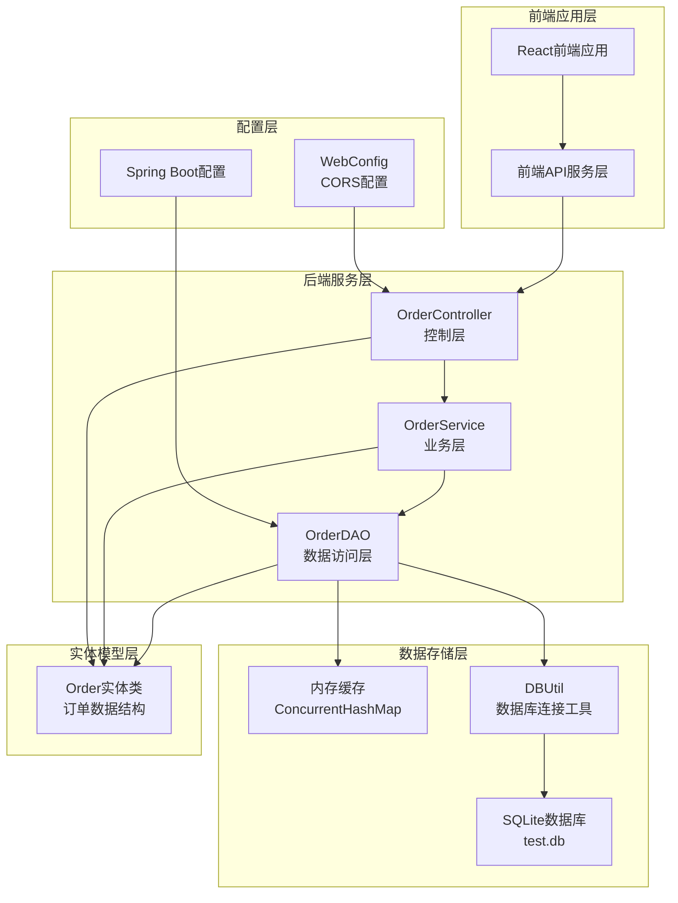
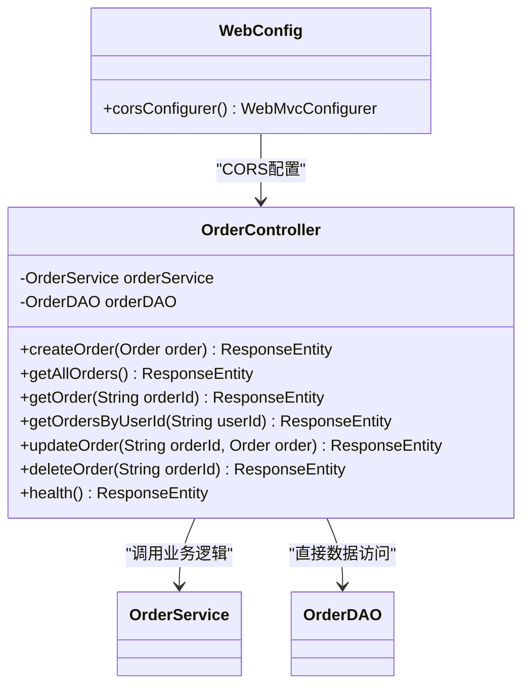
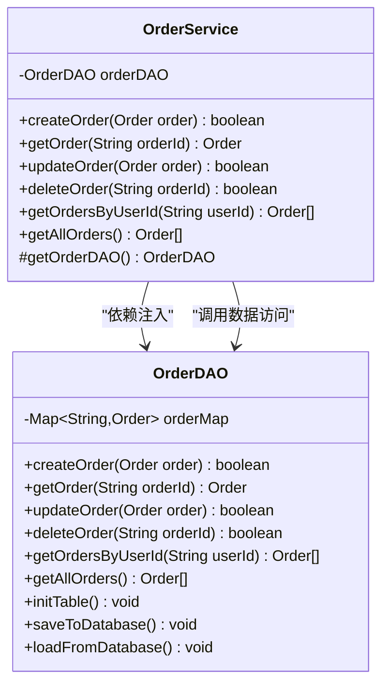
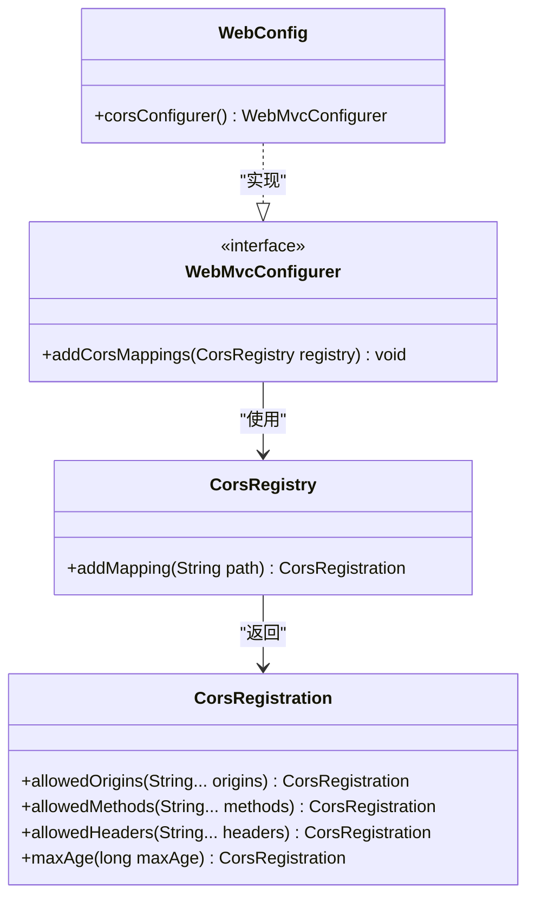
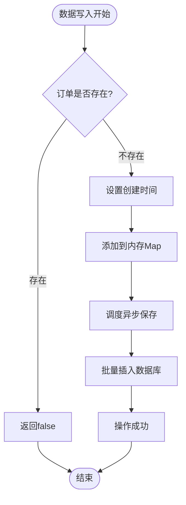
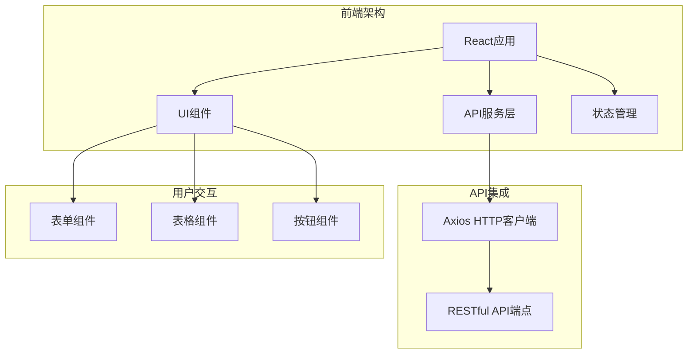
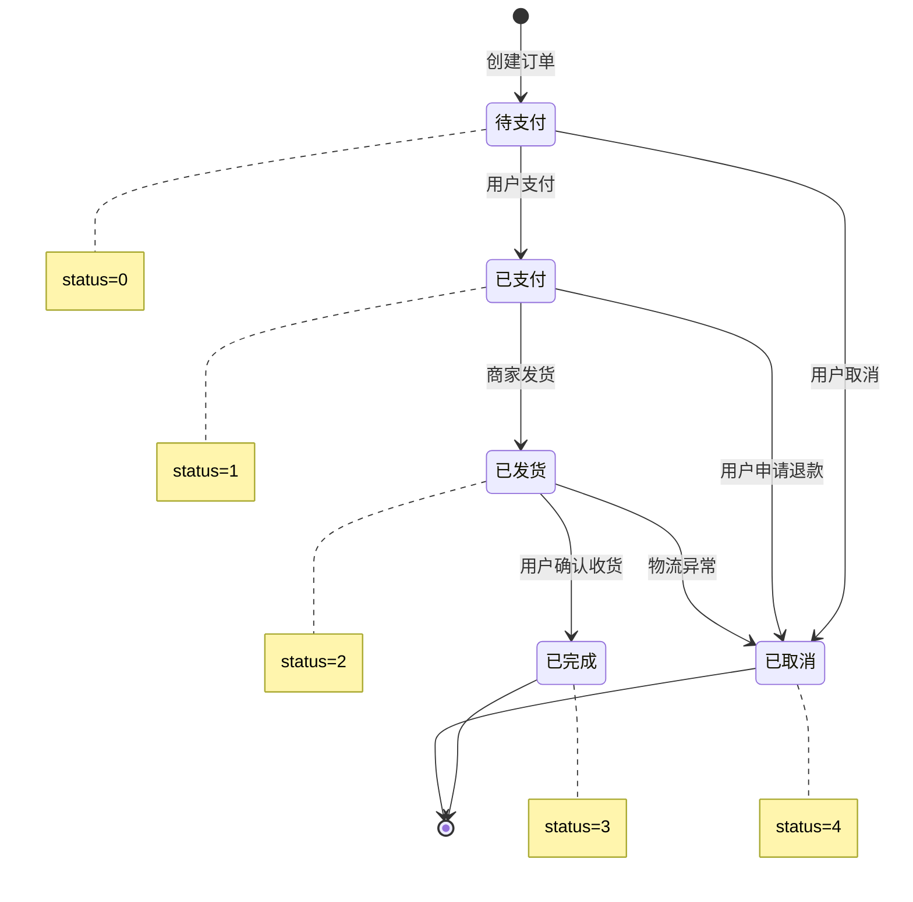

# 设计文档与架构图

<cite>
**本文档引用的文件**
- [DesignDoc1110.md](file://DesignDoc1110.md)
- [App.java](file://src/main/java/com/example/demo/App.java)
- [OrderController.java](file://src/main/java/com/example/demo/controller/OrderController.java)
- [OrderService.java](file://src/main/java/com/example/demo/service/OrderService.java)
- [OrderDAO.java](file://src/main/java/com/example/demo/dao/OrderDAO.java)
- [DBUtil.java](file://src/main/java/com/example/demo/dao/DBUtil.java)
- [Order.java](file://src/main/java/com/example/demo/entity/Order.java)
- [WebConfig.java](file://src/main/java/com/example/demo/config/WebConfig.java)
- [orderService.js](file://frontend/src/services/orderService.js)
- [App.js](file://frontend/src/App.js)
- [pom.xml](file://pom.xml)
</cite>

## 目录
1. [系统概述](#系统概述)
2. [技术架构全景](#技术架构全景)
3. [分层架构设计](#分层架构设计)
4. [核心类关系图](#核心类关系图)
5. [创建订单时序图](#创建订单时序图)
6. [CORS配置详解](#cors配置详解)
7. [数据库设计](#数据库设计)
8. [前端架构](#前端架构)
9. [业务流程分析](#业务流程分析)
10. [总结](#总结)

## 系统概述

本系统是一个基于Spring Boot框架构建的订单管理系统，采用经典的三层架构模式（Controller-Service-DAO），使用SQLite作为数据存储解决方案。系统提供了完整的订单生命周期管理功能，包括创建、查询、更新、删除等操作，并具备良好的跨域支持能力。

### 主要特性
- **RESTful API设计**：遵循REST原则的HTTP接口设计
- **三层架构分离**：清晰的职责划分，提高代码可维护性
- **内存+数据库双重存储**：使用ConcurrentHashMap作为内存缓存，确保高性能
- **跨域支持**：完整的CORS配置，支持前端跨域访问
- **业务规则验证**：完善的订单状态流转控制

## 技术架构全景



**图表来源**
- [App.java](file://src/main/java/com/example/demo/App.java#L1-L24)
- [OrderController.java](file://src/main/java/com/example/demo/controller/OrderController.java#L1-L173)
- [OrderService.java](file://src/main/java/com/example/demo/service/OrderService.java#L1-L114)
- [OrderDAO.java](file://src/main/java/com/example/demo/dao/OrderDAO.java#L1-L248)
- [WebConfig.java](file://src/main/java/com/example/demo/config/WebConfig.java#L1-L28)

**章节来源**
- [DesignDoc1110.md](file://DesignDoc1110.md#L1-L66)

## 分层架构设计

### 控制层（Controller Layer）

控制层负责处理HTTP请求和响应，是系统的入口点。主要职责包括：

- **HTTP请求处理**：接收来自前端的RESTful API请求
- **参数验证**：对请求参数进行基本验证和转换
- **响应封装**：将业务结果封装为标准的HTTP响应格式
- **异常处理**：捕获并处理业务异常，返回适当的错误信息



**图表来源**
- [OrderController.java](file://src/main/java/com/example/demo/controller/OrderController.java#L22-L173)
- [WebConfig.java](file://src/main/java/com/example/demo/config/WebConfig.java#L14-L26)

### 业务层（Service Layer）

业务层实现核心业务逻辑，是系统的核心处理单元：

- **业务规则实现**：执行订单状态流转、数据校验等业务逻辑
- **事务边界管理**：协调多个数据操作的事务性
- **业务异常处理**：处理业务层面的异常情况
- **数据转换**：在不同层次之间进行数据格式转换



**图表来源**
- [OrderService.java](file://src/main/java/com/example/demo/service/OrderService.java#L15-L114)
- [OrderDAO.java](file://src/main/java/com/example/demo/dao/OrderDAO.java#L18-L248)

### 数据访问层（DAO Layer）

数据访问层负责与数据库交互，实现数据的持久化：

- **数据持久化**：将内存中的数据同步到SQLite数据库
- **数据查询**：提供各种数据查询接口
- **内存管理**：使用ConcurrentHashMap作为高性能缓存
- **数据库操作**：封装SQL操作，提供统一的数据访问接口

**章节来源**
- [DesignDoc1110.md](file://DesignDoc1110.md#L68-L92)

## 核心类关系图

系统采用简洁的类结构设计，所有类均为具体实现类，没有复杂的继承关系：

```mermaid
classDiagram
class App {
+main(String[] args) void
+orderDAO() OrderDAO
}
class OrderController {
-OrderService orderService
-OrderDAO orderDAO
+createOrder(Order order) ResponseEntity
+getAllOrders() ResponseEntity
+getOrder(String orderId) ResponseEntity
+getOrdersByUserId(String userId) ResponseEntity
+updateOrder(String orderId, Order order) ResponseEntity
+deleteOrder(String orderId) ResponseEntity
+health() ResponseEntity
}
class OrderService {
-OrderDAO orderDAO
+createOrder(Order order) boolean
+getOrder(String orderId) Order
+updateOrder(Order order) boolean
+deleteOrder(String orderId) boolean
+getOrdersByUserId(String userId) Order[]
+getAllOrders() Order[]
#getOrderDAO() OrderDAO
}
class OrderDAO {
-Map~String,Order~ orderMap
+initTable() void
+saveToDatabase() void
+loadFromDatabase() void
+createOrder(Order order) boolean
+getOrder(String orderId) Order
+updateOrder(Order order) boolean
+deleteOrder(String orderId) boolean
+getOrdersByUserId(String userId) Order[]
+getAllOrders() Order[]
}
class Order {
-String orderId
-String userId
-String productId
-Integer quantity
-BigDecimal totalAmount
-Integer status
-String description
-LocalDateTime createTime
-LocalDateTime payTime
-LocalDateTime updateTime
+Order()
+Order(String orderId, String userId, String productId, Integer quantity, BigDecimal totalAmount)
+Order(String orderId, String userId, String productId, Integer quantity, BigDecimal totalAmount, Integer status, String description, LocalDateTime createTime, LocalDateTime payTime, LocalDateTime updateTime)
+get*/set*() *[]
}
class WebConfig {
+corsConfigurer() WebMvcConfigurer
}
class DBUtil {
-String DB_URL
+getConnection() Connection
}
App --> OrderDAO : "Spring Bean管理"
OrderController --> OrderService : "依赖注入"
OrderController --> OrderDAO : "直接依赖"
OrderService --> OrderDAO : "依赖注入"
OrderDAO --> Order : "使用实体"
OrderService --> Order : "使用实体"
OrderController --> Order : "使用实体"
WebConfig --> "Spring MVC" : "配置"
OrderDAO --> DBUtil : "数据库连接"
```

**图表来源**
- [App.java](file://src/main/java/com/example/demo/App.java#L10-L24)
- [OrderController.java](file://src/main/java/com/example/demo/controller/OrderController.java#L22-L30)
- [OrderService.java](file://src/main/java/com/example/demo/service/OrderService.java#L15-L21)
- [OrderDAO.java](file://src/main/java/com/example/demo/dao/OrderDAO.java#L18-L21)
- [Order.java](file://src/main/java/com/example/demo/entity/Order.java#L9-L162)
- [WebConfig.java](file://src/main/java/com/example/demo/config/WebConfig.java#L14-L26)
- [DBUtil.java](file://src/main/java/com/example/demo/dao/DBUtil.java#L10-L18)

**章节来源**
- [DesignDoc1110.md](file://DesignDoc1110.md#L92-L214)

## 创建订单时序图

以下是创建订单的完整时序流程，展示了客户端到数据库的完整调用链路：

```mermaid
sequenceDiagram
participant Client as "前端客户端"
participant Controller as "OrderController"
participant Service as "OrderService"
participant DAO as "OrderDAO"
participant DB as "SQLite数据库"
Client->>Controller : POST /api/orders<br/>{订单JSON数据}
Controller->>Controller : 参数验证和转换
Note right of Controller : 校验请求参数<br/>JSON反序列化
Controller->>Service : createOrder(order)
Note right of Service : 业务规则校验<br/>- 数量>0<br/>- 金额>0<br/>- 订单不重复
Service->>DAO : createOrder(order)
Note right of DAO : 内存操作<br/>- 检查订单是否存在<br/>- 设置创建时间<br/>- 存入ConcurrentHashMap
DAO-->>Service : true/false
Service-->>Controller : true/false
Controller->>DAO : saveToDatabase()
Note right of DAO : 数据持久化<br/>- 批量插入OR REPLACE<br/>- 同步到SQLite
DAO->>DB : INSERT OR REPLACE INTO order0713
DAO-->>Controller : 操作完成
Controller->>Client : HTTP 201 CREATED<br/>{成功响应}
Note top of Client : 业务规则 : <br/>1. 购买数量必须>0<br/>2. 订单金额必须>0<br/>3. 不能创建重复订单
```

**图表来源**
- [OrderController.java](file://src/main/java/com/example/demo/controller/OrderController.java#L35-L56)
- [OrderService.java](file://src/main/java/com/example/demo/service/OrderService.java#L28-L38)
- [OrderDAO.java](file://src/main/java/com/example/demo/dao/OrderDAO.java#L165-L175)

**章节来源**
- [DesignDoc1110.md](file://DesignDoc1110.md#L216-L249)

## CORS配置详解

系统通过WebConfig类实现了CORS（跨域资源共享）配置，确保前端能够顺利访问后端API。

### CORS配置实现



**图表来源**
- [WebConfig.java](file://src/main/java/com/example/demo/config/WebConfig.java#L14-L26)

### CORS配置参数说明

| 配置项 | 值 | 说明 |
|--------|-----|------|
| `addMapping("/api/**")` | 路径匹配 | 对/api路径下的所有接口启用CORS |
| `allowedOrigins("*")` | 允许源 | 允许所有域名访问（开发环境） |
| `allowedMethods("GET", "POST", "PUT", "DELETE", "OPTIONS")` | 允许方法 | 支持常见的HTTP方法 |
| `allowedHeaders("*")` | 允许头 | 允许所有请求头 |
| `maxAge(3600)` | 预检缓存 | 预检请求缓存1小时 |

### 跨域通信作用

CORS配置在系统中的重要作用：

1. **前端开发便利性**：允许前端应用在本地开发时访问后端API
2. **安全性平衡**：在开发阶段开放所有权限，生产环境可根据需要调整
3. **标准兼容性**：遵循W3C CORS标准，确保浏览器正确处理跨域请求
4. **调试友好**：简化前后端联调过程，避免CORS导致的开发障碍

**章节来源**
- [WebConfig.java](file://src/main/java/com/example/demo/config/WebConfig.java#L1-L28)

## 数据库设计

### 表结构设计

系统使用SQLite数据库，订单信息存储在`order0713`表中：

```sql
CREATE TABLE IF NOT EXISTS order0713(
  orderId TEXT PRIMARY KEY, 
  userId TEXT, 
  productId TEXT, 
  quantity INTEGER, 
  totalAmount TEXT, 
  status INTEGER, 
  description TEXT, 
  createTime TEXT, 
  payTime TEXT, 
  updateTime TEXT
);
```

### 字段说明

| 字段名 | 类型 | 说明 |
|--------|------|------|
| orderId | TEXT | 订单唯一标识，主键 |
| userId | TEXT | 用户ID |
| productId | TEXT | 商品ID |
| quantity | INTEGER | 购买数量 |
| totalAmount | TEXT | 订单总金额(BD格式) |
| status | INTEGER | 订单状态(0-待支付,1-已支付,2-已发货,3-已完成,4-已取消) |
| description | TEXT | 订单描述 |
| createTime | TEXT | 创建时间 |
| payTime | TEXT | 支付时间 |
| updateTime | TEXT | 更新时间 |

### 数据库存储策略



**图表来源**
- [OrderDAO.java](file://src/main/java/com/example/demo/dao/OrderDAO.java#L165-L175)

**章节来源**
- [DesignDoc1110.md](file://DesignDoc1110.md#L345-L394)

## 前端架构

### 前端技术栈

前端采用React技术栈，提供现代化的用户界面：



**图表来源**
- [App.js](file://frontend/src/App.js#L1-L427)
- [orderService.js](file://frontend/src/services/orderService.js#L1-L49)

### 前端API服务层

前端通过orderService.js封装了所有API调用：

| API方法 | HTTP方法 | 描述 |
|---------|----------|------|
| `createOrder` | POST | 创建新订单 |
| `getOrder` | GET | 获取单个订单详情 |
| `getAllOrders` | GET | 获取所有订单列表 |
| `getOrdersByUserId` | GET | 根据用户ID查询订单 |
| `updateOrder` | PUT | 更新订单状态 |
| `deleteOrder` | DELETE | 删除订单 |
| `healthCheck` | GET | 健康检查 |

**章节来源**
- [orderService.js](file://frontend/src/services/orderService.js#L1-L49)

## 业务流程分析

### 订单状态流转

系统实现了完整的订单状态管理：



### 业务规则验证

系统在各个层级实现了严格的业务规则验证：

1. **创建订单规则**
   - 购买数量必须大于0
   - 订单金额必须大于0
   - 不能创建重复订单

2. **更新订单规则**
   - 已完成订单(status=3)不能修改
   - 只能更新存在的订单

3. **删除订单规则**
   - 已支付订单(status=1)不能删除
   - 只能删除存在的订单

**章节来源**
- [DesignDoc1110.md](file://DesignDoc1110.md#L422-L490)

## 总结

本系统通过清晰的分层架构设计，实现了高效、可靠的订单管理功能。主要特点包括：

### 架构优势
- **三层分离**：Controller、Service、DAO职责明确，便于维护和扩展
- **内存缓存**：使用ConcurrentHashMap提供高性能的数据访问
- **数据持久化**：SQLite数据库确保数据的可靠存储
- **跨域支持**：完整的CORS配置支持前端开发需求

### 技术特色
- **RESTful设计**：符合现代API设计规范
- **业务规则内建**：在Service层实现完整的业务逻辑
- **异常处理**：多层次的异常处理机制
- **状态管理**：完整的订单状态流转控制

### 应用价值
- **开发效率**：清晰的架构降低了开发复杂度
- **维护成本**：模块化设计便于后续维护
- **扩展性**：良好的架构基础支持功能扩展
- **可靠性**：多重验证机制确保数据完整性

这套设计方案为构建企业级应用提供了优秀的参考模板，特别适合中小型项目的快速开发和部署需求。