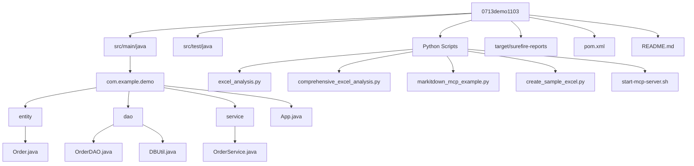
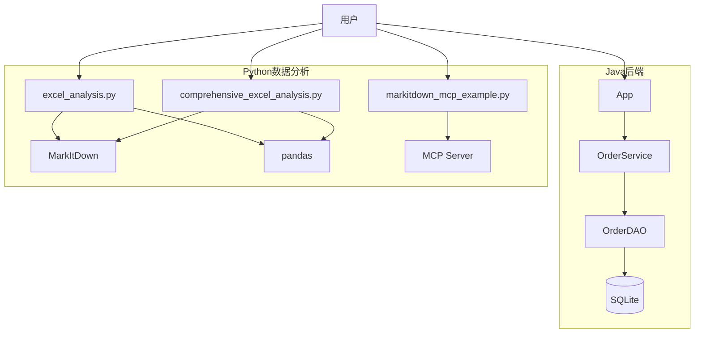
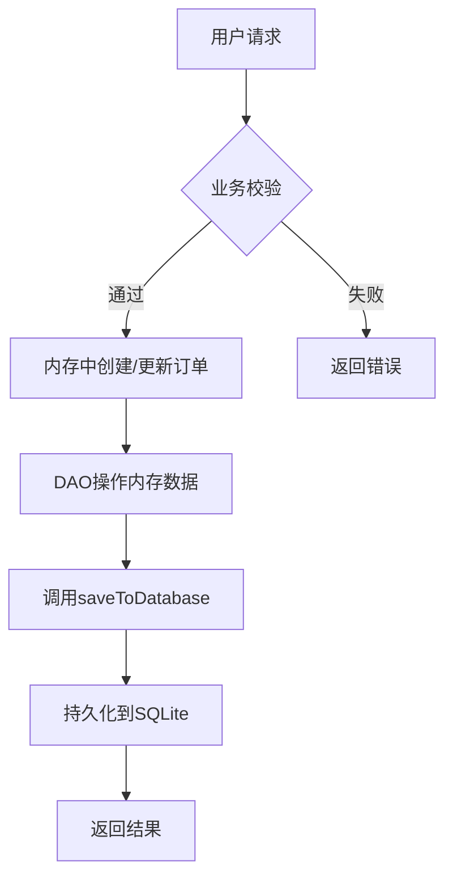
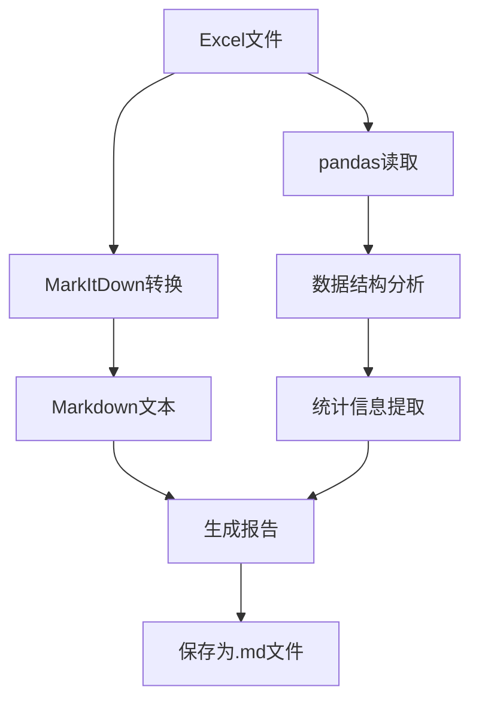

# 项目概述

<cite>
**本文档引用的文件**  
- [App.java](file://src/main/java/com/example/demo/App.java)
- [Order.java](file://src/main/java/com/example/demo/entity/Order.java)
- [OrderService.java](file://src/main/java/com/example/demo/service/OrderService.java)
- [OrderDAO.java](file://src/main/java/com/example/demo/dao/OrderDAO.java)
- [DBUtil.java](file://src/main/java/com/example/demo/dao/DBUtil.java)
- [pom.xml](file://pom.xml)
- [excel_analysis.py](file://excel_analysis.py)
- [comprehensive_excel_analysis.py](file://comprehensive_excel_analysis.py)
- [markitdown_mcp_example.py](file://markitdown_mcp_example.py)
- [start-mcp-server.sh](file://start-mcp-server.sh)
</cite>

## 目录
1. [简介](#简介)
2. [项目结构](#项目结构)
3. [核心组件](#核心组件)
4. [架构设计](#架构设计)
5. [数据流分析](#数据流分析)
6. [主程序执行流程](#主程序执行流程)
7. [典型使用场景](#典型使用场景)
8. [扩展性与集成点](#扩展性与集成点)

## 简介
0713demo1103项目是一个混合型应用系统，结合了Java后端服务与Python数据分析能力。项目旨在提供订单管理API、执行Excel深度分析，并集成MCP文档转换服务。系统采用Java分层架构（entity→dao→service）实现订单的创建、查询、更新和删除操作，同时利用Python脚本工具集完成Excel文件的解析、分析与报告生成。整个系统通过内存操作与SQLite持久化相结合的方式处理订单数据，并借助MarkItDown技术将复杂文档转换为结构化Markdown格式，便于后续的数据挖掘与可视化展示。

## 项目结构
项目采用标准Maven结构组织Java代码，同时包含独立的Python脚本用于数据分析任务。整体目录清晰划分了源码、测试、配置与工具脚本。

**Diagram sources**  
- [src/main/java/com/example/demo](file://src/main/java/com/example/demo)
- [excel_analysis.py](file://excel_analysis.py)
- [start-mcp-server.sh](file://start-mcp-server.sh)

**Section sources**  
- [pom.xml](file://pom.xml#L1-L64)

## 核心组件

本项目由Java后端服务与Python数据分析两大模块构成，各组件职责明确，协同工作。

### Java后端服务组件
- **Order实体类**：定义订单数据结构，包含订单ID、用户ID、商品ID、数量、金额、状态及时间戳等字段。
- **OrderDAO数据访问对象**：负责与SQLite数据库交互，执行CRUD操作及表初始化。
- **OrderService业务服务**：封装订单业务逻辑，包括校验规则、状态控制与删除限制。
- **App主程序**：演示订单全生命周期操作的入口点。

### Python数据分析组件
- **excel_analysis.py**：基础Excel分析工具，集成MarkItDown转换与pandas统计分析。
- **comprehensive_excel_analysis.py**：增强版分析器，提供多工作表支持、数据洞察生成与综合报告输出。
- **markitdown_mcp_example.py**：MCP服务器客户端示例，展示如何通过HTTP接口调用文档转换服务。
- **start-mcp-server.sh**：启动脚本，激活虚拟环境并运行MCP服务。

**Section sources**  
- [src/main/java/com/example/demo/entity/Order.java](file://src/main/java/com/example/demo/entity/Order.java#L1-L143)
- [src/main/java/com/example/demo/service/OrderService.java](file://src/main/java/com/example/demo/service/OrderService.java#L1-L81)
- [excel_analysis.py](file://excel_analysis.py#L1-L128)
- [comprehensive_excel_analysis.py](file://comprehensive_excel_analysis.py#L1-L224)

## 架构设计

系统采用分层架构设计思想，Java部分遵循典型的三层模式，Python部分则以工具脚本形式提供灵活的数据处理能力。

**Diagram sources**  
- [App.java](file://src/main/java/com/example/demo/App.java#L1-L62)
- [OrderService.java](file://src/main/java/com/example/demo/service/OrderService.java#L1-L81)
- [excel_analysis.py](file://excel_analysis.py#L1-L128)
- [markitdown_mcp_example.py](file://markitdown_mcp_example.py#L1-L136)

**Section sources**  
- [App.java](file://src/main/java/com/example/demo/App.java#L1-L62)
- [OrderService.java](file://src/main/java/com/example/demo/service/OrderService.java#L1-L81)

## 数据流分析

### 订单数据流
系统订单处理流程严格遵循“用户请求→业务校验→内存操作→SQLite持久化”的路径：

**Diagram sources**  
- [OrderService.java](file://src/main/java/com/example/demo/service/OrderService.java#L15-L75)
- [OrderDAO.java](file://src/main/java/com/example/demo/dao/OrderDAO.java#L1-L50)

### Excel分析流
Excel文件处理流程为“文件输入→MarkItDown转换→pandas分析→报告输出”：

**Diagram sources**  
- [excel_analysis.py](file://excel_analysis.py#L1-L128)
- [comprehensive_excel_analysis.py](file://comprehensive_excel_analysis.py#L1-L224)

## 主程序执行流程

`App.java`中的主程序展示了订单从创建到删除的完整生命周期：

1. **初始化**：创建`OrderDAO`实例并初始化数据库表结构
2. **创建订单**：构造`Order`对象并通过`OrderService.createOrder()`存入内存
3. **持久化**：调用`orderDAO.saveToDatabase()`将数据写入SQLite
4. **查询订单**：使用`orderService.getOrder()`从内存获取订单
5. **更新订单**：修改订单状态并执行更新操作
6. **删除订单**：调用`deleteOrder()`移除订单并同步数据库

该流程体现了内存计算与磁盘持久化的分离设计，既保证了操作效率，又确保了数据可靠性。

**Section sources**  
- [App.java](file://src/main/java/com/example/demo/App.java#L1-L62)

## 典型使用场景

1. **订单管理系统演示**：运行`App.java`可完整体验订单CRUD操作，适用于教学与原型展示。
2. **Excel数据分析**：通过命令行或交互式输入，对任意Excel文件进行结构化分析与洞察提取。
3. **文档格式转换**：利用MCP服务将复杂表格文档转换为Markdown，便于知识库构建与内容迁移。
4. **自动化报表生成**：结合Python脚本定时分析业务数据并生成可视化报告。

## 扩展性与集成点

### 可扩展方向
- **Java端**：可引入Spring Boot框架提升Web服务能力，增加REST API接口。
- **Python端**：可集成更多分析库（如matplotlib、seaborn）实现图表输出。
- **数据存储**：可替换SQLite为MySQL或PostgreSQL以支持更大规模数据。
- **服务化**：将Python分析功能封装为微服务，通过HTTP或gRPC提供API。

### 关键集成点
- **MCP服务集成**：通过`markitdown_mcp_example.py`提供的HTTP客户端与外部文档转换服务通信。
- **虚拟环境管理**：`myenv`目录包含Python依赖，确保分析脚本运行环境一致性。
- **跨语言协作**：Java处理事务性业务逻辑，Python专注数据分析，二者通过文件系统或消息队列交换数据。

**Section sources**  
- [markitdown_mcp_example.py](file://markitdown_mcp_example.py#L1-L136)
- [start-mcp-server.sh](file://start-mcp-server.sh#L1-L10)