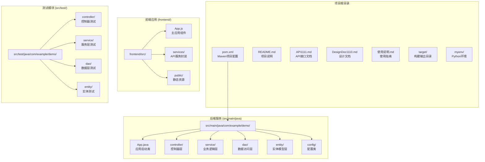

# 项目目录结构详解

<cite>
**本文档中引用的文件**
- [pom.xml](file://pom.xml)
- [README.md](file://README.md)
- [API1111.md](file://API1111.md)
- [DesignDoc1110.md](file://DesignDoc1110.md)
- [使用说明.md](file://使用说明.md)
- [AI_探测文档_1103demo项目.md](file://AI_探测文档_1103demo项目.md)
- [src/main/java/com/example/demo/App.java](file://src/main/java/com/example/demo/App.java)
- [src/main/java/com/example/demo/controller/OrderController.java](file://src/main/java/com/example/demo/controller/OrderController.java)
- [src/main/java/com/example/demo/service/OrderService.java](file://src/main/java/com/example/demo/service/OrderService.java)
- [src/main/java/com/example/demo/dao/OrderDAO.java](file://src/main/java/com/example/demo/dao/OrderDAO.java)
- [src/main/java/com/example/demo/entity/Order.java](file://src/main/java/com/example/demo/entity/Order.java)
- [frontend/src/App.js](file://frontend/src/App.js)
- [frontend/src/services/orderService.js](file://frontend/src/services/orderService.js)
- [frontend/package.json](file://frontend/package.json)
- [src/main/resources/application.properties](file://src/main/resources/application.properties)
- [src/test/java/com/example/demo/controller/OrderControllerIT.java](file://src/test/java/com/example/demo/controller/OrderControllerIT.java)
- [src/test/java/com/example/demo/service/OrderServiceTest.java](file://src/test/java/com/example/demo/service/OrderServiceTest.java)
</cite>

## 目录结构概览

本项目是一个完整的全栈订单管理系统，采用前后端分离架构，包含以下主要组成部分：

**图表来源**
- [pom.xml](file://pom.xml#L1-L136)
- [src/main/java/com/example/demo/App.java](file://src/main/java/com/example/demo/App.java#L1-L24)
- [frontend/package.json](file://frontend/package.json#L1-L41)

## 根目录结构详解

### Maven项目配置文件 (pom.xml)

**文件路径**: `pom.xml`

这是项目的Maven构建配置文件，定义了以下关键内容：

- **项目基本信息**: groupId为`com.example`，artifactId为`demo`，版本为`1.0-SNAPSHOT`
- **Spring Boot依赖**: 基于Spring Boot 2.7.14构建，提供Web开发支持
- **测试框架**: 集成JUnit 5、Mockito、RestAssured等测试工具
- **数据库驱动**: 包含SQLite JDBC驱动用于本地数据存储
- **构建插件**: 配置了Maven Surefire插件和JaCoCo代码覆盖率插件

**节来源**
- [pom.xml](file://pom.xml#L1-L136)

### 辅助文档文件

#### API接口文档 (API1111.md)
**文件路径**: `API1111.md`

详细定义了订单管理系统的RESTful API接口规范，包含：
- **接口定义**: OrderServiceI接口的核心业务方法
- **参数类**: OrderCreateRequest、OrderUpdateRequest、OrderDTO等数据传输对象
- **API端点**: 创建、查询、更新、删除订单的完整接口规范
- **响应格式**: 统一的SingleResult包装类响应格式

#### 系统设计文档 (DesignDoc1110.md)
**文件路径**: `DesignDoc1110.md`

提供了系统的详细设计文档，包含：
- **技术架构**: Spring Boot三层架构模式
- **核心类关系**: Controller-Service-DAO三层架构图
- **业务流程**: 创建、查询、更新、删除订单的标准流程
- **数据库设计**: SQLite表结构和字段说明
- **业务规则**: 订单状态流转和校验规则

#### 使用说明文档 (使用说明.md)
**文件路径**: `使用说明.md`

为用户提供完整的使用指南，包含：
- **项目概述**: 后端API和前端应用的基本信息
- **API接口**: 详细的REST API使用说明
- **前端功能**: React应用的操作指南
- **业务规则**: 订单状态管理和操作限制
- **快速测试**: 完整的测试流程示例

**节来源**
- [API1111.md](file://API1111.md#L1-L500)
- [DesignDoc1110.md](file://DesignDoc1110.md#L1-L490)
- [使用说明.md](file://使用说明.md#L1-L173)

### 构建输出目录 (target/)

**文件路径**: `target/`

Maven构建输出目录，包含：
- **测试报告**: `surefire-reports/`目录下的XML测试报告文件
- **代码覆盖率**: JaCoCo生成的HTML覆盖率报告
- **站点文档**: 项目文档和测试覆盖率统计

**节来源**
- [pom.xml](file://pom.xml#L102-L135)

## 后端服务结构 (src/main/java)

### 应用启动类 (App.java)

**文件路径**: `src/main/java/com/example/demo/App.java`

Spring Boot应用的主入口类，负责：
- **应用启动**: 通过`SpringApplication.run()`启动Spring Boot应用
- **Bean配置**: 定义OrderDAO Bean并初始化数据库
- **数据加载**: 在应用启动时从SQLite数据库加载数据到内存

**节来源**
- [src/main/java/com/example/demo/App.java](file://src/main/java/com/example/demo/App.java#L1-L24)

### 控制器层 (controller/)

**目录路径**: `src/main/java/com/example/demo/controller/`

包含REST API控制器，负责：
- **HTTP请求处理**: 接收和处理来自前端的HTTP请求
- **参数验证**: 对请求参数进行基本验证
- **响应封装**: 将业务结果封装为统一的JSON响应格式
- **异常处理**: 捕获和处理业务异常

#### OrderController.java
**文件路径**: `src/main/java/com/example/demo/controller/OrderController.java`

订单管理的核心控制器，提供以下API接口：
- `POST /api/orders`: 创建订单
- `GET /api/orders`: 获取所有订单
- `GET /api/orders/{orderId}`: 获取订单详情
- `GET /api/orders/user/{userId}`: 根据用户ID查询订单
- `PUT /api/orders/{orderId}`: 更新订单
- `DELETE /api/orders/{orderId}`: 删除订单
- `GET /api/orders/health`: 健康检查

**节来源**
- [src/main/java/com/example/demo/controller/OrderController.java](file://src/main/java/com/example/demo/controller/OrderController.java#L1-L173)

### 业务逻辑层 (service/)

**目录路径**: `src/main/java/com/example/demo/service/`

实现核心业务逻辑，包含：
- **业务规则**: 订单创建、更新、删除的业务规则
- **数据校验**: 对订单数据进行有效性检查
- **事务控制**: 确保业务操作的一致性
- **异常处理**: 处理业务逻辑中的异常情况

#### OrderService.java
**文件路径**: `src/main/java/com/example/demo/service/OrderService.java`

订单服务类，实现以下核心业务逻辑：
- **订单创建**: 验证订单参数，调用DAO层保存数据
- **订单查询**: 提供多种查询方式，支持按ID和用户ID查询
- **订单更新**: 实现订单状态流转和数据更新
- **订单删除**: 实现删除规则，防止已支付订单被删除

**节来源**
- [src/main/java/com/example/demo/service/OrderService.java](file://src/main/java/com/example/demo/service/OrderService.java#L1-L114)

### 数据访问层 (dao/)

**目录路径**: `src/main/java/com/example/demo/dao/`

负责数据的持久化操作，包含：
- **数据操作**: 提供订单的增删改查功能
- **内存同步**: 维护内存中的订单数据与数据库的同步
- **数据库交互**: 使用SQLite JDBC驱动进行数据库操作

#### OrderDAO.java
**文件路径**: `src/main/java/com/example/demo/dao/OrderDAO.java`

订单数据访问对象，实现以下功能：
- **内存存储**: 使用ConcurrentHashMap作为内存缓存
- **数据库操作**: 提供SQLite数据库的CRUD操作
- **数据同步**: 支持内存数据与数据库的双向同步
- **查询功能**: 支持按ID、用户ID等多种条件查询

**节来源**
- [src/main/java/com/example/demo/dao/OrderDAO.java](file://src/main/java/com/example/demo/dao/OrderDAO.java#L1-L248)

### 实体模型层 (entity/)

**目录路径**: `src/main/java/com/example/demo/entity/`

定义数据实体模型，包含：
- **数据结构**: 定义订单的完整数据结构
- **属性定义**: 包含订单的所有字段和类型
- **构造函数**: 提供多种构造函数便于对象创建
- **访问方法**: 提供标准的getter和setter方法

#### Order.java
**文件路径**: `src/main/java/com/example/demo/entity/Order.java`

订单实体类，定义订单的完整数据结构：
- **基础属性**: orderId、userId、productId、quantity、totalAmount等
- **状态属性**: status、description、createTime、payTime、updateTime
- **构造函数**: 提供无参、全参、基础字段构造函数
- **时间处理**: 支持LocalDateTime时间类型的使用

**节来源**
- [src/main/java/com/example/demo/entity/Order.java](file://src/main/java/com/example/demo/entity/Order.java#L1-L162)

### 配置类 (config/)

**目录路径**: `src/main/java/com/example/demo/config/`

包含系统配置类，目前包含：
- **WebConfig.java**: 配置CORS支持，允许前端跨域访问

## 前端应用结构 (frontend/)

### 源码目录 (src/)

**目录路径**: `frontend/src/`

React应用的源代码目录，包含：
- **App.js**: 主应用组件，包含完整的UI逻辑和业务功能
- **App.css**: 应用样式文件
- **services/orderService.js**: API服务封装，处理与后端的通信
- **其他文件**: 包含测试文件、性能监控和测试配置

#### App.js
**文件路径**: `frontend/src/App.js`

主应用组件，实现以下功能：
- **状态管理**: 使用React Hooks管理应用状态
- **API调用**: 通过orderService.js调用后端API
- **用户界面**: 提供订单创建、查询、状态更新等功能
- **错误处理**: 处理API调用中的错误情况

#### orderService.js
**文件路径**: `frontend/src/services/orderService.js`

API服务封装，提供以下功能：
- **HTTP请求**: 使用Axios发送HTTP请求
- **API封装**: 封装所有订单相关的API接口
- **错误处理**: 统一处理API调用中的错误
- **响应处理**: 标准化API响应格式

**节来源**
- [frontend/src/App.js](file://frontend/src/App.js#L1-L427)
- [frontend/src/services/orderService.js](file://frontend/src/services/orderService.js#L1-L49)

### 静态资源目录 (public/)

**目录路径**: `frontend/public/`

包含前端应用的静态资源：
- **index.html**: 应用的HTML入口文件
- **manifest.json**: PWA应用清单文件
- **robots.txt**: 搜索引擎爬虫配置文件

### 前端配置文件

#### package.json
**文件路径**: `frontend/package.json`

React应用的npm配置文件，包含：
- **依赖管理**: 包含React、Axios等核心依赖
- **脚本命令**: 提供开发、构建、测试等命令
- **浏览器兼容**: 配置目标浏览器支持

**节来源**
- [frontend/package.json](file://frontend/package.json#L1-L41)

## 测试结构 (src/test/)

### 测试组织结构

测试代码按照与主代码相同的包结构组织：
- **controller/**: 控制器层测试
- **service/**: 业务逻辑层测试
- **dao/**: 数据访问层测试
- **entity/**: 实体类测试

### 测试类型

#### 集成测试 (OrderControllerIT.java)
**文件路径**: `src/test/java/com/example/demo/controller/OrderControllerIT.java`

使用RestAssured进行集成测试，验证：
- **API接口**: 测试所有REST API端点
- **业务流程**: 验证完整的业务流程
- **错误处理**: 测试各种异常情况
- **数据验证**: 验证API响应数据的正确性

**节来源**
- [src/test/java/com/example/demo/controller/OrderControllerIT.java](file://src/test/java/com/example/demo/controller/OrderControllerIT.java#L1-L175)

#### 单元测试 (OrderServiceTest.java)
**文件路径**: `src/test/java/com/example/demo/service/OrderServiceTest.java`

使用JUnit 5和Mockito进行单元测试，验证：
- **业务逻辑**: 测试OrderService的各种业务方法
- **参数校验**: 验证参数的有效性检查
- **异常处理**: 测试异常情况的处理
- **Mock行为**: 使用Mockito模拟DAO层行为

**节来源**
- [src/test/java/com/example/demo/service/OrderServiceTest.java](file://src/test/java/com/example/demo/service/OrderServiceTest.java#L1-L284)

## 数据库配置

### 数据库文件

**文件路径**: `orders.db`

SQLite数据库文件，包含：
- **表结构**: order0713表，存储订单数据
- **数据持久化**: 存储所有订单的完整信息
- **数据同步**: 与内存中的ConcurrentHashMap保持同步

### 数据库配置

**文件路径**: `src/main/resources/application.properties`

Spring Boot应用的配置文件：
- **端口配置**: server.port=9090
- **应用名称**: spring.application.name=order-management-system
- **日志级别**: logging.level.com.example.demo=INFO

## 总结

本项目采用标准的Maven项目结构，遵循分层架构设计原则：

1. **清晰的模块划分**: 按照Controller-Service-DAO三层架构组织代码
2. **完整的测试覆盖**: 包含单元测试和集成测试
3. **前后端分离**: 前端使用React，后端使用Spring Boot
4. **数据持久化**: 使用SQLite数据库进行数据存储
5. **RESTful API**: 提供标准的REST API接口

这种结构使得项目具有良好的可维护性、可扩展性和可测试性，为后续的功能扩展和维护奠定了坚实的基础。