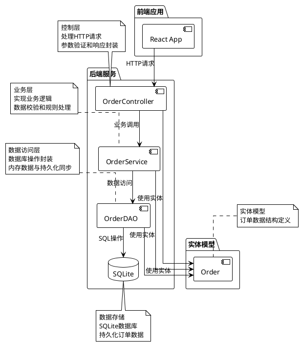
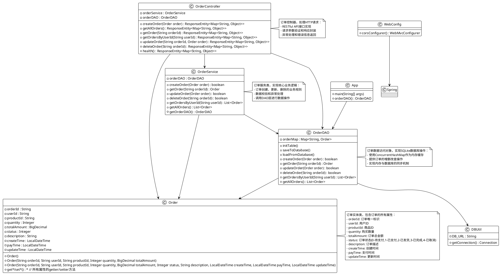

# 订单管理系统详细设计文档

## 1. 系统架构分析

### 1.1 技术架构全景图

本系统基于Spring Boot框架构建，采用经典的三层架构模式（Controller-Service-DAO），并使用SQLite作为数据存储。



### 1.2 模块依赖关系

系统由以下核心模块组成：

1. **Controller层** (`com.example.demo.controller`)
   - 接收HTTP请求
   - 参数验证和转换
   - 调用Service层处理业务
   - 封装并返回HTTP响应

2. **Service层** (`com.example.demo.service`)
   - 实现核心业务逻辑
   - 数据校验和业务规则处理
   - 调用DAO层进行数据操作

3. **DAO层** (`com.example.demo.dao`)
   - 数据访问接口实现
   - 内存数据与数据库同步
   - 提供统一的数据操作接口

4. **Entity层** (`com.example.demo.entity`)
   - 数据实体定义
   - 与数据库表结构对应

## 2. 核心类关系图

### 2.1 类继承体系

系统采用简洁的类结构设计，所有类均为具体实现类，没有复杂的继承关系：



## 3. 核心业务流程时序图

### 3.1 创建订单流程

```plantuml
@startuml
!theme plain

actor "客户端" as client
participant "OrderController" as controller
participant "OrderService" as service
participant "OrderDAO" as dao
database "SQLite" as db

client -> controller : POST /api/orders\n{订单信息}
controller -> service : createOrder(order)
note right: 校验订单参数\n(数量>0, 金额>0)
service -> dao : createOrder(order)
note right: 检查订单是否已存在\n设置创建时间\n存入内存Map
dao --> service : true/false
service --> controller : true/false
controller -> dao : saveToDatabase()
dao -> db : INSERT OR REPLACE
dao --> controller : 
controller -> client : HTTP 201 CREATED\n或错误响应

note top of client
  业务规则:
  1. 购买数量必须大于0
  2. 订单金额必须大于0
  3. 不能创建重复订单
end note
@enduml
```

### 3.2 查询订单流程

```plantuml
@startuml
!theme plain

actor "客户端" as client
participant "OrderController" as controller
participant "OrderService" as service
participant "OrderDAO" as dao

client -> controller : GET /api/orders/{orderId}
controller -> service : getOrder(orderId)
service -> dao : getOrder(orderId)
dao --> service : Order/null
service --> controller : Order/null
controller -> client : HTTP 200 OK + 订单信息\n或404 NOT FOUND

note top of client
  业务规则:
  1. 如果订单存在，返回订单详情
  2. 如果订单不存在，返回404错误
end note
@enduml
```

### 3.3 更新订单流程

```plantuml
@startuml
!theme plain

actor "客户端" as client
participant "OrderController" as controller
participant "OrderService" as service
participant "OrderDAO" as dao
database "SQLite" as db

client -> controller : PUT /api/orders/{orderId}\n{订单信息}
controller -> service : updateOrder(order)
note right: 校验更新规则\n(已完成订单不能修改)
service -> dao : getOrder(orderId)
dao --> service : existingOrder
service -> dao : updateOrder(order)
note right: 检查订单是否存在\n设置更新时间\n更新内存Map
dao --> service : true/false
service --> controller : true/false
controller -> dao : saveToDatabase()
dao -> db : INSERT OR REPLACE
dao --> controller : 
controller -> client : HTTP 200 OK\n或错误响应

note top of client
  业务规则:
  1. 已完成订单(status=3)不能修改
  2. 只能更新存在的订单
end note
@enduml
```

### 3.4 删除订单流程

```plantuml
@startuml
!theme plain

actor "客户端" as client
participant "OrderController" as controller
participant "OrderService" as service
participant "OrderDAO" as dao
database "SQLite" as db

client -> controller : DELETE /api/orders/{orderId}
controller -> service : deleteOrder(orderId)
note right: 校验删除规则\n(已支付订单不能删除)
service -> dao : getOrder(orderId)
dao --> service : order
service -> dao : deleteOrder(orderId)
note right: 检查订单是否存在\n从内存Map中移除
dao --> service : true/false
service --> controller : true/false
controller -> dao : saveToDatabase()
dao -> db : INSERT OR REPLACE
dao --> controller : 
controller -> client : HTTP 200 OK\n或错误响应

note top of client
  业务规则:
  1. 已支付订单(status=1)不能删除
  2. 只能删除存在的订单
end note
@enduml
```

## 4. 数据库设计

### 4.1 表结构设计

系统使用SQLite数据库，订单信息存储在`order0713`表中：

```sql
CREATE TABLE IF NOT EXISTS order0713(
  orderId TEXT PRIMARY KEY, 
  userId TEXT, 
  productId TEXT, 
  quantity INTEGER, 
  totalAmount TEXT, 
  status INTEGER, 
  description TEXT, 
  createTime TEXT, 
  payTime TEXT, 
  updateTime TEXT
);
```

### 4.2 字段说明

| 字段名 | 类型 | 说明 |
|--------|------|------|
| orderId | TEXT | 订单唯一标识，主键 |
| userId | TEXT | 用户ID |
| productId | TEXT | 商品ID |
| quantity | INTEGER | 购买数量 |
| totalAmount | TEXT | 订单总金额(BD格式) |
| status | INTEGER | 订单状态(0-待支付,1-已支付,2-已发货,3-已完成,4-已取消) |
| description | TEXT | 订单描述 |
| createTime | TEXT | 创建时间 |
| payTime | TEXT | 支付时间 |
| updateTime | TEXT | 更新时间 |

## 5. 专业术语词汇表

| 术语 | 说明 |
|------|------|
| Controller层 | 控制层，负责处理HTTP请求和响应 |
| Service层 | 业务层，实现核心业务逻辑 |
| DAO层 | 数据访问层，负责数据存取操作 |
| Entity | 实体类，与数据库表结构对应的Java对象 |
| RESTful API | 一种基于HTTP协议的API设计风格 |
| Spring Boot | 用于创建Spring应用的框架，简化了配置和部署 |
| SQLite | 轻量级的关系型数据库 |
| CORS | 跨域资源共享，解决前端跨域访问问题 |
| 内存同步 | 将内存中的数据与持久化存储保持一致的机制 |

## 6. 数据模型使用手册

### 6.1 Order实体模型

Order类是系统中的核心数据模型，包含了订单的所有属性和相关操作方法。

主要属性包括：
- orderId: 订单唯一标识
- userId: 用户ID
- productId: 商品ID
- quantity: 购买数量
- totalAmount: 订单总金额
- status: 订单状态
- description: 订单描述
- createTime: 创建时间
- payTime: 支付时间
- updateTime: 更新时间

### 6.2 订单状态定义

系统中订单状态使用整数表示：
- 0: 待支付
- 1: 已支付
- 2: 已发货
- 3: 已完成
- 4: 已取消

## 7. 业务逻辑公式手册

### 7.1 校验规则

1. **订单创建校验**：
   - 购买数量必须大于0：`quantity > 0`
   - 订单金额必须大于0：`totalAmount > 0`

2. **订单更新校验**：
   - 已完成订单(status=3)不能修改

3. **订单删除校验**：
   - 已支付订单(status=1)不能删除

### 7.2 查询规则

1. **用户订单查询**：
   - 根据userId精确匹配
   - 按创建时间降序排列

2. **所有订单查询**：
   - 返回所有订单
   - 按创建时间降序排列

## 8. 开发实践指南

### 8.1 设计模式应用

1. **三层架构模式**：
   - 分离关注点，提高代码可维护性
   - Controller处理HTTP请求
   - Service实现业务逻辑
   - DAO负责数据访问

2. **依赖注入模式**：
   - 通过Spring的@Autowired实现组件间依赖
   - 提高代码的可测试性和可维护性

3. **单例模式**：
   - Spring管理的Bean默认为单例模式
   - 节省系统资源

### 8.2 最佳实践

1. **异常处理**：
   - 统一异常处理机制
   - 合理的HTTP状态码返回

2. **跨域支持**：
   - 通过WebConfig配置CORS支持
   - 允许前端跨域访问

3. **数据持久化**：
   - 内存与数据库同步机制
   - 使用ConcurrentHashMap保证线程安全

### 8.3 常见陷阱

1. **时间格式处理**：
   - 注意时间格式的解析和序列化
   - 处理可能的时间格式异常

2. **并发访问**：
   - 使用线程安全的集合类
   - 注意数据库操作的并发控制

3. **数据一致性**：
   - 及时同步内存与数据库数据
   - 在数据变更后调用saveToDatabase方法